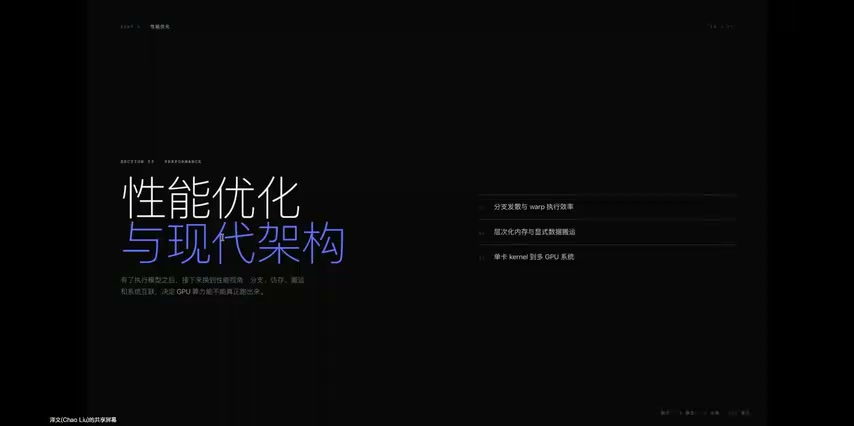
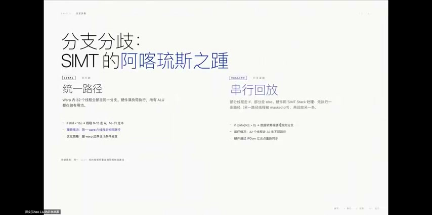
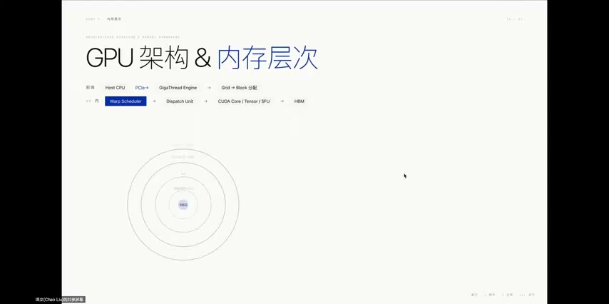
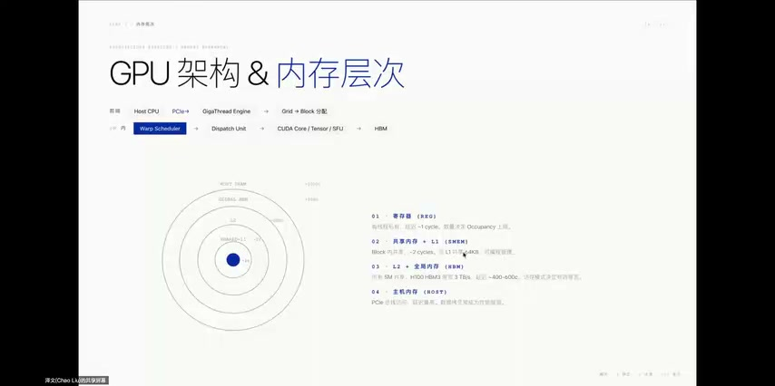
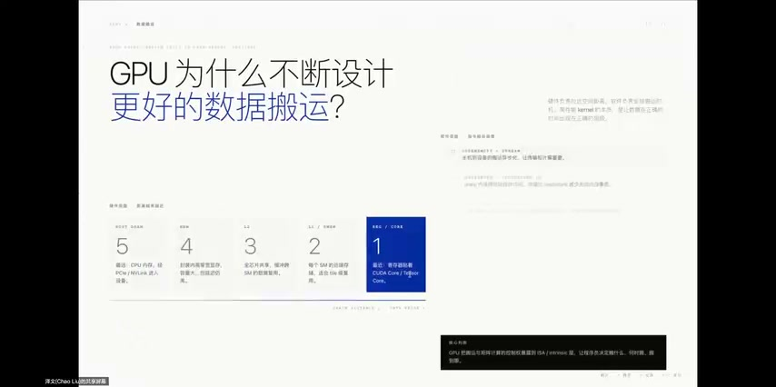
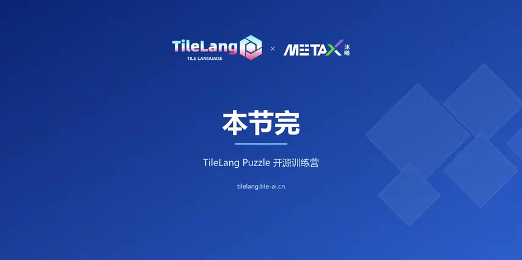

# [P08] GPGPU核心技术 - 性能优化(上)·分支发散与内存层次

> **演讲者**：泽文（HPC & AI加速硬件方向）  
> **日期**：2026年5月19日  
> **活动**：TileLang Puzzle 算子开发实战营 第一课（续）  

---

## 一、完整的算子下发流程（Kernel Dispatch）





从主机端写下一行 Kernel 调用到 GPU 返回结果，完整路径如下：

### 软件栈（Host 侧）

```
应用程序调用 Kernel
  → CUDA Runtime
    → CUDA Driver API
      → 包装为 Command → 放入 Command Queue
```

### 数据搬运

- `cudaMemcpy`：Host → GPU HBM（通过 PCIe 或 NVLink）
- **性能瓶颈**：GPU 计算可能只需几十微秒，但数据传输可能需要几毫秒

### GPU 内部执行步骤

| 步骤 | 内容 |
|------|------|
| ① 任务分发 | Grid 拆分为 Block → 分配到空闲 SM |
| ② Warp 调度 | 每个周期选出就绪 Warp → Dispatch Unit 下发指令 |
| ③ 执行单元 | FP32/INT32 → CUDA Core；矩阵乘 → Tensor Core；超越函数 → SFU；访存 → LSU |
| ④ 数据通路 | 数据在寄存器 ↔ Shared Memory ↔ Cache ↔ HBM 之间流转 |
| ⑤ 结果回传 | `cudaMemcpy` Device → Host |

### 核心优化思路

> 利用 CUDA Stream 让**计算与数据传输流水线重叠**：GPU 算当前批次时，同时预取下一批数据

---

## 二、GPU 性能优化四大支柱



| 支柱 | 要点 |
|------|------|
| **并行度（Occupancy）** | 确保足够多的 Block 占满 SM；Grid 太小 → SM 空闲；Grid 太大 → 调度开销上升 |
| **减少分支发散** | 同一 Warp 内线程走同一路径；按 Warp 边界设计分支，而非按线程边界 |
| **访存合并（Coalescing）** | 连续地址的线程访问全局内存 → 硬件可做缓存合并；非合并访问性能下降数倍~数十倍 |
| **数据复用** | 频繁访问的数据放 SRAM / 寄存器；用空间换访存次数 |

### 四者相互制约

- 增加 Shared Memory 使用（数据复用↑）→ 每个 Block 占用资源增多 → SM 上可驻留 Block 减少 → Occupancy↓
- **性能优化本质 = 在四个支柱间做权衡（Trade-off）**
- 不同应用场景需要不同的平衡点

---

## 三、多节点互联（Multi-GPU Interconnect）



### 为什么需要高互联带宽

- 单卡 GPU 不够用时 → 多 GPU 协同
- 互联带宽往往是比单卡算力更关键的瓶颈（木桶短板效应）
- 大模型训练中 GPU 间需频繁交换梯度数据

### NVLink 演进（2016 → 2026）

| 时间 | 代际 | 带宽 |
|------|------|------|
| 2016 | NVLink 1.0 | 160 GB/s |
| 2026 | NVLink (Rubin) | 3600 GB/s |

> 10 年增长 **22.5 倍**，远超摩尔定律

### NVSwitch 与全互联

- 点对点 NVLink 连接有限 → NVSwitch 提供交换中心实现任意全互联
- **GB200 NVL72**（Blackwell 时代）：一个液冷机柜塞下 72 GPU + 32 CPU
- 系统带宽从 1.8 TB/s 拉到 **130 TB/s**

### 跨节点通信

- **RDMA**（Remote Direct Memory Access）+ InfiniBand 网络
- 数据绕过远端 CPU，直接访问对端 GPU 内存
- 减少数据拷贝和上下文切换

---

## 四、GPU 架构演进



| 年份 | 架构 | 里程碑 |
|------|------|--------|
| 2006 | **G80（Tesla）** | 128 个流处理器，CUDA 诞生 |
| 2010 | **Fermi** | 第一个完整 GPU 计算架构：真正 L1/L2 Cache、双精度浮点 → 科学计算社区大规模使用 |
| 2017 | **Volta（V100）** | 引入 **Tensor Core**（专用矩阵乘加单元）→ 深度学习训练性能飞跃 |
| 2024 | **Blackwell** | 双芯片封装、FP4 低精度、系统级规模支撑 → 不再讨论单卡，而是机柜/集群 |

---

## 五、GPU vs ASIC/DSA



### ASIC（领域专用加速器）

- 代表：**Google TPU**
- 核心 = 大量乘加单元组成的**脉动阵列（Systolic Array）**
- 数据像流水一样从阵列一边流向另一边 → 矩阵乘吞吐量极高
- 数据从 Host → Infit 队列 → 计算 → Outfit 队列，大幅减少反复访存
- **缺点**：编程灵活性低

### NVIDIA 的路线：通用 GPU + 专用单元

- Tensor Core 集成在 GPU 的每个 SM 内（Volta 起）
- H100：支持 FP8 + 专用 Transformer Engine
- 保持通用性的同时获得专用加速

### AMD 的路线：小芯片 + 大容量 HBM

- Chiplet（小芯片）设计 + MI300X
- HBM 容量达 H100 的 2.4 倍
- 大模型推理场景有优势

### 趋势

> 通用性与专用性的界限在逐渐模糊，由软件需求决定

- 在通用 GPU 上集成/外挂专用单元（矩阵乘、稀疏计算、注意力机制）
- DSA（Domain-Specific Accelerator）成为 GPGPU 的重要补充

---

## 总结：一条主线

> **数据在哪里 → 怎么搬 → 怎么算 → 怎么让硬件持续忙起来**

带着这条主线去写算子、做 TileLang 练习，后续课程会轻松很多。

---

## Key Terms

| 术语 | 含义 |
|------|------|
| Kernel Dispatch | 从 Host 调用到 GPU 执行并返回结果的完整流程 |
| Command Queue | CUDA Driver 将 Kernel 包装为命令放入的队列 |
| Coalescing | 连续地址线程的访存请求被硬件合并为一次事务 |
| NVLink | NVIDIA GPU 间高速点对点互联 |
| NVSwitch | 多 GPU 全互联交换芯片 |
| RDMA | 远程直接内存访问，绕过远端 CPU |
| Systolic Array | 脉动阵列，数据流水式通过乘加单元 |
| DSA | Domain-Specific Accelerator，领域专用加速器 |
| Chiplet | 小芯片设计，多 die 封装为单芯片 |
| Tensor Core | GPU SM 内专用矩阵乘加硬件单元 |
