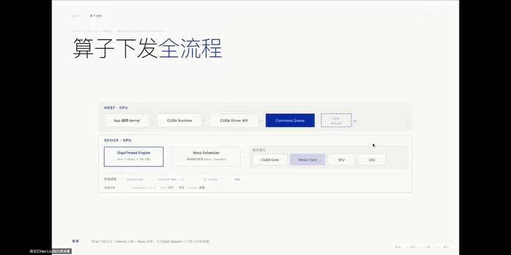
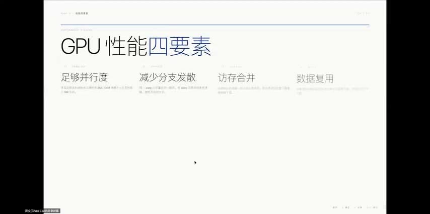
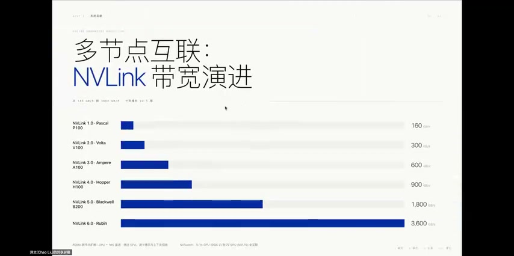
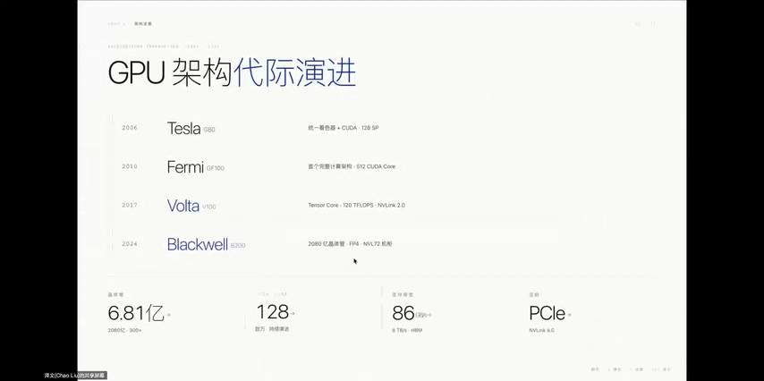
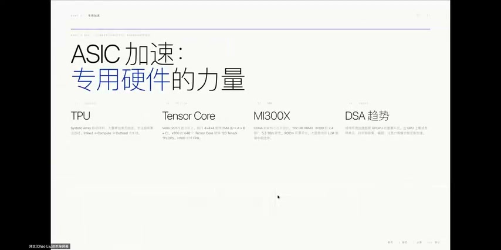
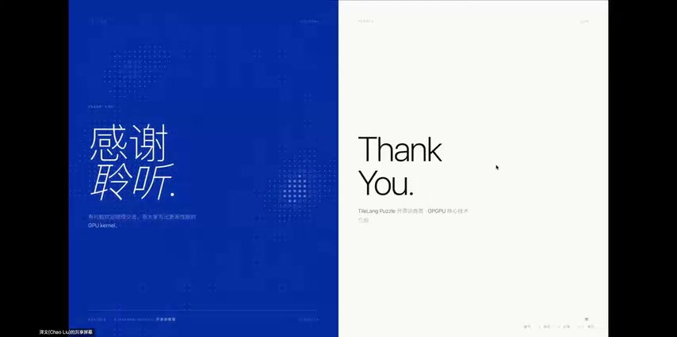

# [P09] GPGPU核心技术 - 性能优化(下)·算子下发与优化四支柱

> **演讲者**：泽文（HPC & AI加速硬件方向）  
> **日期**：2026年5月19日  
> **活动**：TileLang Puzzle 算子开发实战营 第一课（续）  

---

## 一、算子下发全流程（Kernel Dispatch）



从主机端写下一行 Kernel 调用，到 GPU 执行完毕返回结果，完整路径：

### Host 侧（软件栈）

```
App / Kernel 调用
  → CUDA Runtime
    → CUDA Driver API
      → 包装为 Command → 放入 Command Queue
```

### 数据搬运（Host → Device）

- `cudaMemcpy`：Host 内存 → GPU HBM（经 PCIe 或 NVLink）
- **关键瓶颈**：GPU 计算可能只需几十微秒，数据传输却需几毫秒

### GPU 内部执行

| 阶段 | 说明 |
|------|------|
| ① 任务分发 | GigaThread Engine 将 Grid 拆为 Block，分配到空闲 SM |
| ② Warp 调度 | 每周期选出就绪 Warp（32 threads），由 Dispatch Unit 下发指令 |
| ③ 执行单元 | CUDA Core（FP32/INT32）· Tensor Core（矩阵乘）· SFU（超越函数）· LSU（访存） |
| ④ 数据通路 | 数据在 Register ↔ Shared Memory ↔ L1/L2 Cache ↔ HBM 间流转 |
| ⑤ 结果回传 | `cudaMemcpy` Device → Host，CPU 取得结果 |

### 核心优化思路

> 利用 **CUDA Stream** 实现计算与数据传输的异步重叠：GPU 算当前批次时，同时预取下一批数据

- PCIe 传输 → Kernel 计算 → Warp 调度，均由 CUDA Stream 异步编排

---

## 二、GPU 性能四要素（优化四支柱）



| 要素 | 核心要点 |
|------|----------|
| **足够并行度** | 保证足够多的 Block（如 2048 或 64K）占满所有 SM；Grid 太小 → SM 空闲；太大 → 调度开销上升 |
| **减少分支发散** | 避免 Warp 内线程走不同路径（否则串行化）；按 Warp 边界设计分支 |
| **访存合并** | 地址对齐 + 连续访问模式 → 多 thread 同时访问连续内存块 → 硬件合并为一次事务；非合并访问性能下降数倍~数十倍 |
| **数据复用** | 频繁访问的数据放 SRAM / 寄存器；用空间换访存次数 |

### 四者相互制约

- 增加 Shared Memory（数据复用↑）→ 每 Block 资源占用↑ → SM 可驻留 Block↓ → Occupancy↓
- **性能优化本质 = 在四要素间做 Trade-off**
- 需根据不同应用场景选择不同平衡点

---

## 三、多节点互联：NVLink 带宽演进



### 为什么互联带宽是关键

- 单卡不够 → 多 GPU 协同；互联带宽是木桶最短板
- 大模型训练需频繁交换梯度数据；互联不够快 → 算力再强也在等数据

### NVLink 代际带宽

| 代际 | 架构 | 带宽 |
|------|------|------|
| NVLink 1.0 | Pascal P100 | 160 GB/s |
| NVLink 2.0 | Volta V100 | 300 GB/s |
| NVLink 3.0 | Ampere A100 | 600 GB/s |
| NVLink 4.0 | Hopper H100 | 900 GB/s |
| NVLink 5.0 | Blackwell B200 | 1,800 GB/s |
| NVLink 6.0 | Rubin | 3,600 GB/s |

> 10 年增长 **22.5 倍**，远超摩尔定律

### NVSwitch 全互联

- NVLink 点对点有限 → NVSwitch 交换中心实现任意 GPU 全互联
- **GB200 NVL72**：72 GPU + 32 CPU 液冷机柜，系统带宽 130 TB/s

### 跨节点：RDMA + InfiniBand

- 绕过远端 CPU，直接访问对端 GPU 内存
- 减少数据拷贝和上下文切换

---

## 四、GPU 架构代际演进



| 年份 | 架构 | 里程碑 |
|------|------|--------|
| 2006 | **Tesla（G80）** | 统一架构 + CUDA 诞生，128 SP |
| 2010 | **Fermi（GF100）** | 首个完整计算架构：L1/L2 Cache、双精度浮点、512 CUDA Core → 科学计算大规模使用 |
| 2017 | **Volta（V100）** | 引入 Tensor Core · 120 TFLOPS · NVLink 2.0 → 深度学习训练飞跃 |
| 2024 | **Blackwell（B200）** | 2080 亿晶体管 · FP4 · NVL72 机柜级 → 不再讨论单卡，而是集群 |

---

## 五、ASIC 加速：专用硬件的力量



### Google TPU（脉动阵列）

- 大量乘加单元组成 **Systolic Array**，数据流水式通过
- 矩阵乘吞吐量极高；大幅减少反复访存
- 缺点：编程灵活性低

### NVIDIA Tensor Core（通用 GPU + 专用单元）

- Volta（2017）起集成在每个 SM 内
- 支持 FP16/INT8/FP32/TF32；H100 增加 FP8 + Transformer Engine
- 保持通用性 + 获得专用加速

### AMD MI300X（小芯片 + 大 HBM）

- Chiplet 设计，192 GB HBM3
- HBM 容量达 H100 的 2.4 倍 → 大模型推理优势

### DSA 趋势

> 通用性与专用性的界限在逐渐模糊，由软件需求驱动

- 在通用 GPU 上集成/外挂专用单元（矩阵乘、稀疏、注意力）
- DSA 成为 GPGPU 的重要补充

---

## 总结：一条主线

> **数据在哪里 → 怎么搬 → 怎么算 → 怎么让硬件持续忙起来**



带着这条主线写算子、做 TileLang Puzzle 练习，后续课程会轻松很多。

---

## Key Terms

| 术语 | 含义 |
|------|------|
| Kernel Dispatch | 从 Host 调用到 GPU 执行并返回结果的完整流程 |
| GigaThread Engine | GPU 顶层调度引擎，负责 Grid → Block → SM 分配 |
| Command Queue | CUDA Driver 将 Kernel 包装为命令放入的队列 |
| Coalescing（访存合并） | 连续地址线程的访存请求被硬件合并为一次事务 |
| NVLink | NVIDIA GPU 间高速点对点互联 |
| NVSwitch | 多 GPU 全互联交换芯片 |
| RDMA | 远程直接内存访问，绕过远端 CPU |
| Systolic Array | 脉动阵列，数据流水式通过乘加单元 |
| DSA | Domain-Specific Accelerator，领域专用加速器 |
| Chiplet | 小芯片设计，多 die 封装为单芯片 |
