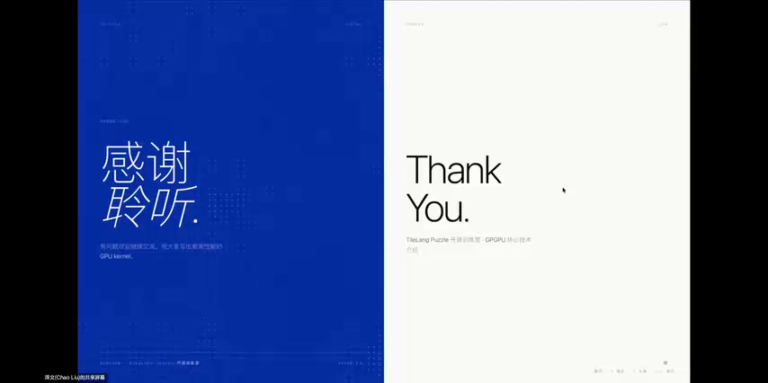
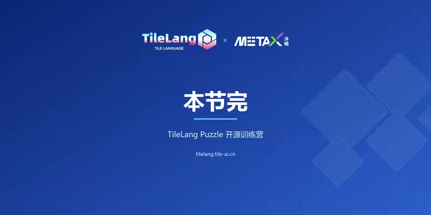

# [P10] GPGPU核心技术 - 课程答疑

> **演讲者**：泽文 + 主持人  
> **日期**：2026年5月19日  
> **活动**：TileLang Puzzle 算子开发实战营 第一课 Q&A  

---

## 概述

本节为 GPGPU 核心技术课程（P06-P09）的答疑环节，泽文老师回答学员提问。

---

## Q&A 精选

### Q1：Grid 大小怎么确定？（Nsight 报告 Small Grid）

- 需要针对**自己使用的硬件**查看硬件特征，再做专用优化
- AI 加速硬件迭代很快，每代架构参数和指令集都有变化
- 后续课程使用沐曦 GPU → 必须熟读其 Hardware Datasheet 和开发手册
- 推荐结合 **AI Agent** 辅助解决具体硬件适配问题

### Q2：手写 Kernel vs Agent 生成 Kernel？

- 类比：编译器出来后仍有人手写汇编（高性能 / 细粒度控制场景）
- Agent 降低开发门槛：通用、普世化算子不必手写
- 高要求性能 / 精细化控制场景仍需手写
- **Agent 是能力放大器，关键还是自身本领**

### Q3：超大内存应用有没有 Out-of-Core 方法？

- 单卡放不下 → 需要多卡通信机制
- 最常见：RDMA 网卡实现多卡互联，避免 CPU 参与
- 直接内存搬运 → 拼出满足超大内存需求的多卡环境

### Q4：入门写算子，是否先从简单算子开始？

- 基本功需要，但建议**结合具体应用场景、带着问题入手**
- 后续课程提供大量实践场景和专门实验

### Q5：Triton / CUTLASS / CUDA 学哪个？

- **CUDA** 最经典，适合用"技术发展历史观"学习演进过程
- 从最古老的技术栈作为跳板 → 逐步学到最新 → 清楚新技术补足了哪些短板
- 也可直接基于最新框架学习（已帮你踩完前面的坑）
- 学习链路较长 vs 高效进入状态，各有利弊

### Q6：Python 基础可以但完全不懂 CUDA？

- 可以直接上手 **TileLang**（Python DSL）
- CUDA 更底层，用 C/C++ 开发，需直面复杂内存层次和硬件细节
- 不同卡还不一样 → TileLang 屏蔽了这些复杂性

### Q7：国产芯片 Triton 支持好还是 TileLang 好？

- 不同厂家支持力度不同，需根据具体型号调研
- 看哪些国产芯片在哪个社区活跃
- 本训练营推荐用 **TileLang**

### Q8：什么情况下需要自己开发算子？

- 一般框架和算子库很成熟，不需要手动开发
- 需要手写的场景：
  1. **极致性能优化**
  2. **芯片厂商上游**：为新硬件适配专有算子
  3. **推理性能优化**（Token 经济学）：决定模型上限

---

## Key Terms

| 术语 | 含义 |
|------|------|
| Small Grid | Nsight 性能分析器报告的 Grid 规模不足警告 |
| Out-of-Core | 数据超出单卡显存时的分批/多卡处理策略 |
| RDMA | 远程直接内存访问，多卡互联避免 CPU 参与 |
| TileLang | Python DSL，屏蔽底层硬件差异的算子开发框架 |
| Token 经济学 | 推理成本与效率的优化经济学 |
