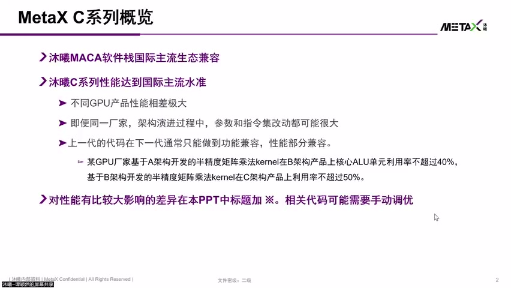
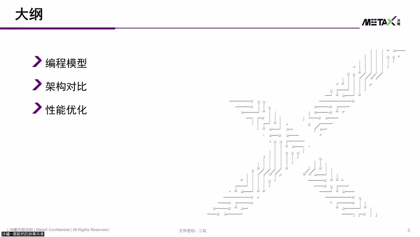
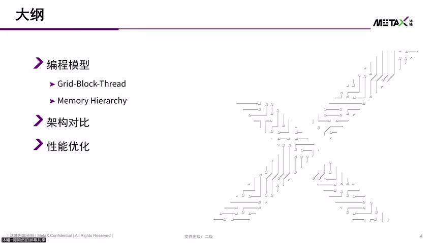
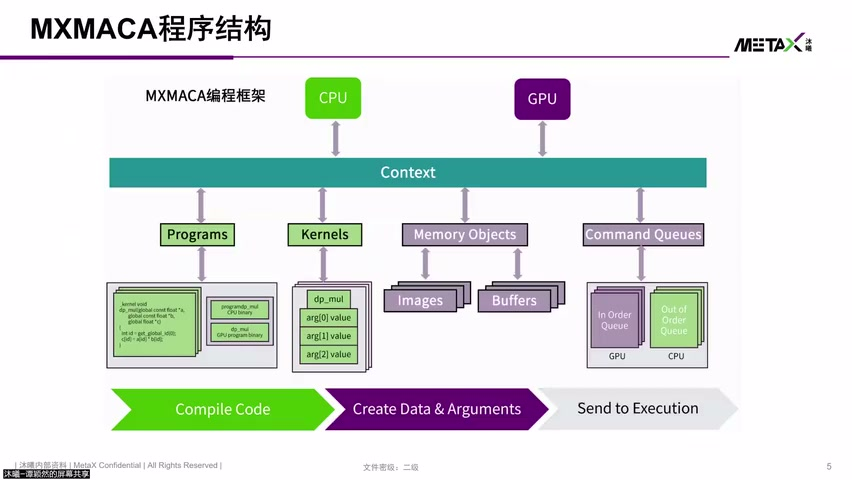
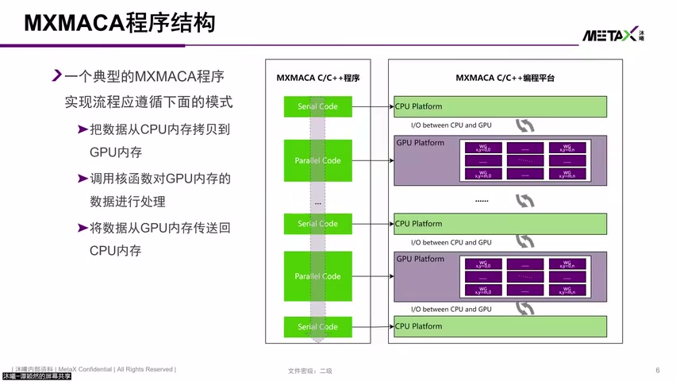
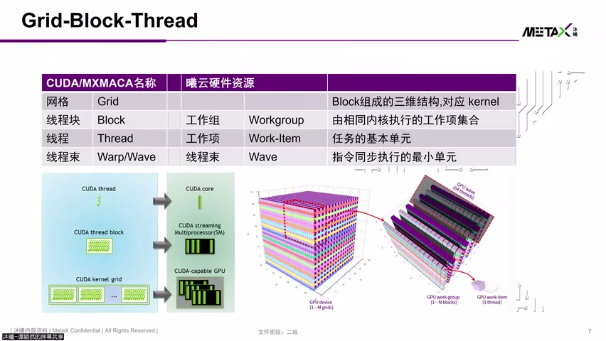
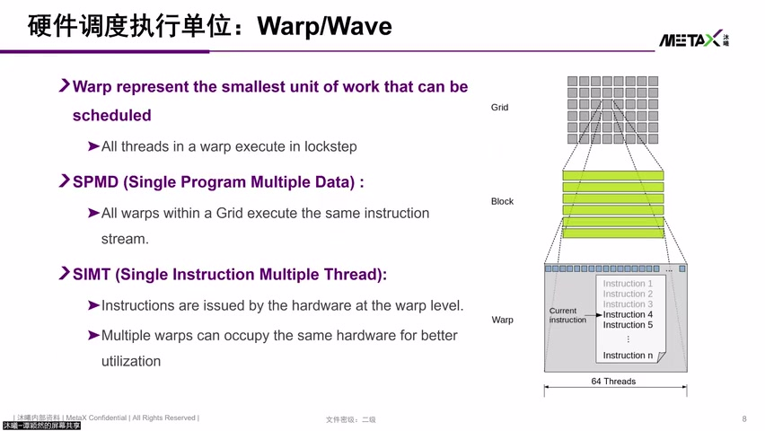
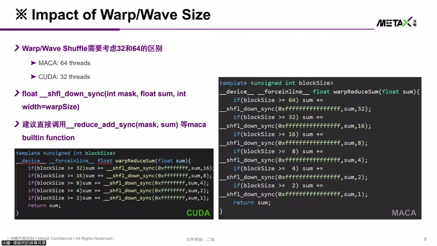
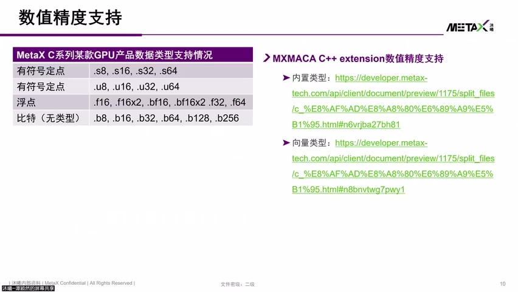

# [P11] 国产GPU核心架构与硬件加速指令对比解析 - MetaX C系列概览与编程模型·线程层级与SIMT

> **演讲者**：谭颖然（沐曦研究院）  
> **日期**：2026年5月  
> **活动**：TileLang Puzzle 算子开发实战营 第二课  

---

## 一、MetaX C系列概览




### 定位

- 沐曦码卡软件栈兼容国际主流生态（CUDA 兼容）
- MetaX C系列性能达国际主流 GPU 水准

### 重要提醒：架构差异对性能的影响

- 不同 GPU 架构差异极大，即使同一厂家不同代际产品，参数和指令集改动都可能很大
- 上一代代码在下一代通常只能**功能兼容**，性能只能**部分兼容**
  - 例：基于 A 架构的 HGEMM kernel 在 B 架构上利用率可能 ≤ 40%
  - 基于 B 架构开发的 kernel 在 B 架构上才能表现最好
- 想看某代产品真实性能 → 需要基于**该架构**开发的核心代码
- PPT 中对性能影响大的差异用 **星号（*）** 标注，相关代码可能需要手动调优

### 课程大纲（三部分）

1. **编程模型**（Grid-Block-Thread + Memory Hierarchy）
2. **架构对比**
3. **性能优化**

---

## 二、MXMACA 程序结构





### 异构计算系统

- MXMACA 程序 = C/C++ 语言扩展 → 运行在异构计算系统
- 两类计算设备：**CPU**（Host）+ **GPU**（Device）
- 编译后分别得到 CPU 内核和 GPU 内核

### 执行流程

```
① 编译 → 得到 CPU/GPU 内核
② Create Data → 构造程序对象 + 内存对象 → 映射到内核参数
③ Command → 放入命令队列执行
   - CPU：Out-of-Order Queue
   - GPU：In-Order Queue
```

### 典型程序流程

1. 数据从 CPU 内存 → 拷贝到 GPU 显存
2. 调用 GPU Kernel 函数处理数据
3. 结果存到 GPU 显存
4. 数据从 GPU 显存 → 回传 CPU 内存

---

## 三、Grid-Block-Thread 三层编程模型





### 层级结构

| 层级 | 组成 | 运行位置 | 共享资源 |
|------|------|----------|----------|
| **Thread** | 基本执行单元 | — | 私有寄存器 |
| **Block（线程块）** | 若干 Thread | SM（计算核心） | Shared Memory |
| **Grid（网格）** | 若干 Block | 整个 GPU | Global Memory |

- 一个 Kernel 对应一个 Grid
- Grid / Block / Thread 均为**三维结构**
- 同一 Block 内的 Thread 可共享 SM 上的公共资源（如 Shared Memory）

### Warp / Wave（线程束）



- 介于 Thread 和 Block 之间的硬件调度单元
- **NVIDIA**：Warp = 32 threads
- **MetaX**：Wave = **64 threads**

---

## 四、SIMT 执行模型与 Lockstep



### Lockstep（锁步）机制

- 同一 Warp/Wave 内所有 Thread 共享同一条 Instruction
- 每次调度通过 **mask** 使能不同 Thread
- 即 **Single Instruction, Multiple Thread**

### Branch Divergence 处理

- 同一 Warp 内 Thread 走不同分支 → Divergence
- 解决方式：mask 分批执行
  1. 先执行分支 A（关闭 B 的线程）
  2. 再执行分支 B（关闭 A 的线程）
- 多次 Divergence → 性能下降

### 功能影响

- 同一 Warp 内 Thread 不允许做 Producer-Consumer 模型（无 Thread Switch 时可能**死锁**）
- Warp size 影响具体实现：
  - **Warp Reduce Sum**（shuffle 实现）：64 threads 和 32 threads 的迭代轮数不同
  - 代码需根据目标硬件的 Warp size 适配

---

## 五、MetaX 数据类型支持



### 支持的数值精度

| 类别 | 类型 |
|------|------|
| 有符号定点 | INT8, INT16, INT32, INT64 |
| 无符号定点 | UINT8, UINT16, UINT32, UINT64 |
| 浮点 | FP16, BF16, FP32, FP64 |
| 无类型 | 比特（raw bits） |

- 并非所有指令都支持全部精度，需对应特定指令
- MXMACA C++ 扩展能做到 **CUDA 兼容**



---

## Key Terms

| 术语 | 含义 |
|------|------|
| MXMACA | 沐曦的 CUDA 兼容编程框架（MetaX MACA） |
| MetaX C系列 | 沐曦面向通用计算的 GPU 产品线 |
| Wave | MetaX 的线程束概念，等价于 NVIDIA Warp，大小为 64 threads |
| Lockstep | 同一 Warp/Wave 内线程锁步执行同一指令 |
| SIMT | Single Instruction Multiple Thread，GPU 执行模型 |
| Divergence | 同一 Warp 内线程走不同分支导致串行化 |
| In-Order Queue | GPU 命令队列按序执行（vs CPU 的 Out-of-Order） |
| Shuffle | Warp 内线程间直接数据交换指令 |
