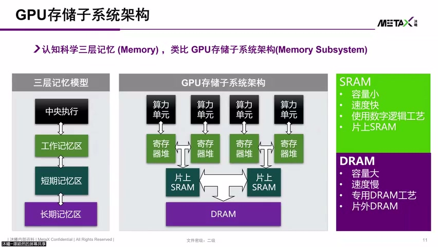
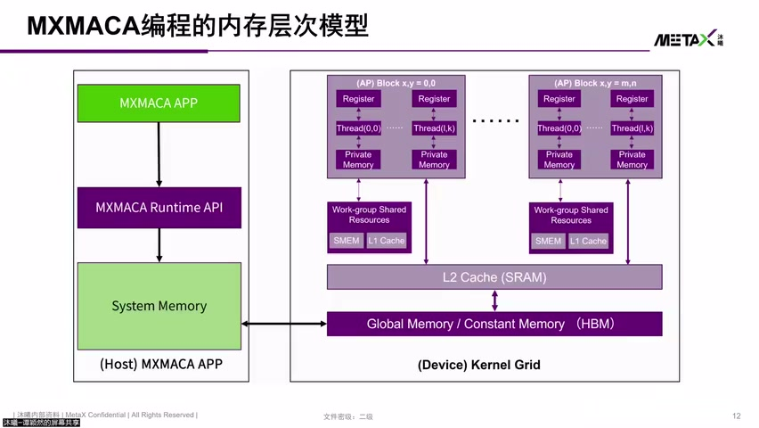
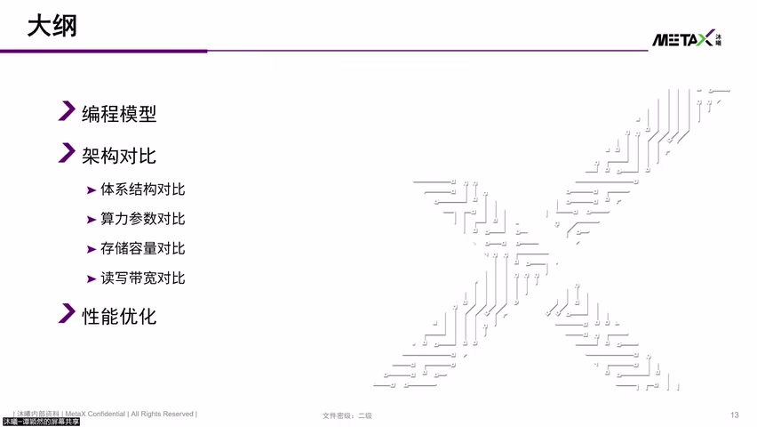
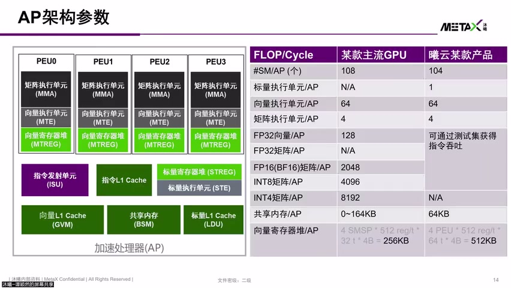
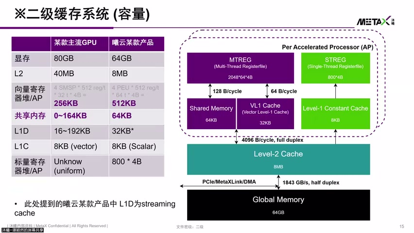
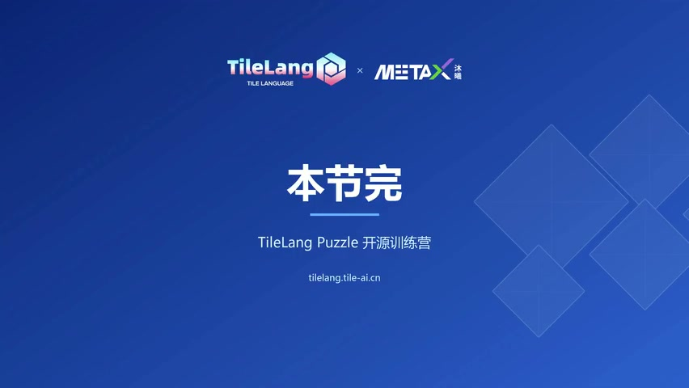

# [P12] 国产GPU核心架构与硬件加速指令对比解析 - 内存层次与架构对比·AP-PU与计算单元

> **演讲者**：谭颖然（沐曦研究院）  
> **日期**：2026年5月  
> **活动**：TileLang Puzzle 算子开发实战营 第二课（续）  

---

## 一、Memory Hierarchy 概念



### 类比人脑三层记忆

| 层级 | 类比 | GPU 对应 | 特点 |
|------|------|----------|------|
| 工作记忆 | 大脑即时处理 | **寄存器堆** | 最快，容量极小 |
| 短期记忆 | 近期信息 | **Shared Memory / Cache（SRAM）** | 快，容量有限 |
| 长期记忆 | 远期回忆 | **DRAM / HBM** | 容量大，速度慢 |

### SRAM vs DRAM

- **SRAM**：速度快，但面积大 → 容量小（寄存器堆、Cache、Shared Memory）
- **DRAM/HBM**：容量大，但算力单元直接访问会"数据供应不上"
- 新架构趋势：算力单元直接访问 Shared Memory（跨 Warp 数据重用场景）

---

## 二、MXMACA 内存层次模型



### 各层内存归属

| 内存类型 | 作用域 | 实现 | 控制方式 |
|----------|--------|------|----------|
| **Register** | Thread 私有 | SRAM | 编译器分配 |
| **Private Memory** | Thread 私有（Register 溢出） | DRAM | 自动 |
| **Shared Memory** | Block 内所有 Thread 共享 | SRAM | **软件可编程** |
| **L1 Cache** | AP 内 | SRAM（与 Shared Memory 可共享物理资源） | 硬件自动替换 |
| **L2 Cache** | 全 GPU | SRAM | 硬件自动 |
| **Global Memory** | 所有 Thread | HBM/DRAM | 软件管理 |
| **Constant Memory** | 只读 | 片上独立空间 | 只读指令访问 |

### Generic Memory

- MXMACA 支持 Generic Memory 访问：不用区分数据在哪一层
- 硬件 + 软件栈提供统一接口，用户无感访问

### Cache Coherence 注意

- CPU 中 L1/L2 一致性由硬件自动解决
- GPU 中因高吞吐需求，L1/L2 可**暴露在编程模型**中
- 对只读资源用 read-only 指令访问后，若强行改写 → 可能出现 **consistency 问题**

---

## 三、AP 架构详解（对标 NVIDIA SM）





### AP（Accelerate Processor）内部结构

```
AP（对标 NVIDIA SM）
├── 4 × PU（Processing Unit）
│   ├── FP32：16 threads/cycle（每 PU）
│   ├── MMA（矩阵执行单元）
│   ├── MT（向量执行单元）
│   └── MT Reg（向量寄存器堆）
├── 共享资源
│   ├── SReg（标量寄存器堆）
│   ├── SST（标量执行单元）
│   ├── I-Cache L1（指令缓存）
│   ├── BBSM（Block-level Shared Memory）
│   ├── Scalar L1 Cache（Read-Only）
│   └── 发射单元（共享）
└── Vector L1 Cache（数据缓存 / Streaming Cache）
```

- 整体 AP：64 threads/cycle FP32（乘累加 ×2 = 128 FLOP/cycle）
- **MetaX Wave = 64 threads**（vs NVIDIA Warp = 32）

---

## 四、架构参数对比（MetaX vs 主流 GPU）



| 参数 | 主流 GPU（NVIDIA） | MetaX C系列某产品 |
|------|-------------------|-------------------|
| 核数量 | 108 SM | 104 AP |
| Shared Memory | 0~164 KB（可配置） | **64 KB** |
| 向量寄存器堆 | 支持 32 threads × 512 reg | 支持 64 threads × 512 reg → **容量翻倍** |
| L1 Cache | 数据缓存 | Streaming Cache（数据中转） |
| 计算单元类型 | CUDA Core + Tensor Core | 标量 + 向量 + 矩阵（MMA） |

### 关键性能影响

- **核数未占满** → 利用率显著下降（Grid 对齐很重要）
- 算力参数可通过 Benchmark 测出（官网未公开全部数据）
- 寄存器堆容量更大（因 Wave=64 是 Warp=32 的两倍）



---

## Key Terms

| 术语 | 含义 |
|------|------|
| AP（Accelerate Processor） | MetaX 的计算核心，对标 NVIDIA SM |
| PU（Processing Unit） | AP 内的处理子单元，每 AP 含 4 个 PU |
| MMA | Matrix Multiply-Accumulate，矩阵乘加执行单元 |
| BBSM | Block-level Shared Memory，块级共享内存 |
| Private Memory | 寄存器溢出时 Thread 私有的 DRAM 空间 |
| Generic Memory | 统一内存访问模型，无需区分具体层级 |
| Streaming Cache | L1 作为数据中转和缓存的流式工作模式 |
| Wave | MetaX 线程束（64 threads），对标 NVIDIA Warp（32） |
