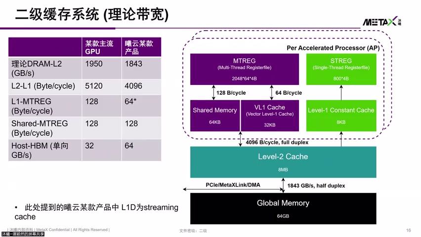
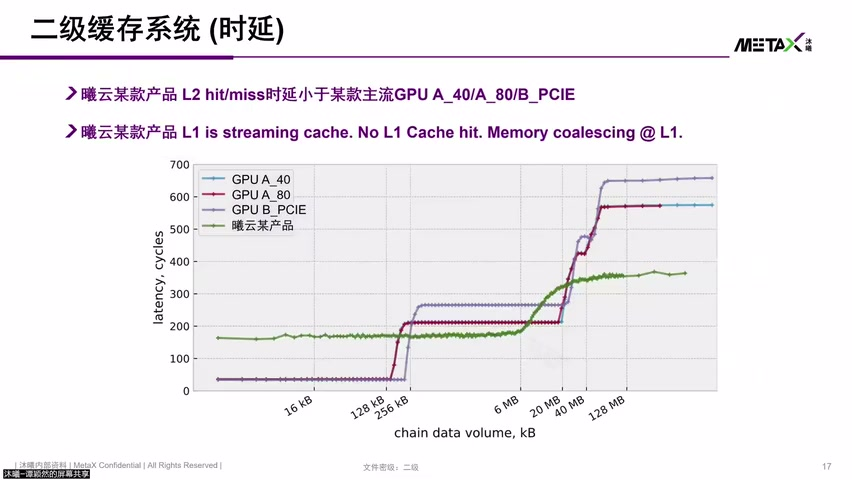
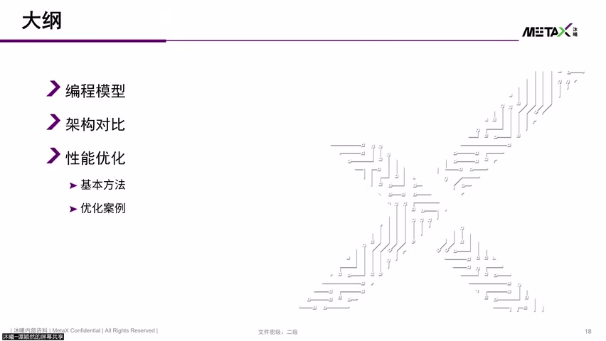
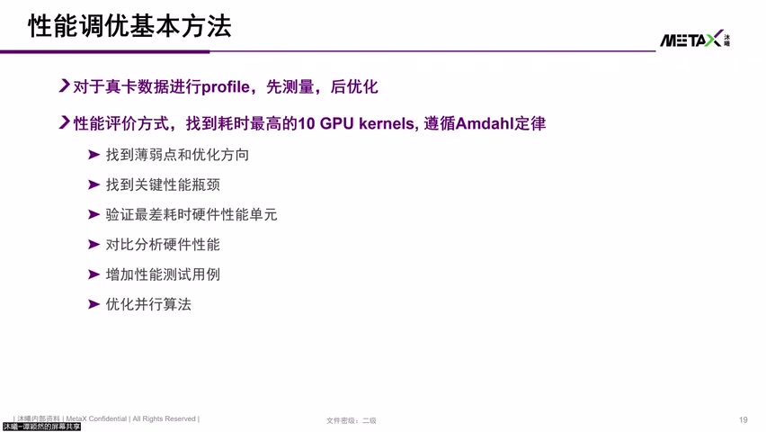
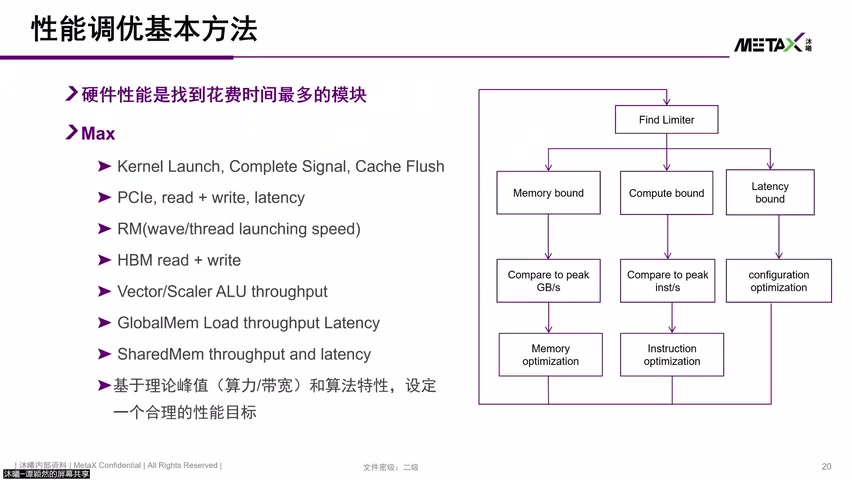
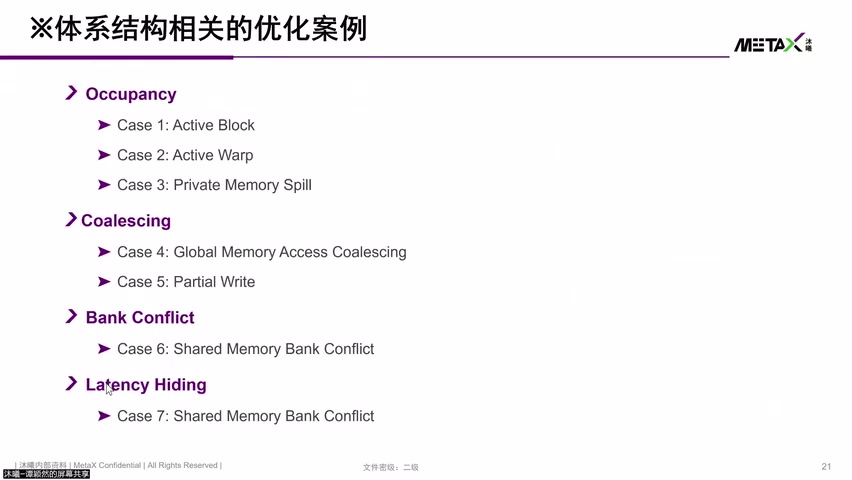
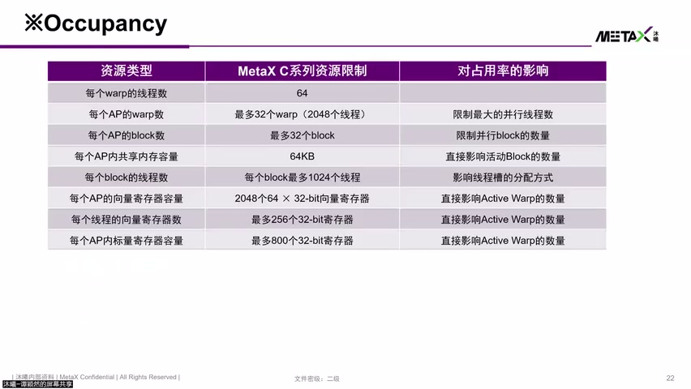

# [P13] 国产GPU核心架构与硬件加速指令对比解析 - 存储带宽对比与性能优化方法论

> **演讲者**：谭颖然（沐曦研究院）  
> **日期**：2026年5月  
> **活动**：TileLang Puzzle 算子开发实战营 第二课（续）  

---

## 一、存储带宽对比



### 各层级带宽（MetaX vs 主流 GPU）

| 路径 | MetaX 表现 |
|------|-----------|
| DRAM → L1 Cache | 接近主流（byte/cycle 量级相当） |
| L2 → L1 | 同一量级 |
| L1 → Vector Register（GPR） | 相对弱一些，但**寄存器容量大**可弥补 |
| Shared Memory → Register | 带宽一致 |
| Host → HBM（单向） | MetaX **更大** |

### Cache 延迟对比



- MetaX L1 是 **Streaming Cache**（仅提供 streaming 数据读取 + outstanding 能力）
- MetaX **L2 hit/miss 延迟 < 主流 GPU**（对比 GPU A / GPU B 均优）
- 通过延迟测试曲线可反推不同 Cache 的容量

---

## 二、性能优化基本方法





### 调试流程

```
① Profile 先行 → 真卡跑 Kernel，测量性能摸底
② 找耗时最高的 GPU Kernel → 优先优化占比最大的
③ 找关键性能瓶颈 → 通常与访存有关
④ 对比硬件性能极限 → 带宽 × 算力 → 天然瓶颈
⑤ 补充 Benchmark → 官网未公开的参数（如 ALU 算力）
⑥ 发挥超标量能力 → 尽量多用 ALU 单元
```

### 核心原则

> 优化**耗时占比最高**的 Kernel，效果远大于优化耗时最小的

---

## 三、硬件相关性能瓶颈点



| 瓶颈类型 | 说明 |
|----------|------|
| Kernel Launch | 发射阶段的延迟 |
| Cache Flush 频繁 | L1/L2 miss → 不得不从 HBM/DRAM 读数据 |
| PCIe 读写保序 | 读写混合时保序导致延迟增加 |
| HBM 读写混合 | Memory Controller 无法 pipeline → 先读完再写 → 延迟增大 |
| Vector/Scalar LSU | 需了解 throughput，判断是向量还是标量访存成为瓶颈 |
| Global Memory | throughput + latency 是关注重点 |
| Shared Memory | 容量有限，竞争时成为瓶颈 |

---

## 四、围绕硬件参数的优化（4 点 7 案例）





### ① 资源占用（Occupancy）

- **用不满**：Grid 太小 / Block 配置不当 → SM/AP 空闲
- **用超了**：寄存器 / Shared Memory 超限 → 溢出到 Private Memory → 性能骤降

### ② 访存合并（Coalescing）

- 请求被拆成一笔一笔单笔操作 → 无法达到 GPU high throughput
- Latency 暴露明显 → 性能差
- 优化：让更多访存请求**并发下发**或**合并下发**

### ③ Bank Conflict

- A 和 B 竞争同一块资源 → 一次只能响应一个 → 串行访问
- 优化：算法/软件层面让 A 和 B 在同一时间访问**不同资源**
- 一个周期内拿回所需数据 → 消除冲突

### ④ Latency Hiding

- Global Memory 延迟达**几百~上千 cycle**
- 通过并发 Warp/Wave 切换隐藏延迟
- 让计算单元在等待数据时执行其他 Warp 的指令


---

## Key Terms

| 术语 | 含义 |
|------|------|
| Streaming Cache | MetaX L1 工作模式，仅提供流式数据读取和 outstanding 能力 |
| Profile | 在真卡上测量 Kernel 性能数据的过程 |
| Coalescing | 多个线程的访存请求合并为一次高吞吐事务 |
| Bank Conflict | 多线程同时访问 Shared Memory 同一 Bank 导致串行化 |
| Latency Hiding | 利用多 Warp 切换隐藏长延迟（如 Global Memory 访问） |
| Outstanding | 未完成的访存请求数量，反映并发访存能力 |
| Memory Controller | HBM 读写调度器，读写混合时 pipeline 效率下降 |
