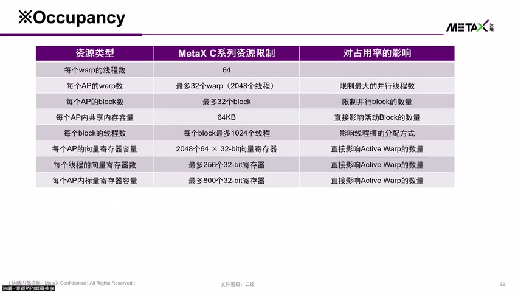
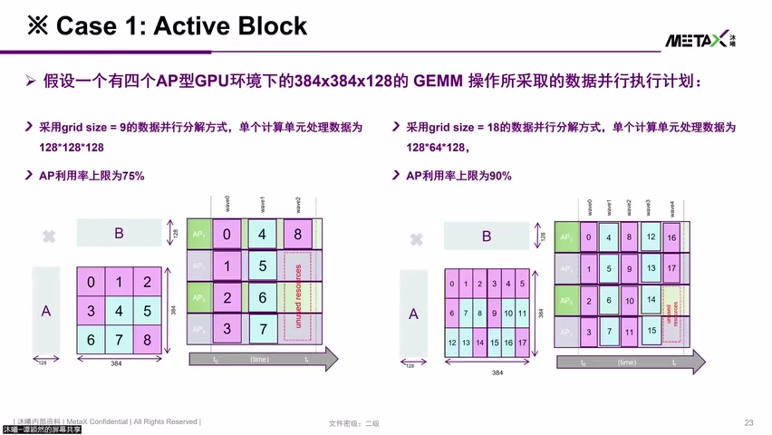
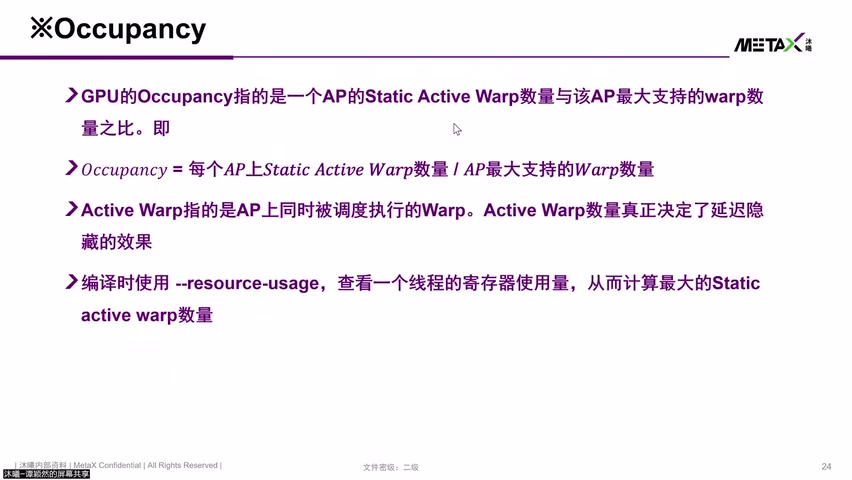
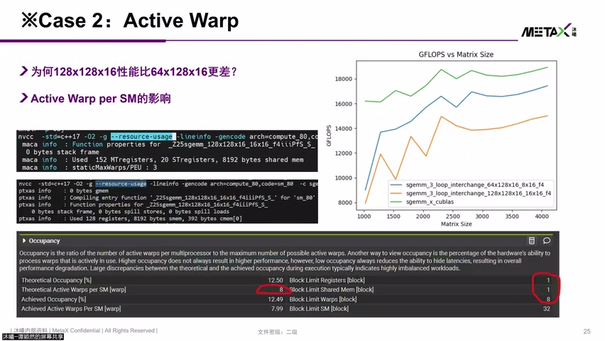
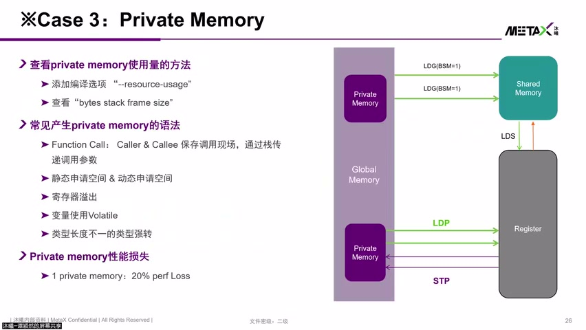

# [P14] 国产GPU核心架构与硬件加速指令对比解析 - 资源占用·AP-PU利用率与Grid对齐

> **演讲者**：谭颖然（沐曦研究院）  
> **日期**：2026年5月  
> **活动**：TileLang Puzzle 算子开发实战营 第二课（续）  

---

## 一、AP 资源限制



### MetaX C系列某产品 AP 资源上限

| 资源 | 限制 |
|------|------|
| 每 AP 最大 Warp 数 | **32** |
| 每 AP 最大线程数 | **2048** |
| 每 Block 最大线程数 | **1024** |
| Shared Memory | **64 KB** |

### Shared Memory 对 Occupancy 的影响

- Block 使用 60 KB Shared Memory → AP 上只能调度 **1 个 Block**
- Block 使用 33 KB → 仍然只能 1 个（超过 64/2=32 KB）
- 优化到 **32 KB** → 可能调度 **2 个 Block** → 更好的 Latency Hiding

### 寄存器溢出（Spill）

- 向量/标量寄存器用超 → 溢出到 **Private Memory**
- Private Memory 实际分配在 **Global Memory**（走 L1 → L2 → DDR）
- 比直接从寄存器/Shared Memory 访问**慢很多**

---

## 二、Grid 对齐与 AP 利用率



### 示例：4 AP GPU 跑 384×384 矩阵（Tile 128×128）

```
Grid size = (384/128) × (384/128) = 3 × 3 = 9 Blocks
```

| 轮次 | 调度 Block | 空闲 AP |
|------|-----------|---------|
| 第 1 轮 | 0,1,2,3 | 无 |
| 第 2 轮 | 4,5,6,7 | 无 |
| 第 3 轮 | 8 | AP 2,3,4 空闲 |

- 实际占用：ceil(9/4) × 4 = **12** AP·轮
- 利用率上限：9/12 = **75%**

### 优化：改 Tile 为 128×64

```
Grid size = (384/128) × (384/64) = 3 × 6 = 18 Blocks
```

- ceil(18/4) × 4 = 20 AP·轮
- 利用率上限：18/20 = **90%**

### 核心原则

> **Grid size 尽量是 AP 数量的倍数（或对齐）**

- MetaX 某产品 = 104 AP → Grid size 对齐到 **104 的倍数**
- 类比：大瓶子装石头 → 切小 task 可以更好地填满缝隙

---

## 三、PU 利用率（AP 内部）




### AP 内部结构回顾

- 每 AP 有 **4 个 PU**
- Warp 以 **Round-Robin** 方式分配到不同 PU

### PU 未用满的影响

- Active Warp 数量不足 → 部分 PU 闲置
- 示例：128×128×16 配置 vs 16×128×16 配置
  - 前者 Active Warp 数量不够 → 性能更差
  - 后者 Active Warp 分布更均匀 → 性能更好

---

## 四、性能检查清单





### 排查步骤

```
① 是否有闲置的 AP？→ Grid size 是否对齐 AP 数量
② AP 内 Active Warp 数量是否足够？→ 能否充分 Round-Robin 到 4 个 PU
③ 寄存器是否溢出？→ Private Memory Spill 检测
④ Shared Memory 是否超限？→ 影响可调度 Block 数
```

### 关键公式

```
利用率上限 = Grid Size / (ceil(Grid Size / AP数) × AP数)
```

- 越接近 1 越好
- Grid Size 能整除 AP 数 → 利用率 = 100%


---

## Key Terms

| 术语 | 含义 |
|------|------|
| Grid 对齐 | Grid size 为 AP 数量的倍数，避免最后一轮 AP 空闲 |
| Active Block | 当前被调度到 AP 上正在执行的 Block |
| Active Warp | AP 内当前驻留的可调度 Warp 数量 |
| Round-Robin | Warp 轮流分配到 AP 内 4 个 PU 的调度策略 |
| Private Memory Spill | 寄存器不够时数据溢出到 Global Memory 的现象 |
| Occupancy | AP 上实际驻留 Warp 数与最大容量（32）的比值 |
