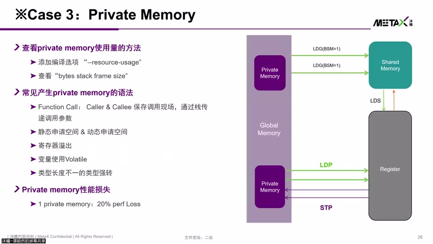
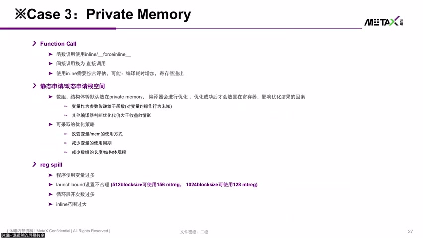
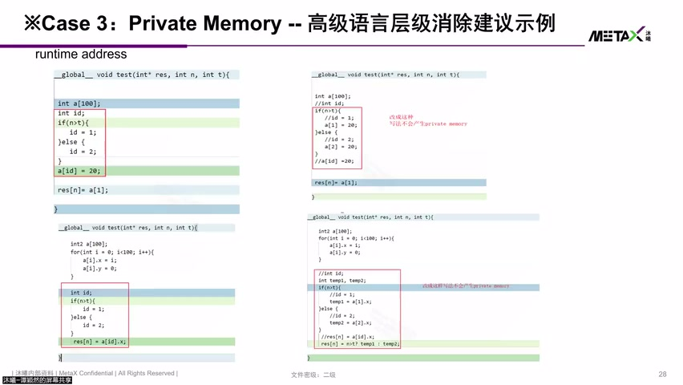
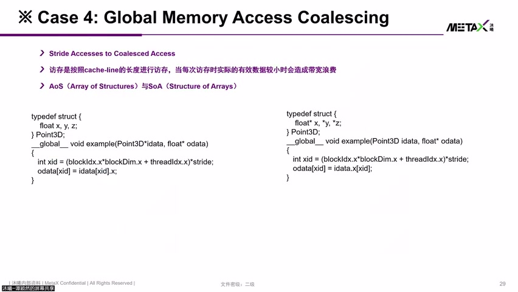
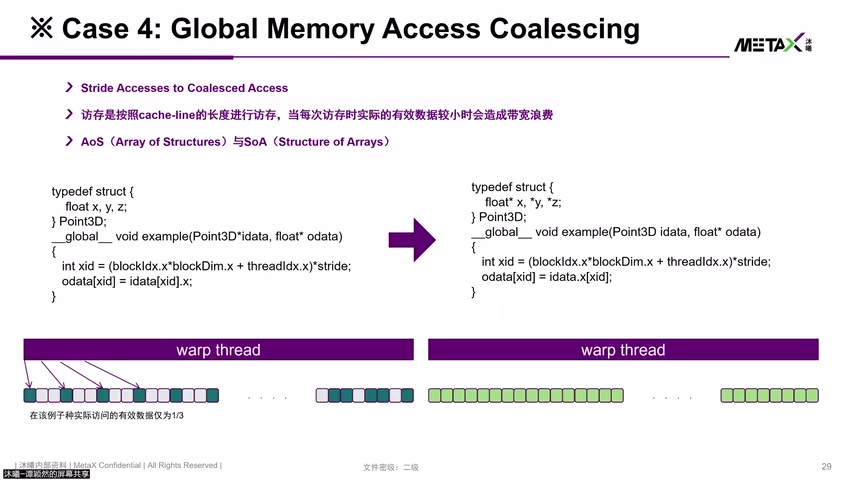

# [P15] 国产GPU核心架构与硬件加速指令对比解析 - Private Memory Spill 寄存器溢出详解

> **演讲者**：谭颖然（沐曦研究院）  
> **日期**：2026年5月  
> **活动**：TileLang Puzzle 算子开发实战营 第二课（续）  

---

## 一、Private Memory Spill 机制



### 逻辑 vs 物理位置

| 层面 | 说明 |
|------|------|
| **逻辑上** | Private Memory 存储每个线程独享的资源，不可被其他线程读取 |
| **物理上** | 实际分配在 **Global Memory** 空间（L2 Cache 以外） |

### Spill 触发条件

- 寄存器堆无法提供足够寄存器 → 数据溢出到 Private Memory（Global Memory）
- 若数据很快被取回 → 可能在 L1/L2 Cache 中缓存
- 若与其他数据通路竞争 → 可能被替换到远端 **HBM / GDDR** → 巨大性能开销

### 性能影响

> **一旦出现 Private Memory Spill，可能带来 ~20% 的 performance loss**

---

## 二、检测方法



### 方法一：检查指令

| 平台 | Load 指令 | Store 指令 |
|------|-----------|------------|
| MetaX (MXMACA) | **LDP** | **STP** |
| NVIDIA (CUDA) | LDL | STL |

- 出现 LDP/STP → 说明触发了 Private Memory 访问

### 方法二：查看 Resource Usage

- 编译输出中查看 Private Memory 用量
- 用量 = 0 → 无 Spill（理想）
- 用量 > 0 → 找到优化点，解决后可能直接提升 20% 性能

---

## 三、常见产生 Private Memory 的语法



### 1. 函数调用（Function Call）

- 跳转到子函数时需**保存现场** → 通过 STP 将寄存器内容压入 Private Memory
- 函数返回时通过 LDP **恢复现场**
- 调用层级越深 → Spill 越多

### 2. 静态/动态申请数组或结构体

- 申请数组/结构体 → 默认放在 Private Memory
- 编译器**可能**优化：如长度 8 的 float 数组 → 寄存器放得下 → 自动优化到寄存器
- 但若数组作为参数**跨函数传递** → 编译器无法优化 → 仍留在 Private Memory
- 数组长度过大（1024/2048）→ 寄存器放不下 → 无法优化

### 3. 寄存器溢出（Register Overflow）

- 每 thread 所需寄存器 × thread 数 > AP 寄存器总量 → 溢出
- 编程给了 256 个 thread，但实际不一定全部能用满寄存器

### 4. volatile 修饰符

- 使用 `volatile` 修饰的变量 → 强制每次从内存读取 → 产生 Private Memory 访问

### 5. 不等长强制类型转换

- 不同长度类型之间的强制转换 → 编译器翻译为 Private Memory 操作

### 6. 间接寻址（Indirect Addressing）

- 使用**运行时变量**作为数组下标 → 编译器无法在编译期确定地址
- 指令集不支持间接寻址时 → 通过 Spill 到 Global Memory 再用寄存器偏移读取

---

## 四、优化策略





### 策略总览

| 策略 | 原理 | 注意事项 |
|------|------|----------|
| `inline` / `__forceinline__` | 消除函数调用 → 避免保存/恢复现场 | 程序体积增大、编译时间增加、不一定解决寄存器溢出 |
| 间接调用 → 直接调用 | 类似 inline，减少跳转 | 上下文变长 → 寄存器分配更复杂 |
| 减少数组/结构体规模 | 让编译器有空间优化到寄存器 | 长度越小越容易被优化 |
| 缩短变量生命周期 | 减少同时活跃的寄存器数量 | 避免跨函数传递大数组 |
| 调整 Launch Bounds | Block size × regs/thread 不超 AP 容量 | 需平衡 Occupancy |
| 控制循环展开次数 | 减少同时需要存储的数据量 | 展开过多 → 寄存器不够 → 反而触发 Spill |
| 控制 inline 范围 | 避免内联范围过大导致寄存器压力 | 与函数调用优化是对称问题 |

### 循环展开的双刃剑

```
好处：更多指令并发发射 → 前一笔数据返回时 ALU 不空闲（Latency Hiding）
坏处：每笔请求都需要寄存器接收数据 → 展开过多 → 寄存器溢出 → Spill
```

### 关键原则

> 没有"屡试不爽"的单一方法，必须 **case by case** 排查原因

---

## 五、代码示例：间接寻址改写


### 问题写法（产生 Private Memory）

```c
// id 在 if-else 中赋值 → 编译器认为是 runtime 才能确定的值
int id;
if (condition) {
    id = tid + offset;
} else {
    id = tid - offset;
}
float val = array[id];  // 间接寻址 → Private Memory
```

### 优化写法（避免 Private Memory）

```c
// 直接用编译期可确定的表达式访问
float val_a = array[tid + offset];  // 确定下标 → 编译器可优化
float val_b = array[tid - offset];
float val = condition ? val_a : val_b;
```

### 核心思路

- **让数组下标在编译期可确定** → 编译器能优化到寄存器
- 避免用 runtime 变量（依赖外部传入的 N、T 等）作为下标
- 将间接寻址改写为**直接寻址**或**条件选择**

---

## Key Terms

| 术语 | 含义 |
|------|------|
| Private Memory Spill | 寄存器不足时数据溢出到 Global Memory 的现象 |
| LDP / STP | MetaX 架构中 Private Memory 的 Load/Store 指令 |
| LDL / STL | NVIDIA CUDA 中 Local Memory 的 Load/Store 指令 |
| Register File | AP 内的寄存器堆，容量有限 |
| 间接寻址 | 使用运行时变量作为数组下标，编译期无法确定地址 |
| Launch Bounds | 编译时指定的 Block size / regs-per-thread 约束 |
| Loop Unrolling | 循环展开，增加指令并发但增加寄存器压力 |
| `__forceinline__` | 强制内联函数，消除调用开销但增大代码体积 |
