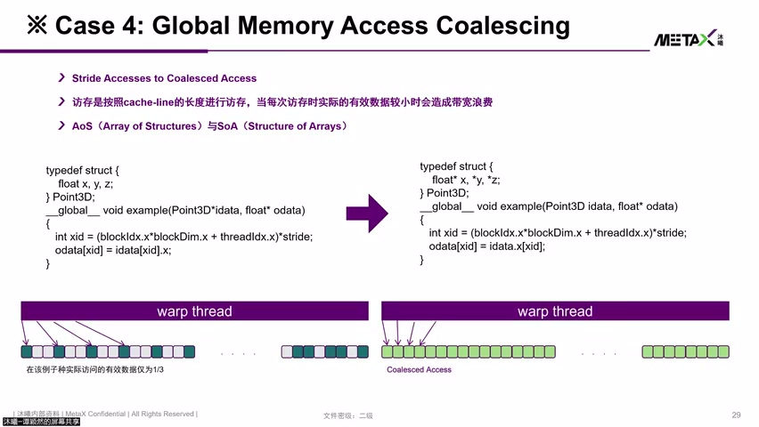
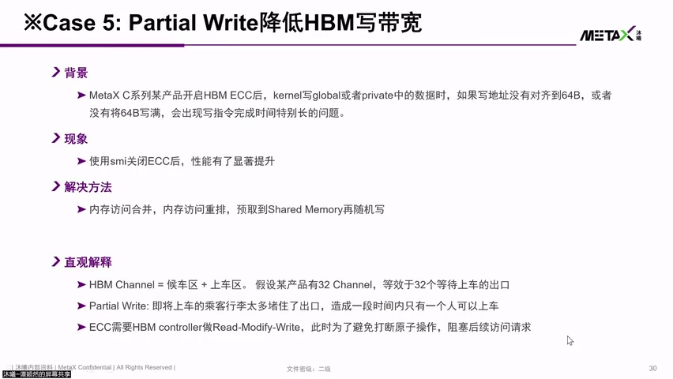

# [P16] 国产GPU核心架构与硬件加速指令对比解析 - 合并访存 Coalescing 与 ECC 对齐写优化

> **演讲者**：谭颖然（沐曦研究院）  
> **日期**：2026年5月  
> **活动**：TileLang Puzzle 算子开发实战营 第二课（续）  

---

## 一、Coalescing（合并访存）机制



### 硬件位置

- AP 内部有 **L1 Cache**
- 在数据送入 L1 Cache 之前，前端有一个 **Header** 单元执行 Coalescing 操作

### 基本原理

- GPU 允许每个 thread 携带**独立地址**访问 Global Memory（即使地址跨度很大也能工作）
- 但实际编程中，相邻 thread 往往访问**相邻地址**（如 float 数组连续访问）
- 硬件检测到多个 thread 的地址落在**同一条 Cache Line** 内 → 合并为**一笔请求**

### 类比

```
去超市买醋 + 大米：
  方式 A：先买醋回家 → 再买大米回家（两次超市）= 未合并
  方式 B：列好清单 → 一次买齐（一次超市）    = Coalescing
```

### Cache Line 大小

| 架构代际 | Cache Line 大小（典型） |
|----------|------------------------|
| 泛指 | **128 Byte** |
| 某些代际 | 64 Byte / 32 Byte |

- 关键：多个 thread 的请求恰好落在同一 Cache Line → **只发一笔操作**

---

## 二、Coalescing 效果对比

### 未合并（Stride 访问）

```
假设：Cache Line = 128B, 每 thread 访问 4B (float), Stride = 3
→ 取回 128B 中有效数据仅 1/3
→ 需要 3 笔请求才能取完所有数据
→ 耗时 = 3× 
```

### 合并（连续访问）

```
32 个 thread 的 Warp 访问连续 float 地址
→ 32 × 4B = 128B = 恰好 1 条 Cache Line
→ 一笔 128B 请求即可（或两笔 64B）
→ 耗时 = 1×
```

> **Stride 访问比连续访问慢 ~3 倍**（以 stride=3 为例）

### 为什么不能靠硬件资源解决？

- 即使上游增加缓冲 / 允许多笔请求并发
- 若 L1/L2 Cache 兜不住 → 最终仍打到 **HBM 带宽瓶颈**
- 根本解决方案：**程序层面让 thread 访问相邻地址**

---

## 三、ECC 开启时的写对齐问题



### 问题背景

- MetaX C 系列某代产品，开启 **HBM ECC** 后
- Kernel 的 Global / Private 数据**写地址未对齐到 64 Byte** → 性能严重下降

### 具体场景

```
写地址 = 63, 写长度 = 64B
→ 跨越两条 Cache Line: [0..63] 和 [64..127]
→ 被拆成两笔请求

下一笔写地址 = 127 (63+64)
→ 同样跨越两条 Cache Line
```

### 为什么变慢？

- 硬件**无法判断**两笔跨行写是否存在同地址读写冲突
- 统一按**有冲突**处理 → 第一笔完成后才发第二笔（**串行化**）
- 写操作完成时间显著增长

---

## 四、ECC 对齐优化策略


### 策略一：关闭 ECC（诊断用）

- 若程序确认无同地址读写冲突 → 可关闭 ECC 验证性能提升
- **风险**：失去数据纠错保护，可能有功能风险
- 仅用于**定位问题**，不建议生产环境关闭

### 策略二：64B 对齐 + Padding（推荐）

```
写地址未对齐 64B → 在前面/中间加 Padding
→ 用少量显存空间换取对齐 → 避免跨行写
→ "空间换时间"
```

### 策略三：Shared Memory 合并后回写

```
零散数据 → 先写入 Shared Memory 凑齐 64B
→ 再一笔写回 Global Memory
→ 避免多笔零散写操作串行化
```

### 优化方法论

```
① 关闭 ECC → 发现性能提升 → 确认存在对齐问题
② 理解原理：避免跨 Cache Line 写导致串行化
③ 恢复 ECC → 通过软件方法解决：
   - 重排（Reorder）
   - 合并（Merge）
   - Padding 对齐
```

---

## Key Terms

| 术语 | 含义 |
|------|------|
| Coalescing | 将同一 Warp 内多个 thread 的相邻地址请求合并为一笔 Cache Line 访问 |
| Cache Line | 缓存最小访问单位（典型 128B / 64B / 32B） |
| Stride 访问 | 相邻 thread 地址间隔 > 数据类型大小，导致无法合并 |
| ECC | Error Correcting Code，HBM 数据纠错功能 |
| 写对齐 | 写地址对齐到 Cache Line 边界（64B），避免跨行写 |
| Padding | 填充无用数据使地址对齐，空间换时间 |
| 串行化 | 硬件因无法判断冲突而强制顺序执行多笔写操作 |
