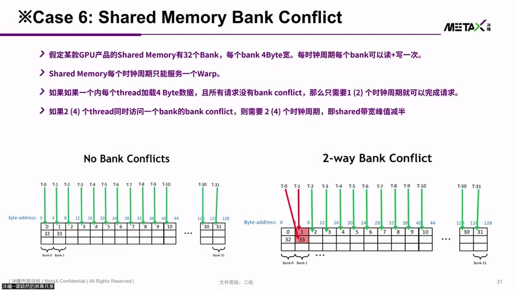
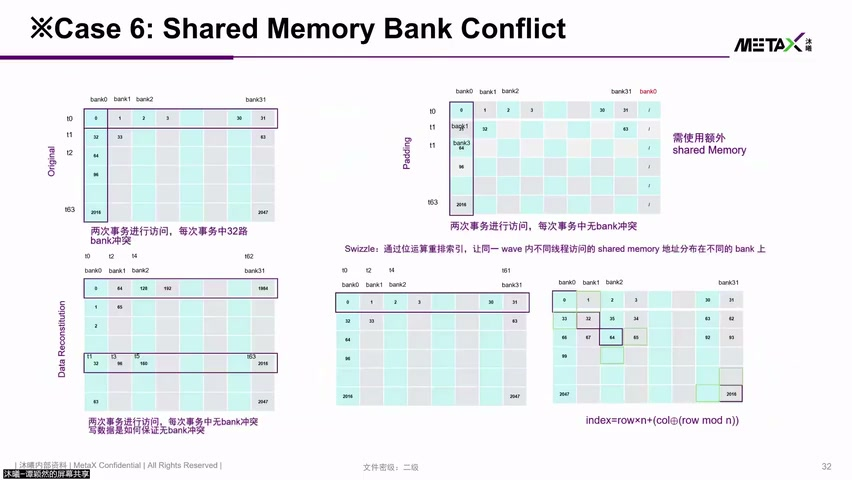
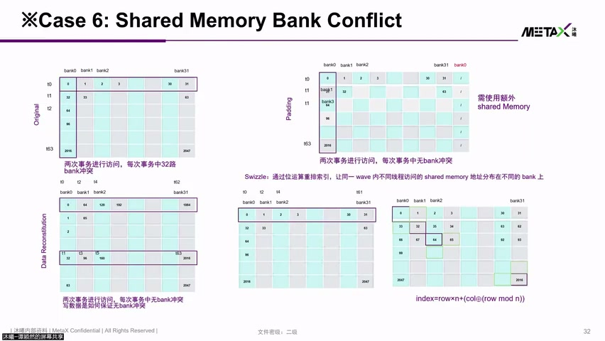
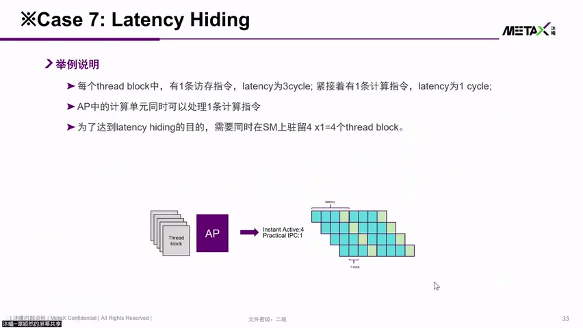
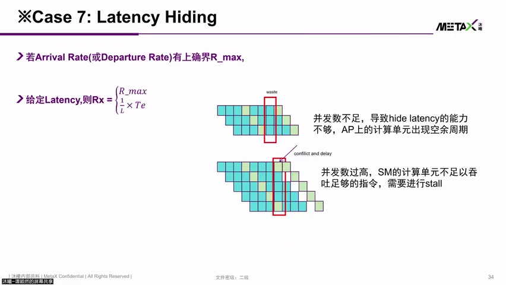
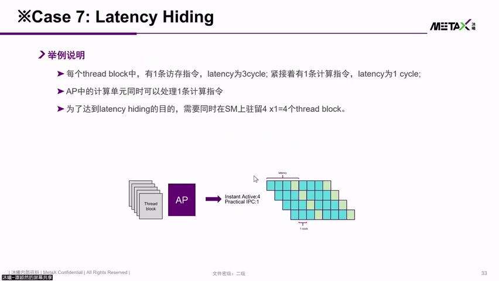

# [P17] 国产GPU核心架构与硬件加速指令对比解析 - Bank Conflict, Swizzle 与 Latency Hiding

> **演讲者**：谭颖然（沐曦研究院）  
> **日期**：2026年5月  
> **活动**：TileLang Puzzle 算子开发实战营 第二课（续）  

---

## 一、Shared Memory Bank Conflict



### Bank 结构

| 参数 | 值 |
|------|-----|
| Bank 数量 | **32** |
| 每 Bank 宽度 | **4 Byte** |
| 每周期能力 | 每 Bank 可做 **1 读 + 1 写** |
| 服务对象 | 每周期服务 **1 个 Warp** 的多个 thread |

### 地址灵活性

- 每个 thread 的 Shared Memory 地址偏移由 **Vector Register** 提供
- thread0 与 thread1 的地址可以**完全独立**（非固定 stride）
- 好处：灵活访问；坏处：可能产生 Bank Conflict

### No Conflict（理想情况）

```
32 个 thread → 各访问不同 Bank
→ 32 个 Bank 同时响应 → 1 个周期完成
→ 64 thread 的 Warp → 2 个周期完成
```

### 2-Way Bank Conflict

```
thread0 和 thread1 访问同一 Bank 的不同地址
→ 第 1 拍：响应 thread0, thread2~31
→ 第 2 拍：响应 thread1
→ 需要 2 倍时钟周期 → 带宽峰值减半
```

> 硬件标称 128B/cycle，但 Bank Conflict 下实际带宽可能只有 **50% 甚至更低**

---

## 二、解决 Bank Conflict：Padding




### 原理

- 在数据布局中插入**额外空间（Pad）**，使原本冲突的地址错开到不同 Bank

### 示例

```
原始布局：stride=2 访问 → thread0 访问 addr[0], thread16 访问 addr[32]
→ 两者落在同一 Bank → Conflict

Padding 后：每行末尾多存 1 个位置（错开一行）
→ thread0 和 thread16 的地址不再落在同一 Bank → 无 Conflict
```

### 缺点

- 需要**额外 Shared Memory 空间**
- MetaX 某产品 Shared Memory 仅 **4 KB** → 空间捉襟见肘

---

## 三、解决 Bank Conflict：Swizzle





### 原理

- 不增加额外空间，而是**交换数据存放顺序**
- 例：将 addr[32] 和 addr[33] 的位置互换 → 读取时自然错开 Bank

### 与 Padding 对比

| 方法 | 空间开销 | 实现方式 |
|------|----------|----------|
| Padding | 需要额外空间 | 插入空位错开地址 |
| Swizzle | **无额外空间** | 交换数据存放顺序 |

### 硬件支持

- 现代 GPU 将 Swizzle 模式**硬化为硬件指令**
- 类似 TileLang 中的 Swizzle 参数 → 配置正确后硬件自动完成地址映射
- 无需软件手动计算 index 偏移

---

## 四、Latency Hiding（延迟隐藏）




### 基本概念

| 指令类型 | Latency |
|----------|---------|
| 访存指令（Memory） | **3 cycles**（发出后 3 拍数据才回来） |
| 计算指令（Compute） | **1 cycle** |

### 无 Latency Hiding（1 个 Thread Block）

```
Cycle 0: 发访存指令
Cycle 1~3: 空等（ALU 空闲）
Cycle 3: 数据返回
Cycle 4: 执行计算
→ 大量周期浪费在等待上
```

### 有 Latency Hiding（4 个 Thread Block 驻留）

```
Cycle 0: Block0 发访存
Cycle 1: Block1 发访存
Cycle 2: Block2 发访存
Cycle 3: Block3 发访存 → Block0 数据返回 → Block0 做计算
→ 指令发射单元始终不空闲，ALU 一有数据就计算
```

### 代价

- 需要 **4 份寄存器资源**（原来只需 1 份）
- 本质：**空间换时间**（更多驻留 Block → 更多寄存器/Shared Memory 占用）

---

## 五、Latency Hiding 失效场景




### 并发度不足

- 寄存器/Shared Memory 资源不够 → 无法驻留足够多的 Thread Block
- 发一条访存 → 空等 3 拍 → 计算 → 再发 → 再空等
- 指令发射单元大量**空转**

### Conflict / Delay

- 寄存器读写冲突、Bank Conflict 等 → 额外延迟
- 打破原有的流水线节奏 → 产生气泡（bubble）

---

## 六、实用 Latency Hiding 技术


| 技术 | 说明 |
|------|------|
| **乒乓 Buffer（Double Buffering）** | 一块加载数据的同时另一块做计算 |
| **Multi-Stage Pipeline** | 多级流水线，进一步重叠访存与计算 |
| **Producer-Consumer 模型** | 不同 Warp 分工：一个负责搬数据，一个负责计算 |

---

## Key Terms

| 术语 | 含义 |
|------|------|
| Bank Conflict | 同一 Warp 内多个 thread 访问同一 Bank 的不同地址，导致串行化 |
| 32 Banks | Shared Memory 被划分为 32 个独立 Bank，每 Bank 4B 宽 |
| Padding | 插入额外数据错开 Bank 地址，解决 Conflict（牺牲空间） |
| Swizzle | 交换数据存放顺序解决 Conflict（不牺牲空间），可硬化为硬件指令 |
| Latency Hiding | 通过多 Block 并发驻留，用计算填充访存等待时间 |
| 乒乓 Buffer | 双缓冲技术，一块加载一块计算交替进行 |
| Producer-Consumer | 不同 Warp 分工协作，一个搬数据一个做计算 |
