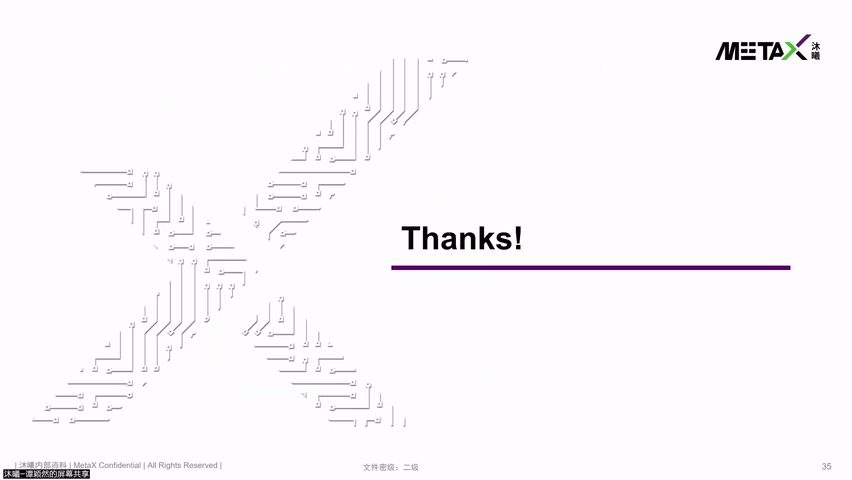
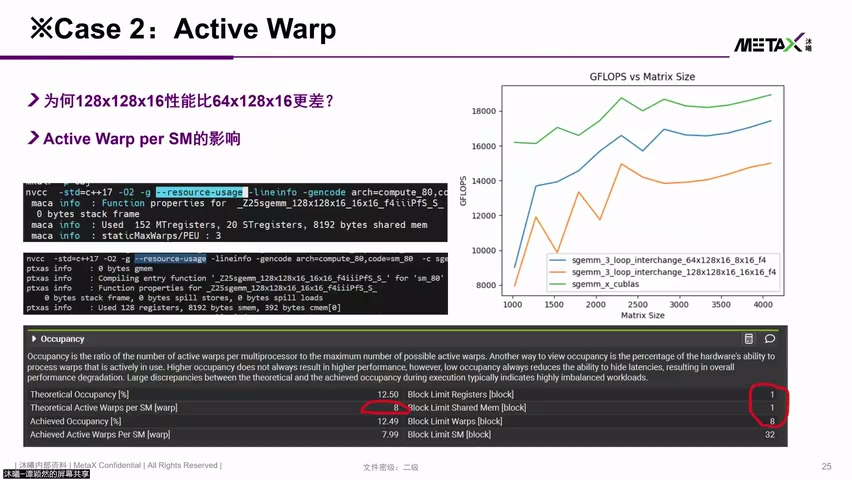
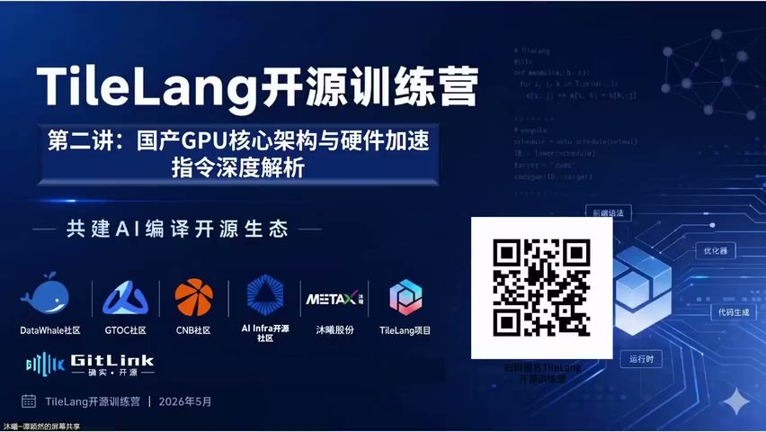
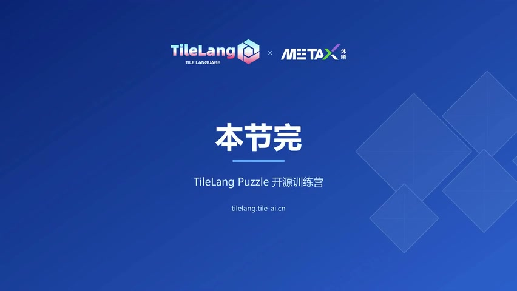

# [P18] 国产GPU核心架构与硬件加速指令对比解析 - 课程总结与答疑

> **演讲者**：谭颖然（沐曦研究院）+ 主持人  
> **日期**：2026年5月  
> **活动**：TileLang Puzzle 算子开发实战营 第二课（总结）  

---

## 一、课程回顾




### 第二课内容总结

```
① 编程模型：Grid → Block → Thread, SIMT 执行
② 硬件结构：AP/PU 架构、Memory Hierarchy、寄存器/Shared Memory
③ 性能优化：基于硬件参数的实际优化方法
   - Occupancy 与资源占用
   - Grid 对齐与 AP 利用率
   - Private Memory Spill 检测与解决
   - Coalescing 合并访存
   - ECC 对齐写优化
   - Bank Conflict / Swizzle
   - Latency Hiding
```

---

## 二、答疑环节



### Q1：能否直接用 nvcc + Nsight System 编译和 Profile？

**A**：
- **NVIDIA 卡**：可以。nvcc 做编译，Nsight System 抓取 kernel 运行时的 profiling 数据
- **MetaX 卡**：需要沐曦专用工具，但与 CUDA 生态**高度兼容**，使用方法类似
- 工具获取：沐曦开发者社区（见 slide 链接）

### Q2：训练营是否必须用 MetaX 卡？NV 卡行不行？

**A**：
- 可以**先用 NV 卡跑**，再在 MetaX 卡上跑
- 对比两个算子在不同卡上的性能差异
- 两种方式都支持

### Q3：硬件结构和参数的详细文档哪里有？

**A**：
- 沐曦开发者社区：`developer.metax-tag.com`
- 包含硬件结构、参数等详细文档
- 跑 MetaX 卡时 log 也能打印部分硬件信息
- 后续会整理命令行工具放在开发者社群

### Q4：后续会有 Profiler 调试 GPU 的课程吗？

**A**：
- 本节课不安排
- 后续课程可能会准备相关内容
- 关注学员群获取最新信息

---

## 三、训练营路线





### 课程安排

| 阶段 | 内容 | 时间 |
|------|------|------|
| 第一讲 | GPGPU 核心技术 | 已完成 |
| 第二讲 | 国产 GPU 核心架构与硬件加速指令对比解析 | 本次 |
| 第三讲 | 软硬件技术精讲（TileLang、T.copy 等） | 周六 19:00 |
| 后续 | 算子开发入门 → 性能优化 → 进阶算子 | 持续 |

### 学习建议

- 硬件知识是后续算子开发与优化的**基础**
- 硬件性能需要软件配合才能充分发挥
- 建议深度消化本次内容，为 TileLang Puzzle 实战做准备

---

## Key Terms

| 术语 | 含义 |
|------|------|
| MXMACA | 沐曦 CUDA 兼容编程框架 |
| Nsight System | NVIDIA 系统级 profiling 工具 |
| developer.metax-tag.com | 沐曦开发者社区，提供文档/工具/镜像 |
| TileLang Puzzle | 本训练营的算子开发实战环节 |
| T.copy | TileLang 中的数据搬运原语 |
