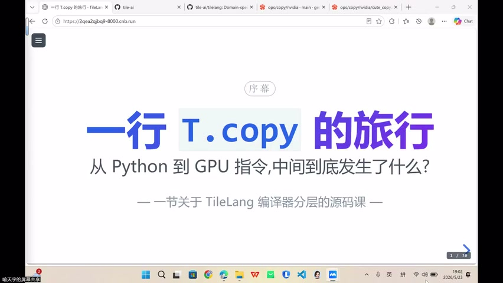
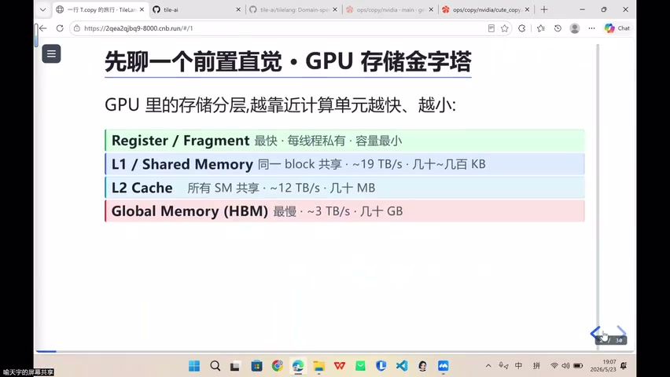
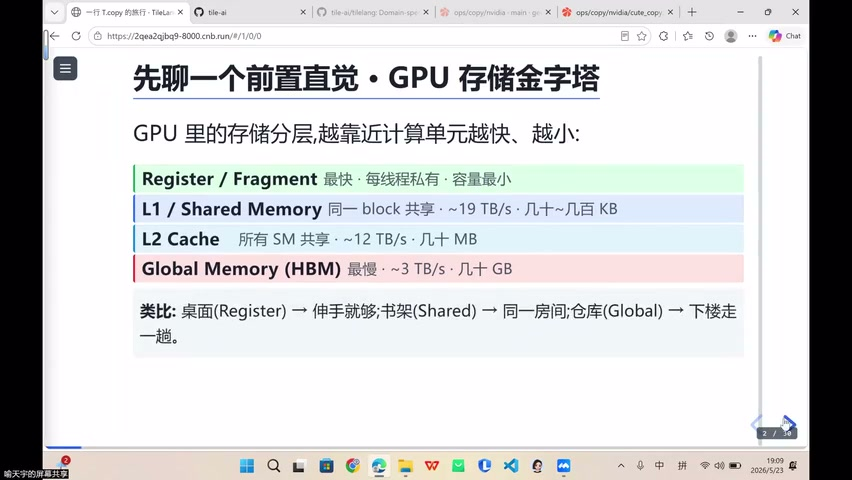
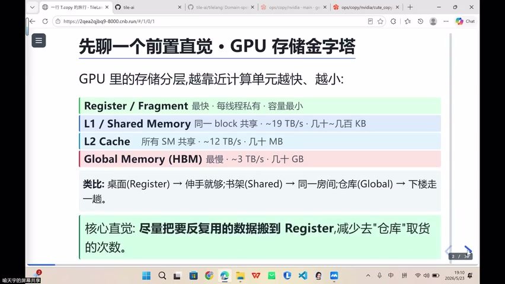
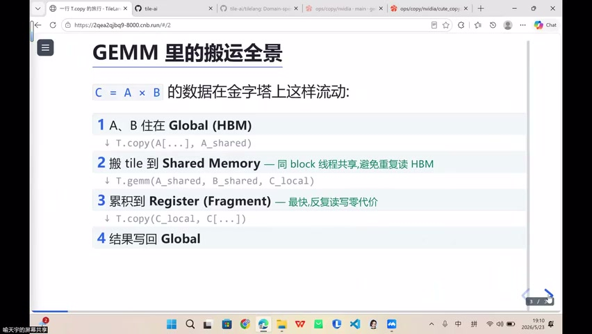
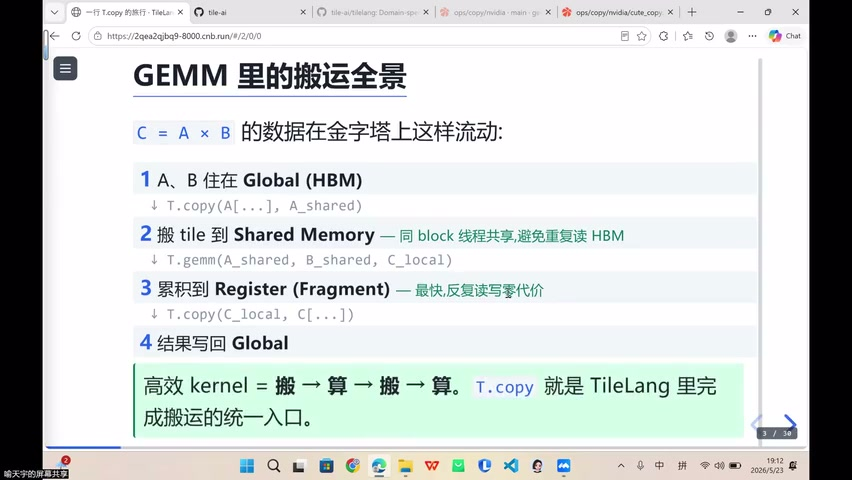
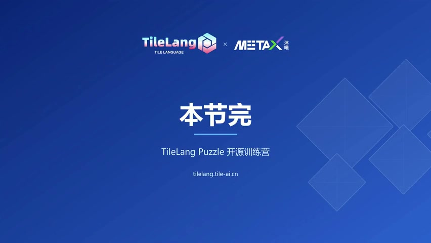

# [P19] 软硬件技术精讲 - 开场与编译器路线·从 CUDA 到 TileLang

> **演讲者**：天宇（TileLang 社区 Committer）  
> **日期**：2026年5月  
> **活动**：TileLang Puzzle 算子开发实战营 第三课  

---

## 一、个人经历与编译器路线选择



### 背景

- 长期 CUDA 开发者（也写 Rust）
- 写 CUDA / CUTLASS 需要深入思考硬件 → 非常头疼
- 不同 GPU 代际（Volta → Ampere → Hopper → Blackwell）对应不同 SM 版本（SM80/SM90/SM120）
- 希望往 **Python 层面**走，用编译器解决硬件差异

### 两条主流编译器路线

| 路线 | 代表 | 特点 |
|------|------|------|
| MLIR 路线 | **Triton** | 自动化程度高，但开发者可控感较弱 |
| TVM 路线 | **TileLang** | 给开发者更多控制权，trade-off 做得好 |

### 为什么选 TileLang？

- 不深入汇编/PTX → 达不到极致性能
- 编译器帮助在**性能**与**开发效率**之间做 trade-off
- TileLang 在兼容性和自动化方面的 **balance** 做得好
- 常用操作（T.copy、T.gemm）都有封装

---

## 二、为什么硬件仍然重要



### 不同加速器各有特化

- NVIDIA GPU：Tensor Core、TMA 等搬运加速指令
- 华为 NPU、寒武纪、Google TPU：各自 ASIC 架构有微调
- 类 GPGPU（如 MetaX）：与 NV 类似但有差异

### 编译器的统一方案

```
不同硬件 → 统一 IR（Intermediate Representation）→ Lowering → 各硬件加速指令
```

- 通过 IR 做一层统一抽象
- Lowering 阶段降级到不同硬件，调用对应的加速指令
- 开发者在 Python 层面调用 **T.copy** 等 API 即可完成所有搬运操作

---

## 三、存算分离与数据搬运





### 核心原则

> 所有计算都考虑能否放到 **Register** 层面执行

### Memory Hierarchy（由快到慢）

```
Register（桌面）→ SRAM / Shared Memory（书架）→ L1/L2 Cache → Global Memory / HBM（仓库）
```

### 类比

| 层级 | 类比 | 作用 |
|------|------|------|
| Register | **桌面** | 当前正在计算的数据 |
| Shared Memory | **书架** | 需要复用的参考资料 |
| Global Memory | **仓库** | 所有原始数据和最终结果 |

### 算子开发最朴素的直觉

```
① 把数据从 Global Memory 搬到 Register 做计算
② 把可复用的数据放到 Shared Memory / SRAM
③ 尽量减少从 HBM 读取的次数
④ 算完后把结果搬回 Global Memory
```

---

## 四、GEMM 示例与 TileLang 封装





### GEMM 数据流

```
C = α·A×B + β·C

Global Memory → [T.copy] → Shared Memory → [T.gemm] → Register (Local) → [T.copy] → Global Memory
```

### TileLang 的优势

- 常用操作都做了**高层封装**（T.copy、T.gemm 等）
- 开发者不需要手动管理每一级搬运的细节
- 但仍保留对硬件的**可控性**（可以指定搬运路径、pipeline 等）

---

## 五、搬运是核心问题



### 为什么搬运如此重要？

- 存算分离架构下，**搬运机制**决定了性能上限
- 后续进阶内容（异步搬运、Pipeline 设计）都源于搬运机制
- 归根结底：算子开发的核心就是**高效搬运 + 就地计算**

### 本课定位

- 从硬件视角（前两课）过渡到**软硬件结合**
- 深度拆解 T.copy 搬运指令的核心原理和实际应用

---

## Key Terms

| 术语 | 含义 |
|------|------|
| TileLang | 基于 TVM 的算子开发 DSL，Python 层面编写高性能 kernel |
| T.copy | TileLang 中的数据搬运 API，统一抽象不同硬件的搬运指令 |
| T.gemm | TileLang 中的矩阵乘法封装 API |
| IR (Intermediate Representation) | 编译器中间表示，统一不同硬件的抽象层 |
| Lowering | 编译器将高层 IR 降级为硬件特定代码的过程 |
| Triton | 基于 MLIR 的 GPU 编程框架（OpenAI） |
| CUTLASS | NVIDIA 的 CUDA 模板库，用于高性能 GEMM |
| 存算分离 | 现代加速器计算单元与存储分离，需要显式搬运数据 |
| TMA | Tensor Memory Accelerator，NVIDIA Hopper 架构的搬运加速单元 |
