# [P20] 软硬件技术精讲 - 跨硬件统一封装与 IR 中间表示

> **演讲者**：天宇（TileLang 社区 Committer）  
> **日期**：2026年5月  
> **活动**：TileLang Puzzle 算子开发实战营 第三课  

---

## 一、从 T.copy 出发：算子开发的本质

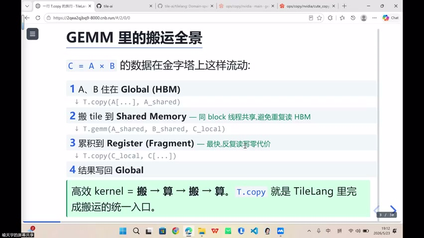

### 算子 = 搬 → 算 → 搬 → 算 → 搬后算

```
核心循环：搬运数据 → 就地计算 → 搬运结果
```

- 写 CUDA 时：所有搬运细节需**手动指定**
- 用编译器时：可以**自动对接**不同硬件，Lowering 到对应加速指令

### 为什么从 T.copy 开始讲？

- Copy 是最基础、最频繁的操作
- 理解了 Copy 的封装流程 → 理解了整个 TileLang 的抽象思路

---

## 二、跨硬件统一封装的思路

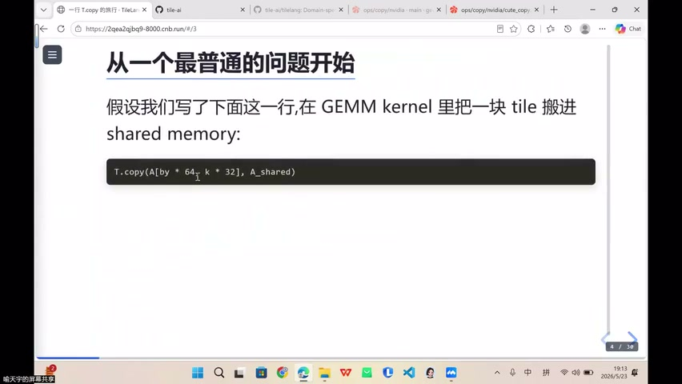

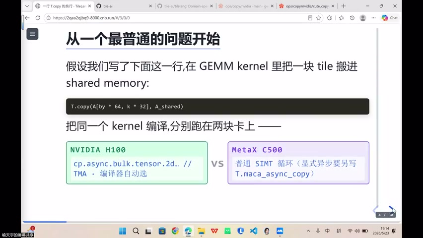

### 目标

> 同一个 T.copy 调用 → 在不同硬件上自动使用**最优加速指令**

### 不同硬件的搬运指令

| 硬件 | 加速指令 |
|------|----------|
| NVIDIA (SM90+, Hopper) | **TMA** (Tensor Memory Accelerator) |
| MetaX (C600+) | 对标 TMA 的硬件指令 |
| 通用 | cp.async / memcpy 等 |

### 封装流程

```
① 接不同硬件后端（NV / MetaX / ...）
② 将硬件指令抽象为统一的 Node（图节点）
③ 封装为 Python 层 API（T.copy）
④ 编译器根据目标硬件 Lowering 到最优指令
```

---

## 三、物流分拣中心类比

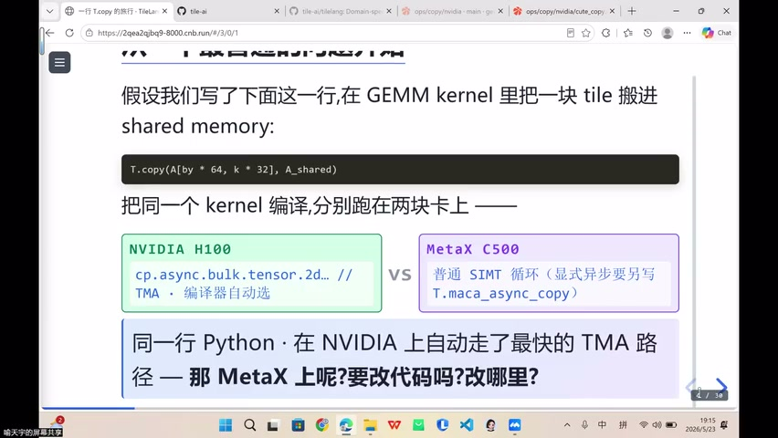

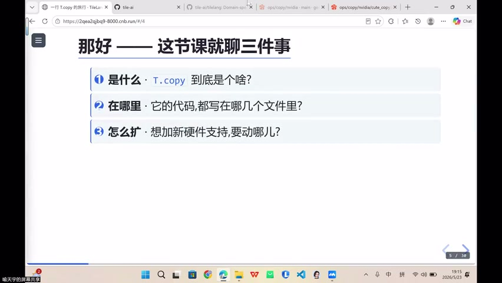

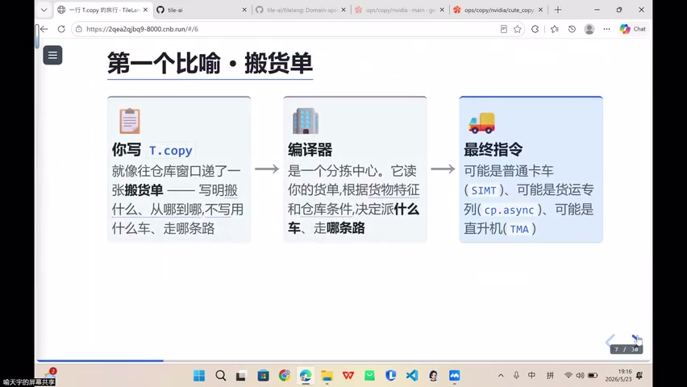

### 类比映射

| 物流概念 | 对应 TileLang |
|----------|---------------|
| 搬货单（不写具体路线） | **T.copy** 调用（只描述意图） |
| 分拣中心 | **编译器 / IR** |
| 目的地 | **目标硬件**（NV / MetaX） |
| 物流公司（顺丰/京东） | **加速指令**（TMA / cp.async） |
| 最终送达 | Lowering 到硬件执行 |

### 核心理念

> **你只需描述意图（T.copy），不需要指定运输方式（具体指令）**

- 人"懒" → 希望自动化 → 不断抽象和压缩
- 哪怕牺牲一点效率，也值得换取开发效率

---

## 四、IR（Intermediate Representation）中间表示

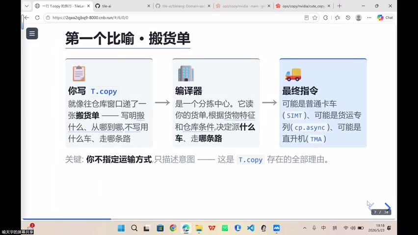

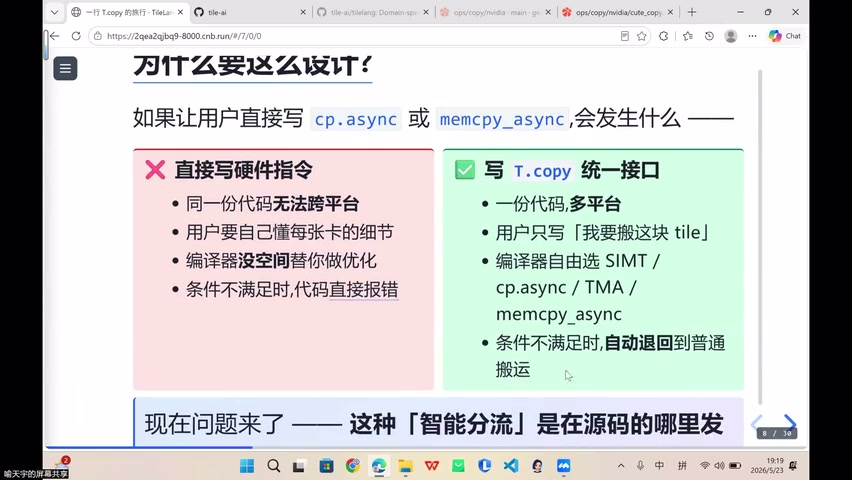

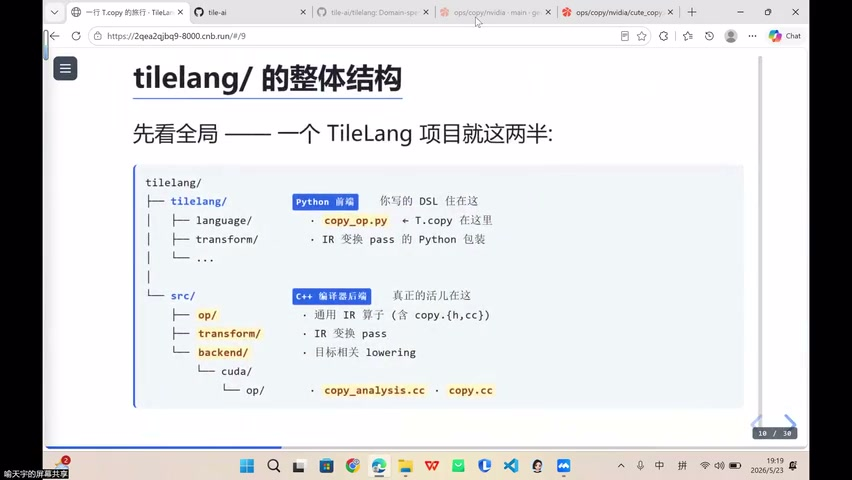

### 什么是 IR？

- **不是** Python 源码
- **不是** 最终机器码（PTX / 汇编）
- **是** 编译器内部的**结构化、可变换、与硬件无关**的程序描述

### IR 的关键特征

| 特征 | 说明 |
|------|------|
| **结构化** | 有明确的语法结构，可被程序分析 |
| **可变换** | 可读取、修改、重写（Pass 优化） |
| **硬件无关** | 同一 IR 可被不同后端消耗（NV / MetaX） |

### IR 在 TileLang 中的体现

- IR 的核心 = 不同的 **Node 对象**
  - `CopyNode`：表示搬运操作
  - `GemmNode`：表示矩阵乘法
  - 其他 Node...
- 这些 Node 共同组成编译器内部的程序表示

---

## 五、为什么需要 IR？

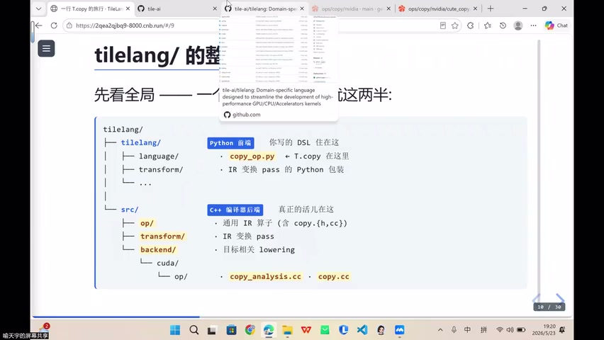

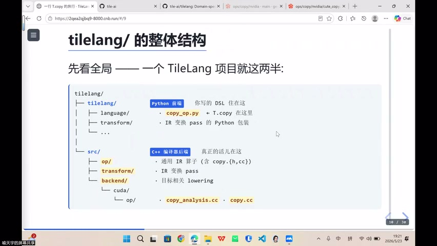

### 能否从 Python 直接生成机器码？

- **理论上可以**（一步到位）
- **但会失去优化机会**

### IR 存在的两大理由

```
① 解耦：前端（Python DSL）与后端（硬件指令）分离
② 优化空间：在 IR 层面可以做各种 Pass 优化
   - 既然放弃了 CUDA 的极致手动优化
   - 就更不能放弃编译器自动优化的空间
```

### 类比：WebAssembly (WASM)

- Rust → WASM：也是一种 IR 中间层
- 类似地：Python DSL → TileLang IR → 硬件机器码
- 中间层的存在 = 保留优化机会 + 跨平台兼容

---

## 六、Embedding DSL

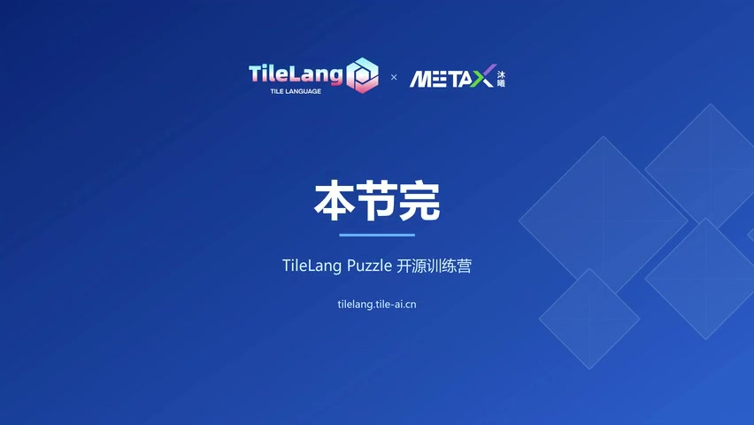

### DSL 的两种形式

| 类型 | 说明 | 例子 |
|------|------|------|
| 独立 DSL | 完全独立的语言 | 传统编译器 DSL |
| **Embedding DSL** | 嵌入到宿主语言中 | TileLang（嵌入 Python） |

### TileLang 的 Embedding DSL

- 借用了 Python 的**语法外壳**
- 内部构建的是 IR Node 图
- 开发者写 Python 风格代码 → 实际生成编译器 IR

---

## Key Terms

| 术语 | 含义 |
|------|------|
| IR (Intermediate Representation) | 编译器中间表示，结构化、可变换、硬件无关 |
| Node | IR 中的基本单元（CopyNode、GemmNode 等） |
| Lowering | 将高层 IR 降级为硬件特定指令的过程 |
| TMA | Tensor Memory Accelerator，NVIDIA SM90+ 的搬运加速单元 |
| Embedding DSL | 嵌入到宿主语言（Python）中的领域特定语言 |
| Pass | 编译器在 IR 上执行的优化变换 |
| 解耦 | 前端 DSL 与后端硬件通过 IR 分离，互不依赖 |
| cp.async | CUDA 中的异步内存拷贝指令 |
