# [P21] 软硬件技术精讲 - Embedding DSL、Pass 优化与 CopyNode 数据结构

> **演讲者**：天宇（TileLang 社区 Committer）  
> **日期**：2026年5月  
> **活动**：TileLang Puzzle 算子开发实战营 第三课  

---

## 一、有 IR vs 没有 IR 的世界

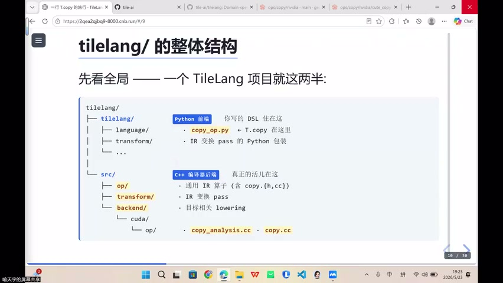

### 没有 IR

```
Embedding DSL → 直接生成 CUDA PTX / MetaX 硬件指令
```

- 中间产生大量"意义不明"的代码（因后端而异）
- **每加一个后端，前端逻辑都要重写**

### 有 IR

```
Embedding DSL → IR → 自动优化（Pass） → 不同后端（PTX / MetaX / TPU / NPU）
```

- 前端只需生成 IR，后端各自 Lowering
- 与传统编译器 **LLVM** 思路一致：LLVM IR → 不同硬件后端

### 抽象能力的迁移性

- AI 编译器中的抽象手段（IR、Pass）与传统计算机系统（OS 页表、虚拟内存）一脉相承
- 学会抽象与压缩 → 在其他软件工程领域同样适用

---

## 二、Pass：IR 上的变换操作


### 什么是 Pass？

> Pass = 在 IR 上执行分析与改写的变换对象

没有 IR → 无法做统一的分析和改写 → 无法优化

### 三类典型 Pass

| Pass 类型 | 作用 | 读取信息 |
|-----------|------|----------|
| **Pipeline 分析** | 判断 Copy 能否异步化 | CopyNode 的 scope |
| **Layout 推断** | 决定数据分布 | CopyNode 的 shape、range |
| **向量化** | 决定向量宽度（如 128-bit） | Node 的 dtype、对齐信息 |

### 核心意义

- IR 提供**统一的数据结构** → Pass 可以通用地操作所有 Node
- 没有 IR 层 → 这些分析无法统一成一种操作

---

## 三、决策推迟：信息充分时再做选择


### 原则

> 把决策推迟到信息最充分的时刻

### 各阶段掌握的信息

| 阶段 | 已知 | 未知 |
|------|------|------|
| 前端（Level A） | 用户意图 | target（硬件）、具体指令 |
| IR 层 | source、scope、shape、dtype | pipeline 上下文 |
| 后端 | 全部信息齐备 | — |

### 实例

- 不是 Hopper 架构 → 不能用 TMA → 只能用 cp.async
- 前端不知道 target → **不能**在此时决定用 TMA 还是 cp.async
- 等到后端信息齐了 → 统一做决策

---

## 四、CopyNode 数据结构

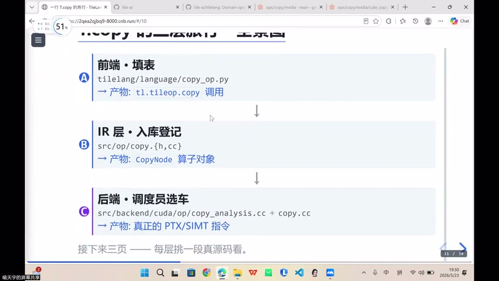

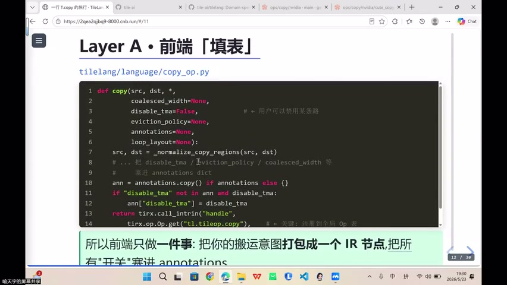

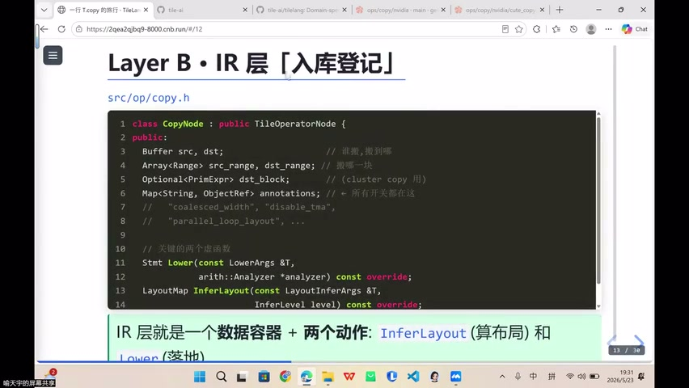

### CopyNode 的字段

| 字段 | 含义 |
|------|------|
| **buffer (src / dst)** | 源 Buffer 与目标 Buffer（谁搬到谁） |
| **arrangement** | 数据排列方式 |
| **option** | 选项配置 |
| **block** | Copy 目标的 block |
| **annotations** | 注解/标注（如是否启用 TMA、layout 等） |

### 通俗理解

> CopyNode = **谁到谁 + 多大 + 多少约束**

### 物流类比

| 快递概念 | CopyNode 字段 |
|----------|---------------|
| 寄件人 / 收件人 | src / dst buffer |
| 重量 | shape / size |
| 是否加急 | annotation（TMA 启用？） |
| 运送车辆（未分配） | 具体硬件指令（Lowering 时决定） |

---

## 五、IR = 数据容器 + 两个操作

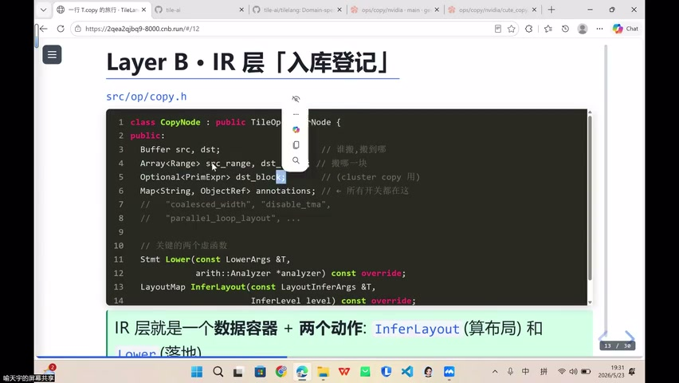

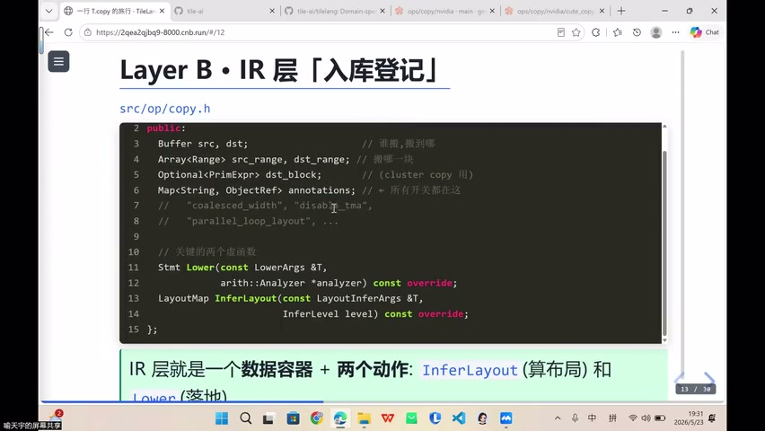

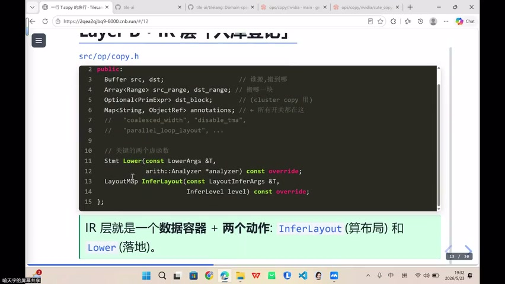

### 定义

```
IR = 数据容器（Node 对象） + 两个操作：
  ① infer_layout（布局推断）
  ② lower（降解/落地到硬件）
```

### Lower 过程

```
是否用 TMA？
  ├─ 是 → 生成 TMA 指令
  └─ 否 → 是否可用 cp.async？
            ├─ 是 → 生成 cp.async
            └─ 否 → 回退到普通同步搬运
```

- 能用最好的物流（顺丰 = TMA）就上
- 上不了就走邮政（普通 memcpy）→ 慢一点但也能到

---

## 六、整体 Lowering 流程


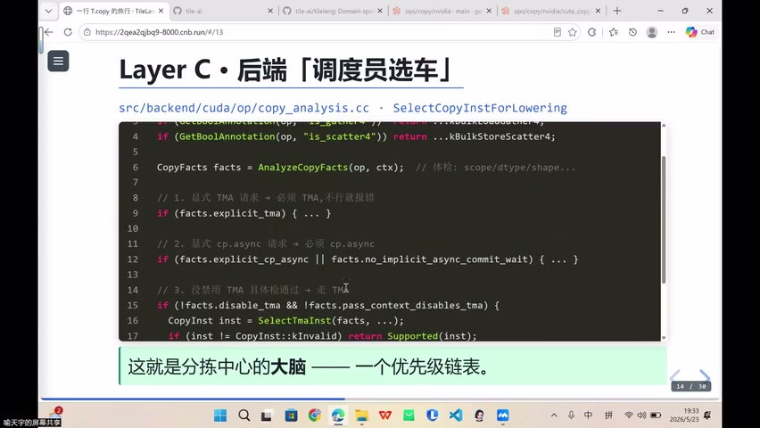

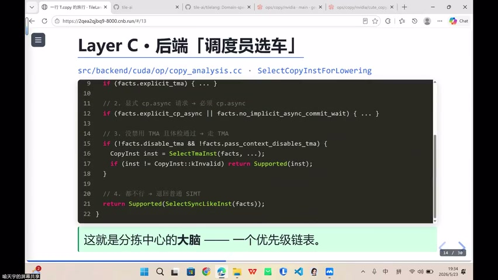

### 流程总结

```
① T.copy() 调用（Python 层）
② 生成 CopyNode（IR 层，包含完整搬运描述）
③ Pass 优化（pipeline / layout / vectorize）
④ match_target → 匹配当前硬件后端
⑤ CopyNode.lower() → 生成硬件特定指令
```

---

## 七、Copy Implement：注册机制

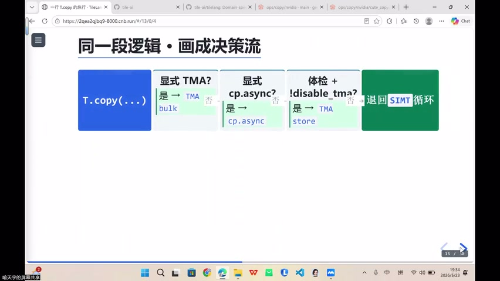

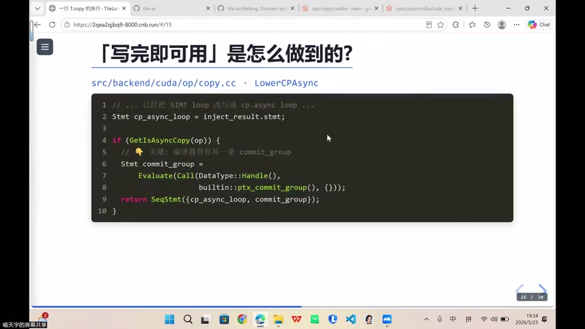

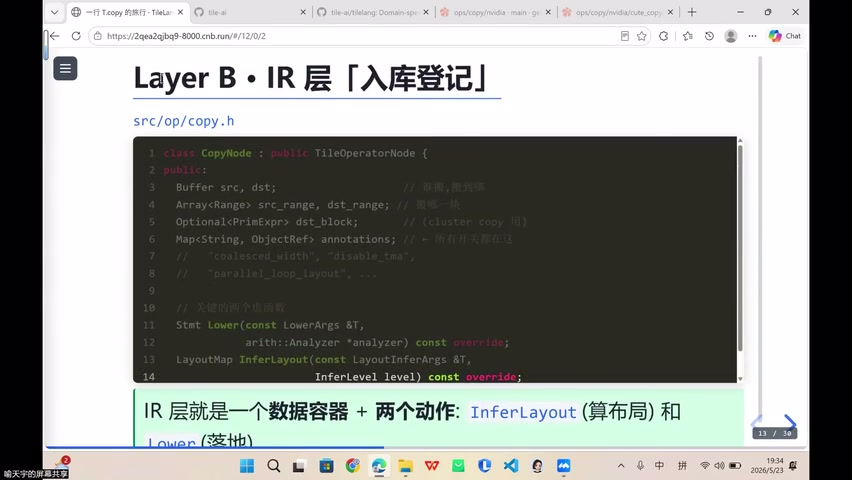

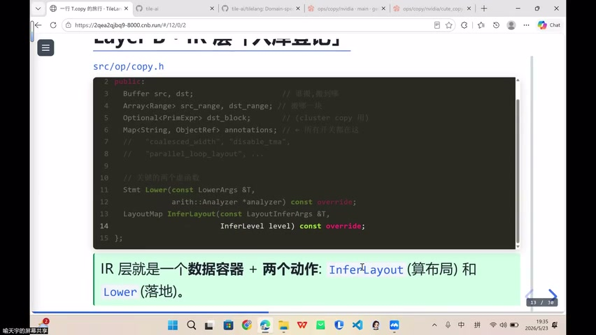

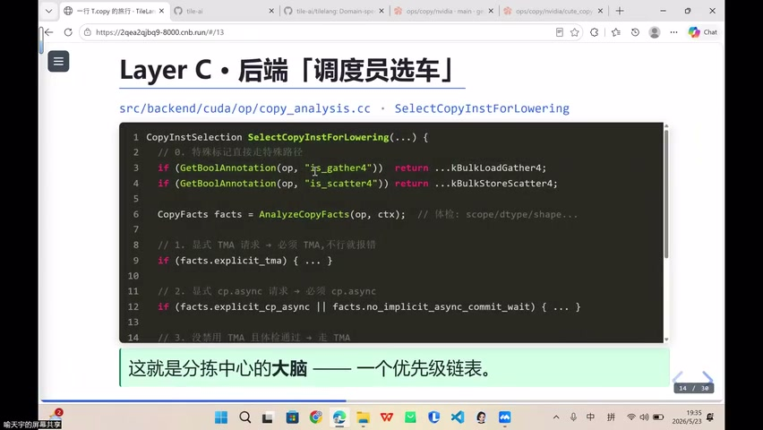


### CopyImplement 结构体

| 字段 | 含义 |
|------|------|
| **target** | 适用的目标硬件（NV / MetaX） |
| **priority** | 优先级（多个 implement 匹配时选最高） |
| **layout_map** | 布局推断映射 |
| **lower** | 实际的 Lowering 实现（生成硬件指令） |

### 注册与匹配机制

```
① 各后端注册自己的 CopyImplement
   - NV 后端：注册 TMA / cp.async 实现
   - MetaX 后端：注册对标指令实现
② 编译时 match_target → 找到匹配的 implement
③ 调用 CopyNode.lower() → 自动选择最优实现
```

### 核心思想

> 不同后端**各自注册**自己的搬运实现 → 系统通过 target 匹配 → 自动找到最优执行路径

---

## Key Terms

| 术语 | 含义 |
|------|------|
| Pass | 在 IR 上执行的分析/变换操作（pipeline、layout、vectorize） |
| CopyNode | IR 中表示搬运操作的节点对象（src、dst、annotations） |
| Annotation | 节点上的注解/标注（如是否启用 TMA、layout 偏好） |
| infer_layout | IR 的布局推断操作，决定数据在线程间的分布 |
| lower | 将 IR 节点降解为硬件特定指令的过程 |
| CopyImplement | 后端注册的搬运实现结构体（target、priority、layout_map、lower） |
| match_target | 根据目标硬件匹配已注册的 implement |
| 决策推迟 | 将硬件相关决策延后到信息充分的后端阶段 |
| Embedding DSL | 嵌入 Python 的领域特定语言，生成 IR Node 图 |
