# [P23] 软硬件技术精讲 - TileLang 简洁写法、硬件特化搬运与总结答疑

> **演讲者**：天宇（TileLang 社区 Committer）  
> **日期**：2026年5月  
> **活动**：TileLang Puzzle 算子开发实战营 第三课  

---

## 一、TileLang Puzzle 算子写法

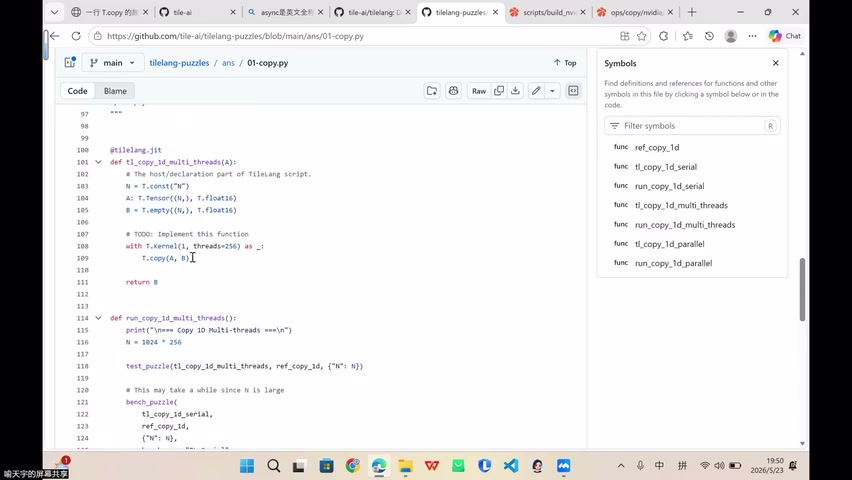

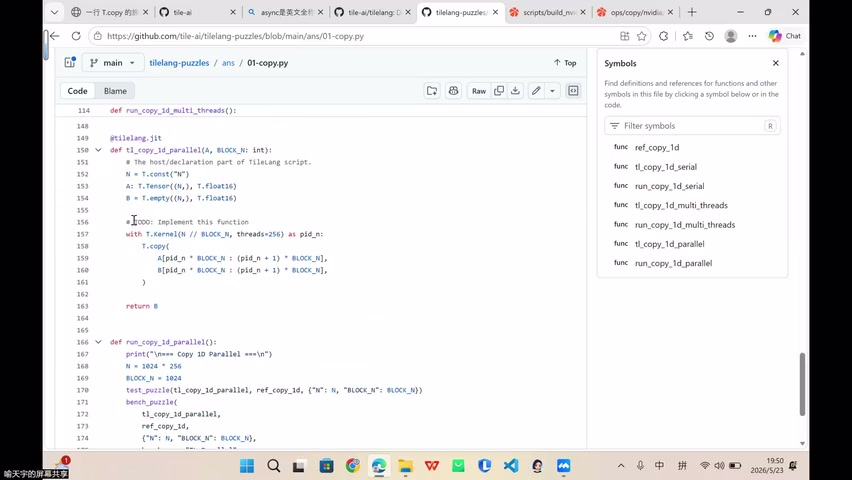

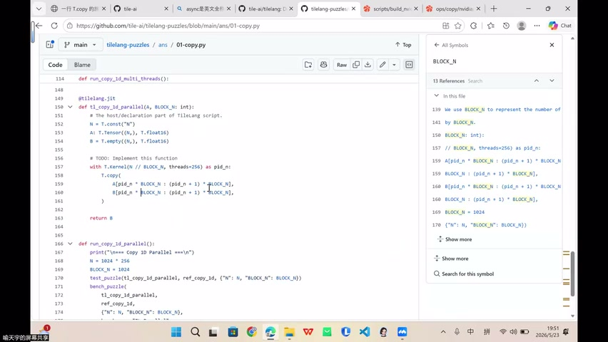

### 最简示例

```python
@T.kernel
def copy_kernel(A: T.Tensor[(N,), "float32"], B: T.Tensor[(N,), "float32"]):
    # thread = 256
    # 按 block_size=32 切分 tile
    for i in T.Parallel(N // 32):
        T.copy(A[i*32 : (i+1)*32], B[i*32 : (i+1)*32])
```

### 并行思维 vs 串行思维

| 串行思维（CPU） | 并行思维（GPU） |
|-----------------|-----------------|
| for 0 to 7：逐个搬运每个 tile | 索引 i 代表 0~7 中的**任意一个** |
| 需要循环控制 | 所有 tile **同时执行**相同操作 |

- 索引 `i` 不是"依次遍历"，而是"每个并行单元各自持有"
- 写一次操作 → 所有 tile 并行执行

---

## 二、编译器自动处理的一切

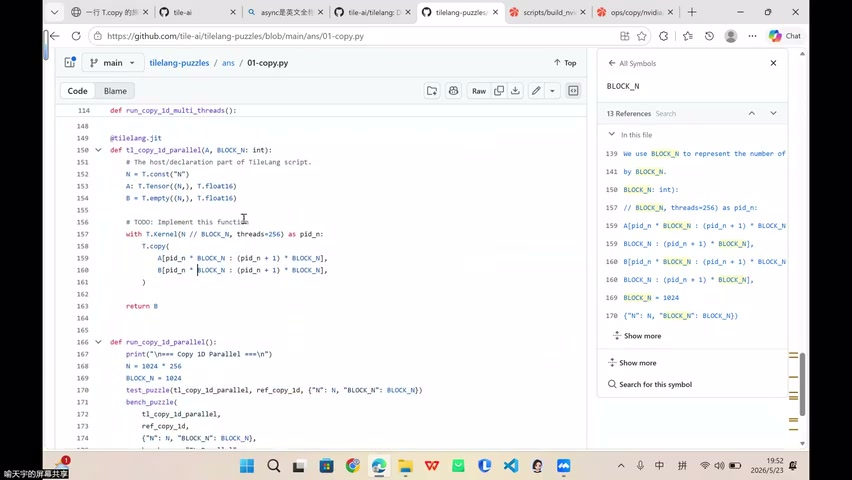

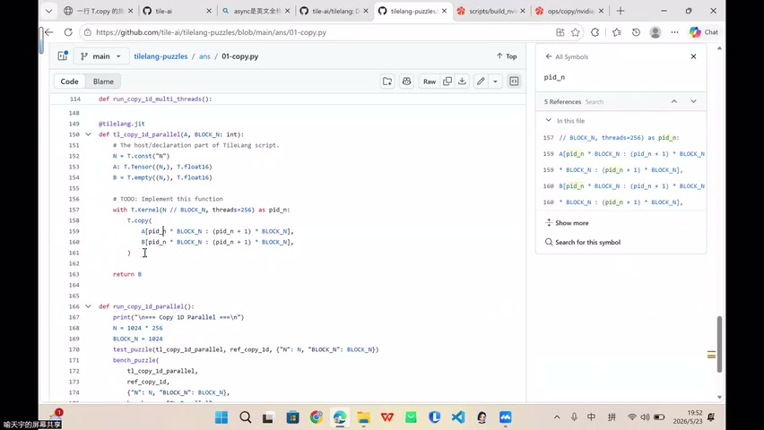

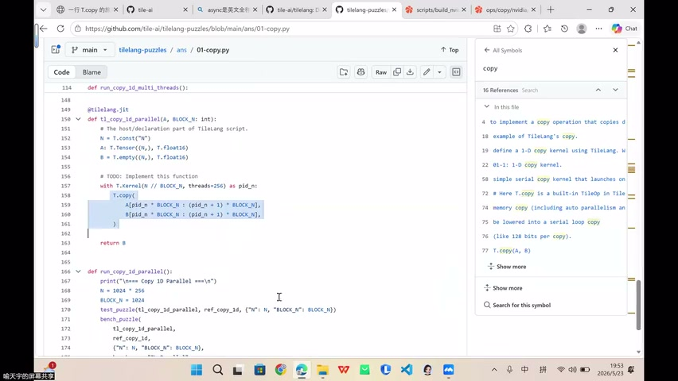

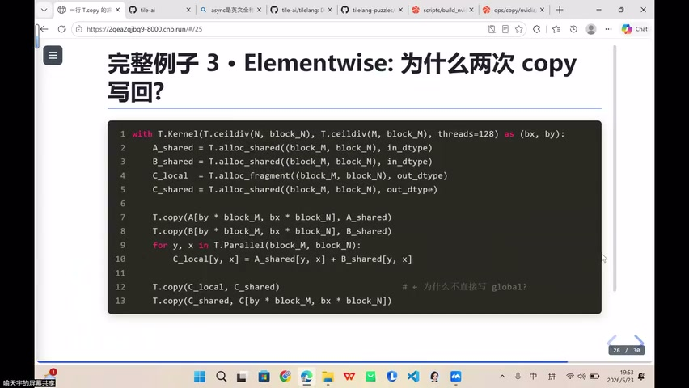

### 你只需做的

```
① 写好 source 和 destination
② 决定怎么切块（切多少块）
③ 给索引打标签
```

### 编译器自动完成的

| 操作 | 手动（CUTLASS） | TileLang 编译器 |
|------|-----------------|-----------------|
| Tensor View 构建 | 手动 | **自动** |
| Tile 切分 | 手动按 Block 切 | 通过 A_B **自动推断** |
| 越界检查 | 手动 Predicate | 根据 range **自动生成** |
| Copy 原语选择 | 手动 Copy_Atom | 编译器**自动选择** |
| 线程布局 | 手动构建 | 根据 shape + dtype **推断** |
| 数据切分 (Thread Slice) | 手动分配 | 编译器**自动** |
| Fragment 分配 | 手动 | 编译器**自动** |

---

## 三、向量加法示例（Elementwise）

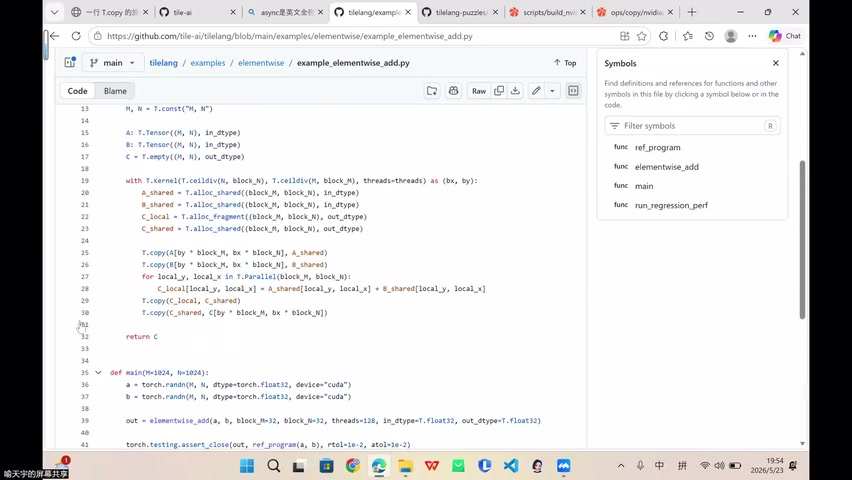

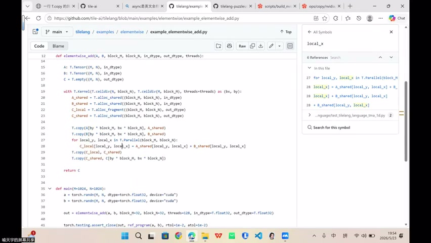

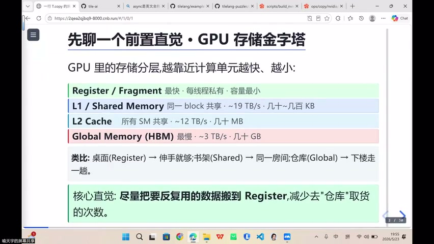

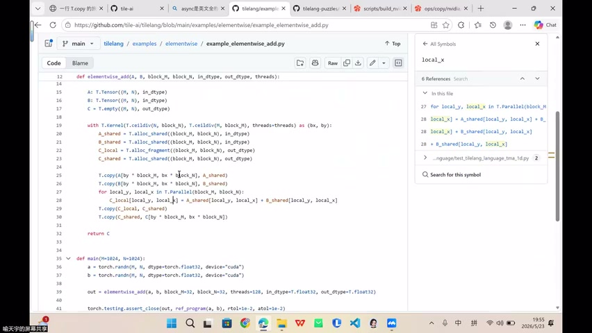

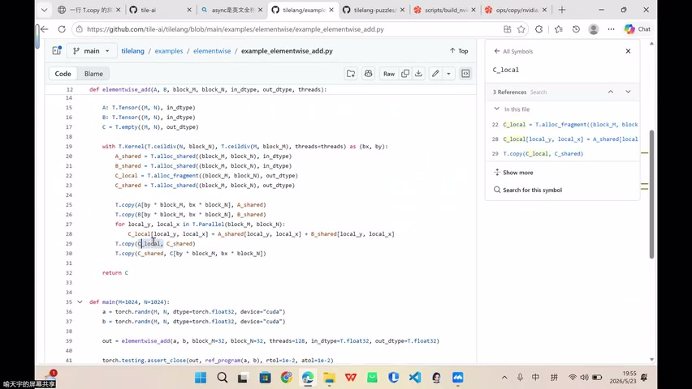

### 数据流

```
Global Memory → Local (Register) → 计算 → ? → Global Memory
```

### 疑问：为什么不直接从 Register 写回 Global？

- Elementwise 算子没有数据复用 → Shared Memory 似乎多余
- 直觉上：Register → Global 更直接

### 答案：硬件特化加速

> 某些硬件上，**两次 copy（Reg→Shared→Global）反而比一次直接写回更快**

---

## 四、硬件特化搬运：为什么两步比一步快

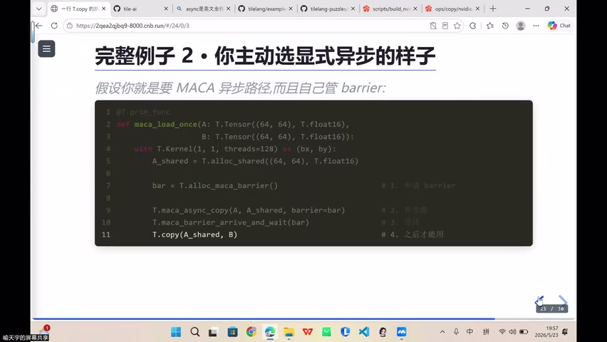

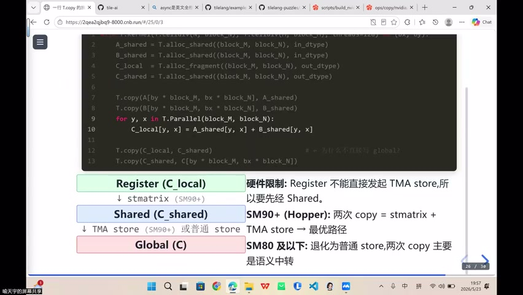

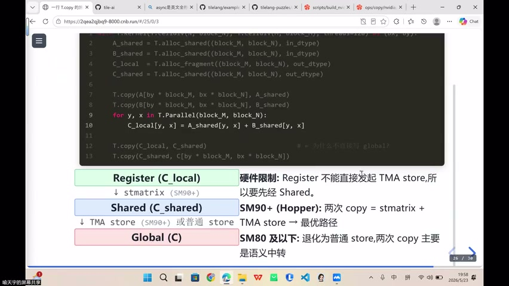


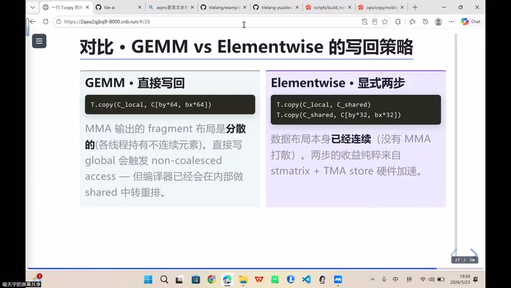

### SM90+（Hopper 架构）

```
Register → Shared Memory → Global Memory
    (STS Matrix 加速)      (TMA Store 加速)
```

- **STS Matrix**：Register → Shared 的特化加速指令
- **TMA Store**：Shared → Global 的特化加速指令
- 两步各有硬件加速 → 总速度 > 直接 Register → Global

### SM80 及以下（Ampere）

```
Register → Global Memory（直接写回）
```

- 没有 STS Matrix / TMA Store
- 退化为普通 store → 两次 copy 无意义
- 直接写回更合理

### 关键结论

| 架构 | 最优写回路径 | 原因 |
|------|-------------|------|
| SM90+ (Hopper) | Reg → Shared → Global | 两步均有硬件加速指令 |
| SM80 (Ampere) | Reg → Global | 无特化指令，直接写回 |
| MetaX | 视指令支持而定 | 可能有不同的加速路径 |

### 核心启示

> **写算子必须了解硬件**——同一个操作在不同硬件上的最优路径不同

---

## 五、课程总结与答疑

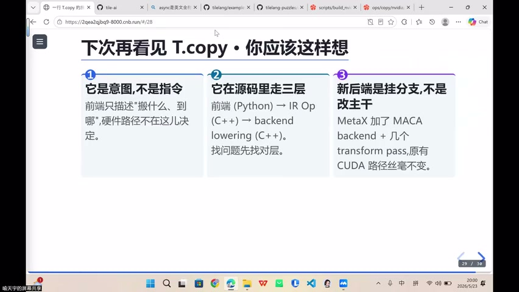

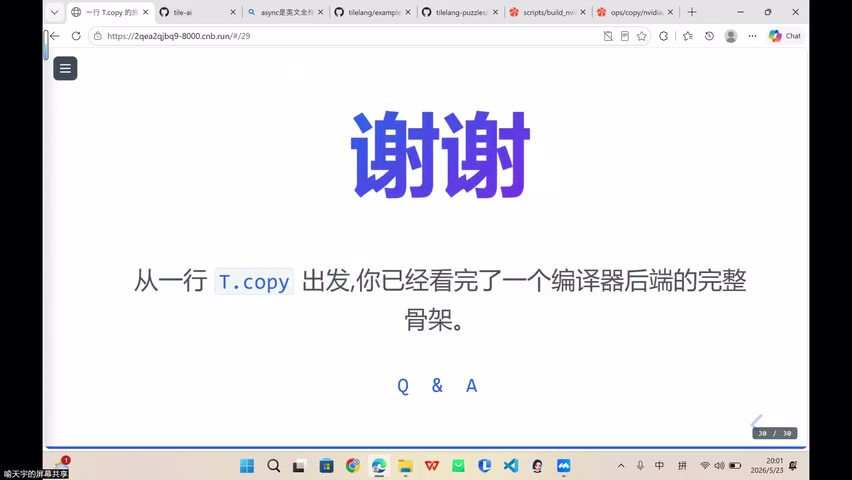

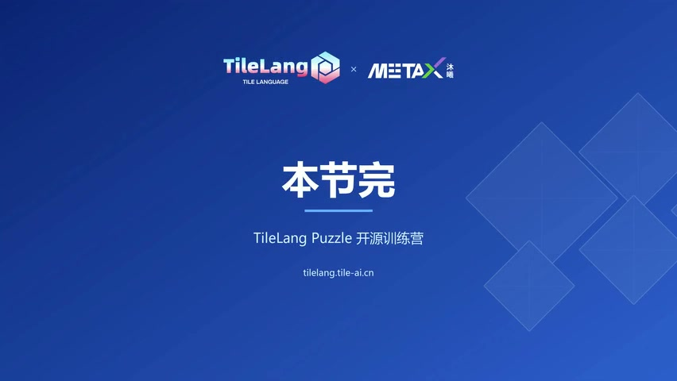

### 本课回顾

```
T.copy 封装流程：
  Python API → CopyNode (IR) → Pass 优化 → match_target → Lowering → 硬件指令
```

### 要点总结

- 搬运与硬件**息息相关**，不同硬件最优解不同
- Pipeline 设计也取决于硬件特性和指令支持
- 编译器帮你处理底层细节，但**理解硬件**才能写出最优算子
- 抽象与压缩的范式可迁移到其他软件工程领域

### 性能调优工具

- NVIDIA：**Nsight Compute**（查看 warp state 等指标）
- MetaX：后续第七节课专门介绍
- 不要依赖 print 调试 → 用专业 profiler

---

## Key Terms

| 术语 | 含义 |
|------|------|
| T.Parallel | TileLang 中的并行循环，每个 tile 同时执行 |
| Elementwise | 逐元素算子（如向量加法），无数据复用 |
| STS Matrix | SM90+ 的 Register→Shared Memory 特化加速指令 |
| TMA Store | SM90+ 的 Shared→Global Memory 特化加速指令 |
| Hopper | NVIDIA SM90 架构代号 |
| Ampere | NVIDIA SM80 架构代号 |
| 硬件特化 | 硬件厂商为特定数据路径设计的加速指令 |
| Nsight Compute | NVIDIA 的 GPU kernel 性能分析工具 |
| Pipeline | 异步搬运与计算重叠的流水线设计 |
| Fragment | MMA 运算中线程私有的寄存器缓冲 |
