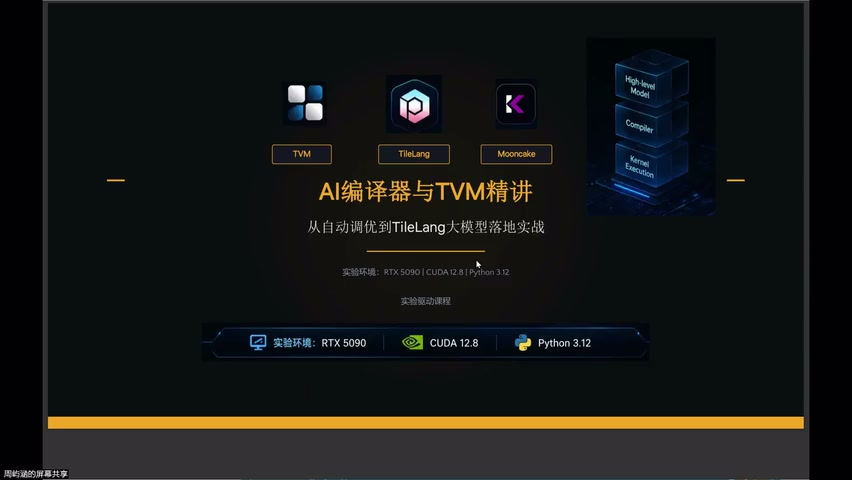
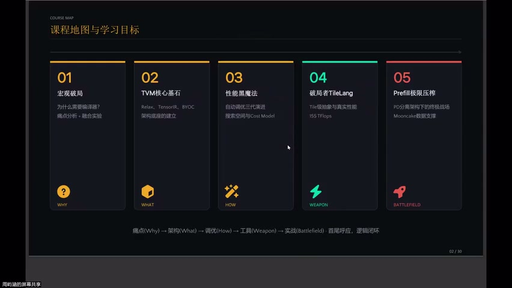
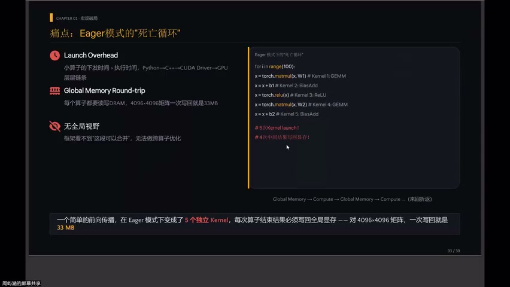
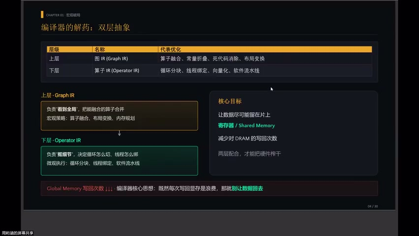
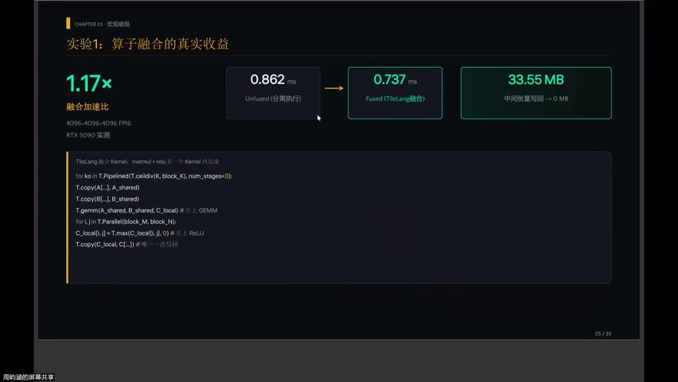
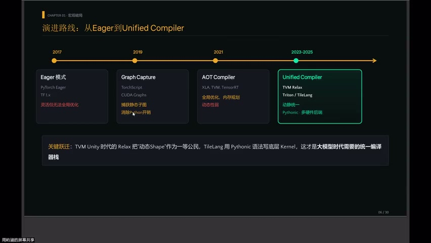
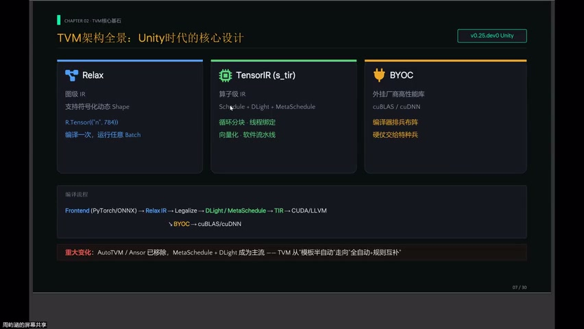
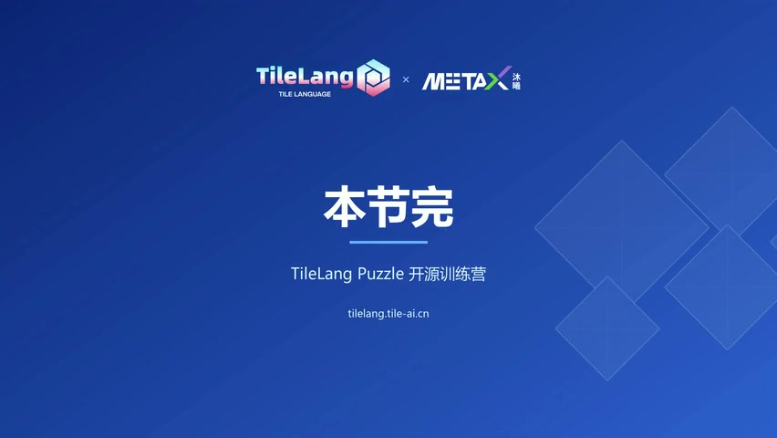

# [P24] AI 编译器与 TVM 精讲 - 为什么需要编译器、算子融合与十年演进

> **演讲者**：雨涵（TVM 贡献者，Mooncake 团队，LLM/PD 分离 & MetaX 适配）  
> **日期**：2026年5月  
> **活动**：TileLang Puzzle 算子开发实战营 第四课  

---

## 一、课程路线图





### 五章闭环结构

| 章节 | 主题 | 角色 |
|------|------|------|
| 第一章 | 大模型时代的显存墙与计算浪费 | 提出问题 |
| 第二章 | TVM 架构认知 | 工具认知 |
| 第三章 | 自动调优（MetaSchedule / DLight） | 黑魔法 |
| 第四章 | TileLang 核心抽象 | 利器 |
| 第五章 | PD 分离架构 & Prefill 极限压榨 | 前沿落地 |

---

## 二、没有编译器时的问题



### 一次简单前向传播 = 5 个独立 Kernel

```
Python → C++ → CUDA → Driver → GPU（每个 kernel 都走一遍）
```

### 三大痛点

| 痛点 | 说明 |
|------|------|
| **Launch 开销** | 每个 kernel 都要经过完整的调用链 |
| **显存往返** | 每个算子结束必须写回全局显存（一次 = 33MB） |
| **无全局视野** | 各 kernel 独立，无法跨算子优化 |

> 对大模型而言，这种浪费**不可接受**

---

## 三、编译器的解法：两层抽象



### 核心思想

> **别让数据回显存** → 引入两层抽象

| 层次 | 职责 |
|------|------|
| **上层（Graph IR）** | 看到全局 → 算子融合（合并可融合的算子） |
| **下层（Tensor IR）** | 抠细节 → 循环切分、线程绑定、数据放置（Register / Shared） |

### 两层配合 → 榨干硬件

```
Graph IR：决定"谁和谁合并"
Tensor IR：决定"合并后怎么算最快"
```

---

## 四、算子融合实验验证





### RTX 4090 对比实验

| 场景 | 融合收益 | 原因 |
|------|----------|------|
| 大矩阵 (4096×4096) | **17% 加速** | 省掉 33MB 显存写回 |
| Memory-bound 算子链 (LayerNorm→Linear→GELU) | **2x ~ 10x** | 数据留在片上，不回显存 |

### 关键结论

> 计算密度越高 → 融合收益越小（但仍有）  
> Memory-bound 链 → 融合收益巨大

---

## 五、AI 编译器十年演进



### 四代演进

| 代际 | 代表 | 特点 | 代价 |
|------|------|------|------|
| 第一代 | PyTorch Eager | 灵活、动态 | 无全局优化 |
| 第二代 | TorchScript | 静态捕获 | 动态性受限 |
| 第三代 | XLA / TVM | 全局编译优化 | 动态形状差、编译时间长 |
| **第四代** | **Relax (TVM Unity)** | 动态 shape 一等公民 | — |

### 第四代特征

- 动态 shape 作为**一等公民**
- TileLang：用 Python 语法写底层 kernel
- 大模型时代需要的**统一编译器栈**

---

## 六、TVM v0.25：新时代



### 重大变化

| 旧版 (AutoTVM / Ansor) | 新版 (v0.25+) |
|------------------------|---------------|
| 模板搜索 | **MetaSchedule**（统一搜索框架） |
| 手写调度模板 | **DLight**（零搜索时间，规则调度） |
| 模板 → 半自动 | **全自动 + 规则互补** |

### 关键跃迁

```
模板驱动 → 搜索驱动 → 规则驱动（DLight）
```

- AutoTVM / Ansor 已**彻底移除**
- TVM 从"老 TVM"脱胎换骨

---

## Key Terms

| 术语 | 含义 |
|------|------|
| 算子融合 (Operator Fusion) | 将多个算子合并为一个 kernel，避免中间数据写回显存 |
| Launch 开销 | 每个 kernel 从 Python 到 GPU 的调用链开销 |
| Graph IR | 图级中间表示，负责全局算子融合 |
| Tensor IR | 张量级中间表示，负责循环/线程/存储优化 |
| Memory-bound | 性能瓶颈在内存带宽而非计算 |
| Relax | TVM Unity 的新一代 IR，动态 shape 一等公民 |
| MetaSchedule | TVM 统一自动调优搜索框架 |
| DLight | 零搜索时间的规则调度器 |
| PD 分离 | Prefill-Decode 分离架构（大模型推理） |
| TVM Unity | TVM 第四代统一编译器架构 |
