# [P25] AI 编译器与 TVM 精讲 - TVM 架构与自动调优：Relax、MetaSchedule、DLight

> **演讲者**：雨涵（TVM 贡献者，Mooncake 团队）  
> **日期**：2026年5月  
> **活动**：TileLang Puzzle 算子开发实战营 第四课  

---

## 一、Relax：动态 Shape 的生死攸关

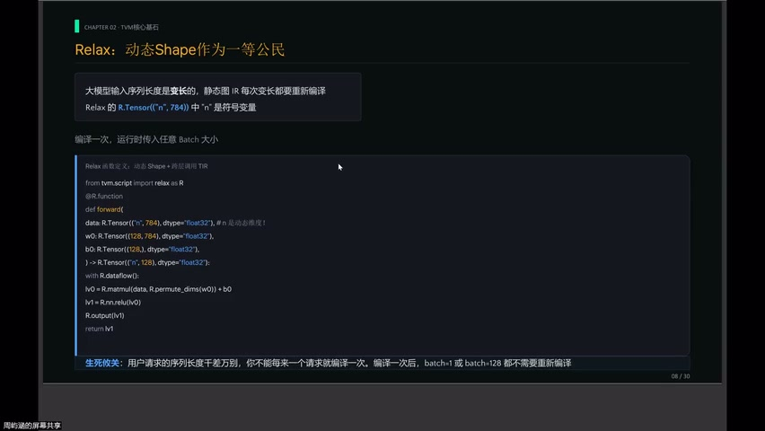

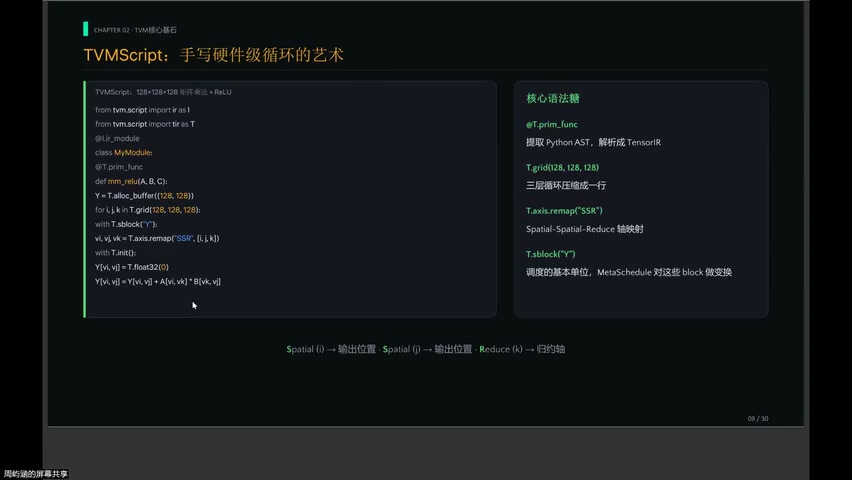

### 问题

- 大模型输入序列**变长**（每次请求序列千差万别）
- 传统静态图 IR：每次 shape 变化 → **重新编译** → 生产环境不可接受

### Relax 的解法

```python
# N 是符号变量，不是固定数字
x: R.Tensor((n, 784), "float32")
```

- 编译一次 → batch=1 或 batch=128 都**无需重编译**
- 动态维度作为**一等公民**

---

## 二、TIR 与 TVMScript


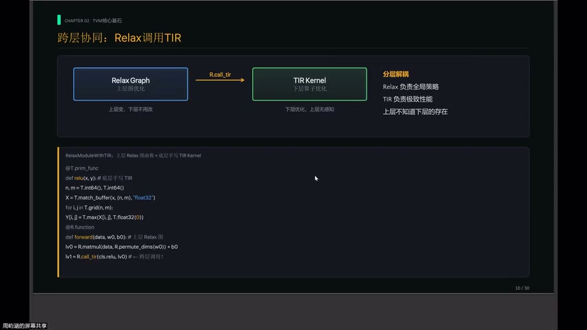

### 两层分工

| 层次 | 描述对象 | 执行对象 |
|------|----------|----------|
| **Relax** | 计算图（Graph） | 全局策略 |
| **TIR** | 线程循环 + 内存读写 | GPU 实际执行 |

### TVMScript

- 看起来像 Python，但**不是**给 Python 解释器执行的
- 提取 Python AST → 解析成 TIR
- 关键语法：
  - `T.grid`：三层循环压缩成一行
  - `T.block`：调度的基本单位（MetaSchedule 对其做变换）

---

## 三、TVM 分层解耦


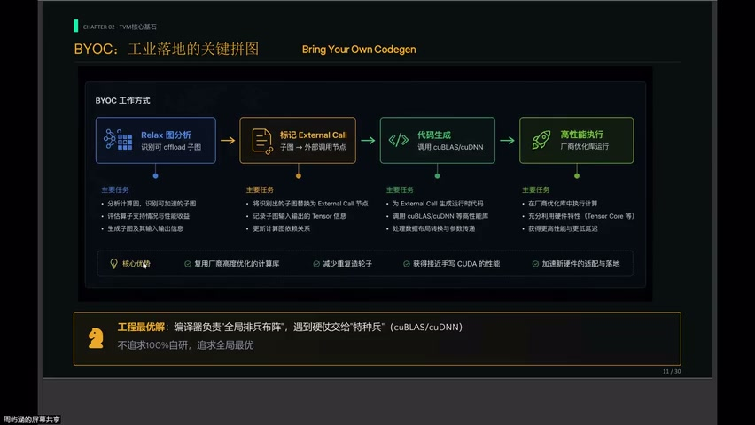

### 跨层调用

```
Relax（全局策略）：决定哪里融合、哪里变换布局
    ↓ R.call_tir
TIR（微观优化）：具体算子的循环/向量化/存储
```

### 解耦原则

- 上层**不知道**下层的存在
- 下层**不关心**上层的图结构
- 想用特殊向量化指令？→ 直接用 TIR 写 → Relax 通过 `R.call_tir` 调用

> 这是工业级编译器**必备的分层能力**

---

## 四、BYOC：与厂商库共存


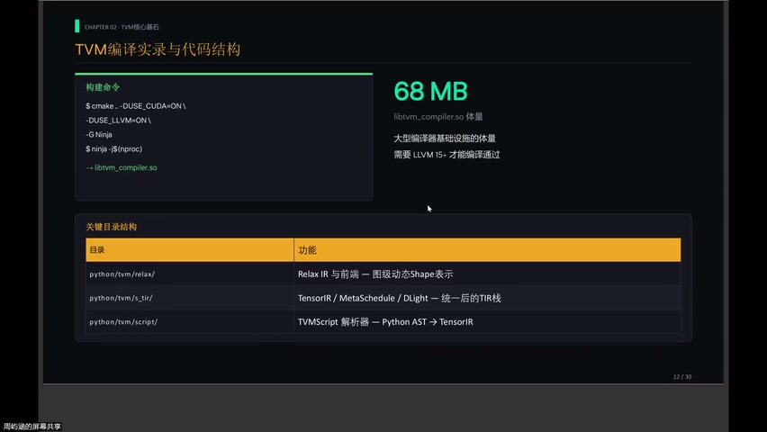

### 现实

- cuBLAS / cuDNN：NVIDIA 工程师用**汇编调出来的**
- FlashAttention 自动生成的 kernel：短期难以超越

### TVM 的策略：不硬刚

> **BYOC (Bring Your Own Codegen)**：编译器负责全局排兵布阵，遇到标准算子 → 交给"特种兵"

| 角色 | 负责 |
|------|------|
| 编译器 | 全局策略（融合、布局、调度） |
| cuBLAS / cuDNN | 标准 GEMM / Conv 等（极致优化） |

- 不是认输 → 是**工程最优解**

---

## 五、TVM 编译体量


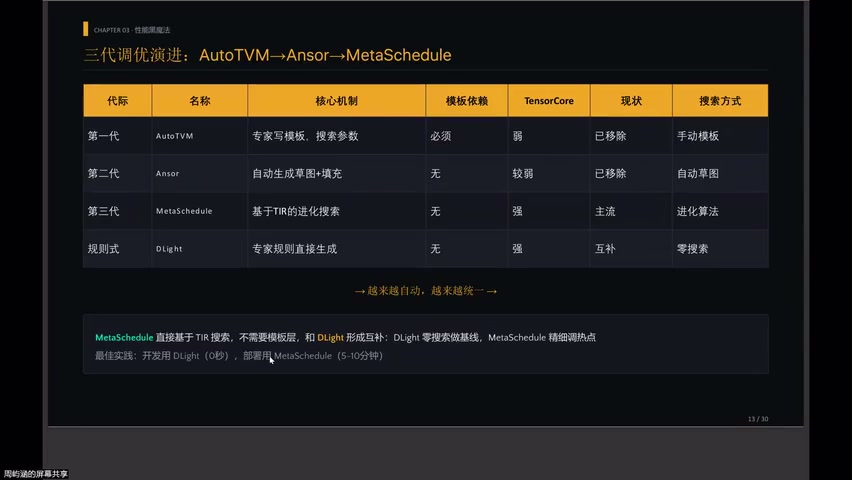

### 编译要求

- TVM v0.25 要求 **LLVM 15+**
- 最终生成 `libtvm_compiler.so` ≈ **68MB**
- 大型编译器基础设施体量

### 统一框架

- MetaSchedule + DLight 都在同一个 TVM 目录中
- 从多个碎片 → **统一框架**

---

## 六、三代自动调优演进


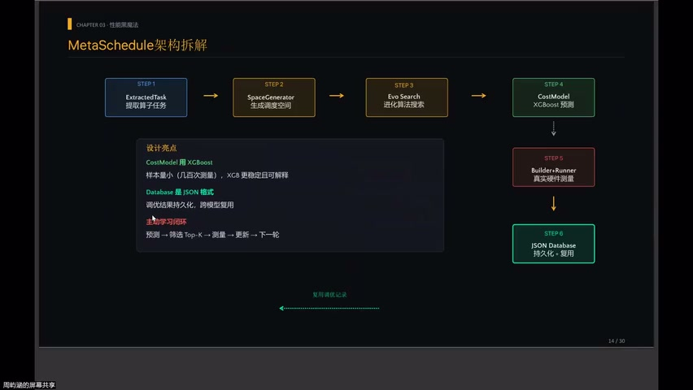

| 代际 | 方法 | 优点 | 缺点 |
|------|------|------|------|
| **AutoTVM** | 半自动：写参数化模板 → 搜索参数 | 可控 | 模板是手艺活，难覆盖 TensorCore |
| **Ansor** | 全自动：生成草图 → 搜索 | 无需模板 | 复杂算子（FlashAttention）易失效 |
| **MetaSchedule** | 基于 Trace 搜索，无需模板 | 集大成 | 需要搜索时间 |

### MetaSchedule + DLight = 最佳搭档

- DLight：零搜索极限（规则调度）
- MetaSchedule：精细调热点

---

## 七、MetaSchedule 六步闭环


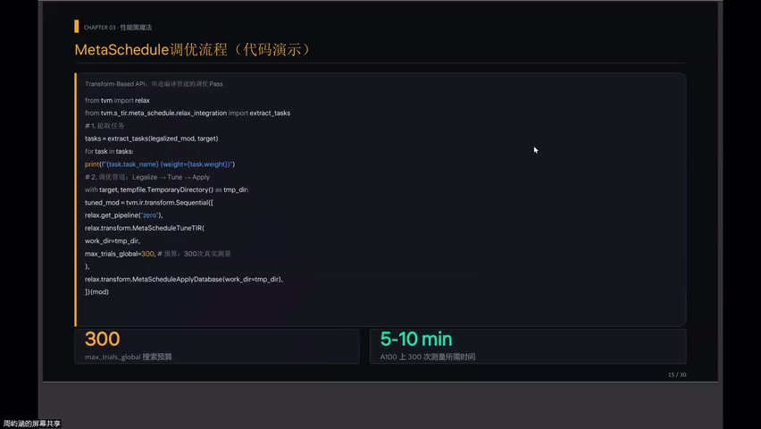

### 核心机制

```
搜索空间（数百万调度）
    → Cost Model 预测"这 10 个最有戏"
    → Runner 在真实 GPU 上测量
    → 结果反馈训练 Cost Model
    → 循环（主动学习）
```

### 关键设计

| 设计点 | 选择 | 原因 |
|--------|------|------|
| Cost Model | **XGBoost**（非深度学习） | 样本少（几百次），XGB 更稳定、可解释 |
| Database | **JSON 格式** | 相同 shape/算子可直接复用，无需重搜 |

---

## 八、DLight：零搜索时间规则调度

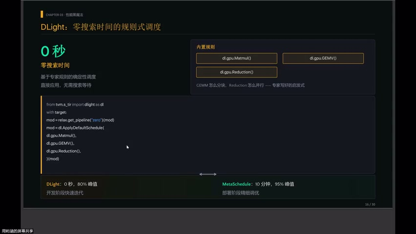

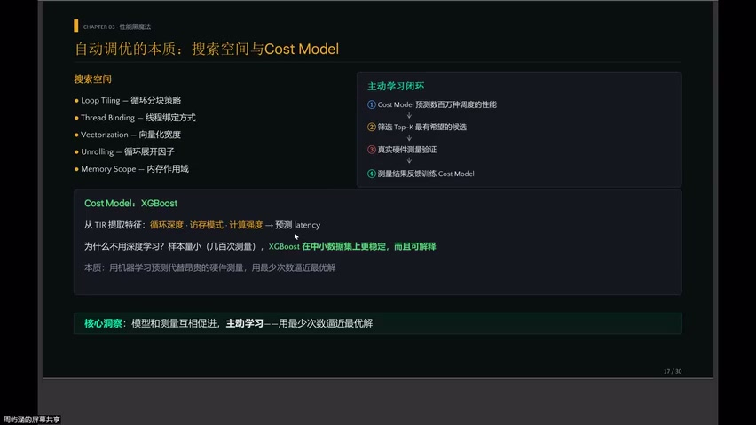

### 定位

> 开发迭代时用 DLight（秒级），部署上线前用 MetaSchedule（分钟级）

### DLight 原理

- 专家写好的**启发式规则**
- GEMM 怎么分块、Reduction 怎么并行 → 直接应用
- **零等待上线**

### 典型工作流

```
开发阶段：DLight（即时调度，快速迭代）
部署阶段：MetaSchedule（对热点算子精细调优）
```

### 实用技巧

```python
# 只调最关键的 matmul，其余交给 DLight
backend="meta_schedule", op_names=["matmul"]
# max_train_global=300 → 约 5~10 分钟 (4090)
```

---

## 九、自动调优的本质


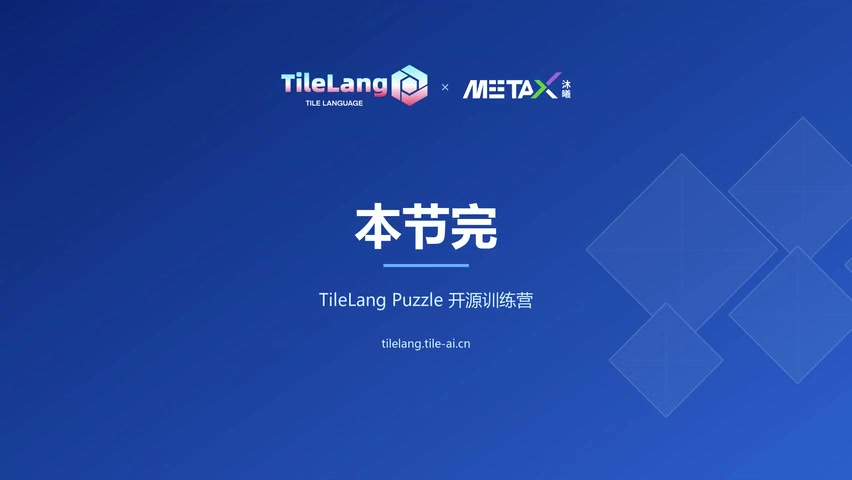

### 核心洞察

> 自动调优 = **机器学习问题**

- 不是暴力枚举
- 是用**代价模型预测**代替昂贵的硬件测量
- 模型与测量互相促进（主动学习）
- 用**最少次数**逼近最优解

---

## Key Terms

| 术语 | 含义 |
|------|------|
| Relax | TVM Unity 的图级 IR，动态 shape 一等公民 |
| TIR (Tensor IR) | 线程级 IR，描述循环/内存/线程绑定 |
| TVMScript | 类 Python 语法编写 TIR 的前端 |
| T.block | TIR 中调度的基本单位 |
| BYOC | Bring Your Own Codegen，接入厂商库 |
| MetaSchedule | 基于 Trace 的统一自动调优框架 |
| DLight | 零搜索时间的规则调度器 |
| Cost Model | 代价模型（XGBoost），预测调度性能 |
| 主动学习 | 模型预测 → 测量 → 反馈训练的闭环 |
| Trace | MetaSchedule 中的调度变换记录 |
