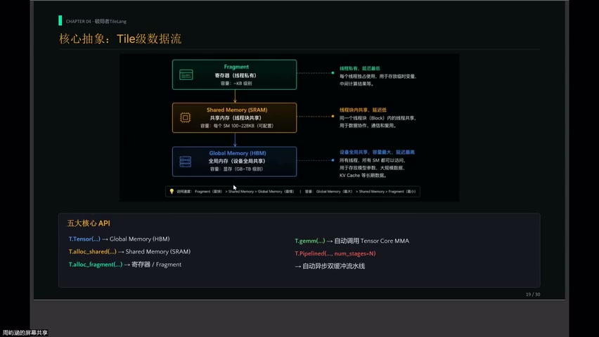
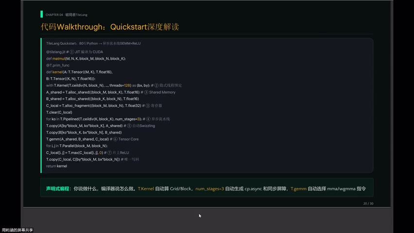
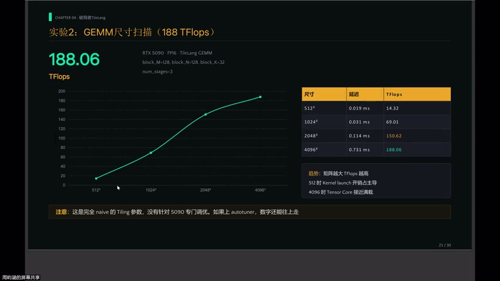
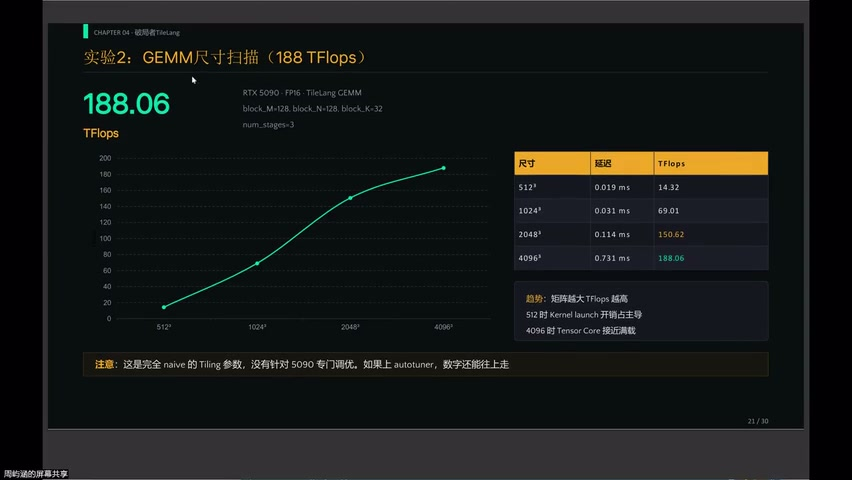
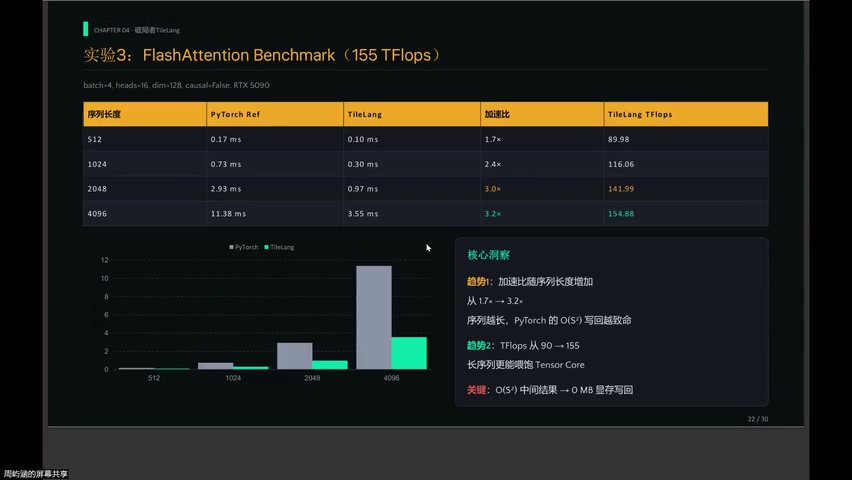
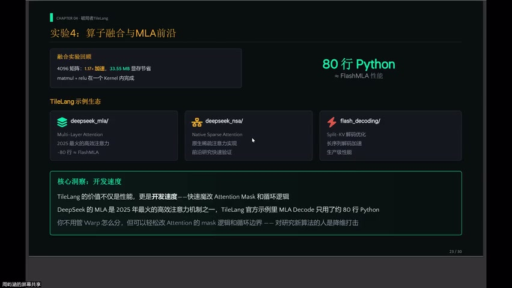
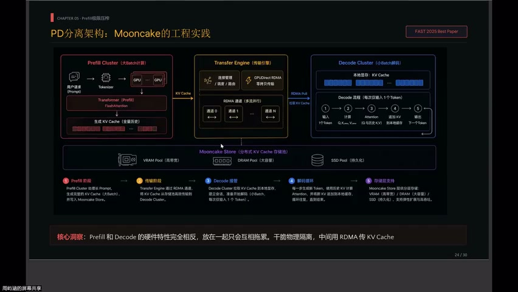
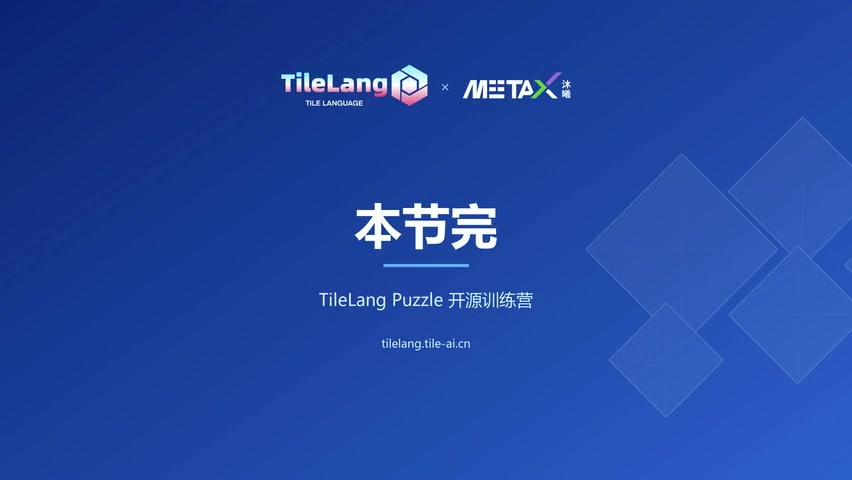

# [P26] AI 编译器与 TVM 精讲 - TileLang 核心抽象与 GEMM/Attention 实验

> **演讲者**：雨涵（TVM 贡献者，Mooncake 团队）  
> **日期**：2026年5月  
> **活动**：TileLang Puzzle 算子开发实战营 第四课  

---

## 一、TileLang 定位：为什么还需要一个新 DSL





### 痛点

- 写高性能 GPU kernel 仍然很难
- 企业级 GPU 算子开发：数十天甚至数月
- 需要同时了解硬件性能特性 + 算子/融合算子知识
- 不同硬件（NVIDIA / AMD / 沐曦）指令集各异

### 三种方案对比

| 方案 | 特点 | 不足 |
|------|------|------|
| **TIR (TVMScript)** | 手写循环 + 线程绑定，性能天花板高 | 流水线必须自己管，开发慢 |
| **Triton** | 管一部分底层 | switch、流水线仍须手写 |
| **TileLang** | 你只管声明 | 底层内存布局、异步流水线、Tensor Core dispatch **全包** |

> TileLang 的哲学：**你说做什么，编译器就做什么**

---

## 二、五个核心概念


理解五个概念 = 理解 TileLang 80% 的设计哲学：

| # | 概念 | 说明 |
|---|------|------|
| 1 | `T.copy` | Global Memory → Shared Memory 搬运 |
| 2 | `T.gemm` | 在 Shared Memory 中自动调用 Tensor Core MMA |
| 3 | 自动 Pipeline | 当前块计算时，下一块已在后台搬运 |
| 4 | 自动同步 | `cp.async` + barrier 由编译器自动插入 |
| 5 | 声明式编程 | 不写线程绑定、不写同步点 |

### 数据流

```
Global Memory ──T.copy──▶ Shared Memory ──T.gemm──▶ Tensor Core 计算
                              ↑
                    自动异步流水线（nb_stage）
```

---

## 三、Quick Start 代码深度解读



### 关键代码解析

| 行号 | 代码 | 解读 |
|------|------|------|
| L4 | `T.kernel(...)` | 无需写 `thread_idx`，由 `block_size=128` + 矩阵尺寸自动推导 grid/block |
| L7 | `nb_stage=3` | 异步流水线级数 → 编译器自动生成 `cp.async` + 同步屏障 |
| L10 | `T.gemm(A, B, C)` | 根据 GPU 架构自动选择 MMA 指令（WMMA / MMA.async / Hopper / Blackwell） |
| L14 | `T.relu(C)` | 直接在 Shared Memory 原地操作，无需写回再读取 |

### 核心思想

- 用户**不写**线程索引、同步点、流水线代码
- 编译器根据架构自动 dispatch 最优 MMA 指令
- ReLU 等后处理在片上完成 → **零额外显存读写**

---

## 四、GEMM Benchmark（RTX 5090）





### 实验数据

| 矩阵尺寸 | TFLOPS | 说明 |
|-----------|--------|------|
| 512 × 512 | ~14 | kernel launch + 同步固定开销主导 |
| 4096 × 4096 | ~188 | 计算充分摊薄开销 |

### 性能分析

- RTX 5090 FP16 Tensor Core 峰值 ≈ **800 TFLOPS**
- MFU = 188 / 800 ≈ **23%**
- 注意：使用完全 native 参数（128×128×32），**未针对 5090 调优**
- 若配合 auto-tuner，数字还有上升空间

---

## 五、FlashAttention 实验




### 背景

- 大模型 Prefill 阶段的真正瓶颈不是 GEMM，而是 **Attention**
- FlashAttention 是 Prefill 阶段的核心算子

### 实验结果（RTX 5090）

| 指标 | 趋势 |
|------|------|
| 加速比（vs Naive Attention） | 1.7× → **3.2×**（随序列长度增加） |
| TFLOPS | 90 → **155** |

### 为什么序列越长优势越大

- Naive Attention：将 O(S²) 的 score 矩阵**写回显存** → 序列越长，带宽开销越致命
- FlashAttention：全程**片上计算**，不缓存中间结果
- 长序列 → 更多计算喂饱 Tensor Core → TFLOPS 上升

---

## 六、融合能力：MLA 示例





### MLA (Multi-head Latent Attention)

- 2025 年最火的高效注意力机制之一（DeepSeek 系列）
- TileLang 官方示例：`examples/` 目录下

### 关键数据

> MLA decode 只用 **~80 行 Python** → 达到 FlashMLA 性能

### 为什么 TileLang 能做到

- 抽象层级**刚好**：不用管 register 怎么分
- 轻松修改 mask 逻辑、循环边界
- 对研究新算法的人 = **降维打击**

### TileLang 的融合维度

- 算子融合（多算子合一）
- 修改 mask / 循环边界（新算法快速验证）
- 挑战杯赛题中的三个算子优化均可用此方法

---

## 七、本节总结


### 课程回顾

```
编译器必要性 → TVM 架构（Relax + TIR）→ 自动调优（MetaSchedule + DLight）→ TileLang 利器
```

### TileLang 核心价值

| 维度 | 价值 |
|------|------|
| 开发效率 | 声明式 → 数十行代码 = 手写数百行 CUDA |
| 性能 | GEMM 23% MFU（未调优）、FlashAttention 3.2× 加速 |
| 可扩展性 | 新算法（MLA）快速实现，轻松改 mask/循环 |
| 跨硬件 | 编译器自动 dispatch 不同架构的 MMA 指令 |

---

## Key Terms

| 术语 | 含义 |
|------|------|
| TileLang | 基于 TVM 的声明式 Tile 级 DSL，自动处理流水线/同步/Tensor Core |
| T.copy | TileLang 原语：Global → Shared Memory 搬运 |
| T.gemm | TileLang 原语：自动调用 Tensor Core MMA 计算 |
| nb_stage | 异步流水线级数（如 3 = 三级 pipeline） |
| MFU | Model FLOPs Utilization，实际算力 / 峰值算力 |
| FlashAttention | 片上分块计算 Attention，避免 O(S²) 显存写入 |
| MLA | Multi-head Latent Attention（DeepSeek 提出的高效注意力） |
| 声明式编程 | 只描述"做什么"，编译器决定"怎么做" |
| cp.async | NVIDIA 异步全局→共享内存拷贝指令 |
| Tensor Core dispatch | 编译器根据架构自动选择 MMA 指令 |
