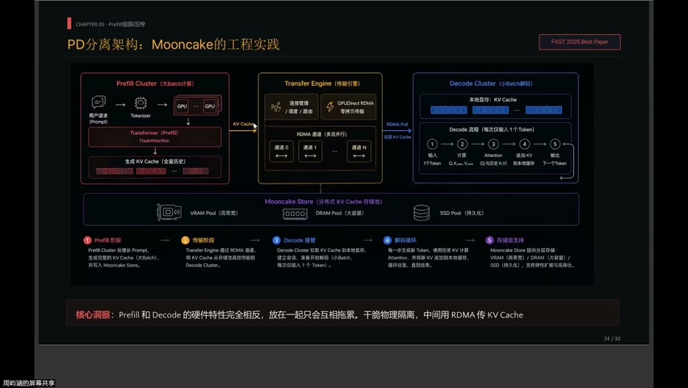
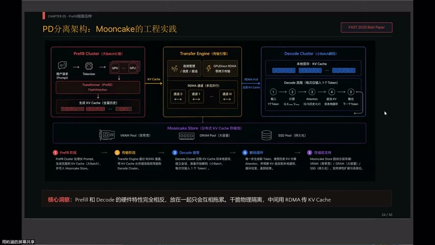
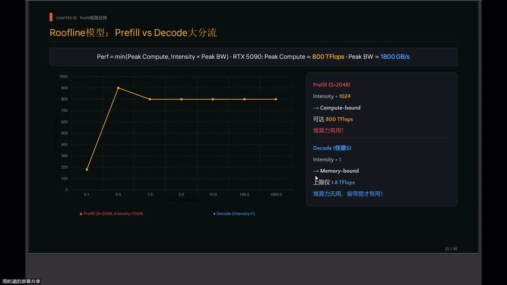
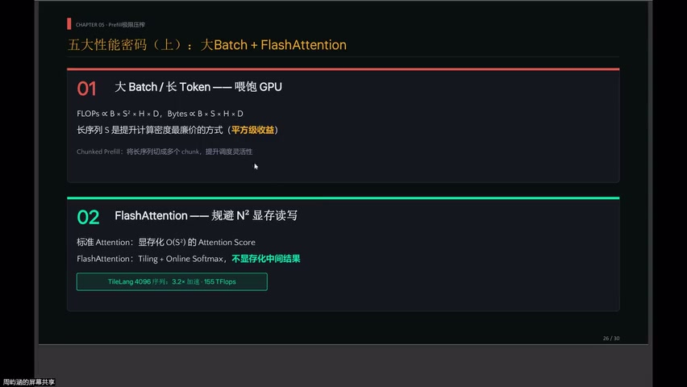
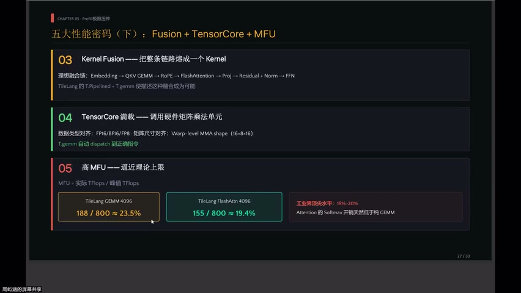
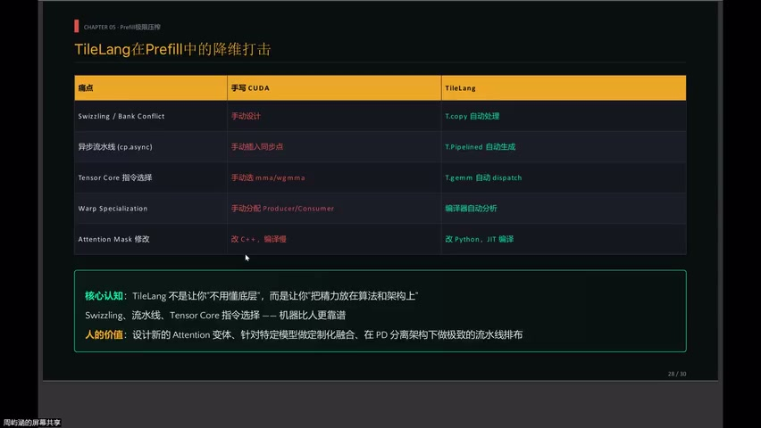
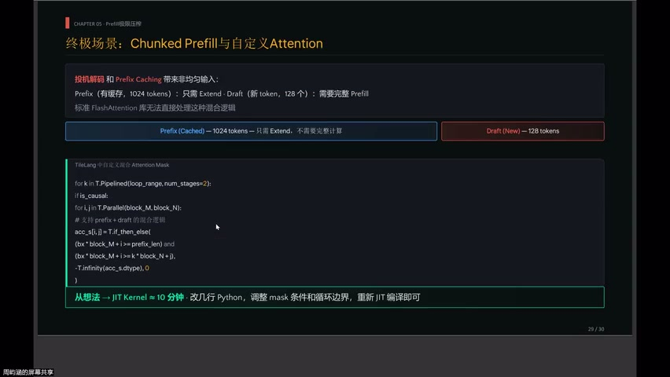
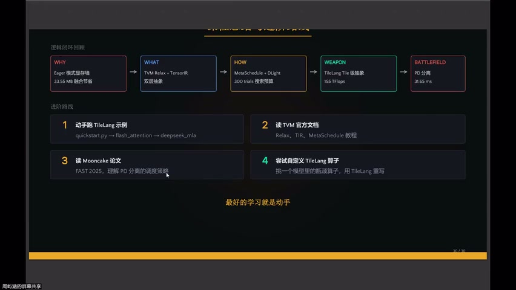
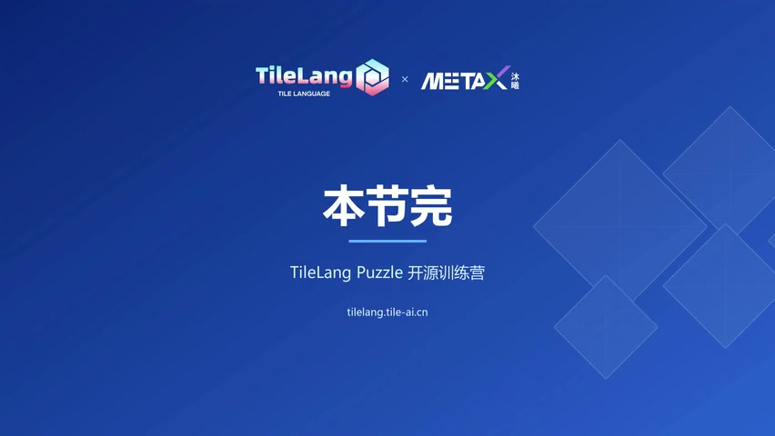

# [P27] AI 编译器与 TVM 精讲 - PD 分离架构与 Prefill 极限压榨

> **演讲者**：雨涵（TVM 贡献者，Mooncake 团队）  
> **日期**：2026年5月  
> **活动**：TileLang Puzzle 算子开发实战营 第四课  

---

## 一、PD 分离架构：Mooncake 工程实践





### Mooncake 简介

- KIMI 的**生产级推理平台**
- 获得 **FAST 2025 Best Paper**
- 核心机制：Prefill / Decode 硬件特性完全相反 → 放一起只会互相拖累

### 物理隔离方案

```
Prefill 节点（算力密集）──RDMA 传输 KV Cache──▶ Decode 节点（带宽密集）
```

- 32K tokens 的 KV Cache 传输仅需约 **3.1 秒**
- 传输开销可接受 → 分离收益远大于代价

---

## 二、为什么必须分离：Roofline 模型





### Prefill vs Decode 在 Roofline 上的位置

| 阶段 | 计算密度 | 所在区域 | 优化方向 |
|------|----------|----------|----------|
| **Prefill** | 随序列长度**平方增长**（2048 token → 1024 FLOPS/Byte） | Compute-bound | 给更多算力 → 更快 |
| **Decode** | 固定低密度（~1.8 FLOPS/Byte） | Memory-bound | 减少 KV Cache 搬运 |

### Decode 的正确优化方向

- **不是**算术融合
- **而是**：量化压缩、PD 分离、分布式缓存

> 硬件物理规律**迫使**两者分离，不是"我们想分离"

---

## 三、Prefill 极限压榨：五大密码




### 密码 1：长序列

- 计算量 ∝ S²，访存 ∝ S
- 序列越长 → 计算密度越高 → Tensor Core 越"开心"
- Prefill 天然喜欢大 batch（长 prompt）

### 密码 2：FlashAttention

- 革命性：**不把 Attention Score 写回显存**
- Q×K^T 结果 = B×H×S×S 矩阵（长序列 = 数十 GB）
- TileLang 将其拆分成小块 → Shared Memory 中完成 Softmax → 中间结果**全程片上**

### 密码 3：Fusion（融合）

- 多算子合一，减少中间显存读写
- 提升数据复用率

### 密码 4：T.gemm 自动挡

- 不需要知道 5090 用的是 TC-G5 MMA 还是 WGMMA
- 编译器根据**数据类型 + 架构**自动选择最优 MMA 指令
- 支持：FP16 / BF16 / FP8

### 密码 5：MFU 监控

- MFU = 衡量离天花板有多远的指标
- FlashAttention 实测 MFU ≈ **19.4%** → 工业界顶尖水平
- 为什么不是 100%？→ Softmax / Online Normalization 不走 Tensor Core

---

## 四、不可能三角与 TileLang 的解法



### 手写 Kernel 的困境

> 顾了流水线 → 乱了内存布局 → 掉了 Tensor Core → 忘了同步点

同时满足五大密码 → 对手写代码**不可能**

### TileLang 的解法

| 角色 | 负责 |
|------|------|
| **编译器** | 流水线、同步点、内存布局、MMA 选择（高门槛体力活） |
| **人** | 算法设计、架构决策、定制化融合 |

> 在"体力活"维度上，机器比人更靠谱

### MLSys 大赛案例

- MIT 团队：三人几乎不懂 CUDA（仅写过 ~1000 行）
- 借助 TileLang + 自动调优 → 进入**前三名**

---

## 五、TileLang 核心认知



### 定位

- **不是**让你不用懂底层
- **而是**让你把精力放在算法和架构上

### 人的价值

- 设定新的 Attention 变体
- 针对特定模型做定制化融合
- 针对不同架构做定制化融合
- PD 分离下的极致流水线排布

---

## 六、真实前沿场景：Prefix Caching





### 场景

- 投机解码 / Prefix Caching
- 输入 1024 token 中，前缀已有 KV Cache，仅 128 token 是新的

### 标准库的局限

- FlashAttention 库**不支持**部分混合计算

### TileLang 的解法

```
改几行 Python → 调整 mask 条件 + 循环边界 → JIT 重编译 → 定制化 kernel
```

> 从想法到可运行 kernel 可能只要 **10 分钟**

### TileLang 在大模型落地的终极价值

- 标准库覆盖不了的长尾场景 → TileLang 快速定制
- DeepSeek V4 也采用了 TileLang

---

## Key Terms

| 术语 | 含义 |
|------|------|
| PD 分离 | Prefill-Decode Disaggregation，物理隔离两阶段到不同节点 |
| Mooncake | KIMI 生产级推理平台（FAST 2025 Best Paper） |
| Roofline Model | 以计算密度为横轴、性能为纵轴的分析模型 |
| Compute-bound | 计算受限区域，增加算力可提升性能 |
| Memory-bound | 带宽受限区域，减少数据搬运才是关键 |
| MFU | Model FLOPs Utilization，实际/峰值算力比 |
| Prefix Caching | 复用已有前缀的 KV Cache，仅计算新 token |
| 不可能三角 | 流水线 + 内存布局 + Tensor Core 难以手写同时满足 |
| JIT | Just-In-Time 编译，修改后立即重编译运行 |
| RDMA | Remote Direct Memory Access，节点间高速数据传输 |
