# [P28] AI 编译器与 TVM 精讲 - 总结·MetaX 环境实操演示与答疑

> **演讲者**：雨涵（TVM 贡献者，Mooncake 团队）  
> **日期**：2026年5月  
> **活动**：TileLang Puzzle 算子开发实战营 第四课  

---

## 一、五章课程总结

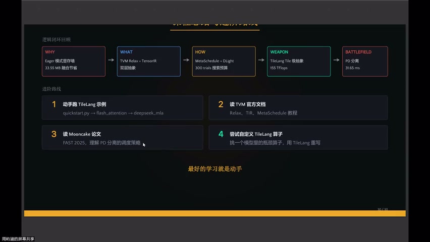

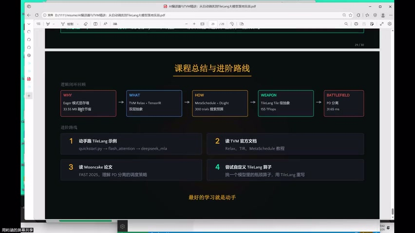

### 课程脉络

```
为什么需要编译器 → TVM 架构基石 → 自动调优黑魔法 → TileLang 降维打击 → PD 分离 + Prefill 极限压榨
```

| 章节 | 核心内容 |
|------|----------|
| Ch1 | 算子融合必要性、Graph IR + Tensor IR 两层抽象 |
| Ch2 | Relax（动态 shape）+ TIR（线程级）+ BYOC |
| Ch3 | MetaSchedule（搜索调优）+ DLight（零搜索规则） |
| Ch4 | TileLang 五概念、GEMM/FlashAttention/MLA 实验 |
| Ch5 | PD 分离架构、Prefill 五大密码、Prefix Caching |

> 虽然 FF（Full-Forward）架构已出现，但目前仍以 **PD 分离**为主流

---

## 二、下一步建议


### 学习路径

1. **跑 Quick Start**：感受 80 行 Python 生成 CUDA kernel 的魔法
2. **挑瓶颈算子**：从自己的模型中找到性能瓶颈
3. **用 TileLang 重写**：实际动手是最好的学习方式

---

## 三、项目推荐

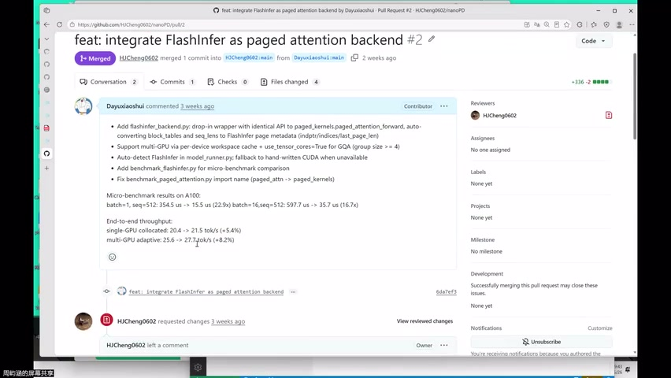

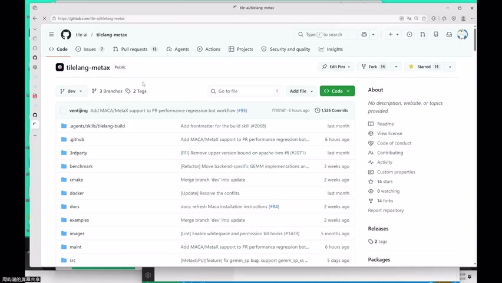

### Anton PD（北大信科）

- 小型 PD 分离推理架构
- 雨涵贡献：将手写 CUDA 算子替换为 TileLang（基于 Lighthouse 算子库）

| 平台 | 提升 |
|------|------|
| 单 CPU | Token throughput +5.4% |
| WGP5 | Token throughput +8.2% |

### TileLang 主仓贡献

- 部分 examples 在 NVIDIA 上通过但在 MetaX 上未通过
- 社区鼓励参与修复 → 贡献门槛低、价值高

---

## 四、MetaX 环境配置实操

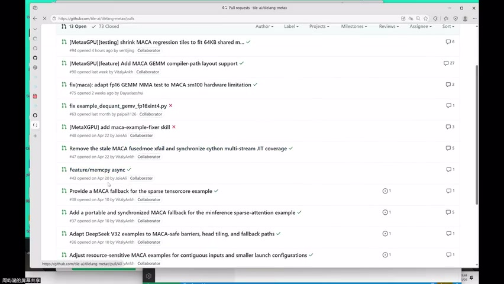

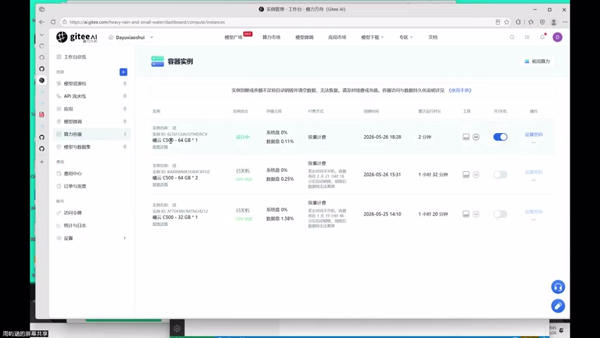

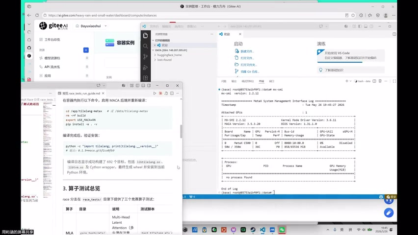

### 环境信息

- 沐曦云 C564GB
- TileLang v0.19
- 需要设置环境变量启用 MetaX 支持：

```bash
export USE_MAC=on    # 启用 TileLang 对 MetaX 的配置
export USE_ACM=on    # 可选
```

### 配置流程

```
1. 打开沐曦云环境（C564GB）
2. 选择 TileLang 0.19 版本
3. 设置 USE_MAC=on
4. git clone TileLang 仓库
5. 直接运行 tests / examples
```

---

## 五、MetaX 测试演示

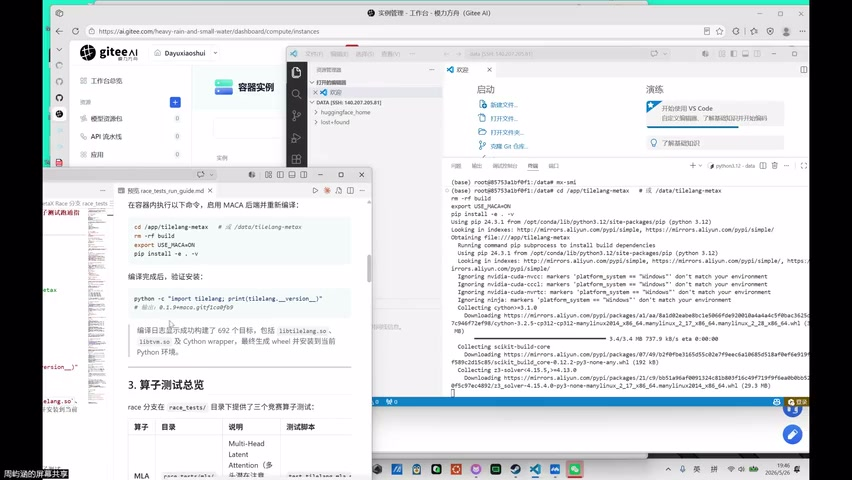

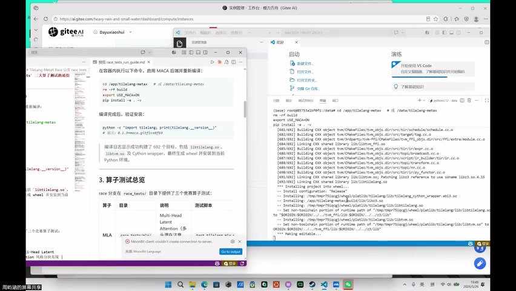

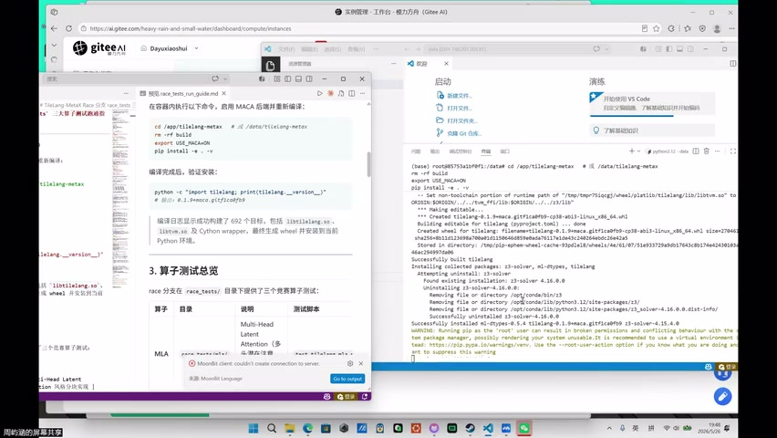

### 可运行的测试样例

| 样例 | 说明 |
|------|------|
| MLA | 类 FlashAttention 的双路径内核（TileLang 实现） |
| MOE | 混合专家模型 |
| NCA | 原生注意力前向推理 |

- 配置好 TileLang 环境后 → 直接 `python` 调用即可
- 无需额外编译步骤（JIT）

---

## 六、MLIR 讨论

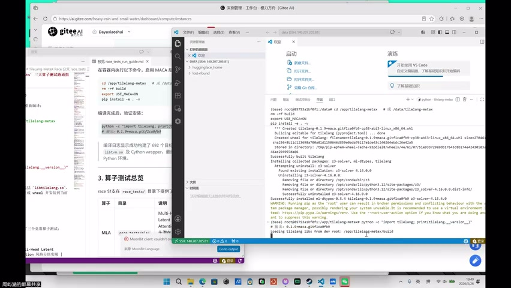

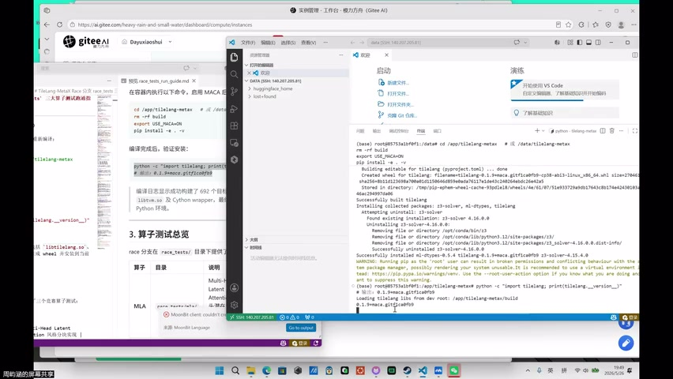

### 雨涵的观点

| 维度 | 评价 |
|------|------|
| 表达层 | 做好了"脚手架和砖块" |
| 编译器层 | 背后的编译器基础设施尚未完善 |
| 统一性 | 众多方言 + 分层 → 逐层下沉时"语义失真" |
| 版本碎片化 | 每家厂商都有自己的版本（如 Intel LLVM） |

> MLIR = "一场还没来得及成功的统一梦"

### 类比

- 如果 AI 编译器是土木工程：
  - MLIR 提供了砖块和脚手架
  - 但施工队（编译器后端）还没到位

---

## 七、答疑与结课

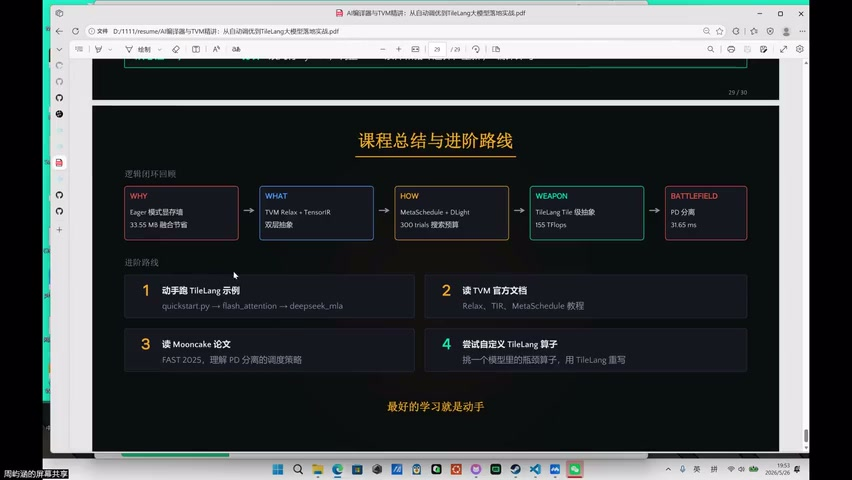

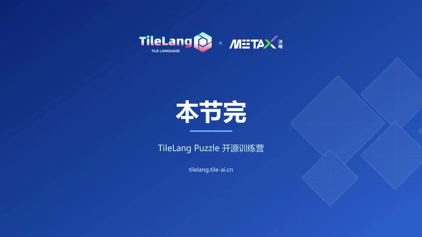

### 关键 Q&A

- **Q**: MetaX 上性能瓶颈在哪？
  - **A**: 主要在部分算子的 kernel 开销，自动调优仍有提升空间

- **Q**: 如何参与 TileLang 贡献？
  - **A**: 从 examples 在 MetaX 上的失败用例入手，修复即可

### 结课寄语

- 系统性学习 TVM 内核技术 + 实操演示
- 回去跑 samples，有问题在学习群讨论
- 实验代码将上传至 GitHub

---

## Key Terms

| 术语 | 含义 |
|------|------|
| PD 分离 | Prefill-Decode 物理隔离部署 |
| Anton PD | 北大信科的小型 PD 分离推理项目 |
| MetaX | 沐曦 GPU 硬件平台 |
| USE_MAC | 环境变量，启用 TileLang 对 MetaX 的支持 |
| MLIR | Multi-Level IR，LLVM 生态的多层中间表示框架 |
| JIT | Just-In-Time 编译，运行时即时编译 |
| Lighthouse | 标准算子库（用于替换手写 kernel） |
| FF 架构 | Full-Forward 架构（PD 分离的替代方案） |
| 语义失真 | MLIR 逐层 lowering 过程中信息丢失的问题 |
| CCF 创新大赛 | 沐曦参与的开源 GPU 贡献赛 |
