# [P29] 算子开发入门 - 算子开发重讲·计算图、算子、Kernel 与推理链

> **演讲者**：天宇  
> **日期**：2026年5月  
> **活动**：TileLang Puzzle 算子开发实战营 第五课  

---

## 一、重新类比：计算图、算子、Kernel

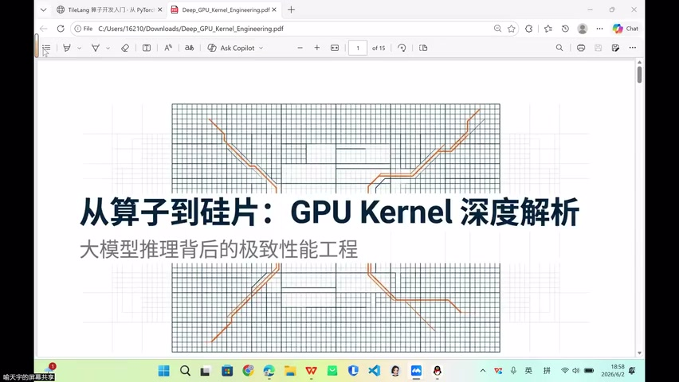

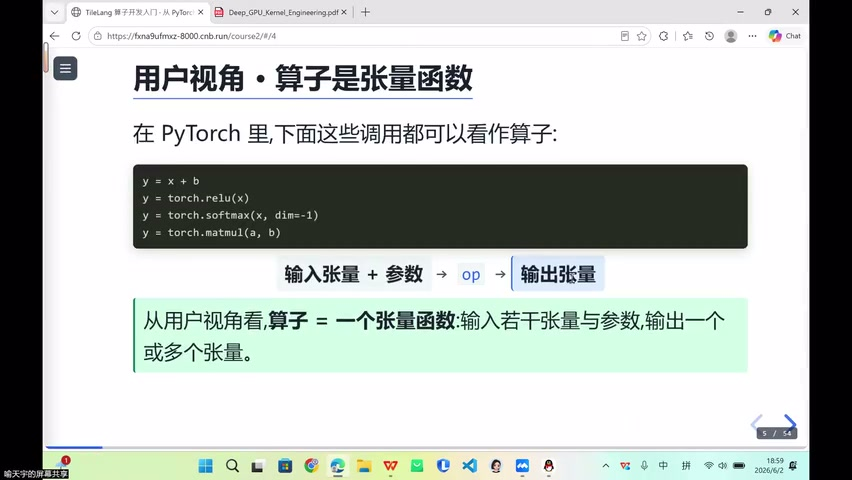

### 新类比（比上次更贴切）

| 概念 | 类比 | 说明 |
|------|------|------|
| **计算图** | 施工总图 | 来自模型算法 |
| **算子 (Operator)** | 标准化工序 | 经常出现的操作被标准化 |
| **Kernel** | 施工队的具体施工 | 不同硬件 = 不同施工队 → 不同 kernel |

### 为什么算子会标准化

- 某些算子（GEMM、Conv）反复出现 → 提前做了软硬件优化
- 变成"标准工序"后，未来无需重复优化
- 但模型算法在变（Full Attention → Linear Attention）→ 总有新算子需要手动优化

---

## 二、Transformer Block 的算子构成

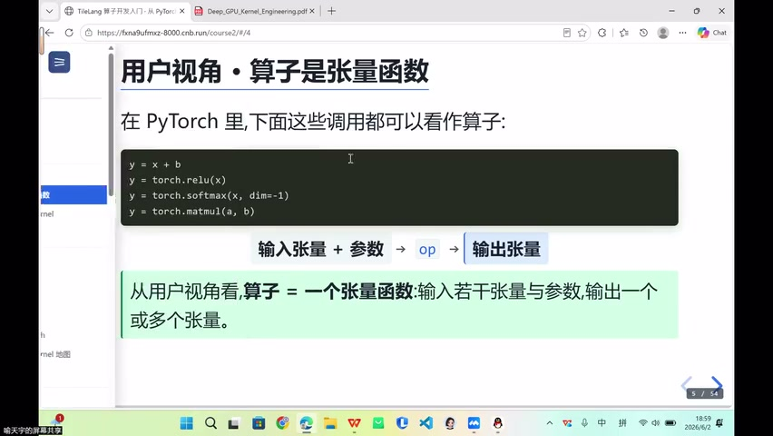

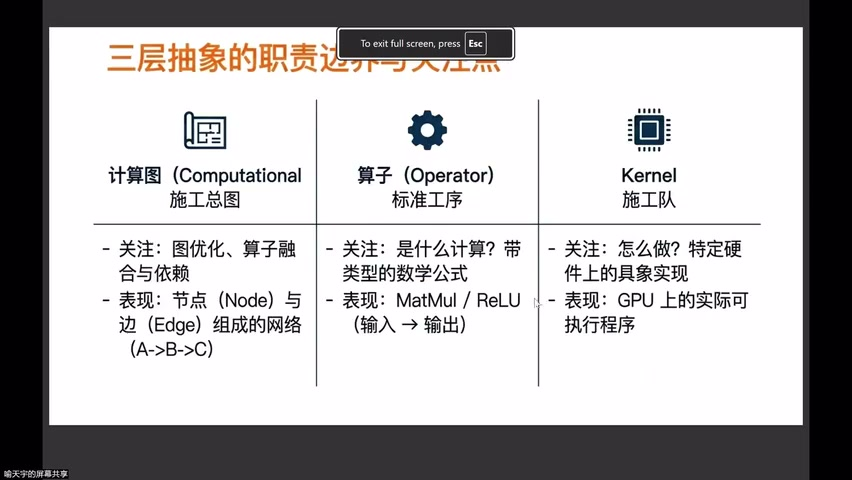

### Block 级算子

- 大量 **Projection GEMM**（Q/K/V/O 投影）
- **Attention** 算子
- **Softmax**
- Output 投影

### Elementwise 算子（橙色，高频出现）

- RoPE（旋转位置编码）
- Activation（激活函数）
- 残差连接（Residual Add）

> 这些 Elementwise 算子反复出现 → 经常与其他算子**融合**

---

## 三、算子融合的本质


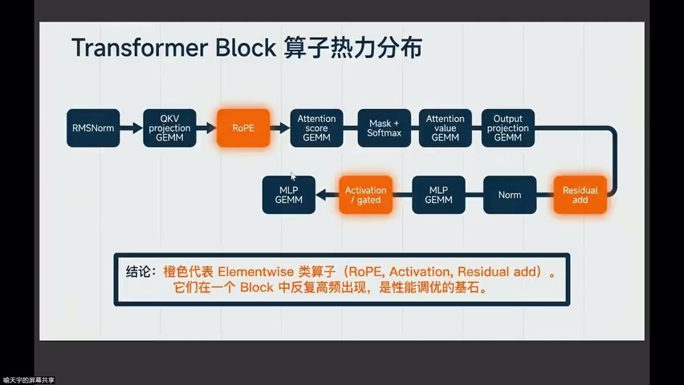

### 为什么要融合

```
未融合：Kernel A → 搬回 Global → Kernel B → 搬回 Global → Kernel C
融合后：Kernel ABC（一次搬运，内部完成所有计算）
```

- 每个 kernel 都有**启动开销 + 数据搬运开销**
- 多 kernel = 大量时间浪费在搬运上
- 融合 → 减少搬运次数 → 可能减少循环次数

### 融合算子 (Fused Operator)

- 原有两个算子的计算合并到一个 kernel
- 可能做算法层面优化（如减少冗余计算）
- 可能做硬件层面优化（如利用 Tensor Core 搬运）

---

## 四、GPU 视角：Kernel 关心什么

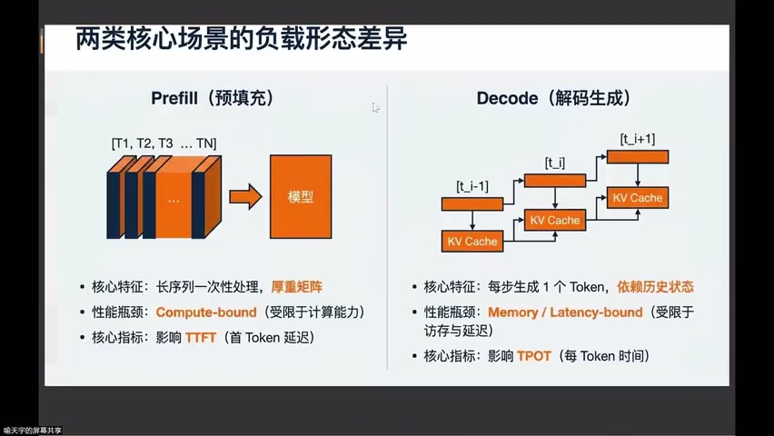

### Kernel 的核心问题

| 维度 | 内容 |
|------|------|
| 数据依赖 | 每个输出元素由哪些输入元素计算得出 |
| 硬件编排 | 如何安排 pipeline（管线） |
| 搬运路径 | Global → L2 → L1/Shared Memory → Register |
| 加速技术 | 向量化（128B）、Tensor Core、异步搬运 |

### 数据复用

- GEMM 分块矩阵中，部分子块在计算中**出现 2-3 次**
- 复用数据放 Shared Memory → 减少从 HBM 搬运
- 目标：尽可能在 Register 中完成运算

---

## 五、推理链：Prefill vs Decode

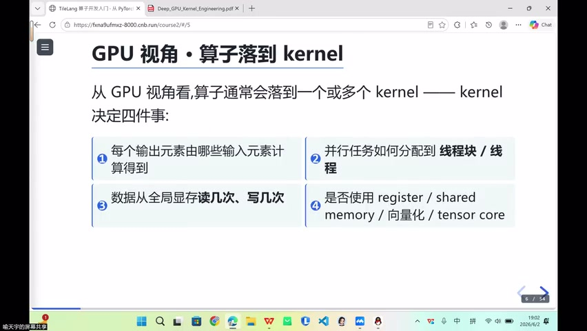

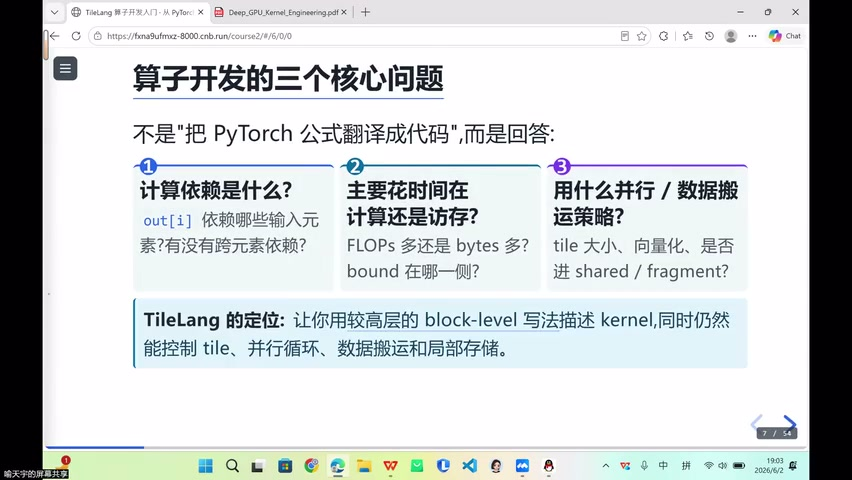

### 推理需求指标

| 指标 | 主导阶段 |
|------|----------|
| Time to First Token (TTFT) | **Prefill** |
| Time Per Output Token (TPOT) | **Decode** |
| Throughput / 吞吐 | 整体 |
| 部署成本 | 整体 |

### Prefill 特征

- 输入：一次性 prompt，序列长
- 主导：GEMM + Attention（计算密集）
- Batch × Sequence 大 → 容易吃满计算资源
- 分块矩阵乘法 → 大量乘加 → Compute-bound

### Decode 特征

- 每步生成 **1 个 token**
- 涉及 KV Cache 读取
- 小 batch → Latency 和缓存更加突出
- Memory-bound

---

## 六、计算图 (DAG)

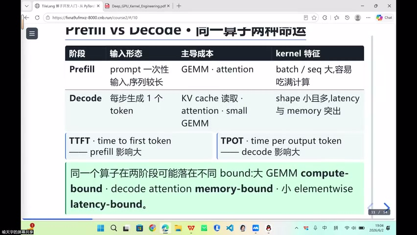

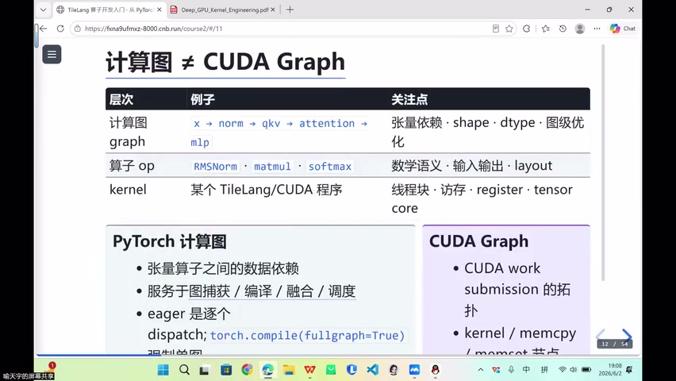

### 基本结构

- **节点**：算子或子图（MatMul、ReLU、Softmax 等）
- **边**：张量依赖关系

### 历史与推理场景

| 场景 | 计算图的核心价值 |
|------|-----------------|
| 训练 | 自动微分（反向传播） |
| **推理** | 图捕获 → 优化 → 调度 |

### 不同框架的画法

- 有些框架把张量也画成节点
- 本课视角：**算子为节点，张量为边**

---

## 七、Torch Compile 与算子融合

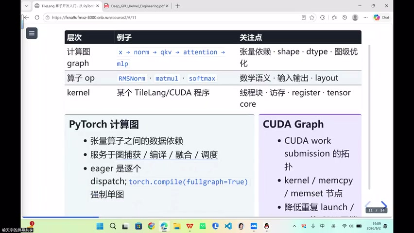

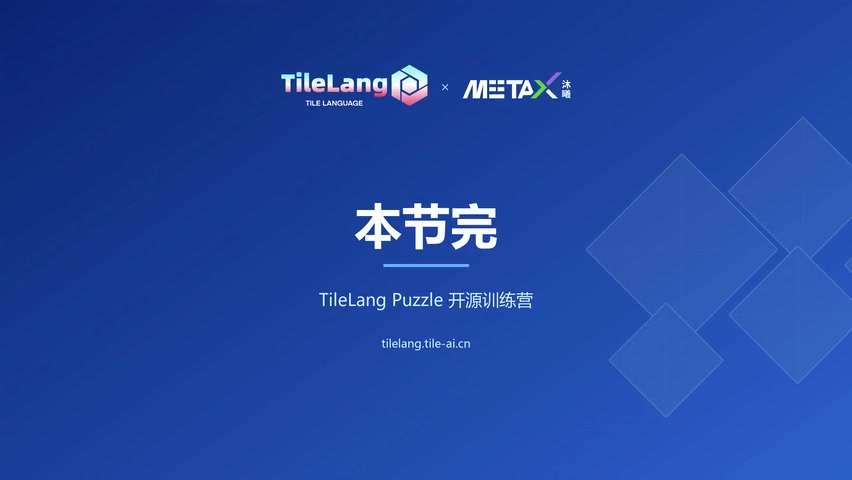

### Torch Eager 模式

- 逐一 dispatch 每个 operator
- 无全局视图 → 无法做跨算子优化

### Torch Compile

- 捕获计算图 → 图级别优化
- 但融合**非常粗糙**，硬件利用率低
- Graph Break → 切换为 eager 回退区域
- `AUTOGRAPH=true`：检查代码能否被捕获为单个图

### 为什么手写 Kernel 容易赢

> 只要稍微用到 Tensor Core 等硬件加速指令，就很容易比 torch.compile 快

- torch.compile 能力有限（前几年尤其明显）
- 未来融合算子空间仍然很大
- 关键：了解硬件 → 打满利用率 → 图级优化

---

## Key Terms

| 术语 | 含义 |
|------|------|
| 计算图 (DAG) | 有向无环图，节点为算子，边为张量依赖 |
| Operator | 标准化的计算工序（如 GEMM、Softmax） |
| Kernel | 算子在特定硬件上的具体实现 |
| Fused Operator | 多个算子融合为一个 kernel |
| Elementwise | 逐元素操作（RoPE、Activation、Residual） |
| Prefill | 推理第一阶段，处理完整 prompt（Compute-bound） |
| Decode | 推理第二阶段，逐 token 生成（Memory-bound） |
| TTFT | Time to First Token，首 token 延迟 |
| TPOT | Time Per Output Token，每 token 生成时间 |
| torch.compile | PyTorch 图捕获 + 编译优化框架 |
| Graph Break | 图捕获中断，回退到 eager 执行 |
| Roofline | 计算密度 vs 性能的分析模型 |
