# [P30] 算子开发入门 - 计算图优化、Elementwise 算子分类与 TileLang 代码

> **演讲者**：天宇  
> **日期**：2026年5月  
> **活动**：TileLang Puzzle 算子开发实战营 第五课  

---

## 一、上节课总结与 CUDA Graph

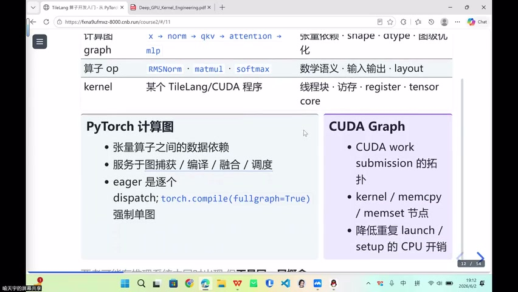

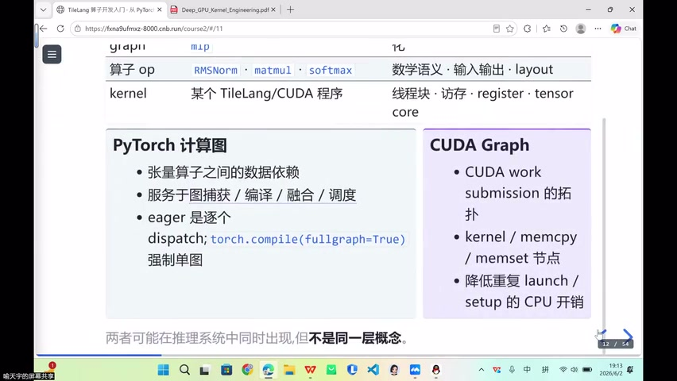

### 三层回顾

| 层次 | 内容 |
|------|------|
| 计算图 | 数据流 + 张量依赖（shape, dtype）→ 图级优化/融合 |
| 算子 | 标准化工序（软硬件协同封装） |
| Kernel | 算子下沉到具体硬件（MetaX→MACA, NVIDIA→CUDA） |

### CUDA Graph

- 把**重复执行的工作流**预先实例化
- 反复降低 launch + setup 的 CPU 开销
- 与计算图经常**同时出现**在推理系统中

---

## 二、图级优化技术

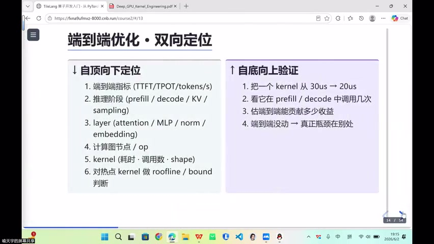

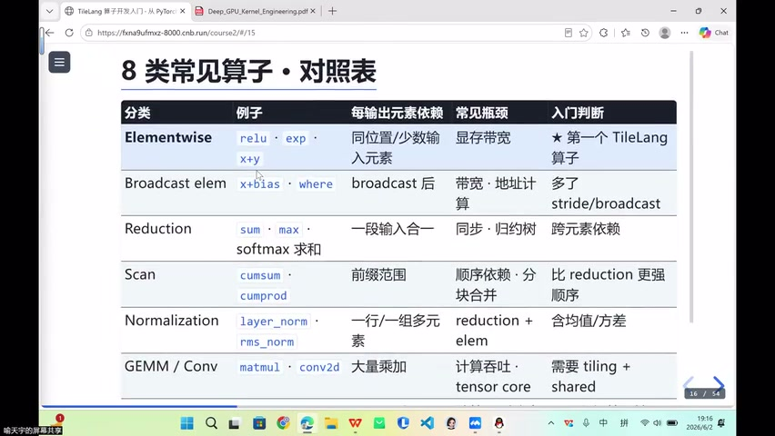

### 常见图优化 Pass

| 优化 | 说明 |
|------|------|
| Elementwise Fusion | 合并相邻的逐元素算子 |
| GEMM 后处理 | 将 bias/activation 融入 GEMM |
| 减少中间张量 | 避免反复读写 Global Memory |
| Launch 合并 | 减少 kernel 启动次数 |
| 常量折叠 | 编译期计算固定值 |
| Layout 推断 | 自动选择最优数据布局 |
| 形状特化 | 针对固定 shape 生成专用代码 |
| 算子分解 | 复杂算子拆为多个简单算子 |
| 死代码消除 | 移除无用计算 |

### 关键认知

> 单个 kernel 最优 ≠ 端到端最优

- Elementwise 算子单独优化收益有限
- 与前后算子融合 → 端到端收益**更大**

---

## 三、算子分类

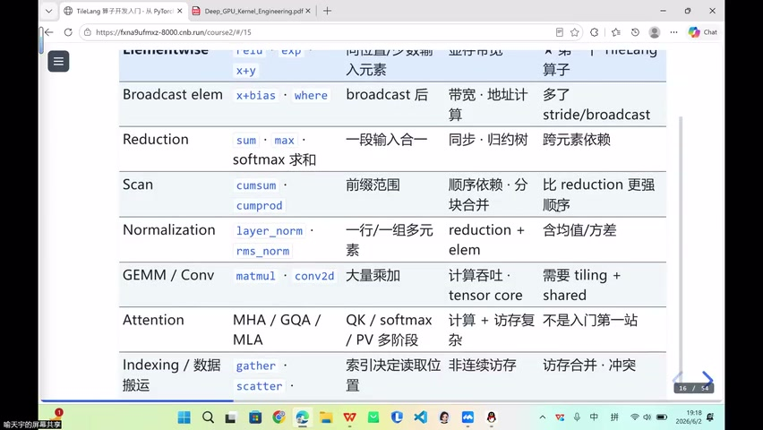

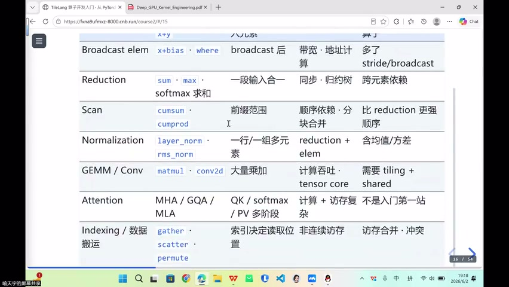

### 分类判据

| 类型 | 判据 | 示例 |
|------|------|------|
| **Elementwise** | 输出元素互相独立，逐个计算 | add, sin, cos, ReLU |
| **Reduction** | 需要看整行/整段输入 | reduce_sum, mean |
| **Normalization** | 需要统计量（均值/方差） | LayerNorm, RMSNorm |
| **GEMM** | 核心是矩阵乘法 | Linear, MatMul |
| **Conv** | 滑动窗口扫描 | Conv2D |
| **Attention** | Q×K^T×V | FlashAttention |
| **Index** | 索引决定读取位置，非连续访存 | Embedding, Gather |

### Elementwise 特征

- 一元/多元函数，input → output 逐元素
- 计算量小但**出现频率极高**
- 融合价值 > 单独优化价值

### Index 算子难点

- 非连续访存 → 访存合并（coalescing）和冲突

---

## 四、TileLang 的层级定位

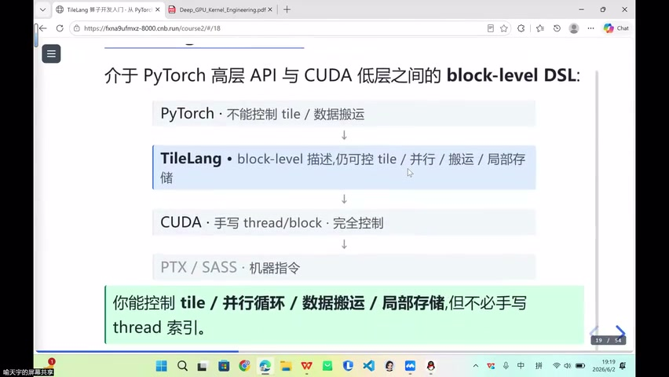

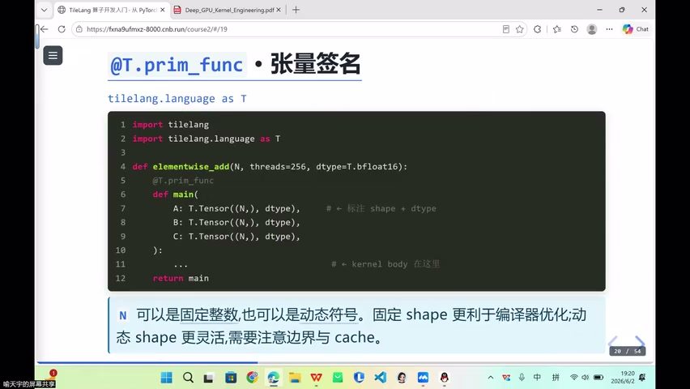

### 抽象层级

```
Python API（高层）
    ↓
TileLang（Block Level，可控 tile/并行/搬运/局部存储）
    ↓
CUDA（Thread/Warp 级，完全暴露）
```

### TileLang vs Triton vs CUDA

| 维度 | TileLang | Triton | CUDA |
|------|----------|--------|------|
| Tile 控制 | 显式可选 | 隐式 | 完全手动 |
| Warp/Thread | 少量暴露 | 不暴露 | 完全暴露 |
| 搬运 API | 多种可选 | 有限 | 完全手动 |
| 开发效率 | 高 | 高 | 低 |
| 性能天花板 | 高 | 中 | 最高 |

> TileLang = 效率与性能的 **trade-off 最优点**

---

## 五、TileLang Elementwise 代码解读

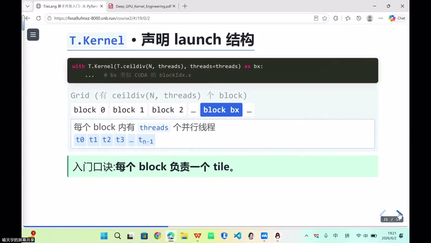

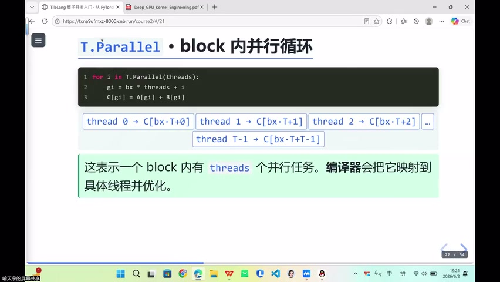

### 代码结构

```python
@tilelang.jit          # 外层：算子定义，JIT 即时编译
def elementwise(N, dtype=T.bfloat16):
    @T.prim_func       # 内层：primitive function 定义
    def main(A: T.Buffer(N, dtype), B: T.Buffer(N, dtype)):
        bx = T.Kernel(T.ceildiv(N, 128))   # block 数量（向上取整）
        local = T.alloc_fragment(128, dtype) # 分配寄存器
        T.copy(A[bx*128 : (bx+1)*128], local)  # Global → Register
        for i in T.Parallel(128):           # block 内并行循环
            local[i] = local[i] * 2.0       # 计算
        T.copy(local, B[bx*128 : (bx+1)*128])  # Register → Global
```

### 关键 API

| API | 作用 |
|-----|------|
| `T.Kernel(ceildiv(N, 128))` | 定义 grid 中 block 数量 |
| `T.Parallel(128)` | block 内并行循环（对应线程） |
| `T.copy(src, dst)` | Tile 级数据搬运（自动向量化 128-bit） |
| `T.alloc_fragment` | 分配 Register 级局部存储 |
| `T.ceildiv` | 向上取整（处理不整除情况） |

### 数据流

```
Global Memory ──T.copy──▶ Register (fragment) ──计算──▶ Register ──T.copy──▶ Global Memory
```

---

## 六、动态维度与数据类型

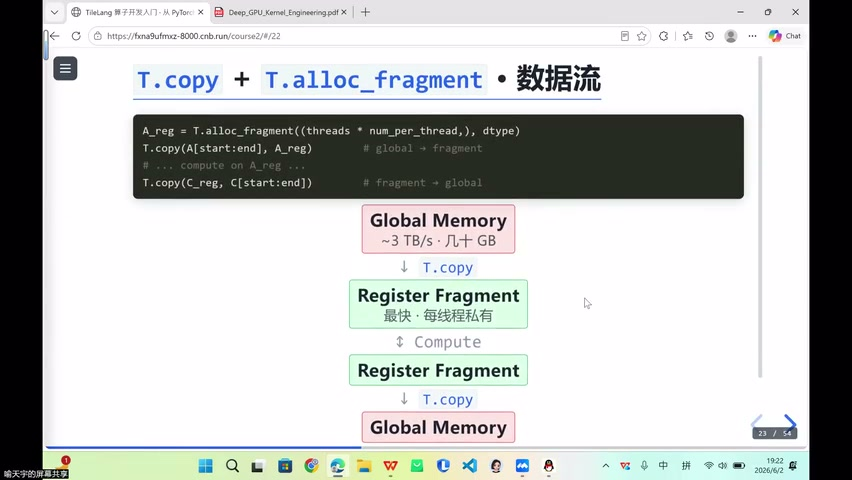

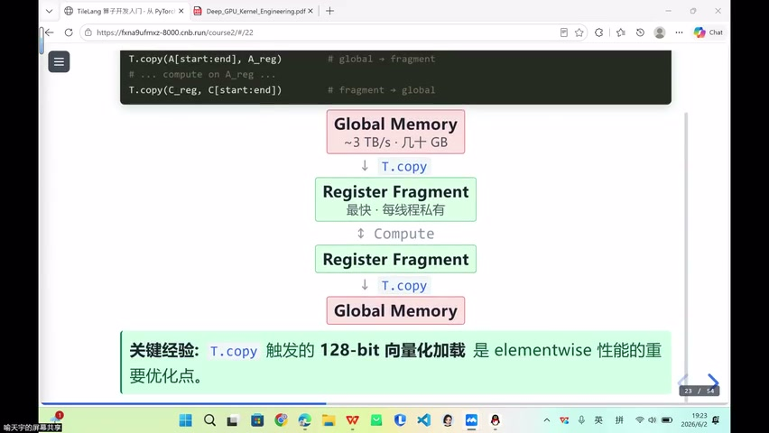

### 动态维度

- 固定大小 → 换成**动态符号**即可
- `T.dynamic("N")` 声明动态维度

### 数据类型

- `dtype=T.bfloat16` / `T.float16` / `T.float32`
- T.copy 根据硬件自动选择向量化宽度（如 128-bit load）

### 不整除处理

- 使用 `T.ceildiv(N, block_size)` 向上取整
- 确保所有元素被覆盖

---

## Key Terms

| 术语 | 含义 |
|------|------|
| CUDA Graph | 预实例化工作流，减少反复 launch 的 CPU 开销 |
| 常量折叠 | 编译期计算固定表达式，减少运行时开销 |
| Elementwise | 逐元素算子，输出元素互相独立 |
| Reduction | 规约算子，需要整行/段输入（如 sum, mean） |
| T.Kernel | TileLang 中定义 grid/block 的入口 |
| T.Parallel | TileLang 中 block 内的并行循环 |
| T.copy | TileLang 中 Tile 级数据搬运原语 |
| T.alloc_fragment | 分配 Register 级局部存储 |
| T.ceildiv | 向上取整除法 |
| JIT | Just-In-Time 即时编译 |
| 向量化加载 | 128-bit 宽度的批量数据加载指令 |
