# [P31] 算子开发入门 - VectorAdd 实现·memory-bound 与向量化访存

> **演讲者**：天宇  
> **日期**：2026年5月  
> **活动**：TileLang Puzzle 算子开发实战营 第五课（续）  

---

## 一、Vector Add 算法特征

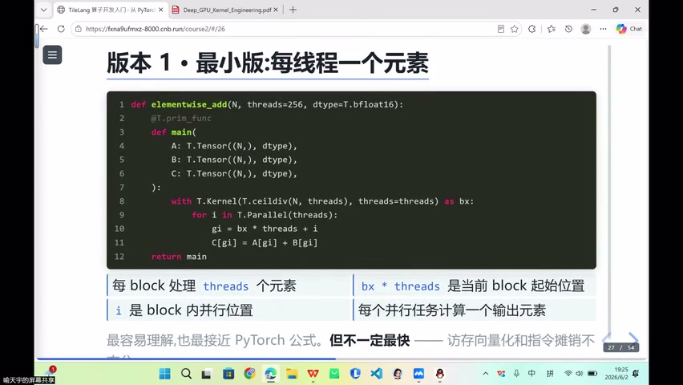


### Elementwise 并行性

- 每个输出元素可**独立计算**，不同 i 之间无依赖
- N 个小任务并行 → N 次加法
- 天然适合 GPU 大规模并行

### Memory-bound 而非 Compute-bound

| 特征 | 说明 |
|------|------|
| 计算量 | 极低（仅一次加法） |
| 瓶颈 | 数据搬运（memory bandwidth） |
| 优化方向 | 访存效率，而非计算吞吐 |

> 难点不在计算，而在**搬运**——它是 memory-bound 的典型代表

---

## 二、TileLang 基本 API 实现

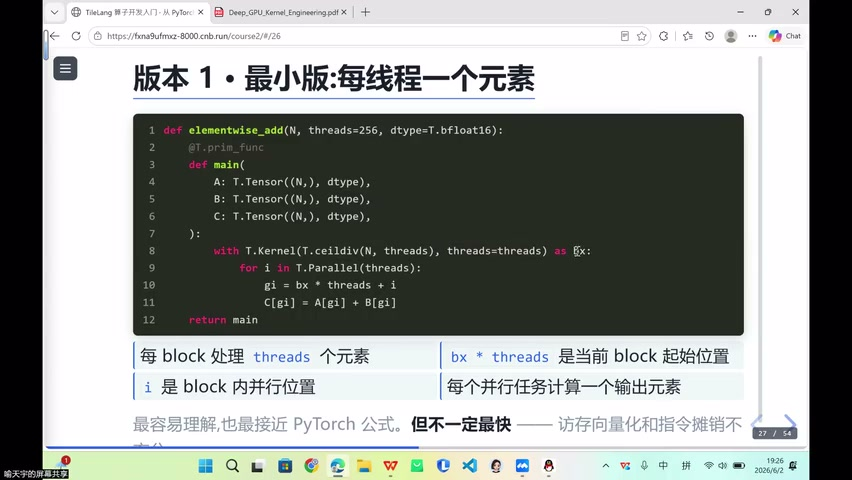

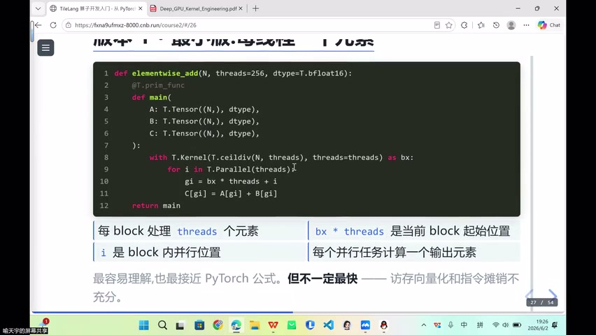

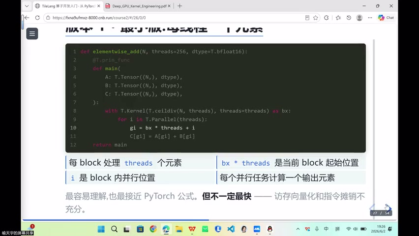

### 代码结构

```python
@tilelang.jit
def vector_add(N, dtype=T.bfloat16):
    @T.prim_func
    def main(A: T.Buffer(N, dtype), B: T.Buffer(N, dtype), C: T.Buffer(N, dtype)):
        bx = T.Kernel(T.ceildiv(N, thread_size))  # block 数量（向上取整）
        for i in T.Parallel(thread_size):          # block 内线程级并行
            idx = bx * thread_size + i             # 全局索引
            C[idx] = A[idx] + B[idx]              # 逐元素加法
```

### 关键概念

| 概念 | 说明 |
|------|------|
| `T.ceildiv(N, thread_size)` | 向上取整确定 block 数 |
| `bx` | Block 索引（0, 1, 2, ...） |
| `T.Parallel(thread_size)` | 每个 block 内并行线程数 |
| `bx * thread_size + i` | 每个线程负责的全局位置 |

### 分块意识

- 算法本身非常简单（逐元素加法）
- 核心是**分块思维**：将 N 个元素分配给多个 block

---

## 三、thread_per_number 优化

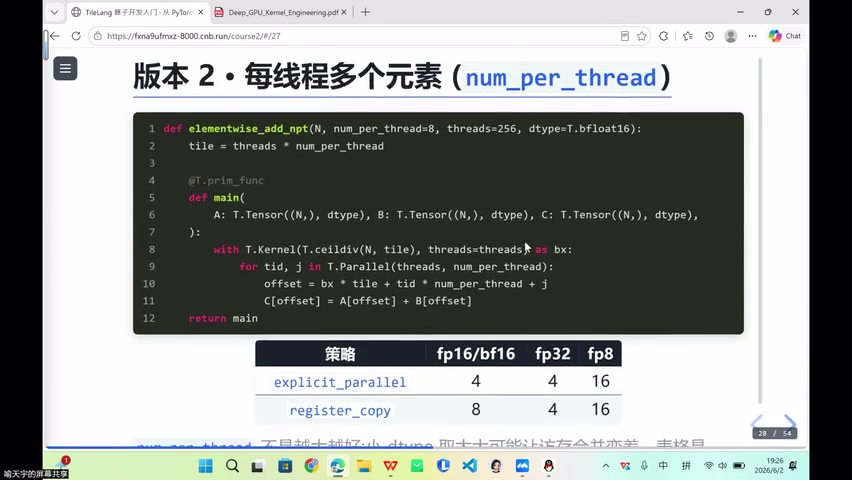

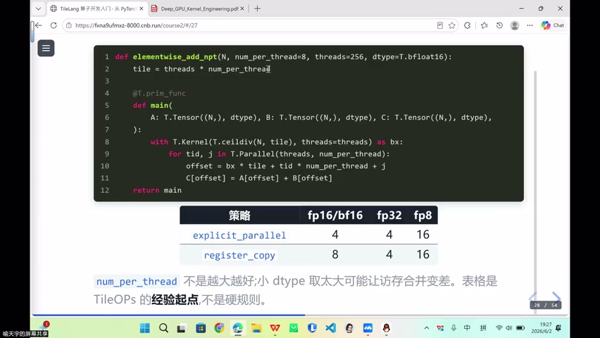

### 基本思路

- 每个线程处理**多个连续元素**（而非仅 1 个）
- 每个 block 处理 `thread_size × thread_per_number` 个元素

### 优势与权衡

| 优势 | 说明 |
|------|------|
| 均摊开销 | 循环/地址计算开销被多个元素分担 |
| 宽指令 | 编译器更容易生成宽 load/store 指令 |
| 硬件级 | 对应 LDG.128 等硬件批量加载指令 |

| 注意 | 说明 |
|------|------|
| 非越大越好 | 数据区域太大 → 缓存命中率下降 |
| 经验调参 | 先尝试典型值，再根据硬件调整 |

---

## 四、Register 计算与向量化搬运

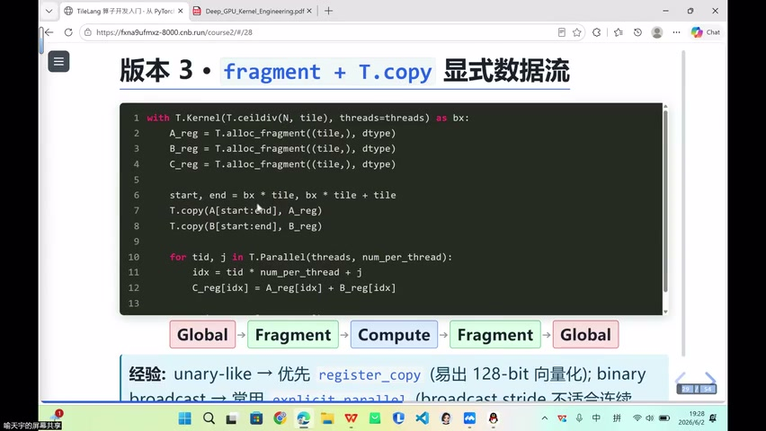

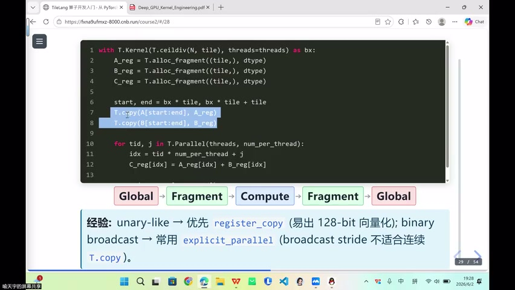

### 数据流

```
Global Memory ──T.copy──▶ Register (fragment)
                              │
                         计算（add/mul/...）
                              │
Register ──T.copy──▶ Global Memory
```

### 核心原则

- 计算尽量在 **Register** 中完成
- T.copy 负责 Global ↔ Register 的**向量化搬运**
- 编译器根据硬件自动选择搬运指令宽度

### LDG.128（Load Group 128-bit）

- 汇编级硬件指令：单次批量加载 **128-bit** 数据
- 写 CUDA 时经常手动使用
- TileLang 中由**编译器自动生成**（T.copy 触发）

---

## 五、Elementwise 算子变体

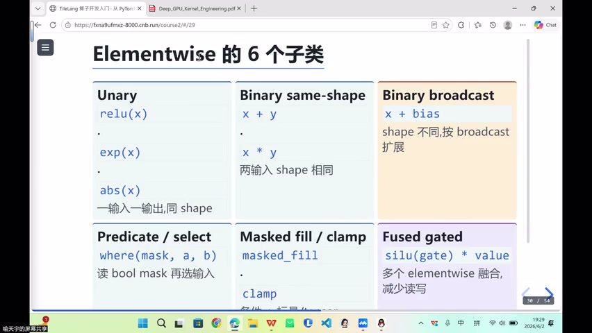

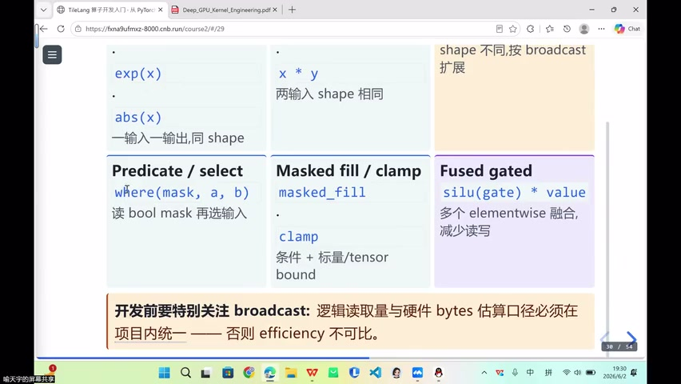

### 常见变体

| 算子 | 说明 |
|------|------|
| 二元运算 | add, sub, mul, div |
| 加偏置 | + bias（涉及 **broadcast** 广播） |
| 条件选择 | where（布尔指令 → 0/1 → 选择向量） |

### Broadcast 广播

- 偏置向量维度 < 数据维度 → 需要广播
- 硬件层面：广播指令将小向量扩展到匹配维度

---

## 六、MetaX MACA Copy

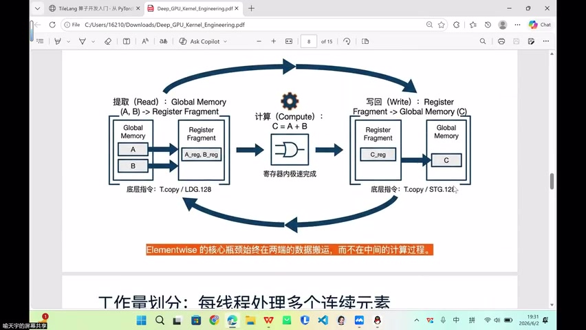

### 硬件特化搬运

| API | 说明 |
|-----|------|
| `T.copy` | 通用搬运（所有硬件可用） |
| `T.macx_copy` | MetaX 硬件特化高效搬运指令 |

- MetaX 硬件本身有独特的高效搬运指令
- TileLang 在标准 T.copy 之上**额外提供** T.macx_copy
- 原有 T.copy 也能用，但 macx_copy 可发挥硬件特性

---

## 七、Block/Thread 索引可视化

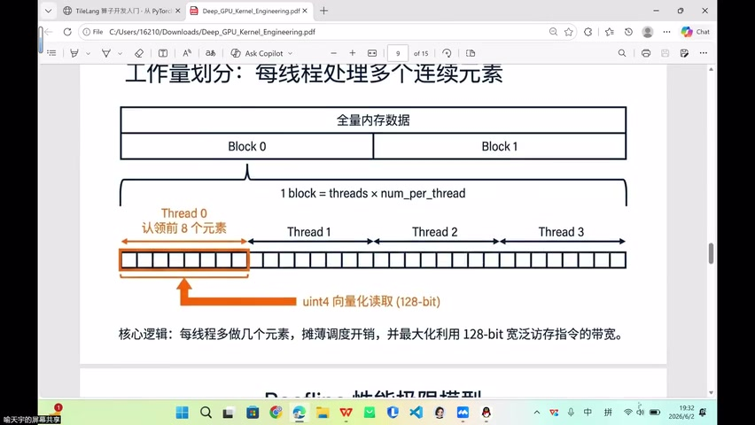

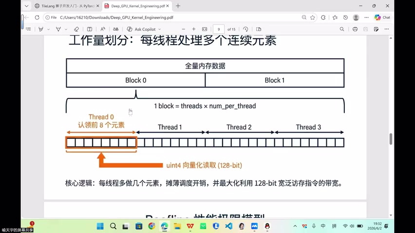

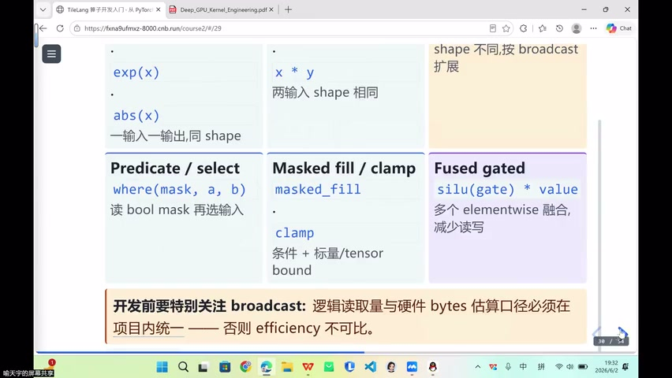

### 索引分配示例

```
Block 0 → 元素 [0, 7]     （8 个元素）
Block 1 → 元素 [8, 15]
Block 2 → 元素 [16, 23]
...
```

- 每个 block 处理连续的一段元素
- 用**向量化读取 128 Byte** 一次搬入
- 连续索引 → 天然的**基本 coalescing**（合并访存）

---

## 八、生成 CUDA 代码分析

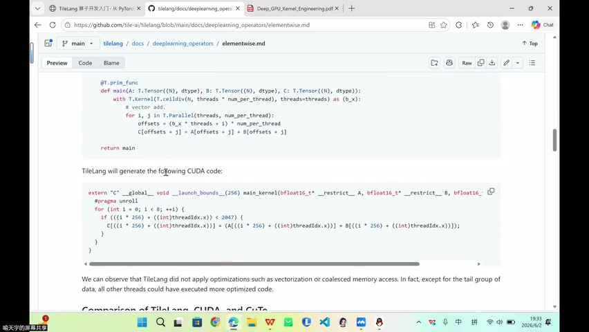

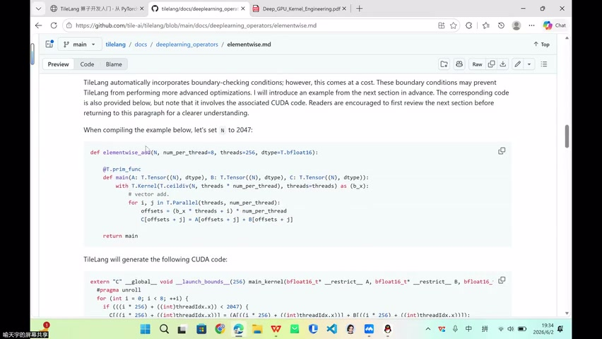

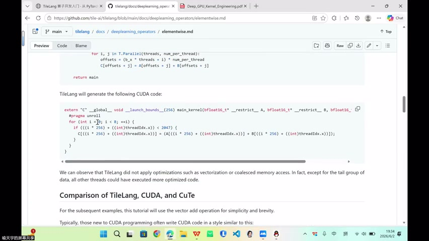

### 编译器翻译结果

TileLang（Domain-Specific Language）→ 编译器 → 硬件 CUDA 代码

| 观察点 | 说明 |
|--------|------|
| LDG.128 | 向量化加载指令（128-bit） |
| uint4 | 128-bit 向量化数据类型 |
| thread_per_number=8 | 每线程处理 8 个元素 |
| 活跃线程 32 | 256 / 8 = 32 个线程实际活跃 |
| Launch 配置 | 仍保留 256 线程的配置 |

### 关键发现

- TileLang 源码中**看不到**任何硬件指令
- 编译器自动将 T.copy 翻译为 LDG.128 等向量化指令
- 连续索引写法 → 编译器可优化为更宽的访存实现

---

## 九、算法层代码与硬件抽象

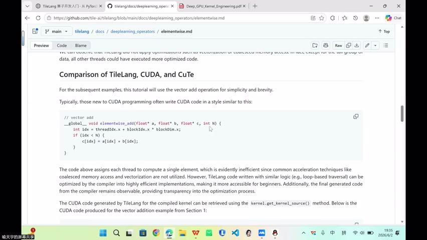

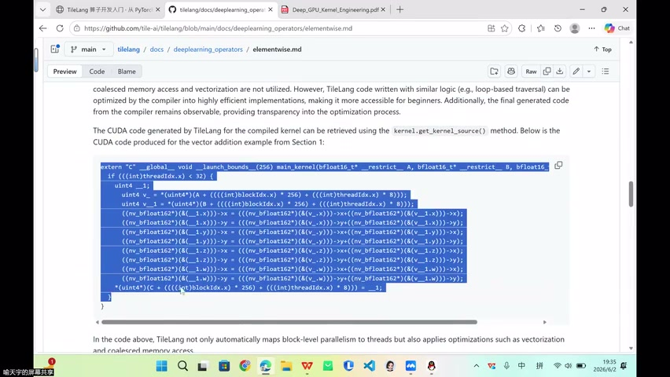

### 纯算法层

- TileLang 代码中**没有** CUDA/NVIDIA 相关指令
- 只是纯粹的算法描述 + 分块映射
- 越上层越贴近算法，越下层越需要硬件理解

### 抽象层级

```
算法描述（纯数学）
    ↓  TileLang 分块映射
Block/Thread 分配
    ↓  编译器自动翻译
硬件指令（LDG.128, uint4, ...）
```

> 编译器帮你干了"想不想干的杂活"——只需了解简单分块，也能写出性能不差的 kernel

---

## 十、连续索引与 Coalescing

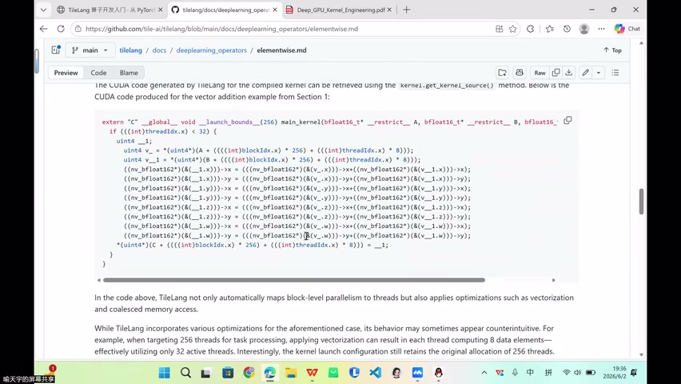

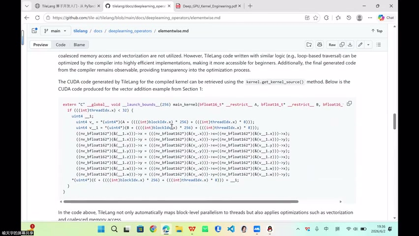

### 合并访存基础

- 连续索引写法 → 天然具备**基本 coalescing**
- 每个线程处理连续元素 → 合并为一次宽事务
- 无需显式写向量化 load/store 技巧

### BF16 版本编译结果

- 不仅将 block 并行到线程
- 还生成了**向量化访存**（uint4 = 128-bit）
- 保持连续访存模式

---

## 十一、代码生成引导与边界处理

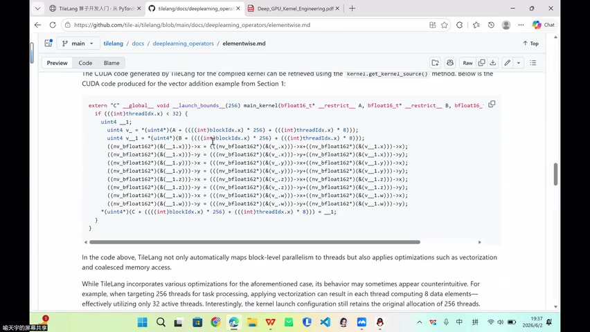

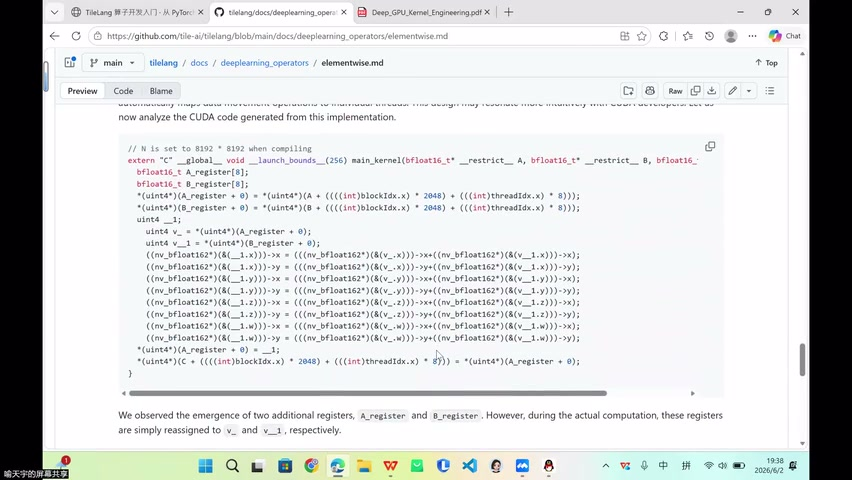

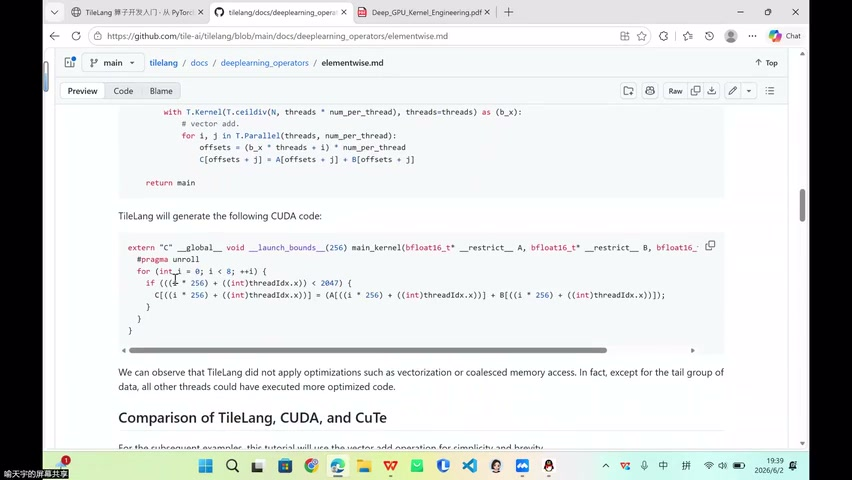

### 引导 Code Generation

- 显式指定每线程处理元素数 → 引导编译器生成更宽访存
- 循环展开写法在合适条件下 → 被优化为向量化实现

### 边界处理

- 当 N 不被 block_size 整除时（如 N=20）
- 使用 `T.ceildiv` 向上取整确保覆盖所有元素
- 最后一个 block 需要**边界检查**避免越界

---

## Key Terms

| 术语 | 含义 |
|------|------|
| Memory-bound | 性能瓶颈在数据搬运而非计算 |
| thread_per_number | 每线程处理的元素数，均摊开销并触发宽指令 |
| LDG.128 | Load Group 128-bit，硬件级向量化加载指令 |
| uint4 | 128-bit 向量化数据类型（4×32-bit） |
| T.macx_copy | MetaX 硬件特化高效搬运 API |
| Coalescing | 合并访存，多线程连续地址合并为一次事务 |
| Broadcast | 广播，将小维度向量扩展匹配大维度 |
| Code Generation | 编译器将 DSL 翻译为硬件代码的过程 |
| Register/Fragment | 寄存器级局部存储，计算在此完成 |
| 边界处理 | N 不整除时的越界保护机制 |
