# [P32] 算子开发入门 - 边界检查、JIT 写法与算子封装

> **演讲者**：天宇  
> **日期**：2026年5月  
> **活动**：TileLang Puzzle 算子开发实战营 第五课（续）  

---

## 一、边界检查与性能退化

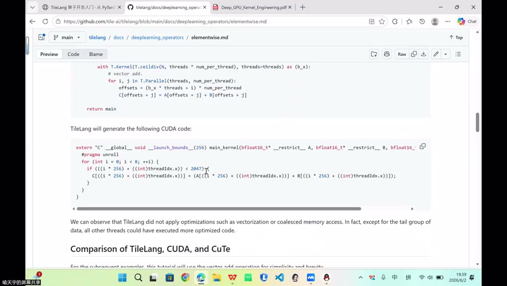

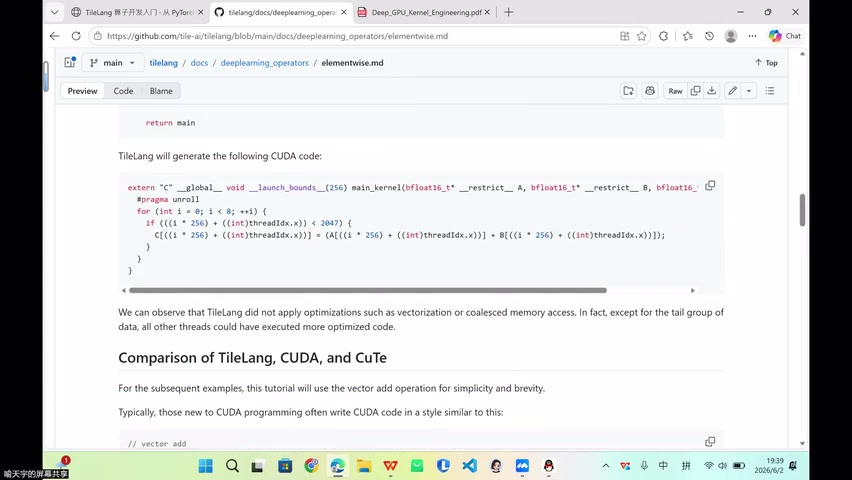

### 问题场景

- 例：N=2047，不能被 `thread_size × thread_per_number = 2048` 整除
- TileLang 生成的 CUDA 代码需要对每个元素做 **< N 的边界检查**

### 性能影响

| 情况 | 行为 |
|------|------|
| 尾部 block | 无法使用向量化搬运，退化为**逐元素标量访问** |
| 其他 block | 仍走优化的向量化路径 |

> 边界保护是必要的，但会让尾部数据丧失向量化优势

---

## 二、TileLang 的抽象价值


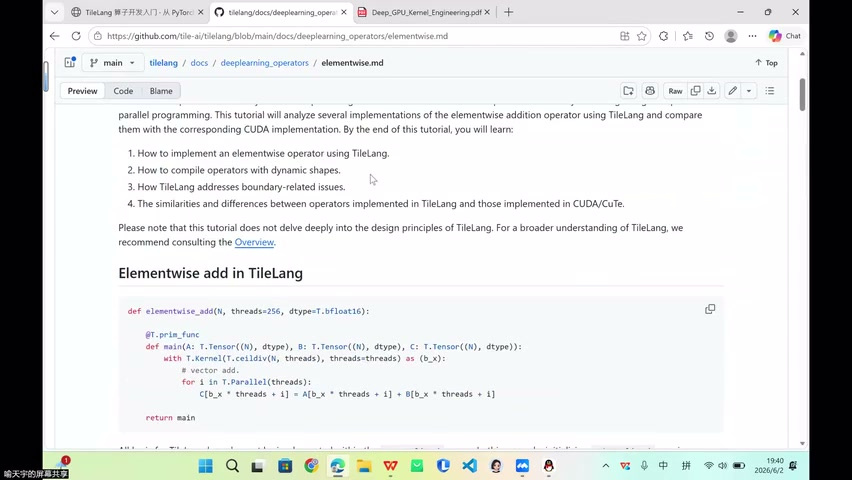

### 降低硬件心智负担

- 用很少的代码达到手写硬件指令的效果
- 大幅降低对硬件细节的依赖

### Block Level ≠ 放弃性能控制

| 误解 | 事实 |
|------|------|
| Block level = 放弃性能 | 控制点转移，而非消失 |
| 不需要看底层 | 高性能场景仍需检查生成代码 |

- 控制点从"手写线程索引"→"选择策略 + 检查生成代码"
- 需要养成查看编译器生成的 CUDA/MACA 代码的习惯

---

## 三、两种写法：prim_func vs JIT

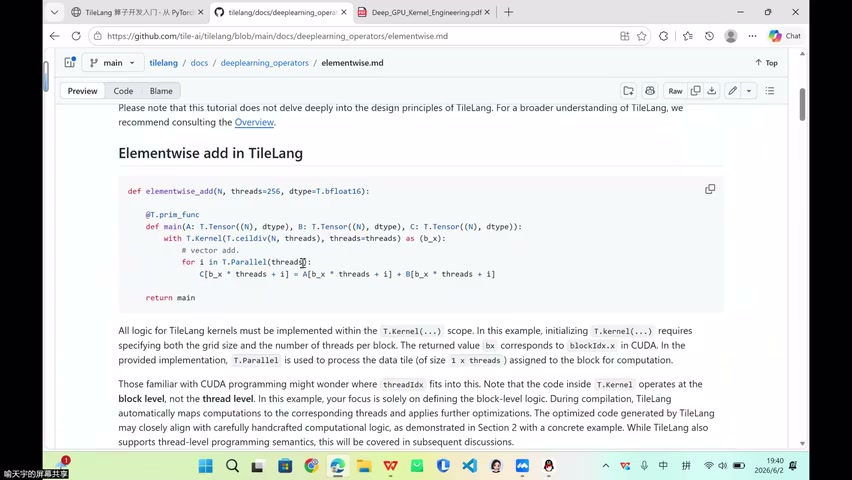

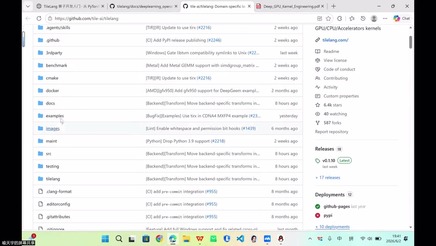

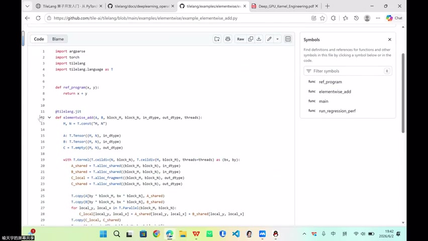

### 写法一：T.prim_func + tilelang.compile

```python
@T.prim_func
def main(A: T.Buffer(N, dtype), B: T.Buffer(N, dtype)):
    # 算子定义（计算本身）
    ...

# 需要显式编译
kernel = tilelang.compile(main)
```

- T.prim_func 定义**计算本身** → 产出 TIR 函数
- 不负责编译，不负责调用
- 需交给 `tilelang.compile` 编译为可执行 kernel

### 写法二：@tilelang.jit（推荐）

```python
@tilelang.jit
def vector_add(N, dtype=T.bfloat16):
    @T.prim_func
    def main(A: T.Buffer(N, dtype), B: T.Buffer(N, dtype)):
        ...
    return main

# 像普通 Python 函数一样调用
result = vector_add(A, B)
```

- JIT = Just-In-Time 即时编译
- 首次传入 tensor（shape, dtype）→ 即时编译 GPU kernel → **缓存**
- 后续调用直接复用，如同普通函数

---

## 四、JIT 与 Triton 的对比

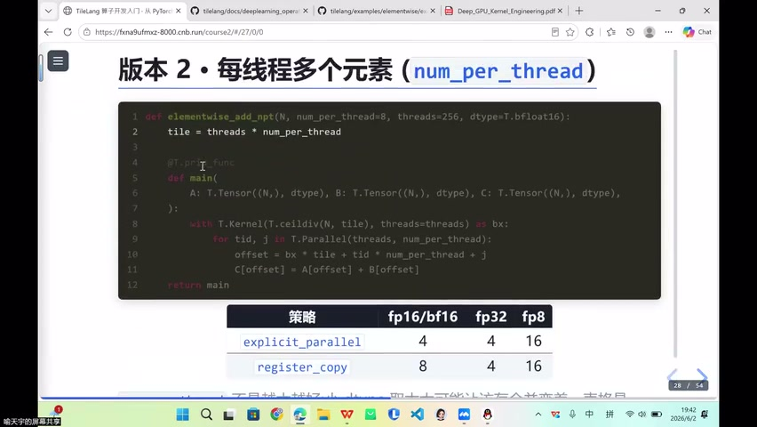

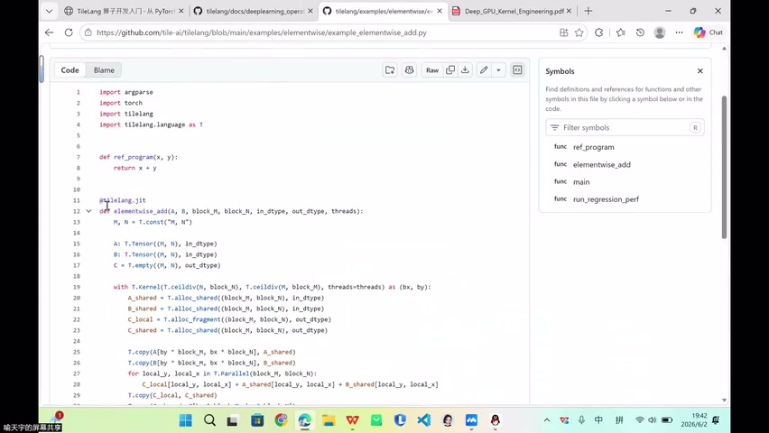

### 相似性

| 特性 | TileLang | Triton |
|------|----------|--------|
| 装饰器 | `@tilelang.jit` | `@triton.jit` |
| 编译时机 | 首次调用时 | 首次调用时 |
| 缓存 | 有 | 有 |
| 调用方式 | 普通函数 | 普通函数 |

> 写 Triton 的同学会很熟悉——都是加 JIT 的即时编译模式

---

## 五、算子封装为 Operator

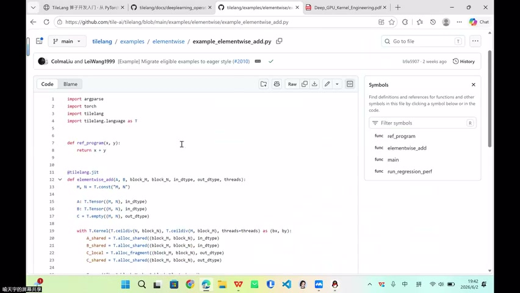

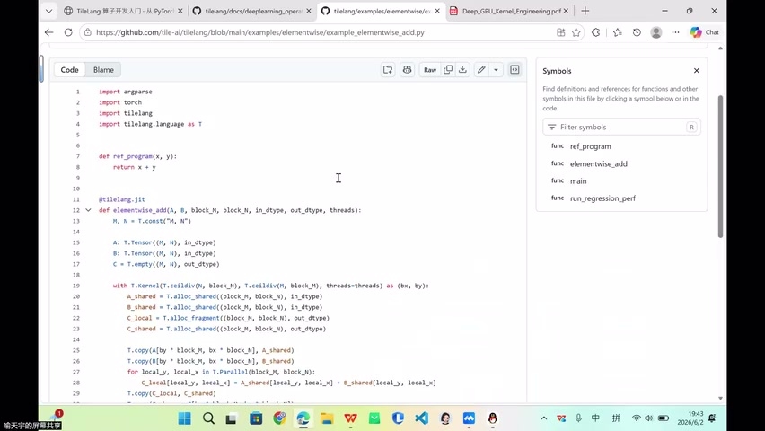

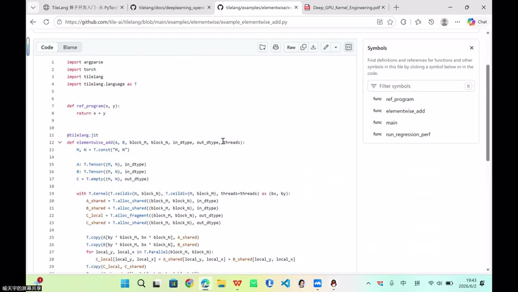

### 封装层次

```
T.prim_func（定义计算）
    ↓
tilelang.compile / @tilelang.jit（编译入口）
    ↓
Host 端 Operator 接口（类似 torch.add）
    ↓
推理引擎对接
```

### 关键认知

- 两种写法**底层用的是同一套源码**
- 区别仅在入口包装层
- 后续会讲如何将算子库封装为 torch 风格的 operator

### 使用建议

| 场景 | 推荐写法 |
|------|----------|
| 学习/理解原理 | T.prim_func + compile |
| 实际开发/使用 | @tilelang.jit |

---

## 六、Broadcast 与访存影响

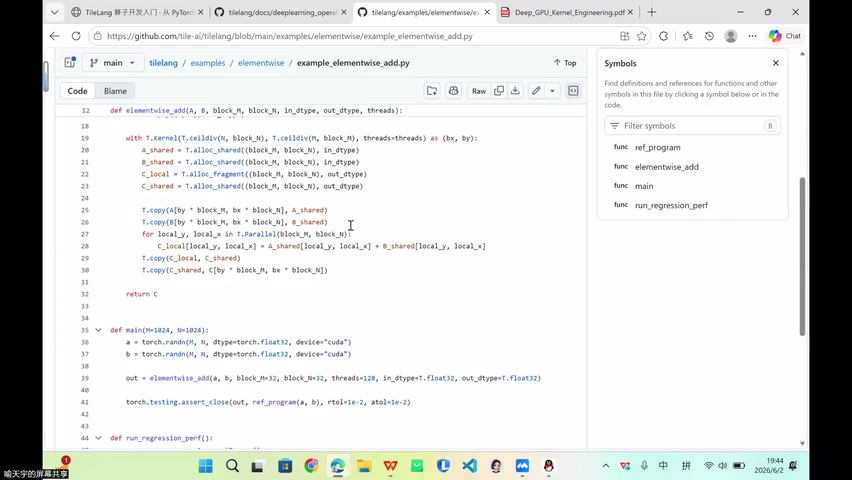

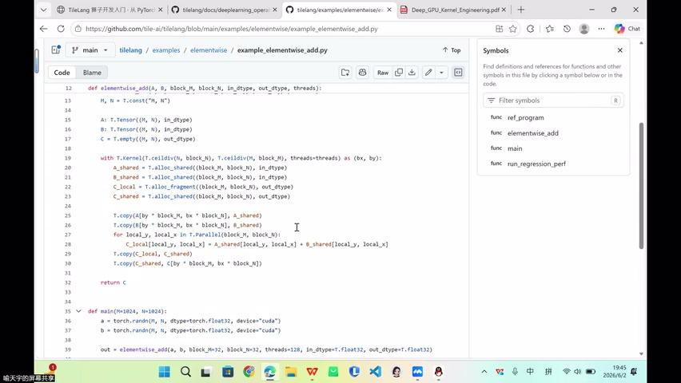

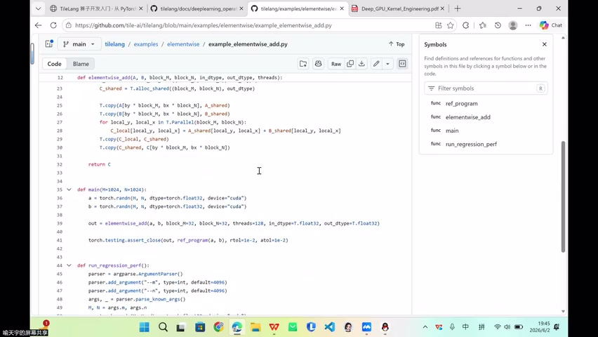

### Broadcast 示例

```
X: (M, N)    bias: (N,)    output: (M, N)
```

- bias[j] 被每一行**复用** → 广播

### 对访存的影响

| 影响点 | 说明 |
|--------|------|
| 地址计算 | 广播维度地址不变，非广播维度连续 |
| 连续读取 | 广播可能破坏连续性 |
| T.copy 适用性 | 非连续时不能简单使用 T.copy |

> 用不用广播需要斟酌——必须了解整个算子的地址布局

---

## 七、总结与后续方向

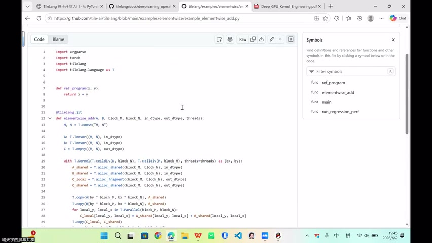


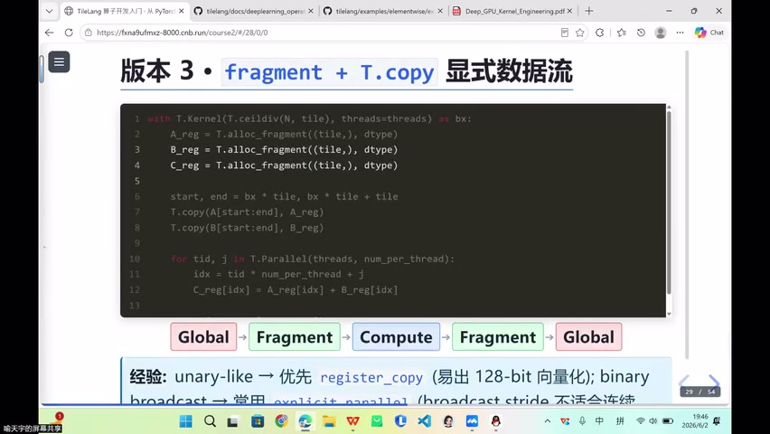

### 本节要点

1. **边界检查**：N 不整除时尾部退化为标量访问，但必要
2. **JIT 写法**：`@tilelang.jit` 是实际开发首选
3. **算子封装**：底层相同，入口不同；目标是 torch 风格 operator
4. **Broadcast**：影响地址连续性和 T.copy 使用

### TileLang 定位再强调

- Block level 写法 ≠ 放弃性能
- 编译器帮你做硬件杂活
- 高性能场景仍需检查生成代码、选择策略

---

## Key Terms

| 术语 | 含义 |
|------|------|
| 边界检查 | N 不整除时对尾部元素做 < N 判断，防止越界 |
| 标量访问 | 逐元素读写，无法利用向量化指令 |
| T.prim_func | TileLang 中定义计算本身的装饰器，产出 TIR 函数 |
| tilelang.compile | 将 TIR 函数编译为可执行 GPU kernel |
| @tilelang.jit | 即时编译装饰器，首次调用编译并缓存 |
| TIR | Tensor IR，TileLang 的中间表示 |
| Operator 封装 | 将 kernel 包装为 torch 风格的可调用算子接口 |
| Broadcast | 广播，小维度向量在大维度上复用 |
| Host 端 | CPU 侧，负责调度和接口暴露 |
| 缓存 | JIT 编译结果复用，避免重复编译 |
