# [P33] 算子开发入门 - Roofline 模型·算数强度与 Speed-of-Light

> **演讲者**：天宇  
> **日期**：2026年5月  
> **活动**：TileLang Puzzle 算子开发实战营 第六课  

---

## 一、为什么需要 Roofline

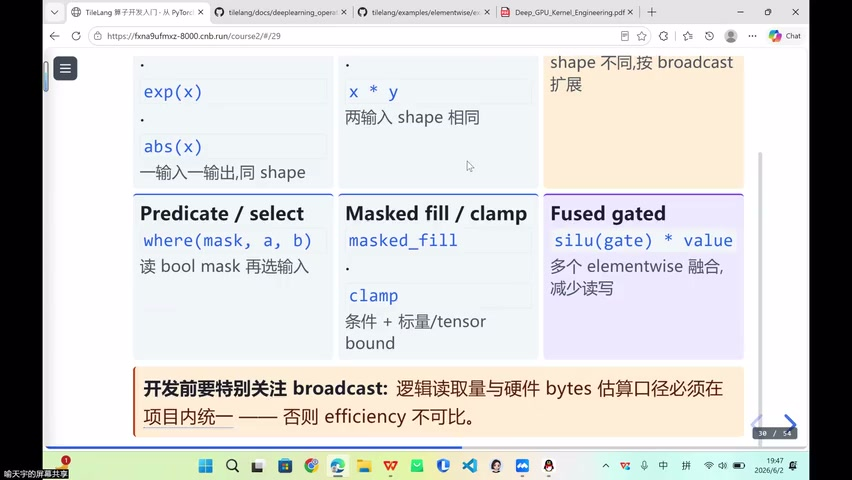

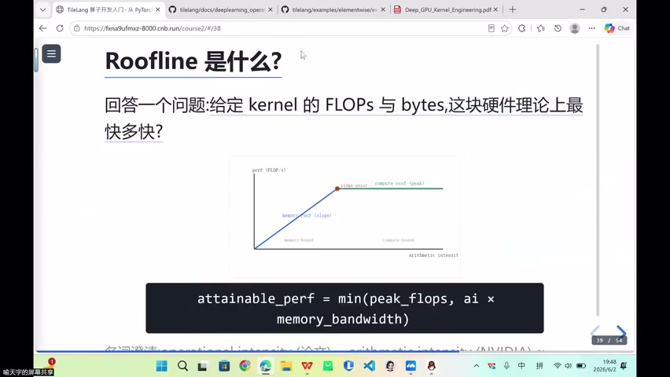

### 核心问题

- 写 kernel/operator 之前，必须知道：**该算子在硬件上理论能达到多少性能？**
- 给定 FLOPs 和 Bytes → 硬件理论上有多快？

### 估算口径

- 可按**输入元素**估算 Bytes
- 也可按**广播逻辑**估算
- 项目内部需**统一口径**

---

## 二、经典 Roofline 图

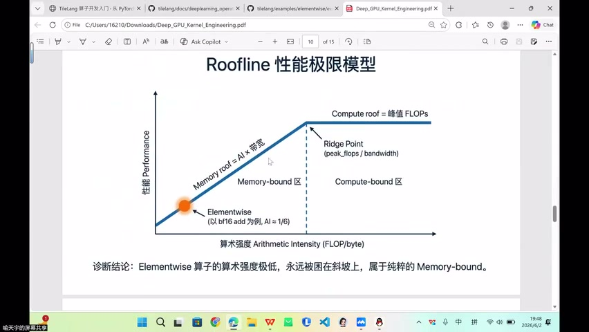


### 坐标轴

| 轴 | 含义 | 单位 |
|----|------|------|
| X 轴 | 算术强度（Arithmetic Intensity） | FLOPs / Byte |
| Y 轴 | 性能（实际或理论） | FLOPs / s |

> X 轴在原始 paper 中叫 "Operation Intensity"，NCU 工具中也用此名

### 两条 Roof

| Roof | 公式 | 含义 |
|------|------|------|
| Memory Roof | Perf ≤ Intensity × Bandwidth | 带宽上限（斜坡） |
| Compute Roof | Perf ≤ Peak FLOPs | 计算上限（水平线） |

### 两个上界

- **Peak FLOPs**：硬件理论计算峰值
- **Bandwidth**：内存带宽上限

---

## 三、Memory-bound vs Compute-bound

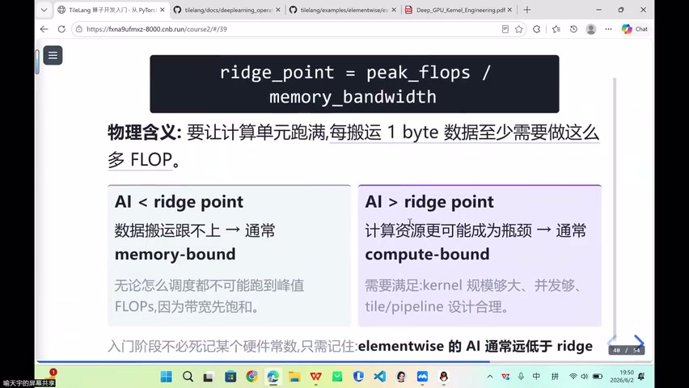

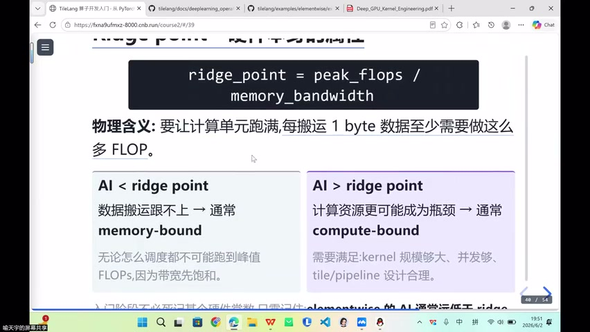

### 判断逻辑

| 情况 | 特征 | 示例 |
|------|------|------|
| Memory-bound | 搬运速度跟不上，带宽先饱和 | Elementwise（算术强度低） |
| Compute-bound | 计算资源成为瓶颈，规模大、并发够 | 大 GEMM |

### Elementwise 的位置

- 算术强度极低 → 始终在**斜坡**上
- 纯粹的 memory-bound
- 无论怎么调度都不可能跑到峰值 FLOPs

### Compute-bound 条件

- 规模足够大、并发够
- Tile 和 Pipeline 设计合理
- 计算资源本身成为瓶颈

---

## 四、Roofline 需要的四类信息

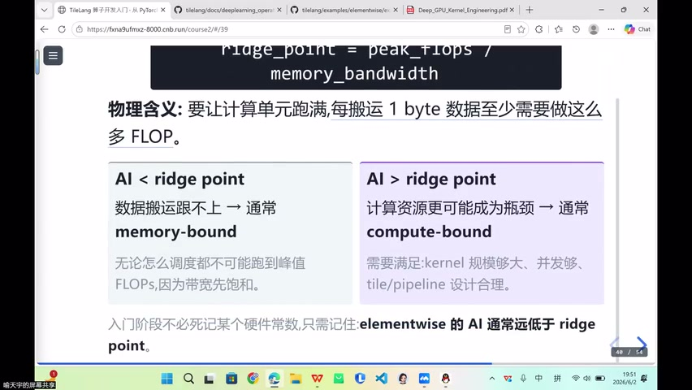


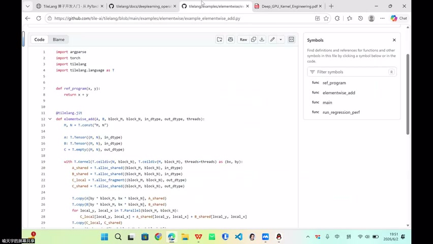

### 四类输入

| 信息 | 来源 | 说明 |
|------|------|------|
| **FLOPs** | 算子公式 + 维度 + 人工约定 | 总计算量 |
| **Bytes** | 输入输出张量大小 + 临时估算 | 数据搬运量 |
| **Peak FLOPs** | GPU 规格表（GPU Perf） | 硬件理论计算峰值 |
| **Bandwidth** | HBM/其他内存带宽 + micro benchmark | 硬件带宽上限 |

### 获取方式

- Peak FLOPs → GPU 规格表
- Bandwidth → micro benchmark + GPU Perf 工具（如 NCU）

---

## 五、Speed of Light 与 Efficiency

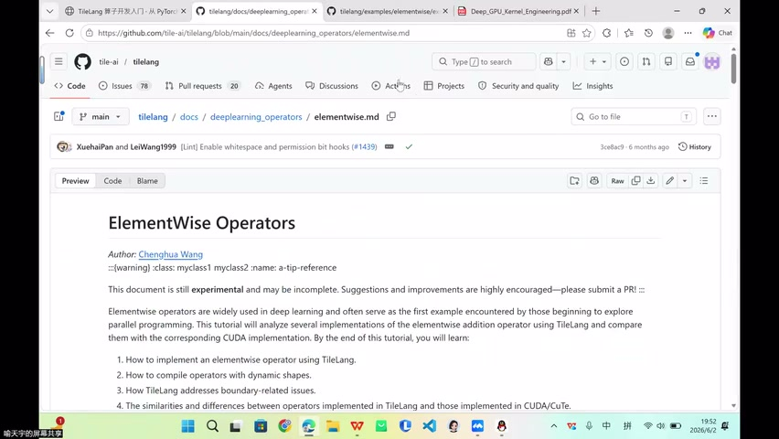


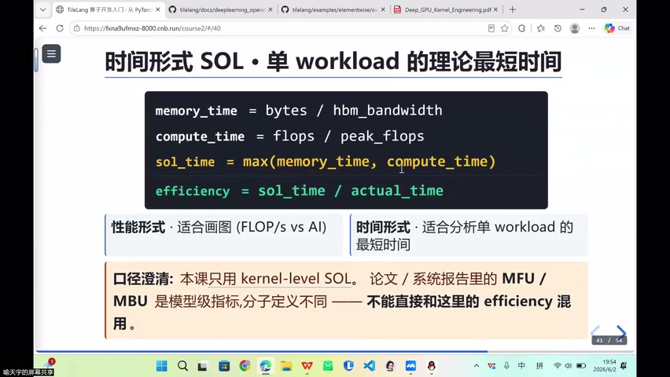

### 公式

```
Efficiency = Speed_of_Light_Time / Actual_Time
           = 理论最优时间 / 实际运行时间
```

### 解读

| Efficiency | 含义 |
|------------|------|
| ≈ 1 | 接近理论上限，优化空间小 |
| << 1（如 0.x） | 存在未解释的开销 |

### 常见开销来源

- 缓存不连续（cache miss）
- Occupancy 低
- 同步开销
- 指令效率差
- Launch 延迟
- 通讯开销

---

## 六、Kernel 级 vs 模型级指标

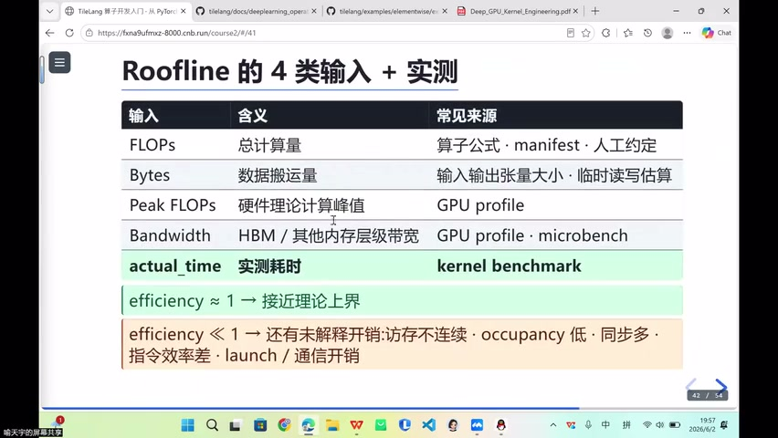

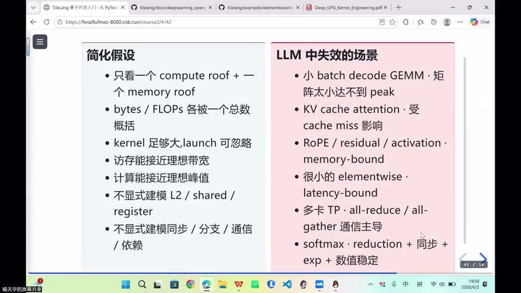

### 层级区分

| 层级 | 指标 | 场景 |
|------|------|------|
| **Kernel 级** | Speed of Light, Efficiency | 单算子优化 |
| **模型级** | MFU (Model FLOPs Utilization) | 训练/推理整体 |

### MFU

- 模型级指标，一般 **~50% 已算较高**
- 包含通讯约束（Communication-bound）
- 多卡推理中的 Tensor Parallel、AllReduce、AllGather

> 不能将模型级 MFU 的口径与 kernel 级 Speed of Light 混用

---

## 七、经典 Roofline 的局限

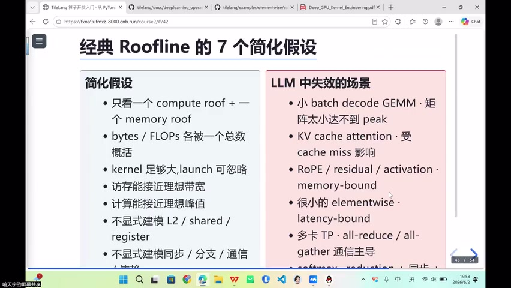

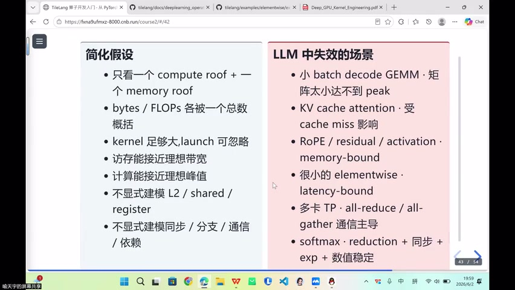

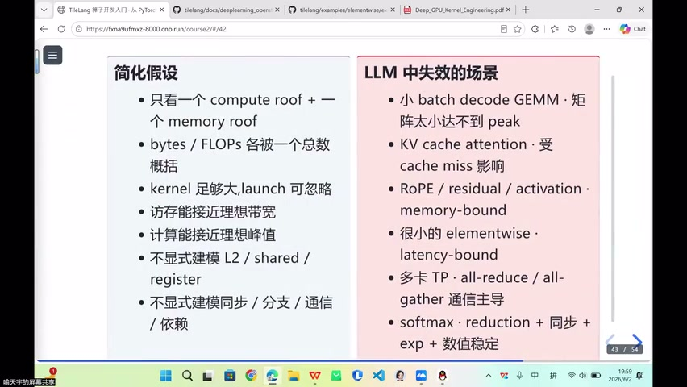

### 简化假设

| 假设 | 现实 |
|------|------|
| FLOPs/Bytes 用总数概括 | 不同阶段差异大 |
| 忽略 launch/调度开销 | 融合算子正是为此 |
| 假设访存接近理论带宽 | 实际有 cache miss |
| 假设计算接近峰值 | 实际有指令效率问题 |
| 不建模 L1/L2/Shared/Register | 多级存储差异显著 |
| 不考虑通讯 | 多卡场景 Communication-bound |

### 实际 Bound 类型（扩展）

```
Memory-bound / Compute-bound / Latency-bound / Communication-bound
```

> 经典 Roofline 很难涵盖模型训练和推理中各种各样的 bound

---

## 八、本节总结

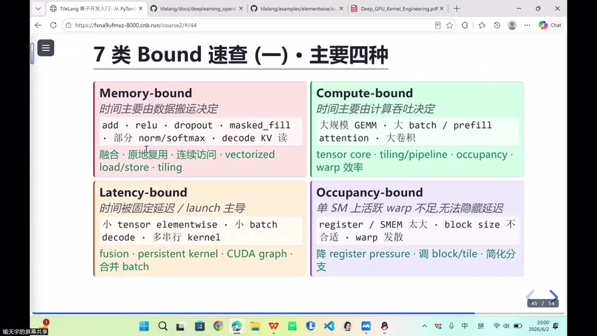


### 要点回顾

1. **Roofline** = 判断算子理论性能上限的工具
2. **算术强度** = FLOPs / Bytes → 决定 memory-bound 还是 compute-bound
3. **Speed of Light** = 理论最优时间 → Efficiency 衡量优化空间
4. **Kernel 级指标** ≠ 模型级指标（MFU），不可混用
5. 经典 Roofline 有局限，实际需考虑多级存储、launch、通讯等

---

## Key Terms

| 术语 | 含义 |
|------|------|
| Roofline Model | 以算术强度为 X 轴、性能为 Y 轴的理论上限模型 |
| Arithmetic Intensity | 算术强度 = FLOPs / Bytes，单位数据搬运带来的计算量 |
| Memory-bound | 带宽先饱和，性能受限于数据搬运 |
| Compute-bound | 计算资源成为瓶颈 |
| Peak FLOPs | 硬件理论计算峰值 |
| Bandwidth | 内存带宽（如 HBM 带宽） |
| Speed of Light | 理论最优执行时间 |
| Efficiency | 理论时间 / 实际时间，衡量优化程度 |
| MFU | Model FLOPs Utilization，模型级计算利用率 |
| Communication-bound | 多卡通讯成为瓶颈 |
| NCU | NVIDIA Nsight Compute，GPU 性能分析工具 |
| Micro Benchmark | 微观基准测试，测量硬件实际能力 |
