# [P34] 算子开发入门 - 性能 Bound 分类·memory-compute-latency 与通信

> **演讲者**：天宇  
> **日期**：2026年5月  
> **活动**：TileLang Puzzle 算子开发实战营 第六课（续）  

---

## 一、Memory-bound 算子


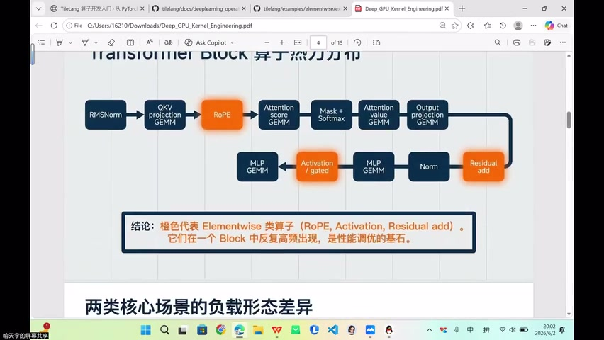

### 典型代表

- 所有 **Elementwise** 算子（add, ReLU, activation...）
- 由数据搬运决定性能

### 关键优化方向

| 技术 | 说明 |
|------|------|
| In-place / Out-of-place | 原地复用 vs 额外输出空间 |
| 连续访问 | 保证 coalescing |
| 向量化 load/store | LDG.128 等宽指令 |
| Tiling（分块） | 分块搬运提升效率 |

---

## 二、Compute-bound 算子

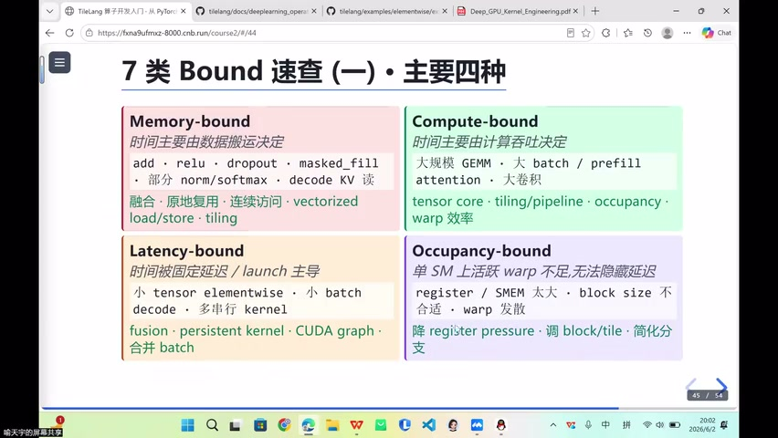

### 典型代表

- 大规模 GEMM
- 大型 batch 计算
- Prefill Attention

### 关键优化方向

| 技术 | 说明 |
|------|------|
| Tensor Core | 矩阵计算核心单元 |
| Tiling | 分块适配计算单元 |
| Pipeline | 搬运与计算重叠 |
| Occupancy | SM 资源利用率 |
| Warp 效率 | 减少 warp divergence |

---

## 三、Latency-bound 算子

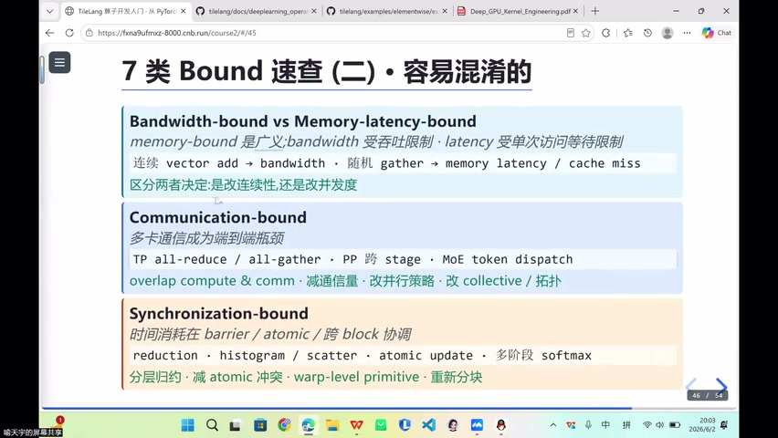

### 典型场景

- 很小的 kernel（即使已封装好的 elementwise）
- Launch 开销 > 实际计算时间

### 解决方式

- **融合**：将小 kernel 与前后算子合并
- 两个 operator → 一个新 operator → 只需一次 launch
- 减少 launch barrier 带来的间隙

---

## 四、Occupancy-bound 与 Warp Specialization

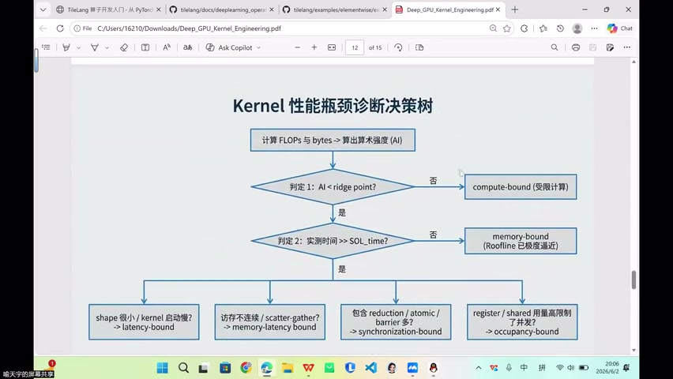

### 硬件约束

- 每个 SM 有 **32 个 Warp**
- 需尽可能让不同 warp 承担工作

### Warp Specialization（Hopper 架构）

| Warp 角色 | 职责 |
|-----------|------|
| 搬运 Warp | 负责数据搬移 |
| 计算 Warp | 负责矩阵计算 |

- 涉及 Pipeline 设计
- 属于 SM 计算单元内部的分工

---

## 五、Bandwidth-bound vs Memory Latency-bound

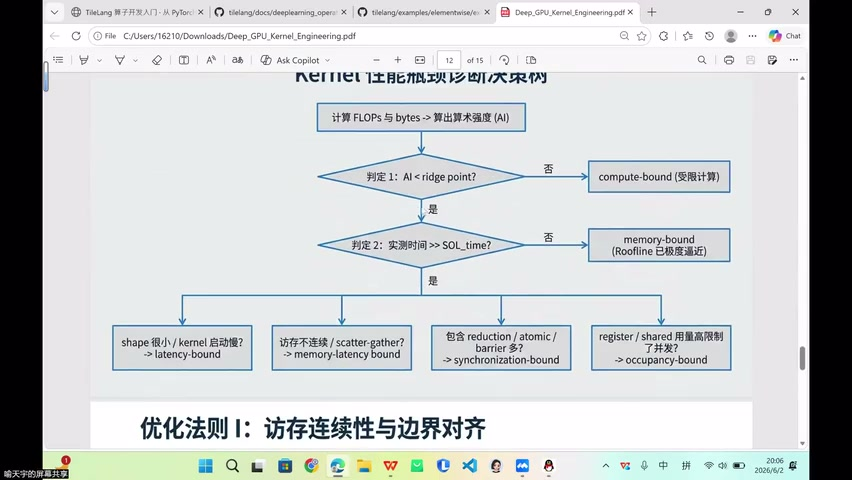

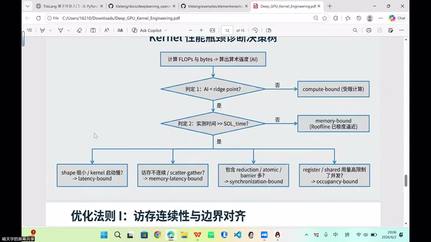

### 细分对比

| 类型 | 受限因素 | 典型场景 |
|------|----------|----------|
| **Bandwidth-bound** | Throughput（吞吐量） | 大量连续数据搬运 |
| **Memory Latency-bound** | 单次访问等待延迟 | 非连续索引访问 |

### Memory Latency-bound 典型

- **Scatter / Gather / Permute**
- 索引决定读取位置 → 非连续访存
- 每次访问都有等待延迟

---

## 六、Communication-bound

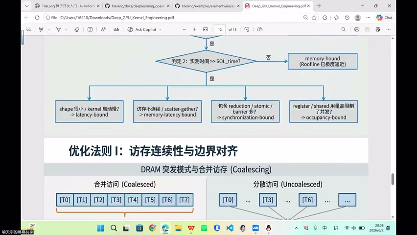

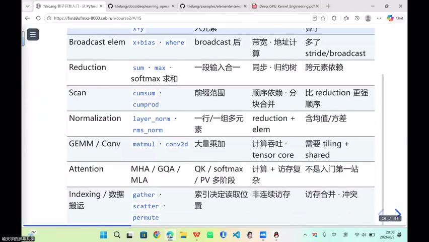

### 多卡通讯

- 多卡推理/训练中的 AllReduce、AllGather
- Tensor Parallel 的同步开销

### Pipeline 并行中的 Bubble

- Stage 之间的间隙 = **Bubble**（泡泡）
- 理想状态：任务无空隙衔接
- 现实：总会有一些 bubble

### 规模效应

- 集群 Scale up 后，同步和通讯约束**越来越明显**
- 比几十张卡/几张卡时更严重

---

## 七、Bound 判定流程

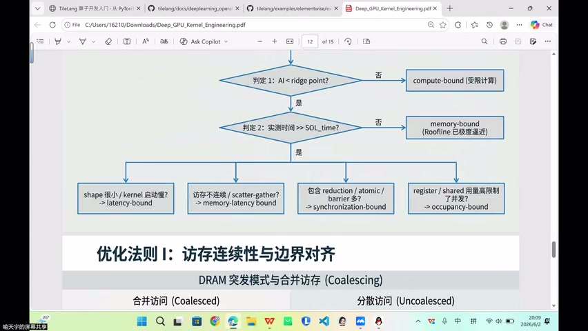

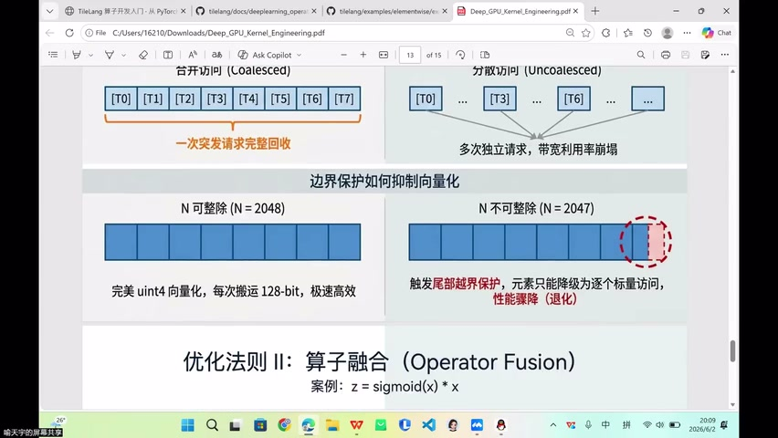

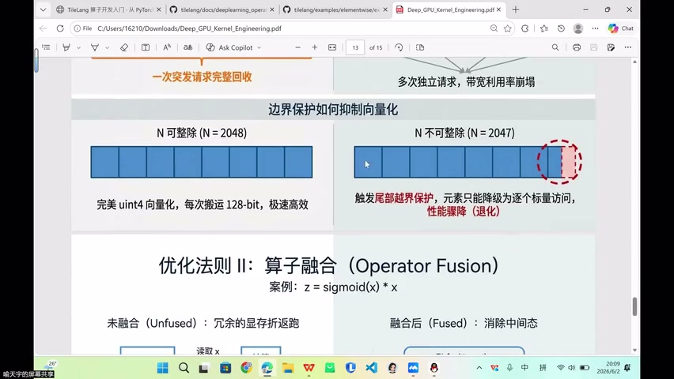

### 判定步骤

```
1. 计算 kernel 的 FLOPs 和 Bytes
2. 算出算术强度 AI = FLOPs / Bytes
3. 与 Ridge Point 比较：
   - AI < Ridge Point → Memory-bound
   - AI > Ridge Point → Compute-bound
4. 特殊情况：
   - kernel 很小 + launch 主导 → Latency-bound
   - 非连续访存（Index 算子）→ Memory Latency-bound
```

### Index 算子归类

- Gather / Scatter / Permute → 访存不连续
- 属于 Memory Latency-bound 子类

---

## 八、优化策略总结

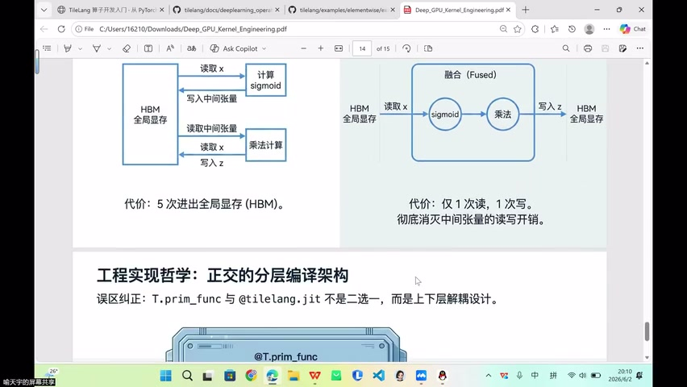

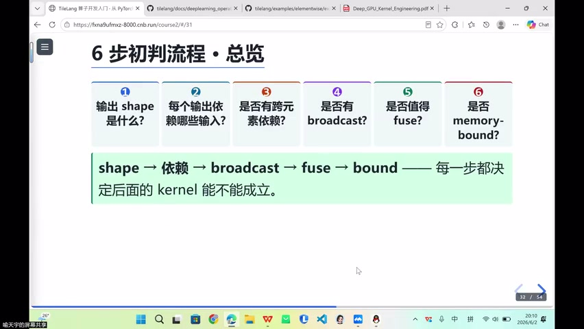

| Bound 类型 | 优化策略 |
|------------|----------|
| Memory-bound | 连续访存、边界对齐、整除、向量化 |
| Latency-bound | 融合算子，减少 launch 次数 |
| Compute-bound | Tensor Core、Pipeline、Occupancy |
| Communication-bound | 计算通讯重叠、减少同步 |

### 边界对齐回顾

- N=2047 不整除 → 触发越界保护 → 尾部退化为标量访问
- 写 kernel 前必须确认是否可被整除

---

## 九、算子开发前的思考清单

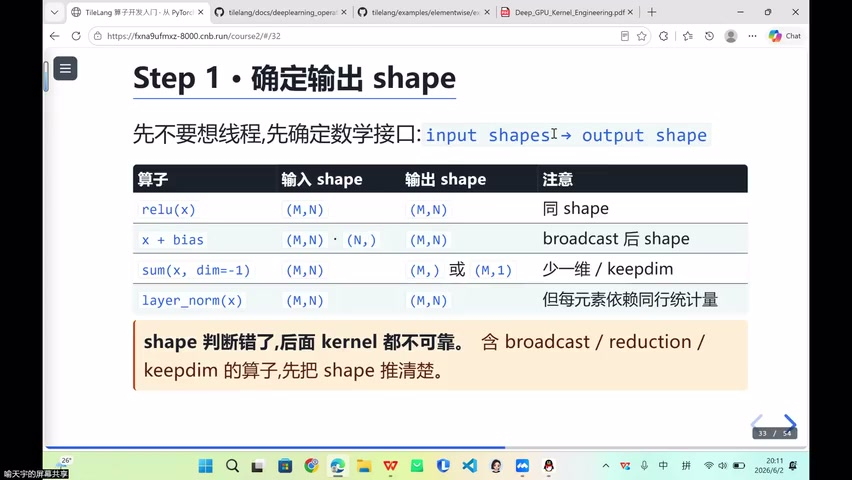

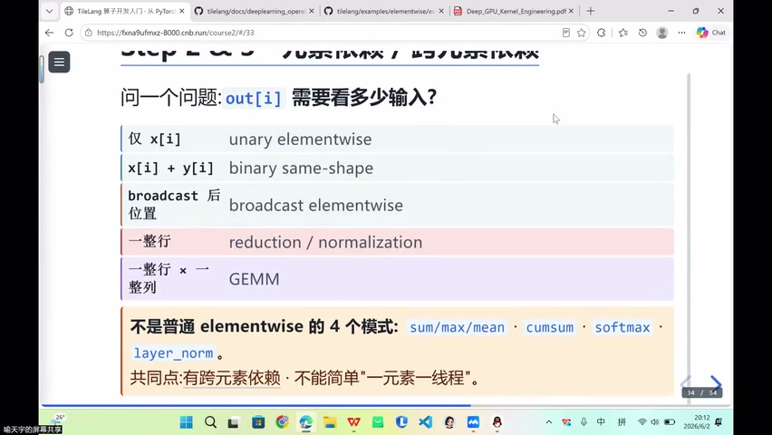

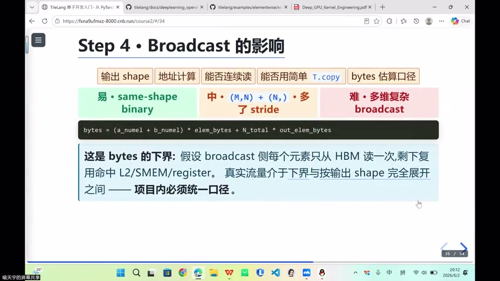

### 开发前四问

1. **输出 shape**：input/output 的维度是什么？
2. **元素依赖**：output[i] 需要看哪些 input？跨元素？
3. **Broadcast**：是否有维度广播？影响地址连续性？
4. **是否可 Fuse**：elementwise 一般值得融合

### Shape 示例

| 算子 | 输入 | 输出 | 特征 |
|------|------|------|------|
| ReLU | (M, N) | (M, N) | 同 shape |
| X + bias | (M, N) + (N,) | (M, N) | Broadcast |
| Sum(dim=1) | (M, N) | (M,) | 降维 |
| LayerNorm | (M, N) | (M, N) | 跨元素依赖 |

### 跨元素依赖

- sum、mean、softmax、normalization → 非逐元素
- 需要看整行/整段输入 → 不是 elementwise

---

## 十、算术强度计算示例


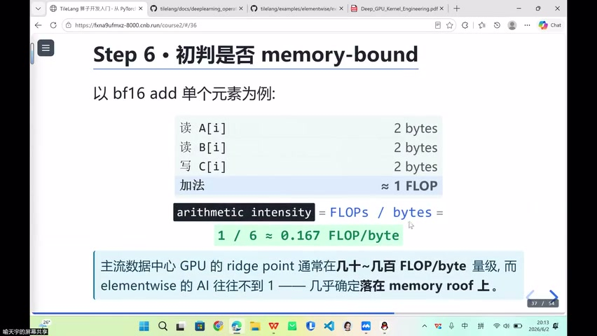

### Vector Add（BF16）

```
读 A: 2 bytes
读 B: 2 bytes
写 C: 2 bytes
─────────────
总 Bytes = 6
FLOPs = 1（一次加法）

AI = 1 / 6 ≈ 0.167
```

> 算术强度极低 → 一定是 **Memory-bound**

### 结论

- Elementwise 算子 AI 极低 → 永远在 Roofline 斜坡上
- 优化方向始终是**访存效率**

---

## Key Terms

| 术语 | 含义 |
|------|------|
| Memory-bound | 性能受限于数据搬运带宽 |
| Compute-bound | 性能受限于计算资源 |
| Latency-bound | 性能受限于 launch/启动延迟 |
| Communication-bound | 性能受限于多卡通讯 |
| Bandwidth-bound | 受吞吐量限制（Memory-bound 子类） |
| Memory Latency-bound | 受单次访问延迟限制（非连续访存） |
| Ridge Point | Roofline 拐点，区分 memory/compute-bound |
| Warp Specialization | 不同 Warp 承担不同角色（搬运/计算） |
| Bubble | Pipeline 并行中 Stage 间的空闲间隙 |
| In-place | 原地计算，输入输出共享内存 |
| Scatter/Gather | 索引驱动的离散访存算子 |
| 算术强度 | FLOPs / Bytes，决定 bound 类型 |
