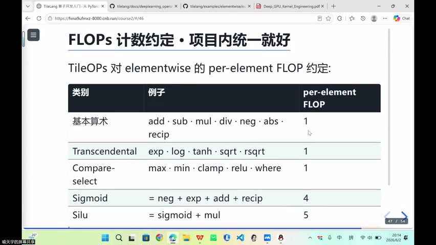
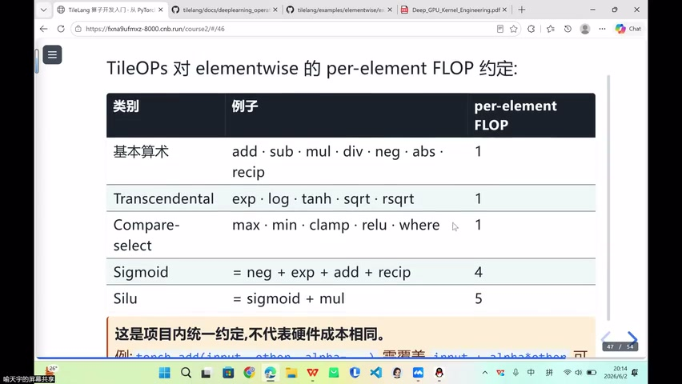
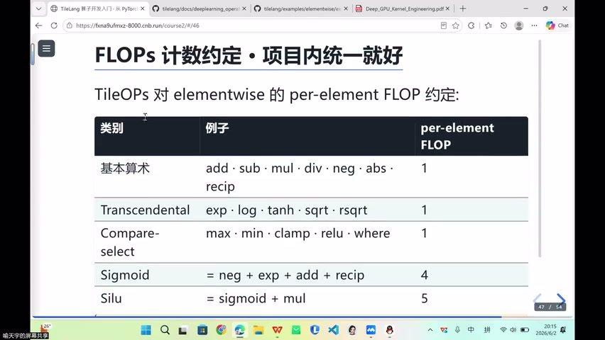
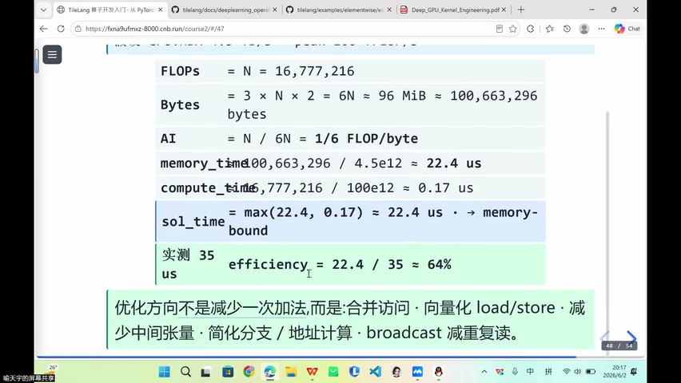
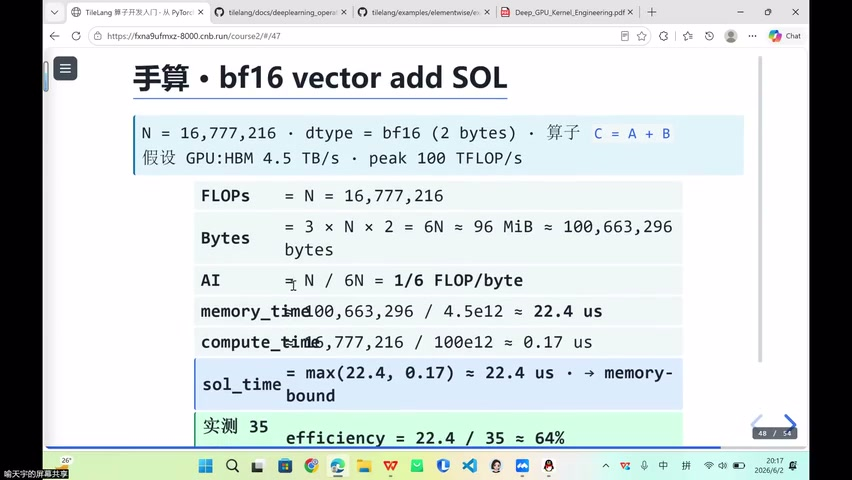
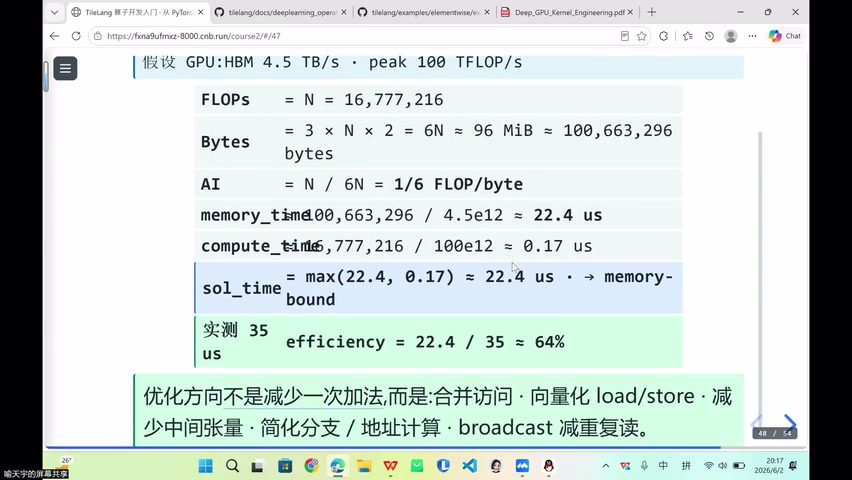
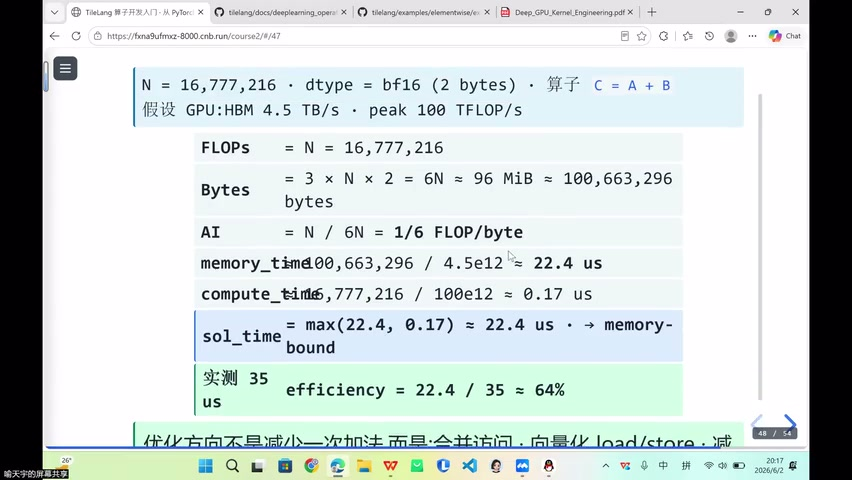
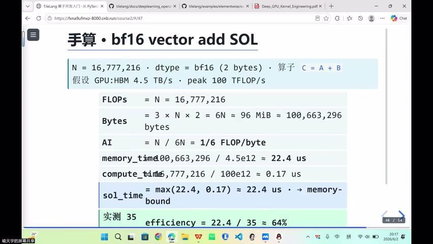
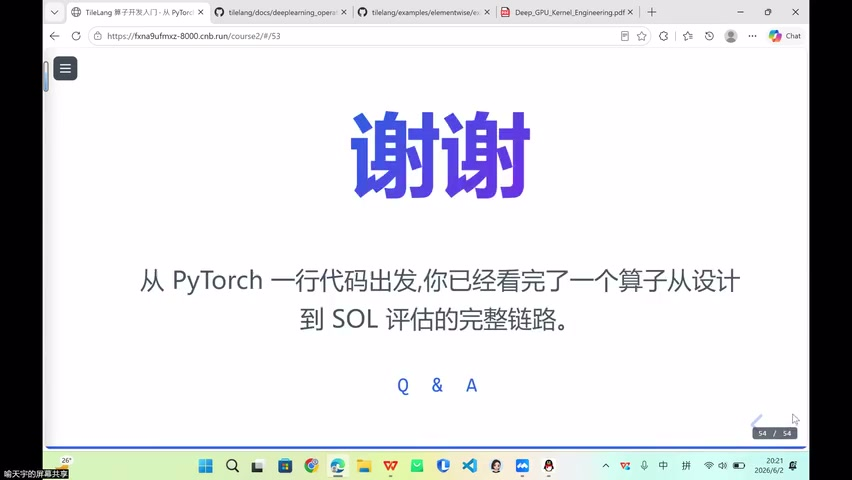
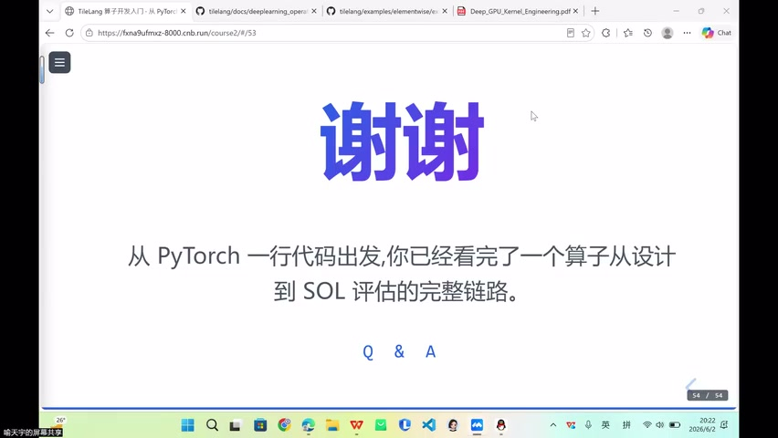

# [P35] 算子开发入门 - Roofline 估算实践、Benchmark 引入与答疑

> **演讲者**：天宇  
> **日期**：2026年5月  
> **活动**：TileLang Puzzle 算子开发实战营 第六课（续）  

---

## 一、课程回顾与展望





### 本节定位

- 从 Elementwise 入门 → 更细的算子融合概念
- 后续内容：Broadcast、Buffer 分配、Pipeline 编排、Auto-tune

### AI 辅助算子开发

- 用 AI Agent 写 DSL 算子越来越普遍
- 算子开发是"封闭向量空间"→ 找到合适的**基向量**（核心思想）即可展开
- 人机协作会越来越多，但**理解原理**仍然必要

---

## 二、软硬件协同设计




### 双向奔赴

```
硬件架构 ──影响──▶ 算法设计 / 软件构建
    ▲                        │
    └────────── 反哺 ─────────┘
```

| 方向 | 示例 |
|------|------|
| 硬件 → 软件 | GPU 架构决定 kernel 写法 |
| 软件 → 硬件 | FlashAttention 推动硬件改进 |
| 特化硬件 | TPU = 为矩阵乘定制的 Tensor 处理器 |

### 核心认知

- 系统工程追求**稳定产出**
- 软件工程约束反哺硬件设施完善
- 算子开发思想不局限于 GPGPU，扎根于计算机科学的"合并同类项"

---

## 三、Buffer 与 Pipeline 预告


### Buffer 使用场景

| 算子类型 | Buffer 需求 |
|----------|-------------|
| Elementwise | 通常不需要额外 buffer |
| GEMM / Attention | 大量 buffer（double/triple buffer） |
| 融合算子 | 按情况分配 |

### Pipeline 编排

- TileLang 作为 DSL，通过 **API** 搭建 pipeline
- Double buffer / Triple buffer → 搬运与计算重叠
- 手工编排方案更复杂，后续深入

---

## 四、GPU 执行层级：CTA







### CTA（Cooperative Thread Array）

- NVIDIA 对 **Thread Block** 的正式称谓
- 层级关系：

```
Grid
 └── 多个 CTA（Thread Block）
      └── 多个 Warp（32 threads）
           └── Threads
```

### 关键特性

| 特性 | 说明 |
|------|------|
| 调度单位 | CTA 内以 **Warp** 为调度单位 |
| Shared Memory | CTA **私有**，同 CTA 线程可数据交换 |
| 跨 CTA 通讯 | 必须经 **Global Memory**，代价大 |
| 同步 | `__syncthreads()` 只在 CTA 内有效 |

---

## 五、Shared Memory 与跨 CTA 限制





### Shared Memory

- 同一 CTA 的线程共享 → 高效数据交换
- Reduce 类算子依赖 Shared Memory 做树形规约

### 跨 CTA 限制

- 不同 CTA **不具备**共享存储
- 通讯只能走 Global Memory（HBM）
- 搬运代价大 → 更希望从 SRAM/L1/L2 搬运

### 同步陷阱

- 同步机制不好 → 同 CTA 线程阻塞
- **无法**跨 CTA 同步

---

## 六、延迟隐藏与 Warp Specialization



### 延迟隐藏（Latency Hiding）

- 多个 CTA 驻留在同一 **SM**（流式多处理器）
- 一个 Warp 等数据时 → 调度同 SM 上其他 CTA 的 Warp
- 这是延迟隐藏的**基础设施**

### Warp Specialization（Hopper 架构）

| Warp 角色 | 职责 |
|-----------|------|
| 搬运 Warp | 负责数据搬移 |
| 计算 Warp | 负责矩阵计算 |
| 调度 Warp | 负责协调 |

- 不同 Warp 间搭建**流水线**
- 目标：交接工作的间隙（Bubble）尽量短

---

## 七、Bubble 的普适性



### 各层级的 Bubble

| 层级 | Bubble 表现 |
|------|-------------|
| Warp 之间 | 工作交接间隙 |
| CTA 之间 | Pipeline stage 间隙 |
| 集群之间 | 多卡通讯等待 |

> Bubble 不只是 SM 之间——从 Warp 到集群，交接间隙无处不在

### 优化目标

- 打满空余间隙
- CTA 数量影响 Occupancy
- CTA 早退（early exit）需考虑

---

## 八、CTA 核心总结


### CTA 的本质

- 硬件上的**可协作线程组**
- 共享同一片物理 Shared Memory
- 高效互联 + 任务分配

### 对算子开发的启示

- 写 kernel 时：一个 CTA 负责一个输出 Tile
- CTA 数量 → 影响 Occupancy
- 后续 Reduce、GEMM 都建立在 CTA 协作模型上

---

## Key Terms

| 术语 | 含义 |
|------|------|
| CTA | Cooperative Thread Array，NVIDIA 对 Thread Block 的正式称谓 |
| SM | Streaming Multiprocessor，流式多处理器 |
| Warp | 32 个线程的调度单位 |
| Shared Memory | CTA 私有的片上高速存储 |
| Global Memory | 所有 CTA 共享的 HBM，通讯代价大 |
| Latency Hiding | 通过调度其他 CTA/Warp 隐藏等待延迟 |
| Warp Specialization | Hopper 架构中不同 Warp 承担不同角色 |
| Bubble | Pipeline 中工作交接的空闲间隙 |
| Double Buffer | 双缓冲，搬运与计算重叠 |
| Occupancy | SM 资源利用率，受 CTA 数量影响 |
| 基向量 | 算子开发中的核心思想/方向（比喻） |
| Auto-tune | 编译器提供的自动调优机制 |
