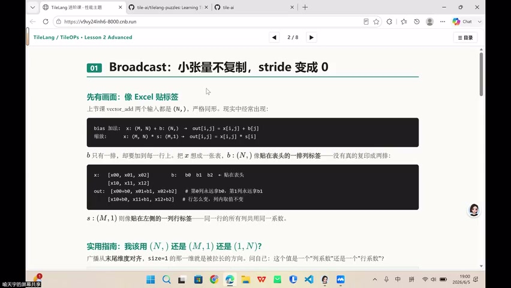
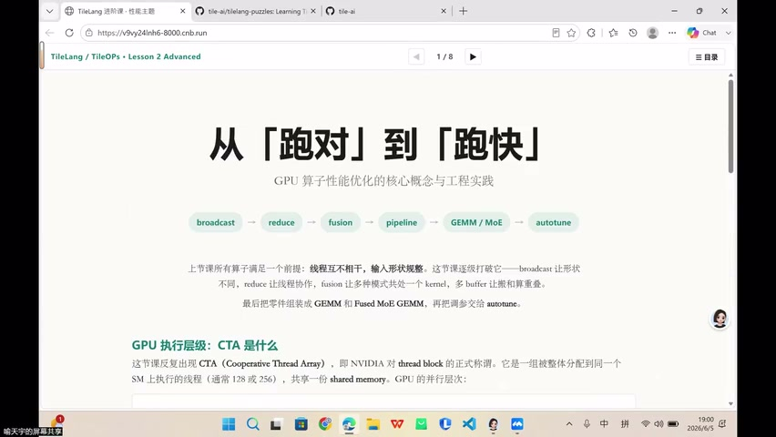
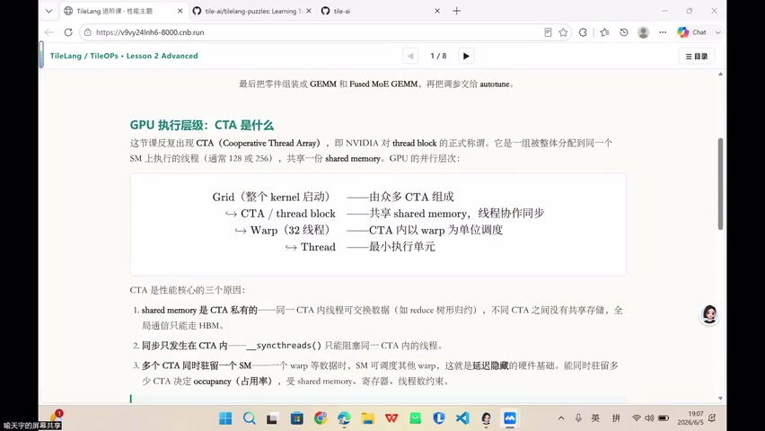
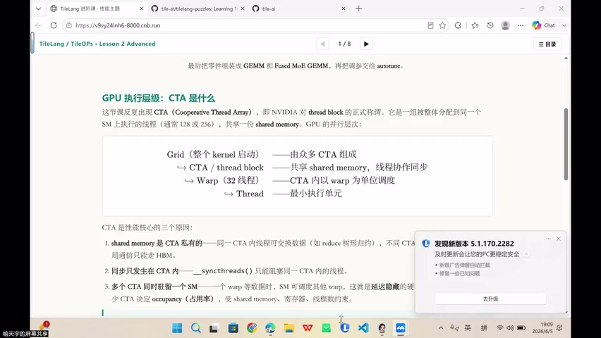
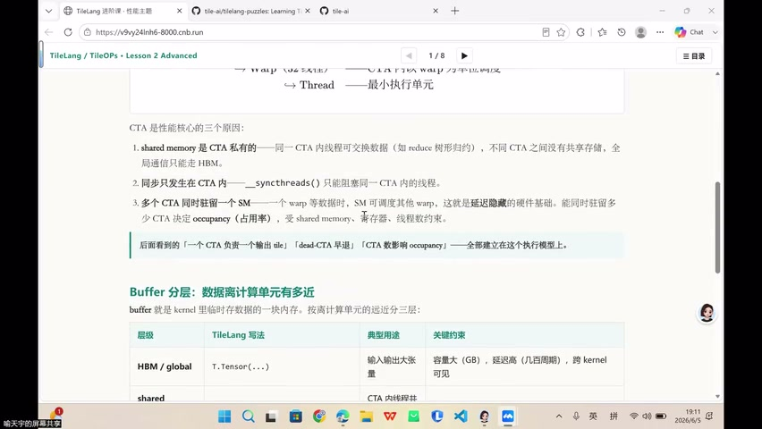

# [P36] GPU 算子性能优化的核心概念与工程实践 - 开场、本课大纲与 CTA 执行层级

> **演讲者**：天宇  
> **日期**：2026年5月  
> **活动**：TileLang Puzzle 算子开发实战营 第七课  

---

## 一、Buffer 概念





### 什么是 Buffer

- Kernel 中**临时存储数据**的一片内存
- 不同于 Python 文件缓冲区——在 GPU 编程中有更丰富含义
- 按距离计算单元的远近，分布在不同层级

### Buffer 的层级分布

| 层级 | 位置 | 特点 |
|------|------|------|
| HBM（Global Memory） | 最远 | 容量大、带宽有限 |
| Shared Memory | 片上 | CTA 私有、高速复用 |
| Register / Fragment | 最近 | 计算直接参与 |

### "搬上片"

```
HBM ──读取 Tile──▶ Shared Memory ──搬运──▶ Register/Fragment ──计算
```

---

## 二、不同算子的 Buffer 需求



### 按算子类型

| 算子类型 | Buffer 需求 | 说明 |
|----------|-------------|------|
| Elementwise | 仅 Register | 数据在 register 中"过一下"即可 |
| GEMM | Shared Memory 复用 | 分块矩阵多次乘 → 同块数据反复使用 |
| FlashAttention（融合） | 多个 Shared Buffer | 需要 Pipeline（double/triple buffer） |

### GEMM 的 Shared Memory 复用

- 分块矩阵公式中，某个块会**多次参与乘法**
- 整块数据放在 Shared Memory 中复用
- 避免反复从 HBM 读取

---

## 三、TileLang Buffer 分配 API




### 三种分配方式

| API | 层级 | 用途 |
|-----|------|------|
| `T.alloc_shared(shape, dtype)` | Shared Memory | CTA 内共享数据 |
| `T.alloc_fragment(shape, dtype)` | Register（Fragment） | Tile 原语识别的元素组 |
| `T.alloc_local(shape, dtype)` | Register（Local） | 线程私有临时变量 |

### Fragment vs Local 的区别

| 维度 | Fragment | Local |
|------|----------|-------|
| Scope | `local.fragment` | `local` |
| 语义 | Tile 原语可识别（T.gemm, T.reduce） | 普通线程私有数组 |
| 典型用途 | T.gemm 的 accumulator、T.reduce 的输入 | 手写循环中的临时累加值 |
| 编译器处理 | Layout inference + Lowering | 普通寄存器分配 |

### 源码定义

- `alloc_local`: "Allocate a local memory buffer for thread-private storage"
- `alloc_fragment`: 传给底层 scope = `local.fragment`
- 区别在于**编译器后端**按不同语义处理

---

## 四、使用经验



### 实践规则

| 场景 | 选择 |
|------|------|
| Shared → Fragment → Shared 搬运 | `T.alloc_fragment` |
| T.gemm / T.reduce 的 accumulator | `T.alloc_fragment` |
| 小量临时变量、手写循环累加 | `T.alloc_local` |
| GEMV 中的小向量累加 | `T.alloc_local` |

### 编译器行为

- Fragment → 编译器做 **Layout Inference**（布局推断）
- Fragment → 编译器做 **Lowering**（指令降级）
- 围绕 Fragment 语义安排每个线程的数据分布

---

## 五、本课大纲与 Roofline 回顾


### 本节后续内容

- CTA 执行层级深入
- Broadcast 广播
- Reduce 规约
- Pipeline 编排（double/triple buffer）
- Auto-tune 自动调优

### Roofline 标准框架

- 后续算子均以**标准 Roofline** 为分析基础
- 一边是 Compute-bound，一边是 Memory-bound
- 上节课的扩展 bound（latency、communication）暂不纳入

---

## Key Terms

| 术语 | 含义 |
|------|------|
| Buffer | Kernel 中临时存储数据的内存区域 |
| T.alloc_shared | 分配 Shared Memory 级 buffer |
| T.alloc_fragment | 分配 Register 级 Fragment buffer（Tile 原语可识别） |
| T.alloc_local | 分配 Register 级线程私有 buffer |
| Fragment | 寄存器片段，编译器可做 Layout Inference |
| Layout Inference | 编译器推断数据在线程间的分布布局 |
| Lowering | 将高层 IR 降级为硬件指令 |
| 搬上片 | 从 HBM 搬到 Shared Memory / Register |
| Double Buffer | 双缓冲 Pipeline，搬运与计算重叠 |
| Scope | 存储作用域标识（local / local.fragment / shared） |
| GEMV | 矩阵乘向量（GEneral Matrix-Vector multiply） |
