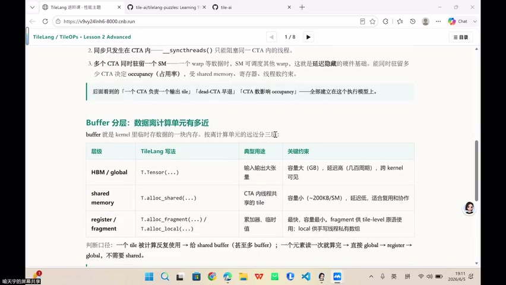
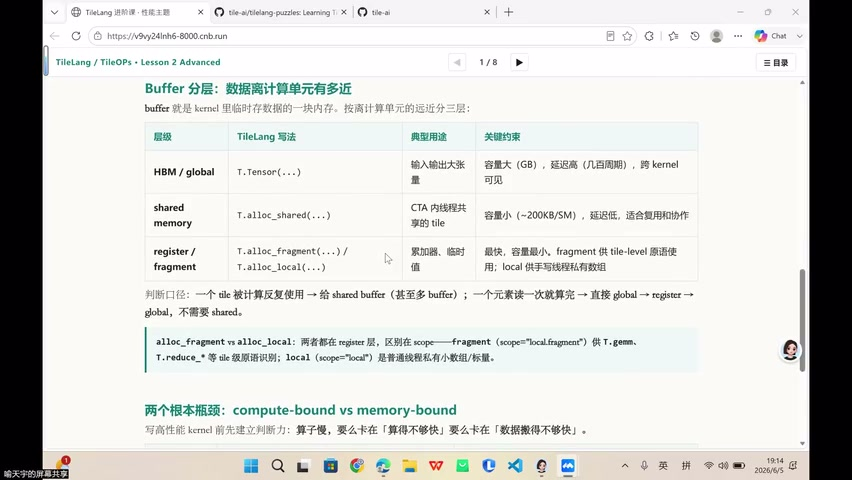
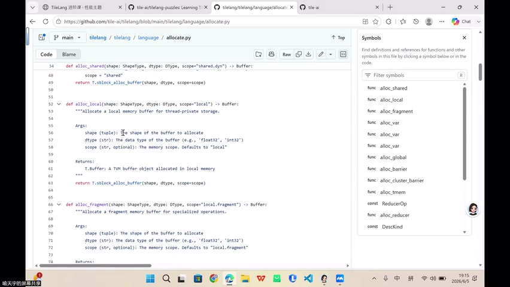
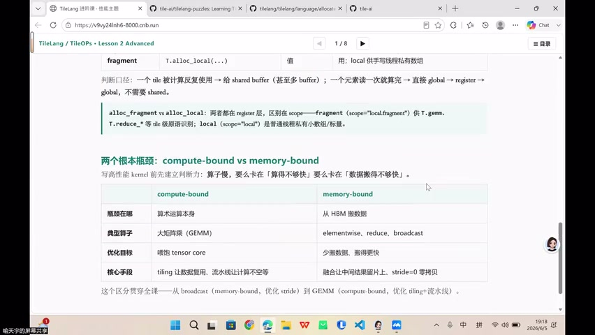
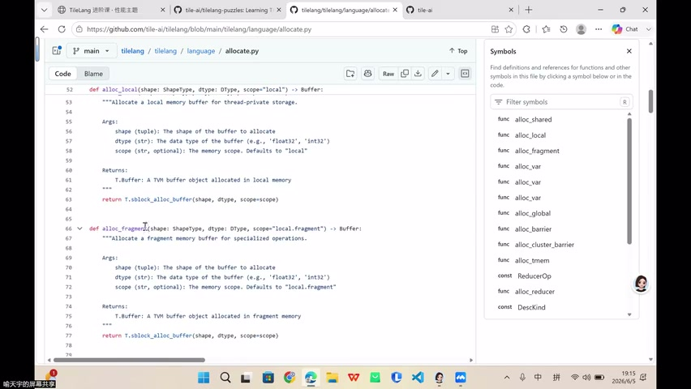

# [P37] GPU算子性能优化 - Buffer与T.alloc_fragment/local

> **演讲者**：TileLang 训练营讲师  
> **日期**：2026年6月5日  
> **活动**：TileLang Puzzle 算子开发实战营 第五课（GPU算子性能优化）  

---

## 一、Buffer 分层：数据离计算单元有多近

GPU 内存层次决定了 kernel 性能。TileLang 将 buffer 分为三层：

| 层级 | TileLang 写法 | 典型用途 | 关键约束 |
|------|--------------|----------|----------|
| **HBM / global** | `T.Tensor(...)` | 输入/输出大张量 | 容量大(GB级)，延迟高(数百周期)，跨 kernel 可见 |
| **shared memory** | `T.alloc_shared(...)` | CTA 内线程共享 tile 数据 | 容量小(~200KB/SM)，低延迟，适合复用协作 |
| **register / fragment** | `T.alloc_fragment(...)` / `T.alloc_local(...)` | 最快最小，fragment 级 API | 容量最小，线程私有 |

**判断口径**：
- 一个 tile 被计算**反复使用** → 给 shared buffer（甚至多 buffer）
- 一个元素**读一次就算完** → 直接 global → register → global，不需要 shared

### alloc_fragment vs alloc_local

两者都在 register 层，区别在于 **scope**：
- `alloc_fragment`（scope = `"local.fragment"`）：提供 `T.gemm`、`T.reduce.*` 等 tile 级 API 识别规则
- `alloc_local`（scope = `"local"`）：线程私有小 buffer，用于手写标量代码

---

## 二、两个根本瓶颈：compute-bound vs memory-bound

写高性能 kernel 前先建立判断力：算子慢，要么卡在「算得不够快」，要么卡在「数据搬得不够快」。

| | **compute-bound** | **memory-bound** |
|---|---|---|
| **瓶颈在哪** | 算术运算本身 | 从 HBM 搬数据 |
| **典型例子** | 大矩阵乘 (GEMM) | elementwise, reduce, broadcast |
| **优化目标** | 喂饱 tensor core | 少搬数据、搬得更快 |
| **核心手段** | tiling 让数据复用、流水线让计算不空等 | 融合让中间结果留在片上、stride=0 零拷贝 |

> 这个区分贯穿全课——从 broadcast（memory-bound，优化 stride）到 GEMM（compute-bound，优化 tiling + 流水线）。

---

## 三、Reduce 算子：树状归约

Reduce 算子需要线程协作完成归约操作：

- **reduce_sum**：对一行求和 → `Y[i] = X[i,0] + X[i,1] + ... + X[i,M-1]`
- **reduce_max**：取一行最大值

### 树状归约（Tree Reduction）

数学上映射到 kernel 的步骤：
1. 每个线程先计算自己的**部分和**（partial sum）
2. 将部分和写入 **shared memory**
3. 设初始步长 `stride = W/2`（W 为线程数）
4. 每轮：`shared[tid] += shared[tid + stride]`，stride 减半
5. 最终 `shared[0]` 即为总和

### TileLang 中的 Reduce

TileLang 封装了树状归约的硬件细节，只需：
1. 创建三个关键张量：`tile`（输入块）、`partial`（部分和）、`accumulator`（累加器）
2. 调用 `T.reduce_sum` / `T.reduce_max` API
3. 不需要手动管理 shared memory 同步和步长

---

## 四、T.serial vs T.parallel：顺序累加与并行累加

一个 kernel 中可能同时存在两种循环模式：

### T.serial（顺序累加）

- 用于 **accumulator** 跨迭代有依赖的场景
- 例：同一行的累加，每次迭代依赖上一次结果
- 不能并行化，必须顺序执行

### T.parallel（并行执行）

- 用于**不同行之间互相独立**的场景
- 例：不同行的 reduce 互不影响，可以并行
- 内存搬运（不同行的数据加载）也可并行

### 判断规则

> 同一个循环中，如果需要维护**跨迭代的累加状态**（如 ACC），各迭代有先后依赖 → 用 `T.serial`  
> 如果不同元素/行之间**没有依赖** → 用 `T.parallel`

---

## 五、Reduce 的约束条件

实现 reduce kernel 时的硬件约束：
- `gridDim.x >= rows`（每个输出行至少一个 CTA）
- 动态 shared memory >= `blockDim.x * sizeof(float)`
- `blockDim.x` 必须是 **2 的幂**（树状归约要求）
- 实际 kernel 还需处理**越界检查**（非整除时剩余元素走慢路径）
- 可用 warp-level primitive 减少 shared memory 和同步开销

---

## Key Terms

| 术语 | 含义 |
|------|------|
| Buffer 分层 | HBM → shared → register 三级内存层次 |
| alloc_fragment | 寄存器层 fragment 级 buffer，支持 tile API |
| alloc_local | 寄存器层线程私有 buffer |
| compute-bound | 瓶颈在计算吞吐（如 GEMM） |
| memory-bound | 瓶颈在数据搬运带宽（如 reduce） |
| Tree Reduction | 树状归约，O(log N) 步完成 N 元素归约 |
| T.serial | 顺序循环，用于有跨迭代依赖的累加 |
| T.parallel | 并行循环，用于无依赖的独立计算 |
| Accumulator | 累加器，维护跨迭代状态 |
