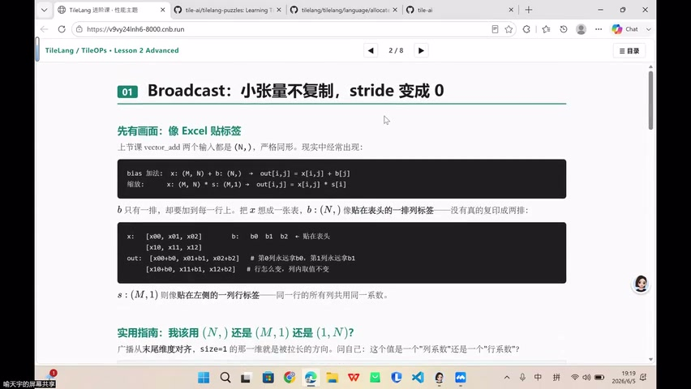
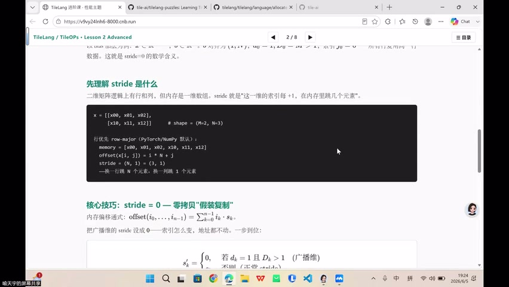
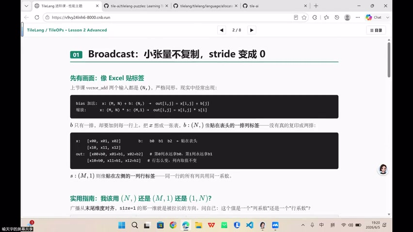
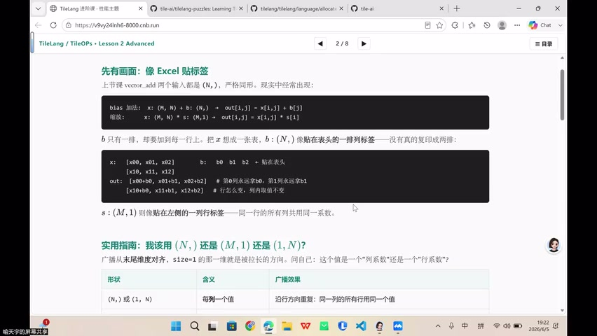
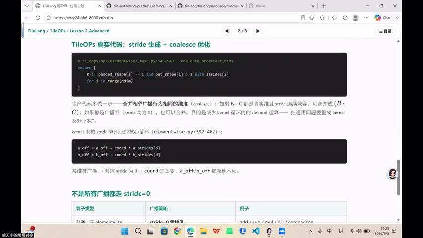

# [P38] GPU算子性能优化 - Broadcast广播·偏置缩放与访存优化

> **演讲者**：TileLang 训练营讲师  
> **日期**：2026年6月5日  
> **活动**：TileLang Puzzle 算子开发实战营 第五课（GPU算子性能优化）  

---

## 一、Broadcast：小张量不复制，stride 变成 0



### 问题场景

现实中经常出现形状不匹配的运算：
```
bias 加法: x: (M, N) + b: (N,)   → out[i,j] = x[i,j] + b[j]
缩放:     x: (M, N) * s: (M,1)   → out[i,j] = x[i,j] * s[i]
```

### 直觉：像 Excel 贴标签

- `b: (N,)` 像贴在表头的一排标签——没有真的复印成 M 排
- `s: (M,1)` 像贴在左侧的一列行标签——同一行所有列共用同一系数

### 实用指南

广播从**末尾维度对齐**，`size=1` 的那一维就是被拉长的方向。问自己：这个值是「列系数」还是「行系数」？

---

## 二、Stride 与零拷贝广播



### Stride 是什么

二维矩阵在内存中是一维数组。stride 表示「这一维索引每 +1，在内存里跳几个元素」：

```python
x = [[x00, x01, x02],
     [x10, x11, x12]]   # shape = (M=2, N=3)

# 行优先 row-major (PyTorch/NumPy 默认)
# memory = [x00, x01, x02, x10, x11, x12]
# offset(x[i, j]) = i * N + j
# stride = (N, 1)
```

### 核心技巧：stride = 0

内存偏移通式：`offset(i₀,…,iₙ₋₁) = Σ iₖ · sₖ`

把广播维的 stride 设成 0——索引怎么变，地址都不动：

```
sₖ = 0,  if dₖ = 1 and Dₖ > 1  (广播维)
sₖ = 正常值, otherwise           (正常维)
```

这就是**零拷贝「假装复制」**——不搬数据，只改 stride。

---

## 三、Elementwise 算子融合（Fusion）



### 为什么要融合

朴素写法（两个 kernel）：
1. Kernel 1：读 X → 计算 add → 写 Y 到 HBM
2. Kernel 2：读 Y 从 HBM → 读 value → 计算 mul → 写 out 到 HBM

**问题**：Y 的写回 + 重新读入是多余的 HBM 往返。

### 融合后（一个 kernel）

读 X → 计算 add → **中间结果留在 register** → 读 value → 计算 mul → 写 out

> 省掉一次 HBM 读写，中间值在搬回 HBM 之前就参与了下一个运算。

### 融合策略

1. **elementwise 之间融合**：add + mul → 一个 kernel
2. **elementwise 与前后算子融合**：如 residual add + reduce
3. **softmax 内部融合**：reduce_max + exp + reduce_sum + div

---

## 四、Softmax 数值稳定性



Softmax 公式：`softmax(x_i) = exp(x_i) / Σ exp(x_j)`

### 问题

x 较大时 `exp(x)` 会溢出（GPU 浮点范围有限）。

### 解决：减去最大值

```
softmax(x_i) = exp(x_i - max(x)) / Σ exp(x_j - max(x))
```

- 减去 max 后，分子 ≤ 1（小数），分母也是小数累加
- 数学等价（`exp(a-c)/exp(b-c) = exp(a)/exp(b)`），但数值安全
- 这是 **online softmax** 的基础（后续进阶课详讲）

---

## 五、Multi-Buffering 与 Software Pipeline



### 问题：搬与算的串行交替

朴素 kernel 中，搬数据和计算是**串行**的：
- 搬第 0 块（300 周期）→ 算第 0 块（100 周期）→ 搬第 1 块 → 算第 1 块 → ...
- 3/4 时间计算单元在空等！

### 解决：Double/Multi Buffering

用多块 shared memory buffer 实现**搬运与计算重叠**：
- 搬第 1 块的同时，算第 0 块
- 算完第 0 块时，第 1 块已就绪 → 立即算第 1 块
- 搬运单元同时去搬第 2 块

### 性能公式

```
串行时间 = K × (T_load + T_compute)
流水线上界 = K × max(T_load, T_compute)
Speedup ≤ (T_load + T_compute) / max(T_load, T_compute)
```

### 现实约束

- 需要足够大的 shared memory 存放多份 buffer
- Pipeline 各阶段之间仍有 **bubble**（无法完美对齐）
- 不同硬件 SRAM 大小不同（如 MetaX 切 8 份也很有限）
- 用 Nsight Compute 观察 `warp_state` 和 `occupancy` 指标
- 理想 speed-of-light 很难达到，但 multi-buffering 是最接近的手段

---

## Key Terms

| 术语 | 含义 |
|------|------|
| Broadcast | 小张量通过 stride=0 零拷贝扩展到大张量形状 |
| Stride | 索引每 +1 在内存中跳跃的元素数 |
| stride=0 | 广播维技巧，索引变化但地址不变 |
| Fusion | 多个算子合并为一个 kernel，减少 HBM 往返 |
| Online Softmax | 减最大值保证数值稳定的 softmax 实现 |
| Multi-Buffering | 多份 shared buffer 实现搬运与计算重叠 |
| Software Pipeline | 软件流水线，隐藏内存延迟 |
| Bubble | 流水线中无法利用的空闲周期 |
| Speed-of-Light | 理论性能上界 |
