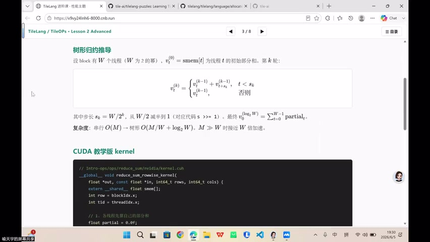
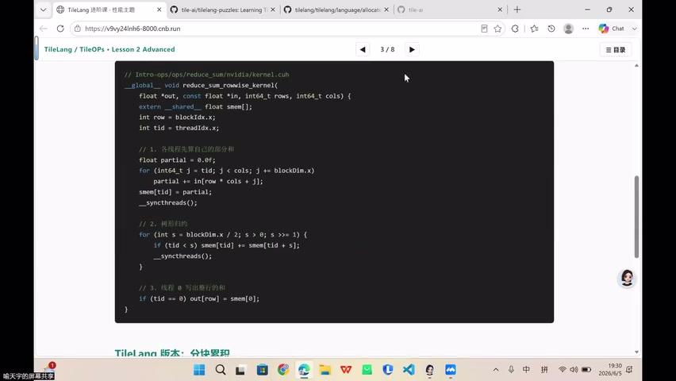
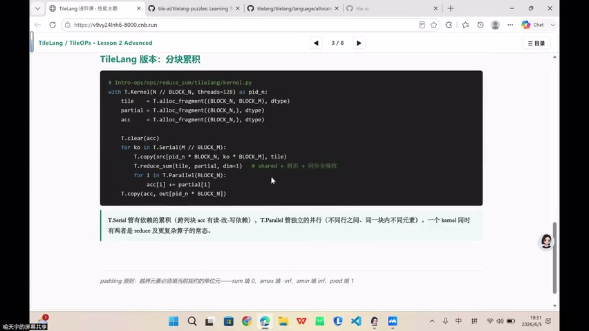
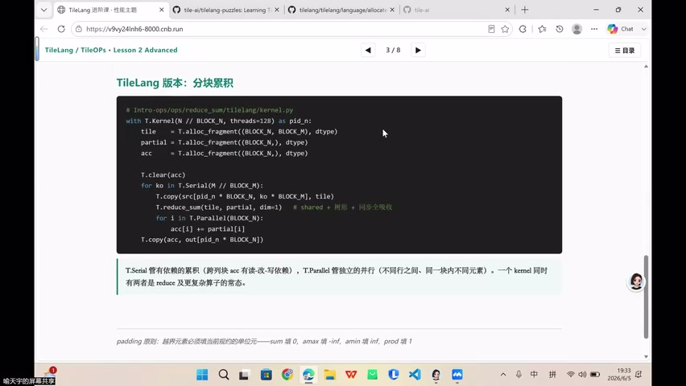

# [P39] GPU算子性能优化 - Reduce规约与Serial-Parallel累加（答疑）

> **演讲者**：TileLang 训练营讲师（天宇老师）  
> **日期**：2026年6月5日  
> **活动**：TileLang Puzzle 算子开发实战营 第五课 答疑环节  

---

## 一、课程回顾：Buffer 与 Pipeline

本节为第五课答疑，回顾核心知识点：
- **Buffer 分层**：HBM → shared → register/fragment
- **Pipeline**：multi-buffering 隐藏内存延迟
- **T.serial / T.parallel**：顺序累加 vs 并行执行

> 后面写 compute-bound 算子（如 GEMM、FlashAttention）时，会反复用到以上所有思想。

---

## 二、树形归约推导



设 block 有 W 个线程（W 为 2 的幂），\(v_t^{(0)} = \text{smem}[t]\) 为线程 t 的初始部分和。第 k 轮：

\[
v_t^{(k)} = \begin{cases} v_t^{(k-1)} + v_{t+s_k}^{(k-1)}, & t < s_k \\ v_t^{(k-1)}, & \text{otherwise} \end{cases}
\]

其中 \(s_k = W / 2^k\)，最终结果：\(v_0^{(\log_2 W)} = \sum_{i=0}^{W-1} \text{partial}_i\)

**复杂度**：串行 O(M) → 树形 O(M/W + log₂W)。M ≫ W 时接近 W 倍加速。

### CUDA 教学版 kernel 结构

```c
__global__ void reduce_sum_rowwise_kernel(
    float *out, const float *in, int64_t rows, int64_t cols) {
    extern __shared__ float smem[];
    int row = blockIdx.x;
    int tid = threadIdx.x;
    // 1. 各线程先算自己的部分和
    float partial = 0.0f;
    // 2. 写入 shared memory
    // 3. 树状归约：stride 从 W/2 减半到 1
    // 4. smem[0] 写回 global
}
```

---

## 三、Q&A：T.serial vs T.parallel vs T.pipeline



| 原语 | 含义 | 使用场景 |
|------|------|----------|
| `T.serial` | 串行循环 | accumulator 跨迭代有依赖（块与块之间有关联） |
| `T.parallel` | 并行循环 | 各单元互相独立，可同时执行 |
| `T.pipeline` | 软件流水线 | 搬运与计算重叠，有 `num_stage` 参数控制深度 |

### Pipeline num_stage

- 指定流水线深度（同时准备几份 buffer）
- 深度越大 → 隐藏延迟越好，但 shared memory 占用越多
- 需要根据硬件 SRAM 容量权衡

---

## 四、Q&A：Thread 数量与 CTA 调度



- TileLang 以 **CTA（block）** 为调度单位，不直接指定 warp/thread 数
- `T.copy` 中可指定搬运的数据块大小，编译器自动分配线程
- 与 CUDA 不同：CUDA 可手动指定 `blockDim`、warp 数；TileLang 更高层抽象
- 每个 CTA 天生有多少 warp × 多少 thread 由硬件和 tile 大小决定

---

## 五、两种 Swizzle



### 1. Shared Memory Swizzle（地址布局）

- 解决 **bank conflict**：同一 warp 内多线程同时访问同一 bank → 被迫串行
- Swizzle 将地址在 bank 间打散
- 帮助 fragment → shared → global 的搬运更顺畅

### 2. Thread Block Swizzle（调度顺序）

- 调整 block 在 grid 上的遍历顺序（不按行扫描，而是分块）
- 让**相邻时间执行的 block** 复用 L2 cache 中的数据
- 提高 L2 cache 命中率

> 两者都不改变计算结果，纯粹是硬件层面的性能优化。

---

## 六、Warp 级操作

- TileLang 中 warp 展开（warp unroll）比较困难
- 编译器在 API 内部可能已封装了常用 warp 操作
- 手动指定每个 warp 的行为与 TileLang 的设计理念有冲突
- TileLang 按「一块一块」来分配和调度，而非逐 warp 控制

---

## 七、下节预告

- **Fuse MoE GEMM**：详细拆解 MoE 算子的 pipeline 设计
- **Benchmark 方法论**：
  - 先估算算子在特定硬件上的 **speed-of-light**（基于 roofline 推导）
  - 在多核容器中跑算子测试
  - 评判是否达到预期效果
- **Autotune**：自动搜索最优 tile 大小和 pipeline 配置

---

## Key Terms

| 术语 | 含义 |
|------|------|
| Tree Reduction | 树状归约，O(log W) 步完成 W 线程归约 |
| T.serial | 串行循环，跨迭代有依赖 |
| T.parallel | 并行循环，各单元独立 |
| T.pipeline | 软件流水线，num_stage 控制深度 |
| Bank Conflict | 同 warp 多线程访问同一 shared memory bank |
| Shared Memory Swizzle | 地址打散避免 bank conflict |
| Thread Block Swizzle | 调整 block 调度顺序提高 L2 命中 |
| Speed-of-Light | 算子在特定硬件上的理论性能上界 |
