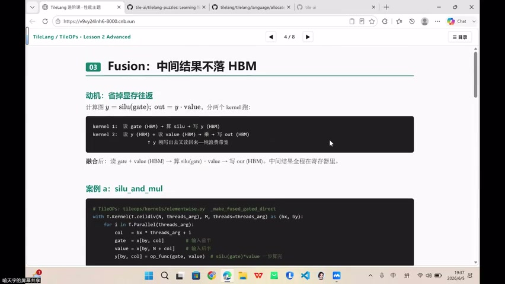
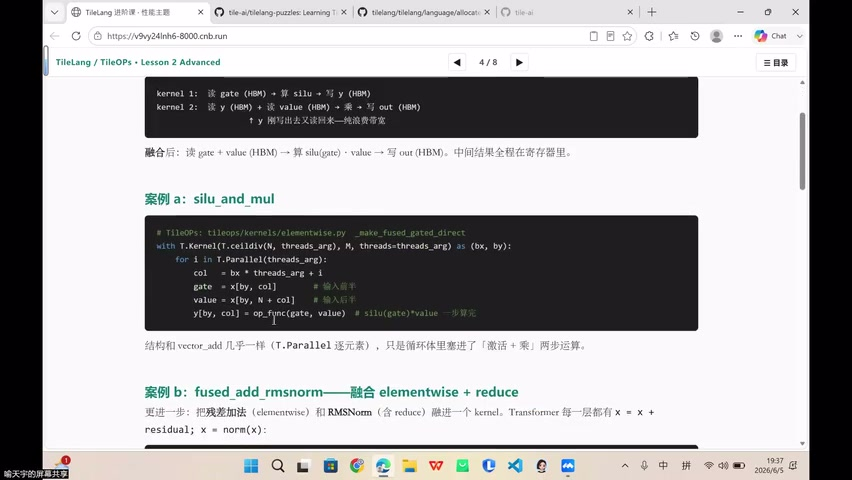
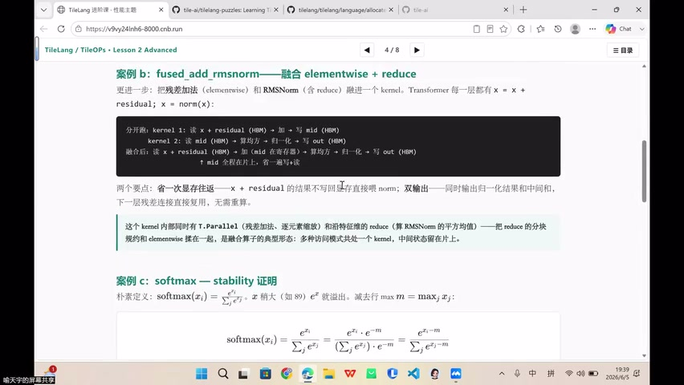
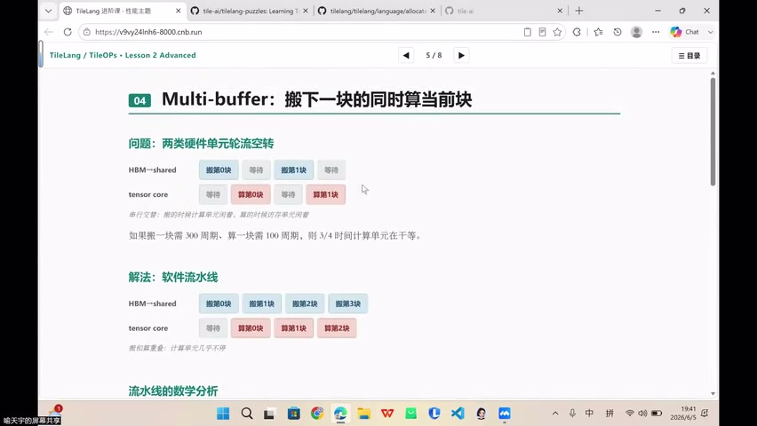
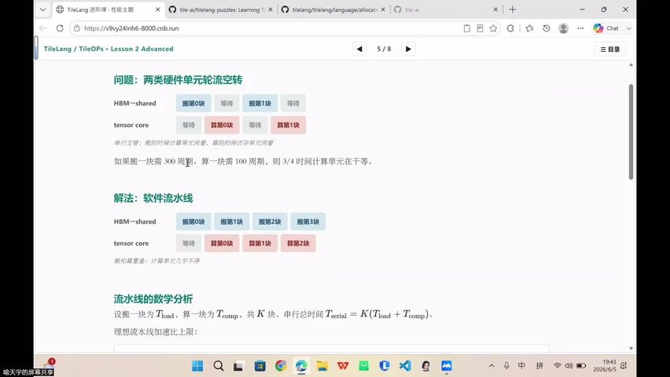
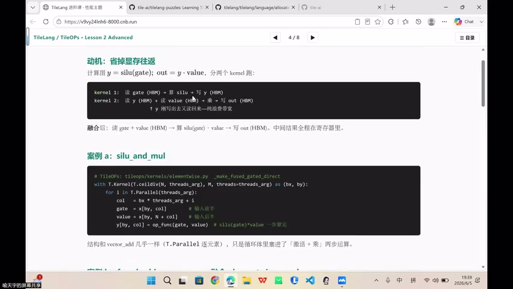
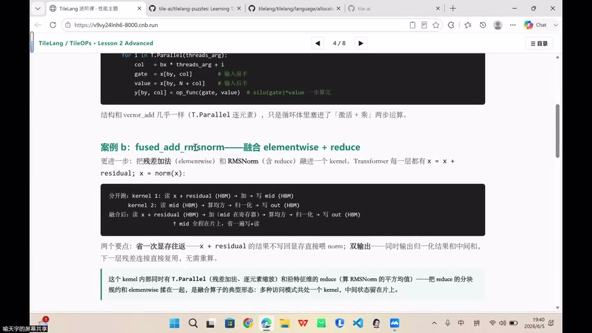

# [P40] GPU算子性能优化 - 算子融合与Multi-Buffering流水线

> **演讲者**：喻天宇  
> **日期**：2026年6月5日  
> **活动**：TileLang Puzzle 算子开发实战营 第五课（下）  

---

## 一、Bank 与 Bank Conflict



### 什么是 Bank

Shared memory 硬件上被分成多个 **bank**（通常 32 个），每个 bank 每周期只能服务一次访问。

### Bank Conflict

同一 warp 内多个线程**同时访问同一 bank 的不同地址** → 被迫串行化 → 性能下降。

> Bank conflict 与后续讲的 Layout、Swizzle、compute-bound 算子优化直接相关。

---

## 二、SRAM 层次：L1 Cache + Shared Memory



SRAM（片上静态随机存储器）分为两部分：

| 组件 | 特点 |
|------|------|
| **L1 Cache** | 硬件自动管理，对程序员透明 |
| **Shared Memory** | 程序员显式分配，CTA 内线程共享 |

- 两者共享同一块物理 SRAM，比例可配置
- 尽量减少 L1 cache 占用，把更多 SRAM 留给 shared memory
- 每个 SM 的 shared memory 有限（~200KB），影响 occupancy

---

## 三、Shared Memory 的三个关键语义



### 1. Scope（作用范围）

- Shared memory 在 **CTA（block）内** 共享
- 不同 CTA 之间**不能**直接访问彼此的 shared memory
- 即使两个 CTA 驻留在同一个 SM 上

### 2. Lifetime（生命周期）

- CTA 启动时从 shared memory 池分配一块
- CTA 结束时**释放**
- 类似 Rust 的所有权/生命周期概念

### 3. Synchronization（同步）

- 线程写完 shared memory 后，其他线程需要读取正确值
- 必须通过 `__syncthreads()` 同步
- TileLang 的 `T.copy`、`T.gemm`、`T.reduce`、`T.pipeline` 等 API 在编译时**自动插入**必要的同步

---

## 四、Occupancy 与 Shared Memory 的权衡



- 一个 SM 同时能驻留多少活跃 CTA/warp → **occupancy（占用率）**
- Shared memory 用得越多 → 同一 SM 能驻留的 CTA 越少 → occupancy 下降
- Multi-buffering 需要多份 shared buffer → 进一步挤压 occupancy
- 需要在**延迟隐藏**（多 buffer）和 **occupancy**（多 CTA）之间权衡

---

## 五、Layout：逻辑下标 → 物理地址



软件写的是逻辑下标：`A_shared[i, k]`

硬件看到的是物理地址，中间隔一层 **layout** 映射：
- Row-major / Column-major
- Swizzle 布局（避免 bank conflict）
- Padding（填充对齐）

> Layout 不改变计算结果，只影响访问性能。后续进阶课详讲 Swizzle 和 Padding。

---

## 六、算子融合案例：silu_and_mul



### 动机：减少显存往返

计算图：`y = silu(gate); out = y * value`

**朴素写法（两个 kernel）**：
```
kernel 1: 读 gate (HBM) → 算 silu → 写 y (HBM)
kernel 2: 读 y (HBM) + 读 value (HBM) → 乘 → 写 out (HBM)
```
y 被推出又读回来——**纯浪费带宽**。

**融合后（一个 kernel）**：
```
读 gate + value (HBM) → 算 silu(gate) * value → 写 out (HBM)
```
中间结果全程在**寄存器**里。

### TileLang 实现

```python
with T.Kernel(T.ceildiv(N, threads), M, threads=threads) as (bx, by):
    for i in T.Parallel(threads):
        col = bx * threads + i
        gate = x[by, col]          # 输入信号
        value = x[by, N + col]     # 输入后半
        y[by, col] = silu(gate) * value  # 一步算完
```

> 结构和 vector_add 几乎一样（T.Parallel 逐元素），只是循环体里塞进了「激活 + 乘」两步运算。

---

## 七、分块矩阵乘法与数据复用



分块矩阵公式：C = A × B，其中 A(M×K)、B(K×N)、C(M×N)

- A 分成 A₁, A₂, A₃... 子块
- B 分成 B₁, B₂, B₃... 子块
- 每个子块在乘法中**反复复用** → 放 shared memory
- 计算在 register 中完成
- 这就是 GEMM tiling 的核心思想

---

## Key Terms

| 术语 | 含义 |
|------|------|
| Bank | Shared memory 的硬件分区，每周期服务一次访问 |
| Bank Conflict | 同 warp 多线程访问同一 bank 导致串行化 |
| SRAM | 片上静态 RAM = L1 Cache + Shared Memory |
| Scope | 数据可见范围（CTA 内 / 线程私有） |
| Lifetime | 数据生命周期（CTA 启动→结束） |
| Occupancy | SM 上活跃 CTA/warp 的占比 |
| Layout | 逻辑下标到物理地址的映射 |
| Fusion | 多算子合并为一个 kernel，中间值留寄存器 |
| Tiling | 分块矩阵，子块放 shared memory 复用 |
