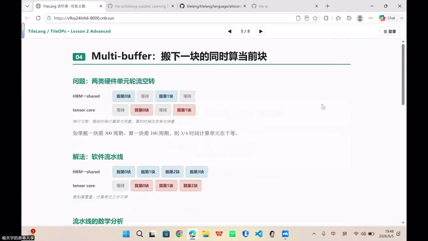
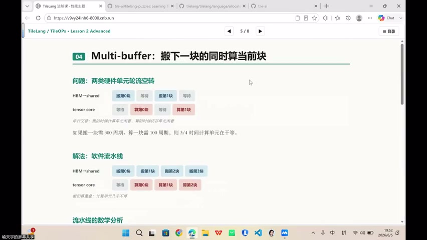
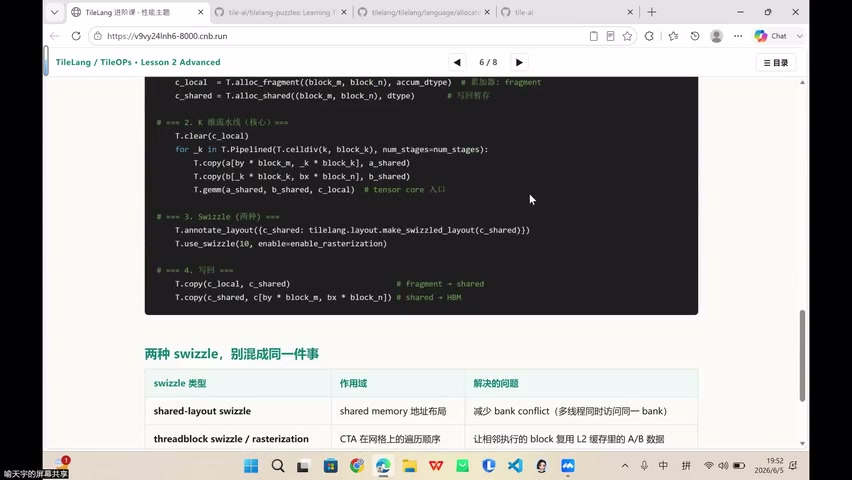
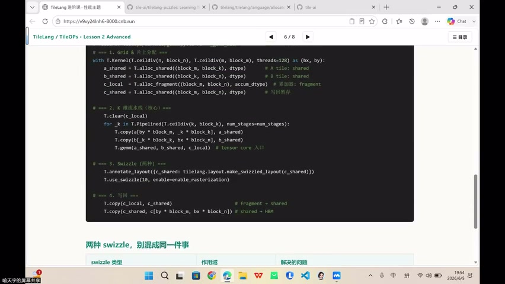

# [P41] GPU算子性能优化 - 课程总结与答疑（Bank Conflict 深入）

> **演讲者**：喻天宇  
> **日期**：2026年6月6日  
> **活动**：TileLang Puzzle 算子开发实战营 第五课 总结与补充  

---

## 一、Bank 的定义与映射



### 什么是 Bank

Shared memory 内部被切成多个可**并行服务**的分片（bank）。NVIDIA 典型配置：

- **32 个 bank**，每个 bank 宽 4 bytes（一个 float/int）
- 地址映射：`bank_id = (address / sizeof(dtype)) % 32`

### Row-major vs Column-major 的 Bank 映射

以 4×4 矩阵、4 个 bank 为例：

**Row-major**：A00→bank0, A01→bank1, A02→bank2, A03→bank3, A10→bank0...
- 按行访问时，每行元素分散在不同 bank → **无 conflict**

**Column-major**：A00→bank0, A10→bank0, A20→bank0, A30→bank0...
- 按列访问时，同一列元素全在 bank0 → **严重 conflict**

> GPU 不关心矩阵是行优先还是列优先——两种访问模式都可能出现，必须都检查。

---

## 二、Bank Conflict 的本质



### 冲突条件

同一 warp 内多个 **lane（线程）** 同时访问**同一 bank 的不同地址** → 硬件被迫串行化（排队）。

### 三种情况对比

| 场景 | 结果 |
|------|------|
| 多个 lane → 同一 bank → **不同地址** | **Bank Conflict**（排队） |
| 多个 lane → 同一 bank → **同一地址** | **Broadcast**（硬件广播，无冲突） |
| 多个 lane → **不同 bank** | **并行执行**（理想情况） |

> Broadcast 和 bank conflict 是两码事：同地址可以广播分发，不同地址才需要排队。

---

## 三、Padding：最朴素的解决方案



### 原理

在每行末尾多加一个元素（如 32 列 → 33 列），使下一行的起始 bank 错开：

```
原始: 行0→bank 0,1,2,3 | 行1→bank 0,1,2,3  ← 列访问全撞 bank0
Padding: 行0→bank 0,1,2,3,X | 行1→bank 1,2,3,0,X  ← 错开了
```

### 三种 Padding 的区别

| 类型 | 目的 | 例子 |
|------|------|------|
| **Layout Padding** | 避免 bank conflict | shared memory 32→33 列 |
| **Boundary Padding** | 处理分块尾块越界 | reduce 时补齐非整除部分 |
| **Alignment Padding** | 满足硬件指令对齐要求 | 128-byte 向量化搬运对齐 |

### Padding 的代价

- 多占 shared memory 容量（32×32 → 32×33）
- 降低同一 SM 可驻留的 CTA 数量 → occupancy 下降

---

## 四、Swizzle：更系统的解决方案



### 原理

通过地址低位的 **XOR 重排**，把容易撞同一 bank 的元素打散：

- 逻辑下标不变，只改变物理存放位置
- 计算结果完全不变
- 比 padding 更节省空间（不增加容量）

### TileLang 中的 Swizzle

- 编译器在生成地址时**自动使用 swizzle 映射**
- 也可通过 `T.annotate_layout` 显式标注需要的 layout
- 大部分情况下，编译器已帮用户消除了 bank conflict

---

## 五、验证 Bank Conflict：Nsight Compute


不能靠推理猜测是否有 bank conflict，必须用工具验证：

- **Nsight Compute** 中的关键指标：
  - `shared memory load/store bank conflict`
  - `replay count`
  - `wavefronts`
- 软件层面看起来有 conflict 的代码，经过编译器处理后硬件上可能已消除
- 但仍存在少数场景需要手动优化

---

## Key Terms

| 术语 | 含义 |
|------|------|
| Bank | Shared memory 的并行服务分片（通常 32 个，4B 宽） |
| Bank Conflict | 同 warp 多 lane 访问同 bank 不同地址 → 串行化 |
| Broadcast | 同 warp 多 lane 访问同 bank 同地址 → 硬件广播 |
| Padding | 加额外列/行错开 bank 映射 |
| Swizzle | XOR 地址重排，打散 bank 访问 |
| Layout Padding | 专为避免 bank conflict 的填充 |
| Alignment Padding | 满足硬件指令对齐要求的填充 |
| T.annotate_layout | TileLang 中显式标注 layout 的 API |
| Nsight Compute | NVIDIA 性能分析工具，可查 bank conflict 指标 |
