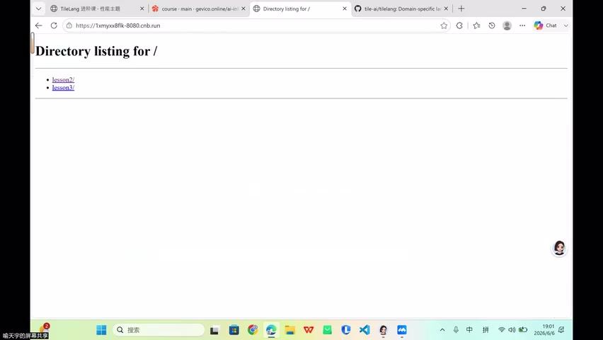
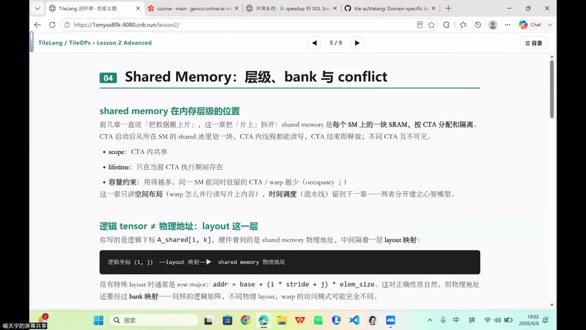
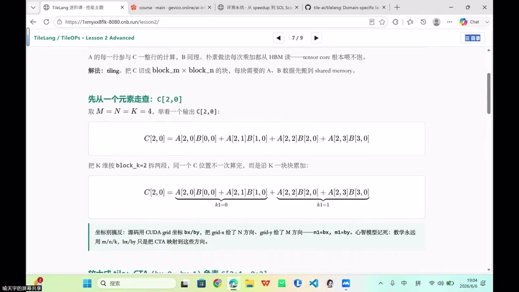
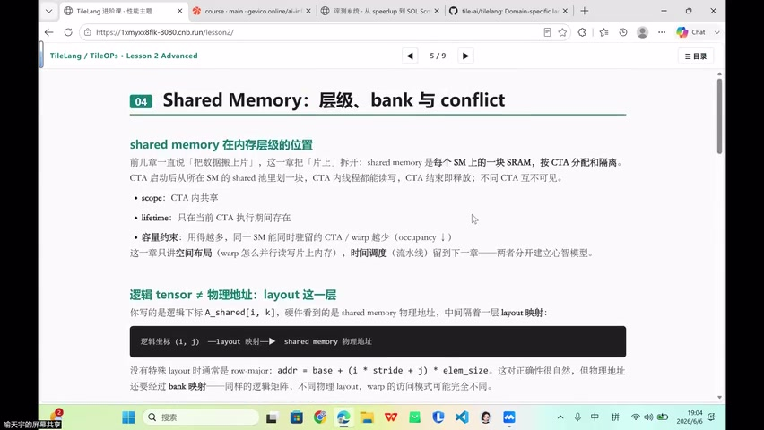
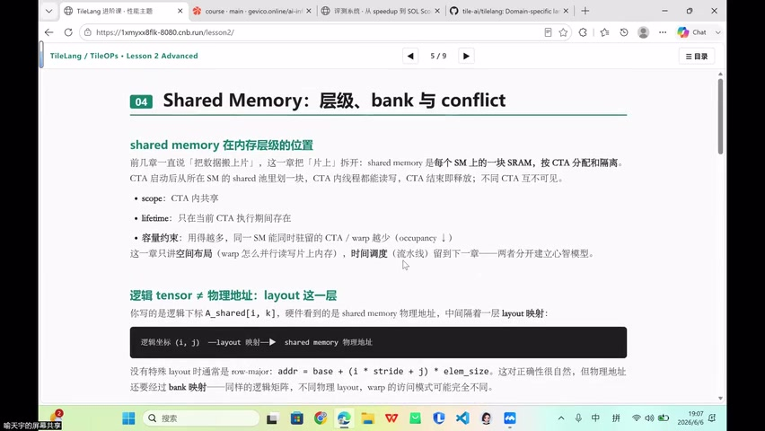
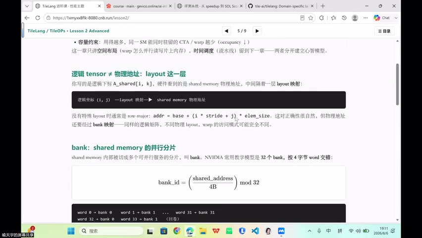

# [P42] 进阶算子开发 - 复杂算子开场·Online Softmax、Bank、SRAM Scope 与 Layout 基础

> **演讲者**：喻天宇  
> **日期**：2026年6月6日  
> **活动**：TileLang Puzzle 算子开发实战营 第六课 进阶算子开发（上）  

---

## 一、Online Softmax 的动机



### 标准 Softmax 的三次 HBM 遍历

| 循环 | 操作 | HBM 交互 |
|------|------|-----------|
| 第 1 遍 | reduce max：求每行最大值 | 读 X |
| 第 2 遍 | 对每个 tile 求局部 max → 累加到 row_sum（exp 求和） | 读 X |
| 第 3 遍 | 归一化：从 shared memory 读出 → 写回 out | 读/写 X、out |

Softmax 是典型的 **memory-bound** 算子，减少 HBM 交互次数 = 直接加速。

### 优化目标

将 3 次 HBM 遍历压缩为 **2 次**（甚至更少），核心思路：把中间状态压缩到 register/fragment 中维护。

---

## 二、SRAM 层级：为什么优先用 Shared Memory



### SRAM = L1 Cache + Shared Memory

两者共享同一块片上 SRAM，可调节分配比例。

### 为什么不能依赖 L1 Cache 命中

| 问题 | 说明 |
|------|------|
| 容量小 | 不能保证某个 tile 下次扫描时仍在 L1 |
| 替换策略 | 可能被其他 warp/CTA 的访存挤出 |
| 不可控 | 硬件自动管理，程序员无法显式控制 |

### 最佳实践

- **需要复用的数据** → 显式放入 shared memory
- **轻量状态**（max、sum 等标量）→ 保留在 register / fragment
- TileLang 中显式偏向 `T.alloc_shared` 和 `T.alloc_fragment` 路线

---

## 三、Online Softmax 的数学原理



### 分块部分和 + 缩放

以序列 `[1, 2, 5, 4]` 分两块 `[1,2]` 和 `[5,4]` 为例：

1. **第一块**：局部 max = 2，部分和 S₁ = e^(1-2) + e^(2-2) = e⁻¹ + 1
2. **第二块**：局部 max = 5，部分和 S₂ = e^(5-5) + e^(4-5) = 1 + e⁻¹
3. **合并**：全局 max 更新为 5，旧部分和需乘缩放系数：

$$S_{total} = S_1 \cdot e^{m_{old} - m_{new}} + S_2 = S_1 \cdot e^{2-5} + S_2$$

### 核心公式

每处理一个新块：
- `m_new = max(m_old, max(tile))`
- `scale = exp(m_old - m_new)`
- `S = S_old × scale + sum(exp(tile - m_new))`

> 数学上与不分块的全局 softmax 完全等价，只是把第二遍遍历压缩到 register 中的缩放操作。

---

## 四、TileLang 中的 Online Softmax 实现



### T.softmax 宏

TileLang 将 online softmax 封装为 `T.softmax` 宏，内部自动完成：
- 保留旧 max（`m_old`）
- 计算新块 max → 更新全局 max
- 通过 scale 缩放旧的部分和
- 累加新块的部分和

在 **Flash Attention** 中大量复用此模式。

---

## 五、exp2 性能技巧



### 为什么用 exp2 替代 exp

- GPU 硬件对 **2 的幂次运算**有专用电路支持（`exp2` 指令）
- `T.exp(x)` 内部可能转为 `exp2(x × log2(e))`
- 数学上等价，工程上 `T.exp2` 更快

### 转换公式

$$e^x = 2^{x \cdot \log_2 e}$$

在 TileLang 中：
- 将 `T.exp(x - max)` 改写为 `T.exp2((x - max) * log2e)`
- 硬件层面直接加速，无需额外开销

---

## 六、Shared Memory 的层级、Bank 与 Layout


### Shared Memory 特性回顾

| 属性 | 说明 |
|------|------|
| Scope | CTA 内共享 |
| Lifetime | 仅在当前 CTA 执行期间存在 |
| 容量约束 | 用得越多 → 同一 SM 驻留 CTA/warp 越少（occupancy ↓） |

### Layout：逻辑坐标 → 物理地址

```
逻辑坐标 (i, j) → Layout 映射 → shared memory 物理地址
```

- 默认 row-major：`addr = base + (i * stride + j) * elem_size`
- 同一逻辑矩阵，**不同物理 layout → 完全不同的 warp 访问模式**

### Bank：Shared Memory 的并行分片

- NVIDIA：**32 个 bank**，4-byte word 寻址
- 映射公式：`bank_id = (shared_address / 4B) mod 32`
- word 0→bank 0, word 1→bank 1, ..., word 31→bank 31, word 32→bank 0（循环）



> Layout 决定了逻辑元素落在哪个 bank——这是 bank conflict 分析的起点。

---

## Key Terms

| 术语 | 含义 |
|------|------|
| Online Softmax | 分块维护 running max/sum，减少 HBM 遍历次数 |
| Memory-bound | 性能瓶颈在访存带宽而非计算吞吐 |
| SRAM | 片上静态存储，L1 cache 和 shared memory 共享 |
| Scale（缩放系数） | exp(m_old - m_new)，用于合并不同块的部分和 |
| T.softmax | TileLang 中 online softmax 的宏封装 |
| exp2 | 以 2 为底的指数，GPU 硬件有专用加速 |
| Layout | 逻辑坐标到物理地址的映射函数 |
| Bank | Shared memory 的并行服务分片（32 个，4B 宽） |
| Occupancy | SM 上同时驻留的 CTA/warp 比例 |
