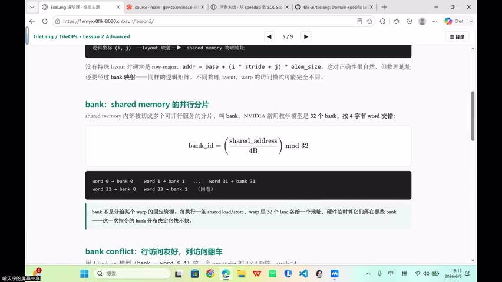
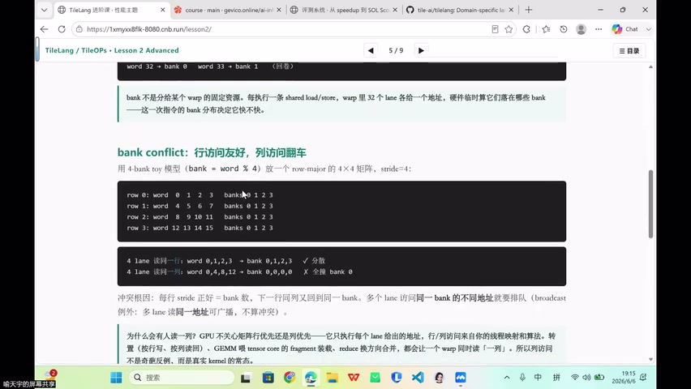
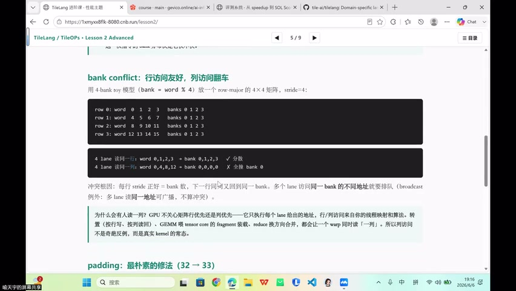
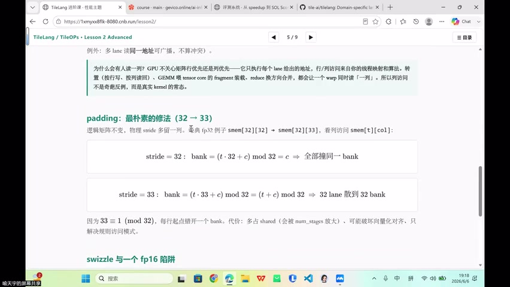
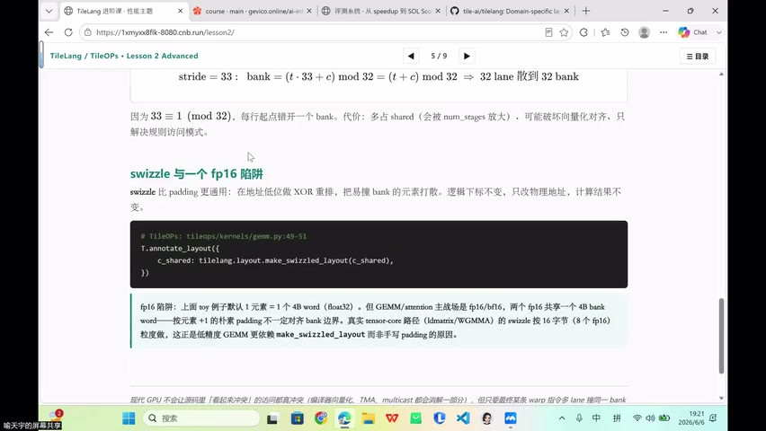

# [P43] 进阶算子开发 - Bank Conflict 详解·Padding 与 Swizzle

> **演讲者**：喻天宇  
> **日期**：2026年6月6日  
> **活动**：TileLang Puzzle 算子开发实战营 第六课 进阶算子开发（中）  

---

## 一、从 Memory-bound 到 Compute-bound：GEMM 的 Roofline 定位



### 理论与实践的差距

- GEMM 在 Roofline 模型中属于 **compute-bound** 算子
- 但初学者往往无法打满搬运带宽 → 实际仍停留在 memory-bound 区域
- 只有充分利用硬件搬运指令（向量化、pipeline 等），才能触及 compute-bound 天花板

### GEMM 的算术强度推导

| 项目 | 公式 |
|------|------|
| 搬运数据量 | (BM·BK + BK·BN) × elem_size |
| 计算量 | 2·BM·BN·BK |
| 算术强度 | 2·BM·BN·BK / [(BM·BK + BK·BN) × elem_size] |

当 BM = BN = BK = B 时：算术强度 ≈ **B / elem_size**

- FP16 (2B)，B=128 → 强度 ≈ 64 FLOP/Byte → 远超 Roofline 拐点 → compute-bound

### 混合精度策略

- **计算**用 FP32 → 保证推理精度
- **存储/搬运**用 FP16 → 降低带宽压力

---

## 二、GEMM 分块的数学表达



### 分块索引

以 M=N=K=4、block_size=2 为例，C 分成 4 个 2×2 块：

```
C[m1, n1] = Σ_k1  A[m1, k1] · B[k1, n1]
```

全局索引还原：
- `m = m1 × BM + m0`（m1 = 第几块，m0 = 块内行）
- `n = n1 × BN + n0`
- `k = k1 × BK + k0`

### 数据复用

- A 的同一行块被 **所有 N 方向的块**复用
- B 的同一列块被 **所有 M 方向的块**复用
- → 必须搬入 shared memory 进行片上复用

---

## 三、Bank Conflict 详解：行友好、列翻车



### 4-Bank 玩具模型

`bank = word % 4`，row-major 4×4 矩阵（stride=4）：

```
row 0: word  0  1  2  3  → bank 0 1 2 3
row 1: word  4  5  6  7  → bank 0 1 2 3
row 2: word  8  9 10 11  → bank 0 1 2 3
row 3: word 12 13 14 15  → bank 0 1 2 3
```

### 两种访问模式

| 访问模式 | 地址 | Bank 分布 | 结果 |
|----------|------|-----------|------|
| 4 lane 读同一**行** | word 0,1,2,3 | bank 0,1,2,3 | 并行 |
| 4 lane 读同一**列** | word 0,4,8,12 | bank 0,0,0,0 | **全部冲突** |

### 冲突根源

每行 stride 恰好 = bank 数 → 下一行同列元素回到同一 bank。

### 为什么列访问是常态

> GPU 不关心矩阵行优先还是列优先——它只执行每个 lane 给出的地址。

真实 kernel 中列访问场景：
- **转置**：按行写、按列读
- **GEMM**：tensor core 的 fragment 装载
- **Reduce**：换方向合并

---

## 四、Padding：最朴素的修法（32 → 33）



### 原理

```
stride = 32: bank = (r·32 + c) mod 32 = c        → 列访问全撞同一 bank
stride = 33: bank = (r·33 + c) mod 32 = (r+c) mod 32 → 32 lane 散到 32 bank
```

因为 **33 ≡ 1 (mod 32)**，每行起始 bank 错开 1 → 列访问完美分散。

### 代价

- 多占 shared memory（32×32 → 32×33）
- 可能降低 occupancy

---

## 五、Swizzle 与 FP16 陷阱



### Swizzle 原理

通过 XOR 地址重排，将逻辑上会撞 bank 的元素打散到不同物理位置：
- 不增加容量（优于 padding）
- 逻辑下标不变，计算结果不变

### TileLang 中的使用

```python
T.annotate_layout({
    A_shared: T.Layout(..., swizzle="row_xor")  
})
```

### FP16 陷阱

- FP16 元素只有 2 字节 → 两个元素共享一个 4B bank slot
- 需要特殊的 swizzle 模式处理半精度的 bank 映射

---

## 六、TileLang GEMM 实现流程


### 数据搬运路径

```
HBM (global) → Shared Memory → Register/Fragment → 计算 → Shared → HBM
```

### 关键步骤

1. **创建 shared tensor**：`A_shared = T.alloc_shared([BM, BK], dtype)`
2. **Pipeline 搬运**：`T.copy(A[...], A_shared)` + `num_stage` 多缓冲
3. **Swizzle 标注**：`T.annotate_layout` 消除 bank conflict
4. **片上计算**：`T.gemm(A_shared, B_shared, C_local)` → 调 API 完成矩阵乘
5. **写回**：local → shared → HBM
6. **Thread block swizzle**：相邻 block 复用 L2 cache 中的 A/B 数据

> 在 TileLang 中不需要手写 GEMM 循环——只需管理分块、搬运和 layout，计算交给 `T.gemm`。

---

## Key Terms

| 术语 | 含义 |
|------|------|
| Compute-bound | 性能瓶颈在计算吞吐而非访存带宽 |
| 算术强度 | 计算量 / 搬运量（FLOP/Byte） |
| 分块（Tiling） | 将大矩阵切成 block，利用片上存储复用数据 |
| Bank Conflict | 同 warp 多 lane 访问同 bank 不同地址 → 串行化 |
| Padding (32→33) | 每行多填一列，错开 bank 映射 |
| Swizzle | XOR 地址重排，无额外空间开销的 bank 打散 |
| T.gemm | TileLang 中片上矩阵乘的 API |
| Thread Block Swizzle | 调整 block 调度顺序以复用 L2 cache |
| Mixed Precision | FP32 计算 + FP16 存储，兼顾精度与带宽 |
