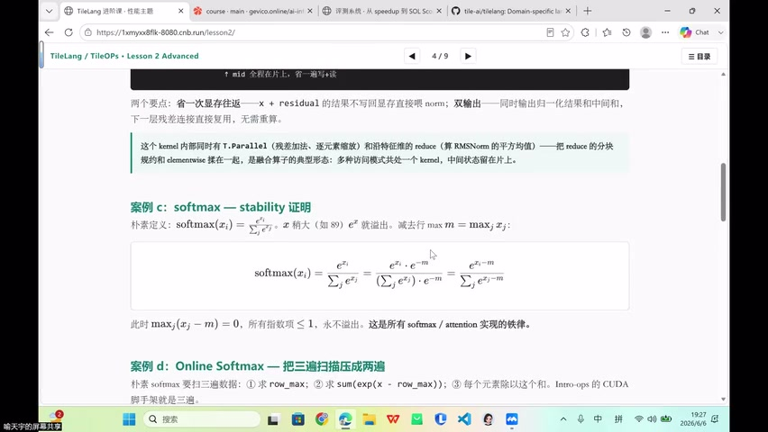
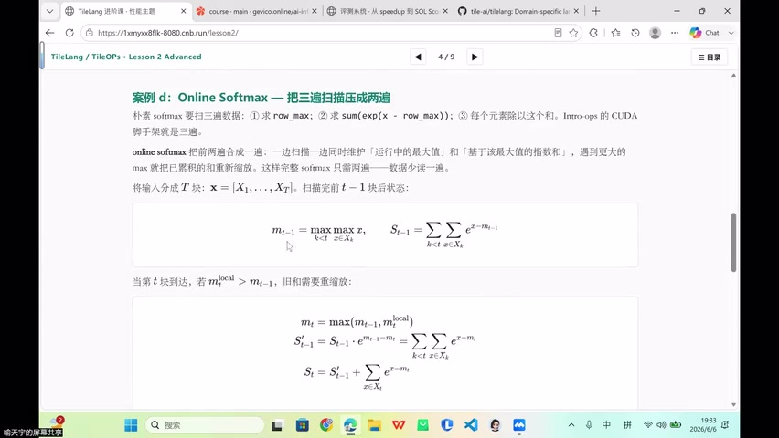
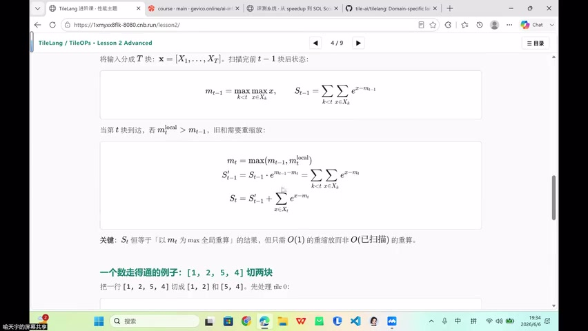
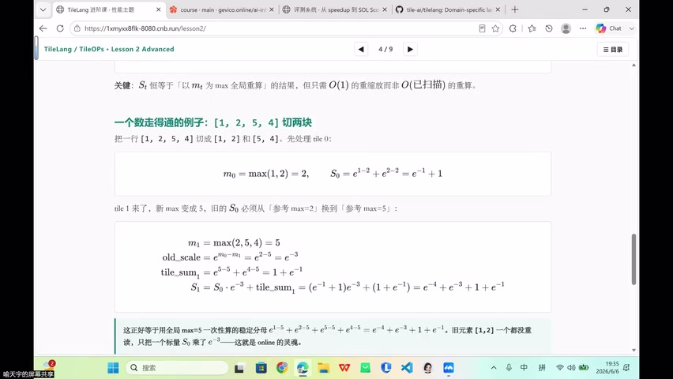
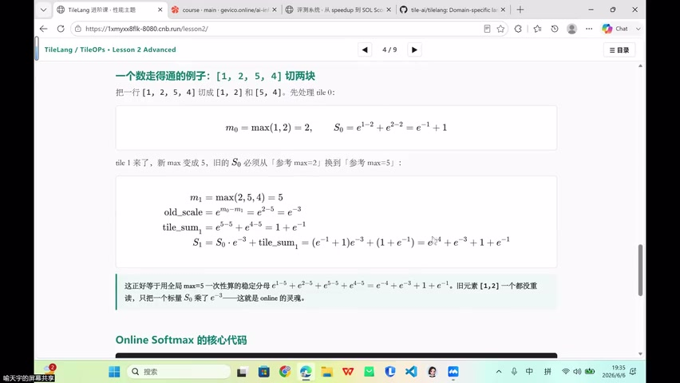
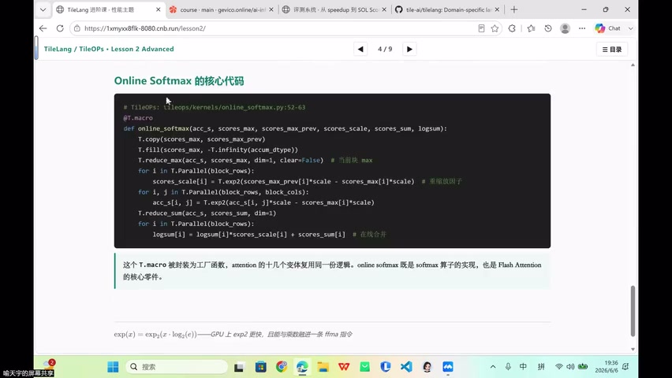

# [P44] 进阶算子开发 - Fused MoE GEMM、Autotune 与项目预告

> **演讲者**：喻天宇  
> **日期**：2026年6月6日  
> **活动**：TileLang Puzzle 算子开发实战营 第六课 进阶算子开发（下）  

---

## 一、Fused MoE GEMM



### MoE 工作流

1. 输入 token 序列（token0, token1, token2, token3）
2. **Router（Top-K）**：为每个 token 选出 K 个 expert
3. 按 expert 对 token 行做**重排序** → 形成矩阵 A
4. 每个 expert 有自己的权重 → 排序后形成矩阵 B
5. 执行 A × B 分块矩阵乘

### 示例（4 token、3 expert、top-2）

| Token | 分配的 Expert |
|-------|--------------|
| token0 | expert2, expert0 |
| token1 | expert0, expert1 |
| token2 | expert2, expert1 |
| token3 | expert0, expert2 |

每个 expert 拿到的 token 行**原本不连续** → 重排后可连续读取。

### 优化要点

- **重排**：将分散的 token 行聚合，使每个 expert 的 GEMM 访存连续
- **融合**：多个 expert 的小 GEMM → 合并为一个更大的 kernel
- **Dead CTA 早退**：
  - launch 前无法确定实际需要多少 CTA（取决于路由结果）
  - 多 launch CTA，运行时无任务的 CTA 立即退出
  - 避免 CPU 等待 GPU

---

## 二、GEMM 计算与 Swizzle



### TileLang GEMM 核心调用

```python
T.gemm(A_shared, B_shared, C_local)  # 片上矩阵乘 → tensor core 加速
```

### Layout 标注

```python
T.annotate_layout({
    A_shared: T.Layout(..., swizzle="spatial")  
})
```

- 指定 swizzle layout → 避免 bank conflict
- NVIDIA 上走 **tensor core** 加速矩阵乘

---

## 三、算子融合：SiLU-and-Mul



### MoE 中的融合场景

MoE 流水线中相邻的两个 elementwise 算子：
- **SiLU**（激活函数）
- **Mul**（逐元素乘）

融合为 `silu_and_mul` → 减少 kernel 启动次数，中间结果留在 register。

---

## 四、Pipeline 与 num_stage



### num_stage 的含义

| num_stage | 效果 | 说明 |
|-----------|------|------|
| 0 或 1 | 无 pipeline / 兜底配置 | 搬完再算 |
| 2 | **Double buffer** | 算当前块时搬下一块 |
| 3+ | 更深 pipeline | 更长的 overlap，隐藏更多延迟 |

### 约束

- num_stage 越大 → 占用 shared memory 越多
- SM 上 SRAM 有限 → 不能无限增加 stage
- 最优值取决于 shape、dtype、硬件 SRAM 容量

---

## 五、Autotune：自动搜索最优配置



### 为什么需要 Autotune

- 分块大小（BM、BN、BK）
- num_stage
- 线程数

这些参数**没有放之四海而皆准的最优值**，随 shape / dtype / 硬件变化。

### 工作方式

1. 定义搜索空间（所有可能的配置组合）
2. 组合数学计算候选数量
3. 自动逐一尝试（编译 → 运行 → 计时）
4. 选取当前最优配置

> 本质：把人工"32不行试64、stage2不行试3"的过程自动化。

---

## 六、项目预告



### 方向一：NanoLLM 算子替换

- 将 LLM 推理中的 PyTorch 算子替换为 TileLang 手写算子
- 集成到 **vLLM** 推理引擎
- 需要实现的算子：
  - Fused Add + RMSNorm
  - RoPE（旋转位置编码）
  - SiLU-and-Mul
- Flash Attention → 直接调用现有库（不强制手写）
- 输入 safetensor 权重 → 输出推理结果

### 方向二：MC Perfume 性能分析

- 使用沐曦 MC Perfume 工具进行算子性能分析
- 自己写 GEMM 算子 → benchmark → 观察加速效果

### 实现要求

- 理想情况：CUDA + MUSA + TileLang 三种实现
- 最低要求：TileLang 实现

---

## Key Terms

| 术语 | 含义 |
|------|------|
| MoE (Mixture of Experts) | 混合专家模型，token 路由到不同 expert |
| Top-K Router | 为每个 token 选出 K 个最相关的 expert |
| Dead CTA | 无任务的多余 CTA，通过早退机制释放资源 |
| T.gemm | TileLang 片上矩阵乘 API（走 tensor core） |
| silu_and_mul | SiLU 激活 + 逐元素乘的融合算子 |
| num_stage | Pipeline 深度，控制多缓冲的 buffer 数量 |
| Autotune | 自动搜索最优配置（分块、stage、线程数等） |
| MC Perfume | 沐曦性能分析工具 |
| vLLM | 高效 LLM 推理引擎 |
