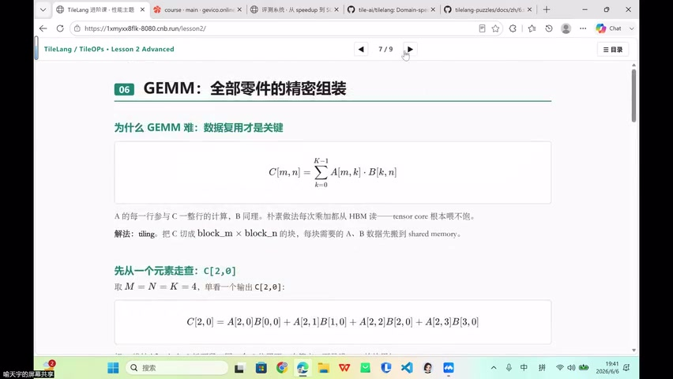
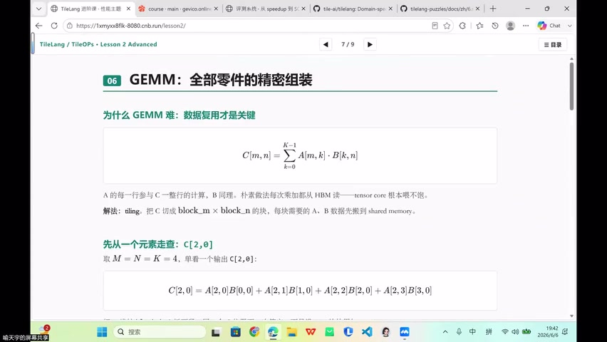
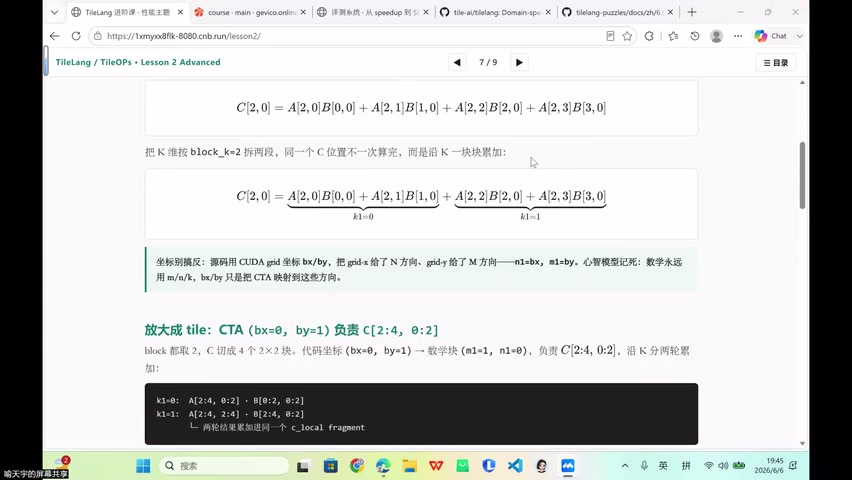
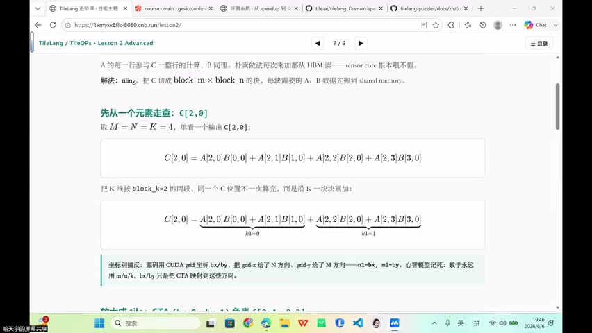
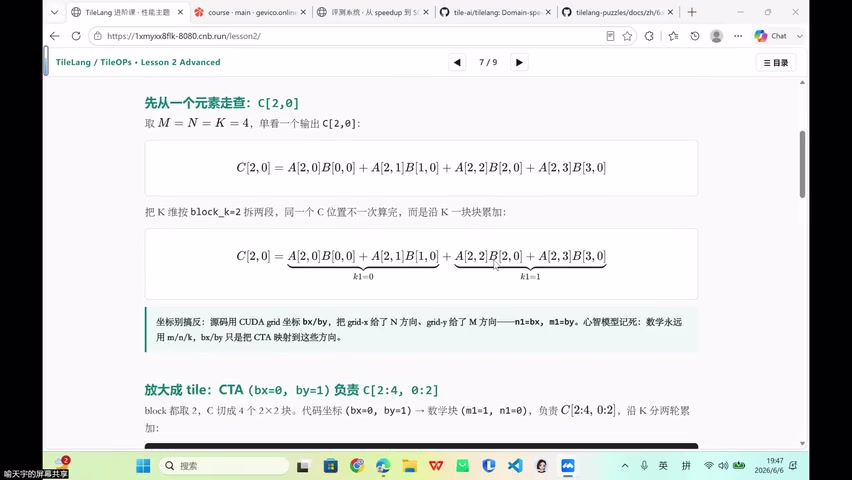
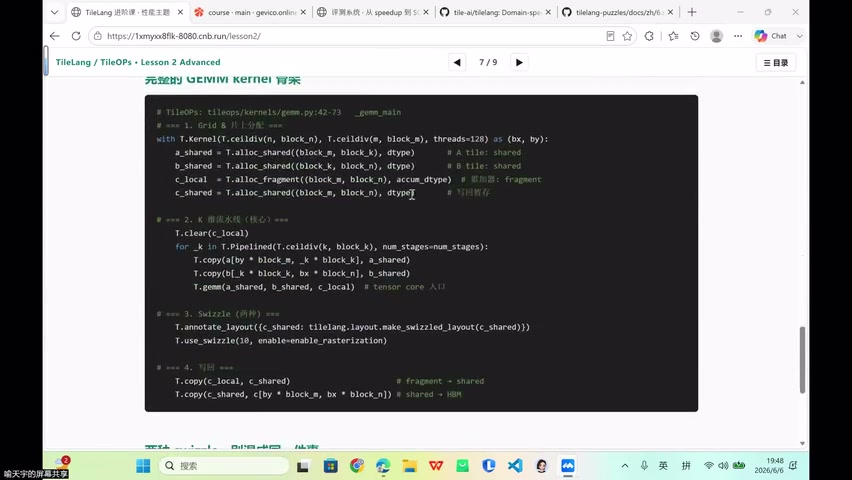

# [P45] 算子性能调优 - 导论·Task6 目标、性能分析方法论与 MC Tracer

> **演讲者**：周雨涵（沐曦）  
> **日期**：2026年6月10日  
> **活动**：TileLang Puzzle 算子开发实战营 第七课 算子性能调优（上）  

---

## 一、Task6 目标



在 **MetaX C500** 上建立一套可落地的算子调优方法，跑成**可复现的闭环**：

- 不只是跑 benchmark
- 采用 **MC Tracer**（沐曦版 NCU）进行性能分析
- 输出：benchmark + trace + PPT/Markdown 报告

---

## 二、三类算子覆盖



| 算子 | 定位 | 暴露的问题 |
|------|------|-----------|
| **GEMM** | 基础调参闭环 | tile/threads/shared memory/register 的影响 |
| **Flash Attention** | Attention 类样本 | mask + online softmax + 两次 GEMM → 数值稳定性 |
| **Paged Attention Decode** | 真实业务 kernel | 分页 KV cache + GQA head 分组 → 边界正确性 |

> 从简单到复杂：纯矩阵乘 → attention（softmax+mask）→ 分页访问（操作系统思想）

---

## 三、MetaX C500 硬件约束



### 关键参数

| 参数 | C500 值 | NVIDIA 对应 |
|------|---------|-------------|
| Wavefront size | **64** | Warp = 32 |
| 计算单元 | ~104 AP | SM |
| Work group 最大 | 1024 threads | Block 最大 1024 |
| Group memory | **64 KB** | Shared memory |

### 术语映射

| NVIDIA | MetaX |
|--------|-------|
| Warp | Wavefront |
| SM | AP |
| Shared Memory | Group Memory |
| NCU | MC Tracer |

### 关键约束示例

某个 GEMM 配置需要 **98 KB** shared memory → 超过 C500 的 64 KB 限制 → 该配置直接失败。

---

## 四、性能分析工具：MC Tracer



### 可获取的指标

- Grid / Block 配置
- Register 使用量
- Shared memory 分配
- Runtime overhead

### 与 NCU 的差异

- MC Tracer **没有** NCU 那样细粒度的 warp stall breakdown
- 不能硬套 NCU 教程中的指标名称
- 优先使用当前工具可落地的指标
- 后续若拿到 counter profiler，再建立 memory/cache/stall 分析

---

## 五、三层评估指标体系



| 层级 | 内容 | 工具 |
|------|------|------|
| **正确性** | 所有候选 kernel 必须有 max diff + 失败原因 | 数值对比 |
| **性能** | GEMM: TFLOPS；Attention: 有效吞吐 | TileLang profiler (unit benchmark) |
| **Trace 解释** | Grid/block、Register、Shared memory、overhead | MC Tracer |

---

## 六、GEMM Kernel 结构回顾（TileLang）



```python
# ① Grid & Block
with T.Kernel(T.ceildiv(n, block_n), T.ceildiv(m, block_m), threads=128) as (bx, by):
    a_shared = T.alloc_shared([block_m, block_k], "float16")   # A tile: shared
    b_shared = T.alloc_shared([block_k, block_n], "float16")   # B tile: shared
    c_local  = T.alloc_fragment([block_m, block_n], "float32") # 累加: fragment
    c_shared = T.alloc_shared([block_m, block_n], "float16")   # 写回暂存

    # ② K Loop (核心)
    T.clear(c_local)
    for _k in T.Pipelined(T.ceildiv(k, block_k), num_stage=2):
        T.copy(A[by*block_m, _k*block_k], a_shared)   # HBM → shared
        T.copy(B[_k*block_k, bx*block_n], b_shared)   # HBM → shared
        T.gemm(a_shared, b_shared, c_local)            # tensor core

    # ③ Swizzle
    T.annotate_layout({a_shared: ..., b_shared: ...})
    T.use_swizzle(block_size=128)   # thread block rasterization

    # ④ Write Back
    T.copy(c_local, c_shared)        # fragment → shared
    T.copy(c_shared, C[by*block_m, bx*block_n])  # shared → HBM
```

---

## Key Terms

| 术语 | 含义 |
|------|------|
| MetaX C500 | 沐曦 GPU，64KB group memory，wavefront=64 |
| MC Tracer | 沐曦性能分析工具（类 NCU） |
| Wavefront | MetaX 术语，等价于 NVIDIA Warp（但宽度 64） |
| AP | MetaX 计算单元，等价于 NVIDIA SM |
| Group Memory | MetaX 术语，等价于 Shared Memory |
| TFLOPS | 每秒万亿次浮点运算，GEMM 性能指标 |
| Paged Attention | 分页 KV cache 的 attention decode kernel |
| GQA | Grouped Query Attention，head 分组 |
| num_stage | Pipeline 深度（double buffer = 2） |
