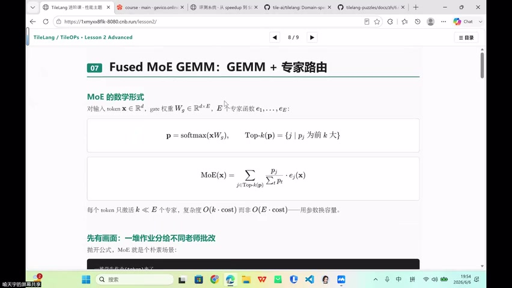
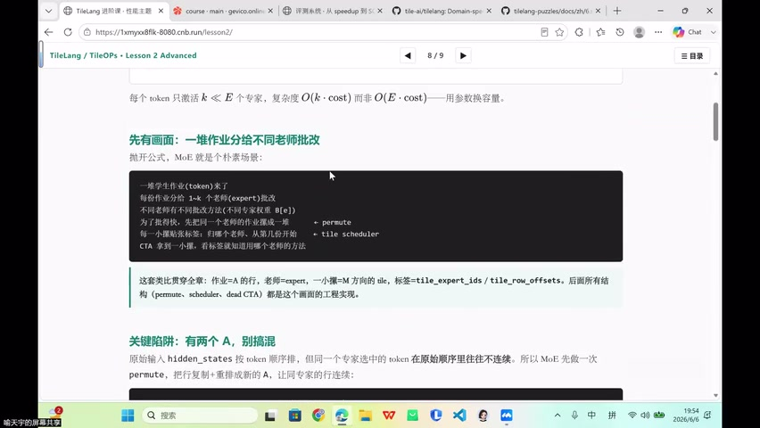
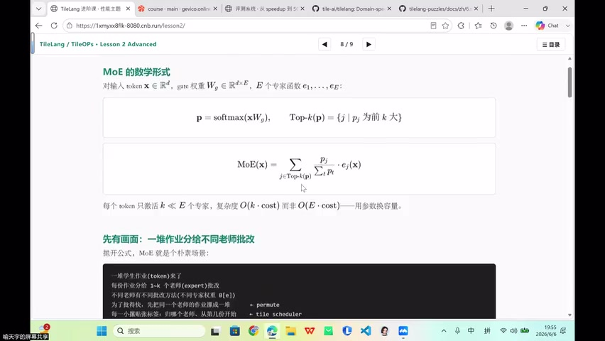
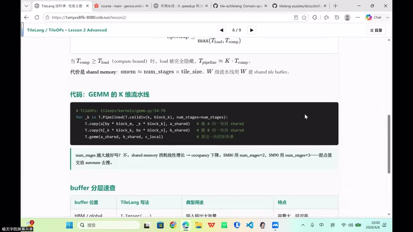
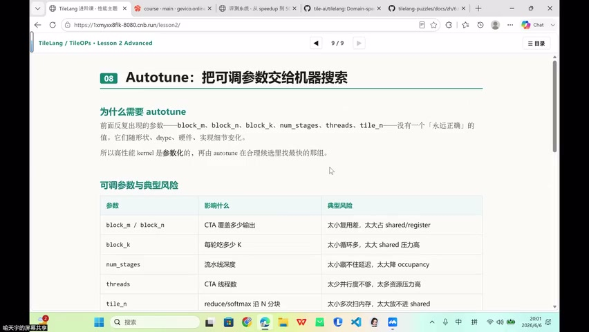
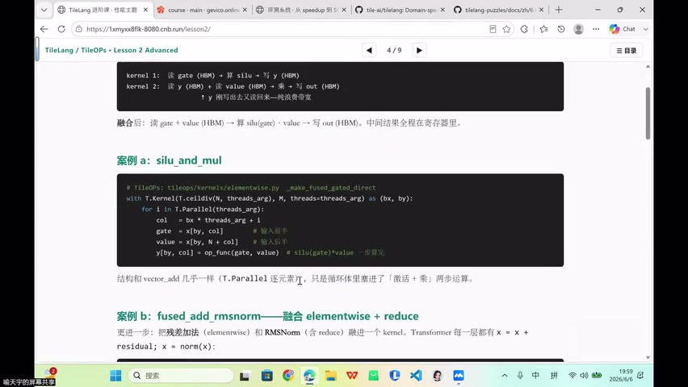

# [P46] 算子性能调优 - GEMM 实现与调优实验

> **演讲者**：周雨涵（沐曦）  
> **日期**：2026年6月10日  
> **活动**：TileLang Puzzle 算子开发实战营 第七课 算子性能调优（中）  

---

## 一、GEMM 核心代码与调参旋钮



### 标准 TileLang GEMM 结构

每个 program block 负责一个 `block_m × block_n` 的输出块：
- A、B 从 global memory → shared memory
- `T.gemm` 在 shared memory tiles 上做矩阵乘
- 结果累加到 fragment → 写回 C

### 核心调参旋钮

| 参数 | 影响的资源 |
|------|-----------|
| block_m, block_n, block_k | Shared memory 大小 |
| num_stage (pipeline) | Shared memory × stage 倍数 |
| threads | 寄存器压力 + 调度 |

- `T.alloc_shared` → shared memory (group memory) 压力
- `T.alloc_fragment` → register 压力
- pipeline stage 会**成倍放大** shared memory 需求

---

## 二、Async Copy 实验



### T.macos_async_copy

将普通 `T.copy` 替换为 MetaX 上的异步拷贝 + barrier 配合：
- 目标：隐藏访存延迟（copy 与 compute overlap）

### 实验结论

| 配置 | 耗时 |
|------|------|
| Sync + stage 2 | 0.464 ms |
| Async + stage 2 | 0.494 ms |

> **Async copy 在本案中没有带来收益**。原因：barrier 成本 + overlap 不充分 → 反而变慢。

---

## 三、Swizzle 实验



### T.use_swizzle

改变 block 的调度排布（rasterization 方向），改善数据局部性。

- 不改变数值结果（纯性能优化）
- 需要与 pipeline stage **联合测试**（共同影响 shared memory 复用）

### 实验结论

Swizzle 收益明显：0.464 ms → **0.366 ms**（本次 GEMM 最佳）

---

## 四、Tile Sweep 结果



### 最佳配置

**128×128×32 + threads=256 + swizzle + stage 2** → **34.7 TFLOPS**

### 失败案例

128×128×64 + threads=128 → **launch 失败**
- 原因：block_k 从 32→64，A/B/C shared memory 增大
- 叠加 pipeline stage → 实际需要 **98 KB** > C500 的 **64 KB** 限制
- 不是数值错误，是硬件资源超限

> 失败配置也是有价值的信息——暴露硬件约束边界。

### Stage 3 反而更慢

Stage 3 + swizzle 性能不如 stage 2 + swizzle → pipeline 不是越深越好（资源 + 同步成本）。

---

## 五、GEMM 调优四条规则



| # | 规则 |
|---|------|
| 1 | 当前 shape 下 **stage 2 + swizzle** 是最优组合 |
| 2 | block_k + stage 会放大 shared memory 压力，可能直接导致 launch 失败 |
| 3 | threads 选择影响性能：256 + swizzle 优于 128 + swizzle |
| 4 | Async copy 不是默认收益，需结合 barrier 成本和 overlap 充分性判断 |

---

## 六、算子融合案例



### 案例 a：silu_and_mul

**融合前**（两个 kernel）：
1. gate (HBM) → 算 silu → 写 y (HBM)
2. y (HBM) + value (HBM) → 乘 → 写 out (HBM)

**融合后**（一个 kernel）：
- 读 gate + value (HBM) → 算 silu(gate) × value → 写 out (HBM)
- 中间结果**全程在寄存器**，省去 y 的 HBM 往返

```python
with T.Kernel(T.ceildiv(N, threads), M, threads=threads) as (bx, by):
    for i in T.Parallel(threads):
        col = bx * threads + i
        gate = x[by, col]
        value = x[by, N + col]
        y[by, col] = silu(gate) * value  # 一步算完
```

### 案例 b：fused_add_rmsnorm

将残差加法（elementwise）+ RMSNorm（含 reduce）融合为一个 kernel：
- Transformer 每层都有 `x = x + residual; x = norm(x)`
- 融合后减少一次 HBM 读写

---

## Key Terms

| 术语 | 含义 |
|------|------|
| Tile Sweep | 遍历不同 tile 配置组合，找最优 |
| Async Copy | 异步数据搬运，与计算 overlap |
| T.use_swizzle | 改变 block 调度排布（rasterization） |
| Launch 失败 | 资源超限（shared memory 等）导致 kernel 无法启动 |
| silu_and_mul | SiLU 激活 + 逐元素乘的融合 kernel |
| fused_add_rmsnorm | 残差加 + RMSNorm 融合 kernel |
| TFLOPS | 每秒万亿次浮点运算 |
| Barrier | 线程同步原语，async copy 需配合使用 |
