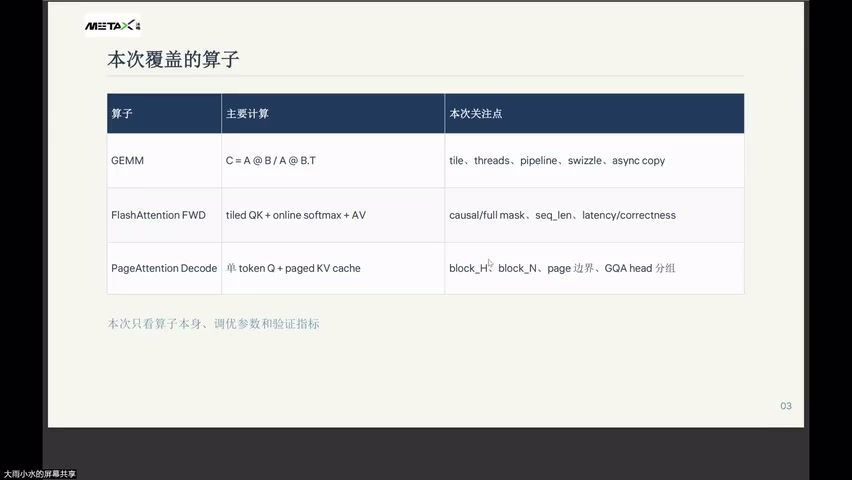
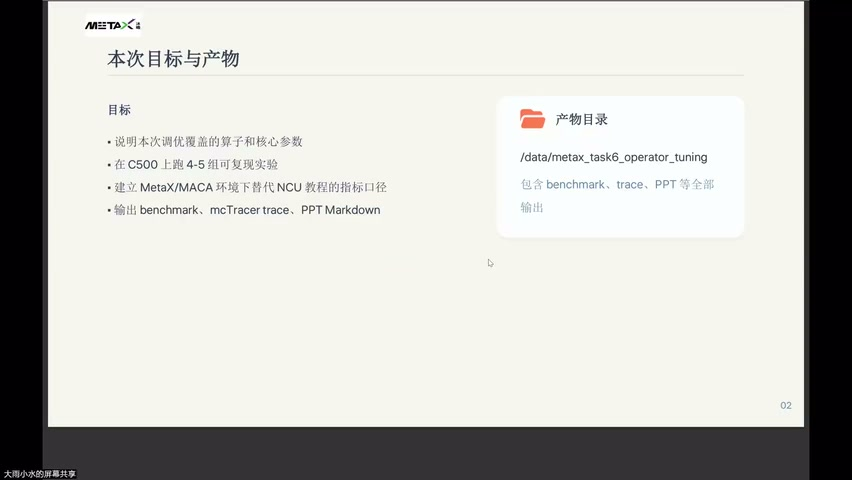
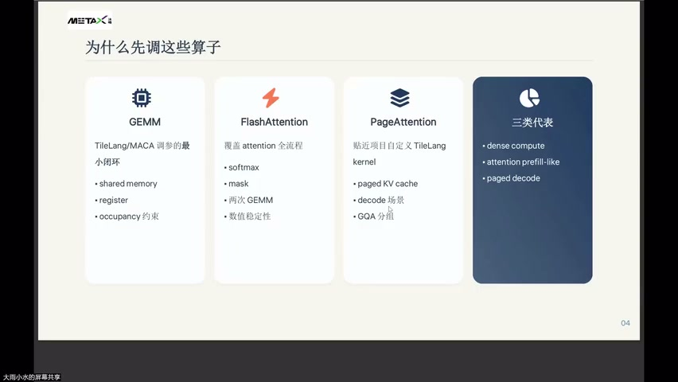
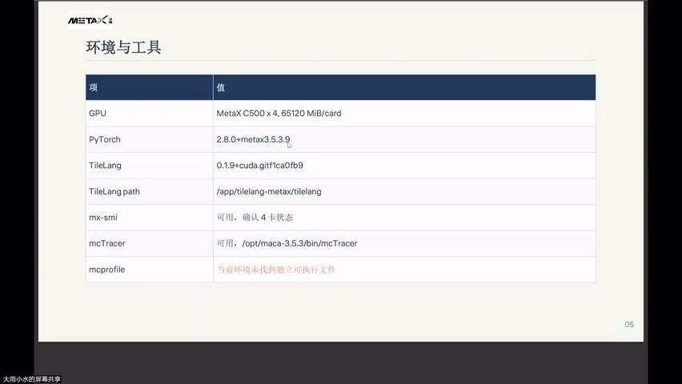
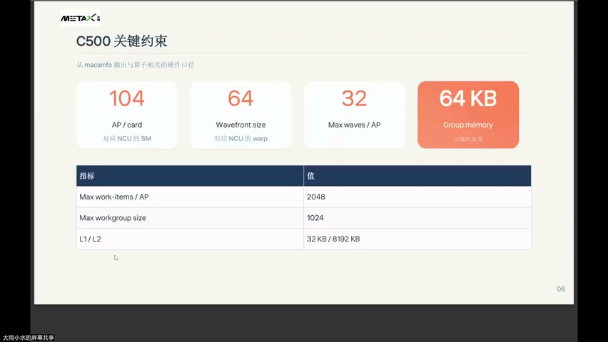
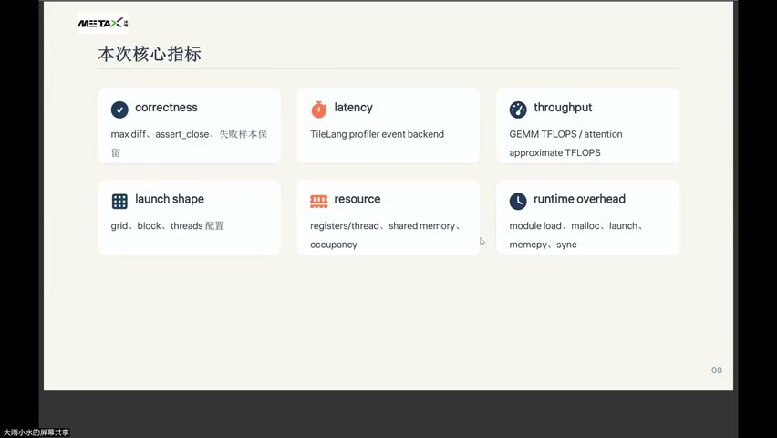
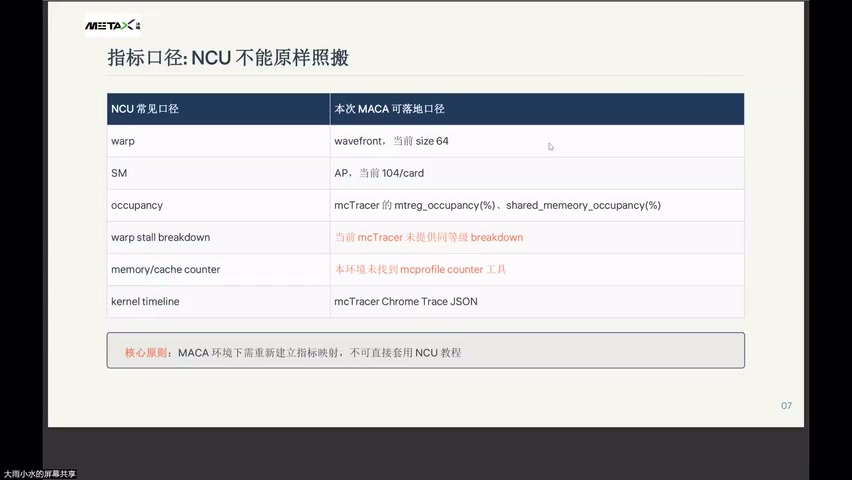

# [P47] 算子性能调优 - FlashAttention·PagedAttention Decode 与 MC Tracer 指标映射

> **演讲者**：周雨涵（沐曦）  
> **日期**：2026年6月10日  
> **活动**：TileLang Puzzle 算子开发实战营 第七课 算子性能调优（上）  

---

## 一、本次覆盖的算子



| 算子 | 主要计算 | 本次关注点 |
|------|---------|-----------|
| GEMM | C = A @ B / A @ B.T | tile、threads、pipeline、swizzle、async copy |
| FlashAttention FWD | tiled QK + online softmax + AV | causal/full mask、seq_len、latency/correctness |
| PageAttention Decode | 单 token Q + paged KV cache | block_H、block_N、page 边界、GQA head 分组 |

> 本次只看算子本身、调优参数和验证指标。

---

## 二、Flash Attention 算子结构



### 三步流程

1. **分块 QK GEMM**：`T.gemm(Q_shared, K_shared, acc_s)` → 得到 score tile
2. **Online Softmax**：
   - `reduce_max` → 更新 score_max
   - `exp2` → 利用硬件电路加速指数运算
   - `reduce_sum` → 更新 score_sum
   - 维护数值稳定性（scale factor = exp(m_old − m_new)）
3. **Score × V GEMM**：`T.gemm(score_tile, V_shared, acc_o)` → 累积输出

### 核心特点

- **不落盘**：不将完整 attention matrix 写入 global memory
- **Tile 内维护状态**：max / sum 保持在寄存器，保证数值稳定
- 不是单个 GEMM，而是 **GEMM + 规约 + 指数 + 另一个 GEMM** 的组合

### 关键变量

| 变量 | 作用 |
|------|------|
| acc_s | score tile（QK 结果） |
| score_max | 当前 tile 行最大值 |
| score_sum | 当前 tile 行 exp 求和 |
| acc_o | 最终输出累积乘积 |

---

## 三、Flash Attention 正确性与性能



### 正确性验证

四个 Flash Attention cases 全部通过 correctness check：
- max diff 范围：**0.001 ~ 0.002**
- 对 FP16 精度来说属于可接受范围

### 性能对比

| 条件 | 观察 |
|------|------|
| seq_len 256 vs 128 | 256 的 approximate TFLOPS **更高** |
| 原因 | tile launch overhead 在更大规模上被摊薄 |
| causal mask | approximate TFLOPS **较低** |
| 原因 | 有效计算减少，但 mask 控制成本不变 |

> 在小 shape 下，NC（实际计时）比 approximate TFLOPS 更可靠，不要过度解读 TFLOPS 数值。

---

## 四、Paged Attention Decode 原理



### 核心特点

- KV **不连续存储**，而是进行**分页存储**（vLLM 特点）
- Decode 时：Q 是当前 token，对历史 KV cache 做 attention

### 关键概念

| 概念 | 说明 |
|------|------|
| Block Table | 逻辑页 → 物理页的映射表 |
| GQA | query heads 与 KV heads 之间有分组关系（group_size = q_heads / kv_heads） |
| Page Size | 每页存储的 token 数（本实验 = 16） |

### 实现难点

- 不只是计算，还有**分页索引的正确性**
- 对 decode kernel 来说：NS（数值稳定性）很重要，但**边界正确性更重要**

---

## 五、Paged Attention 核心代码逻辑



### 索引计算流程

```
global_token_idx
    → page_index = global_token_idx // page_size
    → page_offset = global_token_idx % page_size
    → physical_page = block_table[page_index]
    → 从 physical_page 拷贝 block_n 个 token 的 KV
```

### 边界约束

| block_n 与 page_size 关系 | 结果 |
|---------------------------|------|
| block_n ≤ page_size | ✅ 稳定（一个 tile 不跨页） |
| block_n > page_size | ❌ 跨页 → 读错 physical page → correctness fail |

> 本实验中 block_n = 16 = page_size → 安全；block_n = 32 → 跨页 → 失败。

---

## 六、Paged Attention 调优实验



### 实验设置

- 固定参数：q_heads = 64, kv_heads = 2, dim = 128, page_size = 16
- 变量：seq_len、block_H、block_N
- 目的：验证关键边界（非大规模搜索）

### 实验结果

| 配置 | seq_len | 结果 | NS |
|------|---------|------|-----|
| block_H=32, block_N=16 | 64 | ✅ 通过 | 0.0288 |
| block_H=32, block_N=16 | 128 | ✅ 通过 | 0.0402 |
| block_H=64, block_N=16 | — | ✅ 通过但更慢 | — |
| block_N=32 | — | ❌ max diff = 0.713 | — |

### 结论

| # | 结论 |
|---|------|
| 1 | **block_N = page_size = 16** 是稳定选择 |
| 2 | block_H 应结合 KV group_num（当前 = 32），H32 比 H64 更合适 |
| 3 | block_N = 32 跨页 → 不是容差问题，是**算法边界问题** |
| 4 | 后续若需 block_N > page_size，需改为**跨页拷贝逻辑**，而非仅调参 |

---

## 七、MC Tracer 指标映射：NCU 不能原样照搬



### NCU → MACA 指标对照

| NCU 常见口径 | MACA 可落地口径 |
|-------------|----------------|
| warp | wavefront，当前 size = 64 |
| SM | AP，当前 104/card |
| occupancy | mcTracer: mtreg_occupancy(%), shared_memory_occupancy(%) |
| warp stall breakdown | ⚠️ 当前 mcTracer **未提供**同等粒度 breakdown |
| memory/cache counter | ⚠️ 本环境**未找到** mcprofile counter 工具 |
| kernel timeline | mcTracer Chrome Trace.JSON |

### 核心原则

> **MACA 环境下需重新建立指标映射，不可直接套用 NCU 教程。**

---

## Key Terms

| 术语 | 含义 |
|------|------|
| Flash Attention | 分块计算 attention，避免完整 attention matrix 落盘 |
| Online Softmax | 在 tile 内维护 running max/sum，保证数值稳定 |
| Paged KV Cache | 将 KV cache 按页存储（vLLM），支持非连续内存管理 |
| Block Table | 逻辑页号 → 物理页号的映射表 |
| GQA | Grouped Query Attention，多个 Q head 共享一组 KV head |
| page_size | 每个物理页存储的 token 数量 |
| block_N ≤ page_size | 保证一个 tile 不跨页的约束条件 |
| MC Tracer | 沐曦性能分析工具（对标 NVIDIA NCU） |
| wavefront | AMD/沐曦的 warp 等价概念，C500 上 size = 64 |
| AP | Accelerator Processor，沐曦的 SM 等价单元 |
