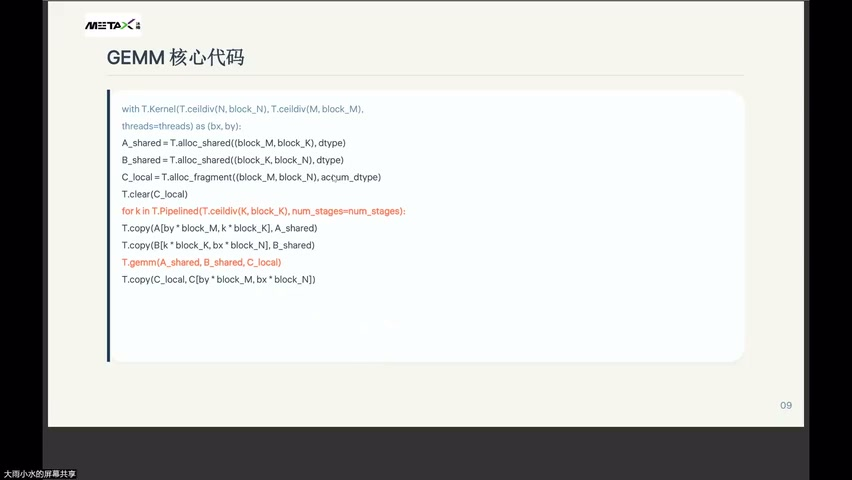
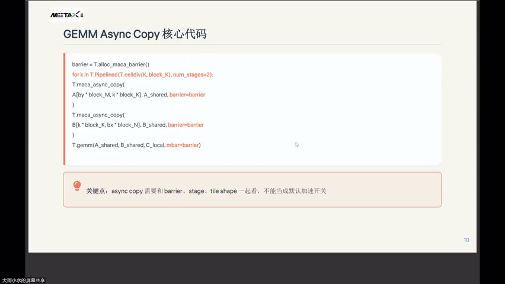
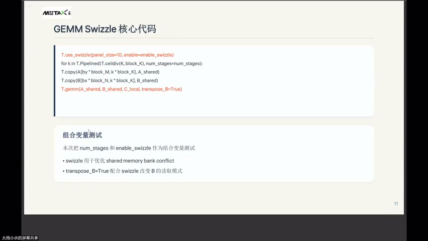
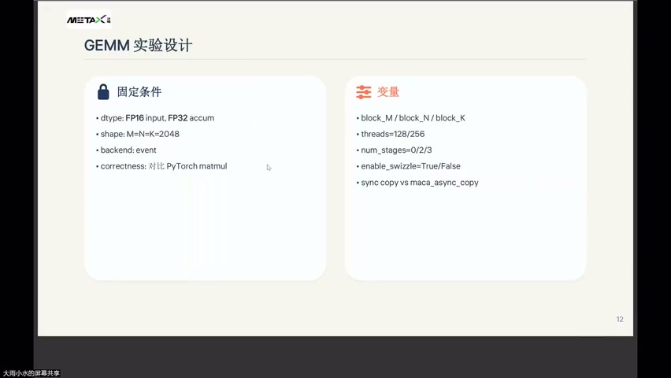
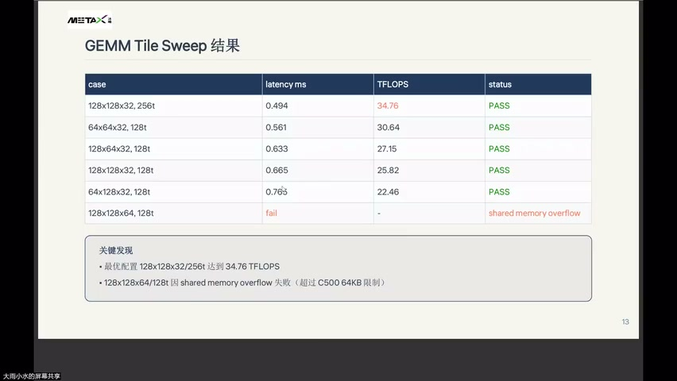
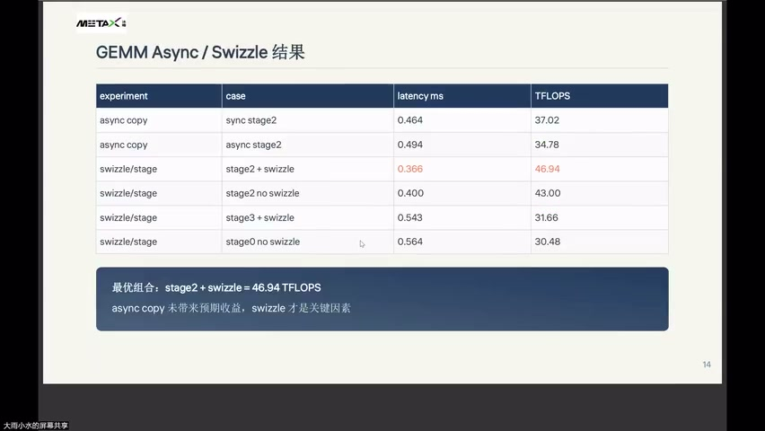
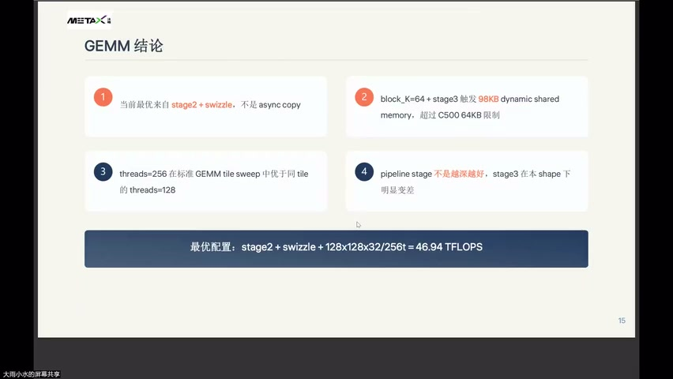

# [P48] 算子性能调优 - GEMM 实现与调优实验

> **演讲者**：周雨涵（沐曦）  
> **日期**：2026年6月10日  
> **活动**：TileLang Puzzle 算子开发实战营 第七课 算子性能调优（中）  

---

## 一、GEMM 核心代码



### 标准 TileLang GEMM Kernel 结构

```python
with T.Kernel(T.ceildiv(N, block_N), T.ceildiv(M, block_M), threads=threads) as (bx, by):
    A_shared = T.alloc_shared([block_M, block_K], "float16")
    B_shared = T.alloc_shared([block_K, block_N], "float16")
    C_local  = T.alloc_fragment([block_M, block_N], "float32")
    T.clear(C_local)

    for k in T.Pipelined(T.ceildiv(K, block_K), num_stages=2):
        T.copy(A[by * block_M, k * block_K], A_shared)
        T.copy(B[k * block_K, bx * block_N], B_shared)
        T.gemm(A_shared, B_shared, C_local)

    T.copy(C_local, C[by * block_M, bx * block_N])
```

- `T.alloc_shared` → shared memory（group memory）
- `T.alloc_fragment` → register（local fragment）
- `T.gemm` → 核心矩阵乘（调用 tensor core）

---

## 二、Async Copy 核心代码



### T.maca_async_copy 用法

```python
barrier = T.alloc_macabarrrier()

for k in T.Pipelined(T.ceildiv(K, block_K), num_stages=2):
    T.maca_async_copy(A[by * block_M, k * block_K], A_shared, barrier=barrier)
    T.maca_async_copy(B[k * block_K, bx * block_N], B_shared, barrier=barrier)
    T.gemm(A_shared, B_shared, C_local, mbar=barrier)
```

### 关键点

> **async copy 需要和 barrier、stage、tile shape 一起看，不能当默认加速开关。**

- 需要显式分配 barrier 对象
- `T.gemm` 通过 `mbar=barrier` 等待数据就绪
- barrier 本身有同步开销

---

## 三、Swizzle 核心代码



### T.use_swizzle 用法

```python
T.use_swizzle(panel_size=10, enable=enable_swizzle)

for k in T.Pipelined(T.ceildiv(K, block_K), num_stages=num_stages):
    T.copy(A[b * block_M, k * block_K], A_shared)
    T.copy(B[bx * block_N, k * block_K], B_shared)
    T.gemm(A_shared, B_shared, C_local, transpose_B=True)
```

### 组合变量测试

- 本次将 `num_stages` 和 `enable_swizzle` 作为**组合变量**测试
- swizzle 用于优化 shared memory bank conflict
- `transpose_B=True` 配合 swizzle 改变 B 的读取模式

---

## 四、实验设计



### 固定条件

| 项目 | 值 |
|------|-----|
| dtype | FP16 input, FP32 accum |
| shape | M = N = K = 2048 |
| backend | event（计时方式） |
| correctness | 对比 PyTorch matmul |

### 变量

| 变量 | 取值 |
|------|------|
| block_M / block_N / block_K | 多种组合 |
| threads | 128 / 256 |
| num_stages | 0 / 2 / 3 |
| enable_swizzle | True / False |
| copy 方式 | sync copy vs maca_async_copy |

---

## 五、Tile Sweep 结果



| Case | Latency (ms) | TFLOPS | Status |
|------|-------------|--------|--------|
| 128×128×32, 256t | 0.494 | **34.76** | PASS |
| 64×64×32, 128t | 0.561 | 30.64 | PASS |
| 128×64×32, 128t | 0.633 | 27.15 | PASS |
| 128×128×32, 128t | 0.665 | 25.82 | PASS |
| 64×128×32, 128t | 0.765 | 22.46 | PASS |
| 128×128×64, 128t | fail | — | shared memory overflow |

### 关键发现

- 最优配置 **128×128×32 / 256t** 达到 34.76 TFLOPS
- 128×128×64 / 128t 因 shared memory overflow 失败（超过 C500 **64 KB** 限制）

---

## 六、Async / Swizzle 对比结果



| 实验 | Case | Latency (ms) | TFLOPS |
|------|------|-------------|--------|
| async copy | sync stage2 | 0.464 | 37.02 |
| async copy | async stage2 | 0.494 | 34.78 |
| swizzle/stage | **stage2 + swizzle** | **0.366** | **46.94** |
| swizzle/stage | stage2 no swizzle | 0.400 | 43.00 |
| swizzle/stage | stage3 + swizzle | 0.543 | 31.66 |
| swizzle/stage | stage0 no swizzle | 0.564 | 30.48 |

### 结论

> **最优组合：stage2 + swizzle = 46.94 TFLOPS**  
> async copy 未见预期收益，**swizzle 才是关键因素**。

---

## 七、GEMM 调优结论



| # | 结论 |
|---|------|
| 1 | 当前最优来自 **stage2 + swizzle**，不是 async copy |
| 2 | block_K=64 + stage3 触发 98 KB dynamic shared memory，超过 C500 64 KB 限制 |
| 3 | threads=256 在标准 GEMM tile sweep 中优于同 tile 的 threads=128 |
| 4 | pipeline stage 不是越深越好，stage3 在本 shape 下明显变差 |

### 最终最优配置

> **stage2 + swizzle + 128×128×32 / 256t = 46.94 TFLOPS**

---

## Key Terms

| 术语 | 含义 |
|------|------|
| Tile Sweep | 遍历不同 tile 配置组合，找最优性能 |
| T.maca_async_copy | MetaX 异步数据搬运 API |
| T.use_swizzle | 改变 block 调度排布，优化数据局部性 |
| transpose_B | 转置 B 矩阵读取模式，配合 swizzle 使用 |
| Shared Memory Overflow | 资源超限导致 kernel launch 失败 |
| Pipeline Stage | 多缓冲深度，影响 shared memory 倍数需求 |
| Event Backend | GPU event 计时方式（非 host timer） |
| C500 64 KB | 沐曦 C500 单 AP 的 group memory 上限 |
