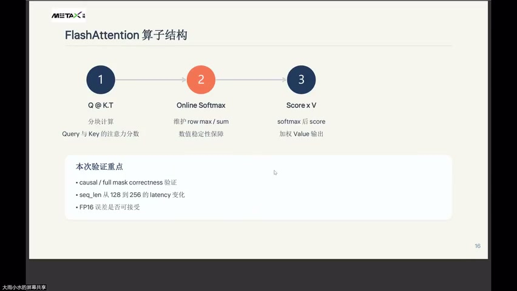
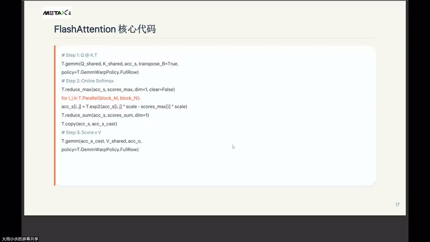
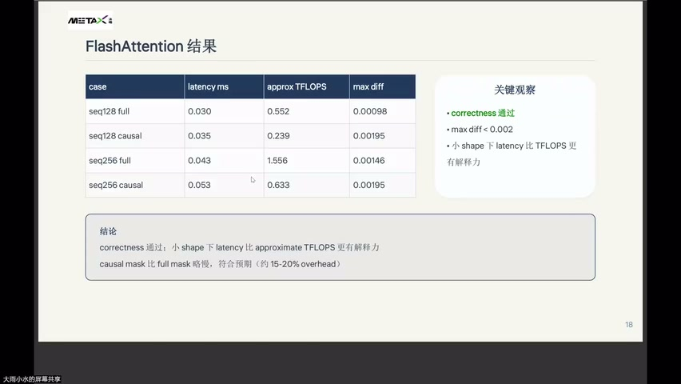
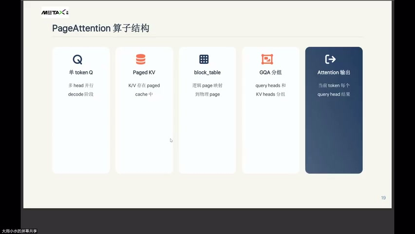
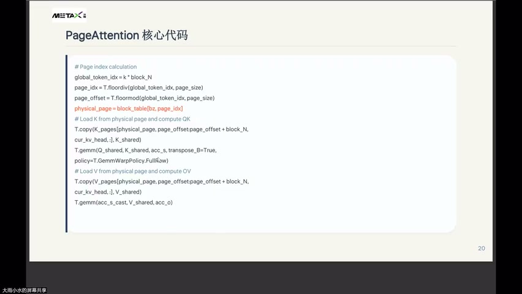
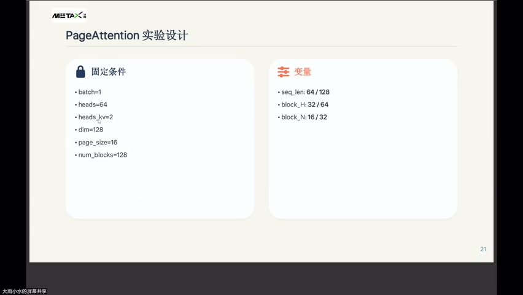
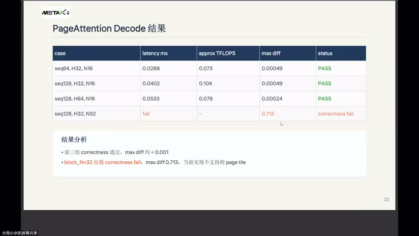
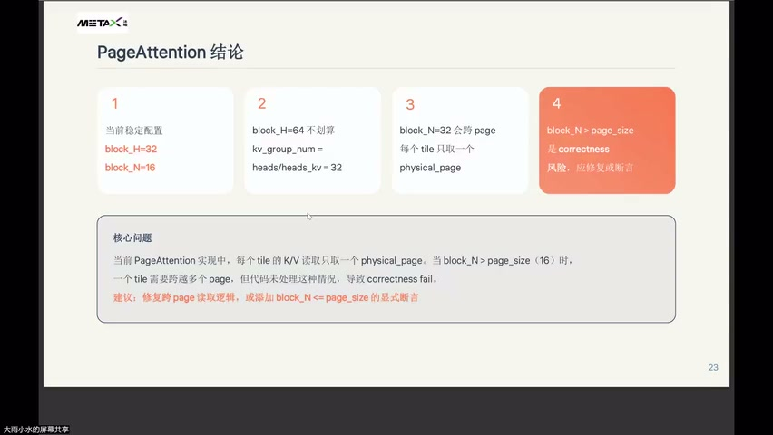
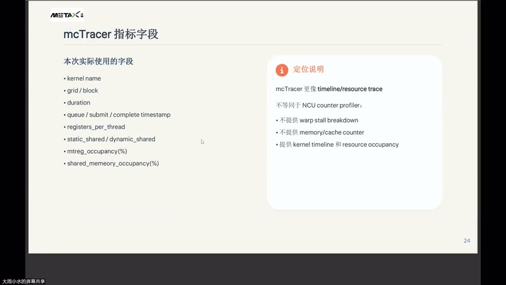

# [P49] 算子性能调优 - FlashAttention 与 PagedAttention 算子实战

> **演讲者**：周雨涵（沐曦）  
> **日期**：2026年6月10日  
> **活动**：TileLang Puzzle 算子开发实战营 第七课 算子性能调优（下）  

---

## 一、FlashAttention 算子结构



### 三步流程

| 步骤 | 操作 | 说明 |
|------|------|------|
| 1 | Q @ K.T | 分块计算 Query 与 Key 的注意力分数 |
| 2 | Online Softmax | 维护 row max / sum，数值稳定性保障 |
| 3 | Score × V | softmax 后 score 加权 Value 输出 |

### 本次验证重点

- causal / full mask correctness 验证
- seq_len 从 128 到 256 的 latency 变化
- FP16 误差是否可接受

---

## 二、FlashAttention 核心代码



```python
# Step 1: Q @ K.T
T.gemm(Q_shared, K_shared, acc_s, transpose_B=True,
       policy=T.GemmWarpPolicy.FullRow)

# Step 2: Online Softmax
T.reduce_max(acc_s, scores_max, dim=1, clear=False)
for i, j in T.Parallel(block_M, block_N):
    acc_s[i, j] = T.exp2(acc_s[i, j] * scale - scores_max[j] * scale)
T.reduce_sum(acc_s, scores_sum, dim=1)
T.copy(acc_s, acc_s_cast)

# Step 3: Score x V
T.gemm(acc_s_cast, V_shared, acc_o,
       policy=T.GemmWarpPolicy.FullRow)
```

### 要点

- `T.exp2`：利用硬件 base-2 指数电路加速
- `T.GemmWarpPolicy.FullRow`：warp 按整行分配策略
- `acc_s_cast`：FP32 score → FP16 用于后续 GEMM

---

## 三、FlashAttention 实验结果



| Case | Latency (ms) | Approx TFLOPS | Max Diff |
|------|-------------|---------------|----------|
| seq128 full | 0.030 | 0.552 | 0.00098 |
| seq128 causal | 0.035 | 0.239 | 0.00195 |
| seq256 full | 0.043 | 1.556 | 0.00146 |
| seq256 causal | 0.053 | 0.633 | 0.00195 |

### 关键观察

- correctness 通过，max diff < 0.002
- 小 shape 下 **latency 比 TFLOPS 更有解释力**
- causal mask 比 full mask 略慢，符合预期（约 **15–20% overhead**）

### 结论

> correctness 通过；小 shape 下 latency 比 approximate TFLOPS 更有解释力。  
> causal mask 因有效计算减少 + 控制逻辑开销，TFLOPS 显著低于 full mask。

---

## 四、PageAttention 算子结构



### 五大组件

| 组件 | 说明 |
|------|------|
| 单 token Q | 多 head 并行，decode 阶段 |
| Paged KV | K/V 存在 paged cache 中 |
| block_table | 逻辑 page 映射到物理 page |
| GQA 分组 | query heads 和 KV heads 分组 |
| Attention 输出 | 当前 token 每个 query head 结果 |

---

## 五、PageAttention 核心代码



```python
# Page index calculation
global_token_idx = k * block_N
page_idx = T.floordiv(global_token_idx, page_size)
page_offset = T.floormod(global_token_idx, page_size)
physical_page = block_table[bz, page_idx]

# Load K from physical page and compute QK
T.copy(K_pages[physical_page, page_offset:page_offset+block_N, cur_kv_head, :], K_shared)
T.gemm(Q_shared, K_shared, acc_s, transpose_B=True, policy=T.GemmWarpPolicy.FullRow)

# Load V from physical page and compute OV
T.copy(V_pages[physical_page, page_offset:page_offset+block_N, cur_kv_head, :], V_shared)
T.gemm(acc_s_cast, V_shared, acc_o)
```

### 关键约束

- 每个 tile 只取**一个** physical_page
- 当 block_N > page_size 时 → 跨页 → 当前实现**不支持**

---

## 六、PageAttention 实验设计



### 固定条件

| 参数 | 值 |
|------|-----|
| batch | 1 |
| heads | 64 |
| heads_kv | 2 |
| dim | 128 |
| page_size | 16 |
| num_blocks | 128 |

### 变量

| 变量 | 取值 |
|------|------|
| seq_len | 64 / 128 |
| block_H | 32 / 64 |
| block_N | 16 / 32 |

---

## 七、PageAttention Decode 结果



| Case | Latency (ms) | Approx TFLOPS | Max Diff | Status |
|------|-------------|---------------|----------|--------|
| seq64, H32, N16 | 0.0288 | 0.073 | 0.00049 | PASS |
| seq128, H32, N16 | 0.0402 | 0.104 | 0.00049 | PASS |
| seq128, H64, N16 | 0.0533 | 0.079 | 0.00024 | PASS |
| seq128, H32, N32 | fail | — | 0.713 | correctness fail |

### 结果分析

- 前三组 correctness 通过，max diff 均 < 0.001
- block_N=32 出现 correctness fail（max diff = 0.713）：当前实现不支持跨 page tile

---

## 八、PageAttention 结论



| # | 结论 |
|---|------|
| 1 | 当前稳定配置：**block_H=32, block_N=16** |
| 2 | block_H=64 不划算（kv_group_num = heads/heads_kv = 32） |
| 3 | block_N=32 会跨 page（每个 tile 只取一个 physical_page） |
| 4 | block_N > page_size 是 **correctness 风险**，应修复或断言 |

### 核心问题

> 当前实现中，每个 tile 的 K/V 读取只取一个 physical_page。当 block_N > page_size（16）时，一个 tile 需要跨越多个 page，但代码未处理，导致 correctness fail。

### 建议

- 修复跨 page 读取逻辑（循环拷贝多个 page）
- 或添加 `assert block_N <= page_size` 的显式断言

---

## 九、mcTracer 指标字段



### 本次实际使用的字段

- kernel name
- grid / block
- duration
- queue / submit / complete timestamp
- registers_per_thread
- static_shared / dynamic_shared
- mtreg_occupancy(%)
- shared_memory_occupancy(%)

### 定位说明

> mcTracer 更像 **timeline / resource trace**，不等同于 NCU counter profiler。

| 不提供 | 提供 |
|--------|------|
| warp stall breakdown | kernel timeline |
| memory/cache counter | resource occupancy |

---

## Key Terms

| 术语 | 含义 |
|------|------|
| FlashAttention | 分块 attention，避免完整 attention matrix 落盘 |
| Online Softmax | tile 内维护 running max/sum 保证数值稳定 |
| T.exp2 | 硬件加速的 base-2 指数运算 |
| GemmWarpPolicy.FullRow | warp 按整行分配的 GEMM 策略 |
| Paged KV Cache | KV 按页存储，支持非连续内存管理（vLLM） |
| block_table | 逻辑页 → 物理页映射表 |
| GQA | Grouped Query Attention，多 Q head 共享 KV head |
| correctness fail | 数值正确性验证失败（非性能问题） |
| mcTracer | 沐曦性能追踪工具，提供 timeline + occupancy |
| mtreg_occupancy | 寄存器占用率指标 |
