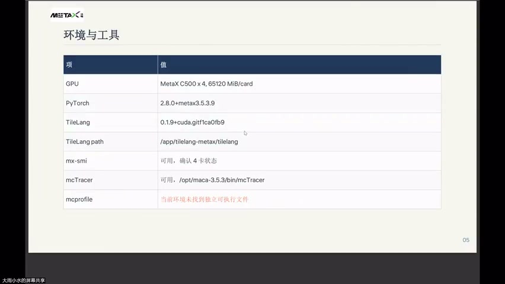
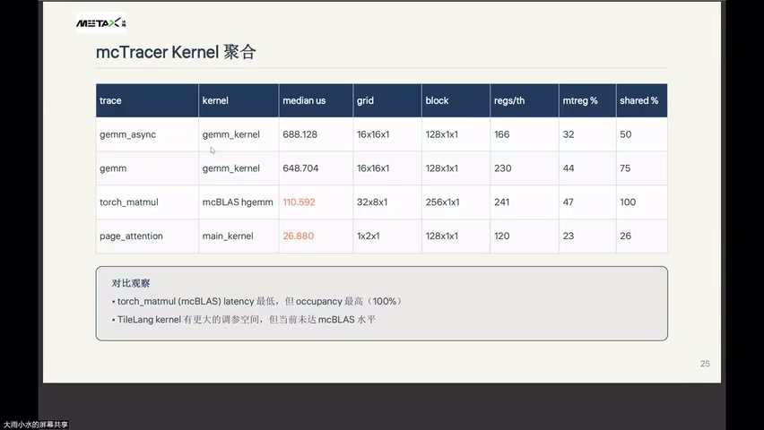
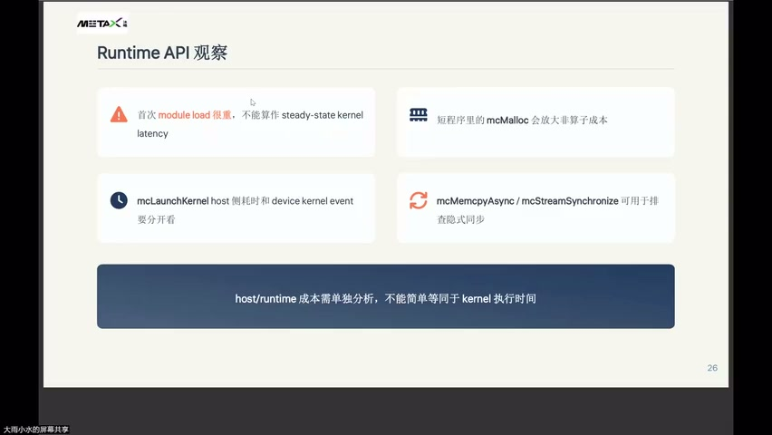
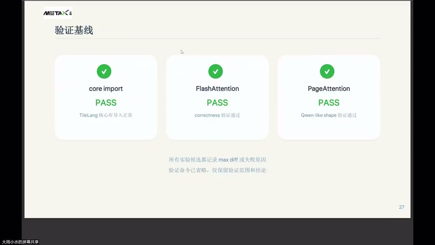
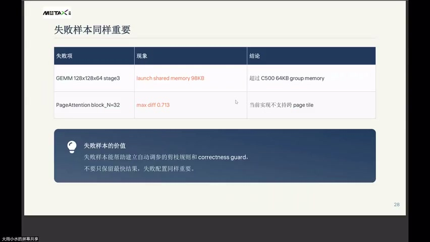
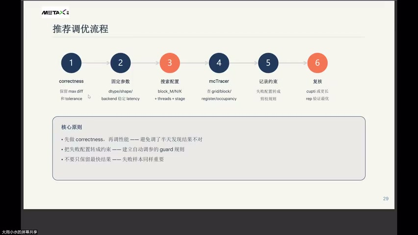
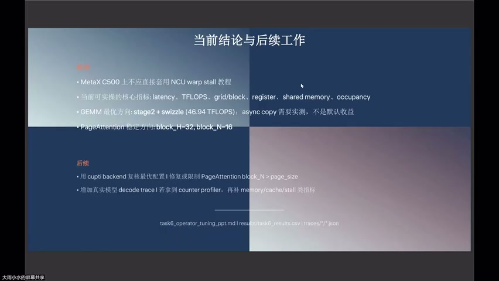

# [P50] 算子性能调优 - MC Tracer 回顾·调优方法论与结营总结

> **演讲者**：周雨涵（沐曦）  
> **日期**：2026年6月10日  
> **活动**：TileLang Puzzle 算子开发实战营 第七课 算子性能调优（总结）  

---

## 一、环境与工具



| 项 | 值 |
|----|-----|
| GPU | MetaX C500 × 4, 65120 MiB/card |
| PyTorch | 2.8.0+metax3.5.3.9 |
| TileLang | 0.1.9+cuda.git1ca0fb9 |
| TileLang path | /app/tilelang-metax/tilelang |
| mx-smi | 可用，确认 4 卡状态 |
| mcTracer | 可用，/opt/maca-3.5.3/bin/mcTracer |
| mcprofile | ⚠️ 当前环境未找到独立可执行文件 |

---

## 二、mcTracer Kernel 聚合对比



| Trace | Kernel | Median (μs) | Grid | Block | Regs/th | mtreg % | shared % |
|-------|--------|-------------|------|-------|---------|---------|----------|
| gemm_async | gemm_kernel | 688.1 | 16×16×1 | 128×1×1 | 166 | 32 | 50 |
| gemm | gemm_kernel | 648.7 | 16×16×1 | 128×1×1 | 230 | 44 | 75 |
| torch_matmul | mcBLAS hgemm | **110.6** | 32×8×1 | 256×1×1 | 241 | 47 | **100** |
| page_attention | main_kernel | **26.9** | 1×2×1 | 128×1×1 | 120 | 23 | 26 |

### 对比观察

- torch_matmul (mcBLAS) latency 最低，但 occupancy 最高 (100%)
- TileLang kernel 有更大的调参空间，但当前未达 mcBLAS 水平

---

## 三、Runtime API 观察



| 观察 | 说明 |
|------|------|
| 首次 module load | 很重，不能算作 steady-state kernel latency |
| mcMalloc | 短程序里会放大非算子成本 |
| mcLaunchKernel | host 侧耗时和 device kernel event 要**分开看** |
| mcMemcpyAsync / mcStreamSynchronize | 可用于排查式同步 |

### 核心原则

> **host/runtime 成本需单独分析，不能简单等同于 kernel 执行时间。**

---

## 四、验证基线



| 组件 | 状态 | 说明 |
|------|------|------|
| core import | ✅ PASS | TileLang 核心库导入正常 |
| FlashAttention | ✅ PASS | correctness 验证通过 |
| PageAttention | ✅ PASS | Qwen-like shape 验证通过 |

- 所有实验候选都记录 max diff 或失败原因
- 验证命令已省略，仅保留验证范围和结论

---

## 五、失败样本同样重要



| 失败项 | 现象 | 结论 |
|--------|------|------|
| GEMM 128×128×64 stage3 | launch shared memory 98 KB | 超过 C500 64 KB group memory |
| PageAttention block_N=32 | max diff 0.713 | 当前实现不支持跨 page tile |

### 失败样本的价值

> 失败样本能帮助建立自动调参的**剪枝规则**和 **correctness guard**。  
> 不要只保留最快结果，失败配置同样重要。

---

## 六、推荐调优流程



### 六步流程

| 步骤 | 名称 | 内容 |
|------|------|------|
| 1 | correctness | 保留 max diff 和 tolerance |
| 2 | 固定参数 | dtype / shape / backend 稳定 latency |
| 3 | 搜索配置 | block_M/N/K + threads + stage |
| 4 | mcTracer | 查 grid / block / register / occupancy |
| 5 | 记录约束 | 失败配置转成剪枝规则 |
| 6 | 复核 | cupti 或更长 rep 验证最优 |

### 核心原则

- **先做 correctness，再调性能** —— 避免调半天发现结果不对
- **把失败配置转成约束** —— 建立自动调参的 guard 规则
- **不要只保留最快结果** —— 失败样本同样重要

---

## 七、当前结论与后续工作



### 结论

| # | 结论 |
|---|------|
| 1 | MetaX C500 上**不应直接套用** NCU warp stall 教程 |
| 2 | 当前可实操的核心指标：latency、TFLOPS、grid/block、register、shared memory、occupancy |
| 3 | GEMM 最优方向：**stage2 + swizzle (46.94 TFLOPS)**；async copy 需实测，不是默认收益 |
| 4 | PageAttention 稳定方向：**block_H=32, block_N=16** |

### 后续工作

- 用 cupti backend 复核最优配置
- 修复或限制 PageAttention block_N > page_size
- 增加真实模型 decode trace
- 若拿到 counter profiler，再补 memory/cache/stall 类指标

### 相关文件

```
task6_operator_tuning_ppt.md | results/task6_results.csv | traces/*.json
```

---

## Key Terms

| 术语 | 含义 |
|------|------|
| mcTracer | 沐曦性能追踪工具（timeline + resource occupancy） |
| mcBLAS | 沐曦 BLAS 库（对标 cuBLAS），torch_matmul 底层调用 |
| mcMalloc | 沐曦内存分配 API，短程序中开销占比大 |
| mcLaunchKernel | 沐曦 kernel 启动 API（host 侧） |
| mtreg_occupancy | 寄存器占用率 |
| shared_memory_occupancy | 共享内存占用率 |
| 剪枝规则 | 自动调参时排除已知失败配置的约束 |
| correctness guard | 正确性断言/检查，防止无效配置进入搜索空间 |
| cupti backend | 更精确的 GPU 计时后端（用于复核） |
| steady-state | 排除 warmup 后的稳定执行状态 |
