# 7月宏观分重点：A股/半导体/石油/黄金 + 789月的宏观趋势 — Clean Slide Notes

> **UP主**: 战国时代_姜汁汽水 | **发布日期**: 2026-07-23 | **时长**: 38:52 | **来源**: [BV1kBgx6zEjJ](https://www.bilibili.com/video/BV1kBgx6zEjJ/)

---

## Part 1 — 微观操作回顾

### Slide 1 — 动态截图：A股加仓策略 ([Video](https://www.bilibili.com/video/BV1kBgx6zEjJ/?t=6s))

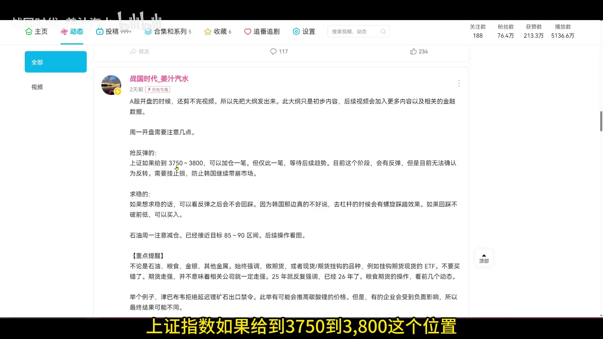

UP主展示了本周一开盘前发布的B站动态，提示上证指数如果给到3750～3800的位置可以加仓一笔，但只能加仓一次、仅此一笔。选择在这个位置加仓的原因是下跌的斜率和速度太快，一旦出现这种情况肯定会有救市措施出台。事实证明国家队确实直接出手买入了。之所以只加一笔，是因为韩国那边还会持续性地解杠杆，肯定会影响到国内市场。

---

### Slide 5 — 半导体操作：7月13日卖出盈利 ([Video](https://www.bilibili.com/video/BV1kBgx6zEjJ/?t=60s))

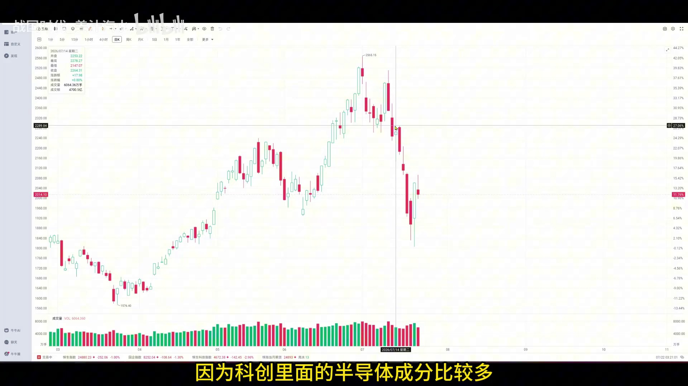

7月13号是一个非常关键的位置。UP主的选择是把所有盈利全部卖出，留着成本在里面跑。举例：如果成本是100股每股1块钱，涨到每股2块3，相当于赚了130块钱，操作就是把这130全部卖掉。之所以留着成本，第一个原因是成本比较低（主要在2024年和2025年大量买入中国半导体），可以等待下一步趋势；第二个原因是认为接下来还会有一波反弹。

---

### Slide 6 — 科创50日K线图：半导体只是反弹不是反转 ([Video](https://www.bilibili.com/video/BV1kBgx6zEjJ/?t=138s))

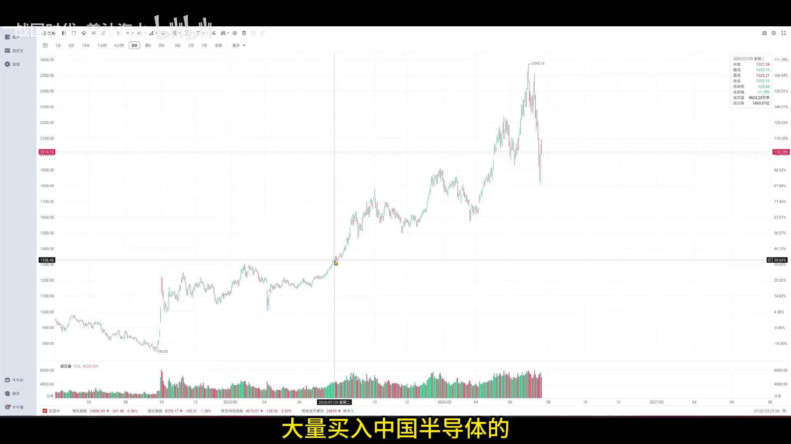

UP主展示了科创50的日K线图（科创里面半导体成分比较多），强调现在这个状态只是反弹不是反转。这个阶段不能加仓半导体，如果你被套了可以趁着反弹的时候注意减仓。UP主认为半导体在2026年直接崩盘的概率并不大，在2026年底之前还会再来一个次高，甚至有可能会假突破。

---

### Slide 10 — 半导体2026年底再次减仓计划 ([Video](https://www.bilibili.com/video/BV1kBgx6zEjJ/?t=150s))

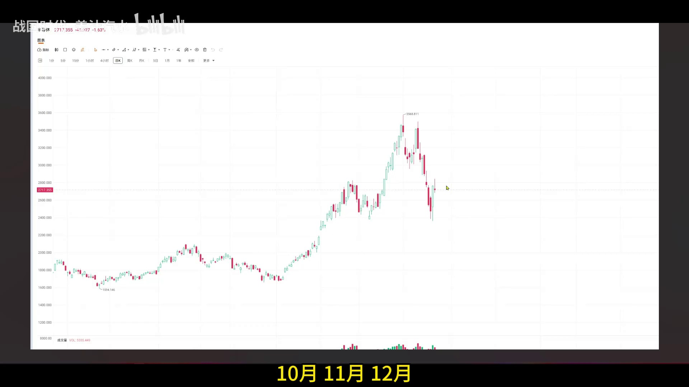

UP主的计划是在2026年底之前再次减仓。如果美国的AI巨头维持资本开支，或者10月份往后美联储放鸽的话，那么有可能会看到半导体出现一个次高点或者假突破。但是27年大概率它还是要继续下跌的，所以选择大概是在26年底27年初的时候再次进行减仓。

---

### Slide 11 — WTI原油操作：目标85～90美元 ([Video](https://www.bilibili.com/video/BV1kBgx6zEjJ/?t=178s))

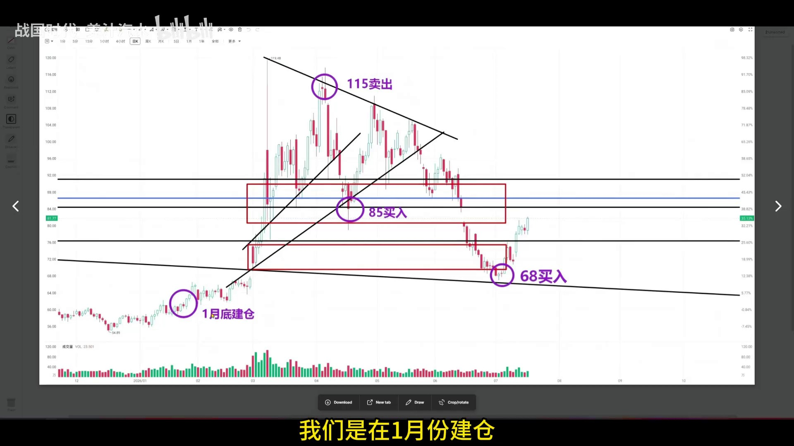

WTI原油的操作回顾：1月份建仓，115卖出，85买入，68买入。第一阶段的目标价在85～90美元，在这个位置会考虑减仓。但减仓并非全部卖出，会留一部分仓位等待后续趋势，主要是为了预防战争进一步扩大。后续WTI原油价格有可能会回补70左右的缺口。如果未来石油回到70左右，会考虑再次加仓。

---

### Slide 14 — 农产品期货：豆粕3100～3200卖出区间 ([Video](https://www.bilibili.com/video/BV1kBgx6zEjJ/?t=220s))

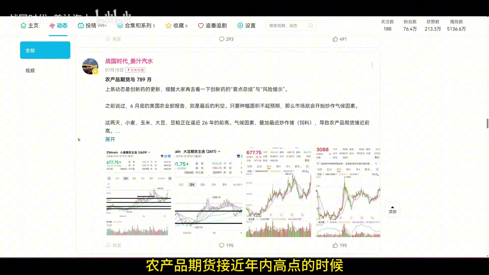

农产品期货接近年内高点的时候可以选择卖出。如果手里的农产品期货还没有到达年内高点，可以等待一段时间，等到7月底的时候如果重新回到了年内高点，可以选择减仓和卖出。豆粕的价格在3100～3200这个区间是可以选择卖出的。6月底美国农业部发报告的时候就是最后的利空，只要种植面积没有大范围的扩大，市场就会开始炒作气候因素，农产品期货价格就会不断走高。

---

### Slide 15 — 农产品期货日K线图 ([Video](https://www.bilibili.com/video/BV1kBgx6zEjJ/?t=230s))

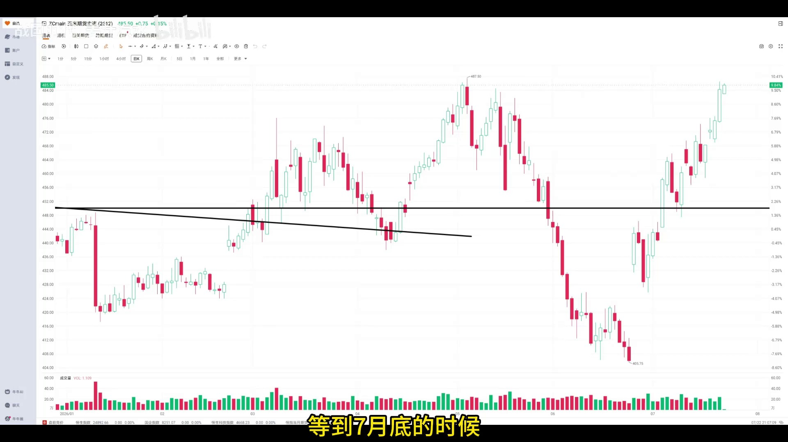

展示了粳米期货主连(2612)的日K线图，当前价格485.50，标注了趋势线和"等到7月底的时候"的时间窗口提示。

---

### Slide 17 — 黄金微观操作：等回踩4050～4080 ([Video](https://www.bilibili.com/video/BV1kBgx6zEjJ/?t=266s))

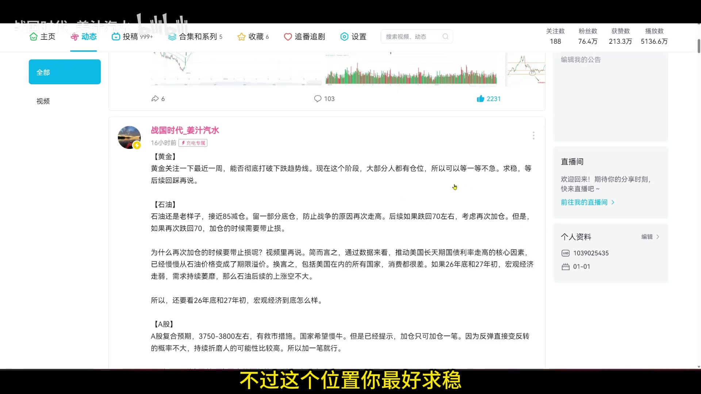

黄金最近一周有可能突破下跌趋势线，但这个位置最好求稳，等它回踩之后再说。截止剪视频时黄金已经出现了回踩的动作。重点关注4080～4050这个区间能不能稳得住：如果稳得住，接下来出现回升就不用太担心；如果这个区间没有撑住再往下走，那么7月29号美联储会议的时候有可能再次砸到3900的位置。不过再次砸盘也只是区间范围内筑底的一个动作，筑底阶段仍然没有改变。

---

### Slide 19 — 中美经贸缓和：300亿对等降税 ([Video](https://www.bilibili.com/video/BV1kBgx6zEjJ/?t=334s))

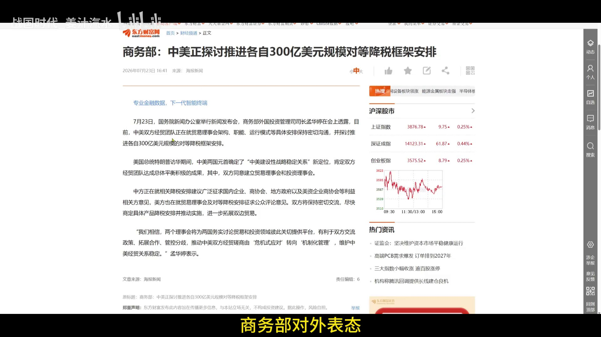

中美双方的经贸团队正在进行300亿规模的对等降税。在讲中美会晤（川普访问东大）的时候提到过，今年下半年美国方面可能会考虑和中国缓和贸易关系、考虑降关税。因为现在美国的库存周期已经到了一个相对的底部区间，为了中期选举、为了圣诞节的备货可能会考虑降关税。从这些微妙的细节可以看到中美双方的关系实际上是在进一步缓和的。美国现在的策略主要还是收割日韩和欧洲。

---

## Part 2 — 宏观六大挑战

### Slide 20 — Milanote工作区：宏观市场梳理总览 ([Video](https://www.bilibili.com/video/BV1kBgx6zEjJ/?t=380s))

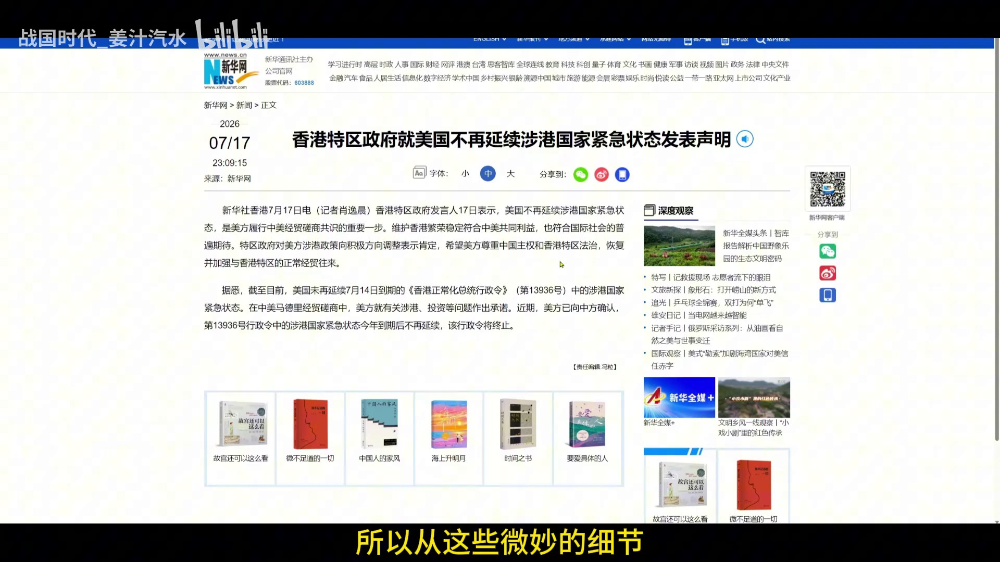

UP主切换到Milanote工作区"市场梳理"，强调关于微观的点位和操作就先说这么多，真正重要的还是宏观市场的梳理，这才是真正重要的主心骨。如果不了解现在宏观层面正在发生些什么，可能就会觉得一团乱麻。尤其是最近一段时间操作的难度是非常大的。

---

### Slide 21 — 六大挑战：美联储/川普/地缘/科技/K型/抢钱 ([Video](https://www.bilibili.com/video/BV1kBgx6zEjJ/?t=426s))

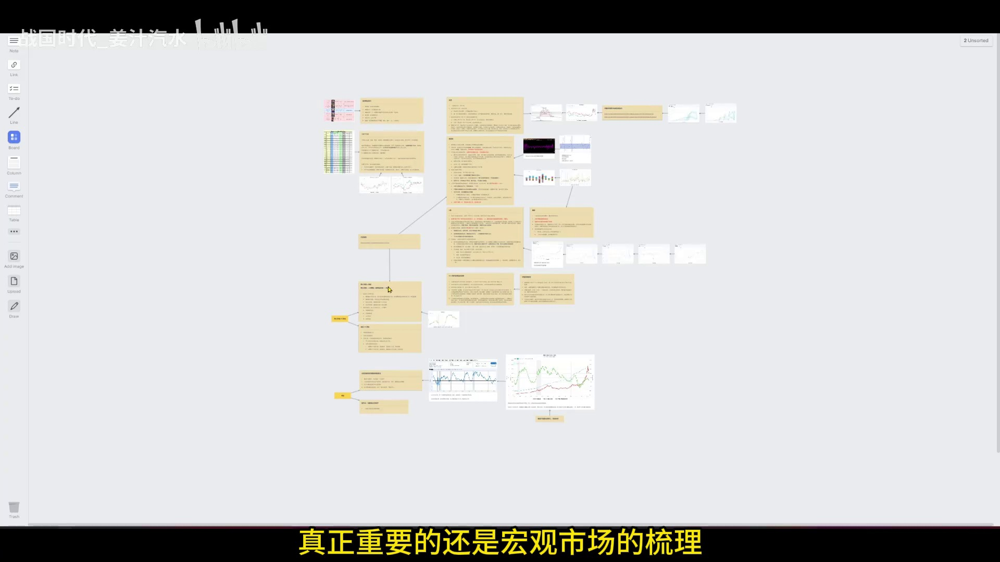

最近一段时间发生了六件大事：

1. **美联储打破了20年的惯性** — 从伯南克到耶伦到鲍威尔大概20年，一直以来都习惯性地给市场提供前瞻指引，帮助市场充分消化美联储的意图。但是到了沃什就不跟市场进行沟通了，这是20年没有见过的转变。
2. **无法预测的川普** — 带来了非常大的不确定性。
3. **地缘战争** — 美国伊朗以色列之间的战争，按规模来看上一次同等规模是2003年伊拉克战争。
4. **科技股暴涨暴跌** — 震荡幅度非常大。
5. **K型经济分化严重** — 跟AI沾边的业绩不错，跟AI没关系的业绩非常差，中国美国韩国日本欧洲全都是这种状态。
6. **三方抢钱** — 国债、股市和AI（企业债）三方抢流动性，这一点直接和789三个月密切相关。

---

### Slide 24 — 融资余额/M2比率：超过互联网泡沫和08年 ([Video](https://www.bilibili.com/video/BV1kBgx6zEjJ/?t=550s))

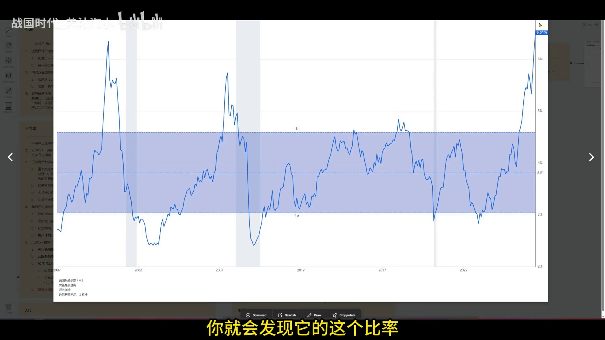

如果去看美国的融资余额除以M2，这个比率相当的高，比互联网泡沫和08年次贷危机都要高很多。相当于现在整个市场的杠杆已经拉到非常高了，存在边际买盘不足的情况。换句话说所有的钱都涌向了AI行业，其他行业拿不到钱。灰色部分是衰退期（互联网泡沫、08年次贷危机、新冠疫情），这条蓝色线的峰值可以说是领先指标，如果未来这是高点的话，那么有可能会在将来看到一次衰退。

---

## Part 3 — 美债深度分析

### Slide 25 — 财政部融资需求表：战争后融资飙升 ([Video](https://www.bilibili.com/video/BV1kBgx6zEjJ/?t=618s))

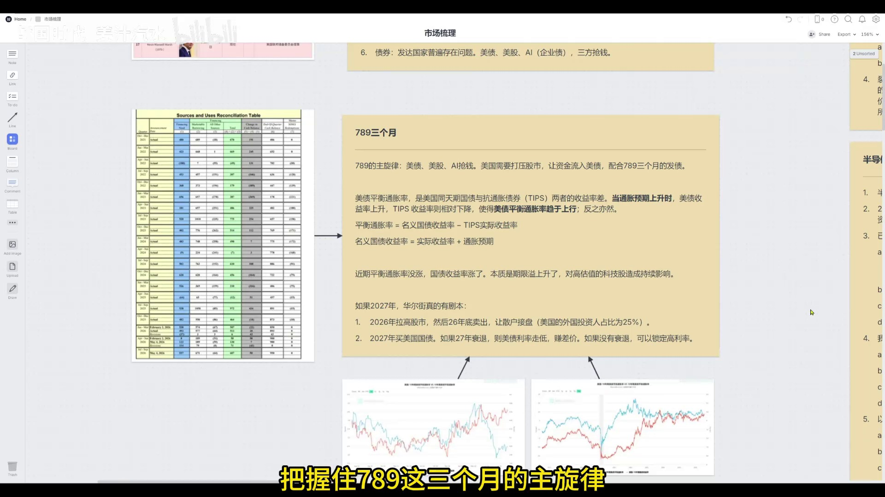

789三个月的主旋律就是美债、美股、还有AI抢钱。展示了财政部计划的融资需求表（Sources and Uses Reconciliation Table），包含计划融资（上面）和实际融资（下面）以及差值。自从战争爆发以来美国的融资需求增加了非常多。从2021年最后一个季度到2026年，只有两次的融资规模比现在要大，而且很有可能到最后实际融资是六开头。

---

### Slide 30 — 平衡通胀率公式与789策略 ([Video](https://www.bilibili.com/video/BV1kBgx6zEjJ/?t=728s))

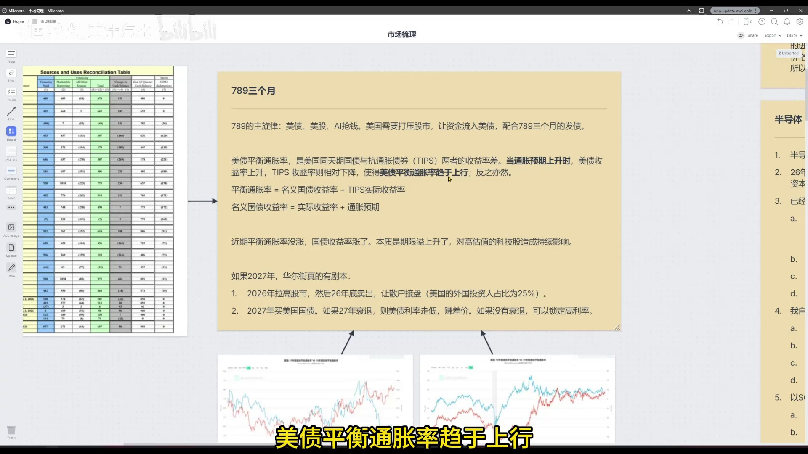

Milanote工作区展示了核心分析框架：

**公式**：美债平衡通胀率 = 同天期名义国债收益率 − 抗通胀债券(TIPS)收益率

当通胀预期上升时，大家会去买TIPS，TIPS价格上涨→利率下降；同时名义国债收益率上升。减数上升被减数下降→平衡通胀率上升。这是正常情况。

**789策略**：美国需要打压股市，让资金流入美债，配合789三个月的发债。

---

### Slide 32 — 异常现象：期限溢价上升而非通胀 ([Video](https://www.bilibili.com/video/BV1kBgx6zEjJ/?t=774s))

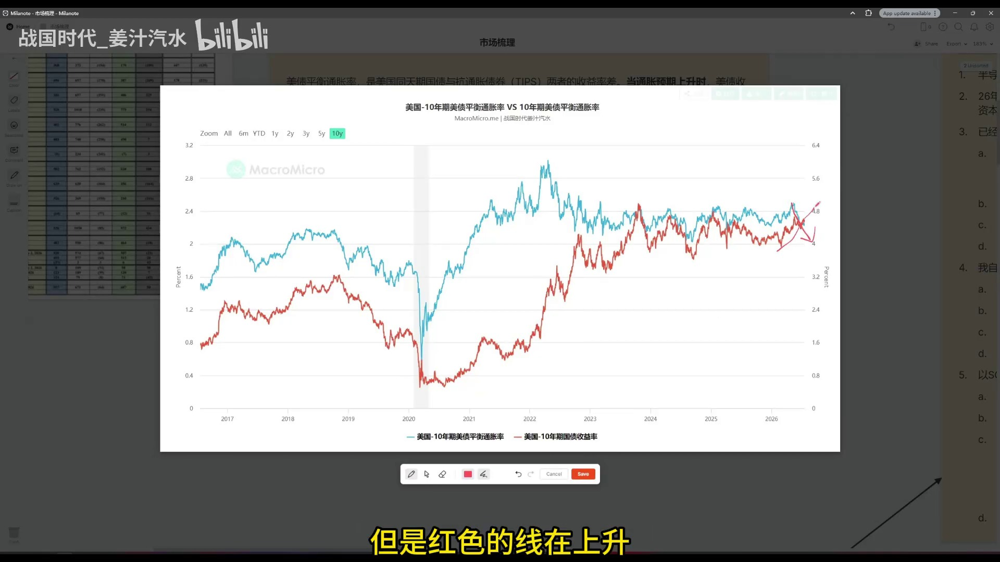

但是现在情况恰恰相反：红色是10年期国债收益率，蓝色是10年期美债平衡通胀率。如果是油价导致的预期通胀上升，蓝色线应该大幅上升，但目前只是小幅上升。与此同时10年期国债收益率又来到了4.6。出现了显著的缺口——蓝色线在下降但红色线在上升，和典型模式不符。

**结论**：名义国债收益率上涨→TIPS收益率上升→TIPS价格下降→买TIPS的人在减少→市场并不认为未来会进行长期通胀。既然通胀预期没有上涨但名义国债收益率上涨了，意味着**期限溢价上升了**。

期限溢价上升意味着市场对美债的信任再度下降了，买债券的人要求更高的风险补偿。如果国债利率涨得更高，企业债利率也会涨得更高，显然会对高估值的科技股造成持续性影响。

---

### Slide 34 — 789策略：驱赶股市资金进入债市 ([Video](https://www.bilibili.com/video/BV1kBgx6zEjJ/?t=844s))

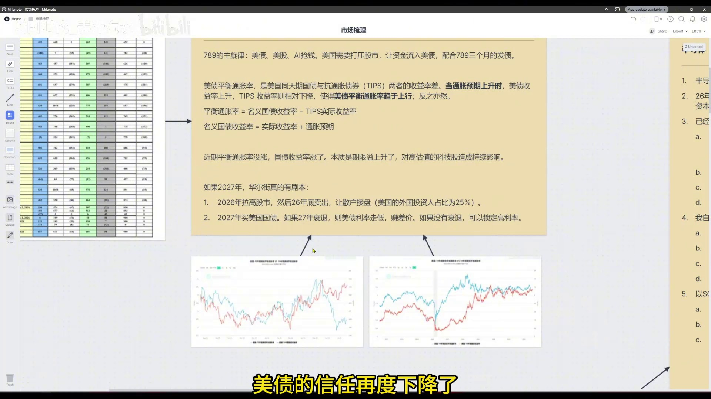

美国有两种方法让人们再次相信美债：

- **方法一（通胀化债）**：踏踏实实的还本付息，但通过通胀的方式稀释国债收益率。只要通胀高于10年期国债利率就可以。
- **方法二（驱赶资金）**：驱赶资金去相信衰退。如果资金觉得股市要衰退了、经济要衰退了，就会从股市撤出进入债市。

**789三个月美国选择的是方法二**——驱赶股市的资金进入债市，包括日本股市、韩国股市，驱赶各个国家的股市进入到美债市场。美联储会表现得鹰派，吸引海外美元回流到美国去购买美债。

**2027年可能选择方法一**——通过YCC把长期国债利率压下来，通胀大于国债收益率就可以稀释支付成本。

---

### Slide 38 — 名义利率分解公式 ([Video](https://www.bilibili.com/video/BV1kBgx6zEjJ/?t=996s))

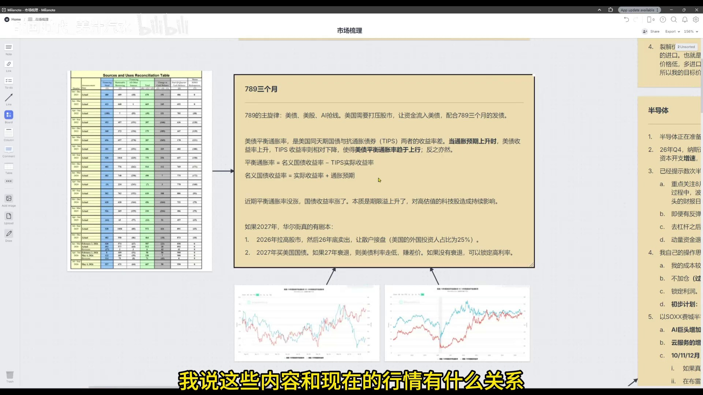

将公式写全：

$$
\text{名义国债利率} = \text{实际利率} + \text{通胀预期} + \text{期限溢价}
$$

当下情况：名义利率在上升，通胀预期没有大幅上升，现实就是实际收益率涨了、期限溢价也涨了。要看市场更担心哪个问题。如果看图表，蓝色的实际利率最近在上升——实际利率上升会对黄金有压制效果。但从2023年开始美国实际利率一直在涨黄金也在涨，为什么？因为全世界央行都知道美国在干什么——收割欧洲、收割日韩、收割其他缺美元的国家来填补国债市场上的漏洞。大家更担心的是美债是否安全，期限溢价上升了。

美国国债在2026年一整年要付8000多亿的利息，而中国吭哧吭哧生产那么多商品一年贸易顺差是将近1.2万亿。

---

## Part 4 — 黄金宏观逻辑

### Slide 41 — 黄金已计价1～2次加息 ([Video](https://www.bilibili.com/video/BV1kBgx6zEjJ/?t=1048s))

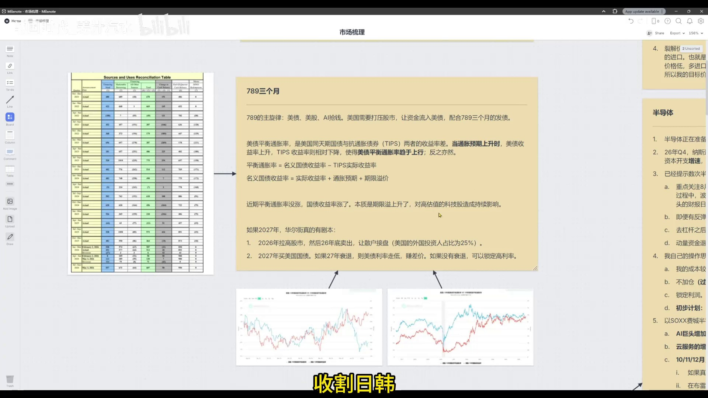

为什么出现石油价格涨、美元指数涨、美国国债利率涨、同时黄金也缓慢上涨的局面？

黄金的四小时线有两波斜率比较高的大幅下跌：一波是大非农特别好（因为世界杯原因）造成的；另一波是沃什发言造成的。这两波下跌已经计价了美联储一到两次加息。

- 加息0次 → 黄金向上反弹
- 加息1～2次 → 黄金宽幅震荡（已计价）
- 加息3次 → 黄金才会暴跌
- 明鹰暗鸽/全年不加息 → 黄金一路走高

---

### Slide 44 — 黄金与美债是对手盘 ([Video](https://www.bilibili.com/video/BV1kBgx6zEjJ/?t=1118s))

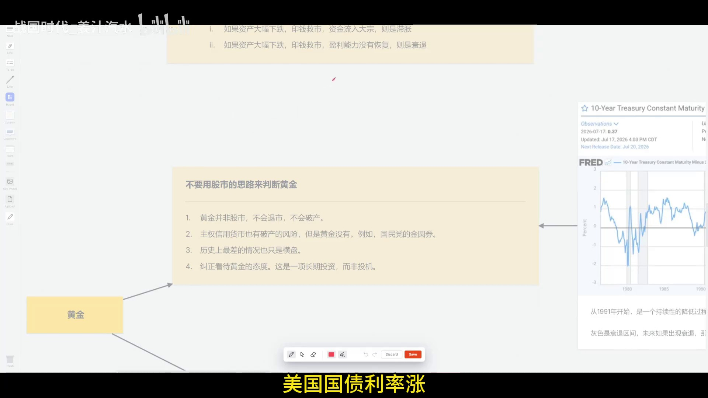

黄金最近上涨的第二个原因：美国国债利率上涨更多的是期限溢价造成的，市场不相信美债，不相信美债的人就会去买黄金。

**根本原因**：黄金和国债它是对手盘。黄金这个品种本身就是用来对冲信用货币的风险的，信用货币的底层是债务。如果你看到美国的债务不可持续，那么黄金的牛市就不会终结。

---

### Slide 48 — 美元背书=美债；中国停止购买→黄金起飞 ([Video](https://www.bilibili.com/video/BV1kBgx6zEjJ/?t=1206s))

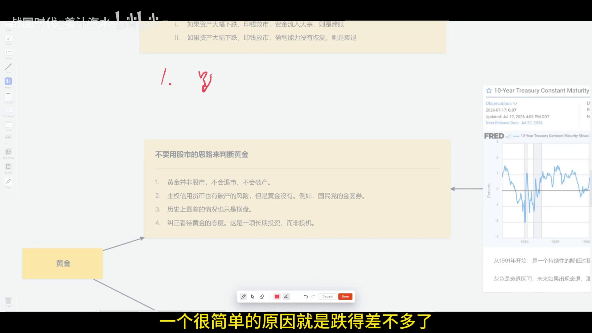

蓝色线是美国联邦债务总额一直在上涨。正常情况下黄金应该跟着美国债务总量一直走，但中间出现了长期横盘。原因是那一段时间美国经济恢复增长了，同时中国还在购买美国国债。

中国购买美债的总额在2016年形成头部开始下跌，而2016年黄金几乎是最低点，后续黄金就一路上涨。

**核心逻辑**：美元背后真正的背书不是石油，而是美债。让沙特用美元结算石油的最终目的是让沙特拿着钱去买美债。石油、矿产、芯片都只是中介。过去几十年支撑美债的实际上是中国的商品。如果搞去全球化、主动和中国脱钩，美债的信用度就会不断下降。

---

### Slide 53 — 10Y-2Y利差：黄金走势的领先指标 ([Video](https://www.bilibili.com/video/BV1kBgx6zEjJ/?t=1470s))

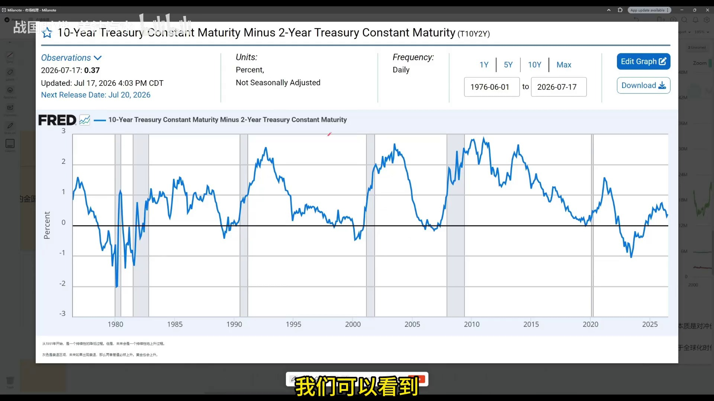

FRED图表：10-Year Treasury Minus 2-Year Treasury (T10Y2Y)，当前0.37%。

绿色线是10年期美债利率减去2年期美债利率。一般情况下这条线持续性走低的时候黄金就会横盘或被压制；这条线一旦开始走高黄金就会快速上涨。

**规律**：从1991年苏联解体以后是一个持续性走低的过程。危机爆发之后先走高（因为美国要降息扩表救市，两年期下降幅度更快→差值上升），然后持续性下跌（大家对美国恢复信心）。灰色部分是衰退区。

**减数**（10Y）= 要对冲的风险；**被减数**（2Y）= 机会成本/持有成本。两者差值决定了黄金的走势。

---

### Slide 54 — 历史验证：每次危机黄金第一个创新高 ([Video](https://www.bilibili.com/video/BV1kBgx6zEjJ/?t=1560s))

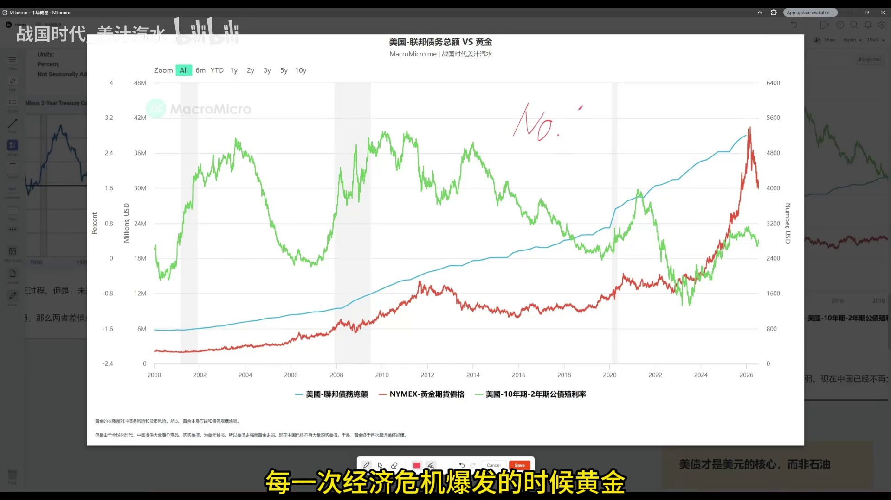

每次说27年可能会有衰退风险的时候大家都问"黄金怎么办"。看历史：

- **互联网泡沫**：美国股市一路下跌，黄金暴跌了吗？没有，黄金是第一个创新高的。
- **08年次贷危机**：股市暴跌，黄金在初期有一波下跌，但第一个创新高。
- **新冠疫情**：股市暴跌，黄金没跌还涨了，只是美国宣布加息时也下跌了一段，但后续迎来暴涨。

每一次经济危机爆发的时候黄金虽然短期内会有下跌，但总是第一个创新高的。只有等美国经济恢复了、对美债的信心恢复了，黄金才会开始横盘。

---

### Slide 58 — 黄金=终极货币：没有破产风险 ([Video](https://www.bilibili.com/video/BV1kBgx6zEjJ/?t=1776s))

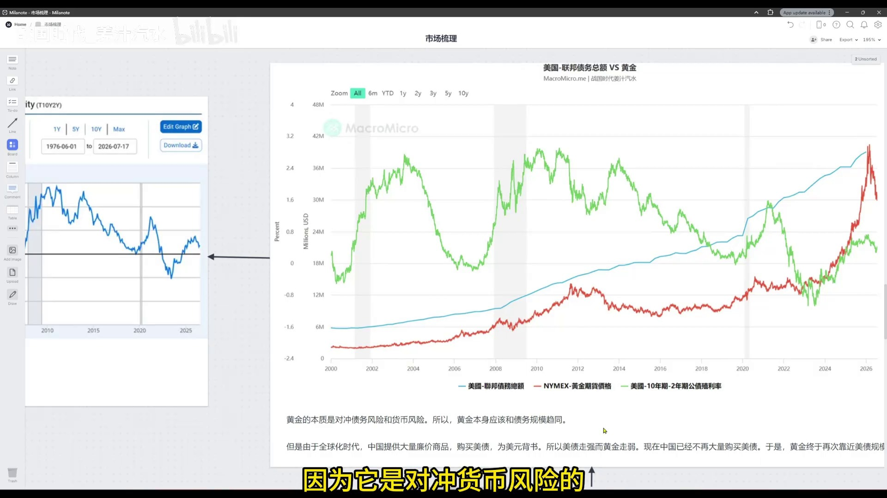

MacroMicro图表：美国联邦债务总额 VS 黄金 VS 10Y-2Y利差。

黄金的本质是对冲债务风险和货币风险，所以黄金本身应该和债务规模趋同。但由于全球化时代中国提供大量廉价商品、购买美债、为美元背书，所以美债走强而黄金走弱。现在中国已经不再大量购买美债，于是黄金终于再次靠近美债规模。

**黄金是唯一的终极货币**：所有的信用货币都有破产的风险，历史上倒台的各种政府他们的货币现在不存在了。但是所有国家都承认黄金，不管你是哪个国家总能用黄金实现兑付。黄金不是股票不会退市，没有破产的风险，是物理条件决定的终极货币。

---

## Part 5 — 黄金操作与美债终局

### Slide 62 — 黄金4H K线：短期操作思路 ([Video](https://www.bilibili.com/video/BV1kBgx6zEjJ/?t=1860s))

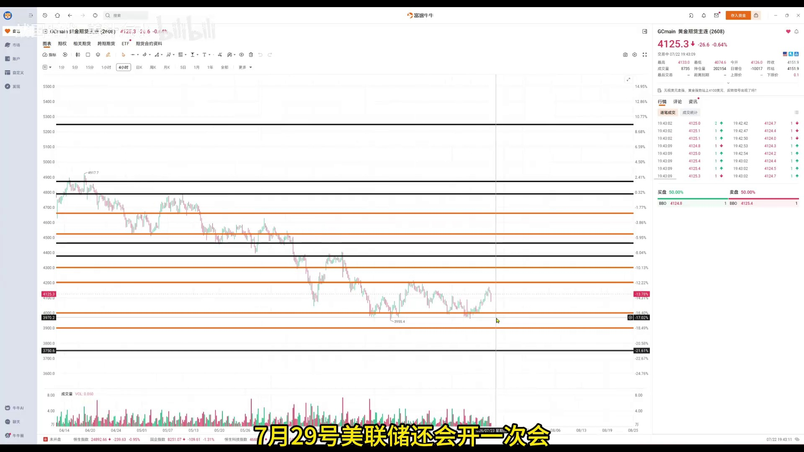

黄金期货主连(GCMaIn 2608)四小时K线图，价格4125.3。

虽然长期看好黄金，但7月29号美联储还会开一次会，有可能在会议上面再次出现一次下杀。大家现在还是要保持冷静，最好等它一次回踩的机会再买。如果沃什在会议期间再次放鹰，黄金还会有一次回踩。不用太上头，等回踩再买完全是可以的，更保险更安全。

黄金是长期投资，是这辈子必须要配置的长期投资，因为它是对冲货币风险的。它的周期本来就非常长，不要天天跟炒股票一样涨1%跌1%就难受的不行。

---

### Slide 65 — 三个风险预警回顾 ([Video](https://www.bilibili.com/video/BV1kBgx6zEjJ/?t=1916s))

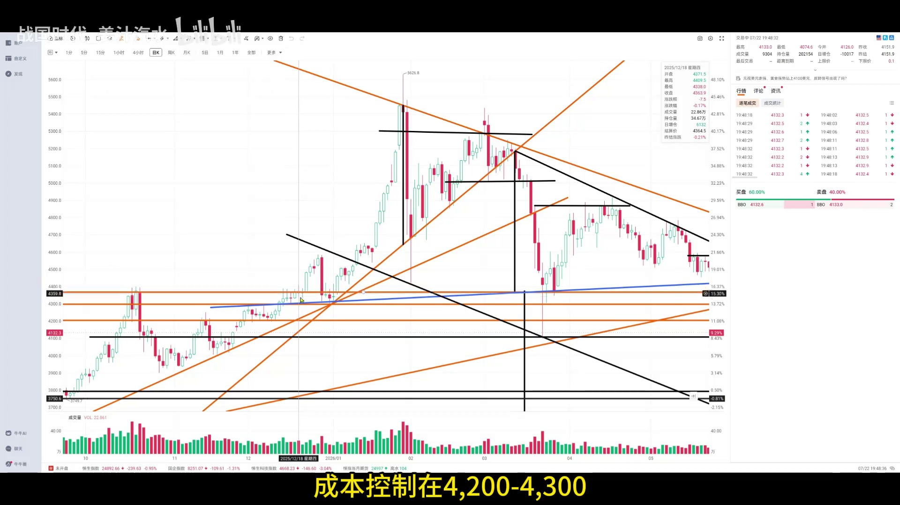

回顾2025年底到现在提示的三个重要风险点：

1. **2025年12月25日** — 开始提示控制成本，控制黄金成本在4200～4300。
2. **2026年1月26-27日** — 提示黄金短期风险（当时判断川普炸死哈梅内伊后会TKO认怂，但他选择继续打下去，所以提示多留现金注意风险）。
3. **2026年4月20-21日** — 连续发了三期视频"市场乐观而你应该悲观"，提示黄金4800要减仓。为了让所有人都能看到，这三期视频是限时免费的。

---

### Slide 69 — 黄金操作回顾：100元100元加仓到4800 ([Video](https://www.bilibili.com/video/BV1kBgx6zEjJ/?t=2000s))

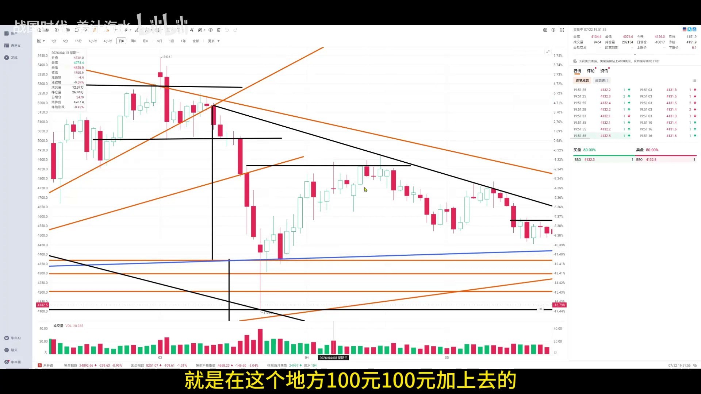

展示了黄金期货周K线图，标注了从100元开始100元100元加上去、一直加到4800左右的操作过程。三个减仓位置：1月初、中间位置、4800。

---

### Slide 71 — 美债无正常途径化债 ([Video](https://www.bilibili.com/video/BV1kBgx6zEjJ/?t=2036s))

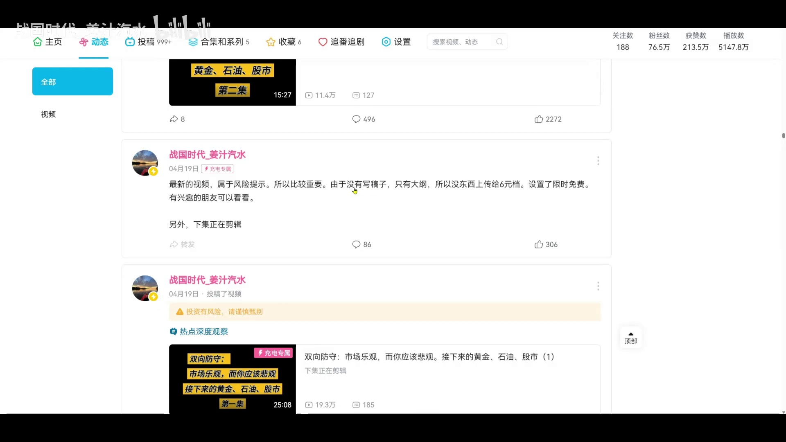

对于美国来说现在已经没有正常的途径可以化债了。

**正常途径**：提高财政收入 = 加税。
- 民主党（哈里斯）想的是加所得税（对没有实现的盈利征税）
- 川普想的是加关税（通过关税战、胁迫日韩欧洲投资美国来增加财政收入）

两种方法都是增加美国财政收入缓解美债压力，但都没有办法真正缓解。

---

### Slide 73 — 非正常手段：CPI>利率 或 GDP>利率 ([Video](https://www.bilibili.com/video/BV1kBgx6zEjJ/?t=2064s))

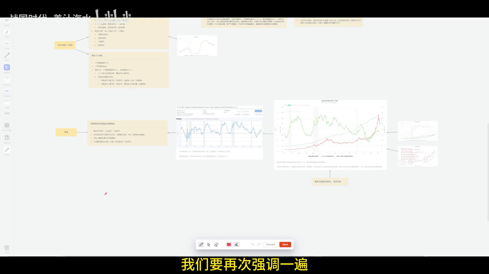

通过正常方法（加税）无法缓解美债压力，就只能通过非正常手段。核心两点：

1. **通胀化债**（等式右边下手）：让美债收益率 < CPI。比方说CPI每年4%，美债利率每年3%，4>3就会慢慢通胀化债。
2. **GDP化债**（等式左边下手）：让名义GDP > 美债利率。名义GDP就是把通货膨胀算进去。

过去美国的选择：先是通过各种AI投资拉高GDP让GDP大于国债利率——但玩砸了，因为AI吸血了太多行业，AI创造不出来那么多GDP。现在又在搞通胀发展通过石油拉高通胀——但也玩砸了，因为美债利率也在涨压不住。

---

### Slide 74 — 2027展望：YCC + 中国大量买黄金 ([Video](https://www.bilibili.com/video/BV1kBgx6zEjJ/?t=2330s))

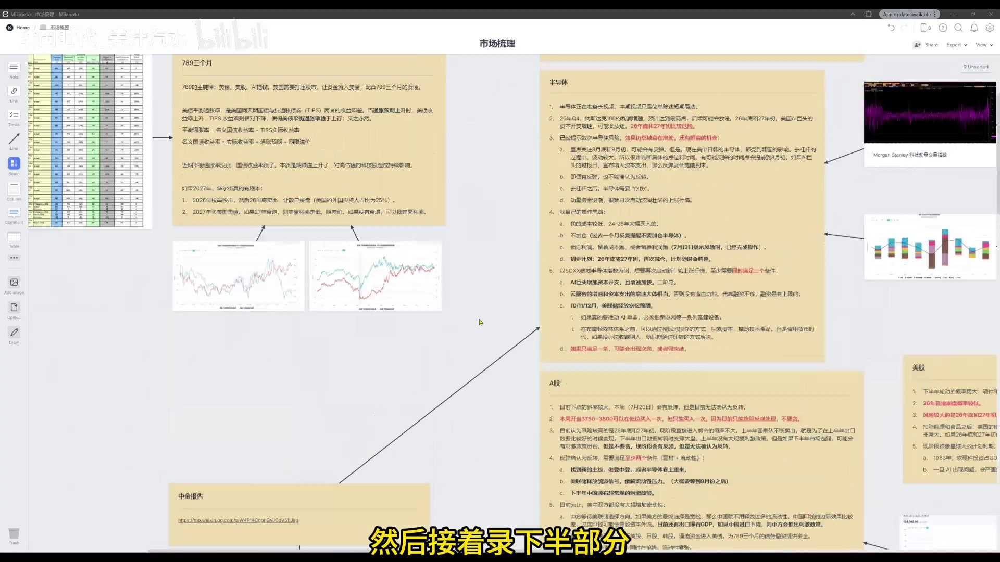

右边的方法（拉高GDP、拉高CPI）都已经尝试过了都玩砸了，那2027年要怎么做呢？要去搞左边了——用低息国债置换长息国债，或者YCC（收益率曲线控制）各种人为操作的手段可能就会出现。

这也是为什么最近一段时间中国一直在买黄金、大量的买黄金。中国的高层认为2027年美国要在左边搞事情了。

后面还剩好几个话题（石油、半导体、美股、A股），一个视频肯定说不完，下期视频再说。

---

## 核心要点总结

| 资产 | 短期策略 | 关键点位 |
|------|----------|----------|
| A股 | 3750-3800加一笔，不梭哈 | 韩国解杠杆持续影响 |
| 半导体 | 卖盈利留成本，反弹不加仓 | 26年底再次减仓 |
| WTI原油 | 85-90止盈一部分，留仓位 | 回补70缺口再加仓 |
| 农产品 | 年内高点减仓 | 豆粕3100-3200卖出 |
| 黄金 | 等回踩4050-4080再买 | 7/29 FOMC可能再砸3900 |

**789三个月主旋律**：美债、美股、AI三方抢钱 → 美国选择驱赶股市资金进入债市

**美债核心矛盾**：期限溢价上升 = 市场不信任美债 → 黄金牛市不会终结

**2027展望**：正常途径（加税）和右边（GDP/CPI）都失败 → 左边（YCC/低息置换）→ 中国大量买黄金
