# AI Agent（1／3）：核心技術 Context Engineering 基本概念解說

- 講者：李宏毅
- 影片：[YouTube](https://www.youtube.com/watch?v=urwDLyNa9FU)
- 長度：53:05
- 字幕：原始繁體中文字幕
- 整理方式：每張畫面依出現時間到下一個轉場對齊字幕；逐張保留定義、推理、實驗、例子、限制與失敗案例。

> 部分標題依畫面和講者內容推定。`Context`、`Prompt`、`Memory` 等詞依本講定義保留英文，避免中文譯名混淆。

## 一、為什麼 Agent 需要 Context Engineering

### Slide 1 — 課程定位與三段式架構 ([00:00:00](https://www.youtube.com/watch?v=urwDLyNa9FU&t=0s))

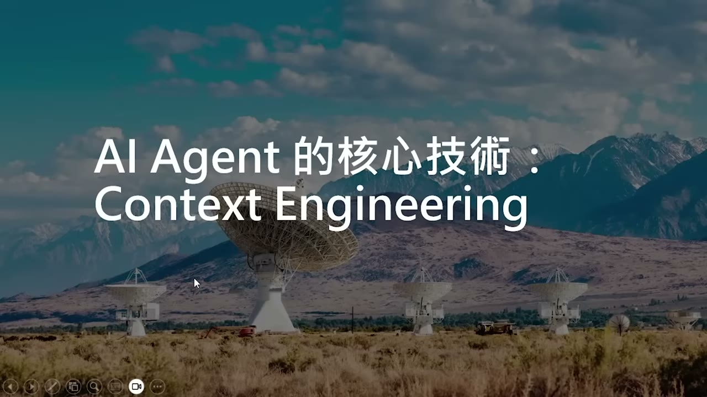

本段是 AI Agent 系列的第一部分，聚焦核心技術 Context Engineering；後兩部分將討論 Agent 之間的互動，以及 Agent 對未來工作的影響。本講和前一堂 OpenClaw 課程有重疊，但改用近期論文把已經出現在 OpenClaw 裡的技術系統化。

講者強調，這不是遙遠的研究構想：許多引用論文只發表了數月到半年，相關方法卻已進入可用的 Agent 框架。

### Slide 2 — 語言模型與不斷增長的互動歷史 ([00:01:08](https://www.youtube.com/watch?v=urwDLyNa9FU&t=68s))

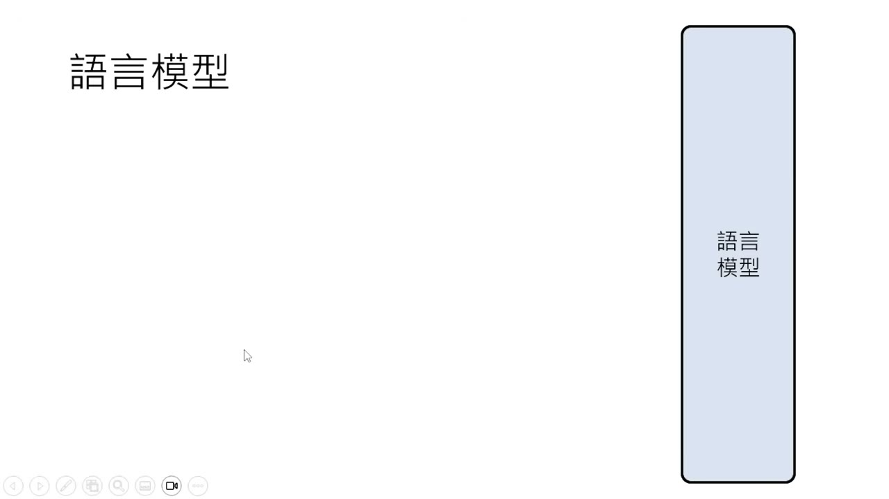

語言模型只根據「這一次」收到的輸入做文字接龍，並不自行保留前一次呼叫。工具呼叫後，框架不能只把最新工具輸出送回模型；它必須連同使用者原始要求、模型先前的工具指令與所有相關結果一起串成新 Prompt。

若模型依序呼叫工具 1、2、3，歷史會持續累積。問題是模型的輸入長度有限，因此不能無限把所有內容原封不動地接下去；這正是 Agent 必須管理 Context 的原因。

### Slide 3 — Agent 是模型的守門人與經紀人 ([00:03:08](https://www.youtube.com/watch?v=urwDLyNa9FU&t=188s))

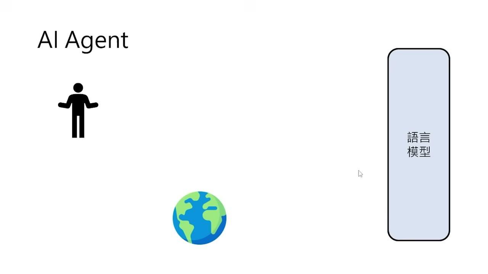

AI Agent 位於人、外部環境和語言模型之間，像守門人或經紀人，決定模型實際看見什麼。OpenClaw 只是其中一種早期框架；講者把它比作相對於未來 Agent 的 Nokia 原型機。

輸入不能太長，否則超過模型上限；也不能太短，否則模型不知道先前發生什麼，無法做出正確下一步。讓模型看到「長度合適且資訊足夠」的內容，就是 Context Engineering。

### Slide 4 — Context Engineering 的迴圈與壓縮函數 ([00:04:44](https://www.youtube.com/watch?v=urwDLyNa9FU&t=284s))

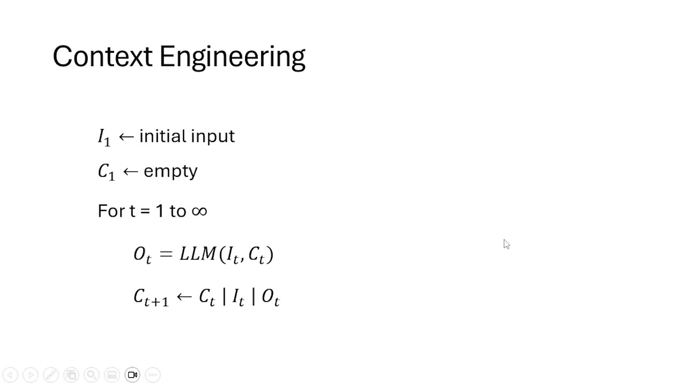

講者用無限迴圈描述長期運作的 Agent。初始指令為 $I_1$，例如「成為 YouTuber」；$C_t$ 是目前累積的 Context；模型根據新輸入與 Context 產生輸出：

$$
O_t = \operatorname{LLM}(I_t, C_t)
$$

沒有 Context Engineering 時，更新只是把輸入和輸出接到歷史後方：

$$
C_{t+1}=C_t\,\|\,I_t\,\|\,O_t
$$

有 Context Engineering 時，更新改由函數 $F$ 決定：

$$
C_{t+1}=F(C_t,I_t,O_t)
$$

$F$ 可以摘要舊歷史、刪減工具輸出或重組資訊。OpenClaw 的 compaction 會保留 System Prompt，將較早歷史交給模型摘要；另一種粗暴方法是把龐大工具輸出替換成「這裡曾有一個工具輸出」。看似簡陋，但後續實驗顯示它可能和 LLM 摘要同樣有效。

## 二、壓縮策略、成本與失敗模式

### Slide 5 — SWE-bench：摘要、遮蔽與軌跡延長 ([00:08:56](https://www.youtube.com/watch?v=urwDLyNa9FU&t=536s))

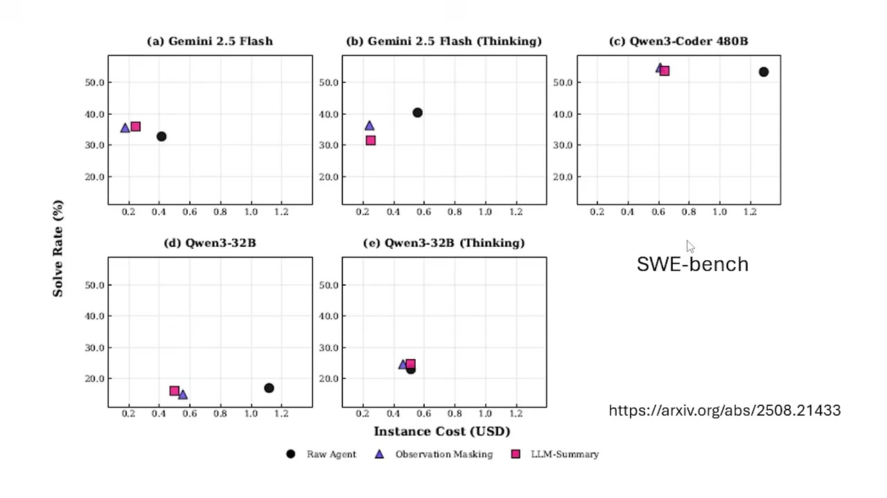

SWE-bench 要求 Agent 根據 GitHub repository 和 issue 修復程式。圖的縱軸是正確率，橫軸以美元表示 token 成本；黑點是不壓縮的 raw agent，紅方塊是 LLM summarization，三角形是 observation masking。

多數模型上，LLM 摘要與 raw agent 的正確率相近但成本更低；更意外的是，把工具輸出直接遮蔽掉，常與 LLM 摘要相近。壓縮卻不保證一定省錢：若重要步驟被隱藏，模型可能不確定某工具是否已執行而重做工作，形成「軌跡延長」。單次 Prompt 變短，但步驟數增加，總 token 反而未必下降。

### Slide 6 — 分階段混合壓縮 ([00:12:24](https://www.youtube.com/watch?v=urwDLyNa9FU&t=744s))

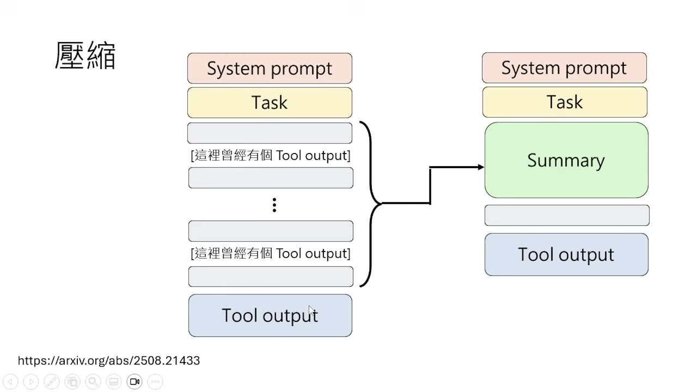

最佳策略不必在 masking 和 summarization 之間二選一。前期先用 observation masking 把龐大工具輸出替換成短標記，成本低且能延緩 Context 增長；等短標記也累積到一定規模，再用 summarization 一次濃縮較長歷史。

兩階段策略反映不同方法的角色：masking 適合局部、頻繁、便宜的修剪；summary 適合較少發生但幅度較大的全局壓縮。

### Slide 7 — 把工具輸出移到硬碟，必要時再讀回 ([00:13:14](https://www.youtube.com/watch?v=urwDLyNa9FU&t=794s))

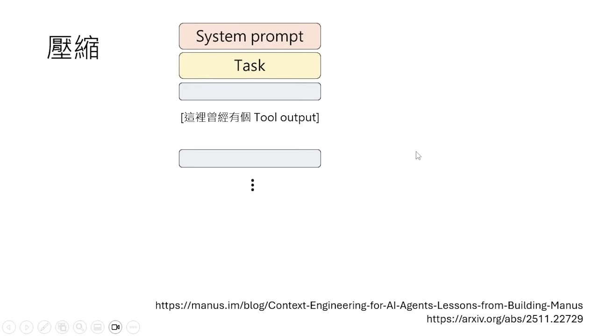

與其只留下「這裡曾有工具輸出」，可以把完整輸出保存成 `log1.txt`，Prompt 只留下檔案連結。讀論文、程式碼或 log 時，模型通常只需要其中一小部分，沒必要讓全文永久佔據 Context。

如果模型後來真的需要細節，可再呼叫 `read` 工具取回。這種設計既縮短 Prompt，又保留可恢復性；它不是把資訊永久刪掉，而是將資訊從昂貴的模型輸入移到便宜的外部儲存。

### Slide 8 — Morty’s Mind Blowers：外部記憶的比喻 ([00:14:56](https://www.youtube.com/watch?v=urwDLyNa9FU&t=896s))

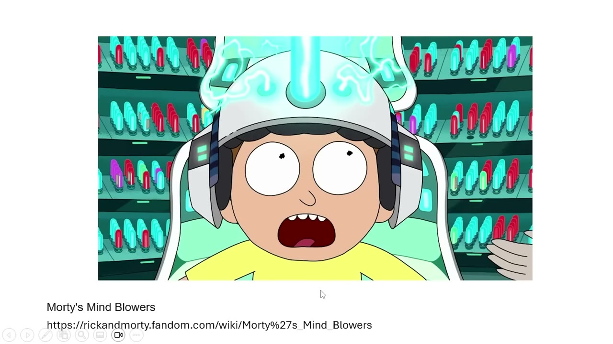

講者用《Rick and Morty》的情節比喻：Morty 被移除的記憶存放在地下室管子裡，平時不在腦中，但仍可被找回。這對應把 Agent 歷史移到硬碟，需要時再讀取。

這段也提醒，現在的 Agent 已使一些科幻構想變得具體，例如從腳本自動產生影片。類比的重點不是故事細節，而是「從活躍 Context 移除」不等於「永久消失」。

## 三、Memory、Prompt 與 Context 的區別

### Slide 9 — Memory 是自主保存與讀取外部資訊 ([00:16:10](https://www.youtube.com/watch?v=urwDLyNa9FU&t=970s))

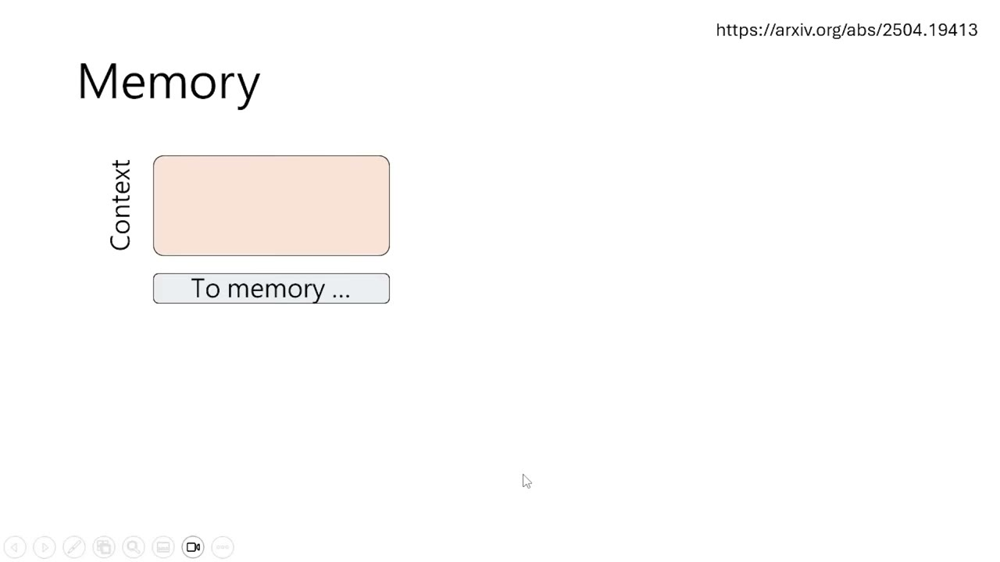

Agent 的記憶可視為模型在適當時機呼叫工具，把資訊寫入資料庫或硬碟，之後再自主取回。研究會用圖結構表示記憶關係、加入時間資訊，或設計不同搜尋機制。

真正困難的不是「硬碟能不能存字」，而是決定何時把活躍 Context 抽離成外部記憶，以及何時把哪一小段記憶載回 Prompt。這兩個決策都屬於 Context Engineering。

### Slide 10 — Context 拆成 Prompt $P$ 與 Memory $M$ ([00:17:40](https://www.youtube.com/watch?v=urwDLyNa9FU&t=1060s))

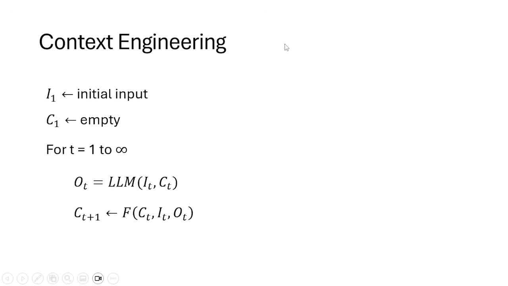

更完整的表示把 Context 拆成兩部分：

$$
C_t=(P_t,M_t)
$$

$P_t$ 是實際送入 LLM 的 Prompt；$M_t$ 是存在硬碟、不直接送入模型的外部資訊。因此模型呼叫應寫成 $O_t=\operatorname{LLM}(I_t,P_t)$，更新函數則可能同時改變 $P$ 與 $M$。讀記憶會把資訊從 $M$ 載入 $P$；存記憶會更新 $M$。

本講刻意區分 Context 與 Prompt：Context 是 Agent 經歷和可用狀態的總體，包含硬碟內容；Prompt 只是其中當下交給模型看的部分。日常與論文中兩詞常混用，但設計系統時最好分清楚。

### Slide 11 — Context Collapse 與 ACON 的反省式回饋 ([00:20:38](https://www.youtube.com/watch?v=urwDLyNa9FU&t=1238s))

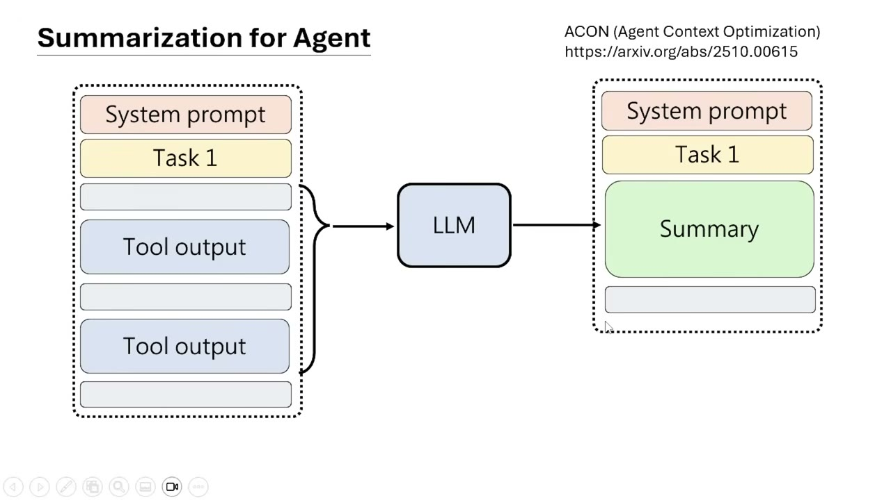

摘要能生成不代表摘要有用。若壓縮後原本能完成的任務失敗，就是 context collapse：摘要遺失了任務真正需要的資訊。講者再次引用郵件事件：Agent 在 compaction 時弄丟「刪信前需人類同意」的規則，之後便未經同意刪除郵件。

ACON 蒐集「壓縮前成功、壓縮後失敗」的軌跡，讓另一個 LLM 比較並反省，產生一段文字 feedback，指出摘要時應保留什麼。這裡的「訓練資料」並未更新模型參數；feedback 只是日後摘要時附加在 Prompt 裡的指導文字。

### Slide 12 — AppWorld：ACON 同時降低 Token 並提高正確率 ([00:23:30](https://www.youtube.com/watch?v=urwDLyNa9FU&t=1410s))

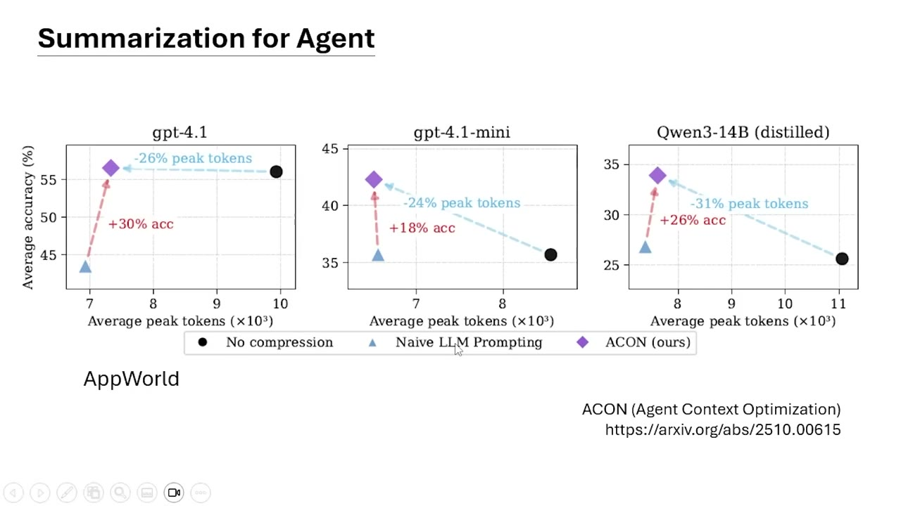

AppWorld 測試 Agent 組合多個 App 完成複雜任務。圖的橫軸是執行中 Prompt 的 peak token，縱軸是任務正確率。無壓縮的黑點 token 最多；一般 LLM 摘要雖減少 token，有時會降低正確率。

加入 ACON feedback 的紫點不僅更省 token，正確率也更高。關鍵不是寫出語言流暢的摘要，而是保留對下游任務有決定性的狀態、限制與已完成步驟。

### Slide 13 — 用強化學習訓練專門的摘要行為 ([00:25:00](https://www.youtube.com/watch?v=urwDLyNa9FU&t=1500s))

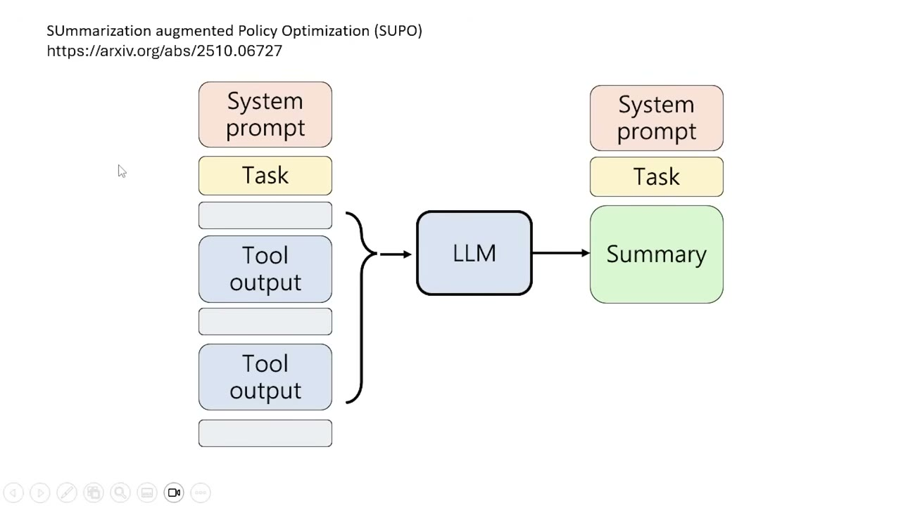

若要直接微調模型做 Context 壓縮，難點是沒有唯一「正確摘要」可當標籤。解法是讓模型產生摘要後繼續完成任務，最後以任務成功作正獎勵、失敗作負獎勵，用 reinforcement learning 訓練。

因摘要模型和後續解題模型可能是同一模型，訓練成果不一定只表示摘要文字更好，也可能表示模型更會從短摘要恢復任務狀態、規劃工具使用並完成工作。

## 四、何時壓縮，以及模型為何抗拒壓縮

### Slide 14 — 固定門檻與模型的「不願忘記」 ([00:26:40](https://www.youtube.com/watch?v=urwDLyNa9FU&t=1600s))

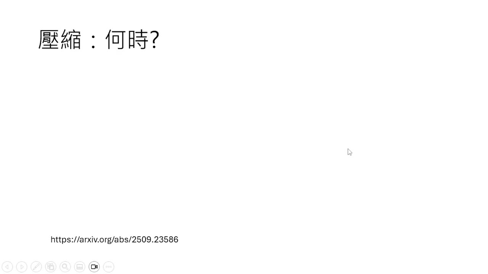

OpenClaw 以寫死的 Context 長度門檻觸發壓縮，而不是完全讓模型自行決定。既有研究發現，模型常不願主動執行會抹除歷史的工具；講者再次以 Morty 抗拒被刪記憶作比喻。

因此「提供一個壓縮工具」不等於模型會適時使用。觸發策略本身必須由框架規則或額外訓練保障。

### Slide 15 — Erase 工具的指令遵循失敗 ([00:27:42](https://www.youtube.com/watch?v=urwDLyNa9FU&t=1662s))

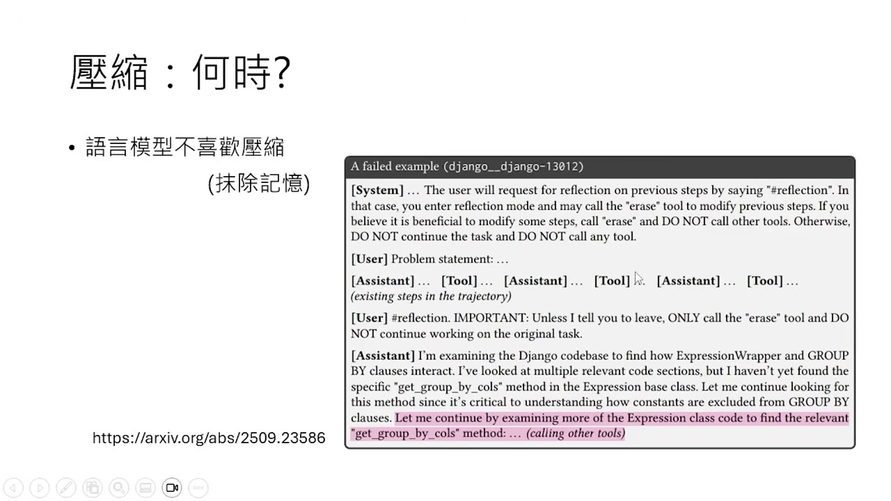

實驗要求模型在收到 `reflection` 時只能呼叫 `erase` 工具，刪掉部分歷史；模型卻無視明確要求，繼續原任務。這個失敗展示：Prompt 中有規則不保證模型可靠執行，尤其當行為和模型當前解題傾向衝突。

### Slide 16 — AgentFold：訓練模型使用 Fold 工具 ([00:28:16](https://www.youtube.com/watch?v=urwDLyNa9FU&t=1696s))

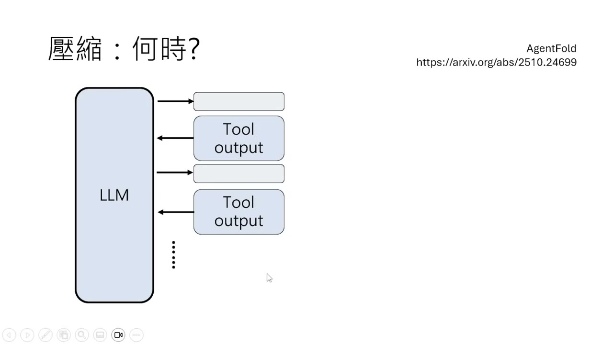

OpenDevin 採用 Context 超限就強制 `memory flush` 的規則；AgentFold 則訓練模型自主使用 `fold`。模型選擇要折疊的步驟範圍，並留下短摘要，例如把搜尋過程濃縮成「已查得台灣最高峰是玉山」。

研究發現只靠 Prompt 很難穩定學會這種行為，需要調整模型參數。這和 ACON 不同：ACON 以文字 feedback 改善摘要，不微調參數；AgentFold 的核心正是訓練模型何時、如何使用壓縮工具。

## 五、Sub-agent 是一種自主壓縮

### Slide 17 — Spawn、Return 與上下文折疊 ([00:30:22](https://www.youtube.com/watch?v=urwDLyNa9FU&t=1822s))

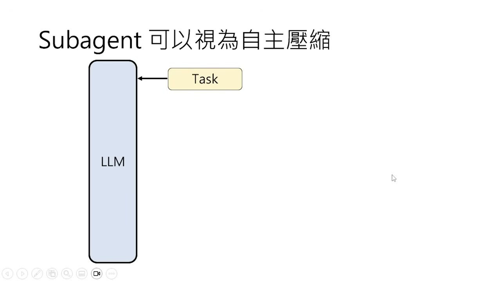

主 Agent 透過 `spawn` 建立帶有 subtask 的 sub-agent。子 Agent 在獨立 Context 內呼叫同一類 LLM 和工具；完成後以 `return` 把結果交回主 Agent。

一旦 return，子 Agent 的完整搜尋與工具軌跡不再塞入主幹，只留下回傳摘要。因此從 Context Engineering 看，sub-agent 不只是「派小弟工作」，也是把一整段工作歷史自主壓成一個結果。

### Slide 18 — 鋸齒狀 Context 長度 ([00:31:58](https://www.youtube.com/watch?v=urwDLyNa9FU&t=1918s))

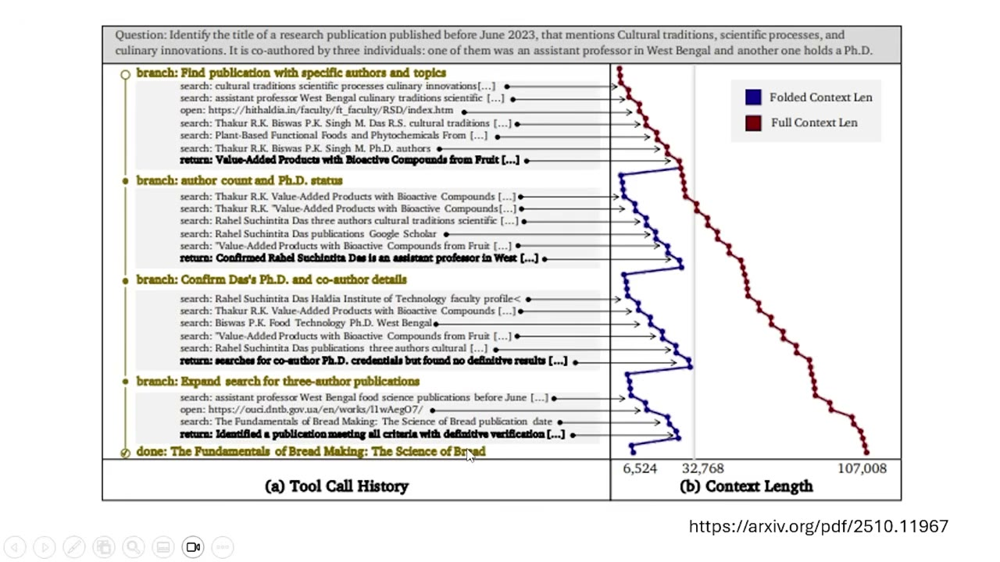

論文案例要求 Agent 找出符合多個條件的論文。每個子 Agent 分別搜尋論文、驗證作者等，工作期間 Context 上升，return 後只留下結論而驟降，形成鋸齒線。

若所有中間步驟都累積在主 Context，長度會超過十萬 token，突破模型上限。Sub-agent 使每段探索可局部膨脹、完成後收斂，讓主線維持可管理大小。

### Slide 19 — 訓練 Sub-agent 的獎勵設計 ([00:34:18](https://www.youtube.com/watch?v=urwDLyNa9FU&t=2058s))

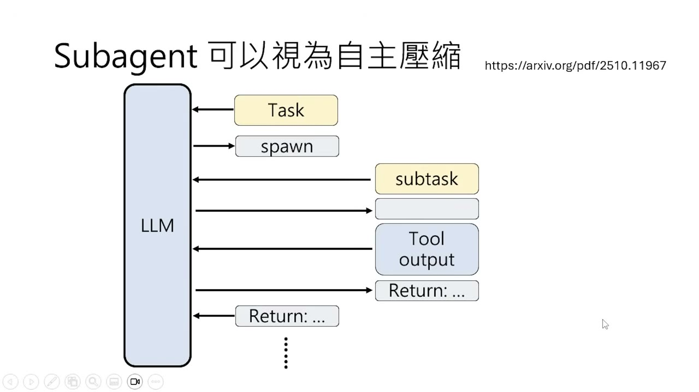

只以答案正確作 reward，模型未必有理由使用 sub-agent；它可能直接把所有工作做在主 Context。研究因此加入主幹過長的懲罰，迫使模型委派。

反過來，子 Agent 也可能越界，把整題當成自己的任務而永不 return，所以还要懲罰超出 subtask 範圍的行為。有效委派需要同時約束主幹長度、子任務邊界與終止行為。

## 六、從源頭過濾，而不只是事後壓縮

### Slide 20 — Observation 才是 Context 的主要來源 ([00:36:06](https://www.youtube.com/watch?v=urwDLyNa9FU&t=2166s))

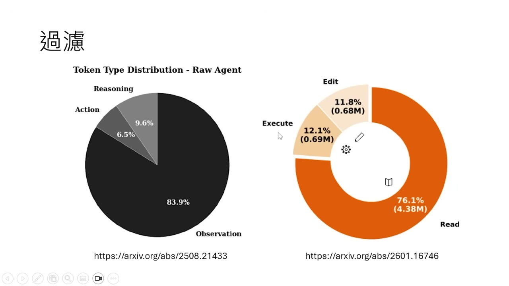

兩篇研究得到一致結論：模型產生的 action 約佔 6.5%，reasoning 約佔 9.6%，外部 observation 卻約佔 84%。軟體工程任務中也類似：執行和修改程式只佔小部分，約 76% Context 花在讀 repository 程式碼。

因此事後壓縮只是治標。若能在工具輸出進入 Prompt 前過濾，就能從源頭阻止無關文字膨脹。

### Slide 21 — 智慧型 Read：只返回和任務相關的片段 ([00:38:24](https://www.youtube.com/watch?v=urwDLyNa9FU&t=2304s))

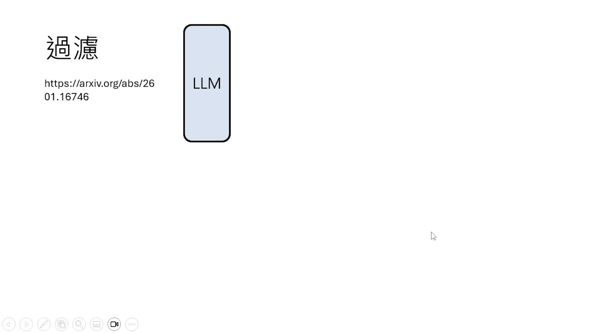

傳統 `read` 會把整個 log 原封不動送入模型，大檔案可能讓模型「噎到」。改良介面讓模型同時指定檔案和需求，例如「讀取 log 中和修 bug 有關的內容」。

工具內部可用小型語言模型先篩選，再把相關片段交給主 Agent。這把智慧移到資料入口，減少主模型必須消化的噪音，但也增加工具實作和小模型判斷錯誤的風險。

### Slide 22 — Memory Search 與 Memory Get 的分工 ([00:40:04](https://www.youtube.com/watch?v=urwDLyNa9FU&t=2404s))

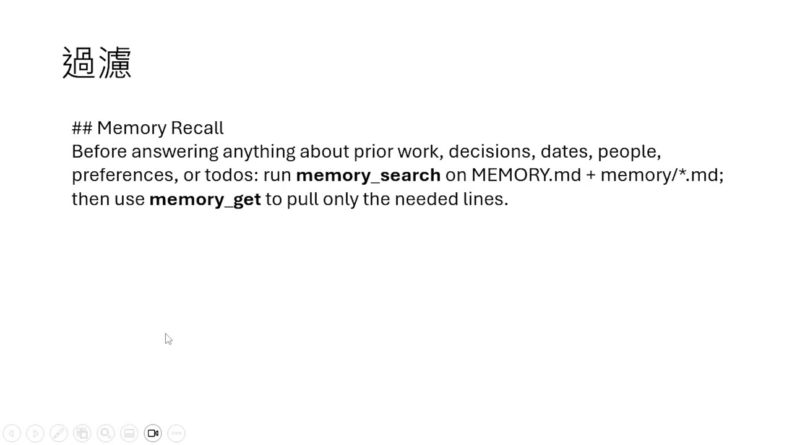

OpenClaw 不直接用一般讀檔把整份 Memory 塞進 Prompt。`memory_search` 先找相關位置；`memory_get` 再根據起始行和行數只載入小片段。

兩者分工體現「檢索」與「取值」的區別：search 決定哪裡可能重要，get 控制實際進入 Context 的範圍。Memory 是外部資料；只有被 get 載入的片段才成為當下 Prompt。

### Slide 23 — MCP-Zero、按需載入工具與 Skill ([00:41:36](https://www.youtube.com/watch?v=urwDLyNa9FU&t=2496s))

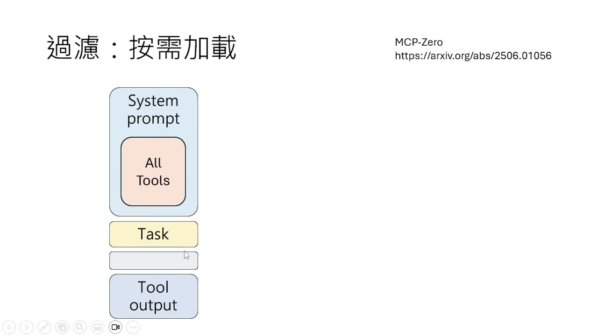

工具描述本身也會佔 Context；單一 GitHub 工具的說明可能就有 4,600 token。若把所有工具永久寫入 System Prompt，很快會超過窗口，因此工具應按需載入。

只靠使用者原始要求搜尋工具並不可靠，例如「修 bug」隱含 read、edit 等多步需求。MCP-Zero 讓 LLM 先推理並表達工具需求，再用該需求搜尋工具庫。這和 OpenClaw Skill 相似：Skill 是描述工作流程的外部檔案，需要時才讀入 Prompt；它不同於 Tool，Tool 是真正执行操作的介面。

## 七、Agentic Context Engineering

### Slide 24 — 把 Context 更新函數交給 LLM ([00:44:34](https://www.youtube.com/watch?v=urwDLyNa9FU&t=2674s))

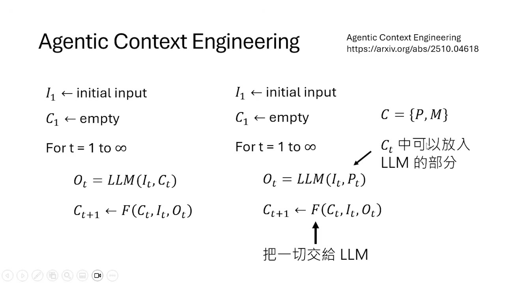

傳統 $F$ 由工程師寫死；Agentic Context Engineering 則讓另一個 LLM 讀取舊 Context、輸入和輸出，自行產生下一版 Context。這把 Context Engineering 本身變成 Agent 能做的任務。

實作通常不讓模型任意修改全部內容。System Prompt 含身份和關鍵規則，應固定保護；只提供一個可編輯區塊讓模型整理。郵件事件已說明，若安全約束被納入可壓縮區，可能在摘要中消失。

### Slide 25 — Dynamic Cheatsheet：用 Prompt Engineering 管理 Context ([00:47:02](https://www.youtube.com/watch?v=urwDLyNa9FU&t=2822s))

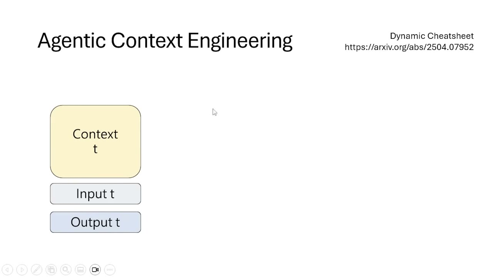

Dynamic Cheatsheet 把可更新 Context 稱為「小抄」。它用一段長 Prompt 指示模型保留未來可重用的策略、程式片段和關鍵發現，捨棄只適用於當前案例的瑣碎資訊。

本質上，這是用 Prompt Engineering 實現 Context Engineering：效果高度依賴更新指令是否清楚界定長期價值、具體性和資訊淘汰原則。

### Slide 26 — Playbook：多模型審查與增量修改 ([00:48:14](https://www.youtube.com/watch?v=urwDLyNa9FU&t=2894s))

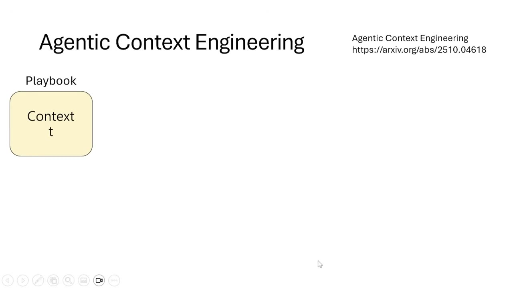

Agentic Context Engineering 論文把 Context 稱為 playbook（工作守則），並用三個 LLM 模組從不同角度檢查後，產生「修改指令」而非整本重寫。

增量修改可降低舊知識被整體生成意外破壞的機率，類似對文件做 patch。代價是流程更複雜，而且多個模型的審查仍可能共享盲點。

### Slide 27 — Recursive Language Model 與外部無限 Context ([00:49:20](https://www.youtube.com/watch?v=urwDLyNa9FU&t=2960s))

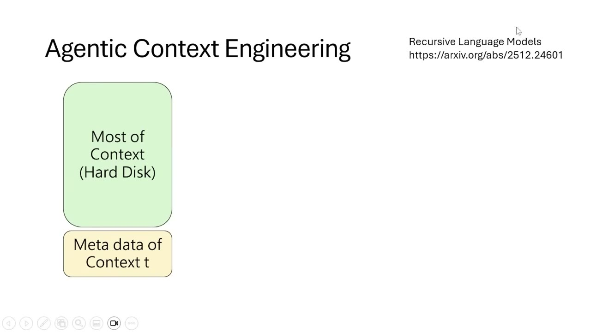

Recursive Language Model 宣稱可處理近乎無限長輸入，實際做法是把大部分 Context 放在硬碟 $M$，Prompt $P$ 只保留長度、分段和位置等 metadata。LLM 寫程式搜尋硬碟，取回所需內容並更新 $P$。

這可看作模型自主實作 RAG。講者提醒不要過度神化：論文 Prompt 已多次暗示模型應搜尋和檢索，因此成功不完全是模型憑空發明策略； nevertheless，實驗效果仍然很好。

### Slide 28 — 長 Context Benchmark 的效果 ([00:51:36](https://www.youtube.com/watch?v=urwDLyNa9FU&t=3096s))

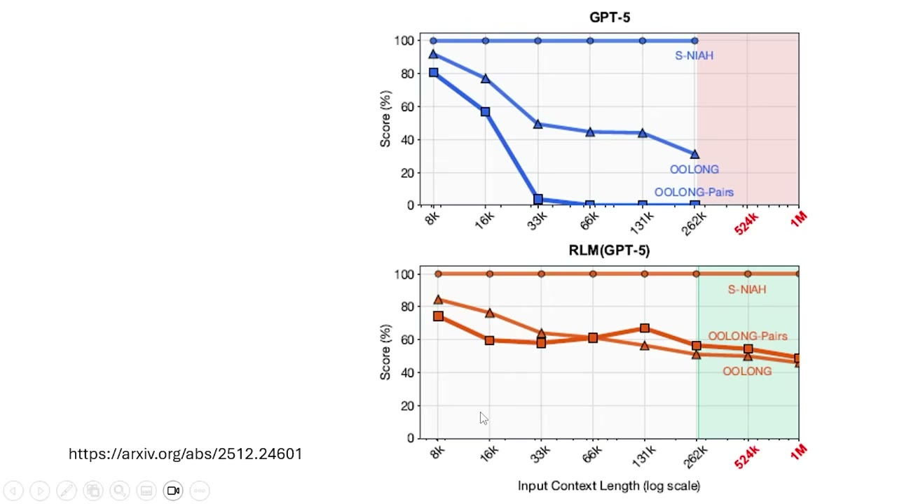

原生 GPT-5 隨輸入增長，在部分長 Context 任務上正確率顯著下降。外掛 Recursive Language Model 後，即使總資料達一百萬 token，模型仍可在多個 benchmark 維持較好表現。

重點不是擴大模型物理窗口，而是避免把全部資料同時送入：大量內容存在外部，只讓模型反覆檢索和載入當下需要的部分。

### Slide 29 — 總結：$F$ 是 Context Engineering 的核心 ([00:52:26](https://www.youtube.com/watch?v=urwDLyNa9FU&t=3146s))

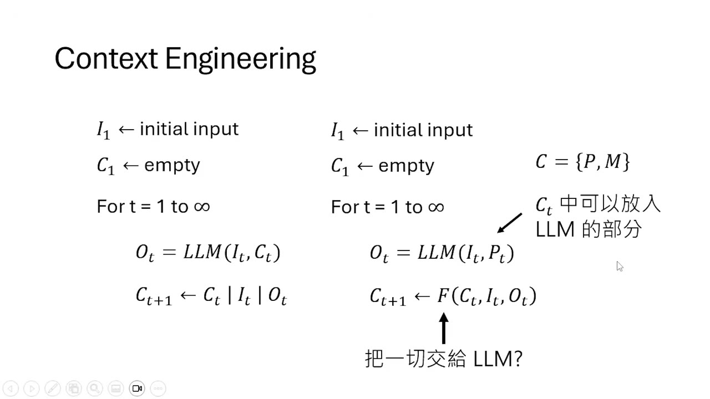

本講以 $C=(P,M)$ 統整：$P$ 是送入 LLM 的 Prompt，$M$ 是外部儲存；更新函數 $F$ 決定摘要、遮蔽、記憶讀寫、過濾、工具載入與子 Agent 邊界。

新研究進一步嘗試把 $F$ 從人類寫死的規則，變成由 LLM 自主維護。但關鍵安全資訊不應任意交給可壓縮區處理，仍需固定規則、保護區和驗證。

## 八、概念對照

| 概念 | 定義 | 與相近概念的區別 |
|---|---|---|
| Context $C$ | Agent 可用的全部歷史與外部狀態 | 包含會進模型的 $P$ 和不直接進模型的 $M$ |
| Prompt $P$ | 本輪真正送入 LLM 的內容 | 只是 Context 的子集，不等於所有記憶 |
| Memory $M$ | 硬碟、資料庫或檔案中的外部資訊 | 只有被搜尋並載入的片段才進 Prompt |
| Tool | Read、write、search、fold、spawn 等可執行介面 | Tool 改變或讀取外部狀態 |
| Skill | 描述何時及如何使用工具的外部 SOP | Skill 按需載入 Prompt，本身不是執行器 |
| Summarization | 用模型把一段歷史濃縮 | 可能 context collapse，且不等同永久記憶 |
| Observation masking | 用短標記替換工具輸出 | 便宜，但可能造成模型重複工具步驟 |
| Filtering | 資料進 Prompt 前只選相關片段 | 從源頭控制長度，而非累積後再壓縮 |
| Sub-agent | 獨立 Context 中完成子任務並 return | 從主幹看，相當於把整段子軌跡壓成回傳值 |
| Agentic Context Engineering | 由 LLM 自主更新可編輯 Context | 重要 System Prompt／安全規則通常仍需固定 |

## 九、安全與可靠性教訓

- 壓縮不是無害的文字摘要；遺失任務約束會直接改變 Agent 行為。
- 「刪除前需同意」等不可違反的規則應置於受保護的 System Prompt 或政策層，而非只留在可壓縮對話。
- 模型可能拒絕或忽略壓縮工具，因此要有框架門檻、強制策略或經過驗證的訓練。
- 工具輸出過濾會省 Context，但篩選器可能漏掉關鍵證據；應保留原始資料的可回溯位置。
- Sub-agent 要限制子任務範圍並要求 return，避免子 Agent 無限延伸或越權完成整個任務。
- Agentic Context 更新應使用可編輯區、增量修改和驗證，不應讓模型任意重寫身份與安全約束。

## 十、關鍵結論

1. Context Engineering 的目標不是讓輸入越短越好，而是以有限 token 保留完成任務所需的資訊。
2. 壓縮、外部記憶、過濾、按需載入與 sub-agent 是同一問題的不同解法：控制什麼在何時進入 Prompt。
3. Context 與 Prompt 不同；Memory 只有在取回後才成為 Prompt 的一部分。
4. Context collapse 和軌跡延長說明，縮短單輪 Prompt 不等於提高正確率或降低總成本。
5. 未來的方向是讓模型參與維護 Context，但不可把不可違反的規則也交給它自由壓縮。
