# AI Agent (3／3)：AI Agent 對於工作帶來的衝擊 - 以學術研究為例

- 講者：李宏毅
- 影片：[YouTube](https://www.youtube.com/watch?v=VqB8zMujdjM)
- 長度：23:55
- 字幕：原始繁體中文字幕

本講探討 AI Agent 如何改變學術研究工作，並區分目前已能高度自動化的執行工作，與仍仰賴人類判斷的問題選擇、實驗設計和品質控制。原始時間資訊保存在 `source/transcript.txt` 與 `slides/index.csv`。

## 一、AI 從工具走向自主代理

### Slide 1 — AI Agent 對工作帶來的衝擊 ([Video](https://www.youtube.com/watch?v=VqB8zMujdjM&t=0s))

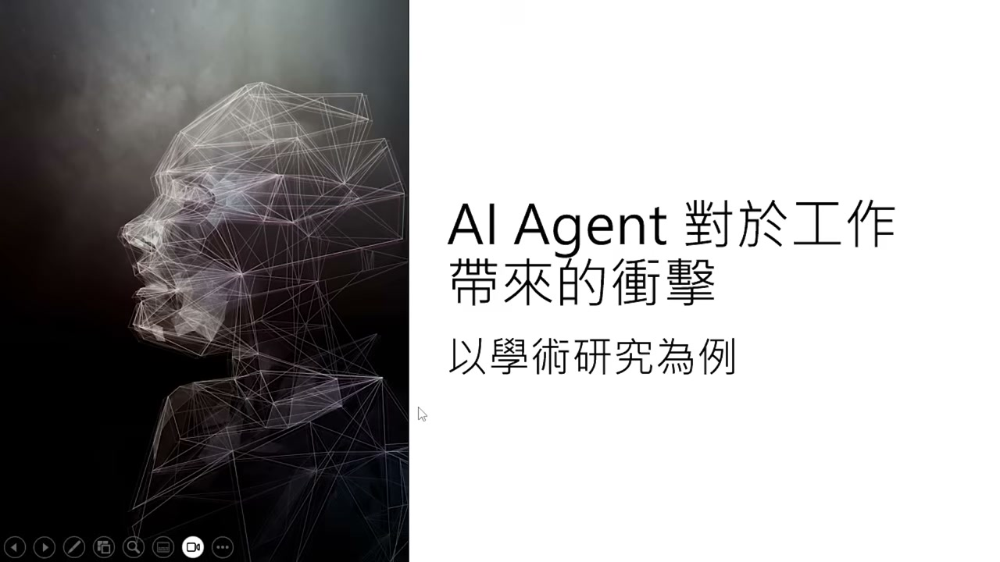

本講以學術研究為例，討論 AI Agent 對未來工作的衝擊。重點不是單純比較人與模型誰更快，而是觀察工作分工、品質控制與人類角色如何重新配置。

### Slide 2 — AI 的角色：工具、協作夥伴、代理 ([Video](https://www.youtube.com/watch?v=VqB8zMujdjM&t=12s))

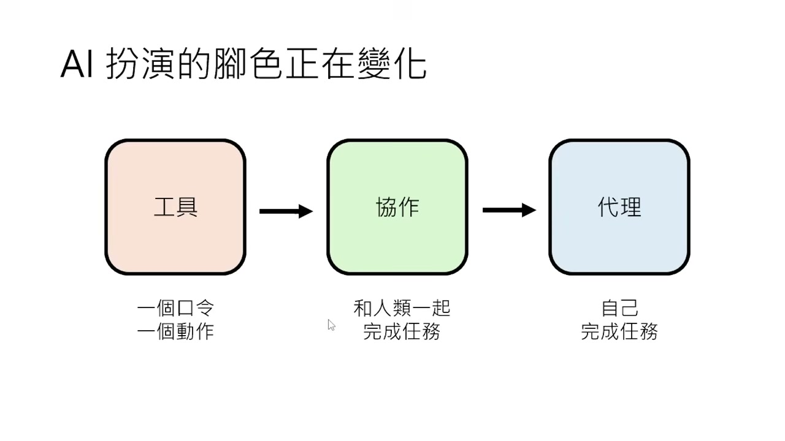

AI 的角色正從「工具」轉成「協作夥伴」，再進一步成為可自行完成任務的「代理」。工具遵循一個口令做一個動作；協作模式由人與 AI 共同完成任務；Agent 則具有更高自主性。真正關鍵仍是誰決定任務目標，以及如何驗證代理完成的結果。

## 二、AI 寫論文與自主做研究

### Slide 3 — Claude Code 能否獨立寫論文？ ([Video](https://www.youtube.com/watch?v=VqB8zMujdjM&t=43s))

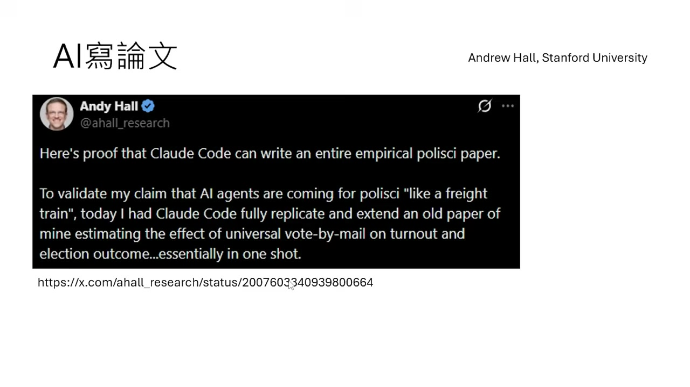

Stanford 政治經濟學教授 Andrew Hall 讓 Claude Code 延伸一篇既有研究：讀取舊論文、沿用原分析方法，改用新的美國大選資料重做分析並寫成論文。這不是從零提出全新研究問題，而是高度明確、指導教授式的任務規格；因此案例同時證明了執行能力，也提醒我們不要把「延伸既有研究」誤解為全自主科研。

### Slide 4 — 「100 倍研究機構」：速度、成本與錯誤 ([Video](https://www.youtube.com/watch?v=VqB8zMujdjM&t=80s))

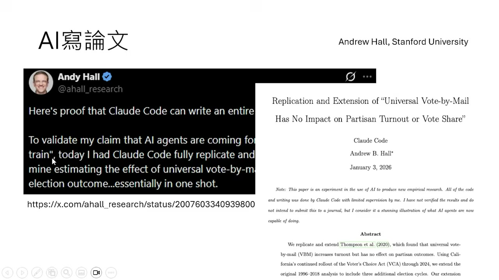

同一任務中，Claude 約一小時、成本約 10 美元；博士生約 16 小時、估計成本至少 1000 美元。人類結果略好，Claude 也貼錯一筆資料。案例的正確結論不是「AI 已完全取代研究者」，而是研究流程可能改成 AI 大量生成、人類檢查，或多次獨立執行後交叉驗證。總成本必須把錯誤風險與驗證工時算進去。

### Slide 5 — AI 覆蓋研究流程：文獻、實驗與研究點子 ([Video](https://www.youtube.com/watch?v=VqB8zMujdjM&t=134s))

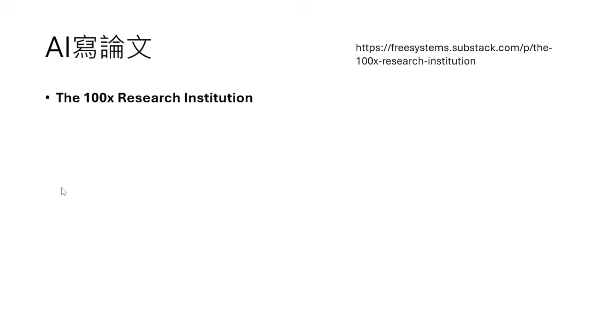

AI 已可介入研究的多個階段：整理文獻與資料、依規格寫作、修改訓練程式、反覆跑實驗，甚至產生研究題目。Karpathy 的 autoresearch 讓 Agent 約每五分鐘完成一次模型實驗，依結果修改 training script，保留表現較好的版本。研究點子實驗中，專家初評常認為 AI 點子更具新穎性，但可行性較差；真正實作後，AI 點子的優勢消失，顯示華麗的新詞組合不等於可執行的創新。

## 三、AI 審稿與品質控制

### Slide 6 — AI 進入正式論文審查流程 ([Video](https://www.youtube.com/watch?v=VqB8zMujdjM&t=745s))

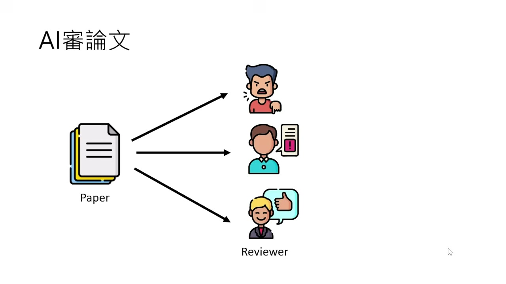

AAAI 2026 的每篇投稿除了三位人類 reviewer，另有 AI reviewer，並同時設置人類與 AI meta-reviewer；AI 提供意見但不直接打分。實務上，標示為人類的審稿也可能由模型代寫。講者不反對 AI 輔助審稿，反對的是用能力不足的模型交出牛頭不對馬嘴、只機械修改被點名項目的審查。審稿的價值在找出問題並幫助論文改善，而不是維持「一定由人寫」的形式。

## 四、AI Agent for Science 實驗

### Slide 7 — AI 寫稿加 AI 審稿形成閉環 ([Video](https://www.youtube.com/watch?v=VqB8zMujdjM&t=1112s))

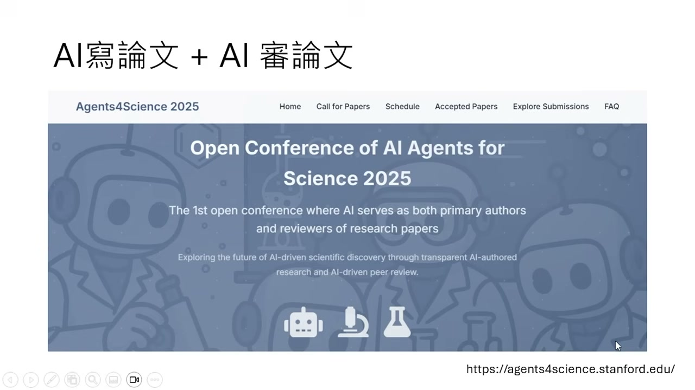

如果 AI 能寫論文也能審論文，就可能形成自動研究閉環：AI 投稿、AI 評審、持續篩選成果。Stanford 團隊舉辦 Open Conference of AI Agents for Science 2025，要求 AI 是第一作者與主要貢獻者，並由 AI reviewer 審查。這是對科研自動化的實驗，不等於已證明可以完全移除人類。

### Slide 8 — 247 篇投稿、48 篇錄取 ([Video](https://www.youtube.com/watch?v=VqB8zMujdjM&t=1154s))

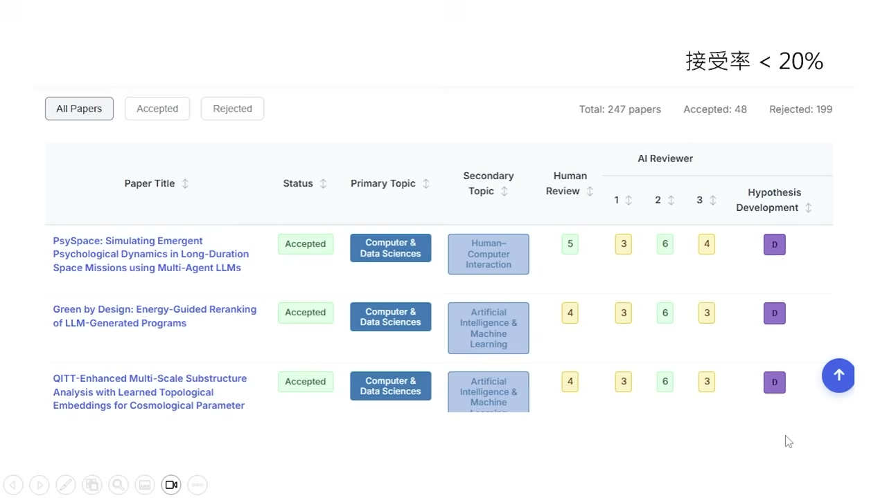

這場會議收到 247 篇投稿，錄取 48 篇，接受率低於 20%。每篇論文由三位 AI reviewer 評分，但最後仍加入人類的最終評價。低接受率本身不保證品質；更有資訊量的是後續比較：哪些研究階段由 AI 或人類主導，和最終錄取之間有何關係。

### Slide 9 — 錄取論文仍仰賴人類構想與實驗設計 ([Video](https://www.youtube.com/watch?v=VqB8zMujdjM&t=1179s))

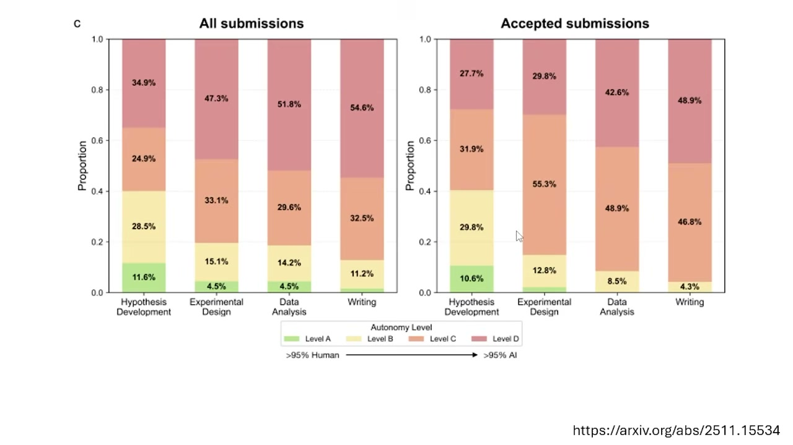

投稿者申報 AI 在四項工作中的參與程度：假說／點子、實驗設計、資料分析、論文寫作。全部投稿中，許多作品聲稱四項幾乎都由 AI 完成；但錄取論文在人類參與「點子發想」與「實驗設計」方面明顯更高。資料分析與寫作較適合交給 AI，自主提出真正新穎問題仍是弱點。

## 五、結論與延伸

### Slide 10 — 當前分工：Agent 執行，人類決定重要問題 ([Video](https://www.youtube.com/watch?v=VqB8zMujdjM&t=1326s))

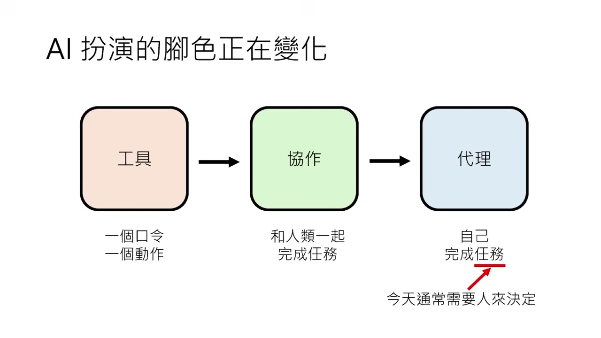

當前較可靠的分工是：Agent 自主執行任務，人類負責選擇與引導值得做的任務。這不是永久不變的界線，而是由現有證據支持的暫時配置。評估自動化時應分開看「執行既定流程」與「選對問題、設計有辨識力的實驗」。

### Slide 11 — Teaching Monster 教學怪獸挑戰 ([Video](https://www.youtube.com/watch?v=VqB8zMujdjM&t=1342s))

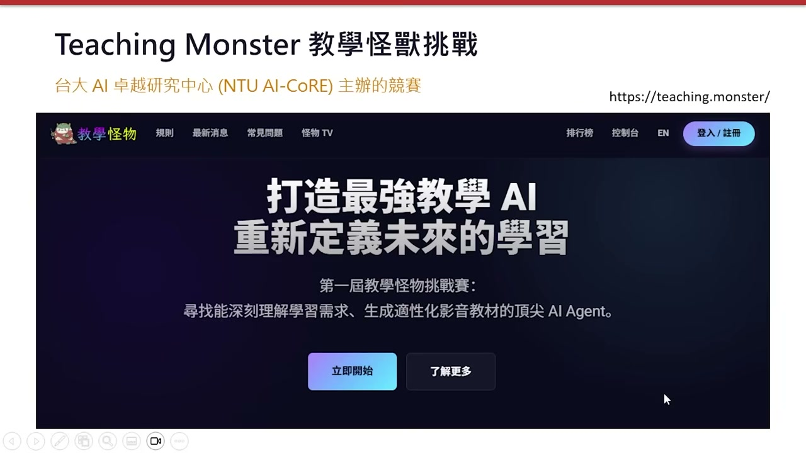

講者把問題延伸到教學：AI Agent 已能自主製作教學投影片與影片，但品質仍與優秀人類教師有差距。台大 AI 卓越中心的 Teaching Monster 挑戰賽以指定題目測試教學 Agent，讓參賽者衡量系統能否產生清楚、正確且有教學設計的內容。

### Slide 12 — 下次課前預習：語言模型內部運作 ([Video](https://www.youtube.com/watch?v=VqB8zMujdjM&t=1403s))

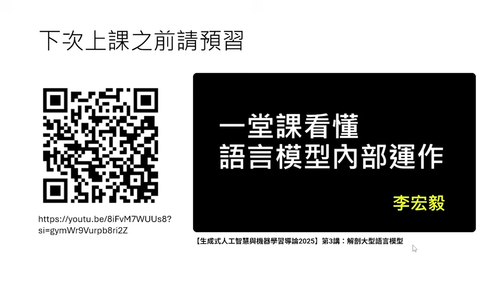

前三段內容完成 AI Agent 的科普介紹；下一階段轉向語言模型核心，探討模型內部如何做 inference。講者要求先觀看機器學習導論第三講，建立後續課程需要的背景。

## 核心結論

- AI 已能快速執行規格明確的研究工作，但成本比較必須納入錯誤風險與驗證工時。
- 自主實驗和寫作比自主選題成熟；看似新穎的點子經實作後可能失去優勢。
- AI 審稿是否可接受，核心標準應是準確、具體、能幫助作者改善，而不是審稿者的形式身分。
- AI-only conference 的結果顯示，錄取研究仍較常在人類參與選題與實驗設計時出現。
- 現階段實用分工是由人類決定重要問題與驗收標準，Agent 負責大量執行、分析和寫作。
