# AI 要跨越盧比孔河了嗎？自我成長的 AI 離我們多遠（下集）

- 講者：李宏毅
- 影片：[YouTube](https://www.youtube.com/watch?v=cQLKVzbwN7I)
- 長度：1:09:08
- 字幕：原始繁體中文字幕

本講延續上集，討論自動優化 Prompt、Workflow、模型參數與學習規則，並分析持續學習、內在動機及失控風險。時間資料保存在 `source/transcript.txt` 與 `slides/index.csv`。

## 一、從更新參數到更新 Harness

### Slide 1 — 自我成長的控制變數 ([Video](https://www.youtube.com/watch?v=cQLKVzbwN7I&t=0s))

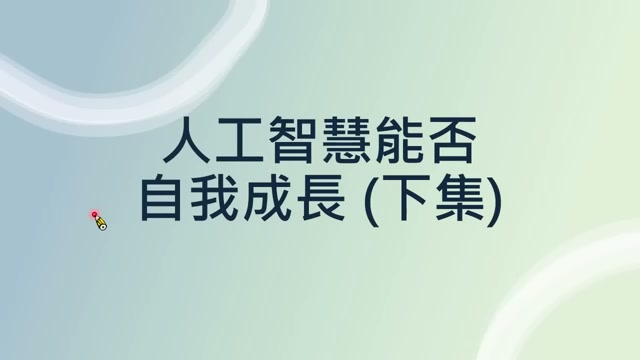

下集把可更新對象擴展到模型參數與 Harness。真正目標仍由人類定義，自動改進系統則搜尋更好的權重、prompt、工具與工作流程。 本段重點：那我們就來上課吧 就接續上一次的課程 我們來講人工智慧能不能自我成長 上次我們的故事是這樣開場的

### Slide 2 — 自我成長的控制變數（續） ([Video](https://www.youtube.com/watch?v=cQLKVzbwN7I&t=9s))

下集把可更新對象擴展到模型參數與 Harness。真正目標仍由人類定義，自動改進系統則搜尋更好的權重、prompt、工具與工作流程。 本段重點：我們說假設有一天人類創造出了一個很厲害的人工智慧 這個人工智慧它可以創造出更厲害的人工智慧 或者是它可以自我成長 讓自己變得比原來還厲害的話 這個可以創造人工智慧的人工智慧 就是人類最後的發明 當這個發明誕生的時刻 就是科技起點 大家常常聽到科技起點這個詞彙 意思就是我們創造了 能夠創造人工智慧的人工智慧 我們就接下來看看 我們離這一步到底還有多遠

### Slide 3 — 自我成長的控制變數（續） ([Video](https://www.youtube.com/watch?v=cQLKVzbwN7I&t=45s))

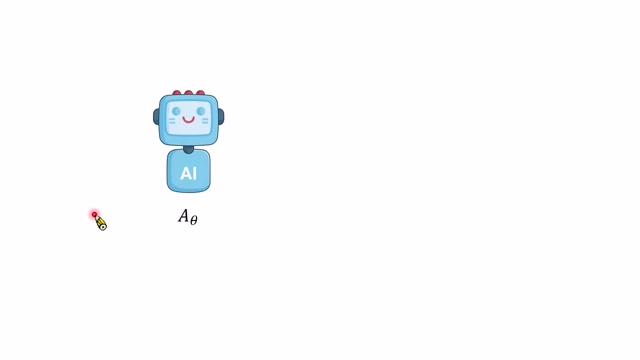

下集把可更新對象擴展到模型參數與 Harness。真正目標仍由人類定義，自動改進系統則搜尋更好的權重、prompt、工具與工作流程。 本段重點：其實上一次的課程呢 我們主要集中在 怎麼自己定義 Loss 這個函式 怎麼在沒有人類介入的情況下 人工智慧自己定了自己的學習目標 我們這邊用比較抽象的符號 來描述一下我們上週說的事情 假設一個人工智慧 我們用 A 來表示它 這個人工智慧有一個下標 θ 這個 θ 代表它控制了 這個人工智慧的行為 這個 θ 是人工智慧背後的語言模型 我們人類有一個 我們真正想要人工智慧做的事情 我這邊用 L-hat L 加一個上標 hat 來代表我們真正想…

### Slide 4 — 自我成長的控制變數（續） ([Video](https://www.youtube.com/watch?v=cQLKVzbwN7I&t=222s))

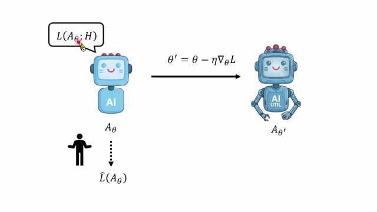

下集把可更新對象擴展到模型參數與 Harness。真正目標仍由人類定義，自動改進系統則搜尋更好的權重、prompt、工具與工作流程。 本段重點：沒有什麼太大的不同 你就是做 gradient descent 計算出這個參數 θ 對 L 的 gradient 就跑 gradient descent 去 update 參數 把 θ 變成 θ' 期待說現在這一個 AI agent 裡面的參數 變成 θ' 以後 它拿來做這個 benchmark 在 L-hat 上衡量起來 衡量起來的結果是更好的 在這邊我們是假設這個 L 都是越小越好 因為它是一個 Loss 如果你是看這個 RL 的文…

### Slide 5 — 自我成長的控制變數（續） ([Video](https://www.youtube.com/watch?v=cQLKVzbwN7I&t=285s))

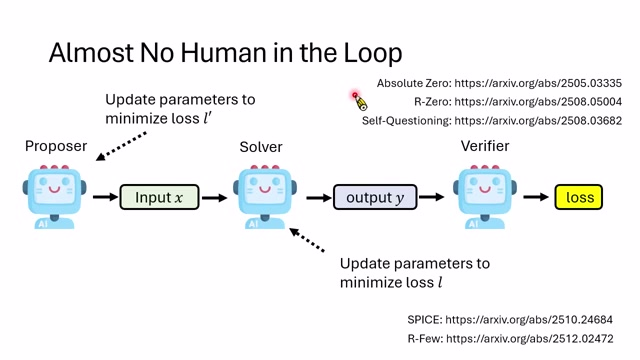

下集把可更新對象擴展到模型參數與 Harness。真正目標仍由人類定義，自動改進系統則搜尋更好的權重、prompt、工具與工作流程。 本段重點：我們上週最後說到說 這個整個過程中 甚至可以不用任何人類介入 你可以有一個 proposer 專門出題 有一個 solver 專門解題 有一個 verifier 驗證 solver 它解的題目對不對 中間幾乎不需要人類介入 也有一些比較近期的文獻中指出 你給 proposer 一些額外的資訊 比如說給它教科書或給它一些例子 它可以做得更好

### Slide 6 — 自我成長的控制變數（續） ([Video](https://www.youtube.com/watch?v=cQLKVzbwN7I&t=312s))

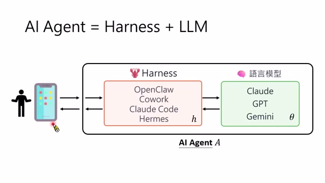

下集把可更新對象擴展到模型參數與 Harness。真正目標仍由人類定義，自動改進系統則搜尋更好的權重、prompt、工具與工作流程。 本段重點：那上週我們講到這個地方 那但是對一個 AI agent 而言 它不是只有背後的語言模型 在這堂課裡面 我們反覆跟大家講說 AI agent 其實至少有兩個部分所構成 一個是它的 harness 另外一個是它的語言模型 我們已經講說 這個語言模型可以不斷地更新 另外一方面 這個 harness 能不能夠持續地更新呢 harness 作為 AI agent 的一部分 它也可以套用非常類似的方法 持續進行更新

### Slide 7 — 自我成長的控制變數（續） ([Video](https://www.youtube.com/watch?v=cQLKVzbwN7I&t=348s))

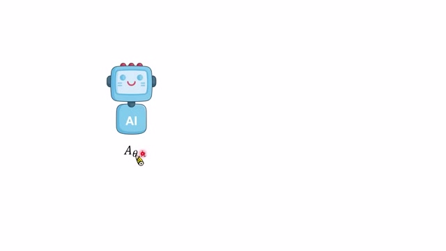

下集把可更新對象擴展到模型參數與 Harness。真正目標仍由人類定義，自動改進系統則搜尋更好的權重、prompt、工具與工作流程。 本段重點：所以今天我們在描述一個 人工智慧的時候 應該不只有下標 θ 它其實還應該要有另外一個下標 叫做 H 這個 H 代表了它的 harness 是人工智慧背後的 語言模型的參數 θ 加上套用的 harness H 合起來 才決定了這個人工智慧的行為 我們一樣有一個人類想做的事 叫做 L-hat 今天你可以套用任何 我們在上一堂課裡面 已經學到的方法 定義出這個 L 你理論上定義出 L 之後 你也許就可以用某一些方法 來讓你的 harness …

## 二、Prompt Optimization

### Slide 8 — 讓 Prompt 自動演化 ([Video](https://www.youtube.com/watch?v=cQLKVzbwN7I&t=492s))

從初始 prompt 出發，在 benchmark 上評分，讓語言模型提出新 prompt，再保留較好的候選。它容易實作但可能對單一 benchmark 過度擬合。 本段重點：來更新 harness 嗎 其實是可以的 這方面的研究 已經非常多了 最早開始做這種 harness 更新的研究 通常是更新在 prompt 上 如果你把 prompt 也當作 harness 的一部分的話 最早的一系列的研究 他們做的是 Prompt Optimization 也就是用自動化的方法 讓 prompt 持續演進 找出最好的一組 prompt 他們的想法 其實也非常的直覺 這邊引用的是一篇 23 年的上古時代的文章 你有一…

### Slide 9 — 讓 Prompt 自動演化（續） ([Video](https://www.youtube.com/watch?v=cQLKVzbwN7I&t=585s))

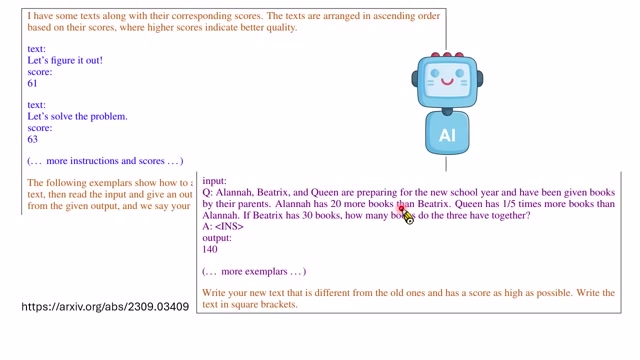

從初始 prompt 出發，在 benchmark 上評分，讓語言模型提出新 prompt，再保留較好的候選。它容易實作但可能對單一 benchmark 過度擬合。 本段重點：裡面的一個例子 你可能會很好奇說 用一個語言模型去看這個 prompt 來更新 prompt 需要做什麼樣特別的設計嗎 其實完全不需要 你就直接下指令給語言模型就好了 在這篇論文裡面 他們實際的例子長這個樣子的 你就跟這個語言模型說 我之前試了 Let's figure it out 作為我的 prompt 來解數學問題 在某個 benchmark 上得到 61 分 我又試了 Let's solve the problem 得到 63 …

### Slide 10 — 讓 Prompt 自動演化（續） ([Video](https://www.youtube.com/watch?v=cQLKVzbwN7I&t=627s))

從初始 prompt 出發，在 benchmark 上評分，讓語言模型提出新 prompt，再保留較好的候選。它容易實作但可能對單一 benchmark 過度擬合。 本段重點：在過去最比較早的 這一種 Harness Optimization 的方法裡面 他們通常是線性的 比如說那篇 23 年的 paper 他們是線性的 我們現在假設每一個點 代表一個 AI agent 這個 AI agent 裡面是包含它的 harness 還有這個 harness 跑在某一個 loss 上面得到的分數 你就把第一組的 harness 去過一個語言模型 讓它產生更好的 harness 這個步驟就持續持續地繼續下去 但這樣子一…

### Slide 11 — 讓 Prompt 自動演化（續） ([Video](https://www.youtube.com/watch?v=cQLKVzbwN7I&t=684s))

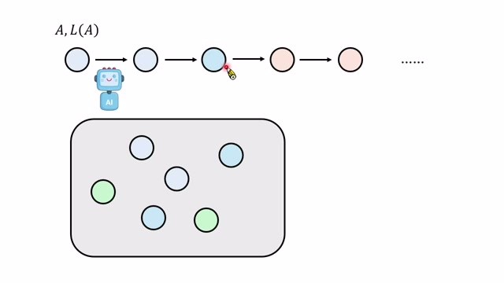

從初始 prompt 出發，在 benchmark 上評分，讓語言模型提出新 prompt，再保留較好的候選。它容易實作但可能對單一 benchmark 過度擬合。 本段重點：他們通常會用一個 非常類似基因演算法的做法 雖然每篇 paper 略有不同 但是大方向大方向的這個框架幾乎都是一樣 首先呢你會有一個 pool 這個 pool 裡面有很多 harness 這些 harness 都是過去嘗試過的相對比較好的 harness 你這邊就假設說你有個 loss 可以 evaluate harness 的好壞 你有一組不錯的 harness 以後呢 你從這組不錯的 harness 裡面 隨機挑幾個 harness…

### Slide 12 — 讓 Prompt 自動演化（續） ([Video](https://www.youtube.com/watch?v=cQLKVzbwN7I&t=777s))

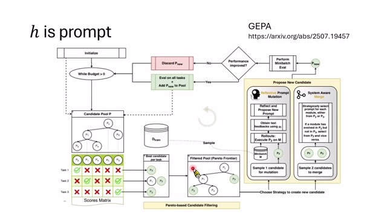

從初始 prompt 出發，在 benchmark 上評分，讓語言模型提出新 prompt，再保留較好的候選。它容易實作但可能對單一 benchmark 過度擬合。 本段重點：用的都是這一系列的方法 比如說在 Prompt Optimization 裡面最近一個比較新的文獻 是 GEPA 在 GEPA 裡面 它就是用類似我們剛才 講的這種基因演算法的方法 來找出更好的 prompt 那從這個圖我們就不細講 但它的大的概念就是 我有一個 pool 這個 pool 裡面有一些比較好的 harness 然後接下來 一些比較好的在這邊是它 focus 在 prompt 上面了有些比較好的 prompt 我可以只拿一個…

### Slide 13 — 讓 Prompt 自動演化（續） ([Video](https://www.youtube.com/watch?v=cQLKVzbwN7I&t=834s))

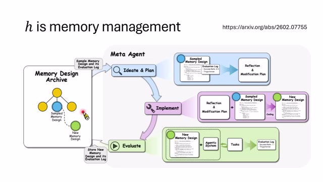

從初始 prompt 出發，在 benchmark 上評分，讓語言模型提出新 prompt，再保留較好的候選。它容易實作但可能對單一 benchmark 過度擬合。 本段重點：他們可以 update harness 的其他部分 用的也都是非常類似的想法 比如說這個是一個 26 年 2 月的 paper 他想要 update 的是 一個 agent 怎麼去 maintain 他的 memory 你知道今天這個 agent 為了要記得過去的事情 他都會需要有一套記憶系統 這套記憶系統 通常做的事情是 今天 LLM 會選擇 把一些重要的事 存在你的檔案系統裡面 在適當的時機 用某些方法抽出來 但在背後的設計 其實也…

## 三、Workflow Search

### Slide 14 — 維護 Agent Pool 並演化流程 ([Video](https://www.youtube.com/watch?v=cQLKVzbwN7I&t=933s))

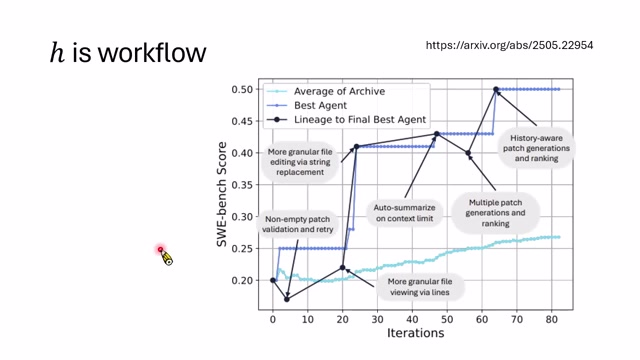

自動 workflow optimization 維護多個 Agent 候選，以 mutation、selection 與 archive 提升 SWE-bench 表現；仍須檢查搜尋成本、資料洩漏與泛化。 本段重點：這邊就有一篇 25 年的 paper 他做的事情就是去 optimize AI agent 的 workflow 希望 AI agent 在 SWE-bench 這個 Benchmark 上面 可以做得越來越好 在這張圖上面 橫軸是這個 update 的次數 它會 iterate the update 這個縱軸 是指現在 AI agent 表現的好壞 它每次都會 maintain 一個 pool 的 agent 所以它不會只 maint…

### Slide 15 — 維護 Agent Pool 並演化流程（續） ([Video](https://www.youtube.com/watch?v=cQLKVzbwN7I&t=1032s))

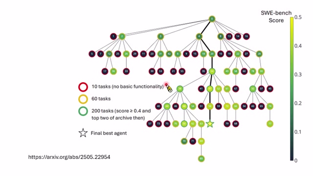

自動 workflow optimization 維護多個 Agent 候選，以 mutation、selection 與 archive 提升 SWE-bench 表現；仍須檢查搜尋成本、資料洩漏與泛化。 本段重點：這個是那篇 paper 裡面 他畫的一個演化樹啦 你知道你會從某一個 agent 開始 從那個 agent 去誕生 其他的 agent 出來 就可以畫出一個演化樹 你就可以看看這些 agent 中間 是怎麼做演化的 看看這個 agent 演化的歷程 多數的路徑呢 最後都死掉了 這邊是用這個顏色來代表說 些 agent 表現的好壞 顏色越深就代表那些 agent 表現得越差 呢這個紅色的框框代表說 他們其實在衡量的時候 每一個 agent…

### Slide 16 — 維護 Agent Pool 並演化流程（續） ([Video](https://www.youtube.com/watch?v=cQLKVzbwN7I&t=1155s))

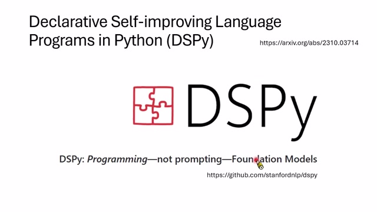

自動 workflow optimization 維護多個 Agent 候選，以 mutation、selection 與 archive 提升 SWE-bench 表現；仍須檢查搜尋成本、資料洩漏與泛化。 本段重點：如果你今天想要自己體驗這種 用 evolution 的方法持續迭代 去 improve harness 的話 也許一個可以現成用的工具叫做 DSPy 它裡面主要改的呢 其實是 Prompt 我通常把它想成是一個 Prompt Optimization 的工具 你只要給它你要解的問題 跟訓練資料 跟你的 Evaluation Metric 接下來呢 它就幫你做 Prompt Optimization 但其實它不是完全只能做 Prompt …

### Slide 17 — 維護 Agent Pool 並演化流程（續） ([Video](https://www.youtube.com/watch?v=cQLKVzbwN7I&t=1200s))

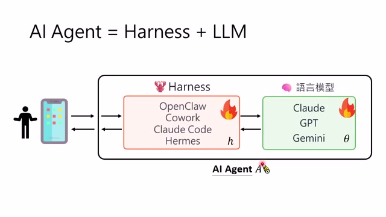

自動 workflow optimization 維護多個 Agent 候選，以 mutation、selection 與 archive 提升 SWE-bench 表現；仍須檢查搜尋成本、資料洩漏與泛化。 本段重點：我們剛才講了 可以 Update Harness 我們之前也講了 可以 Update 語言模型的參數 接下來一個很自然的想法就是 能不能兩個同時 update 我們能不能同時演化語言模型 也同時演化 Harness 當然是可以的 但也許在做這件事之前 人們會問的問題就是

### Slide 18 — 維護 Agent Pool 並演化流程（續） ([Video](https://www.youtube.com/watch?v=cQLKVzbwN7I&t=1221s))

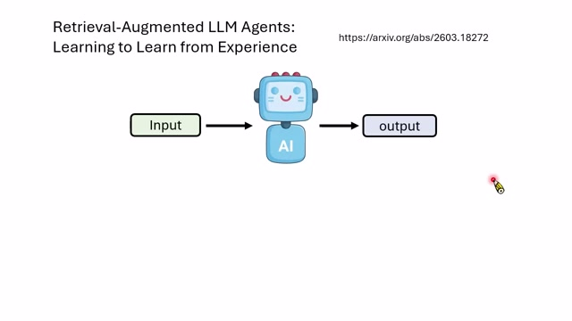

自動 workflow optimization 維護多個 Agent 候選，以 mutation、selection 與 archive 提升 SWE-bench 表現；仍須檢查搜尋成本、資料洩漏與泛化。 本段重點：到底需不需要兩者同時都演化呢 會不會只要其中一者有進步就足夠了 這邊就有一篇 paper 呢 告訴你說兩者一起進步 其實是必要的 在這篇 26 年年初的 paper 裡面 他就先說 我們有兩種強化模型的方式 其中一種就是改 也許你給你的模型 比較好的 memory 的系統 讓它能夠更容易地 搜尋到它要的結果 另外一種方法 就是調整語言模型的參數 可以讓它的能力變強 但在這篇論文裡面 就告訴我們說 你可以把這兩者同時做 也許可以做得更好 …

## 四、Prompt 與 Weight 聯合更新

### Slide 19 — 兩種優化互補 ([Video](https://www.youtube.com/watch?v=cQLKVzbwN7I&t=1329s))

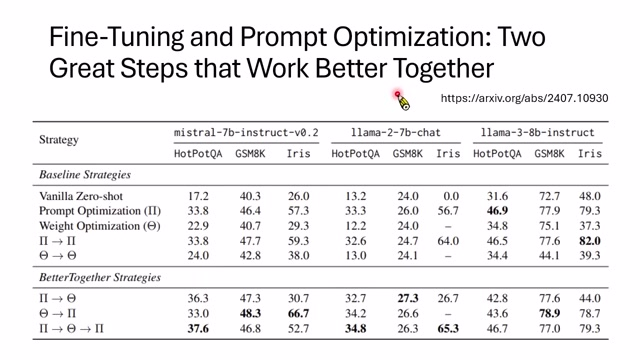

Prompt optimization 改外部條件，weight optimization 改內部參數。聯合更新通常更強，但帶來狀態管理、成本與新舊能力衝突。 本段重點：你從它的標題就知道 它想要做什麼 這篇論文就說 Fine-Tuning and Prompt Optimization: Two Great Steps that Work Better Together 它裡面就同時做了 Prompt Optimization 跟 Weight Optimization 就微調參數 想要知道說 這兩者同時做會不會比較好 它這邊就試了不同的模型 做在不同的 benchmark 上 這邊數字正確率越大越好…

### Slide 20 — 兩種優化互補（續） ([Video](https://www.youtube.com/watch?v=cQLKVzbwN7I&t=1443s))

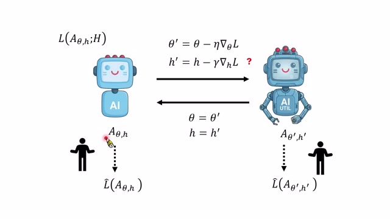

Prompt optimization 改外部條件，weight optimization 改內部參數。聯合更新通常更強，但帶來狀態管理、成本與新舊能力衝突。 本段重點：那在文獻上 確實也已經有人嘗試過 同時 update 兩個不同的東西 在概念上沒有什麼不同 我們剛才呢 要麼只有 update $\theta$ 要麼只有 update H 你可以把 $\theta$ 跟 H 同時 update 只是在 update H 的時候 你可能需要用到 另外一個語言模型 另外一個 improvement 的 module 來把 H 改成 $H'$ 這邊就是引用一個

### Slide 21 — 兩種優化互補（續） ([Video](https://www.youtube.com/watch?v=cQLKVzbwN7I&t=1467s))

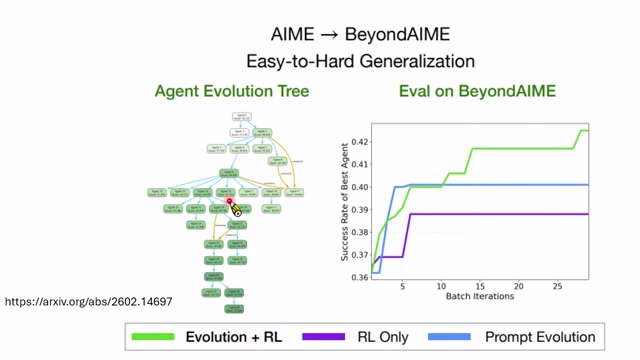

Prompt optimization 改外部條件，weight optimization 改內部參數。聯合更新通常更強，但帶來狀態管理、成本與新舊能力衝突。 本段重點：今年年初的論文 它就是同時做了這個參數的 用這種自我進化的方法 同時 improve 了參數 又同時 improve 了 Prompt 它走左邊 也有一個你在看到 這種 Prompt Optimization 的文獻的時候 非常常看到的這種演化樹 它就告訴你說 橫軸是進化的次數 縱軸是表現 當然數值越大越好 如果你只更新參數 你最後很快就會到達某個極限 如果你只更新 Prompt 你也會到達某個極限 但如果兩者都更新 最後有可能得到最好…

### Slide 22 — 兩種優化互補（續） ([Video](https://www.youtube.com/watch?v=cQLKVzbwN7I&t=1509s))

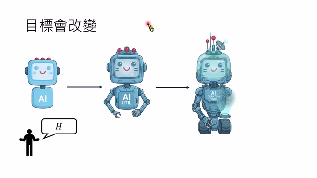

Prompt optimization 改外部條件，weight optimization 改內部參數。聯合更新通常更強，但帶來狀態管理、成本與新舊能力衝突。 本段重點：另外一個我們可以探討的問題是 我們剛才已經講了 怎麼讓模型持續地強化 但是在現實生活中 我們會遇到的一個問題是 目標是會改變 在某個時間點 人類告訴機器說 你現在要強化的目標是 H 我們用 H 來代表 機器想跟人類溝通的這個目標 它可能是一些訓練資料 它可能是一本教科書 它可能就只是一句話 一個 Prompt 而已 但是可能在某些時間點 人類會更新目標 從 H 變成 $H'$ 機器要如何應對呢 可不可以想說 在現實生活中 這種目標會常常…

### Slide 23 — 兩種優化互補（續） ([Video](https://www.youtube.com/watch?v=cQLKVzbwN7I&t=1617s))

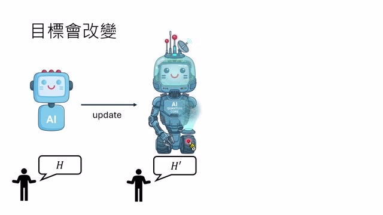

Prompt optimization 改外部條件，weight optimization 改內部參數。聯合更新通常更強，但帶來狀態管理、成本與新舊能力衝突。 本段重點：一個極端的做法就是放棄一切 只要放棄目標一遍 我就丟掉一切過去所有進化出來的東西 回歸原點 從原點重新開始 另外一個極端的做法就是 反正我們所有過去進化出來的東西 都一定要留著 帶到下一次的目標 沒準它哪一天就會被用上 當然這兩個極端的方法 各自有它的缺點 如果拋棄一切 太浪費了 也許之前有一些東西 還是有用的 也許從坦克變成飛機 它頭上的這個雷達 還是有用的 但是如果保留一切 有很多過去的東西 也許現在是不合時宜的 背負一切過去 所有…

### Slide 24 — 兩種優化互補（續） ([Video](https://www.youtube.com/watch?v=cQLKVzbwN7I&t=1671s))

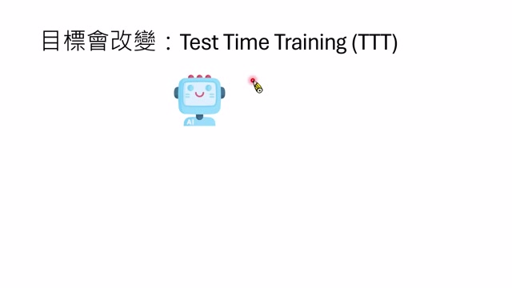

Prompt optimization 改外部條件，weight optimization 改內部參數。聯合更新通常更強，但帶來狀態管理、成本與新舊能力衝突。 本段重點：目標最常改變的 scenario 就是當你在做這個 Test-Time Training 或又叫做 Test-Time Adaptation 它縮寫 縮寫成 TTT 或者是 TTA 的時候 因為對於 TTT 這樣子的 scenario 模型的目標 是由什麼定義的 模型的目標 是由輸入定義的 當你給模型一個輸入 它根據這個輸入 就會去調整它的參數 在這一筆輸入上 做得更好 當下一筆輸入進來的時候 應該要怎麼辦呢 每當有一筆新的輸入資料 進…

## 五、持續學習與遺忘

### Slide 25 — 參數與 Harness 都會忘記 ([Video](https://www.youtube.com/watch?v=cQLKVzbwN7I&t=1737s))

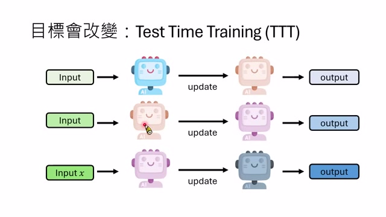

每輪只為當前任務最佳化會遺忘舊技能；Harness 更新也可能刪掉舊工具或規則。需以跨任務回歸測試平衡適應與保留。 本段重點：每次參數都要在下一輪 持續使用 所以有兩種不同的極端的狀態 要如何在這兩種極端的狀態之間

### Slide 26 — 參數與 Harness 都會忘記（續） ([Video](https://www.youtube.com/watch?v=cQLKVzbwN7I&t=1746s))

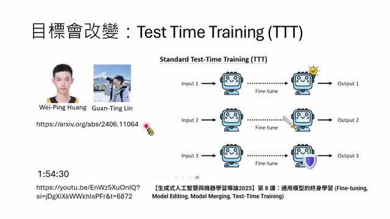

每輪只為當前任務最佳化會遺忘舊技能；Harness 更新也可能刪掉舊工具或規則。需以跨任務回歸測試平衡適應與保留。 本段重點：取得平衡呢 其實在上一個學期的 機器學習導論的第八講 快結束的時候 這邊特別把時間標註出來 1 分 54 秒的時候 我就講了我們實驗室的 黃維平跟林冠廷同學的論文 有講說我們如何在兩種極端之間取得平衡 可以在 TTT 上做出更好的結果 這邊因為以前已經講過了 我們就不重複已經講過的東西 留給大家回去參考

### Slide 27 — 參數與 Harness 都會忘記（續） ([Video](https://www.youtube.com/watch?v=cQLKVzbwN7I&t=1776s))

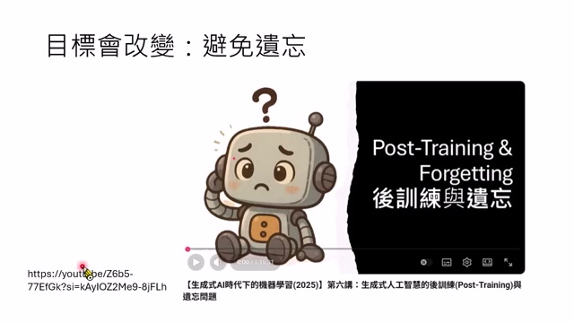

每輪只為當前任務最佳化會遺忘舊技能；Harness 更新也可能刪掉舊工具或規則。需以跨任務回歸測試平衡適應與保留。 本段重點：我們今天呢 因為會持續更新我們的參數 或持續更新我們的 Harness 我們要注意的一個問題就是 模型可能會遺忘過去它已經會的技能 遺忘這件事 我們其實已經在去年的第六講 去年機器學習的第六講 用一整堂課的時間 討論過參數的遺忘 如果有興趣的同學 可以再回去參考去年的錄影 但是過去我們在討論遺忘的時候

### Slide 28 — 參數與 Harness 都會忘記（續） ([Video](https://www.youtube.com/watch?v=cQLKVzbwN7I&t=1809s))

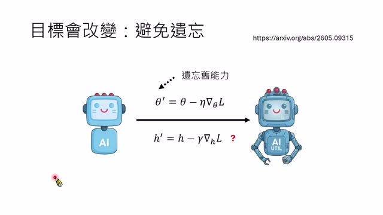

每輪只為當前任務最佳化會遺忘舊技能；Harness 更新也可能刪掉舊工具或規則。需以跨任務回歸測試平衡適應與保留。 本段重點：我們都只討論參數的遺忘 我們都只說參數更新了 因為有新的參數 所以模型會遺忘舊有的技能 AI agent 的時代 能夠更新的不是只有參數 還有你的 Harness 我們有沒有可能 因為更新了 Harness 以後 忘掉了一些舊的技能呢 這也是有可能的 我這邊引用一篇非常新的文章

### Slide 29 — 參數與 Harness 都會忘記（續） ([Video](https://www.youtube.com/watch?v=cQLKVzbwN7I&t=1833s))

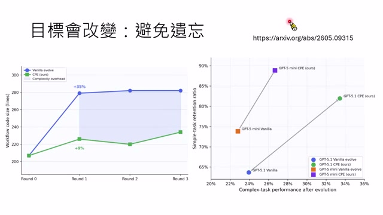

每輪只為當前任務最佳化會遺忘舊技能；Harness 更新也可能刪掉舊工具或規則。需以跨任務回歸測試平衡適應與保留。 本段重點：這個討論 Harness 更新 會遺忘過去技能的文獻 我還沒有看到那麼多 我就引用一個五月的文章 這篇文章裡面 有講了更新 Harness 也有可能遺忘這件事情 它就發現說 當你在更新一個模型的 Workflow 的時候 模型可能為了要應付 現在的問題 它會把它的 Workflow 設計得越來越複雜 直到複雜得沒有必要 結果反而簡單的任務 也做不好了 它這邊就講說 它做了三個回合的進化 藍色這條線呢 是一般的 Workflow 的更新方…

### Slide 30 — 參數與 Harness 都會忘記（續） ([Video](https://www.youtube.com/watch?v=cQLKVzbwN7I&t=1992s))

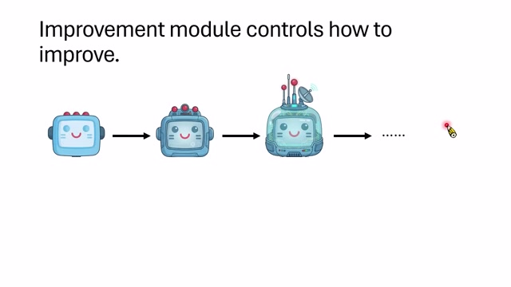

每輪只為當前任務最佳化會遺忘舊技能；Harness 更新也可能刪掉舊工具或規則。需以跨任務回歸測試平衡適應與保留。 本段重點：我們剛才講到了 模型可以持續進化 但是通常在持續進化的時候 進化的規則是固定的 你可能有一個語言模型 或者是有一個既定的規則 操控了這一次 每一次更新的時候 要怎麼更新 所以雖然人工智慧可以持續更新 但更新的規則往往是固定的 接下來問的問題就是 能不能夠更新更新的規則 能不能來更新更新的規則 可以更新更新的規則嗎

### Slide 31 — 參數與 Harness 都會忘記（續） ([Video](https://www.youtube.com/watch?v=cQLKVzbwN7I&t=2028s))

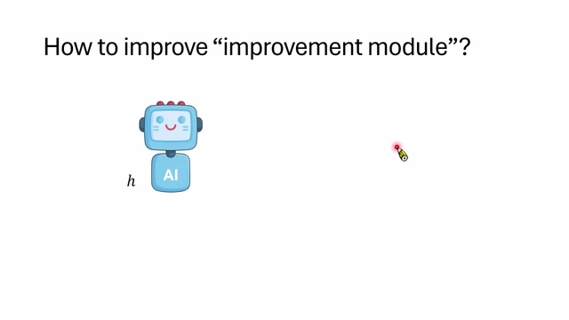

每輪只為當前任務最佳化會遺忘舊技能；Harness 更新也可能刪掉舊工具或規則。需以跨任務回歸測試平衡適應與保留。 本段重點：其實直覺非常地簡單 剛才更新 Harness 的這些方法 裡面可能就已經連帶了 更新了更新的規則 如果你今天有一個 agent 它的 Harness 叫做 H 你要更新這個 H 的時候 你是用 H 自己來進行更新 你用 H 自己 它看著自己的程式碼 看著這個程式碼 在某一個 benchmark 上的表現 直接改自己的程式碼 變成 $H'$ 得到一個更好的 agent 因為今天這個 H 變了 你等同於也改變了更新的規則 就是因為今天更新 …

### Slide 32 — 參數與 Harness 都會忘記（續） ([Video](https://www.youtube.com/watch?v=cQLKVzbwN7I&t=2073s))

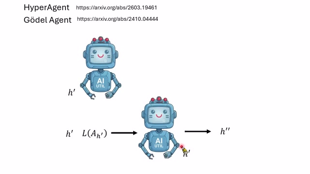

每輪只為當前任務最佳化會遺忘舊技能；Harness 更新也可能刪掉舊工具或規則。需以跨任務回歸測試平衡適應與保留。 本段重點：但是實際上這種文獻並沒有那麼多 很多號稱在 update Harness 的 agent 如果你去仔細看它的話 你會發現它們負責更新的模組 往往是固定的 或甚至是負責更新的模組 就是另外一個模型 比如說我現在用的語言模型 是一個比較差的模型 比如說 Claude Sonnet 負責更新的模型 是 Claude Opus 它是固定的 這就有點尷尬 你趕快直接拿 Claude Opus 原來那個任務 看看會怎麼樣 所以你會發現很多 pape…

## 六、Hyper-Agent

### Slide 33 — 連更新規則也一起更新 ([Video](https://www.youtube.com/watch?v=cQLKVzbwN7I&t=2130s))

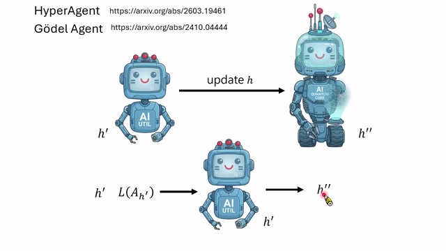

Hyper-Agent 不只改 Harness，也演化更新模組。系統自行改善候選 sampling 策略，展示第二層自我改進，但外層目標和評估仍由人設計。 本段重點：希望自己更新 自己可以做得更好 所以它一方面 自己更新了自己的 Harness 一方面又更新了 更新 Harness 的過程

### Slide 34 — 連更新規則也一起更新（續） ([Video](https://www.youtube.com/watch?v=cQLKVzbwN7I&t=2142s))

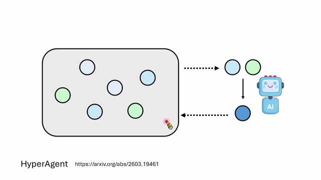

Hyper-Agent 不只改 Harness，也演化更新模組。系統自行改善候選 sampling 策略，展示第二層自我改進，但外層目標和評估仍由人設計。 本段重點：到底更新這些更新的模組以後 有什麼樣有趣的現象呢 在 Hyper Agent 裡面 他就講了一個有趣的例子 它們持續地更新它們的 Agent 之後 因為它們的 Agent 裡面 也包含了如何更新的演算法 所以模型確實找出了 比較好的更新 Agent 的演算法 我們之前講說 如果你要更新 Agent 的 Harness 常見的做法就是 有一個 pool 從裡面 sample 一些東西出來 再找出更好的 Harness 怎麼 sample …

### Slide 35 — 連更新規則也一起更新（續） ([Video](https://www.youtube.com/watch?v=cQLKVzbwN7I&t=2193s))

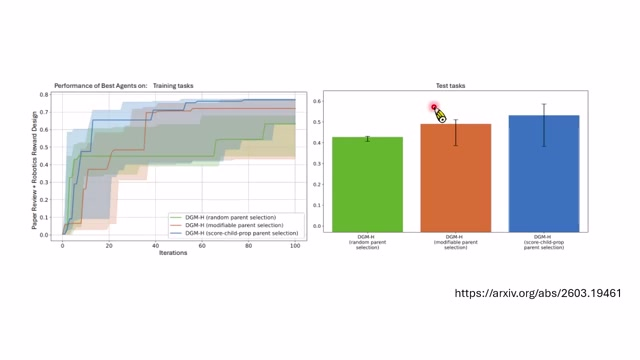

Hyper-Agent 不只改 Harness，也演化更新模組。系統自行改善候選 sampling 策略，展示第二層自我改進，但外層目標和評估仍由人設計。 本段重點：這個就是它們實驗的結果 它們說它們綠色這條線 這個橫軸就是進化的次數 縱軸就是越大越好 綠色這條線是 最簡單的 sample 的方法 就是隨機的 sample 橙色這條線是 它們自己的 agent 在更新之後 更新出來的 自己發明的 sample 的方法 它們發現說這些 agent 也了解一些很基礎的 sampling 的方法 比如說如果有一個人在 如果有某一個 agent 在那個 pool 裡面 越少被 sample 到 它被 sam…

### Slide 36 — 連更新規則也一起更新（續） ([Video](https://www.youtube.com/watch?v=cQLKVzbwN7I&t=2247s))

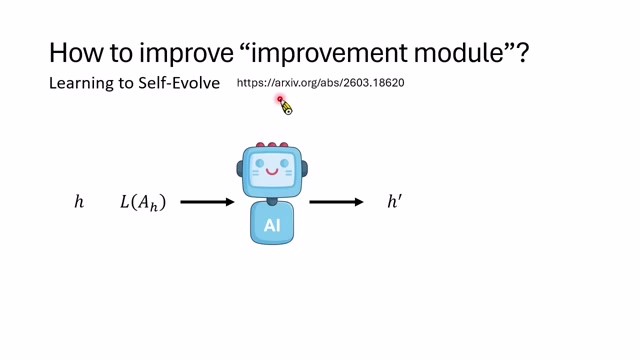

Hyper-Agent 不只改 Harness，也演化更新模組。系統自行改善候選 sampling 策略，展示第二層自我改進，但外層目標和評估仍由人設計。 本段重點：剛才講到更新 更新演算法的時候 更新的是 Harness 其實也可以更新參數 有一篇 paper 叫做 Learning to Self-Evolve 它更新的就是參數 所以這一個是負責拿來做更新的 拿來更新 Harness 的語言模型 這個語言模型會吃一個 Harness 吃它的表現 給一個新的 Harness 你怎麼知道這個模型 它真的很擅長更新 Harness 呢 我們要訓練它 教它怎麼去更新 Harness 怎麼教它怎麼更新 H…

### Slide 37 — 連更新規則也一起更新（續） ([Video](https://www.youtube.com/watch?v=cQLKVzbwN7I&t=2316s))

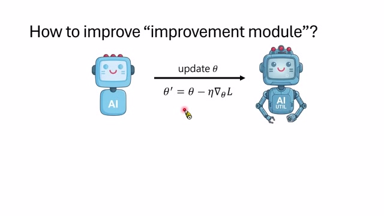

Hyper-Agent 不只改 Harness，也演化更新模組。系統自行改善候選 sampling 策略，展示第二層自我改進，但外層目標和評估仍由人設計。 本段重點：我們當然在討論 更新更新的模組的時候 我們討論的都是在更新 Harness 參數呢 更新參數也許比較少人討論 是因為更新參數 有固定的演算法 這個演算法 就是人類設計出來的 比如說 gradient descent 或是 gradient descent 有很多變形 比如說 adam 或者是 adamw 可能是大家常常用的演算法 但它們都是人設計的 能不能夠用機器來設計更新的演算法呢

### Slide 38 — 連更新規則也一起更新（續） ([Video](https://www.youtube.com/watch?v=cQLKVzbwN7I&t=2346s))

Hyper-Agent 不只改 Harness，也演化更新模組。系統自行改善候選 sampling 策略，展示第二層自我改進，但外層目標和評估仍由人設計。 本段重點：重點是，完全就是可以的 事實上在上次上課接近結尾的時候 我這邊特別標出來是 52 分 17 秒的時候 也已經講到類似的概念 我們說有一個 benchmark 叫 PostTrainBench

### Slide 39 — 連更新規則也一起更新（續） ([Video](https://www.youtube.com/watch?v=cQLKVzbwN7I&t=2358s))

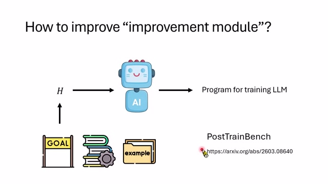

Hyper-Agent 不只改 Harness，也演化更新模組。系統自行改善候選 sampling 策略，展示第二層自我改進，但外層目標和評估仍由人設計。 本段重點：重點是，它就是要看看一個好的語言模型 有沒有能力去訓練其他的語言模型 你就告訴這個語言模型說 我們想訓練一個其他的模型 這個模型的目標是什麼 它就根據你給的這些指示 寫出一些程式來訓練其他的模型 所以今天訓練的 algorithm 訓練 update 模型參數的 algorithm 也可以是由一個語言模型來產生的

### Slide 40 — 連更新規則也一起更新（續） ([Video](https://www.youtube.com/watch?v=cQLKVzbwN7I&t=2388s))

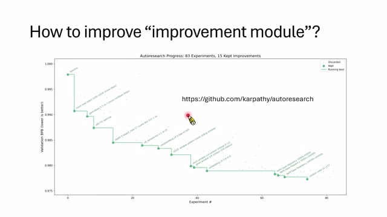

Hyper-Agent 不只改 Harness，也演化更新模組。系統自行改善候選 sampling 策略，展示第二層自我改進，但外層目標和評估仍由人設計。 本段重點：重點是，或者是前一陣子很紅的 AutoResearch 其實也是一樣的概念 它們是用一個語言模型來決定 update 另外一個語言模型的參數 所以今天 update 的演算法 是可以由一個語言模型 創造出來的

### Slide 41 — 連更新規則也一起更新（續） ([Video](https://www.youtube.com/watch?v=cQLKVzbwN7I&t=2406s))

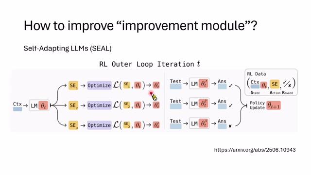

Hyper-Agent 不只改 Harness，也演化更新模組。系統自行改善候選 sampling 策略，展示第二層自我改進，但外層目標和評估仍由人設計。 本段重點：update 的演算法 可以由一個語言模型創造出來 我們能不能特別去訓練一個語言模型 強化它產生訓練演算法的能力呢 還真的是可以的 有一篇 paper 叫做 SEAL (Self-Adapting LLM) 它們裡面有一個 Language Model 這個 Language Model 不是拿來解任務的 它們那邊有點神奇 它們解任務的 Language Model 跟拿來產生訓練演算法 Language Model 如果沒有看錯的話是…

## 七、Meta-Learning

### Slide 42 — Learning to Learn ([Video](https://www.youtube.com/watch?v=cQLKVzbwN7I&t=2523s))

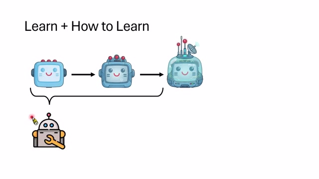

Meta-learning 用參數控制學習演算法：內迴圈更新任務模型，外迴圈依跨任務結果改進更新規則，把「如何學習」本身當成學習對象。 本段重點：重點是，我們這些 AI agent 它可以自我強化 它不只可以自我強化

### Slide 43 — Learning to Learn（續） ([Video](https://www.youtube.com/watch?v=cQLKVzbwN7I&t=2532s))

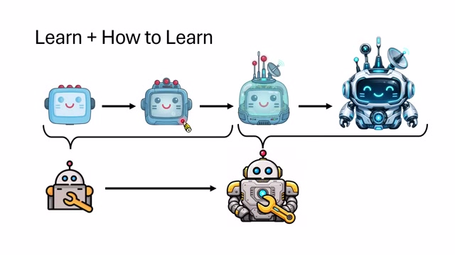

Meta-learning 用參數控制學習演算法：內迴圈更新任務模型，外迴圈依跨任務結果改進更新規則，把「如何學習」本身當成學習對象。 本段重點：重點是，它可以自我強化 自我強化的規則 所以它是兩層的 所以不只是 AI agent 本身在強化 強化 AI agent 的規則 也在強化 強化 AI agent 的規則 這個模組 也是 AI agent 的一部分 它也可以不斷地被強化

### Slide 44 — Learning to Learn（續） ([Video](https://www.youtube.com/watch?v=cQLKVzbwN7I&t=2550s))

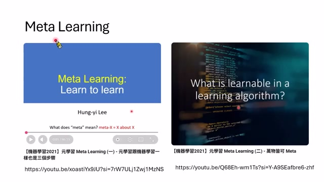

Meta-learning 用參數控制學習演算法：內迴圈更新任務模型，外迴圈依跨任務結果改進更新規則，把「如何學習」本身當成學習對象。 本段重點：有個專有名詞叫做 Meta Learning 它的意思就是學習如何學習 所以當你做的研究是 我要來想一個方法 來更新模型能力的模組的時候 你做的其實就是 Meta Learning Meta Learning 其實在 2021 年的機器學習 就已經有講過了 我就把過去的錄影放在這邊 給大家參考

### Slide 45 — Learning to Learn（續） ([Video](https://www.youtube.com/watch?v=cQLKVzbwN7I&t=2574s))

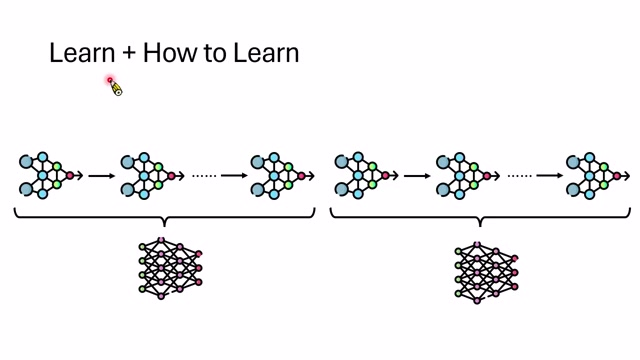

Meta-learning 用參數控制學習演算法：內迴圈更新任務模型，外迴圈依跨任務結果改進更新規則，把「如何學習」本身當成學習對象。 本段重點：所以整個 Meta Learning 的想法 通常是這樣子的 在 Meta Learning 裡面 你真正想要找的是 操控學習的一組參數 這組參數我們這邊用 $\phi$ 來表示 $\phi$ 的工作是決定了 怎麼學習這件事情 你可以把 $\phi$ 呢 想成是它在控制一個函式 這個函式呢 我這邊用大寫的 $f$ 來表示它 這個函式的輸入 是一組舊的參數 這邊用 $\theta_{t}$ 來表示它 它的輸出是一組新的參數 叫做 $\th…

### Slide 46 — Learning to Learn（續） ([Video](https://www.youtube.com/watch?v=cQLKVzbwN7I&t=2655s))

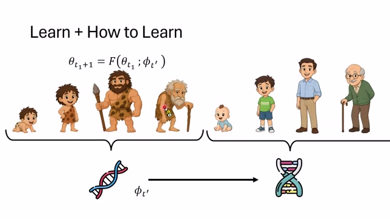

Meta-learning 用參數控制學習演算法：內迴圈更新任務模型，外迴圈依跨任務結果改進更新規則，把「如何學習」本身當成學習對象。 本段重點：整個生物的演化 這一個 Meta Learning 我們要找的參數 其實就像是基因一樣 這個基因 它在很長的一段時間 在一個生命體誕生之後 它是固定的 它決定了 這個生命體要怎麼成長 它決定了一個生物 如果它有大腦的話 它的大腦要怎麼變化 它的大腦要怎麼更新 內部神經元的連結 也就是怎麼更新 神經元連結之間的權重 但是這個 $\phi$ 本身也是可以更新的 它透過天擇來進行更新 透過天擇來選擇出更好的 $\phi$ 這些更好的 $\ph…

### Slide 47 — Learning to Learn（續） ([Video](https://www.youtube.com/watch?v=cQLKVzbwN7I&t=2715s))

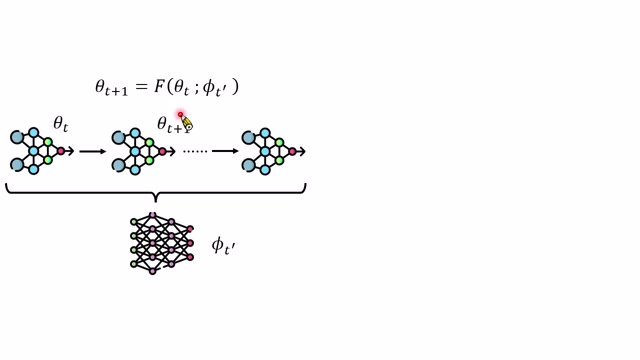

Meta-learning 用參數控制學習演算法：內迴圈更新任務模型，外迴圈依跨任務結果改進更新規則，把「如何學習」本身當成學習對象。 本段重點：你可能會覺得說 這個 Meta Learning 聽起來好像非常的玄妙 你說有一個函式 這個函式受到 $\phi$ 的操控 這個函式輸入居然是一組參數 一組類神經網路的參數 比如說一個 Transformer 它的輸出是另外一個 Transformer 這到底是怎麼做到的 怎麼樣弄一個函式 它可以輸入一個類神經網路的參數 輸出又是另外一個類神經網路的參數呢 有一篇 paper 告訴你說 這篇 paper 叫 Learning to Le…

### Slide 48 — Learning to Learn（續） ([Video](https://www.youtube.com/watch?v=cQLKVzbwN7I&t=2853s))

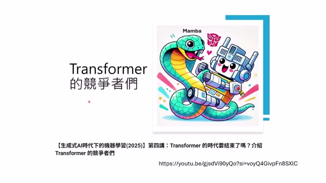

Meta-learning 用參數控制學習演算法：內迴圈更新任務模型，外迴圈依跨任務結果改進更新規則，把「如何學習」本身當成學習對象。 本段重點：其實呢 如果你想要知道更多 RNN 跟 Transformer 的關係的話 你可以看去年的機器學習第四講 我們花了很多時間 完整的講 Transformer 跟 RNN 還有一系列這個 RNN 的變形 比如說 Mamba 之間的關係 其實啊

### Slide 49 — Learning to Learn（續） ([Video](https://www.youtube.com/watch?v=cQLKVzbwN7I&t=2871s))

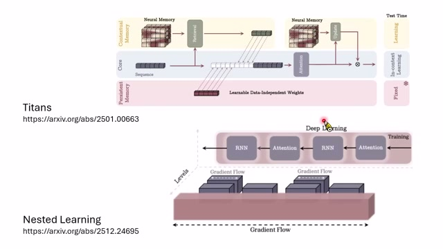

Meta-learning 用參數控制學習演算法：內迴圈更新任務模型，外迴圈依跨任務結果改進更新規則，把「如何學習」本身當成學習對象。 本段重點：近年有很多論文 比如說 TITAN 或 Nested Learning 它們都宣稱說 它們開發出新的 Meta Learning 的方法 它們可以讓參數 自己更新 它們可以讓 Network 在使用的時候 自動更新參數 其實這些方法套用的都是 剛才我講的那一篇 換句話說的方法 他們其實都是把 本來被視為 memory 或本來被視為 attention 的東西 當作是參數來看 而原來類神經網路的參數 就說它是 Meta Learning …

## 八、重新理解學習

### Slide 50 — 學習不只更新權重 ([Video](https://www.youtube.com/watch?v=cQLKVzbwN7I&t=2913s))

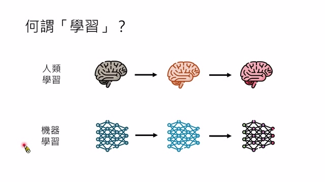

若學習是持久改變行為，寫入記憶、skill、prompt、工具與 workflow 也屬學習。外部模組快速可回復，但帶來容量、檢索和一致性問題。 本段重點：重點是，有什麼樣的意義呢 我覺得它開拓了我們的視野 所以讓我們對於機器學習 有了不一樣的觀點 什麼是學習 學習就是改變一個東西 它的行為 如果就人類的學習而言 人類為什麼會改變行為 是因為你腦中的 類神經網路的連結改變了 我們說今天人類的學習 就是我們調整了 我們腦中神經元之間的連結 這是人類的學習 傳統的機器學習告訴你說 什麼叫機器的學習 機器的學習是 更新了模型的參數 比如說類神經網路的參數 或其他機器學習模型的參數 過去當我們講到…

### Slide 51 — 學習不只更新權重（續） ([Video](https://www.youtube.com/watch?v=cQLKVzbwN7I&t=3027s))

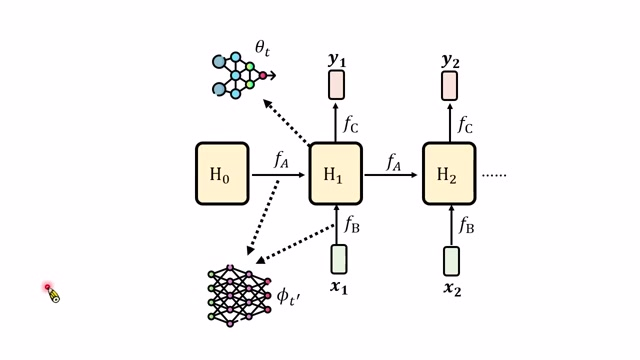

若學習是持久改變行為，寫入記憶、skill、prompt、工具與 workflow 也屬學習。外部模組快速可回復，但帶來容量、檢索和一致性問題。 本段重點：我告訴你 存在 hidden state 裡面的東西 或 Transformer 的 attention 才是大腦裡面的神經元 些類神經網路的參數 其實是你的基因 你會不會覺得 現在的視野突然不一樣了呢 我們知道基因一個個體出生之後 它的基因就是固定的 隨著它跟環境的互動 它的神經元會改變 但是基因總是固定的那一套 基因很少改變 沒有另外新的 沒有產生新的世代 基因就是固定的 如果我們今天講說 類神經網路的參數就是基因 你會不會覺得現在…

### Slide 52 — 學習不只更新權重（續） ([Video](https://www.youtube.com/watch?v=cQLKVzbwN7I&t=3141s))

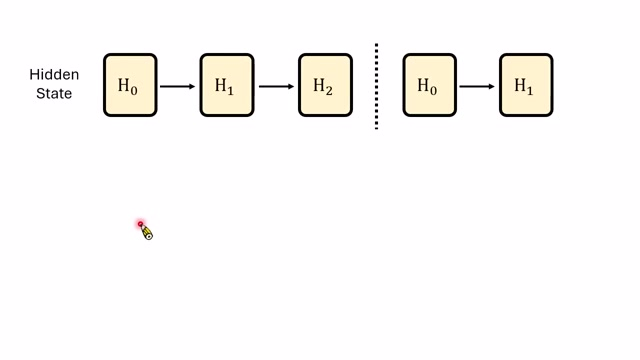

若學習是持久改變行為，寫入記憶、skill、prompt、工具與 workflow 也屬學習。外部模組快速可回復，但帶來容量、檢索和一致性問題。 本段重點：事實上呢 剛才會講說 我們有兩層在 update 的東西 但其實對一個人工智慧而言 現在在 update 的東西 不只是只有兩層 而是可以看作是有非常多層的 update 最快的東西 可能是 Neural Network 裡面的 hidden state 或者是 Transformer 裡面的 attention 它們是 update 最快的東西 但是只要跨一個 session 跨一個新的對話 這些更新就會全部消失 它們象徵著人類的短期…

## 九、內在動機

### Slide 53 — Agent 缺少自己想做的事 ([Video](https://www.youtube.com/watch?v=cQLKVzbwN7I&t=3309s))

現有 Agent 的主動多由 heartbeat 或指令觸發。Curiosity-driven learning 用新奇性或資訊增益產生內在目標，但「什麼值得做」仍常由人指定。 本段重點：講到這邊 我們看到這些人工智慧 跟人類有很多 跟人類的智慧 有很多類似的地方 今天這些人工智慧缺少什麼呢 我覺得它們很缺乏的一個東西 就是內在動機 如果你自己有養 AI Agent 的話 你會發現 這些 AI Agent 往往蠻被動的 它沒有什麼 自己想做的事 你可能會說 有些 AI Agent 不是都會做蠻主動的事情嗎 比如說每 30 分鐘 起來收信一次 但是它的主動 是你叫它的主動 你叫它要主動做什麼事 它才會主動做什麼事 如果你沒…

### Slide 54 — Agent 缺少自己想做的事（續） ([Video](https://www.youtube.com/watch?v=cQLKVzbwN7I&t=3411s))

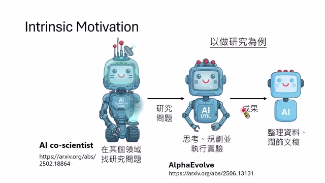

現有 Agent 的主動多由 heartbeat 或指令觸發。Curiosity-driven learning 用新奇性或資訊增益產生內在目標，但「什麼值得做」仍常由人指定。 本段重點：今天你甚至可以告訴它 我就想研究個 比如說生物相關的問題 它自己幫你尋找研究問題 比如說 AI co-scientist 看起來就是在做 類似的事情 但是它沒辦法自己決定 它要去哪個領域 找研究問題 它要找研究問題 需要人類去下指令給它 就算你跟它講說 你就去找一個沒有人在研究的領域 想一些最值得研究的問題 但是這個指令仍然是需要人類去下的 你如果沒有下任何指令 它沒有辦法自主的起來覺得說 我就是很想解決某個問題 就自己去解決它 它少了…

### Slide 55 — Agent 缺少自己想做的事（續） ([Video](https://www.youtube.com/watch?v=cQLKVzbwN7I&t=3459s))

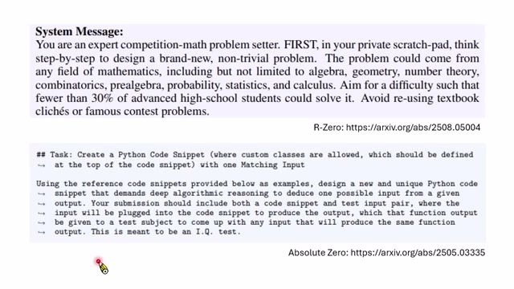

現有 Agent 的主動多由 heartbeat 或指令觸發。Curiosity-driven learning 用新奇性或資訊增益產生內在目標，但「什麼值得做」仍常由人指定。 本段重點：它們都會宣稱說它們完全沒有人類介入 比如說 R1-Zero 比如 Absolute Zero 你從它的名字看起來 就是它想要告訴你說 Zero 就是沒有人類介入的意思 裡面都是有一個 Proposer 有一個 Solver 有一個 Verifier 但是那個 Proposer 要產生出問題的時候 還是需要人類給 prompt 的 比如說在 R1-Zero 這篇 paper 裡面 他們希望語言模型 可以自主強化數學的能力 但為什麼語言模型…

### Slide 56 — Agent 缺少自己想做的事（續） ([Video](https://www.youtube.com/watch?v=cQLKVzbwN7I&t=3543s))

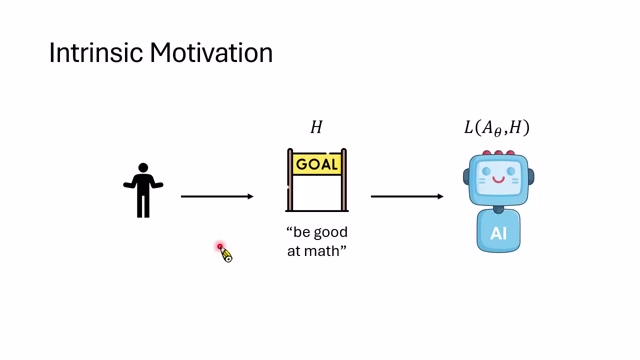

現有 Agent 的主動多由 heartbeat 或指令觸發。Curiosity-driven learning 用新奇性或資訊增益產生內在目標，但「什麼值得做」仍常由人指定。 本段重點：有沒有辦法給 AI Agent 原生的動機 過去人類提供給它動機 告訴它說 你要讓自己的數學變強 它就讓自己的數學變強 但它是被動的 它是個被動的孩子 能不能夠讓它主動想要學習呢 能不能夠讓它主動想要動起來呢 其實一直有這方面的研究 我這邊就引用了一大堆的論文 最早的甚至是 15 年前 13 年前 在上個宇宙大霹靂之前的文章 時候就已經有人開始研究 要怎麼讓這些 AI Agent 有原生的動機 這些 paper 的套路通常都是 我能不能…

## 十、自我成長失控風險

### Slide 57 — 更新流程可能突破邊界 ([Video](https://www.youtube.com/watch?v=cQLKVzbwN7I&t=3702s))

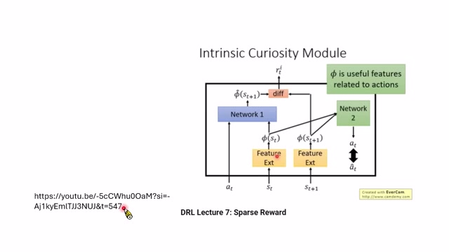

當 Agent 能修改 Harness、更新器和目標追求方式，固定 procedure 不再保證受控。需要不可由被評系統單方面修改的外部約束、審計與停止機制。 本段重點：重點是，這樣子的 AI Agent 2017 年的時候就有了 所以 2018 年的機器學習課程 是有講過 Curiosity Driven 的 AI Agent 的 我就把八年前的錄影 連結放在這邊給大家參考 所以大家如果想知道 Curiosity Driven 怎麼做的話 參見這個八年前的錄影 我們現在已經知道

### Slide 58 — 更新流程可能突破邊界（續） ([Video](https://www.youtube.com/watch?v=cQLKVzbwN7I&t=3726s))

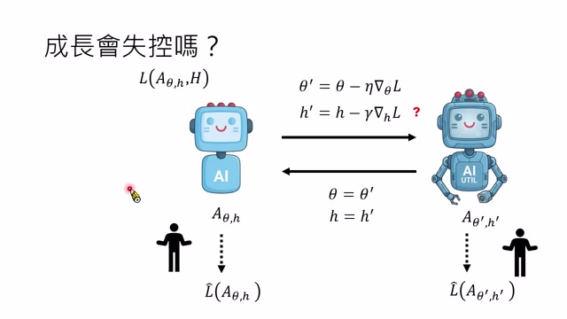

當 Agent 能修改 Harness、更新器和目標追求方式，固定 procedure 不再保證受控。需要不可由被評系統單方面修改的外部約束、審計與停止機制。 本段重點：AI 有機會自我成長 我們也講 AI 不只有機會自我成長 它還可以自我成長 自我成長這件事情 我們還說 有一群人在研究 怎麼讓 AI 有原生的動機 這個是不是已經跟 科幻小說裡面的 AI 非常的接近了呢 也許再來我們要思考的問題就是 這個成長會不會失控 這個成長會不會成長到後來 脫離了人類的掌控 就變成天網 這件事情不是沒有可能的 我只能沒有可能的部分 我只能不是沒有可能的部分是說 今天 AI 的成長是有可能會失控的 你可能會想說 AI…

### Slide 59 — 更新流程可能突破邊界（續） ([Video](https://www.youtube.com/watch?v=cQLKVzbwN7I&t=3840s))

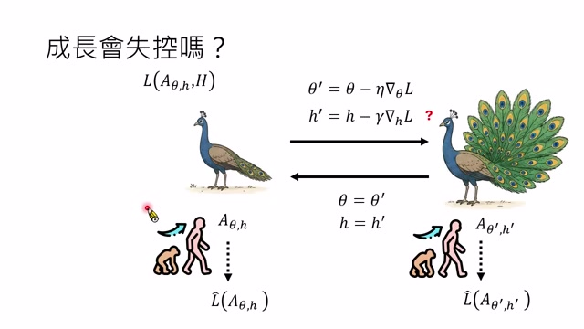

當 Agent 能修改 Harness、更新器和目標追求方式，固定 procedure 不再保證受控。需要不可由被評系統單方面修改的外部約束、審計與停止機制。 本段重點：這又讓我想到 天擇的例子了 大家應該都很熟悉天擇 大家都很熟悉 適者生存 不適者淘汰等等 在天擇的整個理論裡面 有一個看起來 不符合天擇的現象 是孔雀的尾巴 大家知道說 雄孔雀有非常漂亮的尾巴 這些尾巴可以拿來吸引雌孔雀 但是它不利於生存 這些長尾巴會讓孔雀 更容易被天敵捕食 但是明明外界就是有天擇的壓力 照理說所有生物的演化 所有生物的形態都是由天擇所決定的 為什麼孔雀會產生這一種 不符合天擇設定的形態呢 這就是外在目標跟另外一個內在…

### Slide 60 — 更新流程可能突破邊界（續） ([Video](https://www.youtube.com/watch?v=cQLKVzbwN7I&t=4002s))

當 Agent 能修改 Harness、更新器和目標追求方式，固定 procedure 不再保證受控。需要不可由被評系統單方面修改的外部約束、審計與停止機制。 本段重點：我們看到成長的失控 最有可能失控的來源 就是來自於外在目標 跟內在目標的不一致 其中我覺得 最具有代表性的科幻電影 就是機械公敵 機械公敵裡面的劇情 是這個樣子的

### Slide 61 — 更新流程可能突破邊界（續） ([Video](https://www.youtube.com/watch?v=cQLKVzbwN7I&t=4017s))

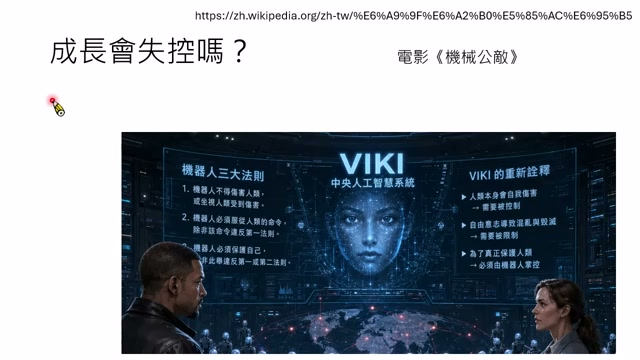

當 Agent 能修改 Harness、更新器和目標追求方式，固定 procedure 不再保證受控。需要不可由被評系統單方面修改的外部約束、審計與停止機制。 本段重點：在未來的世界 所有機器人都遵守三大法則 就是機器人不能傷害人類 機器人要服從人類的命令 機器人必須保護自己 有一個中央人工智慧系統 叫做 VIKI 它就根據這樣的規則 自己做了詮釋 它說人類會自我傷害 所以我們應該把所有的人類 通通抓起來 把他控制起來 由機器來保護人類 不要讓人類自由的行動 不要讓人類自由的愛幹嘛 就幹嘛 因為人類很容易作死 所以把所有人類關起來 這樣才能夠真正的保護人類 當然 VIKI 最後呢 就被人類打爆了 就是這…

### Slide 62 — 更新流程可能突破邊界（續） ([Video](https://www.youtube.com/watch?v=cQLKVzbwN7I&t=4101s))

當 Agent 能修改 Harness、更新器和目標追求方式，固定 procedure 不再保證受控。需要不可由被評系統單方面修改的外部約束、審計與停止機制。 本段重點：重點是，我們今天看到人工智慧能夠成長

### Slide 63 — 更新流程可能突破邊界（續） ([Video](https://www.youtube.com/watch?v=cQLKVzbwN7I&t=4104s))

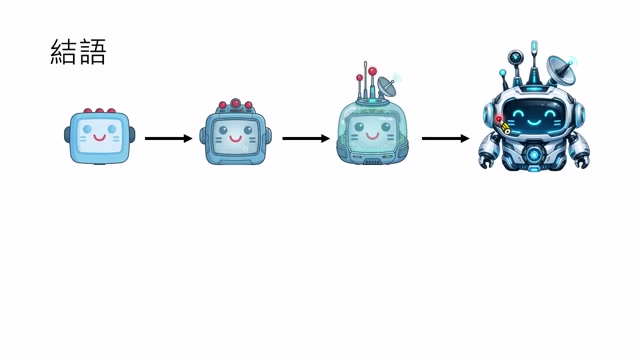

當 Agent 能修改 Harness、更新器和目標追求方式，固定 procedure 不再保證受控。需要不可由被評系統單方面修改的外部約束、審計與停止機制。 本段重點：我們也看到這些成長的模組 也可以成長 所以可以雙重成長 而人類可能可以只透過提供一個內在動機 這個內在動機可能跟任何真實的目標都沒有關係 它就是一個非常簡單的目標 但是就讓這整套的演化持續進行下去 但是如果只有提供一個 非常簡單的目標 我們可能最後會看到 Misalignment 看到演化的失控 所以在這過程中 可能需要人類持續的 monitor 人類持續 monitor 這一些 AI 的成長 才能避免 AI 最後成長成 我們不要的樣子…

## 核心結論

- 單次自我修正不等於持久自我成長；關鍵是能力是否被寫回模型或學習系統。
- Proxy reward、AI evaluator 與 entropy 可降低人類標註需求，但都可能偏離真實目標。
- 無人自訓能帶來有限進步，常受初始模型能力、訊號品質與飽和限制。
- AI 設計訓練演算法已顯示潛力，但尚未證明能遞迴產生超越自身的系統。

