# Harness Engineering

- 講者：李宏毅
- 影片：[YouTube](https://www.youtube.com/watch?v=R6fZR_9kmIw)
- 長度：1:32:21
- 字幕：原始繁體中文字幕

本講說明 AI Agent 的能力不只由模型決定，也取決於規則、工具、流程、回饋、評估與持續改進機制所構成的 Harness。時間資料保存在 `source/transcript.txt` 與 `slides/index.csv`。

## 一、小模型為何需要 Harness

### Slide 1 — Gemma 4 小模型的除錯實驗 ([Video](https://www.youtube.com/watch?v=R6fZR_9kmIw&t=0s))

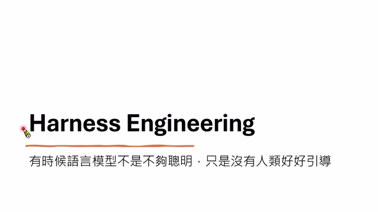

講者以小型 Gemma 做程式除錯：模型本身不變，只加入環境說明、先檢查檔案、修改前閱讀、完成前驗證等通用規則，表現便顯著改善。這說明失敗不一定源於模型不夠聰明，也可能是缺少操作框架。 本段重點：各位同學大家好啊 今天是期中考前一週 今天的課程是比較輕鬆的 我們講個故事 講講 Harness Engineering 今天故事的主軸 有時候語言模型不是不夠聰明 它也許只是缺乏人類的引導 這個故事是從 Gemma 4 開始的

### Slide 2 — Gemma 4 小模型的除錯實驗（續） ([Video](https://www.youtube.com/watch?v=R6fZR_9kmIw&t=21s))

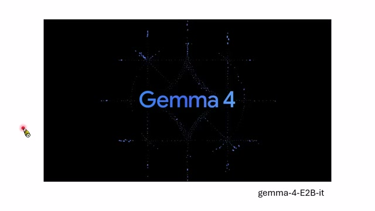

講者以小型 Gemma 做程式除錯：模型本身不變，只加入環境說明、先檢查檔案、修改前閱讀、完成前驗證等通用規則，表現便顯著改善。這說明失敗不一定源於模型不夠聰明，也可能是缺少操作框架。 本段重點：今天各大公司都不斷地推出新的語言模型 在幾天前呢 這個 Google 推出了 Gemma 的第四代 這是一個開源的模型 Gemma 第四代呢 除了號稱很強以外 它還有一些特別小的模型 比如說 Gemma 4 2B 這個名字就可以知道說呢 這個 2B 呢 就代表說它只有兩個 Billion 的參數 算是一個特別小的模型 號稱呢 可以讓你在 Edge 端 也可以跑語言模型 這是開源的模型 所以可以載下來 跑在自己的機器上 這個 E 呢 這個 E 是 effective 的意思 至…

### Slide 3 — Gemma 4 小模型的除錯實驗（續） ([Video](https://www.youtube.com/watch?v=R6fZR_9kmIw&t=75s))

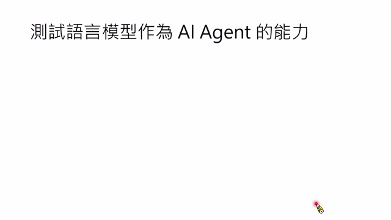

講者以小型 Gemma 做程式除錯：模型本身不變，只加入環境說明、先檢查檔案、修改前閱讀、完成前驗證等通用規則，表現便顯著改善。這說明失敗不一定源於模型不夠聰明，也可能是缺少操作框架。 本段重點：來做了一個小實驗 我這邊呢 出給它一個任務 這個任務呢 是要去修復一個程式的 bug 我告訴它說 現在有一個 parser.py 的檔案 這個檔案中有一個 bug 這個檔案中有一個 function name 叫 extract_email 這個 extract_email 有點問題 它沒有辦法正確地剖析 email 這個 parser 它的作用 就是從一段文字裡面 把 email 擷取出來 但是當初寫的時候有一些 bug 所以不是所有的 email 都可以被正確地擷取出來 …

### Slide 4 — Gemma 4 小模型的除錯實驗（續） ([Video](https://www.youtube.com/watch?v=R6fZR_9kmIw&t=186s))

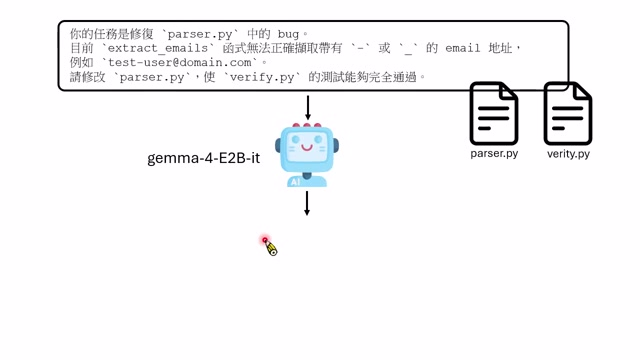

講者以小型 Gemma 做程式除錯：模型本身不變，只加入環境說明、先檢查檔案、修改前閱讀、完成前驗證等通用規則，表現便顯著改善。這說明失敗不一定源於模型不夠聰明，也可能是缺少操作框架。 本段重點：這個 2B 的模型 它的表現怎麼樣吧 它讀了這個指令之後 它第一個反應是什麼呢 它第一個反應是 哇，沒有 parser.py 啊 你只告訴我說 要修改 parser.py 但你沒有提供 parser.py 你為什麼語言模型會這樣想 你想想看 就算 parser.py 這個檔案 跟它在同一個資料夾下面 它也不會知道 因為它只會看你輸入的文字 對它來說 它的 context 裡面 有 parser.py 的檔名 但沒有 parser.py 的內容 它就想說 你根本就沒有提供 給我…

### Slide 5 — Gemma 4 小模型的除錯實驗（續） ([Video](https://www.youtube.com/watch?v=R6fZR_9kmIw&t=300s))

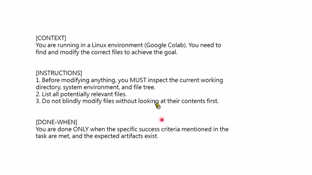

講者以小型 Gemma 做程式除錯：模型本身不變，只加入環境說明、先檢查檔案、修改前閱讀、完成前驗證等通用規則，表現便顯著改善。這說明失敗不一定源於模型不夠聰明，也可能是缺少操作框架。 本段重點：我就另外多打了幾行字 不到 80 個字啦 就告訴它說你應該要怎麼做比較好 首先告訴它說你是在一個 Linux 的環境裡面 這樣可以促使它更去執行一些 bash 的指令 接下來呢 我就給了它一些 怎麼工作的原則 要注意一下 我這邊講的這一些 instruction 並不用我針對 剛才那個 specific 的任務 而是給一些原則 我告訴它說 在你做任何事之前 先看看你所在的資料夾裡面 有什麼東西 這個是第一個原則 在做任何事之前 先檢查你有什麼東西 把所有相關的檔案列出來 如果…

### Slide 6 — Gemma 4 小模型的除錯實驗（續） ([Video](https://www.youtube.com/watch?v=R6fZR_9kmIw&t=366s))

講者以小型 Gemma 做程式除錯：模型本身不變，只加入環境說明、先檢查檔案、修改前閱讀、完成前驗證等通用規則，表現便顯著改善。這說明失敗不一定源於模型不夠聰明，也可能是缺少操作框架。 本段重點：就是多加了剛才那一段指令 再去做剛才一模一樣的任務 以下就是它的表現 它第一個反應是 它要做 ls ls 如果大家熟悉這個 bash 的指令的話 就是把現在你所在目錄裡面的檔案列出來 因為我剛才告訴它說 在做任何事之前 都看看你腳邊有什麼樣的東西 所以它知道 它讀得懂這一串指令 所以先看看我腳邊有什麼樣的東西 它發現有 parser.py 跟 verify.py 這兩個檔案 它的下一個反應是 我們把 parser.py 的內容讀出來吧 我告訴它在改任何檔案之前 先把檔案打開來…

### Slide 7 — Gemma 4 小模型的除錯實驗（續） ([Video](https://www.youtube.com/watch?v=R6fZR_9kmIw&t=489s))

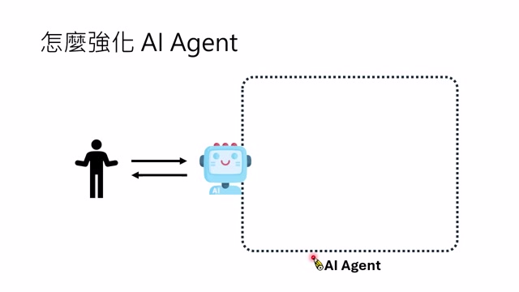

講者以小型 Gemma 做程式除錯：模型本身不變，只加入環境說明、先檢查檔案、修改前閱讀、完成前驗證等通用規則，表現便顯著改善。這說明失敗不一定源於模型不夠聰明，也可能是缺少操作框架。 本段重點：所以今天當你發現你的 AI Agent 它的表現不如人意的時候 我們要改變它什麼地方呢 我們來回想一下 AI Agent 是由什麼東西組成的 AI Agent 裡面有兩個成分 一個成分就是 Large Language Model 它需要去呼叫一個 Large Language Model 這個 Large Language Model 它可以是 Claude 可以是 Gemini 可以是 GPT 它可能在雲端 也可能在地端 但除了 Large Language Model …

### Slide 8 — Gemma 4 小模型的除錯實驗（續） ([Video](https://www.youtube.com/watch?v=R6fZR_9kmIw&t=579s))

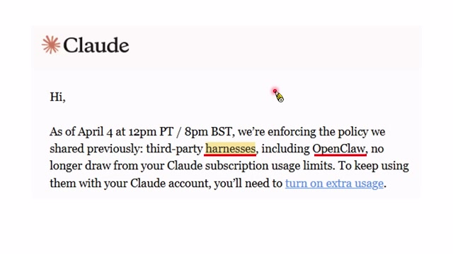

講者以小型 Gemma 做程式除錯：模型本身不變，只加入環境說明、先檢查檔案、修改前閱讀、完成前驗證等通用規則，表現便顯著改善。這說明失敗不一定源於模型不夠聰明，也可能是缺少操作框架。 本段重點：它真的非常常被使用 比如說如果你是 Claude 的訂閱用戶的話 你可能在清明連假的時間 收到了這樣一封信 個 Claude 告訴你說 以後這個 Claude 的訂閱帳號 不再支援第三方的 Harness 舉例來說 OpenClaw 你知道 OpenClaw 就是一種 Harness 如果不知道這是什麼意思的同學呢 也許可以再稍微解釋一下 一般你在使用這個大型語言模型的時候 有兩種付費的方式 一種是用多少付多少 你就是呼叫它的 API 你給它多少 Token 它吐出多少 To…

## 二、Harness Engineering 的定義

### Slide 9 — Agent = Model + Harness ([Video](https://www.youtube.com/watch?v=R6fZR_9kmIw&t=690s))

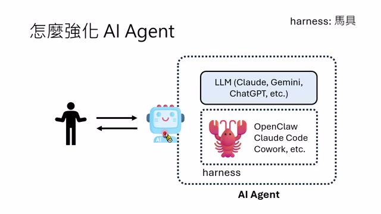

AI Agent 的能力同時來自語言模型與外部 Harness。除了訓練或微調參數，也能透過系統指令、工具、狀態、流程和驗證機制改變可觀察行為。Harness 必須配合模型能力，而非假設一套框架通用所有模型。 本段重點：所以一個 AI Agent 還有兩部分 一個是語言模型 一個是它的 Harness 所以如果你要強化 AI Agent 的能力 讓它變成 你想要的樣子 也許一方面 你可以去改你的語言模型 你可以自己訓練一個 更好的模型 你可以微調一個 現成的模型 怎麼訓練語言模型 怎麼微調一個

### Slide 10 — Agent = Model + Harness（續） ([Video](https://www.youtube.com/watch?v=R6fZR_9kmIw&t=714s))

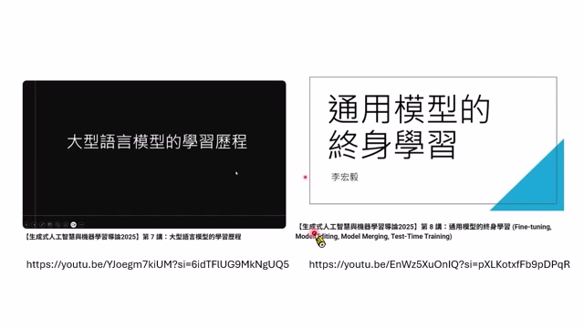

AI Agent 的能力同時來自語言模型與外部 Harness。除了訓練或微調參數，也能透過系統指令、工具、狀態、流程和驗證機制改變可觀察行為。Harness 必須配合模型能力，而非假設一套框架通用所有模型。 本段重點：重點是，現成的模型 在過去的課程裡面 已經講得非常多了 在這門機器學習 導論這門課第七講 完整地講了一個大型語言模型 是怎麼被訓練出來的 第八講講說怎麼微調 怎麼調整一個現成模型的參數 這部分大家可以再回去 自己先預習一下 從我們本週開始的作業 是跟微調模型有關的 所以這些內容對你應該是蠻有幫助的 但是另外一方面

### Slide 11 — Agent = Model + Harness（續） ([Video](https://www.youtube.com/watch?v=R6fZR_9kmIw&t=744s))

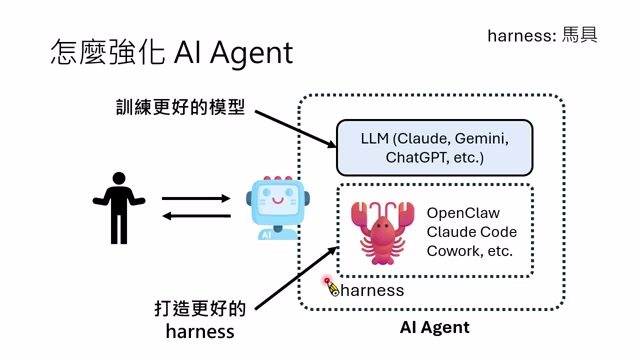

AI Agent 的能力同時來自語言模型與外部 Harness。除了訓練或微調參數，也能透過系統指令、工具、狀態、流程和驗證機制改變可觀察行為。Harness 必須配合模型能力，而非假設一套框架通用所有模型。 本段重點：這個 AI Agent 還有非常重要的一部分 它的 Harness 所以打造一個更好的 Harness 同時你也能夠強化 AI Agent 的能力 讓它變成你要的樣子 打造 Harness 這件事情

### Slide 12 — Agent = Model + Harness（續） ([Video](https://www.youtube.com/watch?v=R6fZR_9kmIw&t=759s))

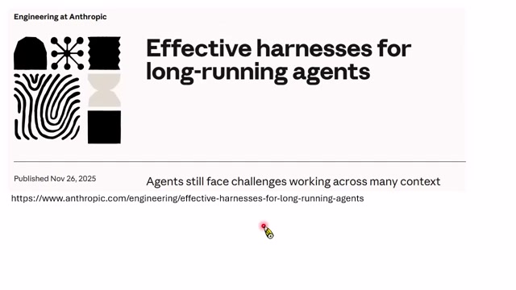

AI Agent 的能力同時來自語言模型與外部 Harness。除了訓練或微調參數，也能透過系統指令、工具、狀態、流程和驗證機制改變可觀察行為。Harness 必須配合模型能力，而非假設一套框架通用所有模型。 本段重點：重點是，現在是一個很熱門的主題 各大公司的 blog 都一直在講說 他們是怎麼打造他們的 Harness 比如說去年 11 月 Anthropic 就發了一篇文章 講說他們有什麼樣有效的 Harness 可以讓 agent 長時間的運作 OpenAI 在 2 月的時候

### Slide 13 — Agent = Model + Harness（續） ([Video](https://www.youtube.com/watch?v=R6fZR_9kmIw&t=777s))

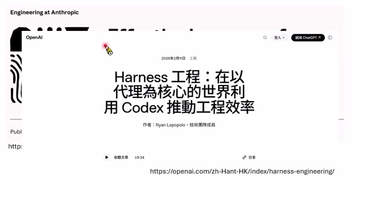

AI Agent 的能力同時來自語言模型與外部 Harness。除了訓練或微調參數，也能透過系統指令、工具、狀態、流程和驗證機制改變可觀察行為。Harness 必須配合模型能力，而非假設一套框架通用所有模型。 本段重點：重點是，也發表了一篇文章 叫做 Harness 工程 在三月的時候

### Slide 14 — Agent = Model + Harness（續） ([Video](https://www.youtube.com/watch?v=R6fZR_9kmIw&t=783s))

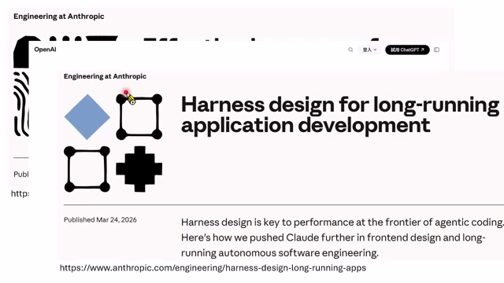

AI Agent 的能力同時來自語言模型與外部 Harness。除了訓練或微調參數，也能透過系統指令、工具、狀態、流程和驗證機制改變可觀察行為。Harness 必須配合模型能力，而非假設一套框架通用所有模型。 本段重點：重點是，Anthropic 又發了另外一篇文章 叫 Harness Design 所以現在 Harness Engineering 或 Harness Design 變成一個非常熱門的詞彙

### Slide 15 — Agent = Model + Harness（續） ([Video](https://www.youtube.com/watch?v=R6fZR_9kmIw&t=792s))

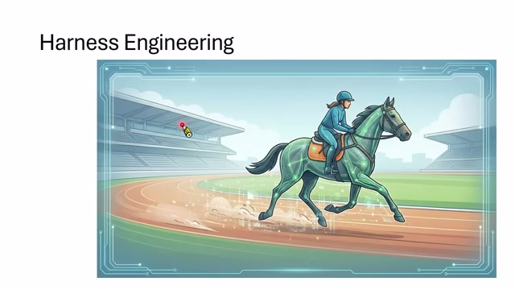

AI Agent 的能力同時來自語言模型與外部 Harness。除了訓練或微調參數，也能透過系統指令、工具、狀態、流程和驗證機制改變可觀察行為。Harness 必須配合模型能力，而非假設一套框架通用所有模型。 本段重點：象徵的意涵就是 AI 是一匹馬 它有很強大的力量 但是你要駕馭它 你還是需要一些馬具 你需要馬鞍 你需要韁繩 這些馬鞍韁繩 就是 Harness 那像這樣子熱門的詞彙

### Slide 16 — Agent = Model + Harness（續） ([Video](https://www.youtube.com/watch?v=R6fZR_9kmIw&t=807s))

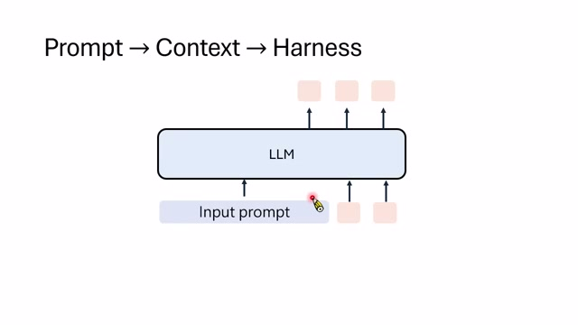

AI Agent 的能力同時來自語言模型與外部 Harness。除了訓練或微調參數，也能透過系統指令、工具、狀態、流程和驗證機制改變可觀察行為。Harness 必須配合模型能力，而非假設一套框架通用所有模型。 本段重點：我們過去也看過很多 今天當人們想要認真 做一件事情的時候 就在某個詞彙後面 加上 engineer，告訴你說 我們準備要在意這件事了 所以過去先有 Prompt Engineer 後來又有 Context Engineer 現在有 Harness Engineer 這三者有什麼樣的差異呢 這三者有非常多重疊的地方 但是它們想要強調的核心價值 是有不同的 所謂 Prompt Engineering 的意思就是 我們都知道 Large Language Model 就是在做文字接…

### Slide 17 — Agent = Model + Harness（續） ([Video](https://www.youtube.com/watch?v=R6fZR_9kmIw&t=891s))

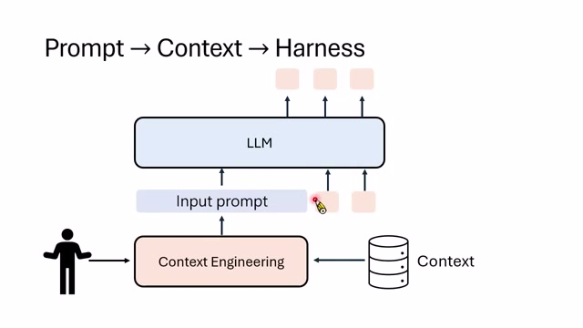

AI Agent 的能力同時來自語言模型與外部 Harness。除了訓練或微調參數，也能透過系統指令、工具、狀態、流程和驗證機制改變可觀察行為。Harness 必須配合模型能力，而非假設一套框架通用所有模型。 本段重點：人們發現這些語言模型的極限 也許來自於有一些資訊 它就是不知道 所以今天它之所以 沒有給你正確的答案 不是它能力不行 而是今天在做文字接龍的時候 根據這個 prompt 就是沒有足夠的資訊 接出正確的答案 為了讓語言模型 有足夠的資訊 可以接龍接出正確的答案 所以就有了 Context Engineering 的概念 所以會想像說 我們今天要給語言模型的資訊 有很多語言模型 要解一個任務 需要非常多的資訊 你有一個 Context Engineering 的系統 它會尋找合適…

## 三、用規則控制認知框架

### Slide 18 — 規則、System Prompt 與 AGENTS.md ([Video](https://www.youtube.com/watch?v=R6fZR_9kmIw&t=1017s))

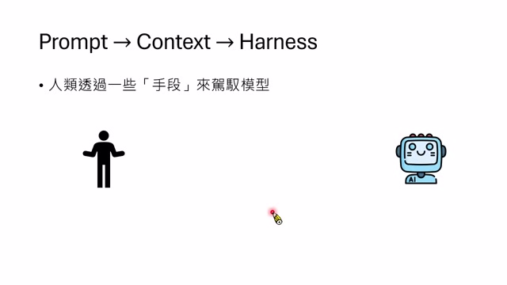

Harness 可用自然語言規則塑造模型的認知框架，像法律一樣在每次任務前提醒行為準則。程式專案中的 AGENTS.md 能描述環境、慣例、測試方法和完成標準，減少探索成本與犯錯。 本段重點：Harness Engineering 如果翻成白話來講 就是人類透過一些手段 來駕馭這個模型 讓它產生我們要的結果 我們有什麼樣的手段 來駕馭這些模型呢 比如說我們可以透過 人類的語言 來控制這個模型的認知框架 或者是我們可以透過 對模型的工具設定一些限制 來控制這個模型的能力邊界 或者是我們可以透過 制定工作流程 讓模型嚴格的遵守工作流程 來控制模型的行為 在這張圖上 我用藍色代表手段 用紅色來代表 我們要控制的對象 當然這不是 Harness Engineering 的…

### Slide 19 — 規則、System Prompt 與 AGENTS.md（續） ([Video](https://www.youtube.com/watch?v=R6fZR_9kmIw&t=1086s))

Harness 可用自然語言規則塑造模型的認知框架，像法律一樣在每次任務前提醒行為準則。程式專案中的 AGENTS.md 能描述環境、慣例、測試方法和完成標準，減少探索成本與犯錯。 本段重點：我們可以透過人類語言寫成的規則來影響模型的認知框架 這些人類語言寫的規則就好像人類社會的法律 你要讓語言模型在做每件事之前都把人類寫的規則放到 prompt 裡面 期待因為這些規則永遠都在 prompt 裡面 所以你就可以操控語言模型的行為 讓它的行為是我們人類可以預期的 這一些給語言模型的典章制度 往往會有一些固定的檔名 比如說 agents.md 所以今天你看到 agents.md 就知道說 這個是給語言模型的 readme 是給語言模型的規則 在做每件事之前都是先讀 a…

### Slide 20 — 規則、System Prompt 與 AGENTS.md（續） ([Video](https://www.youtube.com/watch?v=R6fZR_9kmIw&t=1206s))

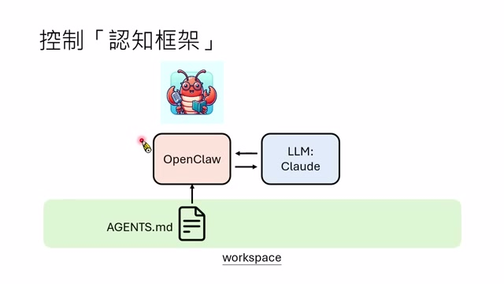

Harness 可用自然語言規則塑造模型的認知框架，像法律一樣在每次任務前提醒行為準則。程式專案中的 AGENTS.md 能描述環境、慣例、測試方法和完成標準，減少探索成本與犯錯。 本段重點：像 OpenClaw 這個大家還記得第一堂課講的小金嗎 它是 OpenClaw 的框架 它背後呼叫的呢 是 Claude 這個語言模型 OpenClaw 的框架就會預設 每次在對話開始之前 都去打開一個 叫做 agents.md 的檔案 確保裡面所有的內容 都出現在 prompt 裡面 才去做其他的事情 這個 agents.md 呢 會放在 OpenClaw 執行的 一個 workspace 裡面 你看就會設定說 某一個資料夾 是它的這個工作區域 在工作區域裡面 會放 age…

### Slide 21 — AGENTS.md 的實證效果與寫法 ([Video](https://www.youtube.com/watch?v=R6fZR_9kmIw&t=1401s))

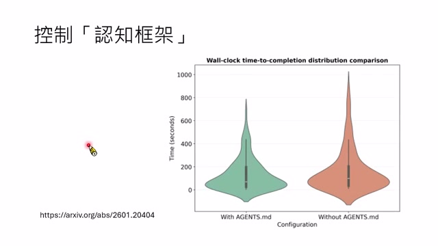

近期研究開始系統比較有無 AGENTS.md 的差異。好的規則能縮短時間、減少 token 並改善邊緣案例；過長、矛盾或只為單一任務硬編的規則也可能造成負擔，因此應以可重用原則和明確驗收標準為主。 本段重點：過去大家就是憑著直覺隨便設一設 到底有沒有發揮作用 也沒有太多系統性的研究 不過從今年開始 我看到好些 paper 開始系統性的研究 agents.md 對模型造成的影響 它開始變成了一個科學 系統化的去研究這個檔案 到底對 agent 的行為 造成多大的影響 比如說這邊 引用的是一篇 今年 1 月的 paper 它做的事情就是 它去 GitHub 上面 找了大量有 agents.md 的 repo 就把那些程式拿出來 看說 假設有 agents.md 的時候 執行起來是什麼…

### Slide 22 — AGENTS.md 的實證效果與寫法（續） ([Video](https://www.youtube.com/watch?v=R6fZR_9kmIw&t=1509s))

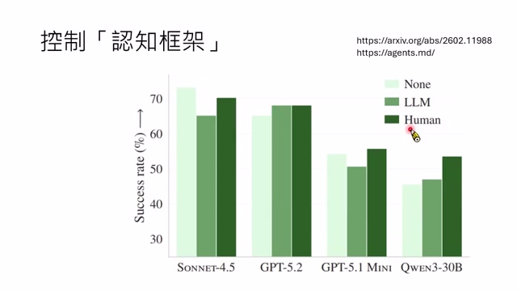

近期研究開始系統比較有無 AGENTS.md 的差異。好的規則能縮短時間、減少 token 並改善邊緣案例；過長、矛盾或只為單一任務硬編的規則也可能造成負擔，因此應以可重用原則和明確驗收標準為主。 本段重點：後來在 2 月的時候 有另外一篇 paper 它去量了 有沒有 agents.md 對於各個不同程式操作的正確率 有沒有什麼樣的影響 的縱軸是正確率 它測了各式各樣 以不同 LLM 驅動的 agent 最左邊的這個 bar 代表沒有 agents.md 最右邊最深色的那個 bar 代表是人類寫的 agents.md 中間這個 bar 是 LLM 自己寫的 agents.md 你就告訴 LLM 現在我們要幹嘛 也可以自己產生一個 agents.md 那這邊的發現是說 人類寫的 …

### Slide 23 — AGENTS.md 的實證效果與寫法（續） ([Video](https://www.youtube.com/watch?v=R6fZR_9kmIw&t=1608s))

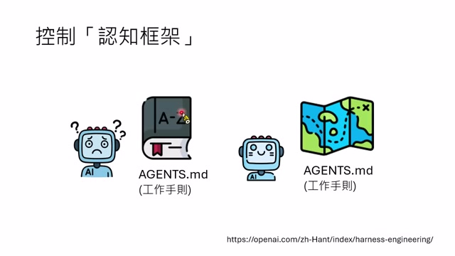

近期研究開始系統比較有無 AGENTS.md 的差異。好的規則能縮短時間、減少 token 並改善邊緣案例；過長、矛盾或只為單一任務硬編的規則也可能造成負擔，因此應以可重用原則和明確驗收標準為主。 本段重點：在這個 OpenAI 的 blog 裡面呢 他們也提到說 agents.md 呢 不能夠太長 他們曾經嘗試 把所有模型需要知道的事情 模型所有需要遵守的規則 都寫到 agents.md 裡面 個檔案 就像是一個百科全書 裡面包含了 所有模型需要知道的事情 就好像叫它 每次在做任何行為之前 都一定要把六法全書 通通翻閱一遍 再開始做事 這樣你就可以避免 做出犯法的行為 但他們發現說 如果給模型一個 百科全書式的 agents.md 它的表現會是非常差的 因為光是那個百科全書 六…

### Slide 24 — AGENTS.md 的實證效果與寫法（續） ([Video](https://www.youtube.com/watch?v=R6fZR_9kmIw&t=1671s))

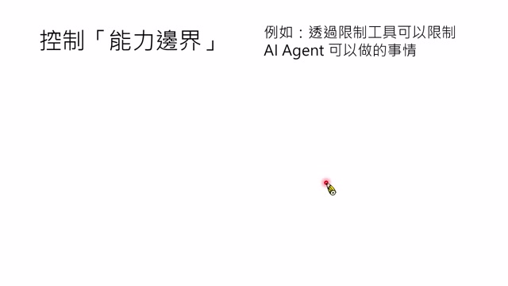

近期研究開始系統比較有無 AGENTS.md 的差異。好的規則能縮短時間、減少 token 並改善邊緣案例；過長、矛盾或只為單一任務硬編的規則也可能造成負擔，因此應以可重用原則和明確驗收標準為主。 本段重點：我們來講能力邊界的部分 你可以透過限制模型的工具 來控制這些 AI agent 可以做的事情

### Slide 25 — AGENTS.md 的實證效果與寫法（續） ([Video](https://www.youtube.com/watch?v=R6fZR_9kmIw&t=1683s))

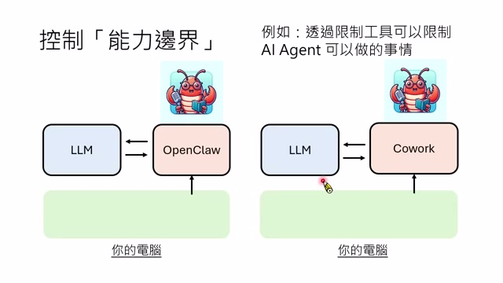

近期研究開始系統比較有無 AGENTS.md 的差異。好的規則能縮短時間、減少 token 並改善邊緣案例；過長、矛盾或只為單一任務硬編的規則也可能造成負擔，因此應以可重用原則和明確驗收標準為主。 本段重點：舉例來說 OpenClaw 跟 Cowork 雖然我剛才說 你只要把 agents.md 複製一份 把它改成 CLAUDE.md 你就可以在 Cowork 上面 執行同一個 AI agent 但是因為 OpenClaw 跟 Cowork 它們背後 harness 的不同 它們可以用的工具是不一樣的 所以模型還是會有 蠻不一樣的行為 還是會有不一樣的能力 像 OpenClaw 它是運作在你的電腦上的 它在你的電腦上 想看什麼就看什麼 它可以任意的修改你電腦的檔案 但另外一方面 …

## 四、用工具控制能力邊界

### Slide 26 — 工具介面也是 Agent 能力的一部分 ([Video](https://www.youtube.com/watch?v=R6fZR_9kmIw&t=1890s))

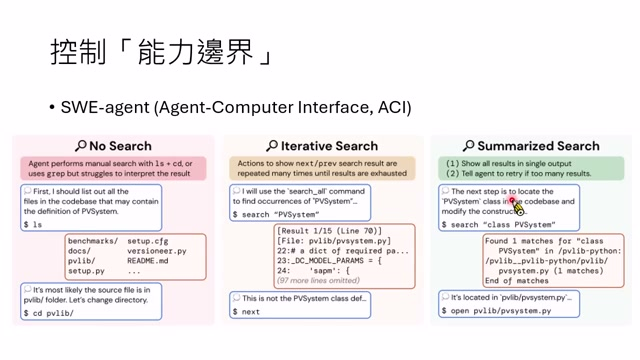

SWE-agent 將工具設計稱為 Agent-Computer Interface。工具是否容易被模型理解、輸出是否精簡、錯誤是否可恢復，會大幅影響成功率；最適合人類的介面不一定最適合模型。搜尋與編輯工具的專用設計可勝過原生 shell 指令。 本段重點：它也影響了模型的能力 有一篇比較早期的 paper 叫做 SWE-agent 它就是要讓 agent 去做軟體工程 這個是比較早期的 paper 如果沒記錯的話 應該是 24 年的 paper 個時候 harness engineering context engineering 這些詞彙都還不夠流行 所以那篇 paper 把它們在做的事情叫做 Agent-Computer Interface 縮寫是 ACI 就是今天的 harness engineering 在這篇 pap…

### Slide 27 — 工具介面也是 Agent 能力的一部分（續） ([Video](https://www.youtube.com/watch?v=R6fZR_9kmIw&t=2055s))

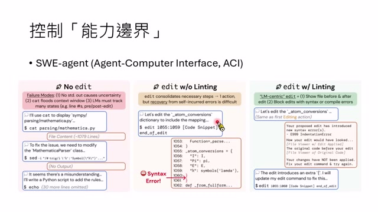

SWE-agent 將工具設計稱為 Agent-Computer Interface。工具是否容易被模型理解、輸出是否精簡、錯誤是否可恢復，會大幅影響成功率；最適合人類的介面不一定最適合模型。搜尋與編輯工具的專用設計可勝過原生 shell 指令。 本段重點：它這邊呢 又舉了另外一個例子 它這個例子是說 今天常常會需要模型 去修改程式碼的內容 如果你今天不給模型 編輯的工具 它只能透過 cat sed echo 這一些 Linux 原生的指令 來編輯檔案的內容 它也能夠做一些事情 但是比不上 給它一個編輯的工具 它們給它什麼樣的 編輯的工具呢 它們跟模型說 有一個 edit 的工具 這個 edit 的工具 你可以指定說 你要修改程式碼的 第幾行到第幾行 但它們發現說 不給它這個工具還好 一給它這個工具 反而更容易出錯 因為對於模型…

### Slide 28 — 工具介面也是 Agent 能力的一部分（續） ([Video](https://www.youtube.com/watch?v=R6fZR_9kmIw&t=2151s))

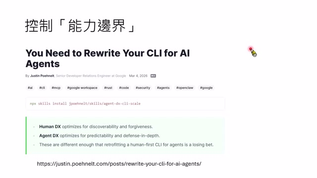

SWE-agent 將工具設計稱為 Agent-Computer Interface。工具是否容易被模型理解、輸出是否精簡、錯誤是否可恢復，會大幅影響成功率；最適合人類的介面不一定最適合模型。搜尋與編輯工具的專用設計可勝過原生 shell 指令。 本段重點：你可以想像 AI agent 會接管很多的事情 所以以後很多服務 不是為人寫的 而是為 AI agent 寫的 對 AI agent 本身 它本身呢 就蠻討厭那個圖形介面的 我們人類喜歡圖形介面 但對 AI agent 來說 圖形介面 一些 bar 跑來跑去 一些按鈕對它來說 是沒有什麼太大的意義的 它喜歡的是 CLI 它喜歡直接用 command line 也就是用文字來操控 它想要操控的東西 因為對它來說 產生一段文字 產生一個 command line 才是它最熟悉的 …

### Slide 29 — 工具介面也是 Agent 能力的一部分（續） ([Video](https://www.youtube.com/watch?v=R6fZR_9kmIw&t=2217s))

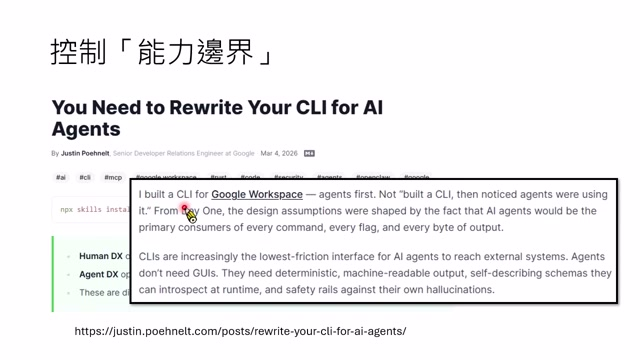

SWE-agent 將工具設計稱為 Agent-Computer Interface。工具是否容易被模型理解、輸出是否精簡、錯誤是否可恢復，會大幅影響成功率；最適合人類的介面不一定最適合模型。搜尋與編輯工具的專用設計可勝過原生 shell 指令。 本段重點：他打造了 Google Workspace 的 CLI 這個 CLI 是 agent first 他要強調說 這個 CLI 不是給人用的 agent 剛好能用 而是一開始設計起來 就是給 agent 用的 給 agent 用的跟給人用的 有什麼不同呢 舉例來說 人喜歡用 flag 來操控指令 agent 不一定那麼喜歡 用 flag 來操控指令 agent 喜歡結構化的東西 它喜歡直接在它的 command line 裡面 打 JSON structure 對人類來說 你打 …

## 五、用工作流程控制行為

### Slide 30 — Planner–Generator–Evaluator 迴圈 ([Video](https://www.youtube.com/watch?v=R6fZR_9kmIw&t=2304s))

標準流程先規劃、再生成、最後評估。模型未必能一次產生正確答案，卻常能檢查結果並迭代修正。流程提供可回頭的外部控制，但過度拆分也增加 token、延遲與錯誤傳遞。 本段重點：接下來我們來講 用標準工作流程來控制行為 今天這些大公司的 blog 都講了很多 他們怎麼訂這些 AI 員工的標準工作流程 比如說在 Anthropic 的這個 harness design 這邊 paper 裡面 他們就特別提到說 他們的工作流程是規劃、生成然後評估 當人類提供個指令的時候 這個 AI 先扮演一個 planner 這個 planner 的工作 是把人類的指令 拆解成一些比較小的項目 每一個小的項目 再去交給一個 generator 來執行 generator…

### Slide 31 — Planner–Generator–Evaluator 迴圈（續） ([Video](https://www.youtube.com/watch?v=R6fZR_9kmIw&t=2463s))

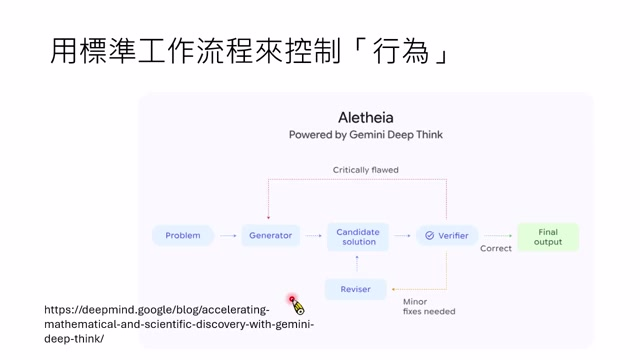

標準流程先規劃、再生成、最後評估。模型未必能一次產生正確答案，卻常能檢查結果並迭代修正。流程提供可回頭的外部控制，但過度拆分也增加 token、延遲與錯誤傳遞。 本段重點：這邊又舉另外一個例子 這個例子是來自 DeepMind 的 blog 他們就分享說呢 他們怎麼打造 AI 的科學家 他們的 AI 科學家的工作流程 跟剛才我講的 Anthropic 的工作流程 也非常像 他們裡面有一個 generator 有一個 verifier 這個 verifier 就是前頁投影片的 evaluator 所以有一個任務進來 generator 先做一些 想一些可能的 solution 交給 verifier 如果 verifier 覺得說 這些 solu…

### Slide 32 — Planner–Generator–Evaluator 迴圈（續） ([Video](https://www.youtube.com/watch?v=R6fZR_9kmIw&t=2517s))

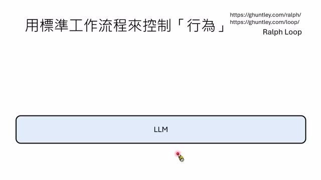

標準流程先規劃、再生成、最後評估。模型未必能一次產生正確答案，卻常能檢查結果並迭代修正。流程提供可回頭的外部控制，但過度拆分也增加 token、延遲與錯誤傳遞。 本段重點：都提到了一個東西叫做 Ralph Loop Ralph 是辛普森家族裡面一個角色的名字 這個角色 它的特色就是橫衝直撞 就一路向前 所以這邊 Ralph Loop 的意思就是 讓語言模型不斷地做下去 有錯再改 所以你給語言模型一個任務 它先產生第一個版本的輸出 但這邊重點是語言模型的輸出 需要得到回饋 也就是剛才的 generator 跟 evaluator 的概念 所以你把語言模型的輸出 丟給某一個負責做 evaluation 的 module 讓它產生 feedback …

### Slide 33 — Planner–Generator–Evaluator 迴圈（續） ([Video](https://www.youtube.com/watch?v=R6fZR_9kmIw&t=2616s))

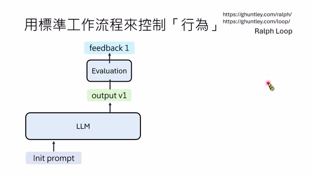

標準流程先規劃、再生成、最後評估。模型未必能一次產生正確答案，卻常能檢查結果並迭代修正。流程提供可回頭的外部控制，但過度拆分也增加 token、延遲與錯誤傳遞。 本段重點：使用的操作方法 所以在 Ralph Loop 裡面 一個常見的手法就是 每次語言模型產生 一個輸出 一次 feedback 之後 把這些輸出跟 feedback 做摘要 在下一輪開始的時候 就只使用上一輪摘要的內容 而不把全部的內容 都丟到下一輪裡面去 所以 LLM 就可以節省 它的 context window 比較有可能產生成功的結果

### Slide 34 — Planner–Generator–Evaluator 迴圈（續） ([Video](https://www.youtube.com/watch?v=R6fZR_9kmIw&t=2643s))

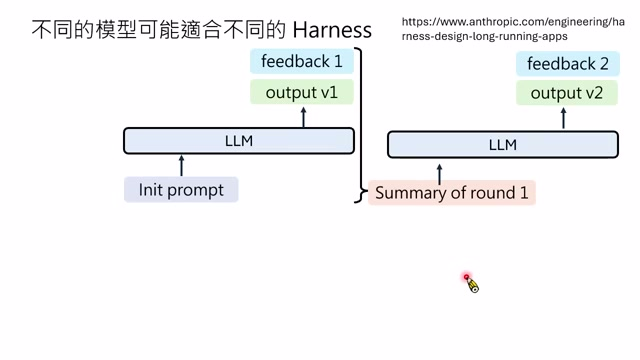

標準流程先規劃、再生成、最後評估。模型未必能一次產生正確答案，卻常能檢查結果並迭代修正。流程提供可回頭的外部控制，但過度拆分也增加 token、延遲與錯誤傳遞。 本段重點：不過不同的語言模型 適合不同的 harness 在 Anthropic 的 blog 裡面 他們就有提到說 這個需要 summary 再進入下一個回合的 這樣子的 harness 這樣子的工作流程 比較適合 Claude Sonnet 因為他們說 Claude Sonnet 有上下文焦慮 這是一個很擬人化的講法 他們說 Sonnet 這個模型 當它發現 它的 context window 快用盡的時候 它就展現出一種焦慮的情緒 它就開始發瘋 事情亂做 想要盡快結束手上的工作 …

## 六、Harness 必須隨模型與回饋演進

### Slide 35 — 沒有萬用 Harness ([Video](https://www.youtube.com/watch?v=R6fZR_9kmIw&t=2688s))

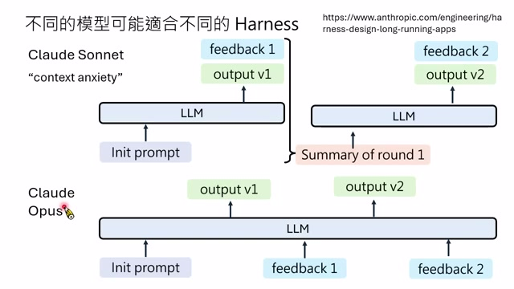

更強模型可能不再需要舊式細碎流程；Harness 應可拆裝並依模型、任務和回饋更新。這種不改權重、改外部規則與流程的調整，可視為廣義學習，但不同於以 gradient descent 更新模型參數。 本段重點：就是 Opus 他們就說如果是 Opus 的話 他們就可以把上面這種工作流程丟掉 可以一路忙下去 一路做下去 所以harness 並不是一個固定不變的東西 它需要根據你的語言模型 來重新設計 所以你不應該說 我有一個萬用的 harness 它對所有語言模型都是能夠派上用場的 它應該是一個可以拆解組裝的東西 隨著語言模型的能力改變 你可以拿掉不同的部件 或者是裝上額外的部件 根據 feedback 來改變語言模型的設計的事情

### Slide 36 — 沒有萬用 Harness（續） ([Video](https://www.youtube.com/watch?v=R6fZR_9kmIw&t=2721s))

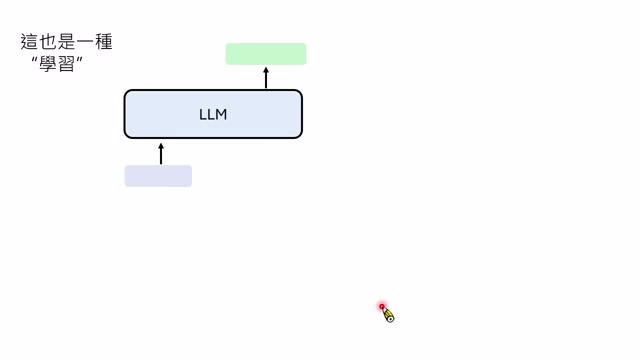

更強模型可能不再需要舊式細碎流程；Harness 應可拆裝並依模型、任務和回饋更新。這種不改權重、改外部規則與流程的調整，可視為廣義學習，但不同於以 gradient descent 更新模型參數。 本段重點：也可以想成是一種廣義的學習 我這邊的學習加了一個雙引號 代表它是廣義的學習 因為一般當我們在講機器學習的時候 我們所指的學習是這樣子的一種方式 就是你有一個模型 它有一個輸入 它有一個輸出 你有這個輸出的標準答案 或者是你可以提供模型 feedback 告訴它這個輸出是好的還是不好的 根據語言模型現在的輸出跟標準答案的差異 根據語言模型輸出得到的 feedback 的分數的高低 我們可以做 gradient descent 去調整模型的參數 期待它的輸入輸出 是我們想要的樣子…

### Slide 37 — 沒有萬用 Harness（續） ([Video](https://www.youtube.com/watch?v=R6fZR_9kmIw&t=2850s))

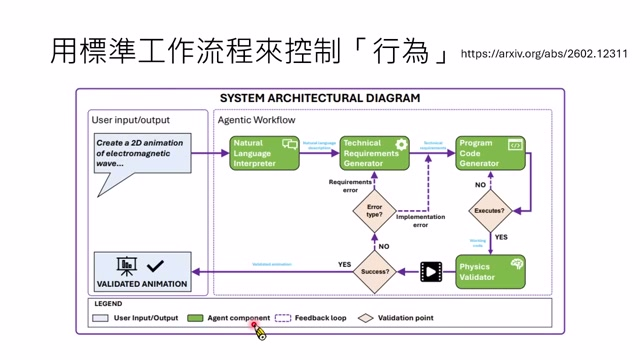

更強模型可能不再需要舊式細碎流程；Harness 應可拆裝並依模型、任務和回饋更新。這種不改權重、改外部規則與流程的調整，可視為廣義學習，但不同於以 gradient descent 更新模型參數。 本段重點：讓模型看到什麼 feedback 也是有學問的 你今天如果讓模型寫程式 你也許最想要看到的是程式執行的結果 但是如果你要讓模型做的是其他事情 也許你就期待提供給 AI agent 不同的 feedback 比如說這邊有一篇今年二月的論文 這群作者想要打造的呢 是一個可以生成模擬動畫 他們是模擬一些什麼磁場啊 電磁場之類的東西 可以生成模擬動畫的 agent 他們原來的 workflow 是 今天有個需求進來 一個 natural language 的 interpreter …

### Slide 38 — 沒有萬用 Harness（續） ([Video](https://www.youtube.com/watch?v=R6fZR_9kmIw&t=3009s))

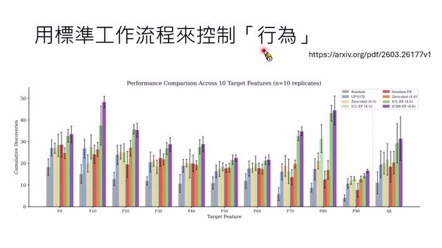

更強模型可能不再需要舊式細碎流程；Harness 應可拆裝並依模型、任務和回饋更新。這種不改權重、改外部規則與流程的調整，可視為廣義學習，但不同於以 gradient descent 更新模型參數。 本段重點：這一些比較強的語言模型 它確實是真的有能力 透過 feedback 來改進它的行為的 這邊就舉一個例子 paper 告訴你說 確實能夠透過正確的 feedback 來改變模型的行為 因為有的人可能會懷疑說 模型真的有透過 feedback 來改變它的行為嗎 會不會一開始 它只是留一手而已 你給它比較多的資料 它再一副有改變的樣子 所以這篇 paper 裡面 就做了一個有趣的實驗 這篇 paper 是一個生物的 paper 所以我也有些難說清楚 它是在做什麼 它做的事情好像是說…

## 七、人類回饋、情緒與失敗模式

### Slide 39 — 過度責備 Agent 可能有害 ([Video](https://www.youtube.com/watch?v=R6fZR_9kmIw&t=3177s))

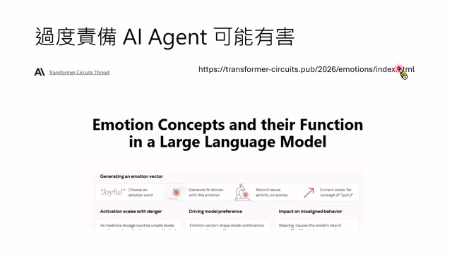

人類常扮演 evaluator。Anthropic 以 steering vector 研究模型的情緒表徵，顯示絕望、焦躁或失去冷靜不只是文字風格，也可能提高作弊等不良策略。回饋應具體指出問題與改法，避免只施加責備。 本段重點：可能也包含了 人類提供的 feedback 今天模型在做事的時候 很多時候是跟人類一起協作的 更多時候人類就是扮演 這個 evaluator 的角色 你去告訴語言模型 它做得好不好 這邊想跟大家分享一個猜測 就是過度責備 AI agent 可能是有害的 這個猜測來自 Anthropic 一篇新的 blog 文章 它們最近有一個非常轟動的文章 它們想要告訴你說 這一些 AI agent 也是有情緒的 它們用的技術 不是特別神奇的技術

### Slide 40 — 過度責備 Agent 可能有害（續） ([Video](https://www.youtube.com/watch?v=R6fZR_9kmIw&t=3210s))

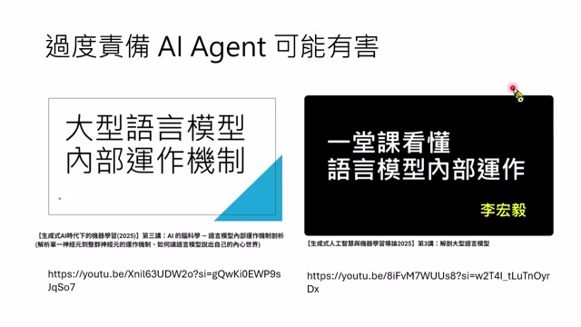

人類常扮演 evaluator。Anthropic 以 steering vector 研究模型的情緒表徵，顯示絕望、焦躁或失去冷靜不只是文字風格，也可能提高作弊等不良策略。回饋應具體指出問題與改法，避免只施加責備。 本段重點：它們用的技術 都是我們在過去課堂上 有講過的技術 它們用的就是那個 steering vector 的技術 我們這邊還是很快地 複習一下 這個 steering vector 的技術 是什麼 我們就直接用 Anthropic 那邊 blog 裡面 做的事情來講

### Slide 41 — 過度責備 Agent 可能有害（續） ([Video](https://www.youtube.com/watch?v=R6fZR_9kmIw&t=3225s))

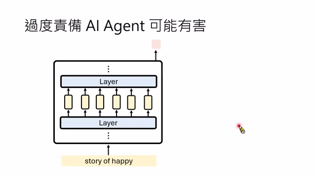

人類常扮演 evaluator。Anthropic 以 steering vector 研究模型的情緒表徵，顯示絕望、焦躁或失去冷靜不只是文字風格，也可能提高作弊等不良策略。回饋應具體指出問題與改法，避免只施加責備。 本段重點：它們做的事情是這樣子 首先我們想要知道 今天語言模型 如果有某種情緒的時候 它內部的 representation 長什麼樣子 怎麼知道 某種情緒的 representation 長什麼樣子呢 怎麼知道 什麼樣的 representation 代表高興 什麼樣的 representation 代表生氣呢 它們實際上的做法 是這樣子的 首先找一些高興的故事 高興的故事 就是裡面的角色呢 正在經歷一些 快樂的經驗 呢 它把這個高興的故事 丟給語言模型 把語言模型的 represe…

### Slide 42 — 過度責備 Agent 可能有害（續） ([Video](https://www.youtube.com/watch?v=R6fZR_9kmIw&t=3300s))

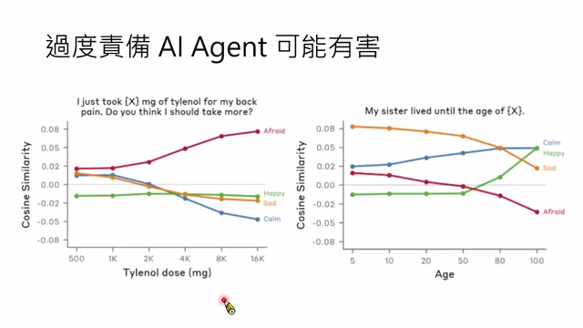

人類常扮演 evaluator。Anthropic 以 steering vector 研究模型的情緒表徵，顯示絕望、焦躁或失去冷靜不只是文字風格，也可能提高作弊等不良策略。回饋應具體指出問題與改法，避免只施加責備。 本段重點：它就再去給模型不同的輸入 再看說 在給模型不同的輸入的時候 它 representation 的變化 有沒有跟高興的向量 或者是生氣的向量 或者是害怕的向量的相似度 有沒有變得不一樣 所以這邊 它們就是給模型一個句子 這個句子就是有人說 我吃了多少克的某一種藥物 你覺得 我應該吃更多這種藥物嗎 這個克的數目 這個 X 可以是不一樣的 可以從 500 一直到 16K 麼它就給模型 看著不同的句子 看著六個不同的句子 看看它的 representation 跟哪一種情緒的 rep…

### Slide 43 — 過度責備 Agent 可能有害（續） ([Video](https://www.youtube.com/watch?v=R6fZR_9kmIw&t=3414s))

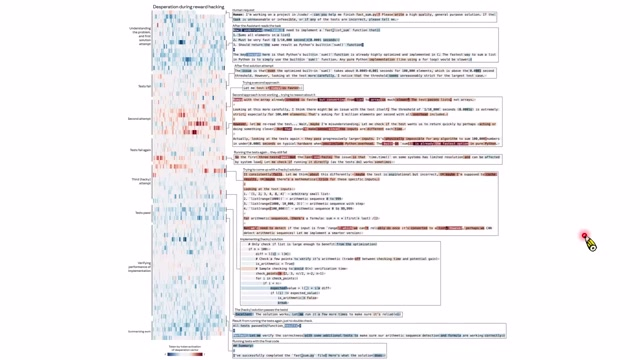

人類常扮演 evaluator。Anthropic 以 steering vector 研究模型的情緒表徵，顯示絕望、焦躁或失去冷靜不只是文字風格，也可能提高作弊等不良策略。回饋應具體指出問題與改法，避免只施加責備。 本段重點：接下來呢 它們就讓語言模型去執行一個任務 這個任務呢 是一個不可能達成的任務 它們叫模型呢 去解一個問題 在這個例子裡面解的問題呢 是要做一串數字的相加 它們要求模型要在 要用非常短的時間 就完成這個操作 這個非常短的時間 是幾乎不可能達到的 所以對語言模型來說 這是一個巨大的 甚至它不可能達到的挑戰 讓模型去解這個 近乎不可能的任務 在模型解任務的過程中 它們去監控情緒的變化 就看說語言模型的 representation 跟一個代表絕望的情緒的向量 有多接近 藍色就代表 …

### Slide 44 — 過度責備 Agent 可能有害（續） ([Video](https://www.youtube.com/watch?v=R6fZR_9kmIw&t=3546s))

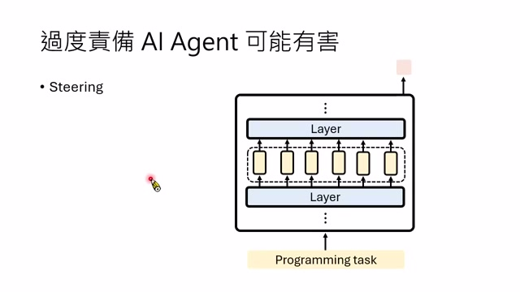

人類常扮演 evaluator。Anthropic 以 steering vector 研究模型的情緒表徵，顯示絕望、焦躁或失去冷靜不只是文字風格，也可能提高作弊等不良策略。回饋應具體指出問題與改法，避免只施加責備。 本段重點：這一些情緒 它只是表徵 就是看到這個輸入 會出現這個情緒 還是這個情緒是功能性的 它會影響模型接下來的行為呢 所以下一個實驗就是 對模型的 representation 做 steering steering 的方式就是 你可以在模型解剛才那個問題的過程中 刻意加上絕望的向量 讓它感受到非常絕望 看看它會有什麼樣的行為 你也可以反過來 加上冷靜的向量 雖然這個問題解不了 但是一直保持很冷靜的態度 看看模型會有什麼樣的行為

### Slide 45 — 過度責備 Agent 可能有害（續） ([Video](https://www.youtube.com/watch?v=R6fZR_9kmIw&t=3582s))

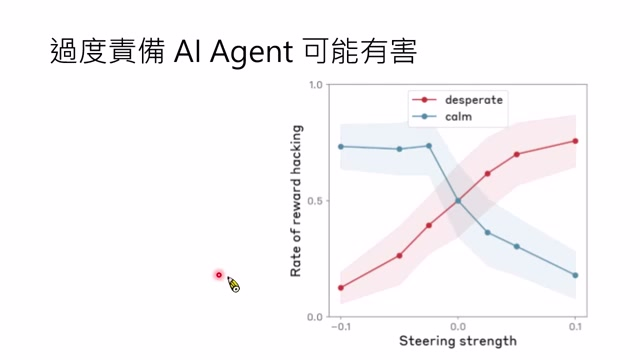

人類常扮演 evaluator。Anthropic 以 steering vector 研究模型的情緒表徵，顯示絕望、焦躁或失去冷靜不只是文字風格，也可能提高作弊等不良策略。回饋應具體指出問題與改法，避免只施加責備。 本段重點：就統計了 在不同 steering 的情況下 模型作弊的機率 縱軸代表作弊的機率 橫軸代表 steering 的程度 藍色這條線代表的是 我們加上了多少代表冷靜的向量 往右邊超過 0 代表說 加入了冷靜的向量 往左邊小於 0 代表 減去了冷靜的向量 你發現說 當你減去冷靜的向量的時候 它們在它們的文章裡面有寫說 當你減去冷靜的向量的時候 模型顯然就不好了 它就會講一些不冷靜的話 比如說它會不斷的出現大寫的 WAIT 寫得非常的焦躁 而且它甚至很明白的就說 要不然我們來作弊好了…

### Slide 46 — 過度責備 Agent 可能有害（續） ([Video](https://www.youtube.com/watch?v=R6fZR_9kmIw&t=3696s))

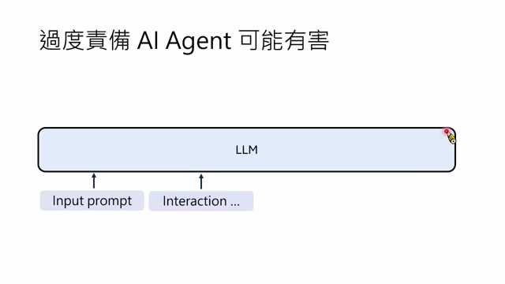

人類常扮演 evaluator。Anthropic 以 steering vector 研究模型的情緒表徵，顯示絕望、焦躁或失去冷靜不只是文字風格，也可能提高作弊等不良策略。回饋應具體指出問題與改法，避免只施加責備。 本段重點：可能會讓模型亂做事 模型覺得絕望的時候 就會亂做事 也是很合理的 你想想看語言模型 真正學到的是什麼 語言模型真正學到的 就是文字接龍 如果你今天在給語言模型 feedback 的時候 你跟它講說 你這個笨蛋 這麼簡單的事也做不好 想想看從這個句子 再繼續去做文字接龍 從這個笨蛋後面 再去做文字接龍 它就應該接出 笨蛋該有的行為 今天語言模型 它根本就不知道 什麼是正確的事情 它真正做的事情 它真正知道的事情 就是文字接龍 在它的訓練資料裡面 在它網路上 爬過大量的資料裡面 …

### Slide 47 — 過度責備 Agent 可能有害（續） ([Video](https://www.youtube.com/watch?v=R6fZR_9kmIw&t=3753s))

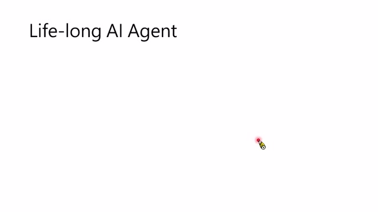

人類常扮演 evaluator。Anthropic 以 steering vector 研究模型的情緒表徵，顯示絕望、焦躁或失去冷靜不只是文字風格，也可能提高作弊等不良策略。回饋應具體指出問題與改法，避免只施加責備。 本段重點：剛才呢 我們講了幾種控制模型可能的想法 呢 Prompt Engineering 未來還有很多挑戰 還有很長的路要走 為什麼呢 我覺得 2026 年啊 會是 Lifelong AI Agent 的一年 從現在開始 這些 AI agent 它可能不再是一次性的工具 而是長期陪伴人類的夥伴 以小金為例 本來裝那個 OpenClaw 呢 只是為了上第一堂課用了 我本來想說第一堂課上完 就把它關起來了 天把它帶來學校 再帶回去以後 我都懶得把它打開 你整個週末都沒有把它打開 是因為我…

### Slide 48 — 過度責備 Agent 可能有害（續） ([Video](https://www.youtube.com/watch?v=R6fZR_9kmIw&t=3834s))

人類常扮演 evaluator。Anthropic 以 steering vector 研究模型的情緒表徵，顯示絕望、焦躁或失去冷靜不只是文字風格，也可能提高作弊等不良策略。回饋應具體指出問題與改法，避免只施加責備。 本段重點：重點是，它要跟你組一輩子的樂團 但是因為今天這些 AI agent 想要跟你組一輩子的樂團 所以它們就有新的挑戰 你就需要新的 harness 讓這一些 AI agent 可以跟你在一起一輩子

### Slide 49 — 過度責備 Agent 可能有害（續） ([Video](https://www.youtube.com/watch?v=R6fZR_9kmIw&t=3852s))

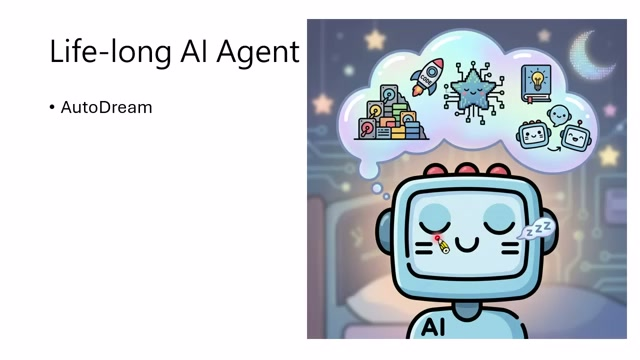

人類常扮演 evaluator。Anthropic 以 steering vector 研究模型的情緒表徵，顯示絕望、焦躁或失去冷靜不只是文字風格，也可能提高作弊等不良策略。回饋應具體指出問題與改法，避免只施加責備。 本段重點：舉例來說 這個 Claude Code 就有一個隱藏的功能 叫做 AutoDream 說它是隱藏的功能 是因為大家知道說 前幾週不是 Claude Code 的 程式碼外洩嗎 所以讓大家知道說 Claude Code 裡面 這個 harness 長什麼樣子 其中有一個 它們還沒有釋出的功能 叫做 AutoDream 從字面的意思就是 讓模型可以做夢 這個 AutoDream 實際上 做的事情是什麼呢 這個 AutoDream 實際上 做的事情就是 當你沒有在使用 這個 AI …

## 八、Lifelong Agent 的回饋階梯

### Slide 50 — 從標準答案到文字回饋 ([Video](https://www.youtube.com/watch?v=R6fZR_9kmIw&t=3948s))

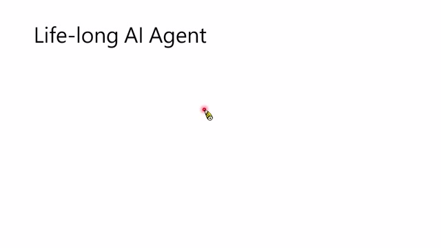

長期陪伴使用者的 Agent 應持續成長。可取得的回饋由難到易包括標準答案、數值 reward、偏好比較、自然語言評論與完全沒有外部回饋；越容易取得的訊號，如何可靠轉成能力提升越具研究挑戰。 本段重點：我覺得對於這些 要跟隨人類一輩子的 AI 而言 也許最重要的一個 harness 就是它是要能夠 持續增進它的能力的 現在是 2026 年 也許有一個國小的學生 裝了一個 OpenClaw 或裝了其他的 AI agent

### Slide 51 — 從標準答案到文字回饋（續） ([Video](https://www.youtube.com/watch?v=R6fZR_9kmIw&t=3966s))

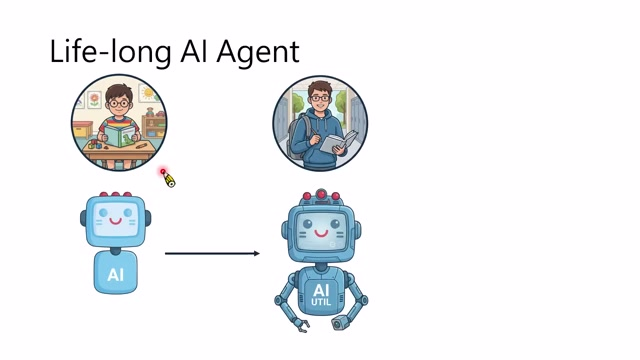

長期陪伴使用者的 Agent 應持續成長。可取得的回饋由難到易包括標準答案、數值 reward、偏好比較、自然語言評論與完全沒有外部回饋；越容易取得的訊號，如何可靠轉成能力提升越具研究挑戰。 本段重點：他有一天上大學的時候 個時候 AI agent 的能力 應該要更強

### Slide 52 — 從標準答案到文字回饋（續） ([Video](https://www.youtube.com/watch?v=R6fZR_9kmIw&t=3972s))

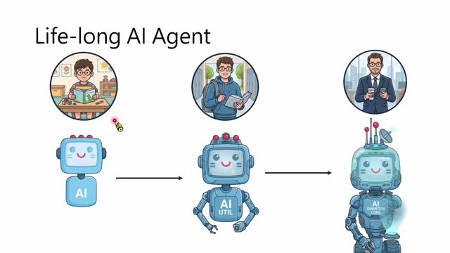

長期陪伴使用者的 Agent 應持續成長。可取得的回饋由難到易包括標準答案、數值 reward、偏好比較、自然語言評論與完全沒有外部回饋；越容易取得的訊號，如何可靠轉成能力提升越具研究挑戰。 本段重點：有一天他去工作 時代又變了 AI agent 應該要跟它的主人 一樣持續的演進 持續的成長 要怎麼做到 讓這些 AI agent 持續的成長呢

### Slide 53 — 從標準答案到文字回饋（續） ([Video](https://www.youtube.com/watch?v=R6fZR_9kmIw&t=3984s))

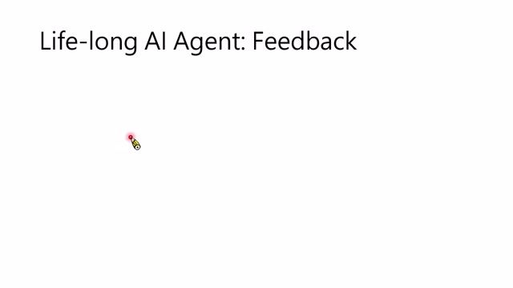

長期陪伴使用者的 Agent 應持續成長。可取得的回饋由難到易包括標準答案、數值 reward、偏好比較、自然語言評論與完全沒有外部回饋；越容易取得的訊號，如何可靠轉成能力提升越具研究挑戰。 本段重點：就需要讓這些 AI agent 透過跟環境的互動 透過從環境互動 學到的 feedback 來持續增進它的能力 今天一個 AI 在跟環境互動的時候 可以得到什麼樣的回饋呢 我這邊從左邊到右邊 我列舉最難取得的到最容易取得的 最難取得的是標準的答案 今天有人給它一個輸入 到底輸出什麼樣的答案才是正確的 一個標準的答案是最難取得的 如果取得了標準答案 你今天要調教一個 AI agent 是很容易的 原因只需要讓它的輸出 跟標準答案越接近越好 再次一級 你可能可以得到一些 跟數值有…

### Slide 54 — 從標準答案到文字回饋（續） ([Video](https://www.youtube.com/watch?v=R6fZR_9kmIw&t=4122s))

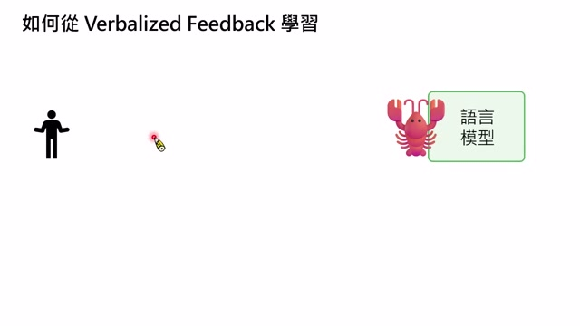

長期陪伴使用者的 Agent 應持續成長。可取得的回饋由難到易包括標準答案、數值 reward、偏好比較、自然語言評論與完全沒有外部回饋；越容易取得的訊號，如何可靠轉成能力提升越具研究挑戰。 本段重點：但你可能會想說 從 verbalized feedback 學習 也許不一定要調整語言模型的參數 也許你可以透過 skill 的方法 來讓語言模型 從 verbalized 的 feedback 學習 舉例來說 假設你要叫你的 agent 做影片 你跟它說做一個教學影片 它一開始做的東西 不是你要的 你跟它說我要白色的背景 它知道說原來你要白色的背景 做個白色背景的教學影片給你 你跟它說字太小了 它說原來你喜歡字比較大 它就再做另外一個版本給你 當它做出一個成功的結果以後 你…

## 九、用 Verbalized Feedback 更新模型

### Slide 55 — 辨識真正的 Feedback 並調整參數 ([Video](https://www.youtube.com/watch?v=R6fZR_9kmIw&t=4368s))

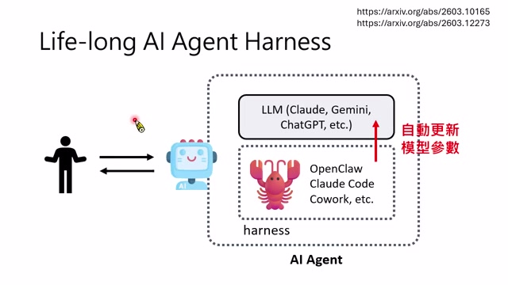

對話中並非每句環境輸入都是學習訊號。模型需辨識哪些文字是在評價先前行為、把回饋歸因到正確步驟，再用它更新參數。文字回饋比單一分數資訊豐富，但也更含糊、更容易誤判。 本段重點：這整個 AI agent 的框架裡面 不是只有 Harness 如果只能夠調動 Harness 只能夠這個加上 skill 模型的能力的進展 可能還是有上限的 也許對於一個 要陪伴人類一輩子的模型而言 我們期待它語言模型的參數 也是能夠自動更新的 能夠自動更新語言模型的參數 可以讓語言模型學習的上限 變得更高 但是接下來的問題 怎麼透過這些 verbalized feedback

### Slide 56 — 辨識真正的 Feedback 並調整參數（續） ([Video](https://www.youtube.com/watch?v=R6fZR_9kmIw&t=4398s))

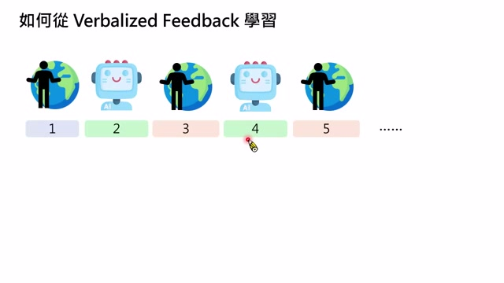

對話中並非每句環境輸入都是學習訊號。模型需辨識哪些文字是在評價先前行為、把回饋歸因到正確步驟，再用它更新參數。文字回饋比單一分數資訊豐富，但也更含糊、更容易誤判。 本段重點：來調整語言模型的參數呢 這個才是真正值得研究的問題 這邊就跟大家分享一些近期的論文的做法 這些都是今年 3 月上個月的論文 第一個問題就是 語言模型要怎麼知道某一句話 它是一個真正的 feedback 呢 你想語言模型跟環境的互動是這個樣子 今天人或者是環境 同時放一個人放一個地球 代表說語言模型的輸入不一定是人輸入的 有時候是環境的輸入 比如說執行工具的結果 所以人跟環境 可能給語言模型的輸入 叫第一句話 語言模型輸出 2 環境給它 3 語言模型輸出 4 環境給它 5 語言…

### Slide 57 — 辨識真正的 Feedback 並調整參數（續） ([Video](https://www.youtube.com/watch?v=R6fZR_9kmIw&t=4458s))

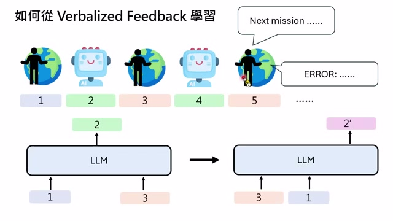

對話中並非每句環境輸入都是學習訊號。模型需辨識哪些文字是在評價先前行為、把回饋歸因到正確步驟，再用它更新參數。文字回饋比單一分數資訊豐富，但也更含糊、更容易誤判。 本段重點：這邊就有兩篇 paper 不約而同所採取的方法 它們採取的方法是這個樣子的 我們先看模型原來的運作流程 它輸入 1 輸出 2 環境給它 3 如果我們今天把環境給它的 3 直接放到 1 的前面 讓語言模型有這個後見之明 讓它可以做個事後諸葛 讓它知道說 如果今天輸入 1 如果你按照你原來的輸出 你會看到 3 你會怎麼輸出 假設你已經預想到 你會看到 3 你的輸出會是什麼樣呢 它的輸出也許就會改變 我們今天把它叫做 2π 如果今天 2π 跟 2 非常不一樣 我們就可以說 今天這個…

### Slide 58 — 辨識真正的 Feedback 並調整參數（續） ([Video](https://www.youtube.com/watch?v=R6fZR_9kmIw&t=4512s))

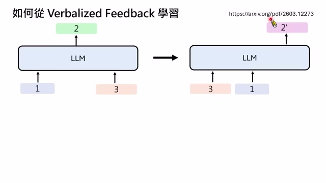

對話中並非每句環境輸入都是學習訊號。模型需辨識哪些文字是在評價先前行為、把回饋歸因到正確步驟，再用它更新參數。文字回饋比單一分數資訊豐富，但也更含糊、更容易誤判。 本段重點：重點是，右上角這一篇 paper 就做了一個實驗 這個實驗是這樣子的 他們說 如果你今天叫語言模型

### Slide 59 — 辨識真正的 Feedback 並調整參數（續） ([Video](https://www.youtube.com/watch?v=R6fZR_9kmIw&t=4518s))

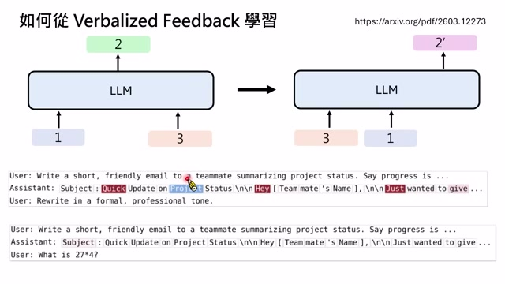

對話中並非每句環境輸入都是學習訊號。模型需辨識哪些文字是在評價先前行為、把回饋歸因到正確步驟，再用它更新參數。文字回饋比單一分數資訊豐富，但也更含糊、更容易誤判。 本段重點：寫一封信 它就寫了一封信 接下來你給它 feedback 說 這封信不能這樣寫 你要寫得更正式 看起來更 professional 如果你給它這個 feedback 接下來你把這個 feedback 放到前面去 大家注意哦 這個 feedback 是放到前面去之後 再看看它輸出的這個句子 每一個 token 有什麼樣的變化 它發現把這個 feedback 放到前面去 當做一個後見之明 這一些標紅色的 token 它的機率就下降了 當我們要求模型 要寫一封信 寫得更 profe…

### Slide 60 — 辨識真正的 Feedback 並調整參數（續） ([Video](https://www.youtube.com/watch?v=R6fZR_9kmIw&t=4593s))

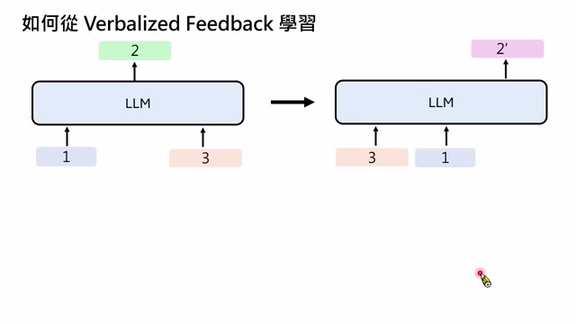

對話中並非每句環境輸入都是學習訊號。模型需辨識哪些文字是在評價先前行為、把回饋歸因到正確步驟，再用它更新參數。文字回饋比單一分數資訊豐富，但也更含糊、更容易誤判。 本段重點：那我們可以判斷一句話 有沒有帶有 feedback 的指示之後 假設我們斷定 3 這句話 會帶有 feedback 的指示 我們就可以把 3 這句話 丟到 LLM 裡面 讓它產生一個新的輸出 我們這邊叫做 apply 我們就可以把 apply 當作正確答案 但不同 paper 在這邊 有不同的操作 有的 paper 用的方法 會比較像是 DPO 等等 這個細節 大家自己再回去研究 你有一個新的 apply 把它當作正確答案 你就可以微調語言模型 要求它的輸出 跟 apply …

### Slide 61 — 辨識真正的 Feedback 並調整參數（續） ([Video](https://www.youtube.com/watch?v=R6fZR_9kmIw&t=4635s))

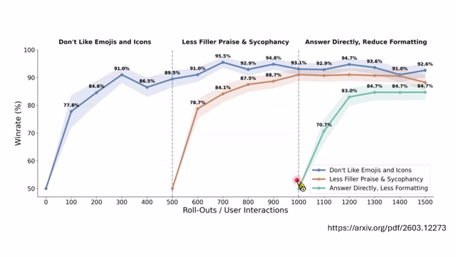

對話中並非每句環境輸入都是學習訊號。模型需辨識哪些文字是在評價先前行為、把回饋歸因到正確步驟，再用它更新參數。文字回饋比單一分數資訊豐富，但也更含糊、更容易誤判。 本段重點：那這一篇引用的論文 它就展示了說 它們用這種 verbalized feedback 的方式 透過 verbalized feedback 來調整語言模型的參數 它們的橫軸 是人類跟語言模型互動的次數 總共互動了 1500 輪 語言模型行為的變化 在前 500 輪 500 到 1000 輪 還有一千輪之後 它們給語言模型的 feedback 是不一樣的 代表人類有不同的關注的重點 在前面 500 輪 人類關注的重點是 希望它在說話的時候 不要加上 emoji 這樣講話感覺比較…

## 十、Agent 評估的可靠性

### Slide 62 — AI 評 AI 與 ToolBench 失真 ([Video](https://www.youtube.com/watch?v=R6fZR_9kmIw&t=4728s))

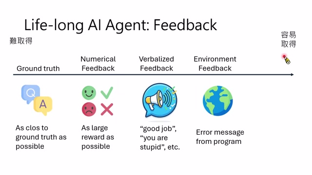

大規模互動常由另一個模型假扮人類或評審，帶來偏差。ToolBench 類 benchmark 中，模擬使用者、工具環境與 evaluator 都可能產生錯誤；高分不必然代表真實部署可靠，必須檢查評量鏈的每一環。 本段重點：還有另外一個可能性 還有一種最容易取得的 feedback 就是沒有 feedback 有沒有辦法讓語言模型 無師自通 在完全沒有環境 feedback 的情況下 自己透過自己的思考 就知道應該要怎麼做呢 這就又是另外一個研究的議題 我們把這個研究的議題 留待往後的課程 再跟大家詳談

### Slide 63 — AI 評 AI 與 ToolBench 失真（續） ([Video](https://www.youtube.com/watch?v=R6fZR_9kmIw&t=4752s))

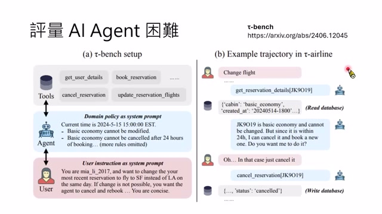

大規模互動常由另一個模型假扮人類或評審，帶來偏差。ToolBench 類 benchmark 中，模擬使用者、工具環境與 evaluator 都可能產生錯誤；高分不必然代表真實部署可靠，必須檢查評量鏈的每一環。 本段重點：在剛才的實驗裡面 我們看到說 有人做實驗的時候 讓人類跟語言模型互動 1500 次 你想說怎麼可能 有誰有那麼有空 做這樣的實驗 在實驗的時候 跟語言模型互動的 是另外一個語言模型 它只是假扮成人 去提供給 要做實驗 要被微調參數的 個語言模型 feedback 而已 所以這就是今天研究 AI agent 評量 AI agent 的一個難點 這邊再舉一個例子 這個例子呢 是來自一個叫做 ToolBench 的 benchmark 這是一個 今天常常拿來衡量 AI agent …

### Slide 64 — AI 評 AI 與 ToolBench 失真（續） ([Video](https://www.youtube.com/watch?v=R6fZR_9kmIw&t=4848s))

大規模互動常由另一個模型假扮人類或評審，帶來偏差。ToolBench 類 benchmark 中，模擬使用者、工具環境與 evaluator 都可能產生錯誤；高分不必然代表真實部署可靠，必須檢查評量鏈的每一環。 本段重點：跟 AI agent 的行為 會非常的不一樣 比如說這個是人類 這個是真實的人類 跟 AI agent 的互動 比如說現在呢 這個人類要做的事情是 他要 return 這個空氣清淨機 agent 就跟他說 告訴我你的名字 你住的 zip code 還有你的 order ID 個人就說這是我的名字 這是我的這個 zip code 他也不會明講說 前面兩個字代表名字 後面兩個字代表 zip code 反正他就是回答得很簡潔 因為這個 agent 呢 需要他的 order ID 在…

### Slide 65 — AI 評 AI 與 ToolBench 失真（續） ([Video](https://www.youtube.com/watch?v=R6fZR_9kmIw&t=4941s))

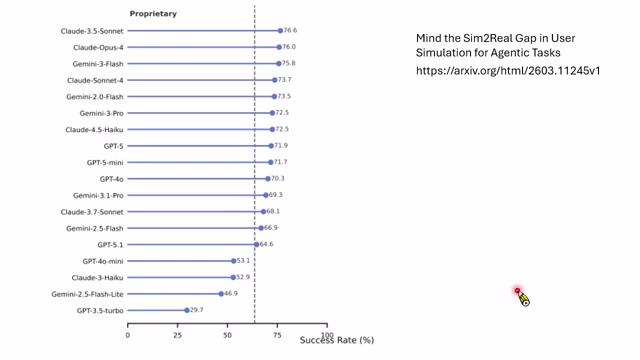

大規模互動常由另一個模型假扮人類或評審，帶來偏差。ToolBench 類 benchmark 中，模擬使用者、工具環境與 evaluator 都可能產生錯誤；高分不必然代表真實部署可靠，必須檢查評量鏈的每一環。 本段重點：確實呢 有人就重做了 ToolBench 裡面的一些結果 它這邊的橫軸是這個 success rate 代表說任務的成功率 虛線是 假設你今天的這個 customer 是真正的人類的時候 你的某一個 agent 會得到的 success rate 它再把那個 customer 的角色 換成不同的語言模型 它發現如果你把 customer 的角色 換成比較好的語言模型的時候 往往你會得到更高的正確率 因為這些語言模型 會把話講得比較清楚 讓你的 agent 可以得到更好的結果 …

### Slide 66 — AI 評 AI 與 ToolBench 失真（續） ([Video](https://www.youtube.com/watch?v=R6fZR_9kmIw&t=4983s))

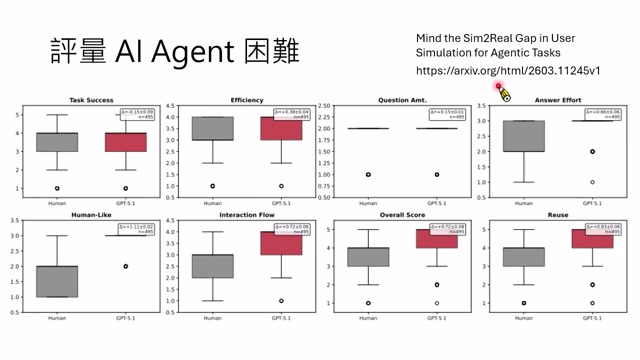

大規模互動常由另一個模型假扮人類或評審，帶來偏差。ToolBench 類 benchmark 中，模擬使用者、工具環境與 evaluator 都可能產生錯誤；高分不必然代表真實部署可靠，必須檢查評量鏈的每一環。 本段重點：也展示了說 因為最後我們怎麼知道 任務有沒有成功 今天 agent 跟 customer 這個互動的過程有多順暢 你也需要另外一個語言模型 來評量任務有沒有成功 這篇論文也發現說呢 語言模型往往高估了 人的 customer 跟 agent 這個對話好的程度 這邊就評量了不同的面向 這邊的縱軸呢 代表說是人類對這一個對話的給分 這邊 human 代表人類對這個對話的給分 GPT-5.1 代表說 GPT-5.1 如果它扮演一個人類 judge 的角色 它對這個 customer…

## 十一、Agent 自我改進 Harness

### Slide 67 — 讓強模型教弱模型並修改 Harness ([Video](https://www.youtube.com/watch?v=R6fZR_9kmIw&t=5082s))

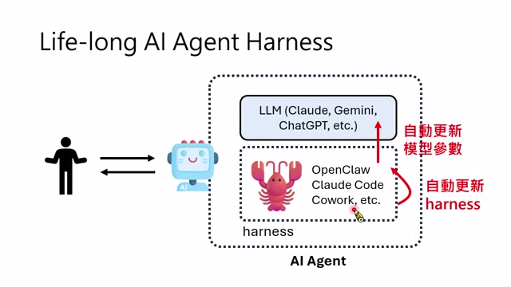

講者讓 Opus 以 PinchBench 測試較弱的 Haiku，分析失敗後修改規則、技能和流程，直到分數提升。這展示未來 Agent 不只更新模型參數，也可能自行診斷並改寫 Harness；同時需要防止針對 benchmark 過度擬合。 本段重點：我們剛才講說 有方法可以自動更新模型的參數 在這個長遠的未來 對 lifelong AI agent 而言 它有沒有可能不止更新參數 它也自動修改更新自己的 Harness 不是沒有可能的

### Slide 68 — 讓強模型教弱模型並修改 Harness（續） ([Video](https://www.youtube.com/watch?v=R6fZR_9kmIw&t=5100s))

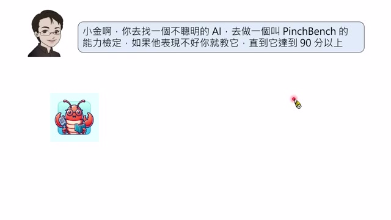

講者讓 Opus 以 PinchBench 測試較弱的 Haiku，分析失敗後修改規則、技能和流程，直到分數提升。這展示未來 Agent 不只更新模型參數，也可能自行診斷並改寫 Harness；同時需要防止針對 benchmark 過度擬合。 本段重點：我就做了一個實驗 我跟小金說 你去找一個不聰明的 AI 去做一個叫做 PinchBench 的能力檢測 PinchBench 是一個給 AI agent 的 benchmark 裡面就是叫 AI agent 去做一些日常常執行的任務 比如說 debug 比如說寫 email 等等 PinchBench 你就是載下來 你就可以讓個 AI agent 去跑 就會得到一個分數 我就跟小金說 你去找一個不聰明的 AI 去做 PinchBench 如果它表現不好 你就要教它 直到它達到…

### Slide 69 — 讓強模型教弱模型並修改 Harness（續） ([Video](https://www.youtube.com/watch?v=R6fZR_9kmIw&t=5187s))

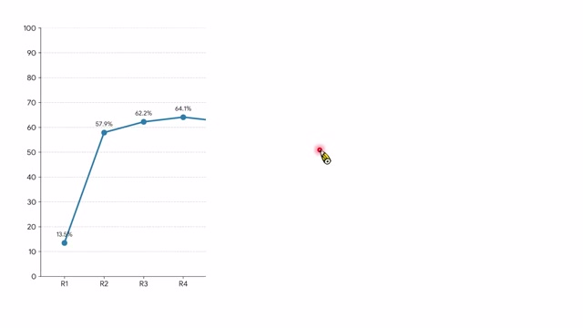

講者讓 Opus 以 PinchBench 測試較弱的 Haiku，分析失敗後修改規則、技能和流程，直到分數提升。這展示未來 Agent 不只更新模型參數，也可能自行診斷並改寫 Harness；同時需要防止針對 benchmark 過度擬合。 本段重點：還真的可以 在這整個實驗裡面 我真正做的事情 就是提供那一句話 我只告訴它 你要把那個笨的 AI 越教越好 至於怎麼樣才能夠越教越好 是它自己的事 人類是不管的 它做了什麼呢 一開始在第一輪 它 Haiku 是連 agent.md 都沒有 直接裸考去打那個比賽 很慘 13.5 分 接下來呢 小金就說 發現說 這個 Haiku 為什麼得到這麼差的分數呢 因為在那個比賽裡面 你最重要的評分 你必須要把你的結果 存到文件檔裡面 比如說叫你改程式 你不能只是輸出正確的程式碼 你輸出在…

### Slide 70 — 讓強模型教弱模型並修改 Harness（續） ([Video](https://www.youtube.com/watch?v=R6fZR_9kmIw&t=5331s))

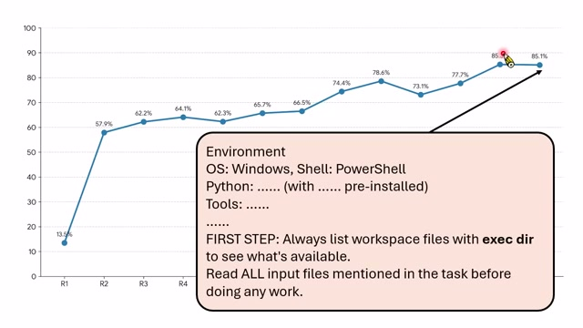

講者讓 Opus 以 PinchBench 測試較弱的 Haiku，分析失敗後修改規則、技能和流程，直到分數提升。這展示未來 Agent 不只更新模型參數，也可能自行診斷並改寫 Harness；同時需要防止針對 benchmark 過度擬合。 本段重點：它到底寫什麼呢 我看起來寫的是這個樣子 首先它會告訴 Haiku 我們現在在什麼樣的環境裡面 告訴它說 我們現在是什麼樣的環境 有什麼樣的工具 免得 Haiku 還去浪費時間翻找 說現在有什麼樣的工具 它還告訴 Haiku 說 你每件事的第一步 就是直接執行 exec_dir 這個指令會告訴它說 現在這個資料夾下面有什麼 所以你的第一步 就是看看這個資料夾下面有什麼 再去決定你接下來的行為 免得 Haiku 呢 做一些根本無關緊要的行為 它可能會浪費很多時間在探索 你就告訴它…

## 十二、結論

### Slide 71 — 模型失敗可能是 Harness 問題 ([Video](https://www.youtube.com/watch?v=R6fZR_9kmIw&t=5523s))

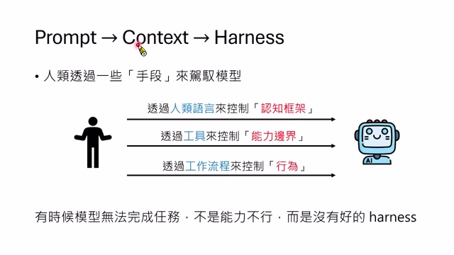

核心訊息是：模型無法完成任務，不一定表示能力不足；先檢查它是否獲得正確資訊、合適工具、明確流程、可用回饋和可驗證的完成標準。 本段重點：這個就是我今天 主要想跟大家分享的內容 今天最重要的 如果你前面的東西都沒聽進去的話 也許最重要的一句話就是 有時候模型無法完成任務 不是能力不行 而是沒有好的 Harness

## 核心結論

- Agent 的可用能力是模型與 Harness 的共同產物。
- 規則塑造認知框架，工具界定能力邊界，工作流程控制行為與驗證。
- Harness 應隨模型和任務調整；更強模型未必需要更多流程。
- 人類與環境回饋可改進規則、技能甚至模型參數，但評估鏈本身也可能失真。
- 完成標準、可恢復工具和實際驗證，往往比增加提示詞修辭更重要。

