# Transformer 中的位置信息：Token、Absolute、Relative 與 RoPE Positional Embedding

- 講者：李宏毅
- 影片：[YouTube](https://www.youtube.com/watch?v=Ll-wk8x3G_g)
- 長度：1:29:43
- 字幕：原始繁體中文字幕

本講從 tokenization 與 Self-Attention 的順序不變性出發，比較 Absolute、Relative、Sinusoidal 與 RoPE positional encoding，並討論長上下文外插。時間資料保存在 `source/transcript.txt` 與 `slides/index.csv`。

## 一、Token 與語言模型輸入

### Slide 1 — 課程目標：Transformer 如何表示位置 ([Video](https://www.youtube.com/watch?v=Ll-wk8x3G_g&t=0s))

本講從語言模型輸入開始，追問 Transformer 如何知道 token 的順序與距離，並比較 absolute、relative、sinusoidal 與 rotary positional embedding。 本段重點：今天我們這一堂課要講的是 Positional Embedding 這個技術它讓 Transformer 可以知道輸入 Token 的順序 為什麼需要特別打造個技術讓 Transformer 知道輸入 Token 的順序呢

### Slide 2 — 課程目標：Transformer 如何表示位置（續） ([Video](https://www.youtube.com/watch?v=Ll-wk8x3G_g&t=15s))

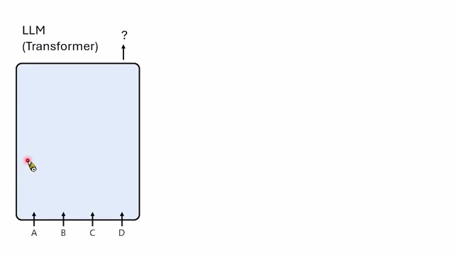

本講從語言模型輸入開始，追問 Transformer 如何知道 token 的順序與距離，並比較 absolute、relative、sinusoidal 與 rotary positional embedding。 本段重點：因為原來的 Transformer 它是沒有辦法考慮輸入 Token 的順序的 怎麼說呢，我們都知道大型語言模型 它的背後就是一個叫 Transformer 的神經網路架構 它的輸入呢 就是一串 Token 它的輸出呢 就是去預測下一個 Token Transformer 怎麼處理 這些輸入的 Token 呢 首先輸入的 Token 會被變成 Embedding 也就是每一個 Token 會變成一個向量 這些向量呢 會變成某一個 Layer 的輸入 所以這些 Token 會被輸入到第一個 Layer 每個 Laye…

### Slide 3 — 文字先被切成 Token ([Video](https://www.youtube.com/watch?v=Ll-wk8x3G_g&t=276s))

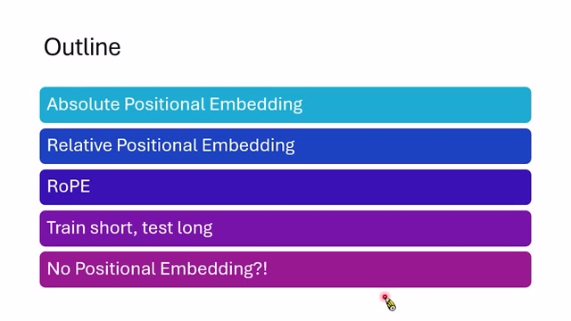

語言模型不直接接收字串，而先由 tokenizer 切成離散 token，再映射成向量。切法影響序列長度、詞彙表大小、多語言處理和模型能觀察到的基本單位。 本段重點：position 的資訊 位置的資訊 今天這堂課呢 就是我們來探討一系列 告訴 Self-Attention 也就是告訴 Transformer Token 位置資訊的方式 我們先從最早的 Absolute Positional Embedding 開始講起 最早的 Positional Embedding 的想法是怎麼樣呢

### Slide 4 — 文字先被切成 Token（續） ([Video](https://www.youtube.com/watch?v=Ll-wk8x3G_g&t=297s))

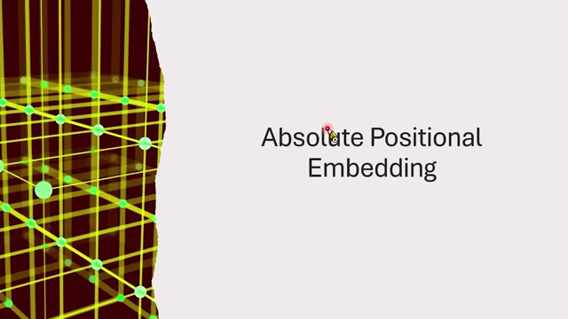

語言模型不直接接收字串，而先由 tokenizer 切成離散 token，再映射成向量。切法影響序列長度、詞彙表大小、多語言處理和模型能觀察到的基本單位。 本段重點：它的想法是 我們對每一個位置 都設計一個特別的 Embedding 這個 Embedding 代表了 位置的資訊 我現在用 P0 一直到 P3 代表對應到位置 0 1、2、3 每一個位置的 一個特別的 Embedding 我們把這個特別的 Embedding 它就是一個向量 一排數字 加到 Token 上面 所以如果我們現在 擺放的順序是 ABCD A 就是加 position 0 B 就加 position 1 如果是 CBAD C 就加 position 0 B 就加 position 1 依此類推 這會導致什…

### Slide 5 — 文字先被切成 Token（續） ([Video](https://www.youtube.com/watch?v=Ll-wk8x3G_g&t=390s))

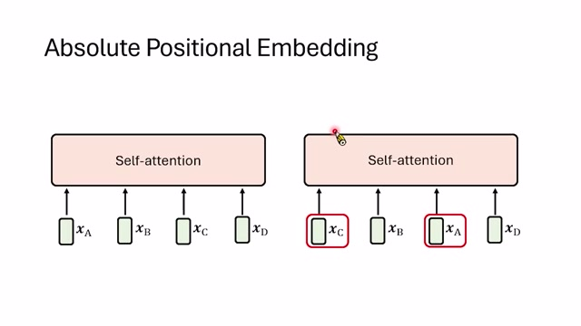

語言模型不直接接收字串，而先由 tokenizer 切成離散 token，再映射成向量。切法影響序列長度、詞彙表大小、多語言處理和模型能觀察到的基本單位。 本段重點：最通用的一個方法 叫做 Sinusoidal 的 Positional Embedding 它是 Transformer 在最初誕生的時候就使用的 Embedding 所以可以想像說在寒武紀的時代 就已經有 Positional Embedding 的概念 當時最早採行的是一個叫 Sinusoidal 的 Positional Embedding 我們就來看看這個 Sinusoidal 的 Positional Embedding 它長什麼樣子 Sinusoidal Positional Embedding 長什麼…

### Slide 6 — Token ID、Embedding 與序列 ([Video](https://www.youtube.com/watch?v=Ll-wk8x3G_g&t=660s))

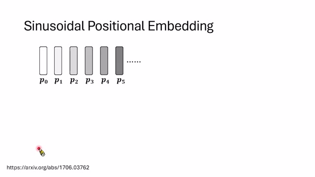

每個 token 以 ID 查表取得 embedding。相同 token 的內容向量相同，因此若不額外加入位置訊息，模型無法僅靠 embedding 分辨它出現在第幾個位置。 本段重點：它就是長這副德性 看起來非常的複雜 像什麼神秘的 3D 圖 看久了就會有東西跳出來的感覺 這個圖橫軸代表的是 Position 這邊縱著看 就是一個一個 Embedding 所以我們把這邊的 Embedding 一個一個排起來 用顏色代表它數值的大小 黃色是接近 1 深藍色是接近 -1 但因為它是這個 sine、cosine 的函數 所以它只會 數字只會落在 1 跟 -1 之間 你把這些 Embedding 通通排起來 排到 1000 看起來就是這個樣子 如果你一個一個 row 看 一個一個 row 看 你看到的就…

### Slide 7 — Token ID、Embedding 與序列（續） ([Video](https://www.youtube.com/watch?v=Ll-wk8x3G_g&t=768s))

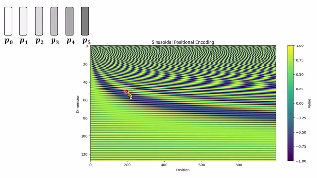

每個 token 以 ID 查表取得 embedding。相同 token 的內容向量相同，因此若不額外加入位置訊息，模型無法僅靠 embedding 分辨它出現在第幾個位置。 本段重點：換另外一個方法來看待 Sinusoidal 的 Positional Embedding Sinusoidal Positional Embedding 它偶數用 sine 來表示 奇數的 Dimension 用 cosine 來表示 所以每一個偶數的 Dimension 跟奇數的 Dimension 合起來 是一對 裡面有一個 sine 有一個 cosine 它們裡面帶入的角度是一樣的 所以你可以把第 2i 的 Dimension 跟第 2i+1 的 Dimension 放在一起 一起來看 想成是二維平面上的一個…

## 二、為什麼需要位置資訊

### Slide 8 — Self-Attention 本身不辨識順序 ([Video](https://www.youtube.com/watch?v=Ll-wk8x3G_g&t=936s))

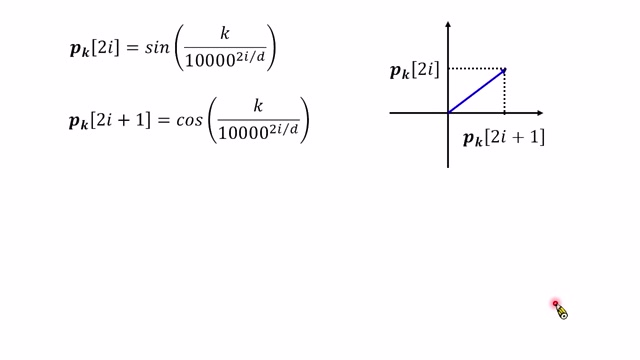

Self-Attention 對輸入排列具有置換等變性。語序會改變語意，所以必須顯式注入位置資訊。 本段重點：對這個 Self-Attention 對一個 Transformer 來說 它看到這個跟時間有關的資訊 是這樣子變化的 它看到了這一排向量 這一排向量的最前面兩維 代表的是一個走得非常快的指針 它大概 6.3 個 Token 就會轉一圈 中間比如說 10 跟 11 維合出來的那個指針 它轉的比較慢 如果這邊舉的例子是 第 100 到 101 維的指針 如果我們只看前 6 個 Token 它幾乎沒有變化 因為它轉得非常非常的慢 所以我們現在知道 每兩個 Dimension 合在一起 它是一個指針 轉得慢的就是秒針 中…

### Slide 9 — Self-Attention 本身不辨識順序（續） ([Video](https://www.youtube.com/watch?v=Ll-wk8x3G_g&t=1029s))

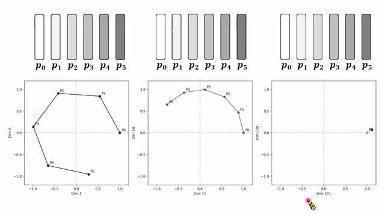

Self-Attention 對輸入排列具有置換等變性。語序會改變語意，所以必須顯式注入位置資訊。 本段重點：你就要讚嘆一下 先人的智慧 所以我們來看一下 在 2017 年 深度學習 剛剛誕生的 寒武紀的時代 Transformer 的作者 是怎麼考慮 當初的 Positional Embedding 的設計的 而這句話呢 在論文的正文中 只有一句 所以是個微言大義 這個 他們說有很多不同的 可以選擇 Positional Embedding 的方法 但他們希望 Positional Embedding 可以考慮 relative position 等一下我們用幾頁投影片 來講一下什麼叫 relative position

### Slide 10 — Self-Attention 本身不辨識順序（續） ([Video](https://www.youtube.com/watch?v=Ll-wk8x3G_g&t=1065s))

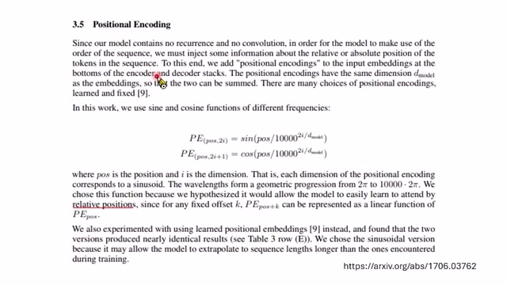

Self-Attention 對輸入排列具有置換等變性。語序會改變語意，所以必須顯式注入位置資訊。 本段重點：relative position 的意思是說 假設有一句話 貓吃了魚 貓跟魚中間間隔了兩個 Token 這個時候呢 魚在我們假設今天 要處理魚這個字 要去 Transformer 要去想說魚這個 Token 後面要今天打一個 Token 的時候 它需要 Attend 到貓 它需要跨過兩個 Token Attend 到貓 它 Attend 到貓的分數是 0.7 我會希望說 假設我們在貓吃了魚前面 塞了大量的 Token 比如說我告訴你一件事 今天早上我看到貓吃了魚 但是貓吃了魚 這個貓跟魚之間的關係 我們希望它不要…

### Slide 11 — Self-Attention 本身不辨識順序（續） ([Video](https://www.youtube.com/watch?v=Ll-wk8x3G_g&t=1176s))

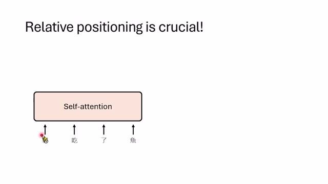

Self-Attention 對輸入排列具有置換等變性。語序會改變語意，所以必須顯式注入位置資訊。 本段重點：他們說當初選擇了這個 Sinusoidal 的 Positional Embedding 是因為 Sinusoidal 的 Positional Embedding 有一些特殊的性質 而這些特殊的性質 像能夠對 Relative Position 有幫助 是什麼樣特殊的性質呢 我們這邊就是用 P 下標 K

## 三、Absolute Positional Embedding

### Slide 12 — Absolute Positional Embedding ([Video](https://www.youtube.com/watch?v=Ll-wk8x3G_g&t=1194s))

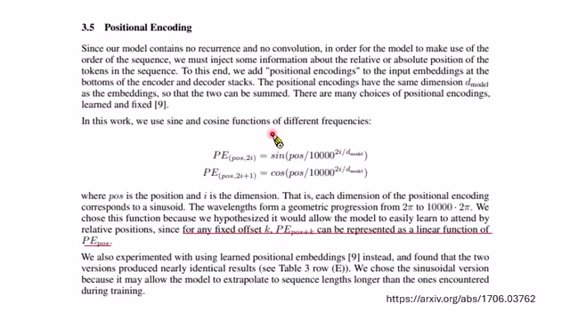

最直接的方法是為第 0、1、2…個位置準備位置向量，與 token embedding 相加。模型同時看到內容和絕對索引，但需處理訓練長度之外的位置。 本段重點：這個 K 代表第 K 個位置的 Positional Embedding 這個代表第 K 加 R 個位置的 Positional Embedding 你把 K 這個位置的 Positional Embedding 乘上一個矩陣 這個矩陣叫做 M_R 會得到 K 加 R 這個位置的 Positional Embedding 而這件事情跟 K 是沒有關係的 只跟 K 還有 K 加 R 這樣的位置之間距離有關係 所以 P1 乘上 M3 這個矩陣 會變成 P4 P11 乘上 M3 這個矩陣 會變成 P14 P101 乘上 …

### Slide 13 — Absolute Positional Embedding（續） ([Video](https://www.youtube.com/watch?v=Ll-wk8x3G_g&t=1335s))

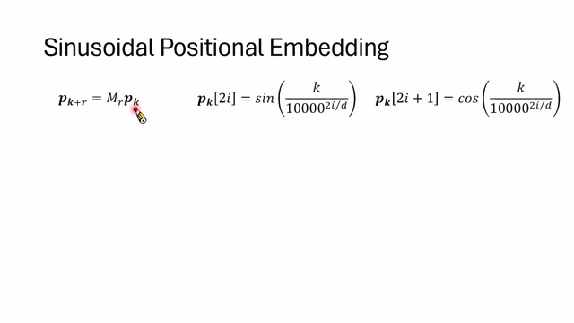

最直接的方法是為第 0、1、2…個位置準備位置向量，與 token embedding 相加。模型同時看到內容和絕對索引，但需處理訓練長度之外的位置。 本段重點：就得到這個樣子跟這個樣子 所以 PK 加 R 它的這兩個 Dimension 分別可以展開成這個樣子 你會發現這裡面有 Sin K 除以 Z Cos K 除以 Z 這裡面有 Cos K 除以 Z 有 Sin K 除以 Z 它們就是 PK 這一個 Positional Embedding 的 2i 跟 2i 加 1 維度 所以你看 PK 它的 2i 的維度出現在這裡 PK 的 2i 加 1 它的這個維度出現在這裡 所以你就可以把 PK 代到這裡面去了 你就知道

### Slide 14 — Absolute Positional Embedding（續） ([Video](https://www.youtube.com/watch?v=Ll-wk8x3G_g&t=1374s))

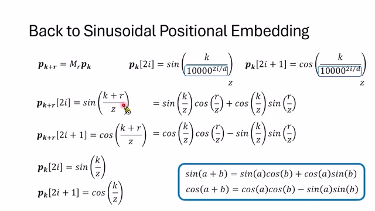

最直接的方法是為第 0、1、2…個位置準備位置向量，與 token embedding 相加。模型同時看到內容和絕對索引，但需處理訓練長度之外的位置。 本段重點：這個 PK 加 R 跟 PK 的關係 所以 PK 加 R 的 2i 是 PK 的 2i 乘上一個 Cos R 除以 Z 這一項跟它們之間相對距離有關 加上 PK 的 2i 加 1 乘上 Sin R 除以 Z PK 加 R 的 2i 加 1 也是一樣 它會等於 PK 的 2i 加 1 乘上 Cos 減掉 PK 的 2i 乘上 Sin 所以我們現在知道 PK 加 R 跟 PK 它們在 2i 和 2i 加 1 它們在 2i 跟 2i 加 1 這兩個 Dimension 之間的關係 或者是你可以把它寫成

### Slide 15 — Absolute Positional Embedding（續） ([Video](https://www.youtube.com/watch?v=Ll-wk8x3G_g&t=1410s))

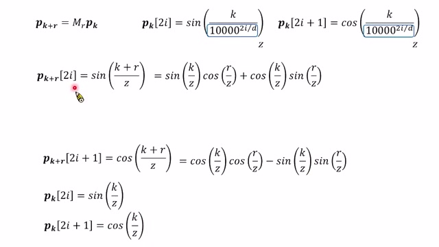

最直接的方法是為第 0、1、2…個位置準備位置向量，與 token embedding 相加。模型同時看到內容和絕對索引，但需處理訓練長度之外的位置。 本段重點：更 Compact 的表示方式 就是長這個樣子 你可以把 PK 的 2i 跟 PK 的 2i 加 1 集合起來當做一個向量來看 PK 的 2i 跟 PK 的 2i 加 1 集合起來當做一個向量來看 把這邊的 Cos Cos 跟負 Sin 結合成一個矩陣 上面這個式子 可以寫成下面這個式子 所以我們知道 這個 PK 加 R 的這兩個 Dimension 跟 PK 這兩個 Dimension 中間是有什麼關係 中間的關係就是 乘上一個矩陣的關係 所以你把這個東西 乘上這個矩陣 就等於這個東西 這個矩陣 只跟 R 有關 …

### Slide 16 — Absolute Positional Embedding（續） ([Video](https://www.youtube.com/watch?v=Ll-wk8x3G_g&t=1485s))

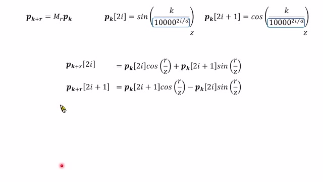

最直接的方法是為第 0、1、2…個位置準備位置向量，與 token embedding 相加。模型同時看到內容和絕對索引，但需處理訓練長度之外的位置。 本段重點：我們就不做詳細的說明 但是你可以輕易地了解這件事情 PK 加 R 跟 PK 它們中間就差 乘上 M_R 這個矩陣 M_R 這個矩陣長什麼樣子 M_R 這個矩陣就是 在對角線的地方 放上剛才看到的 M_R,i 就從最左上角開始放 M_R,1 放 M_R,2 放 M_R,3 以此類推 其他地方擺 0 PK 它的前兩個維度 PK_0 PK_1 就是乘上 M_R,1 就會得到 PK 加 R 的 0 PK 加 R 的 1 PK_2 PK_3 乘上 M_R,2 就得到 PK 加 R 的 2 PK 加 R 的 3 就是這樣子 所…

### Slide 17 — Learned 與 Sinusoidal 位置向量 ([Video](https://www.youtube.com/watch?v=Ll-wk8x3G_g&t=1548s))

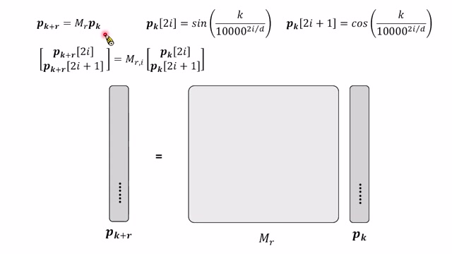

位置向量可作為參數學習，也可由固定正弦／餘弦函數生成。固定函數不增加可訓練參數，且能對任意索引計算。 本段重點：我們先來看一下 這個 Positional Embedding 當我們把這個 XA XB 加上 Positional Embedding 用 P 下標 N 跟 P 下標 M 來表示兩個 Position 那這個 Attention 呢 A 呢 就是 B 的 Query QB 跟 A 的 Key KA 它們之間做 Dot product 做內積的結果 這一項呢 就等於 QB 的 Transpose 乘上 KA 我們都知道 QB 是什麼 QB 是 Token 的 Embedding 加上 Positional Embe…

### Slide 18 — Learned 與 Sinusoidal 位置向量（續） ([Video](https://www.youtube.com/watch?v=Ll-wk8x3G_g&t=1797s))

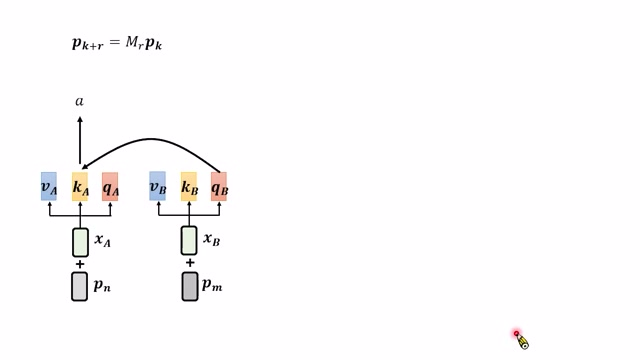

位置向量可作為參數學習，也可由固定正弦／餘弦函數生成。固定函數不增加可訓練參數，且能對任意索引計算。 本段重點：就進入了 Relative Positional Embedding 的時代 有人就想說 既然我們想要把 Relative 的資訊 加到 Attention 裡面 何必拐彎抹角的設計神奇的 Absolute Positional Embedding 呢

## 四、Sinusoidal Positional Encoding

### Slide 19 — 不同頻率編碼不同尺度 ([Video](https://www.youtube.com/watch?v=Ll-wk8x3G_g&t=1815s))

Sinusoidal encoding 在不同維度使用不同頻率：高頻維度區分近鄰，低頻維度描述長尺度。成對 sine/cosine 讓位置平移能以旋轉表示。 本段重點：我們能不能就不要這些 Positional Embedding 不要用這麼迂迴的方式來改 Attention 如果你覺得 Attention 它就是跟相對位置有關 要不要就根據相對位置 直接去改那個 Attention 所以有一個方法 叫做 Attention with Linear Biases 縮寫是 ALiBi 這個到底要念 ALiBi 還是 ALiBi 呢 我聽過原始論文作者的演講 他是念 ALiBi Alibi 是有這個字的 這個字叫做不在場證明 所以這個字應該就是念 ALiBi ALiBi 這個方法是怎…

### Slide 20 — 不同頻率編碼不同尺度（續） ([Video](https://www.youtube.com/watch?v=Ll-wk8x3G_g&t=1941s))

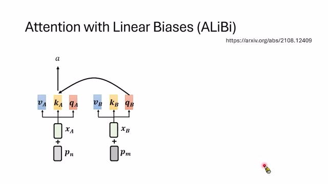

Sinusoidal encoding 在不同維度使用不同頻率：高頻維度區分近鄰，低頻維度描述長尺度。成對 sine/cosine 讓位置平移能以旋轉表示。 本段重點：它的結果好不好呢 神奇的事情是 它居然是結果非常好的 我們來看一下 ALiBi 這個方法 跟原來的 Sinusoidal 的 Positional Embedding 的比較 在這個圖上的橫軸代表 我們現在輸入的 Sequence 的長度 當時最長就做到 3072 但今天 3072 對你來說是非常短了 不過不要忘了 這個是 2021 年的文章 所以這個是奧陶紀時候的文章 個時候三千多個 Token 也已經算蠻長的了 這個縱軸是 Perplexity 就想成 Perplexity 越低 代表這個 Language m…

### Slide 21 — 不同頻率編碼不同尺度（續） ([Video](https://www.youtube.com/watch?v=Ll-wk8x3G_g&t=2067s))

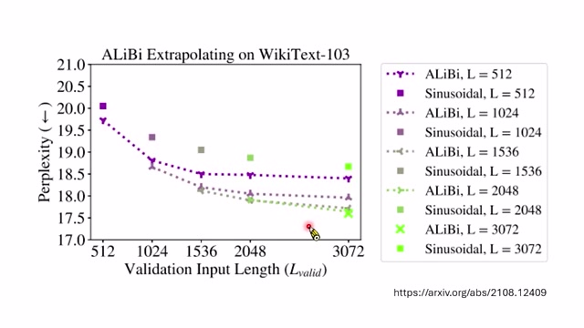

Sinusoidal encoding 在不同維度使用不同頻率：高頻維度區分近鄰，低頻維度描述長尺度。成對 sine/cosine 讓位置平移能以旋轉表示。 本段重點：這邊這個 B 都是隨便人設的 我們如果直接用 learn 的 會不會更好呢 早在 ALiBi 之前 很多人就已經想過或嘗試過 直接去 learn 這個相對位置的 Bias 這邊有很多不同的版本 我們這邊引用的是 T5 這篇文章的做法 它大概的做法就是 T5 是一個非常非常早年的文章 我們看是 19 年的文章 做法就是 A 呢會減掉一個 Bias 這個 Bias 呢 是跟它的相對距離 M 跟 N 之間的這個距離 是有關係的 它是一個 可以被訓練的數字 它是根據訓練資料 訓練出來的 在 T5 的模型裡面 它就會設置說 …

### Slide 22 — Sinusoidal Encoding 的相對位移性質 ([Video](https://www.youtube.com/watch?v=Ll-wk8x3G_g&t=2202s))

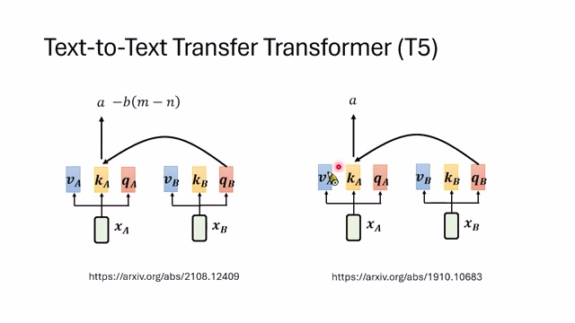

由三角恆等式可知，位置 p+k 的向量能由位置 p 的成對分量經固定旋轉得到；旋轉只依賴位移 k。 本段重點：有一個方法叫做 RoPE 它是 Rotary Positional Embedding 的縮寫 RoPE 是比 ALiBi 還要更早出來的 ALiBi 後來出來的時候 在它的 paper 裡面 它的實驗數據 在好幾個地方 還是甚至是贏過 RoPE 的 但最終歷史的洪流 選擇了 RoPE 這個方式 它是被用在 LLaMA Qwen、Gemma 等等知名的語言模型之中 我們等一下來看看 RoPE 有什麼樣的優勢 那我們剛才也已經看到了

### Slide 23 — Sinusoidal Encoding 的相對位移性質（續） ([Video](https://www.youtube.com/watch?v=Ll-wk8x3G_g&t=2235s))

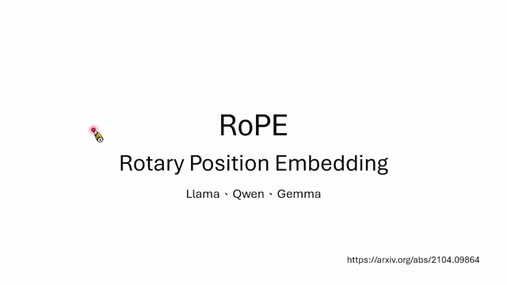

由三角恆等式可知，位置 p+k 的向量能由位置 p 的成對分量經固定旋轉得到；旋轉只依賴位移 k。 本段重點：Absolute 的 Positional Embedding 方式 想要透過一個比較間接的方式 來影響 Attention 我們看到 ALiBi 這種 簡單粗暴的方式 RoPE 這個方法 我們先講結論 它是怎麼做的 它的方法是這樣 我們今天在把 Q 跟 K 做 Dot product 之前 我們先把 Positional 的資訊 加到 K 跟 Q 上面 這邊說加不太精確 但你會看到它加 Position 的方法 並不是加入一個 Embedding 而是透過去旋轉 K 跟 Q 這兩個向量的方法 來加入 Positi…

### Slide 24 — Sinusoidal Encoding 的相對位移性質（續） ([Video](https://www.youtube.com/watch?v=Ll-wk8x3G_g&t=2418s))

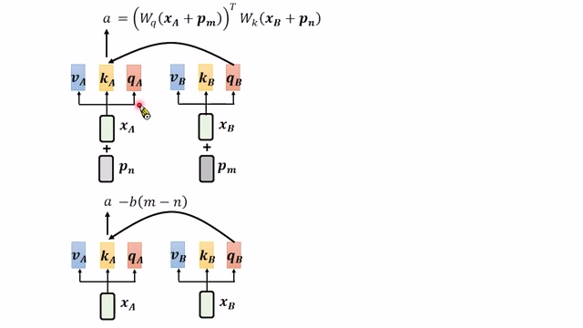

由三角恆等式可知，位置 p+k 的向量能由位置 p 的成對分量經固定旋轉得到；旋轉只依賴位移 k。 本段重點：在 RoPE 這個方法裡面 是怎麼加 position 的 他們這邊是把旋轉 當作 position 的印記 什麼意思呢 我們現在就先只考慮 K 跟 Q 這兩個向量的前兩維 把 K 的前兩維拿出來 它是一個二維平面上的向量 當我們說 我們把位置的資訊加進去的時候 是什麼意思呢 當我們說我們把位置的資訊 加進去的時候 對這個向量做一個旋轉 而位置的資訊 就被放在旋轉的角度裡面 如果你今天要把位置 N 的資訊加進去 你就把原來的 K 它的前兩維 旋轉 Nθ 這個角度 旋轉 N 乘上 θ 這個角度 就得到 K 上標 N …

## 五、Relative Positional Encoding

### Slide 25 — 直接建模 Token 間的相對位置 ([Video](https://www.youtube.com/watch?v=Ll-wk8x3G_g&t=2517s))

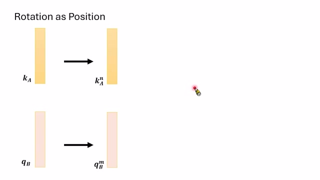

Relative positional encoding 在 attention score 或 value 聚合時加入兩 token 的距離；相同距離可跨不同絕對位置共享參數。 本段重點：RoPE 呢 它是每兩個維度 兩個維度一起考慮的 這個跟 sinusoidal positional embedding 一樣 我們剛才講 sinusoidal positional embedding 這裡說兩個維度合在一起 可以看作是二維平面上的一個指針 RoPE 也是一樣的概念 它每兩個維度作為一組 進行旋轉 所以我們剛才看了前兩個維度 看第 3 第 4 個維度 第 3 第 4 個維度編號就是 index 用的就是 2 跟 3 我們來看第 3 第 4 個維度 它們在旋轉的時候 就會用另外一個不同的角度來旋轉 …

### Slide 26 — 直接建模 Token 間的相對位置（續） ([Video](https://www.youtube.com/watch?v=Ll-wk8x3G_g&t=2592s))

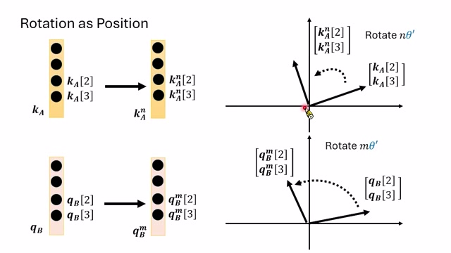

Relative positional encoding 在 attention score 或 value 聚合時加入兩 token 的距離；相同距離可跨不同絕對位置共享參數。 本段重點：要怎麼做設定呢 我們剛才說 每兩個維度一組 會有不同的旋轉的角度 我們前兩個維度 有一個角度 θ1 後面兩個維度 有另外一個角度 θ2 這個角度是怎麼設定的呢 這個角度呢 我們用 i 這個下標 來表示不同的角度 這個 θi 呢 的設計 跟 sinusoidal 的 positional embedding 非常的類似 它說 θi 等於 1 除以 1 萬 2i 除以 d 次方 但這邊不一定要設 1 萬 你可以設別的數值 但在 RoPE 的原始論文裡面 他們也是 follow sinusoidal positional…

### Slide 27 — 直接建模 Token 間的相對位置（續） ([Video](https://www.youtube.com/watch?v=Ll-wk8x3G_g&t=2667s))

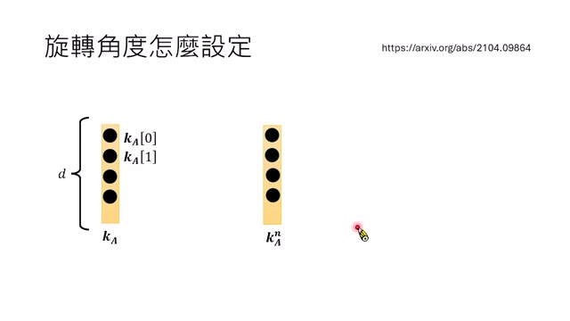

Relative positional encoding 在 attention score 或 value 聚合時加入兩 token 的距離；相同距離可跨不同絕對位置共享參數。 本段重點：可以達到什麼樣的效果 RoPE 可以達到的效果是 如果我們現在有一個 Q 在 N 這個位置 有一個 K 在 N 這個位置 我們對它做 attention 如果我們現在把這個 Q 移到 N+r 這個位置 把這個 K 移到 N+r 這個位置 它們的相對位置不變的時候 它的 attention 的數值也是不會改變的 舉例來說 假設現在有貓這個 token 有魚這個 token 貓這個 token 在第 1 個位置 魚這個 token 在第 3 個位置 你得到貓這個 token 的 key 加上位置 1 的資訊 這個所謂的…

### Slide 28 — 直接建模 Token 間的相對位置（續） ([Video](https://www.youtube.com/watch?v=Ll-wk8x3G_g&t=2760s))

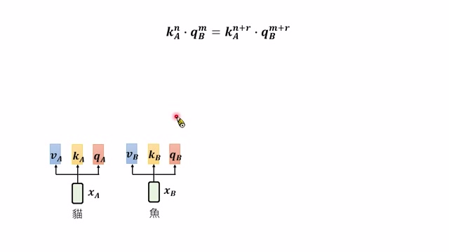

Relative positional encoding 在 attention score 或 value 聚合時加入兩 token 的距離；相同距離可跨不同絕對位置共享參數。 本段重點：為什麼 RoPE 可以達到這個效果 你想想看 假設這是我們原來的 key 它旋轉 Nθ 以後 跑到這個地方 代表原來的 key 加上位置 N 的資訊 假設現在 key 被放到 N+r 這個位置 你把它旋轉 (N+r)θ 跑到這個地方 這兩個向量之間 它的夾角會是多少呢 它的夾角是 rθ 的 同個向量 一個旋轉 Nθ 的 一個旋轉 (N+r)θ 的 它們之間的差距就是 rθ 的 所以你把 K 上標 N 再轉 rθ 的 就可以轉到 K 上標 N+r 對 Q 來說也是一樣 Q 上標 N 跟 Q 上標 N+r 中間就是差了…

### Slide 29 — Relative Bias 與距離分桶 ([Video](https://www.youtube.com/watch?v=Ll-wk8x3G_g&t=2877s))

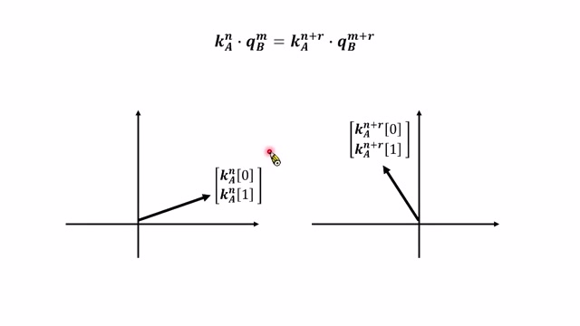

可對 query-key 距離加入可學習 bias，並把遠距離壓入 logarithmic buckets：近距離保留精度，遠距離粗略區分。 本段重點：我們剛才有講過說 這個第 N 個位置的 K 跟第 N 個位置的 Q 做 attention 等同於 Q 跟 K 都是沒有位置資訊的情況下 把 Q 乘上一個矩陣 這個矩陣呢 只跟 Q 跟 只跟這個 K 跟 Q 它們之間的距離有關 再乘上 K 的 transpose 我來看看現在這個是怎麼一回事 我們先也只拿前兩個維度來當作例子 我們說這個 K 的前兩個維度 跟 K 上標 N 的前兩個維度有什麼不同呢 它們中間有什麼樣的關係呢 就是你把 K 的前兩個維度乘上這個矩陣 這個矩陣代表旋轉 Nθ 這樣的角度 就得到 K 上標…

### Slide 30 — Relative Bias 與距離分桶（續） ([Video](https://www.youtube.com/watch?v=Ll-wk8x3G_g&t=2970s))

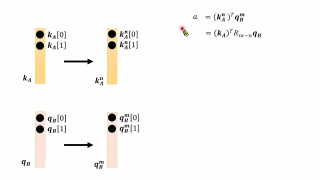

可對 query-key 距離加入可學習 bias，並把遠距離壓入 logarithmic buckets：近距離保留精度，遠距離粗略區分。 本段重點：等於前面那個向量 transpose 乘上後面這個向量 Q 上標 N 我們已經知道它長這個樣子 所以你可以把這個式子帶下來 Q 上標 N 你知道長這個樣子 所以可以把這個式子帶下來 所以我們得到的結果就是長這個樣子 所以我們現在已經把上標拿掉 我們只剩下 K 跟 Q 這個時候位置的資訊 通通都在這個代表旋轉的矩陣裡面了 那這個旋轉的矩陣乘上 K 的 transpose 等於 K 的 transpose 乘上旋轉的矩陣的 transpose 再乘上這個旋轉的矩陣 再乘上 Q 中間這兩個代表旋轉的矩陣 可以合併的 這個…

### Slide 31 — Relative Bias 與距離分桶（續） ([Video](https://www.youtube.com/watch?v=Ll-wk8x3G_g&t=3054s))

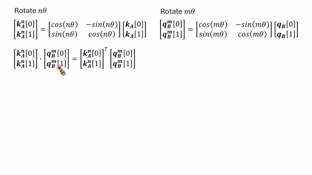

可對 query-key 距離加入可學習 bias，並把遠距離壓入 logarithmic buckets：近距離保留精度，遠距離粗略區分。 本段重點：如果是把 K 上標 N 換成 N+r 把 Q 上標 N 換成 N+r 計算出來會有什麼不同 你會發現說 當我們把 M 換成 M+r N 換成 N+r 中間旋轉的矩陣就變成 M+r 括號減掉 N+r 也就是轉 M-N 括號乘上 θ 這樣子的角度 所以這兩個計算的結果 會是一模一樣的 他們 Q 是一樣的 中間都是旋轉 M-N 乘上 θ K 也是一樣的 所以這一項跟這一項 一個是 M 的位置 跟 N 的位置做 attention 一個是 M+r 和 N+r 位置做 attention 他們算出來會是一模一樣的 講到這邊呢

### Slide 32 — Relative Bias 與距離分桶（續） ([Video](https://www.youtube.com/watch?v=Ll-wk8x3G_g&t=3108s))

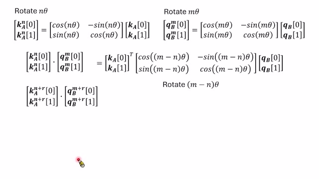

可對 query-key 距離加入可學習 bias，並把遠距離壓入 logarithmic buckets：近距離保留精度，遠距離粗略區分。 本段重點：你可能還會有一個問題是 我們剛才說 RoPE 它採取的方法是 把 K 跟 Q 分別做旋轉 再去做 attention 它本來又說這件事等於 把 Q 乘上 R 也就是 Q 自己做旋轉 再跟 K 做 attention 我們為什麼不採用 下面這個計算方式呢 為什麼我們計算的時候不是 把 Q 自己做好旋轉 再去跟每一個 K 算 attention 這個大家可以想想看 為什麼 我們這邊投影片上就沒有詳加解釋 如果是左邊這個做法 它跟原來的 attention 是一模一樣的 你可以甚至可以用 KV Cache 去把 K 存下…

## 六、RoPE 的核心想法

### Slide 33 — RoPE：用旋轉攜帶位置 ([Video](https://www.youtube.com/watch?v=Ll-wk8x3G_g&t=3204s))

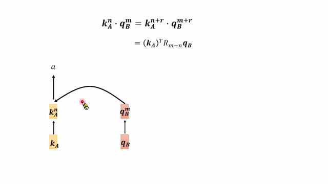

RoPE 不把位置向量直接相加，而是依位置角度旋轉 query 和 key 的二維分量。旋轉後內積只與兩位置的角度差相關。 本段重點：講到這邊呢 我們就講了 RoPE 的特性 很多人對 RoPE 有一個誤解 很多人會誤以為 RoPE 還有另外一個特性是 當我們的 Q 跟 K 距離越遠的時候 這個算出來的 attention 就越小 有點像是 ALiBi 那個樣子 但是真的有這個特性嗎 就用 Colab 的小程式跟大家說明

### Slide 34 — RoPE：用旋轉攜帶位置（續） ([Video](https://www.youtube.com/watch?v=Ll-wk8x3G_g&t=3225s))

RoPE 不把位置向量直接相加，而是依位置角度旋轉 query 和 key 的二維分量。旋轉後內積只與兩位置的角度差相關。 本段重點：這個 RoPE 並沒有保證 Q 跟 K 距離越遠的時候 Attention 就一定會越算越小 RoPE 並沒有保證這件事 那我們來看一下這個程式 首先第一個 block 這個 block 是在把 RoPE 加到 Q 或者是 K 上面去 所以這一個函式就是輸入一個 X 就是輸入一個向量 你給它一個 M M 代表說現在是在哪一個位置 M 代表位置 我們就會根據這個位置 把位置的資訊加到 X 裡面 也就是我們會對 X 做旋轉 每次旋轉的時候是兩維兩維考慮一起旋轉 每個兩維它的旋轉的角度都是不一樣的 總之這行程式就是在做這…

### Slide 35 — RoPE：用旋轉攜帶位置（續） ([Video](https://www.youtube.com/watch?v=Ll-wk8x3G_g&t=3399s))

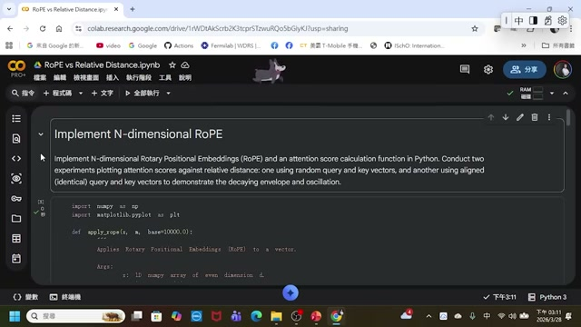

RoPE 不把位置向量直接相加，而是依位置角度旋轉 query 和 key 的二維分量。旋轉後內積只與兩位置的角度差相關。 本段重點：縱軸是算出來的 Attention 的分數 這個沒有 normalize 過的 Attention 所以它不會介於 0 到 1 之間 你可以發現這個 Attention 的數值是上上下下的 它並沒有因為距離越遠 Attention 的數值就越來越小

### Slide 36 — RoPE：用旋轉攜帶位置（續） ([Video](https://www.youtube.com/watch?v=Ll-wk8x3G_g&t=3420s))

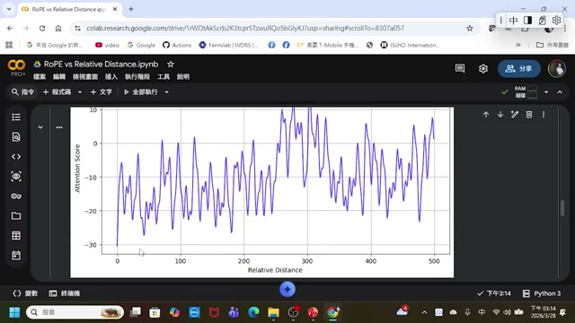

RoPE 不把位置向量直接相加，而是依位置角度旋轉 query 和 key 的二維分量。旋轉後內積只與兩位置的角度差相關。 本段重點：個 Q 跟 K 是隨機的 所以每次算出來都不太一樣 你會發現說它並沒有固定一定會變小的趨勢 什麼時候你可以看到固定或變小的趨勢呢 假設 Q 跟 K 的數值是一模一樣的時候 現在假設 Q 跟 K 的數值是一模一樣的時候 我們就假設 Q 這個向量裡面全部都是 1 K 這個向量裡面全部都是 1 現在如果 Q 跟 K 它們因為位置不同被轉不同的角度 它們角度差越多 確實有可能算出來的 Attention 就越來越小 我們看看是不是這個樣子 大體上的趨勢看起來這個 Attention 是有下降的趨勢

### Slide 37 — 二維旋轉與內積 ([Video](https://www.youtube.com/watch?v=Ll-wk8x3G_g&t=3459s))

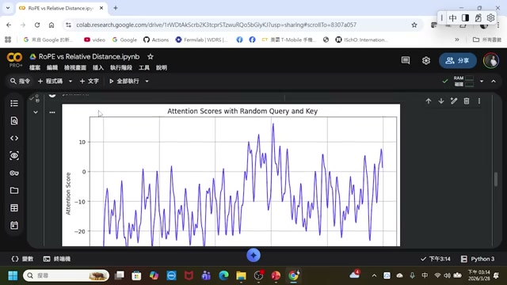

每兩個向量維度視為平面座標，位置 m 乘旋轉矩陣 R(mθ)。因 R(a)^T R(b)=R(b-a)，attention dot product 依賴相對位移。 本段重點：所以橫軸是 Q 跟 K 的距離 縱軸是 Attention 的分數 這個 Attention 的分數看起來果然有越來越小 但是你發現這個越來越小不是嚴格遞減的 它中間還有一些神秘的鋸齒 為什麼會有這些神秘的鋸齒呢 這就是來自於不同的維度 它旋轉的速度是不一樣的 所以很多維度它旋轉的速度是非常快速的 所以它在 0 到 500 這個區域內 它已經轉好多圈了 所以你以為角度會越來越小 沒有 它轉完一圈回來以後 這個角度就是不增反減 所以你才會看到有規律的鋸齒狀的波紋 所以使用 RoPE 並沒有保證距離越大 Attenti…

### Slide 38 — 二維旋轉與內積（續） ([Video](https://www.youtube.com/watch?v=Ll-wk8x3G_g&t=3522s))

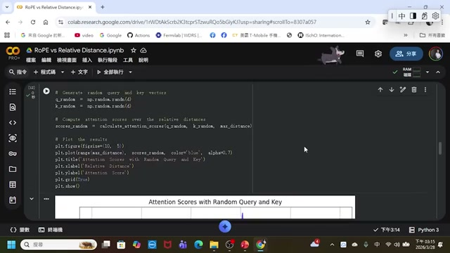

每兩個向量維度視為平面座標，位置 m 乘旋轉矩陣 R(mθ)。因 R(a)^T R(b)=R(b-a)，attention dot product 依賴相對位移。 本段重點：我們已經看到 Q 跟 K 隨著距離越來越大 他們的 attention 頂多是在趨勢上越來越小 並不保證一定會越來越小

### Slide 39 — 二維旋轉與內積（續） ([Video](https://www.youtube.com/watch?v=Ll-wk8x3G_g&t=3531s))

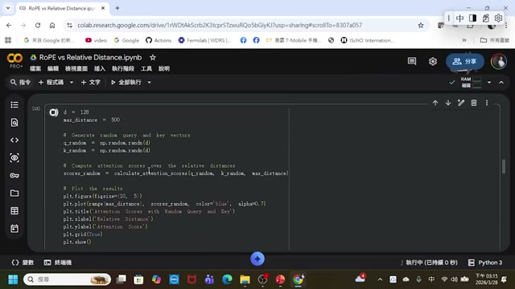

每兩個向量維度視為平面座標，位置 m 乘旋轉矩陣 R(mθ)。因 R(a)^T R(b)=R(b-a)，attention dot product 依賴相對位移。 本段重點：但是這不一定是一件壞事 雖然 ALiBi 它的 attention 是假設越來越小 但是 RoPE 可以做到原來 ALiBi 做不到的事情 舉一個例子 假設我們希望現在有一個 token 跳過前一個 token 直接 attend 在兩個 token 前的位置 對 ALiBi 來說就有困難 因為它越遠的 token 一定要 attend 越來越小 但是對 RoPE 來說 它就有可能製造出這種 attention 忽略前一個 token 只看前面第 2 個 token 有時候這可能 對於模型理解一個句子 是有幫助的 …

### Slide 40 — 二維旋轉與內積（續） ([Video](https://www.youtube.com/watch?v=Ll-wk8x3G_g&t=3645s))

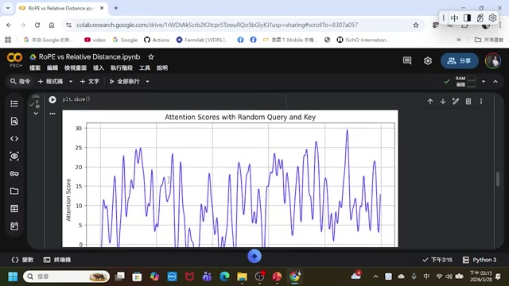

每兩個向量維度視為平面座標，位置 m 乘旋轉矩陣 R(mθ)。因 R(a)^T R(b)=R(b-a)，attention dot product 依賴相對位移。 本段重點：要講的是 Train Short Test Long 這邊講的比較簡略 如果你想要知道更多相關的事情的話 可以看下面這篇部落格的文章 什麼叫做 Train Short Test Long 呢

### Slide 41 — 二維旋轉與內積（續） ([Video](https://www.youtube.com/watch?v=Ll-wk8x3G_g&t=3657s))

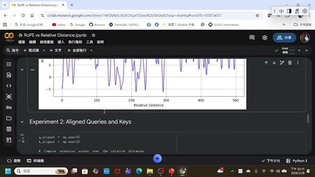

每兩個向量維度視為平面座標，位置 m 乘旋轉矩陣 R(mθ)。因 R(a)^T R(b)=R(b-a)，attention dot product 依賴相對位移。 本段重點：想要做到的事情是 我們能不能夠在訓練的時候 雖然 Transformer Language Model 只看過比較短的 sequence 但是在測試的時候 看到非常長的 sequence 在訓練的時候 從來沒有看過那麼長的 sequence 但測試的時候也不要壞掉 這對實際應用是非常有幫助的 因為在 training 的時候 不管你再怎麼訓練 你能夠給模型看到的 sequence 長度 可能都還是有個限制 尤其是你要叫模型 在學文字接龍的時候 給它的 sequence 越長 對訓練的負擔就越大 有時候你甚至找不到 …

### Slide 42 — 二維旋轉與內積（續） ([Video](https://www.youtube.com/watch?v=Ll-wk8x3G_g&t=3723s))

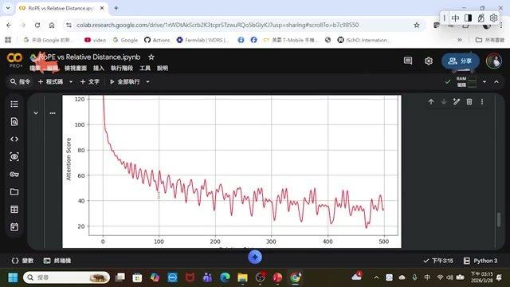

每兩個向量維度視為平面座標，位置 m 乘旋轉矩陣 R(mθ)。因 R(a)^T R(b)=R(b-a)，attention dot product 依賴相對位移。 本段重點：一個很直覺的想法也許是 假設雖然 training 的時候 我們訓練的時候 最多只看過 N 個 token 我們的位置的編號 就是 1 2 最多到 N 假設測試的時候 模型需要處理大 L 乘以 N L 倍長的 token sequence 我們能不能夠就直接給它 我們需要的編號 如果今天超過 N 的 token 你就直接把那個位置 設成 N+1 N+2 一直設到 LN 看看模型能不能夠運作 RoPE 可以處理這樣子的狀況嗎

### Slide 43 — 高維 RoPE 使用多組頻率 ([Video](https://www.youtube.com/watch?v=Ll-wk8x3G_g&t=3759s))

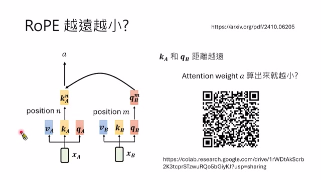

高維向量拆成多個二維 pair，每組使用不同頻率，提供多尺度位置訊息；RoPE 直接作用於 Q/K 而不是輸入 embedding。 本段重點：看起來是不行的 這個實驗呢 左邊的圖所有的模型呢 都是在 512 train 在 512 的 token 上 右邊都訓練在 1024 的 token 上 但測試的時候 給它們非常長的 input sequence 看看它們能不能處理 sinusoidal 呢 只要 sequence 一長 它就整個壞掉了 rotary 呢 就是我們剛才講的 RoPE 它雖然比 sinusoidal 好一點 但是隨著 sequence 越來越長 它也是逐漸的崩壞 這是 perplexity 所以這邊值呢 是越小越好 T5 是有 lea…

### Slide 44 — 高維 RoPE 使用多組頻率（續） ([Video](https://www.youtube.com/watch?v=Ll-wk8x3G_g&t=3834s))

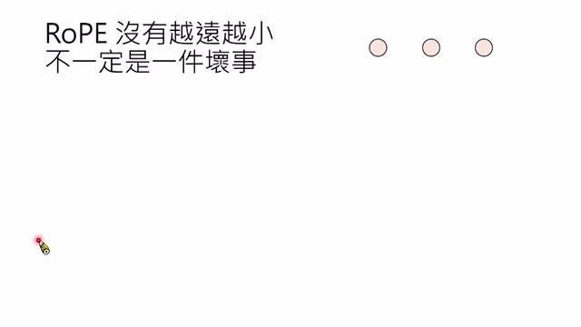

高維向量拆成多個二維 pair，每組使用不同頻率，提供多尺度位置訊息；RoPE 直接作用於 Q/K 而不是輸入 embedding。 本段重點：給它比較長的 sequence 也許第一個要問的問題是 為什麼 RoPE 在沒有看過的長 sequence 上面 它會失敗呢 這個也非常的直覺 假設我們在訓練的時候 最長的 sequence 就是大 N 你旋轉最大的角度 就是大 N 乘 θ 沒有更多了 但是假設你今天在測試的時候 在 inference 的時候 你就硬要給它兩倍的大 N 長 sequence 旋轉的角度 對 RoPE 來說 它從來沒有看過一個向量 可以被轉到這個地方 它就發瘋了 完全不知道要怎麼處理 過去的文獻人就發現了說 當你給 RoPE 超過它…

### Slide 45 — 高維 RoPE 使用多組頻率（續） ([Video](https://www.youtube.com/watch?v=Ll-wk8x3G_g&t=3891s))

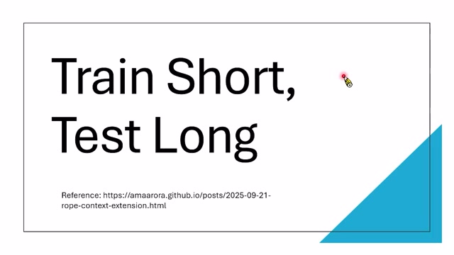

高維向量拆成多個二維 pair，每組使用不同頻率，提供多尺度位置訊息；RoPE 直接作用於 Q/K 而不是輸入 embedding。 本段重點：不要給它超過 N 的旋轉角度 你現在有大 L 乘上 N 個 token 但我們能不能夠改變 每一個 token 的編號 token 的編號沒有必要是整數 改變 token 的編號 讓一個大 L 乘 N 這麼長的 token sequence 它最大的 position 的編號 不要超過大 N 所以怎麼做 假設現在在訓練的時候 最多就是旋轉 N 乘 θ 最大的 position 就只有 N 但現在處理的 sequence 是大 L 乘 N 的時候 我們就把原來所有的位置的編號 都除上大 L 所以第 1 個 token…

## 七、RoPE 推導與實作

### Slide 46 — 複數表示與 RoPE 公式 ([Video](https://www.youtube.com/watch?v=Ll-wk8x3G_g&t=4062s))

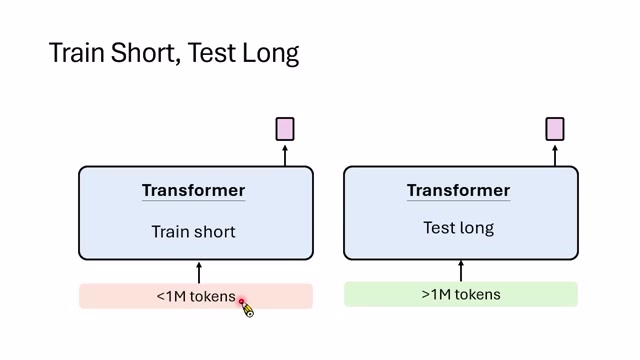

二維旋轉也可寫成複數乘法。實作以元素交換、符號翻轉和 sine/cosine 相乘完成，无需顯式建立大型旋轉矩陣。 本段重點：那剛才講的 positional interpolation 它並不一定能夠帶給我們非常好的表現 所以後人就有各式各樣的想法 有一系列的做法叫做 frequency-based 的方法 這種 frequency-based 的方法 它的想法是說 剛才我們是 我們本來在做 RoPE 的時候 我們是兩個維度，兩個維度一起考慮的 但剛才在做 positional interpolation 的時候 不管是哪一個維度 它的位置的 index 通通都是做同樣的處理 但是我們能不能夠做不同 但是 frequency-based…

### Slide 47 — 複數表示與 RoPE 公式（續） ([Video](https://www.youtube.com/watch?v=Ll-wk8x3G_g&t=4203s))

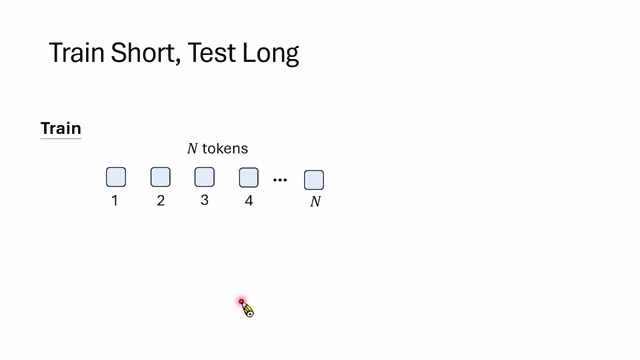

二維旋轉也可寫成複數乘法。實作以元素交換、符號翻轉和 sine/cosine 相乘完成，无需顯式建立大型旋轉矩陣。 本段重點：對 RoPE 而言 它每兩個 dimension 合起來 也是一個指針 這個指針也是在二維的平面上來旋轉 我說對於前兩個維度而言 它的這個指針的旋轉是非常快的 我們在訓練的時候 這個 N 設 128 對它來說它旋轉得非常快 它每 6 點多個這個 position 就已經轉一圈了 所以當 N 設等於 128 的時候 在這個圈圈上每一個位置 各個不同的位置 它可能都看過 如果今天是 θ32 的情況下 因為它轉得非常的慢 所以今天如果訓練的時候 N 等於 128 它只從這裡最多轉到這裡而已 所以如果對於 θ0 的情況下 …

### Slide 48 — 複數表示與 RoPE 公式（續） ([Video](https://www.youtube.com/watch?v=Ll-wk8x3G_g&t=4293s))

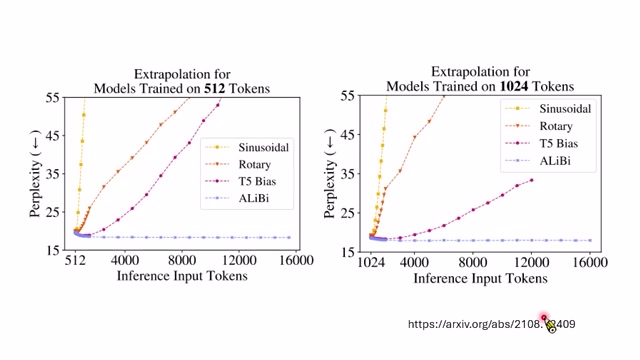

二維旋轉也可寫成複數乘法。實作以元素交換、符號翻轉和 sine/cosine 相乘完成，无需顯式建立大型旋轉矩陣。 本段重點：frequency-based 的方法 有很多不同的變形 其中一個比較知名的變形 叫 NTK-aware scaling NTK-aware scaling 是怎麼運作的呢 它把這個函式 F 寫成這個樣子 看起來有點複雜 它說 F of L, i 是 L 分之 1 的 2i 除以 d 減 2 次方 這個式子雖然有點複雜 但它的設計是有道理的 它的設計是怎麼個有道理法呢 如果你把 i 設成 1 在最低頻的這兩個維度 i 等於 0 如果你把 i 設成 0 的話 如果把 i 設成 0 的話 得到的數值 這個 F of L…

### Slide 49 — RoPE 套用在 Query 與 Key ([Video](https://www.youtube.com/watch?v=Ll-wk8x3G_g&t=4383s))

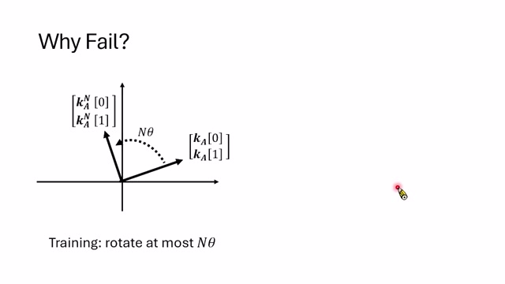

每層 attention 在計算 QK^T 前依 token 位置旋轉 Q 和 K；V 通常不旋轉。分數因此能感知相對距離。 本段重點：事實上有趣的地方是 NTK-aware scaling 這個方法 並沒有一篇對應的 paper 它是出自一個 Reddit 的文章 所以後人在討論這個方法的時候 也就是引用這篇 Reddit 的文章 這篇 Reddit 的文章裡面 作者就做了一個實驗 他就是觀察到原來的 positional interpolation 有種種的問題 所以他就提出了 NTK-aware scaling 的想法 而這個是那篇 Reddit 貼文附的實驗 縱軸 perplexity 數值是越小越好 橫軸是我們要語言模型處理的 seque…

### Slide 50 — RoPE 套用在 Query 與 Key（續） ([Video](https://www.youtube.com/watch?v=Ll-wk8x3G_g&t=4512s))

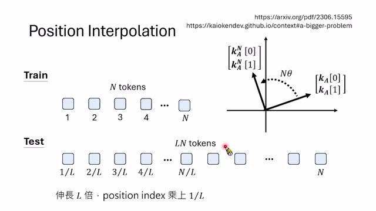

每層 attention 在計算 QK^T 前依 token 位置旋轉 Q 和 K；V 通常不旋轉。分數因此能感知相對距離。 本段重點：這個 frequency-based 的方法 真的還有非常非常多變形 另外一個知名的變形 叫做 YARN 它是 Yet Another RoPE Extension Method 的縮寫 它的精神是這個樣子 它的精神是說 我們看這個圖 這個圖是設 L 等於 2 的狀況 橫軸代表的是不同的頻率 縱軸代表是 Scaling Factor 如果是原來的 positional interpolation 它的縮寫是 PI 我們的 Scaling Factor 就固定設成 0.5 如果是 RoPE NTK 的這個方法 就是在…

### Slide 51 — RoPE 套用在 Query 與 Key（續） ([Video](https://www.youtube.com/watch?v=Ll-wk8x3G_g&t=4590s))

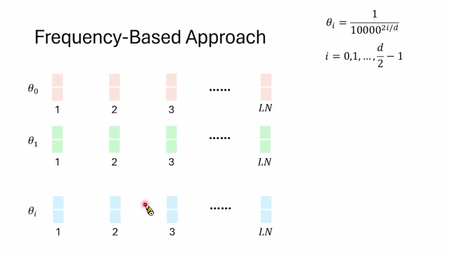

每層 attention 在計算 QK^T 前依 token 位置旋轉 Q 和 K；V 通常不旋轉。分數因此能感知相對距離。 本段重點：還有另外一個想法 是 dynamic scaling 在剛才的想法裡面 比如說 positional interpolation 它的做法是訓練的時候 假設有 4 個 token 測試的時候 假設我們最常會有 8 個 token 它就把這個 position 的變化呢 改成每 0.5 跳一格 這個方法可以讓我們可以處理 非常長的 sequence 超過訓練的時候 看過長度的 sequence 聽起來好像是有道理的 但是難道對於短的 sequence 有時候你在使用這個模型的時候 要處理的 sequence 長度是長…

## 八、長上下文與 RoPE Scaling

### Slide 52 — 訓練長度之外的外插問題 ([Video](https://www.youtube.com/watch?v=Ll-wk8x3G_g&t=4770s))

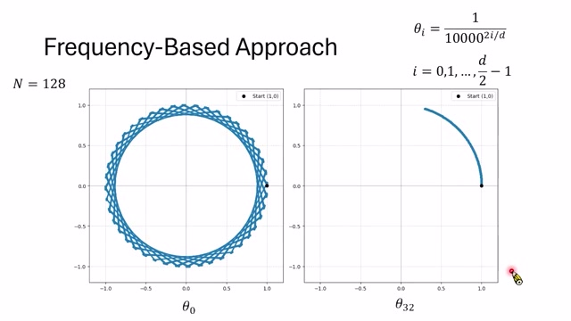

公式雖能計算任意位置，模型未必在訓練範圍外可靠。長上下文方法調整 RoPE 頻率或位置尺度，使相位落在較熟悉範圍。 本段重點：有趣的事情是 dynamic scaling 這個方法的起源 最早也可以追溯到一篇 Reddit 的文章 所以很多人引用 dynamic scaling 這個方法的時候 也會引用這篇 Reddit 的文章 這篇 Reddit 文章裡面 也有一個實驗的圖 縱軸是 perplexity 越小越好 橫軸呢 是要處理的 sequence 的長度 original 就是原來的模型 它的長度呢 跑到 2048 以後 就會壞掉了 你可以試試看 這個 NTK 這個方法 剛才講過 NTK 這個方法呢 它甚至在不用 training …

### Slide 53 — 訓練長度之外的外插問題（續） ([Video](https://www.youtube.com/watch?v=Ll-wk8x3G_g&t=4869s))

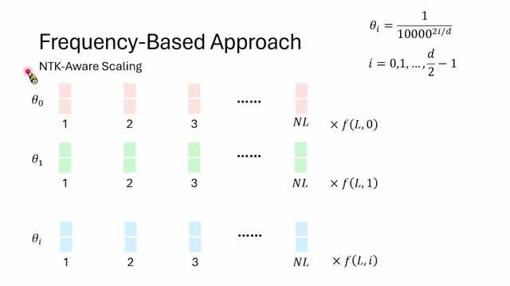

公式雖能計算任意位置，模型未必在訓練範圍外可靠。長上下文方法調整 RoPE 頻率或位置尺度，使相位落在較熟悉範圍。 本段重點：跟 dynamic scaling 的方法 當然是可以結合的 兩者是可以同時使用 麼說 frequency-based 的方法 你要這邊定一個函數 F dynamic 的方法呢 你可能要決定 假設你要做 positional interpolation 要從哪裡開始做 這個很複雜 要怎麼決定呢 有一篇 paper 叫做 LongRoPE 這篇 paper 用了一個 evolutionary search 的方法 想辦法去搜出 最好的 frequency-based 的方法 跟最好的 dynamic scaling …

### Slide 54 — 訓練長度之外的外插問題（續） ([Video](https://www.youtube.com/watch?v=Ll-wk8x3G_g&t=4905s))

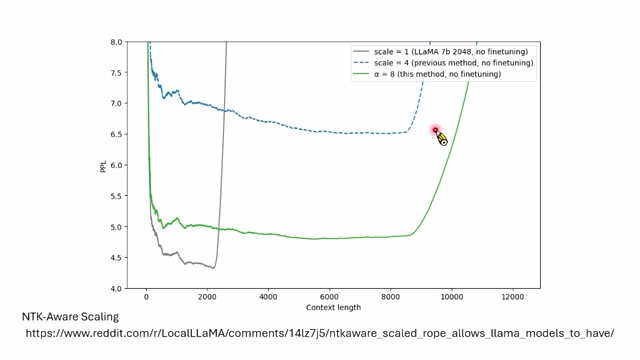

公式雖能計算任意位置，模型未必在訓練範圍外可靠。長上下文方法調整 RoPE 頻率或位置尺度，使相位落在較熟悉範圍。 本段重點：它可以讓模型處理的輸入長度到 2000K 2000K 就是兩個 million 的長度 這樣子就可以把整套哈利波特全集讀進來 都還有剩了 所以用這樣子 LongRoPE 的方法 可以把輸入擴展到非常非常長 就比較各式各樣不同的方法 你看這邊它有比較 YARN 我們剛才有提到 YARN 它把 YARN 當作一個 baseline 它的方法 LongRoPE 是這兩條線 是這兩條線 它的方法可以一直常處理到 這麼長的 sequence 結果都還不會壞掉 至於這個方法需不需要 fine-tune 論文本身非常的複雜 大家…

### Slide 55 — 訓練長度之外的外插問題（續） ([Video](https://www.youtube.com/watch?v=Ll-wk8x3G_g&t=4971s))

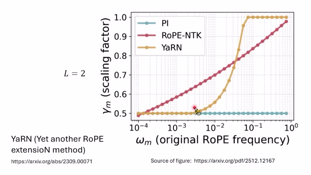

公式雖能計算任意位置，模型未必在訓練範圍外可靠。長上下文方法調整 RoPE 頻率或位置尺度，使相位落在較熟悉範圍。 本段重點：講了那麼多 講了那麼多 positional embedding 的東西 有一個靈魂的叩問 真的需要 positional embedding 嗎 你說怎麼不需要 positional embedding 呢 一開始不是說 self-attention 沒有位置的資訊 不做 positional embedding 這個 self-attention 根本無法分辨 貓吃魚跟魚吃貓 兩個不同的句子嗎 是因為我們只考慮了 第一層的 self-attention 如果我們考慮第二層 結論就不一樣了

### Slide 56 — 訓練長度之外的外插問題（續） ([Video](https://www.youtube.com/watch?v=Ll-wk8x3G_g&t=5004s))

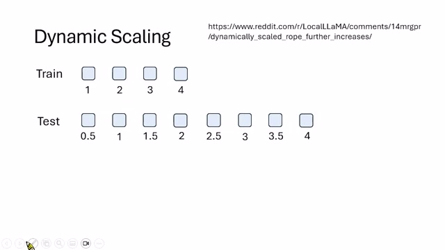

公式雖能計算任意位置，模型未必在訓練範圍外可靠。長上下文方法調整 RoPE 頻率或位置尺度，使相位落在較熟悉範圍。 本段重點：注意我們這邊在做 attention 的時候 因為我們用的是 language model 所以模型都只會 attend 在 它左半邊的東西 它不會 attend 整個輸入 所以今天假設輸入的句子是貓吃魚嗎 在第二個位置你會得到一個 embedding 這個 embedding 是綜合了貓跟吃的資訊 我們會得到一個 embedding 代表貓在吃東西 在這個位置你看到的是魚跟吃 所以你會得到一個 embedding 代表魚跟吃的資訊 所以假設就算是在沒有任何 positional embedding 的情況下 在考…

### Slide 57 — 方法比較與總結 ([Video](https://www.youtube.com/watch?v=Ll-wk8x3G_g&t=5073s))

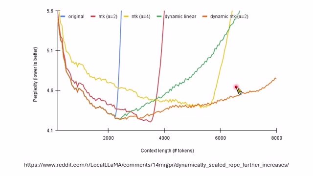

Absolute 方法簡單；relative bias 直接描述距離；RoPE 以旋轉讓 QK 內積依賴相對位移。選擇時需考慮訓練相容性、外插與成本。 本段重點：叫做 NoPE 就是沒有 positional embedding 的意思 這也是蠻早期的文章 23 年上古時代的文章 時候他就 train 了這個 Transformer 來做一些任務 他發現說 沒有加 positional embedding 也沒事 他這邊比較的方法有 每一張圖就代表 他 train 模型做一個任務 縱軸代表正確率 所以這邊是越大越好 灰色的部分代表訓練的時候 有看過的長度 但這是比較 toy 的 example 所以你發現說 他訓練的長度非常短 有一些長度是訓練的時候 從來都沒有看過 這個綠…

### Slide 58 — 方法比較與總結（續） ([Video](https://www.youtube.com/watch?v=Ll-wk8x3G_g&t=5181s))

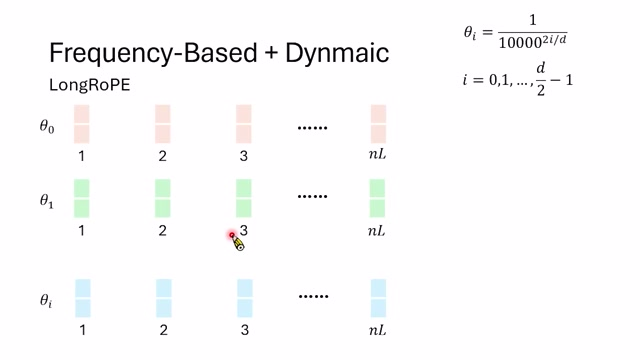

Absolute 方法簡單；relative bias 直接描述距離；RoPE 以旋轉讓 QK 內積依賴相對位移。選擇時需考慮訓練相容性、外插與成本。 本段重點：都仍然有 positional embedding 呢 有一篇這個去年年底的文章 就有一些相關的討論 這篇文章裡面它一個實驗 比較了 RoPE 跟 NoPE 注意一下這張圖是訓練的過程 我們講的不是 inference 我們講的是訓練的過程 橫軸是什麼 橫軸是訓練的 step 就做了幾次參數的更新 縱軸呢就是你的 loss 這個 loss 呢是越小越好 發現 NoPE 比不上 RoPE 是比不上在哪裡 是哪裡比不上 是在訓練的時候 就已經比不上 雖然 self-attention 本身 能夠取得位置的資訊 但在訓練…

### Slide 59 — 方法比較與總結（續） ([Video](https://www.youtube.com/watch?v=Ll-wk8x3G_g&t=5298s))

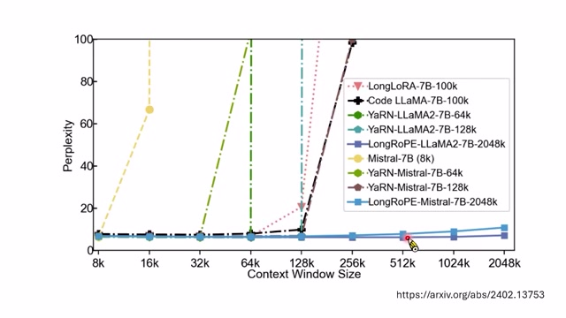

Absolute 方法簡單；relative bias 直接描述距離；RoPE 以旋轉讓 QK 內積依賴相對位移。選擇時需考慮訓練相容性、外插與成本。 本段重點：作為這個方法表現怎麼樣呢 它是可以比 RoPE 加 YARN 還要好的 在這個實驗裡面 縱軸是正確率 所以越高越好 橫軸是要處理的 sequence 的長度 RoPE 加 YARN 它說訓練的時候 大概是訓練這麼長的 sequence 如果今天 sequence 長度 長過訓練的時候 看過的 sequence 就很容易結果變差 但是 DroPE 這個方法 因為它本身就沒有 positional embedding 因為它沒有 positional embedding 所以反而可以處理更長的 sequence pos…

## 核心概念

- Token embedding 表示內容；positional encoding 補充順序與距離。
- Absolute encoding 提供索引，relative methods 直接建模 token 間距。
- Sinusoidal encoding 使用多頻率 sine/cosine，平移可表示為旋轉。
- RoPE 對 Q/K 做位置相關旋轉，使內積依賴相對位置。
- 能計算更大索引不等於能可靠外插；長上下文仍需 scaling 與驗證。

