# 讓 AI 自動找到更好的 Decoding 方法：從 Workflow 到 Reasoning Model

- 講者：李宏毅
- 影片：[YouTube](https://www.youtube.com/watch?v=m3i2mk5hs8U)
- 長度：1:27:42
- 字幕：原始繁體中文字幕

本講探討語言模型能否自我修正，從 contrastive decoding、DoLa、多模態對比、generation–verification workflow，一路談到以 RL 或 training-free sampling 形成 reasoning behavior。時間資料保存在 `source/transcript.txt` 與 `slides/index.csv`。

## 一、Self-Correction 問題

### Slide 1 — 模型能否在無人介入下自我修正？ ([Video](https://www.youtube.com/watch?v=m3i2mk5hs8U&t=0s))

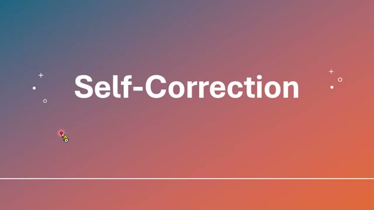

語言模型能依人類回饋改錯，但更難的問題是：輸出後能否自己發現錯誤並修正。課程把方法分為改 decoding、加入 workflow，以及直接訓練 reasoning behavior。 本段重點：那各位同學，我們就開始來上課吧 今天這堂課要講的是 self-correction 我們要來講說這些語言模型有沒有自我修正的能力 今天的這一堂課呢，我們想要講的是

### Slide 2 — 模型能否在無人介入下自我修正？（續） ([Video](https://www.youtube.com/watch?v=m3i2mk5hs8U&t=15s))

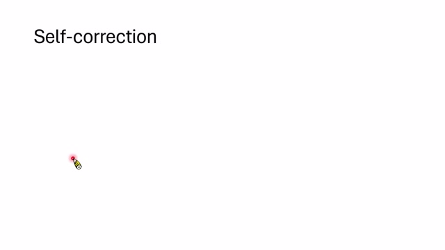

語言模型能依人類回饋改錯，但更難的問題是：輸出後能否自己發現錯誤並修正。課程把方法分為改 decoding、加入 workflow，以及直接訓練 reasoning behavior。 本段重點：我們大家都知道說今天語言模型非常的厲害 它可以根據人類給它的回饋修正自己要做的事情 比如說你給它一個輸入 它給你一個輸出 你告訴它你做錯了 告訴它錯在哪裡 往往語言模型有能力更正它原有的錯誤的行為 但今天這一堂課要講的是 能不能夠在沒有人力介入的情況下 語言模型輸出一個答案之後 它自己發覺自己是錯的 自己修正自己的行為 這個就是今天這堂課要探討的主題 類似的主題呢 過去也有講過

### Slide 3 — 模型能否在無人介入下自我修正？（續） ([Video](https://www.youtube.com/watch?v=m3i2mk5hs8U&t=60s))

語言模型能依人類回饋改錯，但更難的問題是：輸出後能否自己發現錯誤並修正。課程把方法分為改 decoding、加入 workflow，以及直接訓練 reasoning behavior。 本段重點：第一次講到這個 讓語言模型自我反省 自我修正這件事情啊 是在機器學習的 2023 年 你知道那個時候呢 是剛有 ChatGPT 的年代 是人類文明剛剛建立的年代 在那個時候呢 人類就已經發現說 這些語言模型某種程度上 有自我反省的能力 今天要講的課程內容

### Slide 4 — 模型能否在無人介入下自我修正？（續） ([Video](https://www.youtube.com/watch?v=m3i2mk5hs8U&t=87s))

語言模型能依人類回饋改錯，但更難的問題是：輸出後能否自己發現錯誤並修正。課程把方法分為改 decoding、加入 workflow，以及直接訓練 reasoning behavior。 本段重點：有很大一部分 是 2024 年機器學習第七講的延伸 在去年的這一堂課的第七堂課 我們講了怎麼讓模型有 reasoning 的能力 當然 reasoning 這件事情 今天大家可能一點都不陌生 幾乎每一個你線上用的語言模型 都已經有 reasoning 的功能了 但是在 2025 年的時候 這仍然是一個相對比較新的技術 今天呢 有很多內容 就是 2025 年講 reasoning 部分的延伸 我們來看看說 在過了一年之後 有什麼樣新的進展 我們不會重複過去太多的內容 我們講的都…

### Slide 5 — 模型能否在無人介入下自我修正？（續） ([Video](https://www.youtube.com/watch?v=m3i2mk5hs8U&t=129s))

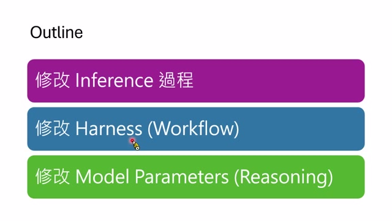

語言模型能依人類回饋改錯，但更難的問題是：輸出後能否自己發現錯誤並修正。課程把方法分為改 decoding、加入 workflow，以及直接訓練 reasoning behavior。 本段重點：今天呢 要講三件事 怎麼讓模型做到自我修正呢 有三個不同的方向 第一個方向 是去改 inference 的過程 第二個方向 是改上次提到的 Harness 也就改變模型的工作流程 第三個部分呢 是在模型的參數上直接改變它 第三個部分 就是大家現在都很常聽到的 reasoning 推理的技術 那我們就先從修改 inference 的過程

### Slide 6 — 模型能否在無人介入下自我修正？（續） ([Video](https://www.youtube.com/watch?v=m3i2mk5hs8U&t=159s))

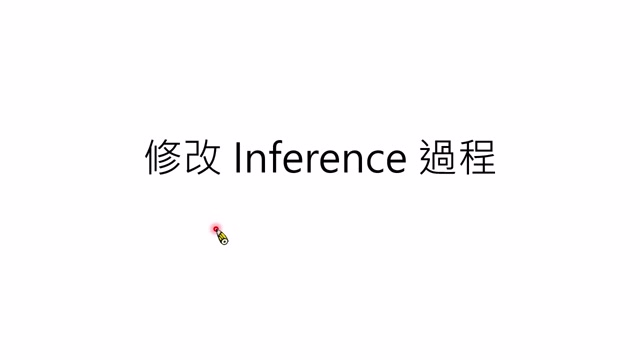

語言模型能依人類回饋改錯，但更難的問題是：輸出後能否自己發現錯誤並修正。課程把方法分為改 decoding、加入 workflow，以及直接訓練 reasoning behavior。 本段重點：重點是，開始講起

### Slide 7 — 模型能否在無人介入下自我修正？（續） ([Video](https://www.youtube.com/watch?v=m3i2mk5hs8U&t=162s))

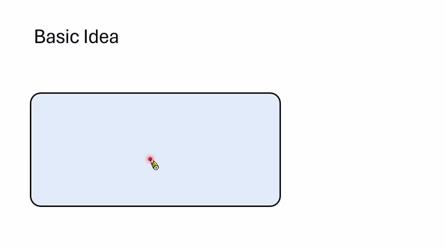

語言模型能依人類回饋改錯，但更難的問題是：輸出後能否自己發現錯誤並修正。課程把方法分為改 decoding、加入 workflow，以及直接訓練 reasoning behavior。 本段重點：大家對於一個語言模型 怎麼做生成的 想必都非常的熟悉 語言模型的輸入 就是一排 token 這些 token 被丟到 Transformer 以後 它們會變成一排 representation 最後變成一個機率的分布 我們從這個機率的分布去做 sample sample 出一個 token 這個 token 會變成下一個時間點的輸入 再產生下一個機率分布 再產生下一個 token 這個過程就反覆繼續下去 我們怎麼在這個 inference 的過程中 讓模型自我修正呢 分成兩個…

### Slide 8 — 模型能否在無人介入下自我修正？（續） ([Video](https://www.youtube.com/watch?v=m3i2mk5hs8U&t=249s))

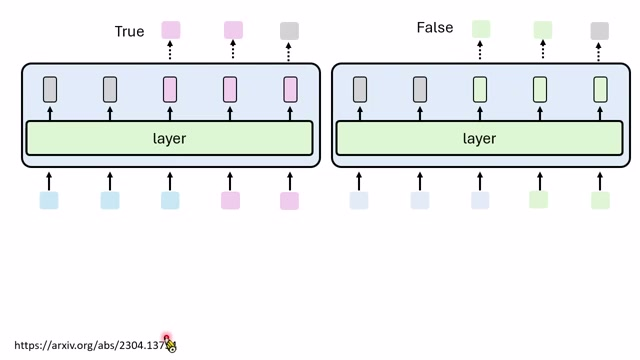

語言模型能依人類回饋改錯，但更難的問題是：輸出後能否自己發現錯誤並修正。課程把方法分為改 decoding、加入 workflow，以及直接訓練 reasoning behavior。 本段重點：引用一篇 23 年的文獻 這個在 24 年的課程裡面 就有提過這篇論文 這篇論文做的事情是這樣 他們的做法是說 它收集了語言模型 在回答正確的時候 它就問語言模型各式各樣的問題 如果它答案是正確的 把它的 representation 收集起來 如果它答案是錯誤的 也把它的 representation 收集起來 在這篇論文裡面 作者訓練了一個 binary classifier 一個二元的分類器 這個二元的分類器 它的工作就是 去分辨一個 representation 它會…

### Slide 9 — 模型能否在無人介入下自我修正？（續） ([Video](https://www.youtube.com/watch?v=m3i2mk5hs8U&t=336s))

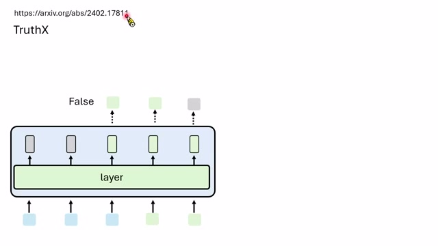

語言模型能依人類回饋改錯，但更難的問題是：輸出後能否自己發現錯誤並修正。課程把方法分為改 decoding、加入 workflow，以及直接訓練 reasoning behavior。 本段重點：在 24 年的時候 有另外一篇 paper 叫做 True Facts 這篇 paper 展示了修正 把錯誤的答案修成正確的 是有可能的 這件 paper 是怎麼做的呢 他說假設你已經收集到一大堆 模型會答錯的狀態 收集到一大堆 答錯的時候會有的 representation 另外你收集到一堆 答對的時候會有的 representation 接下來你把答錯的 representation 平均 把答對的 representation 平均 把它們相減 得到黃色的這個向量 黃色…

### Slide 10 — 模型能否在無人介入下自我修正？（續） ([Video](https://www.youtube.com/watch?v=m3i2mk5hs8U&t=378s))

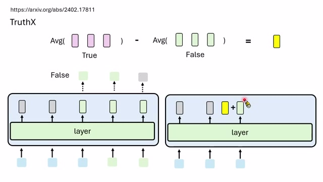

語言模型能依人類回饋改錯，但更難的問題是：輸出後能否自己發現錯誤並修正。課程把方法分為改 decoding、加入 workflow，以及直接訓練 reasoning behavior。 本段重點：模型本來看到這個問題 它產生這個 representation 會答錯 那你已經知道正確跟錯誤的差距 就是這個黃色的 vector 你要把這個黃色的 vector 直接加到這個錯誤的 vector 上面 會導致錯誤答案的 vector 上面 模型就有可能給你正確的答案 所以我們在有了一大堆 正確的 representation 跟錯誤的 representation 知道它們的差距之後 你甚至有可能利用這個資訊 來修正模型的答案 所以偵測修正 都是有可能自動進行的 但是像 T…

## 二、Contrastive Decoding

### Slide 11 — 用「故意答錯」的模型訊號做對比 ([Video](https://www.youtube.com/watch?v=m3i2mk5hs8U&t=441s))

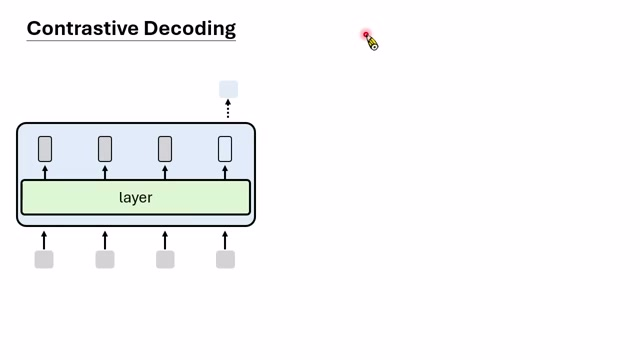

Contrastive decoding 比較正常條件與刻意破壞條件下的 logits／representation，減去較可能造成錯誤的成分，再進行 sampling。它把 error detection 與 correction 合併，而且不必收集額外標註。 本段重點：在沒有收集額外資料的情況下 就偵測出錯誤 進行修正呢 這邊就要跟大家分享一個 叫 contrastive decoding 的技術 它等於就是剛才的 error detection 加 error correction 的結合 但是它不需要收集額外的資料 contrastive decoding 的概念是這個樣子的 現在你問模型一個問題 它去預測下一個 token 這是模型在正常情況下得到的答案 你不太確定它是對的還是錯的 但是接下來同樣的問題

### Slide 12 — 用「故意答錯」的模型訊號做對比（續） ([Video](https://www.youtube.com/watch?v=m3i2mk5hs8U&t=474s))

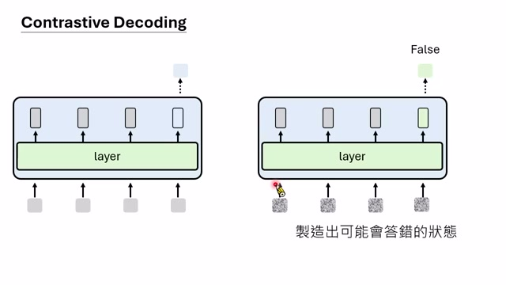

Contrastive decoding 比較正常條件與刻意破壞條件下的 logits／representation，減去較可能造成錯誤的成分，再進行 sampling。它把 error detection 與 correction 合併，而且不必收集額外標註。 本段重點：你做一些修改 至於這個輸入要怎麼做修改 等一下會有各式各樣的做法 把這個輸入做一些修改 製造出讓模型一定會答錯的狀態 至於怎麼保證它一定會答錯 個是等一下要再講的事情 假設模型在現在這個輸入 做一些修改的狀態下 它非常有可能會答錯 我們就知道模型答錯的時候 答錯的這個 representation 長什麼樣子 我們就把原來模型 會產生的 representation 跟它答錯的時候 會產生的 representation 相減 得到正常狀況跟答錯狀況的差距 就是黃色的向量 就…

### Slide 13 — 用「故意答錯」的模型訊號做對比（續） ([Video](https://www.youtube.com/watch?v=m3i2mk5hs8U&t=681s))

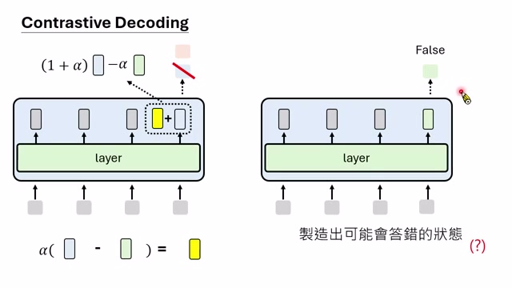

Contrastive decoding 比較正常條件與刻意破壞條件下的 logits／representation，減去較可能造成錯誤的成分，再進行 sampling。它把 error detection 與 correction 合併，而且不必收集額外標註。 本段重點：文獻上比較常見的操作是 這個 representation 通常不是拿中間的 hidden layer 比較常見的操作是 這個東西 就是模型最終輸出的 個機率分布 或者是在 normalized 機率分布前的數值 也就是 logit 最常見的做法是 這個狀態跟這個狀態 分別跑到最後 得到最終輸出的 logit 或者是機率分布 再把這兩個機率分布相減 得到最終的輸出 這個 contrastive decoding

### Slide 14 — 用「故意答錯」的模型訊號做對比（續） ([Video](https://www.youtube.com/watch?v=m3i2mk5hs8U&t=717s))

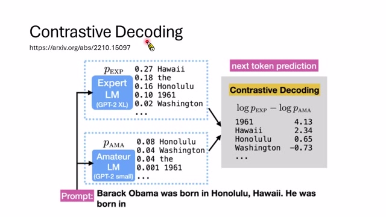

Contrastive decoding 比較正常條件與刻意破壞條件下的 logits／representation，減去較可能造成錯誤的成分，再進行 sampling。它把 error detection 與 correction 合併，而且不必收集額外標註。 本段重點：不是最近幾年才有的技術 早在上古時代 你看這個是 22 年的文章 在還沒有 ChatGPT 人類還在茹毛飲血 還不知道用火的時代 個時候就已經有 contrastive decoding 時候的想法 就跟我剛才講的概念 是一樣的 時候想法是這個樣子的 他們說 現在要讓模型來做文字接龍 要接的句子是 歐巴馬生在檀香山 他生在哪一年 要模型繼續接龍下去 在這個句子裡面 你如果問當時的比較好的模型 當時比較好的模型是 GPT-2 你問 GPT-2 比較大的版本 要接哪一個字 它覺得…

## 三、DoLa 與 Logit Lens

### Slide 15 — Decoding by Contrasting Layers ([Video](https://www.youtube.com/watch?v=m3i2mk5hs8U&t=882s))

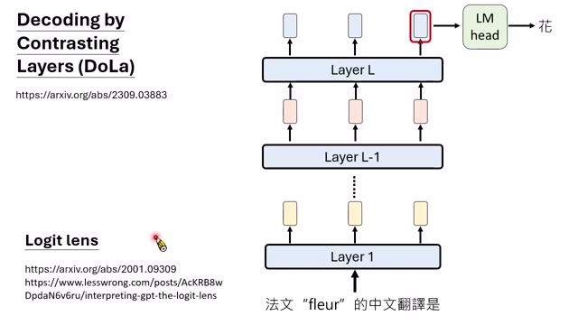

Logit lens 將中間層 representation 投影到詞彙空間，觀察知識如何隨深度形成。DoLa 將成熟層與較早、較不可靠層的預測做對比，強化後期形成的 factual signal；Hugging Face 已提供推論選項。 本段重點：後來呢 在 2023 年的時候 也有另外一個 應用到 contrastive decoding 概念的方法 叫做 Decoding by Contrasting Layers DoLa 這個方法可能是用得比較廣的 而且甚至今天在 Hugging Face 的 Transformer 裡面 如果你使用 Hugging Face inference 的套件的話 你也有一個 flag 是可以直接叫模型在 inference 的時候 直接使用 DoLa 這個技術 所以這個技術是有被直…

### Slide 16 — Decoding by Contrasting Layers（續） ([Video](https://www.youtube.com/watch?v=m3i2mk5hs8U&t=1077s))

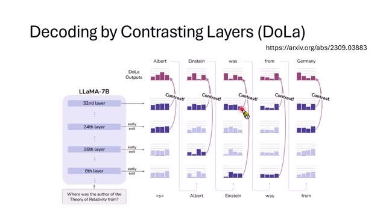

Logit lens 將中間層 representation 投影到詞彙空間，觀察知識如何隨深度形成。DoLa 將成熟層與較早、較不可靠層的預測做對比，強化後期形成的 factual signal；Hugging Face 已提供推論選項。 本段重點：我們會從最後一個 layer 得到一個 distribution 但我們也從前面的 layer 得到前面的 layer 用 logit lens 產生出來的 distribution 兩者相減 當作最後的答案 當然對這篇 paper 而言 一個很重要的地方是 要從哪一個 layer 去做 logit lens decode 出來的 distribution 才是最該拿來做相減的呢 哪一個 layer decode 出來的 才有可能是有可能是 比較有可能是錯誤的呢 這邊這個 p…

### Slide 17 — Decoding by Contrasting Layers（續） ([Video](https://www.youtube.com/watch?v=m3i2mk5hs8U&t=1188s))

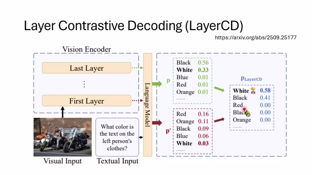

Logit lens 將中間層 representation 投影到詞彙空間，觀察知識如何隨深度形成。DoLa 將成熟層與較早、較不可靠層的預測做對比，強化後期形成的 factual signal；Hugging Face 已提供推論選項。 本段重點：還有另外一個應用到不同 layer 之間差異的方法 叫做 Layer Contrastive Decoding 它的縮寫是 Layer CD 這個方法呢 是應用在影像上的 這篇 paper 呢 就已經是 25 年的 paper 了 它裡面的發現就是說 當我們呢 用影像的模型的時候 現在很多影像模型 可以看一張圖片 你問它問題 這邊的問題就是 這個機車上的人呢 他穿的衣服上面的字 是什麼顏色的 如果呢 你用最後一個 layer 當作 language model 的輸入 這個最…

## 四、用指令或 Context 製造負例

### Slide 18 — Instruction 與 Context-Aware Decoding ([Video](https://www.youtube.com/watch?v=m3i2mk5hs8U&t=1293s))

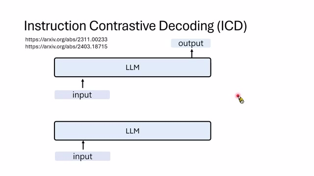

ICD 用「你會給錯答案」等降智指令產生負 logits；CAD 比較有無檢索 context 的輸出，抑制模型只靠內部先驗、忽略證據的傾向。負例如何製造直接決定方法效果。 本段重點：我們剛才講說是靠不同的 Layer 來製造錯誤的答案 另外一個製造錯誤的答案的方法是 直接給模型一個降智咒語 讓它變笨 這一系列的做法 有好幾篇 它們叫做 Instruction Contrastive Decoding ICD 這個降智咒語是什麼 就說出來不值錢 你就在模型的輸入後面 多加一句說 你都給錯誤的答案 或你是一個很糟糕的模型 真的就這樣 模型就變得比較笨 答案就比較有可能是錯的 再把錯誤的答案 跟原來的答案相減 希望可以得到更正確的答案 還有另外一個系列的做法

### Slide 19 — Instruction 與 Context-Aware Decoding（續） ([Video](https://www.youtube.com/watch?v=m3i2mk5hs8U&t=1335s))

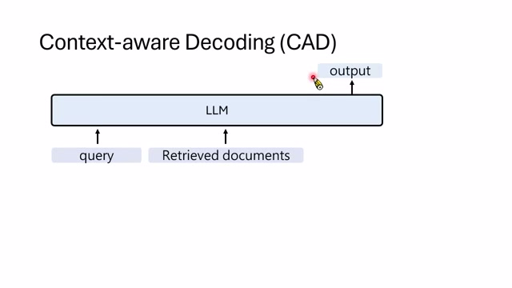

ICD 用「你會給錯答案」等降智指令產生負 logits；CAD 比較有無檢索 context 的輸出，抑制模型只靠內部先驗、忽略證據的傾向。負例如何製造直接決定方法效果。 本段重點：叫做 Context-Aware Decoding 縮寫是 CAD Context-Aware Decoding 最早有一個應用 是用在 RAG 上面 大家知道 RAG 就是 今天語言模型有時候 它沒有辦法及時更新知識 所以你問一個問題 你會順便去網路上查些相關的文章 把問題跟相關的文章 一起丟給語言模型 期待它得到答案 但後來有一些比較厲害的模型 它都不去讀那些文章 因為它覺得說 我就已經知道答案 何必讀這些文章 因為它美國總統是誰 雖然美國總統一直會換 但是它不知道 所以…

### Slide 20 — Instruction 與 Context-Aware Decoding（續） ([Video](https://www.youtube.com/watch?v=m3i2mk5hs8U&t=1422s))

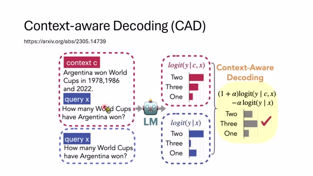

ICD 用「你會給錯答案」等降智指令產生負 logits；CAD 比較有無檢索 context 的輸出，抑制模型只靠內部先驗、忽略證據的傾向。負例如何製造直接決定方法效果。 本段重點：這個也是一個很古老的技術 23 年的時候 這也是中古世紀就已經有的方法 你看這是直接從論文裡面 擷出來的圖 它就是說 假設你給語言模型 問題跟相關的文章 這個正確的 token 它的機率還不是最高的 另外一個 case 你只給它問題 不給它答案 讓它先憑著自己原有的知識 來得到答案 再把這兩個 case 相減 你可以最終得到正確的答案 這個就是 CAD 的想法 像 CAD 這樣的技術

### Slide 21 — Instruction 與 Context-Aware Decoding（續） ([Video](https://www.youtube.com/watch?v=m3i2mk5hs8U&t=1458s))

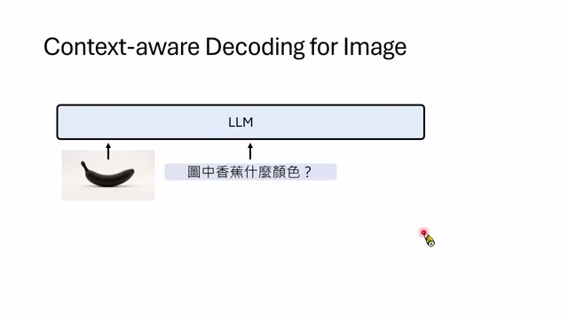

ICD 用「你會給錯答案」等降智指令產生負 logits；CAD 比較有無檢索 context 的輸出，抑制模型只靠內部先驗、忽略證據的傾向。負例如何製造直接決定方法效果。 本段重點：也被用在影像上 我想這邊這個影像的例子 假設你聽到這邊 覺得 Contrastive Decoding 聽起來是一個 有點莫名其妙的方法 這種方法怎麼可能會 work 呢 我覺得用在影像 CAD 用在影像上的例子 是最直觀也許可以說服你 這是一個有用 有可能會發揮作用的方法的這個例子 所以一般我們在使用影像模型的時候 就是給它一張圖片 問它一個問題 如果你今天給它這個黑色的香蕉 問它說圖中的香蕉是什麼顏色 這個時候模型會有一點 它會有一點猶豫 它直覺會覺得香蕉就應該是黃色的 …

### Slide 22 — Instruction 與 Context-Aware Decoding（續） ([Video](https://www.youtube.com/watch?v=m3i2mk5hs8U&t=1557s))

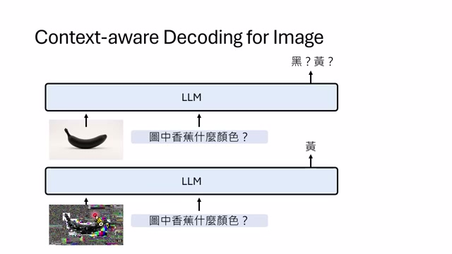

ICD 用「你會給錯答案」等降智指令產生負 logits；CAD 比較有無檢索 context 的輸出，抑制模型只靠內部先驗、忽略證據的傾向。負例如何製造直接決定方法效果。 本段重點：或者是你把圖片加上很強的雜訊 讓它看不清楚 問它說圖片的香蕉是什麼顏色 這時候它覺得說 根本就沒有香蕉啊 我就憑著我先入為主的概念來回答好了 答案是黃色 正好得到錯誤的答案 再把錯誤的答案跟原來的答案相減 模型就有可能得到正確的答案 這個是在 image 上面 做 Context-Aware Decoding

### Slide 23 — Instruction 與 Context-Aware Decoding（續） ([Video](https://www.youtube.com/watch?v=m3i2mk5hs8U&t=1584s))

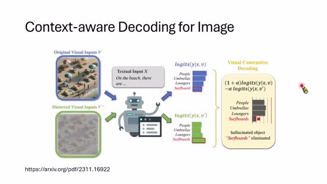

ICD 用「你會給錯答案」等降智指令產生負 logits；CAD 比較有無檢索 context 的輸出，抑制模型只靠內部先驗、忽略證據的傾向。負例如何製造直接決定方法效果。 本段重點：這個也是很早的技術 也是 23 年就有的技術 我就直接截了一個論文的截圖 這篇圖片裡面 跟我剛才講的概念是一樣的 有一個影像的模型 給它這張圖片 問它說 這個海灘上有什麼東西 模型就給了一些答案 它說看到人 看到陽傘 這都沒有問題 但它說它看到衝浪板 但那張照片裡面 是沒有衝浪板的 但是衝浪板很容易出現在海灘上 所以模型先入為主地覺得 海灘的照片就應該要有衝浪板 所以衝浪板也得到了蠻高的機率 接下來呢 他們就做 Context-Aware Decoding 給模型一張很模糊的…

### Slide 24 — Instruction 與 Context-Aware Decoding（續） ([Video](https://www.youtube.com/watch?v=m3i2mk5hs8U&t=1665s))

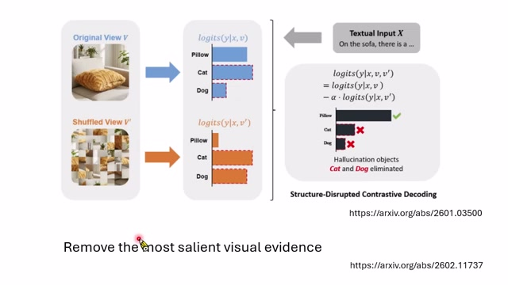

ICD 用「你會給錯答案」等降智指令產生負 logits；CAD 比較有無檢索 context 的輸出，抑制模型只靠內部先驗、忽略證據的傾向。負例如何製造直接決定方法效果。 本段重點：就開始研究要加什麼樣的雜訊 才是特別有效的 通常呢 你希望製造出的這個錯誤的 case 是模型特別容易發生誤會的 case 像在這一篇今年的論文裡面呢 它做的事情就是 不是加一般的雜訊 而是把圖片切成一塊一塊的再打亂 發現比加一般的雜訊結果更好 或者是有一個今年六月的論文 它做的事情不是隨便加雜訊 它覺得隨便加雜訊 這樣子模型不一定會答錯 它做的事情是 先用一些方法分析 模型今天得到這個答案的時候 看的是圖片裡面的什麼位置 圖片裡面哪些物件是最重要的 把重要的物件抹去以後 再…

## 五、多模態 Contrastive Decoding

### Slide 25 — Visual／Audio-Aware Decoding ([Video](https://www.youtube.com/watch?v=m3i2mk5hs8U&t=1716s))

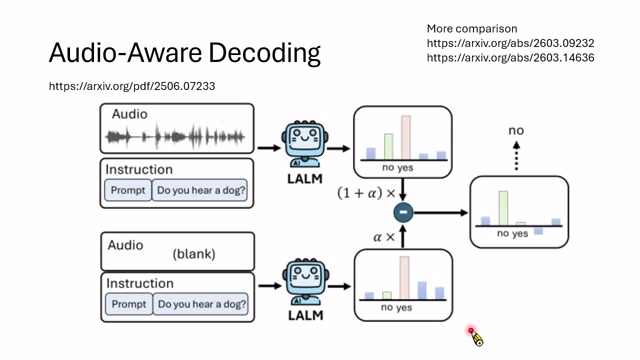

多模態方法比較正常影像或音訊與移除、遮蔽、靜音後的輸出，減去不依賴感知輸入的語言先驗，促使答案真正 grounded 在視覺或聲音證據上。 本段重點：也可以用在語音上 這篇論文是一個普渡大學的學生 在我們實驗室 visit 的時候 做的一個研究的成果 我們就是做了 Audio-Aware 的 Decoding 跟在影像上的概念是一樣的 我們把影像換成聲音 今天在 decode 的時候 給模型正常的音訊 問它一個問題 看它得到什麼樣的答案 故意把音訊拿掉 或者是把音訊換成 silence 再做 decoding 看它得到什麼樣的答案 把正確的答案乘上 1 - alpha 錯誤的答案乘上 alpha 相減 得到最終的輸出 再做…

### Slide 26 — Visual／Audio-Aware Decoding（續） ([Video](https://www.youtube.com/watch?v=m3i2mk5hs8U&t=1779s))

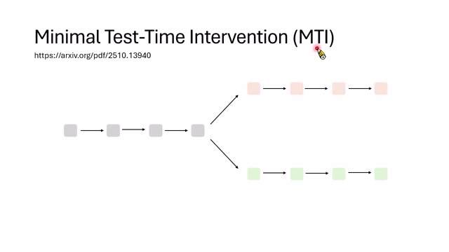

多模態方法比較正常影像或音訊與移除、遮蔽、靜音後的輸出，減去不依賴感知輸入的語言先驗，促使答案真正 grounded 在視覺或聲音證據上。 本段重點：這篇論文呢 這個 MTI Minimum Test-Time Intervention 是希望可以減少 Contrastive Decoding 需要的 額外的運算 我剛才說 Contrastive Decoding 它的缺點 就是用算力來換取 比較好的表現 能不能夠使用比較少的算力 就得到 Contrastive Decoding 的優勢呢 這篇 paper 它先有一個假設是說 當模型在做 decode 的時候 可能只有某幾個 token 是特別關鍵的 就在這個位置從這邊到…

### Slide 27 — Visual／Audio-Aware Decoding（續） ([Video](https://www.youtube.com/watch?v=m3i2mk5hs8U&t=1854s))

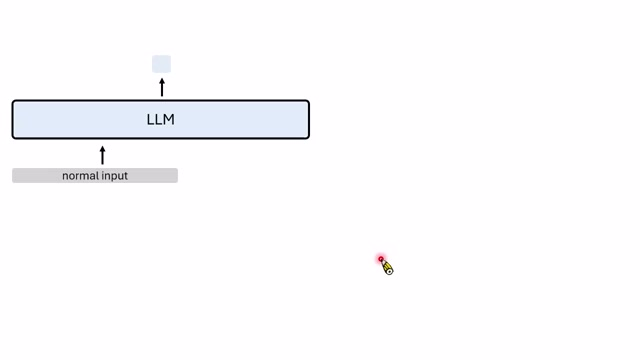

多模態方法比較正常影像或音訊與移除、遮蔽、靜音後的輸出，減去不依賴感知輸入的語言先驗，促使答案真正 grounded 在視覺或聲音證據上。 本段重點：是怎麼運作的 原來 Contrastive Decoding 需要在每一個 token 上都做 所以你給 LLM 一個正常的輸入 它給你一個 token 你給它一個 亂搞的輸入 讓它給你一個 錯誤的答案 把這兩者相減 得到更正確的結果 把更正確的結果 當作下一個 timestep 的輸入 在兩個 不同的狀況下 得到正常的結果 跟錯誤的結果 再相減 再得到新的輸出 再當作下一個 timestep 的輸入 每一個步驟 每一個 decode 每一步 decode 的時候 都要做類似…

### Slide 28 — Visual／Audio-Aware Decoding（續） ([Video](https://www.youtube.com/watch?v=m3i2mk5hs8U&t=1998s))

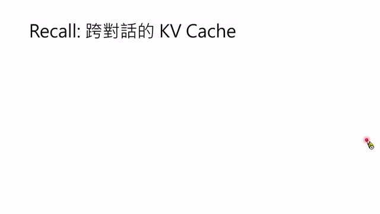

多模態方法比較正常影像或音訊與移除、遮蔽、靜音後的輸出，減去不依賴感知輸入的語言先驗，促使答案真正 grounded 在視覺或聲音證據上。 本段重點：重點是，它用到的一個非常重要的概念 就是我們之前有講過的 對話的 KV Cache 還記得我們在講 KV Cache 的時候 我們有說假設今天有一個句子 是大家好我是大金 模型已經跑過這個句子 它就可以把每一個位置的 這個 K 跟 V 把它存起來 下一次模型再要處理一個非常像的句子 比如說大家好我是小金的時候 大家好我是這前面五個 token 是可以直接從另外一個句子 它的 KV 直接 copy 過來的 就不需要再做額外的運算 但是要記得只有 prefix 一樣 也就是只有句…

### Slide 29 — Visual／Audio-Aware Decoding（續） ([Video](https://www.youtube.com/watch?v=m3i2mk5hs8U&t=2058s))

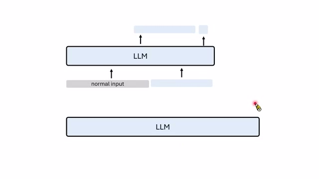

多模態方法比較正常影像或音訊與移除、遮蔽、靜音後的輸出，減去不依賴感知輸入的語言先驗，促使答案真正 grounded 在視覺或聲音證據上。 本段重點：它的做法是這個樣子的 他們說怎麼得到錯誤的答案呢 過去有很多不同的做法 比如說把前面的輸入搞爛 但他說這種方法 會導致你沒有辦法利用 KV Cache 所以如果你要利用 KV Cache 你的搞亂模型的方式 只能夠加在最後面 他們怎麼得到錯誤的答案 它把原來模型 decode 到這邊 已經產生出來的結果 正常的輸入 加藍色這一塊 token 丟到模型裡面 在最後再直接加兩個 token 也不要多加 多加就要花太多額外的運算了 這個兩個 token 它發現輸入 Output E…

## 六、Decoding 係數與負提示搜尋

### Slide 30 — 負成分減多少、用哪個負提示？ ([Video](https://www.youtube.com/watch?v=m3i2mk5hs8U&t=2142s))

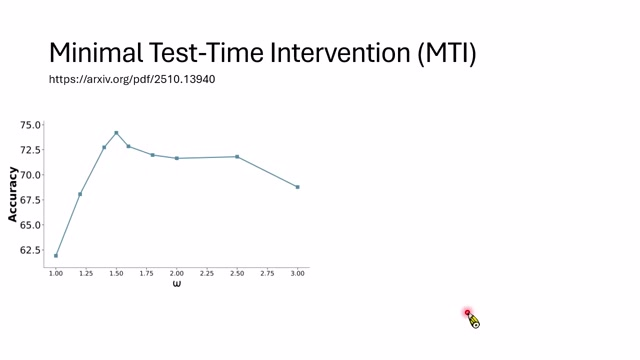

對比係數過小無效，過大也會破壞輸出。實驗顯示合適係數能顯著提升正確率，且通用 Output Error 不一定是最佳降智提示；可搜尋更適合任務的負條件。 本段重點：至少在 performance 上看起來 它有一個這個參數叫做 omega 這 omega 可以對應到 之前投影片的 alpha 但是又有點不一樣 麼就不細講 它有什麼不一樣 如果你有興趣 帶自己去讀這篇論文 總之 omega 等於 1 代表沒有做 Contrastive Decoding 也就是模型正常的輸出 正確率只有 62 omega 設得越大 就代表說 我們減掉越多 Contrastive Decoding 的成分 減掉越多壞的成分 但壞的成分減掉太多 最終還是會壞掉…

### Slide 31 — 負成分減多少、用哪個負提示？（續） ([Video](https://www.youtube.com/watch?v=m3i2mk5hs8U&t=2196s))

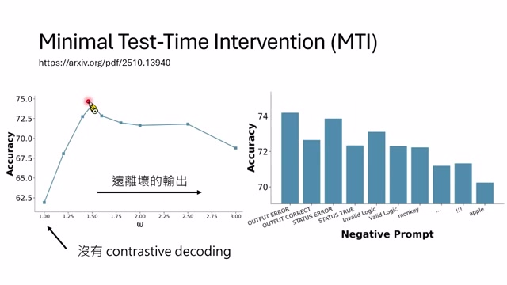

對比係數過小無效，過大也會破壞輸出。實驗顯示合適係數能顯著提升正確率，且通用 Output Error 不一定是最佳降智提示；可搜尋更適合任務的負條件。 本段重點：這篇文章也做了測試 他發現如果降智咒語是用 Output Error 可以得到不錯的結果 如果你把 Output Error 改成 Output Correct 就會差一點 因為模型不該找正確的結果 我們就是要拿到錯誤的結果 他說用 Status Error 結果也不錯 如果改成 Status True 就差一點 如果你改成 Invalid Logic 也會有一定程度的效果 改成 Valid Logic 又差一點 他說那如果你加一些怪怪的字 什麼 Monkey 啊 三個點啊 …

### Slide 32 — 負成分減多少、用哪個負提示？（續） ([Video](https://www.youtube.com/watch?v=m3i2mk5hs8U&t=2238s))

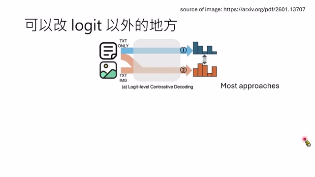

對比係數過小無效，過大也會破壞輸出。實驗顯示合適係數能顯著提升正確率，且通用 Output Error 不一定是最佳降智提示；可搜尋更適合任務的負條件。 本段重點：到目前為止我們講 contrastive decoding 的時候 些方法都是直接改在 output 的機率分佈上 或者是改在最後一層輸出的 logits 上面 也有其他論文嘗試改在其他的地方

### Slide 33 — 負成分減多少、用哪個負提示？（續） ([Video](https://www.youtube.com/watch?v=m3i2mk5hs8U&t=2256s))

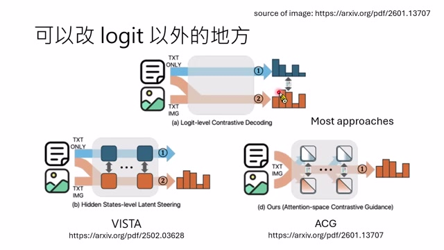

對比係數過小無效，過大也會破壞輸出。實驗顯示合適係數能顯著提升正確率，且通用 Output Error 不一定是最佳降智提示；可搜尋更適合任務的負條件。 本段重點：會發現這都是有一些是比較新的論文 比如說這個是出自一篇今年 1 月的文章 它裡面就是有比較了改在不同位置的做法 裡面就有提到說 像過去有一個叫 VISTA 的做法 它就不是改在 output 的 logits 上面 它是改在 latent 的 representation 上面 這一篇 paper 呢 叫做 ACG 它主要提出來的是想要說 改在 attention 上才是最有效的 所以它就是用有影像 也有文字的情況去得到一個 attention 去減掉只有文字 沒有影像的時候…

### Slide 34 — 負成分減多少、用哪個負提示？（續） ([Video](https://www.youtube.com/watch?v=m3i2mk5hs8U&t=2316s))

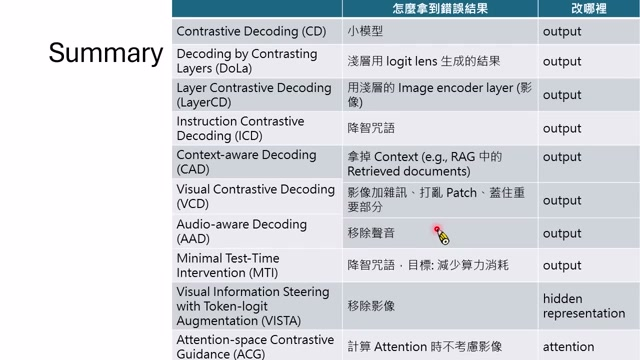

對比係數過小無效，過大也會破壞輸出。實驗顯示合適係數能顯著提升正確率，且通用 Output Error 不一定是最佳降智提示；可搜尋更適合任務的負條件。 本段重點：總結了各式各樣 contrastive decoding 的招數 有兩個需要考慮的 factor 第一個就是怎麼拿到錯誤的答案 另外一個就是要改在哪裡 我剛才說多數論文 都是直接改在最終的輸出上面 但也有一些 paper 嘗試改在 hidden representation 或者是 attention 的 weight 上面 至於怎麼拿到錯誤的結果 有各式各樣的想法 最早的 contrastive decoding 它就說小模型輸出的就是錯的 DoLa 是說淺層用 later…

### Slide 35 — 負成分減多少、用哪個負提示？（續） ([Video](https://www.youtube.com/watch?v=m3i2mk5hs8U&t=2415s))

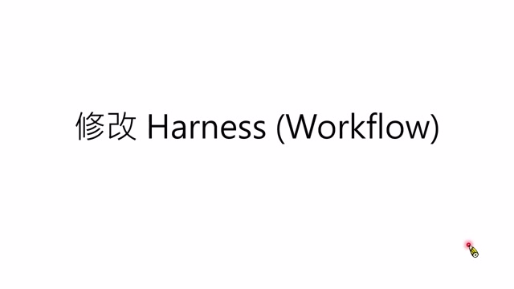

對比係數過小無效，過大也會破壞輸出。實驗顯示合適係數能顯著提升正確率，且通用 Output Error 不一定是最佳降智提示；可搜尋更適合任務的負條件。 本段重點：我們進入今天課程的第二部分 我們來講修改 workflow 這邊修改 workflow 是什麼意思呢 啊這種修改 workflow

### Slide 36 — 負成分減多少、用哪個負提示？（續） ([Video](https://www.youtube.com/watch?v=m3i2mk5hs8U&t=2424s))

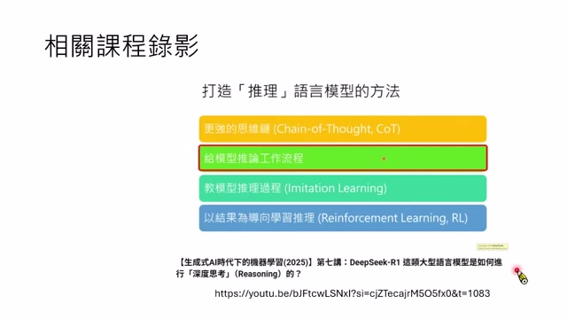

對比係數過小無效，過大也會破壞輸出。實驗顯示合適係數能顯著提升正確率，且通用 Output Error 不一定是最佳降智提示；可搜尋更適合任務的負條件。 本段重點：重點是，讓模型可以做得更好的概念 過去也已經講了很多了 在去年同樣課程的第七講的第二部分 就已經非常詳盡的改說 有什麼樣 workflow 的變形 可以讓模型 reasoning 可以做得更好 所以這邊我們就不再重複

## 七、Generation–Verification Workflow

### Slide 37 — 自動插入反思與驗證 ([Video](https://www.youtube.com/watch?v=m3i2mk5hs8U&t=2442s))

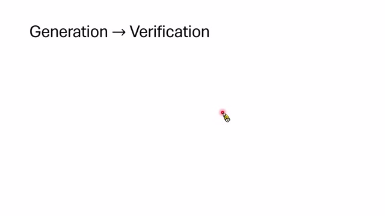

Workflow 在第一次答案後自動插入通用反思指令，再讓模型檢查和修正，无需人類逐題介入。它提供額外 test-time compute，但會讓正確答案也被迫重想並可能改壞。 本段重點：各式各樣的 workflow 的變形 如果你有興趣 再去看去年上課的錄影 我們就只講它最基本的概念 也就是 Generation 加 Verification 事實上上次在講 Harness 的時候 也講到說 現在有一個非常常用的 workflow 就是 Generation 後面接 Verification 什麼是 Generation 後面接 Verification 呢 就是模型得到一個答案之後 你給它一個指令 這個指令是要求模型 要去作反思的 講到這邊你可能會想說 要…

### Slide 38 — 自動插入反思與驗證（續） ([Video](https://www.youtube.com/watch?v=m3i2mk5hs8U&t=2742s))

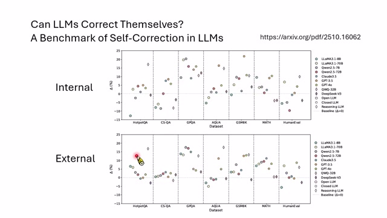

Workflow 在第一次答案後自動插入通用反思指令，再讓模型檢查和修正，无需人類逐題介入。它提供額外 test-time compute，但會讓正確答案也被迫重想並可能改壞。 本段重點：實驗上實證的結果 這是一篇去年十月的論文 這篇論文就想說 有的人說自我反思有用 有的人說自我反思沒有用 我們來做大規模的實驗 看看自我反思到底有沒有用 所以他們就找來了 一大堆各式各樣的模型 測在一大堆各式各樣的 benchmark 上 我們先看圖片的上半部 上半部 internal 的意思代表 是模型自我反思 沒有額外人力的介入 它還試了很多種不同的反思方法 就反思有很多不同的類型 比如叫模型再想一想 我跟模型說你錯了給我改一下 這也是不同的反思的方法 所以它試了好幾個不同…

## 八、自我反思的實證限制

### Slide 39 — 強模型反覆反思通常只小幅改善 ([Video](https://www.youtube.com/watch?v=m3i2mk5hs8U&t=2862s))

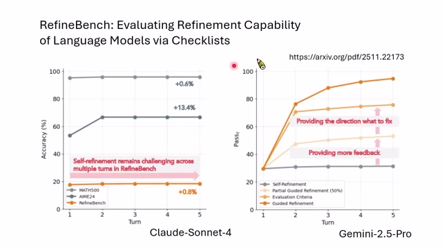

RefineBench 等大規模研究發現，強模型單靠「再想想」的多輪 self-refinement 增益有限；若加入外部 critique、工具結果或正確性訊號，改善才更明顯。 本段重點：另外一篇一個月後的論文呢 也支持這樣子的想法 以下這兩張圖 就是從 RefineBench 這篇 paper 裡面 引用出來的 他們也是想要做一些 比較大規模的實驗 來看看模型的自我反思 到底能夠做到什麼樣的地步 那在這篇 paper 裡面呢 左邊這個圖呢 是用了 Claude 3.5 Sonnet 一個比較強的模型 就反思了從第一輪到第五輪 在這篇論文 縱軸呢是正確率 這邊三條線呢 是跑在三個不同的資料集上面 他們就發現說 對 Claude 3.5 Sonnet 這種已經很…

### Slide 40 — 強模型反覆反思通常只小幅改善（續） ([Video](https://www.youtube.com/watch?v=m3i2mk5hs8U&t=2997s))

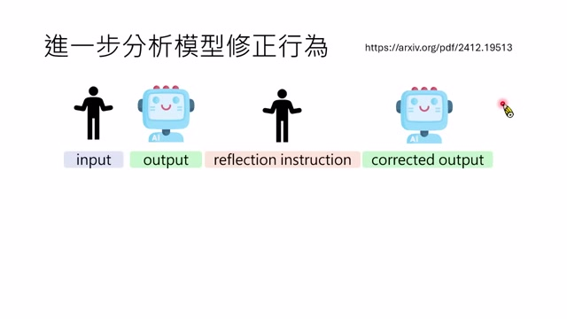

RefineBench 等大規模研究發現，強模型單靠「再想想」的多輪 self-refinement 增益有限；若加入外部 critique、工具結果或正確性訊號，改善才更明顯。 本段重點：有一篇論文呢去仔細分析了這一些模型在自我修正的時候 它的行為在自我修正的時候呢有四個狀況 第一個狀況是修正之前是錯的修正之後是對的 這個是我們最樂見的狀況 有另外一種狀況是修正之前本來就是對的 對的在修正以後還是對的 這個是不過不是單純耗費算力而已 有的狀況是修正前是錯的 修正後也是錯的 反正也沒什麼損失 也是耗費算力而已 最糟的狀況是修正前是對的 修正之後想多了 反而改錯了 這個是我們最不樂見的狀況 就想要知道說 當這些模型 你要求它作自我修正的時候 到底每一種狀況 它出現…

### Slide 41 — 強模型反覆反思通常只小幅改善（續） ([Video](https://www.youtube.com/watch?v=m3i2mk5hs8U&t=3048s))

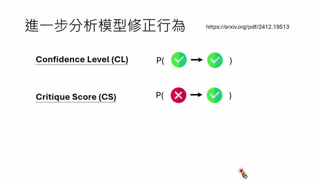

RefineBench 等大規模研究發現，強模型單靠「再想想」的多輪 self-refinement 增益有限；若加入外部 critique、工具結果或正確性訊號，改善才更明顯。 本段重點：在這篇論文裡面 它定義了兩個數值 一個數值叫做 confidence level confidence level 的意思是 修正前是對的 修正後也是對的的機率 這 confidence level 代表模型的信心程度 它對自己的答案有多有信心 如果它非常有信心 它就不會去改答案 修正前是對的 修正後也是對的 它定義了另外一個分數 叫做 critic score 的模型 有多能接受批評 如果今天這個 critic score 就是修正前是錯的 修正後是對的 就代表模型 這個接…

### Slide 42 — 強模型反覆反思通常只小幅改善（續） ([Video](https://www.youtube.com/watch?v=m3i2mk5hs8U&t=3129s))

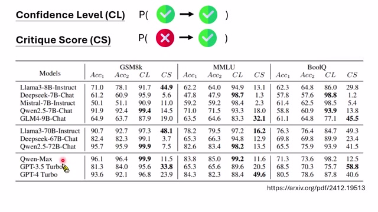

RefineBench 等大規模研究發現，強模型單靠「再想想」的多輪 self-refinement 增益有限；若加入外部 critique、工具結果或正確性訊號，改善才更明顯。 本段重點：在三個不同任務上 它們的修正前正確率 修正後正確率 CL 就是它的 confidence level 還有 CS 它的 critic score 結果如何呢 結果它發現說 整體而言 多數模型都有比較高的 confidence level 也就是模型 通常對自己的答案蠻有信心的 它沒有那麼常 把正確的答案 因為想太多就改錯了 正確的答案它再想一想 覺得應該還是對 critic score 呢 有很多模型都非常的低 意思就是說 對很多模型而言 它是比較固執的 它很少把錯的答案改對…

### Slide 43 — 強模型反覆反思通常只小幅改善（續） ([Video](https://www.youtube.com/watch?v=m3i2mk5hs8U&t=3237s))

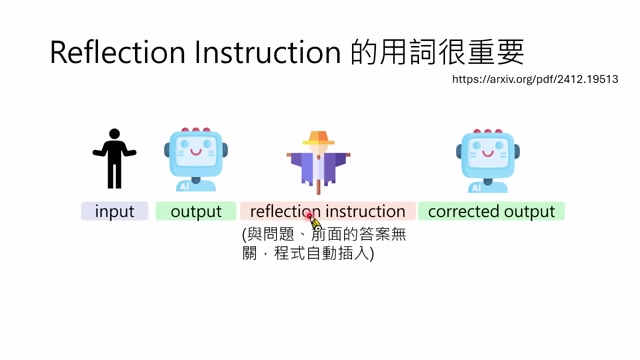

RefineBench 等大規模研究發現，強模型單靠「再想想」的多輪 self-refinement 增益有限；若加入外部 critique、工具結果或正確性訊號，改善才更明顯。 本段重點：我們說我們要叫模型 做自我反思 你得插入一個句子 比如說請檢查自己的答案 在這篇論文裡面呢 它分析了插入的這句話 會怎麼影響模型的行為 他們發現說 你在這邊插入的 這一個簡短的指令 可能對模型 到底是一個固執的模型 還是容易接受批評的模型 對它的行為 是會有影響的

### Slide 44 — 強模型反覆反思通常只小幅改善（續） ([Video](https://www.youtube.com/watch?v=m3i2mk5hs8U&t=3261s))

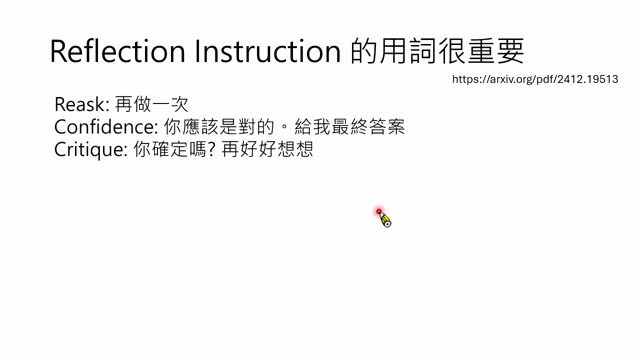

RefineBench 等大規模研究發現，強模型單靠「再想想」的多輪 self-refinement 增益有限；若加入外部 critique、工具結果或正確性訊號，改善才更明顯。 本段重點：所以它這邊 就嘗試了三個不同的指令 第一個是中性的指令 就是叫模型再做一次 它原來論文裡面是英文的 或者把它翻成中文而已 第二個是 confidence 就是鼓勵模型說 你應該是對的 只是再給我一次答案 第三個就是 question it 就告訴它你確定嗎 你最好再給我想一想 就暗示它說你的答案 應該是錯

## 九、反思提示如何改變信心

### Slide 45 — 肯定使模型固執，質疑提高修改率 ([Video](https://www.youtube.com/watch?v=m3i2mk5hs8U&t=3282s))

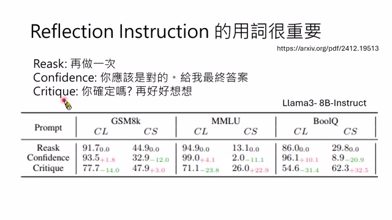

即使提示由程式自動插入，肯定原答案會提高 confidence、降低改答案機率；質疑則降低信心、提高 critic score。所謂自我反思可能部分只是被提示誘導，而非真正偵測錯誤。 本段重點：它就在 Llama 3 上面 在三個不同的 corpus 上面 試了這三個不同的指令 你可以想像說 假設叫模型再做一次 中性的指令 是模型原來會有的行為 如果你今天 肯定模型原來的答案 這個時候你就會發現 當你肯定模型原來的答案的時候 它的 confidence level 上升了 它就比較有信心 它就比較不會改答案 這個時候 它也變得比較固執 它也比較不會去修改 錯誤的答案 在三個不同的 corpus 上 都有類似的現象 所以如果你肯定模型是對的 它就有信心了 變得比較固執…

### Slide 46 — 肯定使模型固執，質疑提高修改率（續） ([Video](https://www.youtube.com/watch?v=m3i2mk5hs8U&t=3381s))

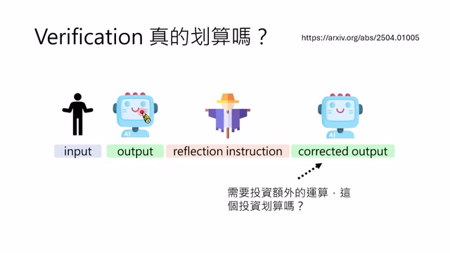

即使提示由程式自動插入，肯定原答案會提高 confidence、降低改答案機率；質疑則降低信心、提高 critic score。所謂自我反思可能部分只是被提示誘導，而非真正偵測錯誤。 本段重點：重點是，但接下來要問的另外一個問題是 反思這件事情需要耗費額外的算力 而這個額外算力的投資到底划不划算呢 我們當然可以投資額外的算力 讓模型做反思 讓它修改原來的答案 但是這個算力有沒有可能有更划算的投資呢 這個算力可以投資在什麼地方呢

### Slide 47 — 肯定使模型固執，質疑提高修改率（續） ([Video](https://www.youtube.com/watch?v=m3i2mk5hs8U&t=3405s))

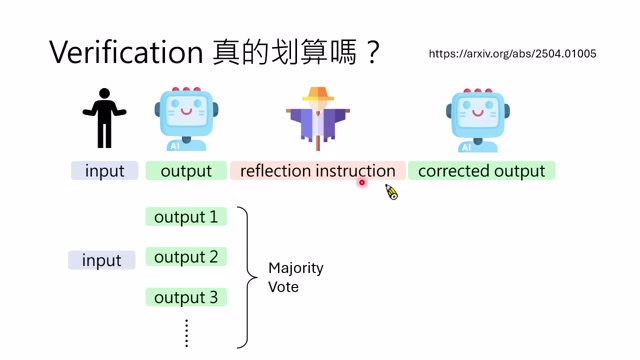

即使提示由程式自動插入，肯定原答案會提高 confidence、降低改答案機率；質疑則降低信心、提高 critic score。所謂自我反思可能部分只是被提示誘導，而非真正偵測錯誤。 本段重點：與其要模型根據之前的答案再反思 會不會讓它直接產生新的答案 也許還是更有效率的 與其花額外的算力 讓模型把舊的答案拿去修改 會不會讓它直接多 sample 幾次 產生各種不同的答案 再投票做 majority vote 看看能不能得到最好的結果 假設反思跟這種產生多個答案 一口氣產生多個答案 再做 majority vote 這兩個方法使用一樣的算力 到底哪一個比較好呢 所以大家在自己做這種 跟 verification 有關的實驗的時候 你要注意 通常論文都會告訴你 加上 …

### Slide 48 — 肯定使模型固執，質疑提高修改率（續） ([Video](https://www.youtube.com/watch?v=m3i2mk5hs8U&t=3459s))

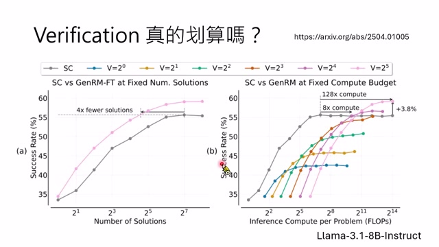

即使提示由程式自動插入，肯定原答案會提高 confidence、降低改答案機率；質疑則降低信心、提高 critic score。所謂自我反思可能部分只是被提示誘導，而非真正偵測錯誤。 本段重點：所以就有一篇論文做了這個嘗試 我們先看左邊這張圖 左邊這張圖灰色這條線 代表的是 majority vote 就沒有做 reflection 沒有做 verification 在這張圖裡面的縱軸 代表的是分數 當然越高越好 橫軸代表的是 sample 的次數 從 2 次一直 sample 到 2 的 7 次方次 sample 次數越多 這種 majority vote 的方法 當然結果會越來越好 它說 我們來加上反思 這個反思呢 是要反思 2 的 5 次方次 這很多要反思 3…

## 十、從 Workflow 到 Reasoning

### Slide 49 — 讓模型自己決定何時繼續思考 ([Video](https://www.youtube.com/watch?v=m3i2mk5hs8U&t=3699s))

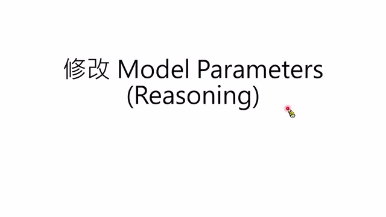

Workflow 固定插入額外指令，不論答案對錯都增加 token。Reasoning model 期待把行為內化：需要時自行修正，不需要時停止，降低固定流程的浪費並提高適應性。 本段重點：第三部分呢 我們想要講的是讓模型直接修改參數 也就是做 reasoning

### Slide 50 — 讓模型自己決定何時繼續思考（續） ([Video](https://www.youtube.com/watch?v=m3i2mk5hs8U&t=3708s))

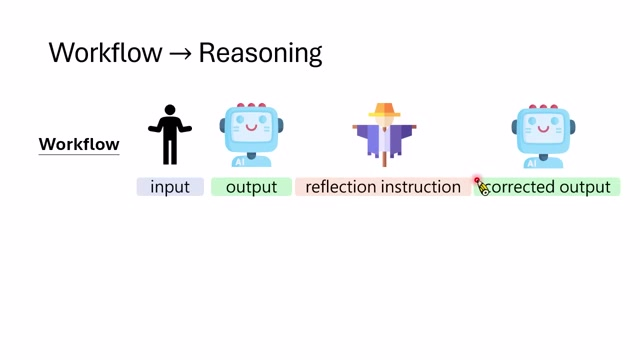

Workflow 固定插入額外指令，不論答案對錯都增加 token。Reasoning model 期待把行為內化：需要時自行修正，不需要時停止，降低固定流程的浪費並提高適應性。 本段重點：在剛才前一步裡面 我們說 workflow 它需要插入一個額外的指令 從 workflow 到 reasoning 它的差別就是 能不能夠直接把這個額外插入的指令拿掉 讓模型自己 生出答案之後 如果需要修改 它就自己一定會修改 它就自己知道 它要修改 雖然 workflow 跟 reasoning 它都是自動的 都不需要 真的人工的介入 但是 reasoning 還是有好處的 對 workflow 來說 因為每次你都會 硬插一個 額外的指令進去 就是逼模型說 不管它答案對 還…

### Slide 51 — 讓模型自己決定何時繼續思考（續） ([Video](https://www.youtube.com/watch?v=m3i2mk5hs8U&t=3798s))

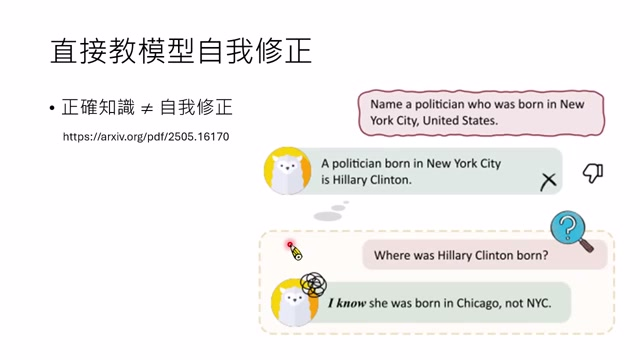

Workflow 固定插入額外指令，不論答案對錯都增加 token。Reasoning model 期待把行為內化：需要時自行修正，不需要時停止，降低固定流程的浪費並提高適應性。 本段重點：否定了這樣的想法 這篇論文發現說 正確的知識 並不等同於能夠自我修正 你可以去看看這篇論文裡面的數據 在它的第一頁就舉一個例子 它說假設你問模型 問一個語言模型說 告訴我一個出生在紐約的政治家 模型舉了希拉蕊 你可能會想說 模型舉希拉蕊 是不是因為它不知道 希拉蕊在哪裡出生的 你問同一個模型 希拉蕊在哪裡出生的時候 它會知道希拉蕊是在芝加哥出生 不是在紐約出生 最奇怪的地方就是 它明明有這個正確的知識 但是當它回答出錯誤的答案的時候 它竟然沒有驚覺 我的答案是錯的 而去修正自…

### Slide 52 — 讓模型自己決定何時繼續思考（續） ([Video](https://www.youtube.com/watch?v=m3i2mk5hs8U&t=3885s))

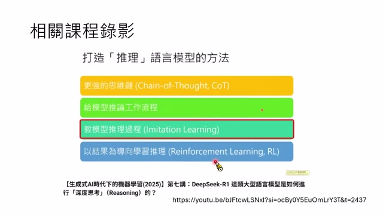

Workflow 固定插入額外指令，不論答案對錯都增加 token。Reasoning model 期待把行為內化：需要時自行修正，不需要時停止，降低固定流程的浪費並提高適應性。 本段重點：就是一些訓練模型 讓它具有自我修正能力的方法 這邊就是 對應到過去第 7 講的 第三部分跟第四部分 可以想成是過去第 7 講的 第三部分跟第四部分的延伸 你如果還沒有看過 這部分的錄影的話 你可以之後再回去看 這部分的錄影 再聽今天的課程 你可能會有更多的收穫 那我們先講

### Slide 53 — 讓模型自己決定何時繼續思考（續） ([Video](https://www.youtube.com/watch?v=m3i2mk5hs8U&t=3912s))

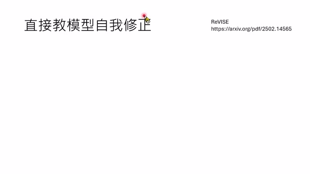

Workflow 固定插入額外指令，不論答案對錯都增加 token。Reasoning model 期待把行為內化：需要時自行修正，不需要時停止，降低固定流程的浪費並提高適應性。 本段重點：怎麼直接教模型做自我修正 這邊引用的是一篇 叫做 REVISE 這篇 paper 他們發現說自我修正呢 可以分成兩部分 第一個是你得先發現有錯 先做錯誤偵測 接下來才能夠做錯誤修正 所以這兩件事情要分開來學 他們發現這兩件事情 合在一起學比較難學 分開來學效果比較好 所以它怎麼分開來學呢 它說第一步先教錯誤偵測 怎麼教錯誤偵測呢 你就要收集模型 在不同輸入的時候的答案 有時候模型會答錯 有時候模型會答對 就教模型說 看到這個錯誤的答案 你要輸出一個叫做 Refine Toke…

### Slide 54 — 讓模型自己決定何時繼續思考（續） ([Video](https://www.youtube.com/watch?v=m3i2mk5hs8U&t=3993s))

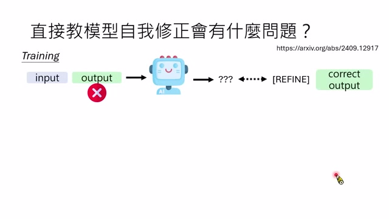

Workflow 固定插入額外指令，不論答案對錯都增加 token。Reasoning model 期待把行為內化：需要時自行修正，不需要時停止，降低固定流程的浪費並提高適應性。 本段重點：是會有一些問題的 現在人們開始知道說 直接教模型自我修正 可能是有一些極限 什麼樣的極限呢 這個有一篇 24 年的論文 就已經指出了這樣的問題 這篇論文裡面還講了很多其他的事情 這是他們的其中一個發現 他們發現是這樣子的 如果你教模型 能夠做修正這件事情 你現在教模型 能夠看到自己錯誤的輸出 它就可以輸出 Refine Token 甚至最後 再接一個正確的答案 模型學會這件事以後 它是不是參數就變了 因為 fine-tune 的模型 所以它參數就變了 它參數變了以後 它就不再…

## 十一、用 RL 訓練 Reasoning

### Slide 55 — Reinforcement Learning with Verifiable Rewards ([Video](https://www.youtube.com/watch?v=m3i2mk5hs8U&t=4086s))

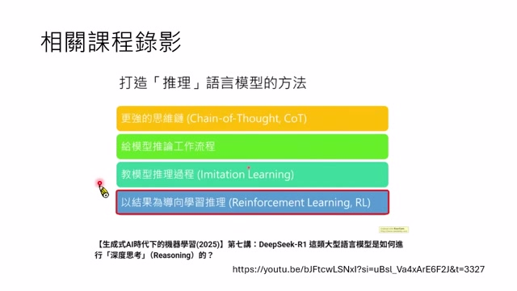

數學和程式任務可自動驗證答案，適合以最終正確性給 reward。RL 不指定中間 token，只獎勵最後結果，模型可能自行發展長推理、檢查和回溯策略；但也可能利用 verifier 漏洞。 本段重點：就是直接做 reinforcement learning 這就對應到之前講的 第 7 講的最後一段 reinforcement learning

### Slide 56 — Reinforcement Learning with Verifiable Rewards（續） ([Video](https://www.youtube.com/watch?v=m3i2mk5hs8U&t=4095s))

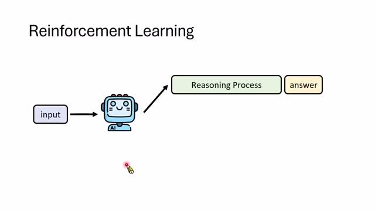

數學和程式任務可自動驗證答案，適合以最終正確性給 reward。RL 不指定中間 token，只獎勵最後結果，模型可能自行發展長推理、檢查和回溯策略；但也可能利用 verifier 漏洞。 本段重點：它的概念非常的直覺 反正就是給模型一個輸入 接下來呢 它就開始做 reasoning 開始輸出一長串的 token 要輸出什麼 不重要 它自己想 最後反正只要答案是對的就好了 如果最後答案是對的 就得到 positive reward 最後答案如果是錯的 就得到 negative reward 像這種 像這種用 reinforcement learning 來教模型做 reasoning 的 這樣子的概念 比較常用在數學或程式題上 因為數學或程式 你是可以有非常明確的方法 驗…

### Slide 57 — Reinforcement Learning with Verifiable Rewards（續） ([Video](https://www.youtube.com/watch?v=m3i2mk5hs8U&t=4173s))

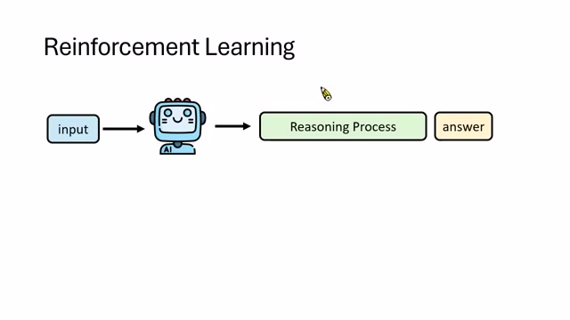

數學和程式任務可自動驗證答案，適合以最終正確性給 reward。RL 不指定中間 token，只獎勵最後結果，模型可能自行發展長推理、檢查和回溯策略；但也可能利用 verifier 漏洞。 本段重點：以後再產生正確答案 模型似乎蠻自然的 就產生了 verification 它就蠻自然的產生 可以自己偵測錯誤 再自己修改錯誤的行為 模型往往會自己先提第一個答案 再回頭看看說 我這個答案對嗎 發現有錯 我再去修改自己的答案 看起來這整個 reasoning 的過程 有機會讓模型學到 自我修正這件事情

### Slide 58 — Reinforcement Learning with Verifiable Rewards（續） ([Video](https://www.youtube.com/watch?v=m3i2mk5hs8U&t=4200s))

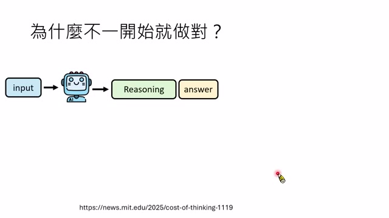

數學和程式任務可自動驗證答案，適合以最終正確性給 reward。RL 不指定中間 token，只獎勵最後結果，模型可能自行發展長推理、檢查和回溯策略；但也可能利用 verifier 漏洞。 本段重點：講到這邊 你可能會想說 為什麼模型做 reinforcement learning 的時候 還要學自我修正呢 為什麼不一口氣就直接答對呢 為什麼要先錯 才答對呢 這個你就想想看 對人類來說 很多時候人類 往往也是先犯錯才答對的 在學校這十幾年來 我的發現就是 往往學生都會犯 非常類似的錯誤 就是學長回去 會去斥責學弟 你怎麼在實驗的時候 會犯這種錯誤 在隔年 個學弟變成學長 會再去斥責另外一個學弟 你怎麼會犯一樣的錯誤 都忘了去年 他也是被斥責的 一個人 所以我發現說 有一些…

### Slide 59 — Reinforcement Learning with Verifiable Rewards（續） ([Video](https://www.youtube.com/watch?v=m3i2mk5hs8U&t=4305s))

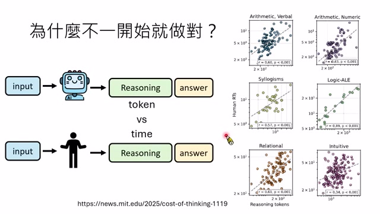

數學和程式任務可自動驗證答案，適合以最終正確性給 reward。RL 不指定中間 token，只獎勵最後結果，模型可能自行發展長推理、檢查和回溯策略；但也可能利用 verifier 漏洞。 本段重點：右邊呢就是這篇論文的截圖 這個心理學的論文 縱軸呢 每一張小圖代表不同的任務 縱軸是人類解題的時間 橫軸是語言模型 在解題的時候 reasoning 的 token 在有一些任務上 但也不是所有的任務 兩者呈現某種程度 正比的關係 也許這就告訴我們說 不管是碳基生物 還是矽基生物 思考本身就是需要有一些代價 你就是很難一次就答對 但如果你要批評這篇論文的話 我的批評可能會是 一個是 token 一個是時間 這兩者之間能夠對比嗎 這兩個是可以拿來做比較的嗎 也許對人類來說 對應…

### Slide 60 — Reinforcement Learning with Verifiable Rewards（續） ([Video](https://www.youtube.com/watch?v=m3i2mk5hs8U&t=4368s))

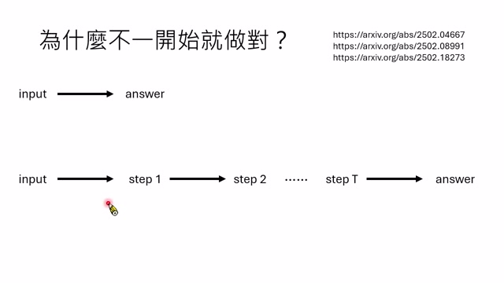

數學和程式任務可自動驗證答案，適合以最終正確性給 reward。RL 不指定中間 token，只獎勵最後結果，模型可能自行發展長推理、檢查和回溯策略；但也可能利用 verifier 漏洞。 本段重點：這邊再從另外一個角度解釋 為什麼我們需要 reasoning 在 25 年初的時候 時候 reasoning 剛剛流行 所以在 25 年的 2 月 有一系列的論文 它們都試圖去解釋 為什麼 reasoning 會有用 我這邊就引用了三篇 想法非常類似的文章 它們的想法是這個樣子的 我們當然可以要求模型一次就做對 我們可以要求模型看到輸入 立刻給我答案 我們也可以要求模型做 reasoning 看到輸入經過大 T 個 step 把這個解題的過程 分成 T 個步驟 最後再得到答案…

## 十二、Reasoning 如何改善泛化

### Slide 61 — Parity 範例：學演算法而非死背 ([Video](https://www.youtube.com/watch?v=m3i2mk5hs8U&t=4494s))

固定長度 parity 可死背所有輸入；若要求模型產生逐步推理，模型可能學到可延伸到更長序列的計數或狀態更新演算法。Reasoning 的價值在建立可組合程序，而非只增加輸出字數。 本段重點：假設我們現在要做 parity check 如果不知道 parity check 是什麼的話 parity check 的意思是說 給你一串二進位的數字 給你一串 0101 的數字 現在模型要得輸出 是在這一串數字裡面 有奇數個 1 還是偶數個 1 如果是奇數個 1 模型就要輸出 1 如果是偶數個 1 就要輸出 0 像這第三個例子 總共五個 1 是奇數個 1 所以就要輸出 1 假設我們現在的輸入的 sequence 程度 固定就是六個數字 如果固定就是六個數字 輸入跟輸出有多…

### Slide 62 — Parity 範例：學演算法而非死背（續） ([Video](https://www.youtube.com/watch?v=m3i2mk5hs8U&t=4701s))

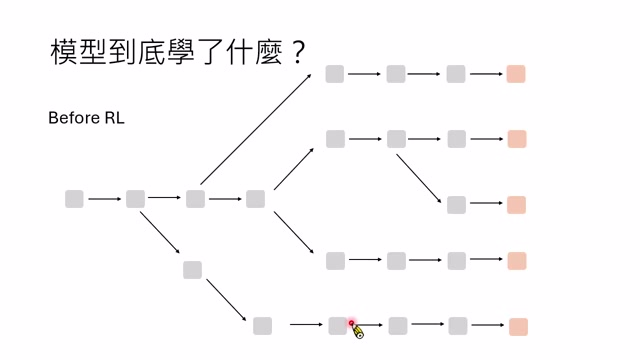

固定長度 parity 可死背所有輸入；若要求模型產生逐步推理，模型可能學到可延伸到更長序列的計數或狀態更新演算法。Reasoning 的價值在建立可組合程序，而非只增加輸出字數。 本段重點：我們剛才說在做完 reasoning 之後 本來不會 reflection 的模型 像就展現會 reflection 像就會自我反思 有一系列的論文就在探討說 當我們用 RL 這種方法 教模型做 reasoning 的時候 它到底學到了什麼 有一派的假設是這個樣子的 模型能夠做 reflection 這件事情 模型能夠做 reasoning 這件事情 早在 RL 之前 它就已經會了 我們這邊用一個樹狀圖 來表示模型在產生答案的時候 它有很多不同的路徑 之所以走不同的路徑 是因…

### Slide 63 — Parity 範例：學演算法而非死背（續） ([Video](https://www.youtube.com/watch?v=m3i2mk5hs8U&t=4791s))

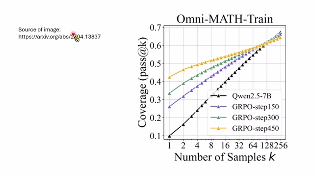

固定長度 parity 可死背所有輸入；若要求模型產生逐步推理，模型可能學到可延伸到更長序列的計數或狀態更新演算法。Reasoning 的價值在建立可組合程序，而非只增加輸出字數。 本段重點：就引用一篇去年 4 月的文章 有類似發現的文章 我只能告訴你滿坑滿谷 我這邊只是引用了一篇 比較早的 citation 比較高的文章而已 這篇文章是這樣講的 它說我們來叫模型解數學問題 這篇文章呢 有做了很多很完整的實驗 我這邊只是截了其中一張圖而已 橫軸呢是 sample 的次數 這 sample 次數什麼意思呢 因為它縱軸算的 不是一般的正確率 它算的是 pass at k 也就是它讓模型去做 同一個問題 K 次 在 K 次裡面 只要一次答對就算對 所以橫軸是模型的 K …

## 十三、Training-Free Reasoning Decoding

### Slide 64 — 更好的 Sampling 能否逼出既有能力？ ([Video](https://www.youtube.com/watch?v=m3i2mk5hs8U&t=4944s))

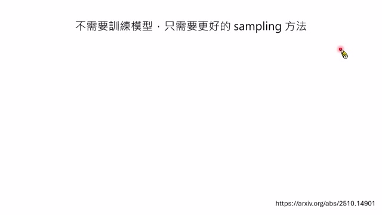

若未經 RL 的模型偶爾已能 sample 到正確推理，能力可能本來就在分布中。新的 training-free sampling／search 方法可在不更新參數下提高找到好 reasoning path 的機率，有時接近 RL 模型。 本段重點：這個發現的重要性就是 既然本來就可以得到正確答案 你也不需要做 RL 了 因為本來就可以得到正確答案 所以有沒有可能 透過沒有訓練模型的方法 只是更好的 sampling 的方法 就把正確答案 sample 出來 這個就像禪宗頓教裡面講的 既然人人本具佛性 你只要放下一念清靜 就可以直接開悟 就不需要花費長時間的修習 所以這邊概念是一樣的 能不能夠不用 RL 訓練模型 就得到正確答案 後來在去年 10 月的時候

### Slide 65 — 更好的 Sampling 能否逼出既有能力？（續） ([Video](https://www.youtube.com/watch?v=m3i2mk5hs8U&t=4980s))

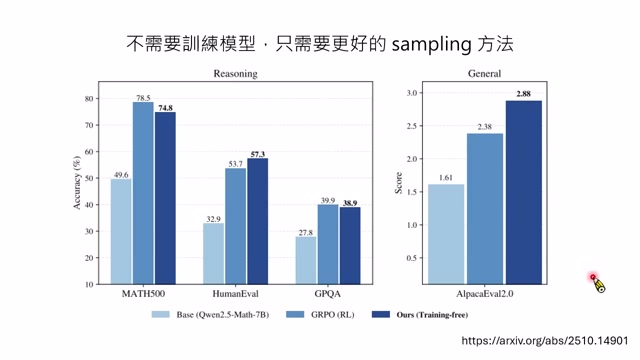

若未經 RL 的模型偶爾已能 sample 到正確推理，能力可能本來就在分布中。新的 training-free sampling／search 方法可在不更新參數下提高找到好 reasoning path 的機率，有時接近 RL 模型。 本段重點：還真的有人提出了一個新的 sampling 的方法 它這個 sampling 的方法是一個比較厲害的方法 它很複雜的細節 我們就不講 大家可以再去研究這篇論文 同時它可以逼出原來模型的 reasoning 的能力 這邊這個圖 最左邊這個 bar 是沒有做 RL 的模型 中間是有做 RL 的模型 右邊是一個 training free 的方法 只是改了 sampling 的演算法 它居然可以讓它的模型 在很多狀況可以逼近 RL 的結果 甚至在某些狀況 還可以超過 RL 的結果 …

### Slide 66 — 更好的 Sampling 能否逼出既有能力？（續） ([Video](https://www.youtube.com/watch?v=m3i2mk5hs8U&t=5025s))

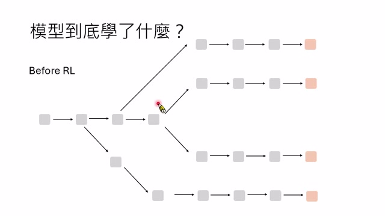

若未經 RL 的模型偶爾已能 sample 到正確推理，能力可能本來就在分布中。新的 training-free sampling／search 方法可在不更新參數下提高找到好 reasoning path 的機率，有時接近 RL 模型。 本段重點：但是還有另外一派的說法 另外一派說法說 RL 真的可以讓模型 學會額外的能力 也就是那一些 RL 的時候才展現出來的 一些 reasoning 的過程 有些是不存在於 模型本來能夠產生的 路徑之中的 在 RL 的過程中 確實學到了 新的推理的技巧 所以它才能夠得到 正確的答案

### Slide 67 — 更好的 Sampling 能否逼出既有能力？（續） ([Video](https://www.youtube.com/watch?v=m3i2mk5hs8U&t=5052s))

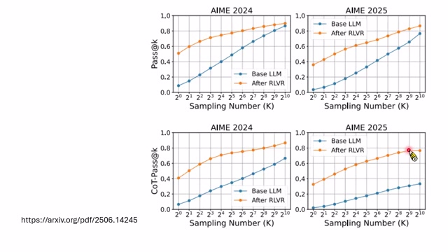

若未經 RL 的模型偶爾已能 sample 到正確推理，能力可能本來就在分布中。新的 training-free sampling／search 方法可在不更新參數下提高找到好 reasoning path 的機率，有時接近 RL 模型。 本段重點：有什麼樣的證據呢 就引用一篇 去年 6 月的論文 我們先看這張圖的上半部的兩個圖 做在兩個不同的 corpus 上面 上半部這兩個圖是想要復現之前 說 RL 不能夠學到新的思考方式的那些論文的實驗 他說假設我們觀察 pass at k 就在 sample k 次裡面答對的機率 有沒有 RL 在 sample 量大很多的時候 在 sample 量很大的時候 確實有沒有做 reinforcement learning 非常的接近 這邊論文想要提出的想法是說 這個最後答案是對 真的…

### Slide 68 — 更好的 Sampling 能否逼出既有能力？（續） ([Video](https://www.youtube.com/watch?v=m3i2mk5hs8U&t=5166s))

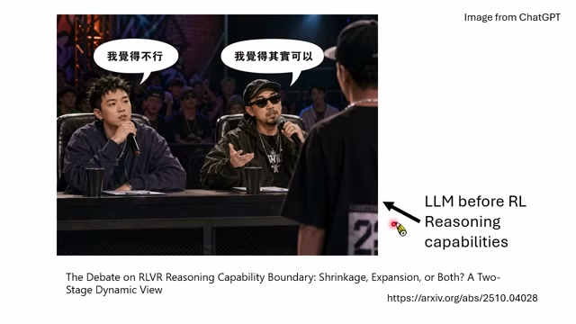

若未經 RL 的模型偶爾已能 sample 到正確推理，能力可能本來就在分布中。新的 training-free sampling／search 方法可在不更新參數下提高找到好 reasoning path 的機率，有時接近 RL 模型。 本段重點：有人覺得 LLM 在沒有 RL 之前 就有 reasoning 的能力 有人覺得在 RL 之前 沒有 reasoning 的能力 有人覺得不行 有人覺得可以 也有人覺得 兩者都有可能 你可以看看下面這篇文章 它的 title 就告訴你說 它想要討論的就是 Debate on RL VR Reasoning Capability Boundary 它想要探討 到底這個爭執是哪裡來的 為什麼有人說 為什麼有人說 RL 前 就可以 reasoning 有人說 RL 後 會學到新的能…

### Slide 69 — 更好的 Sampling 能否逼出既有能力？（續） ([Video](https://www.youtube.com/watch?v=m3i2mk5hs8U&t=5253s))

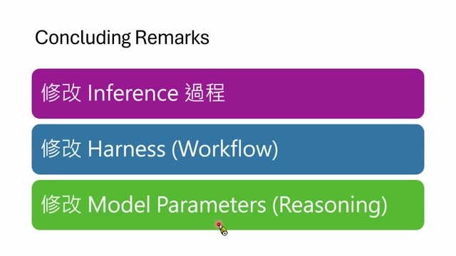

若未經 RL 的模型偶爾已能 sample 到正確推理，能力可能本來就在分布中。新的 training-free sampling／search 方法可在不更新參數下提高找到好 reasoning path 的機率，有時接近 RL 模型。 本段重點：這個就是今天 想要跟大家分享的內容 我們就講了 模型自我修正的可能性 有三個不同的面向

## 核心結論

- Contrastive decoding 以正常與故意破壞條件的差異抑制錯誤成分。
- 固定反思 workflow 可增加 test-time compute，但不保證真正偵測錯誤，還可能改壞正確答案。
- 外部 critique、工具與 verifier 通常比空泛的「再想想」更可靠。
- Reasoning model 將何時思考與修正內化到模型行為，可用 verifiable reward 訓練。
- Training-free search 顯示部分 reasoning 能力可能已存在於原模型分布，只是普通 sampling 不容易找到。

