# （1／2）Flash Attention

- 講者：李宏毅
- 影片：[YouTube](https://www.youtube.com/watch?v=vXb2QYOUzl4)
- 長度：49:39
- 字幕：原始繁體中文字幕

本講從 GPU 記憶體階層出發，逐步推導 Online Softmax 與 FlashAttention，說明它如何在不近似 Attention 的前提下，以分塊融合運算減少 HBM 讀寫。時間資料保存在 `source/transcript.txt` 與 `slides/index.csv`。

## 一、問題與先備知識

### Slide 1 — 加快語言模型的生成速度 ([Video](https://www.youtube.com/watch?v=vXb2QYOUzl4&t=0s))

本講聚焦如何加快已訓練語言模型的生成速度，也就是 inference，而非訓練加速。第一部分以 FlashAttention 為主題，從注意力計算和 GPU 記憶體階層推導其設計。

### Slide 2 — 先備知識與課程範圍 ([Video](https://www.youtube.com/watch?v=vXb2QYOUzl4&t=12s))

課程假設已理解 Transformer、Self-Attention 與語言模型生成流程。若不熟悉，應先補完「一堂課看懂語言模型內部運作」，否則後續 Q、K、V 和 Softmax 推導會缺少基礎。

### Slide 3 — 推論加速方法總覽 ([Video](https://www.youtube.com/watch?v=vXb2QYOUzl4&t=30s))

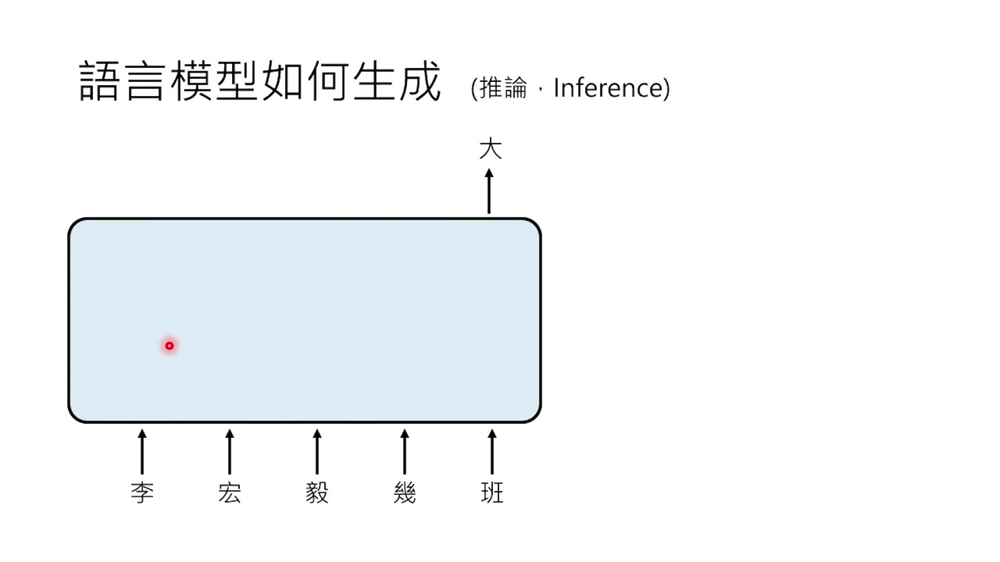

語言模型逐 token 生成，每一步都要執行多層 Transformer。本系列比較 FlashAttention、KV Cache、Multi/Grouped-query Attention、Sliding-window Attention、Streaming LLM、Pruning KV Cache 與 Speculative Decoding；本講只討論推論階段。

### Slide 4 — Self-Attention 計算回顧 ([Video](https://www.youtube.com/watch?v=vXb2QYOUzl4&t=108s))

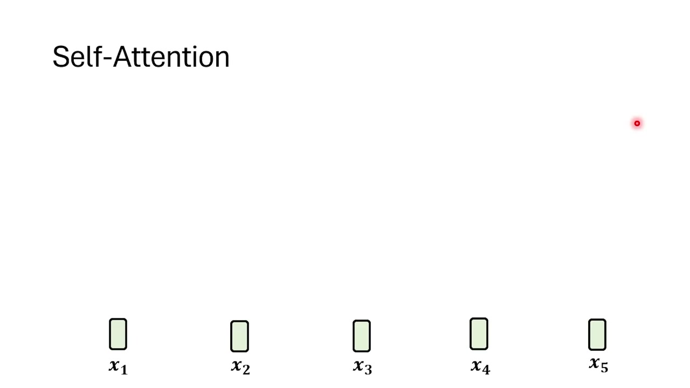

對位置 4 而言，query $q_4$ 與此前 key 做內積得到分數，再經 Softmax 成為注意力權重，最後對 value 做加權和。後續推導省略 $X$ 投影成 Q、K、V 的步驟，直接從 QKV 開始。

### Slide 5 — 加速方法必須問：代價是什麼？ ([Video](https://www.youtube.com/watch?v=vXb2QYOUzl4&t=224s))

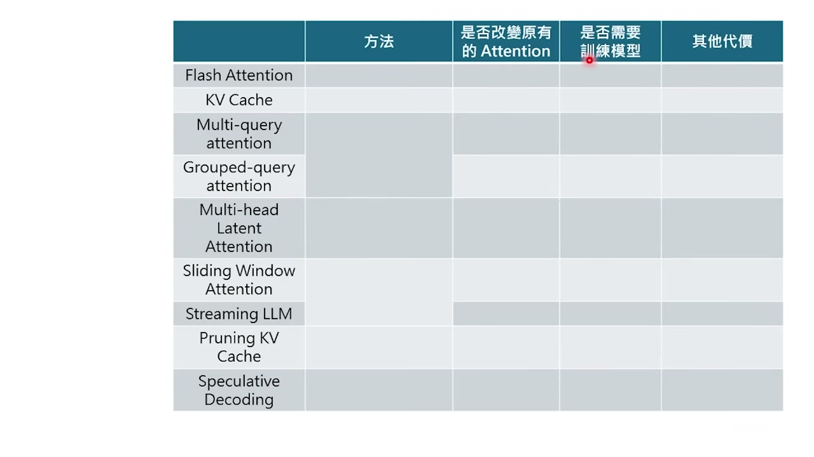

任何加速都應詢問代價：是否近似原 Attention、是否需重新訓練特定模型、是否犧牲其他資源。FlashAttention 的特殊之處是結果精確、可隨插即用，且代價很小。

### Slide 6 — Speculative Decoding 複習資源 ([Video](https://www.youtube.com/watch?v=vXb2QYOUzl4&t=332s))

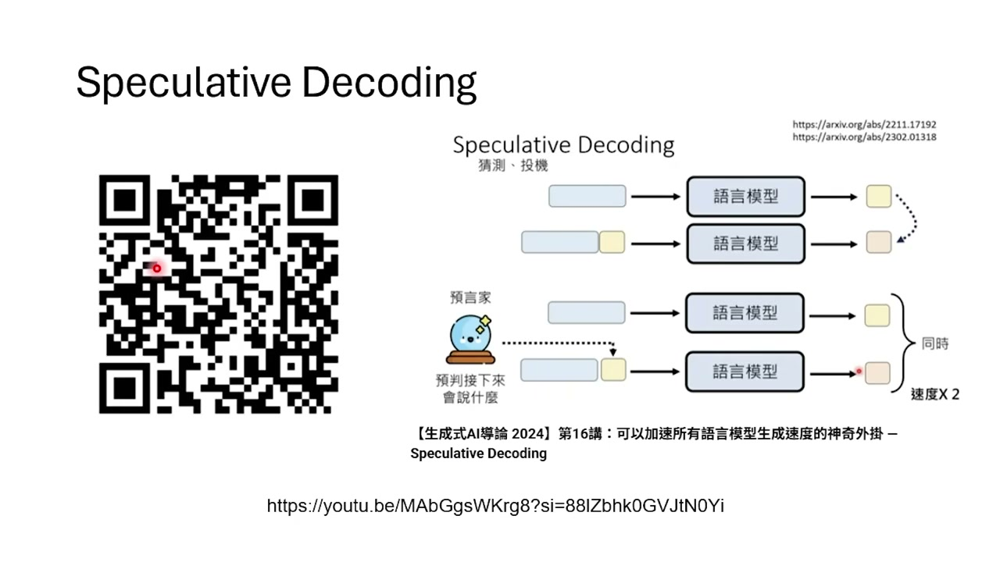

Speculative Decoding 已在 2024 生成式 AI 導論第 16 講與作業中介紹，因此本課不重講，把時間留給 FlashAttention 等新內容。

## 二、FlashAttention 的硬體動機

### Slide 7 — FlashAttention：精確、通用、低代價 ([Video](https://www.youtube.com/watch?v=vXb2QYOUzl4&t=358s))

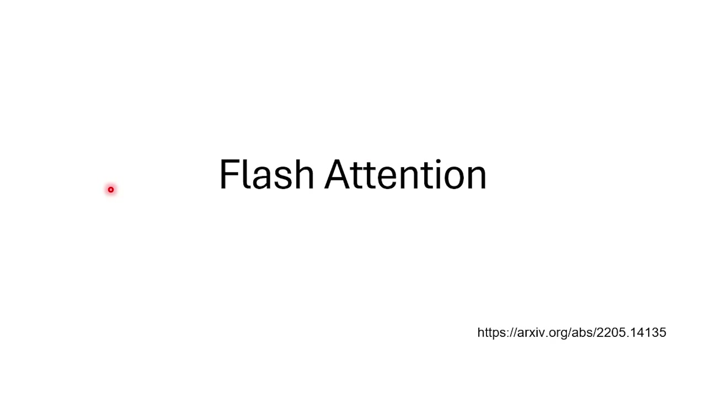

FlashAttention 源於 2022 年論文。它不改變 Attention 的數學結果，不要求模型客製化，能直接套用到使用 Self-Attention 的 Transformer；加速來源是減少昂貴的記憶體搬運。

### Slide 8 — 理解 GPU 運算的底層邏輯 ([Video](https://www.youtube.com/watch?v=vXb2QYOUzl4&t=412s))

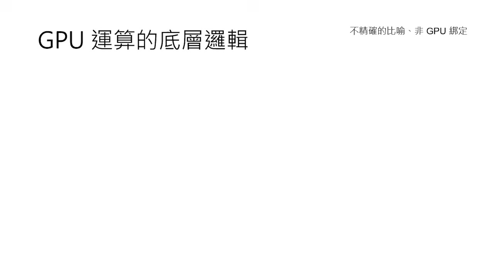

理解 FlashAttention 必須先建立簡化的 GPU 心智模型。這不是完整硬體描述，但抓住了高速運算的共同限制：算術單元很快，遠端記憶體容量大卻搬運慢。

### Slide 9 — Execution Units 很快，但工作台很小 ([Video](https://www.youtube.com/watch?v=vXb2QYOUzl4&t=446s))

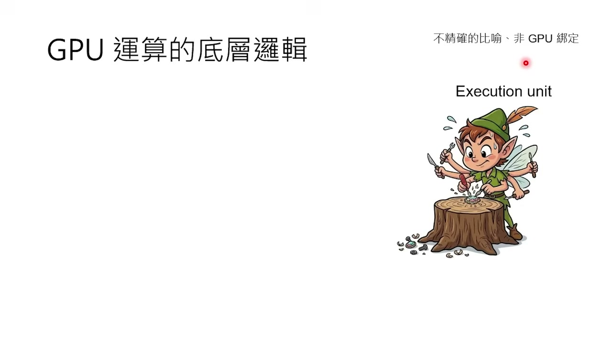

GPU 有大量 Execution Units，可平行高速運算；弱點是靠近運算單元的工作空間很小，無法一次容納長序列的大矩陣。投影片用多分身小精靈表示大量平行單元。

### Slide 10 — SRAM 工作台與 HBM 倉庫 ([Video](https://www.youtube.com/watch?v=vXb2QYOUzl4&t=606s))

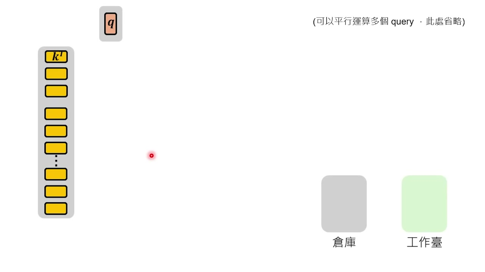

On-chip SRAM 像小而快的工作台，HBM/DRAM 像大而慢的倉庫。真正的瓶頸常不是乘加運算，而是反覆在兩者之間搬 Q、K、V、中間分數與權重；FlashAttention 以多算一點換取少搬資料。

## 三、標準 Attention 的資料搬運

### Slide 11 — 標準 Attention 的資料搬運 ([Video](https://www.youtube.com/watch?v=vXb2QYOUzl4&t=938s))

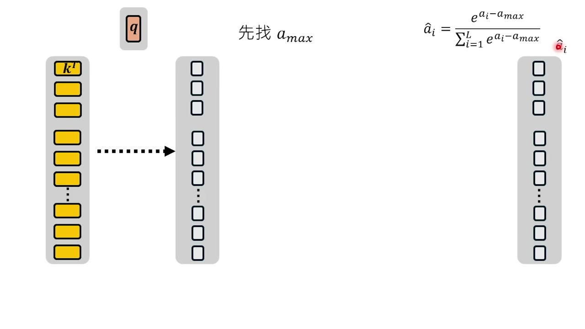

標準 Attention 把 Q、K 放在倉庫，分 chunk 搬到工作台計算內積分數 $a_i$。因工作台容不下全部分數，中間結果需反覆寫回倉庫，再為 Softmax 讀回。

### Slide 12 — 分塊尋找最大值 ([Video](https://www.youtube.com/watch?v=vXb2QYOUzl4&t=1068s))

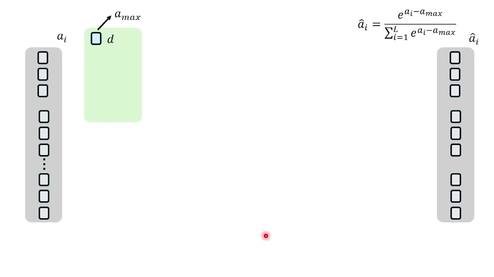

為數值穩定，Softmax 先求全域最大值 $a_{max}$。每次只讀一個 chunk 時，用工作台上的狀態 $d$ 保存目前看過的最大值，依序掃描即可取得全域最大值。

### Slide 13 — 穩定 Softmax 的最大值平移 ([Video](https://www.youtube.com/watch?v=vXb2QYOUzl4&t=1178s))

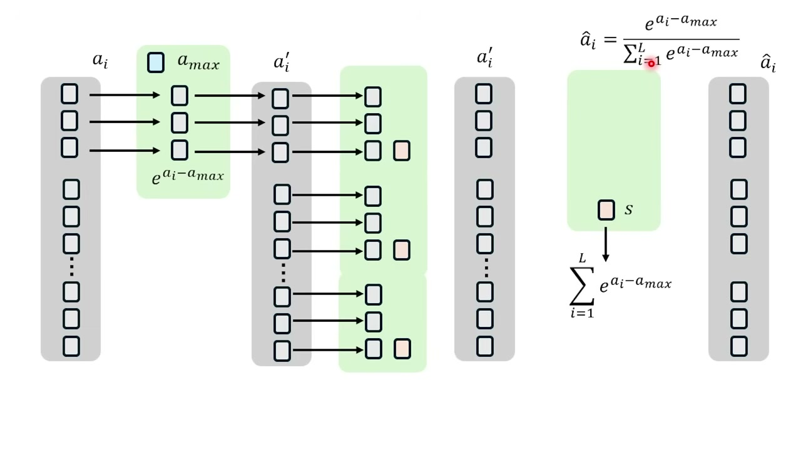

穩定 Softmax 使用 $a_i-a_{max}$，避免指數溢位：$\hat a_i=e^{a_i-a_{max}}/\sum_j e^{a_j-a_{max}}$。這不改變結果，因分子分母同乘相同常數。

### Slide 14 — 多次掃描求 Softmax 分母 ([Video](https://www.youtube.com/watch?v=vXb2QYOUzl4&t=1196s))

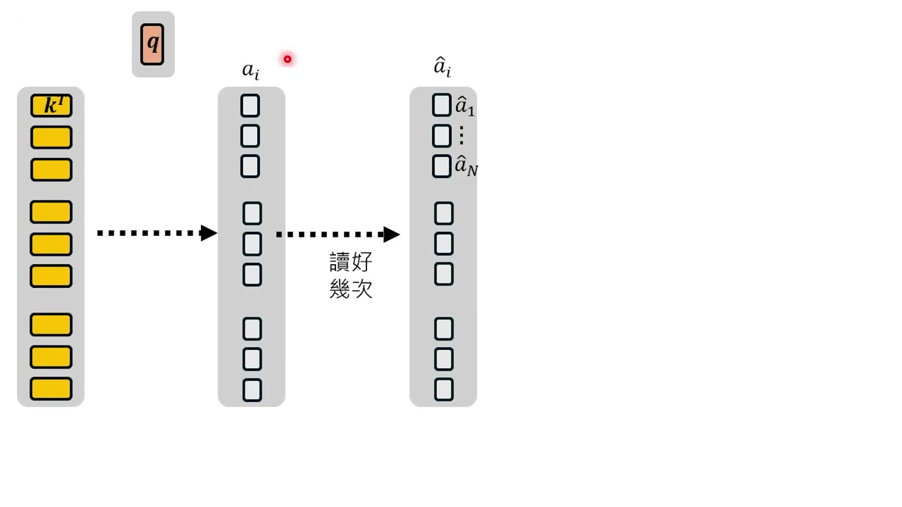

找到最大值後需再次掃描所有分數，計算 $a_i\prime=e^{a_i-a_{max}}$，並用累加器 $s$ 求分母。接著還要再讀寫以得到標準化權重，因此樸素實作的 HBM 往返很多。

### Slide 15 — 完整標準 Attention 的讀寫流程 ([Video](https://www.youtube.com/watch?v=vXb2QYOUzl4&t=1314s))

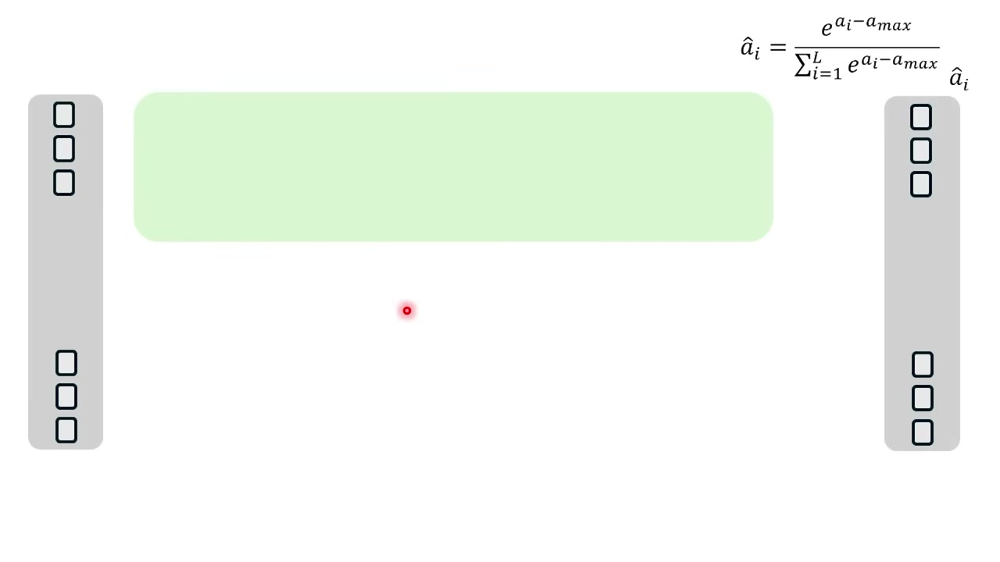

算出權重後仍要載入 V 做 weighted sum。整條流程先生成並存放分數，再多次掃描做 Softmax，最後讀取權重與 V；大量中間矩陣的 HBM I/O 主導延遲。

## 四、Online Softmax

### Slide 16 — Online Softmax：同時更新最大值與分母 ([Video](https://www.youtube.com/watch?v=vXb2QYOUzl4&t=1660s))

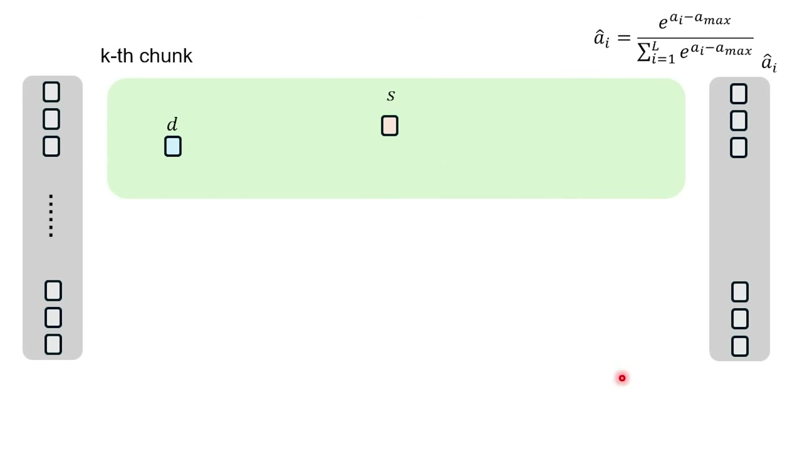

Online Softmax 可在一次掃描中同步維護目前最大值 $d_k$ 和對應尺度下的分母 $s_k$。當新 chunk 出現更大最大值時，先用指數比例重新縮放舊累加值，再加入新 chunk。

### Slide 17 — 第 k 個 chunk 的遞推公式 ([Video](https://www.youtube.com/watch?v=vXb2QYOUzl4&t=1806s))

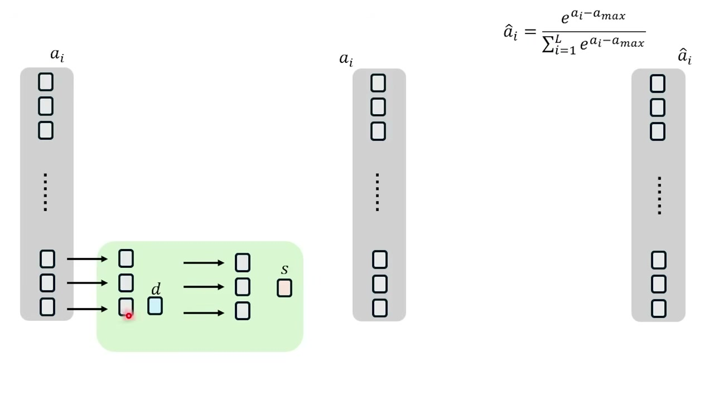

第 $k$ 塊的遞推為 $d_k=\max(d_{k-1},\max A_k)$，並以 $e^{d_{k-1}-d_k}$ 修正舊分母後加入 $\sum_{i\in k}e^{a_i-d_k}$。最後 $d$ 等於全域最大值，$s$ 等於穩定 Softmax 分母。

### Slide 18 — Online Softmax 仍需第二次讀取 ([Video](https://www.youtube.com/watch?v=vXb2QYOUzl4&t=1836s))

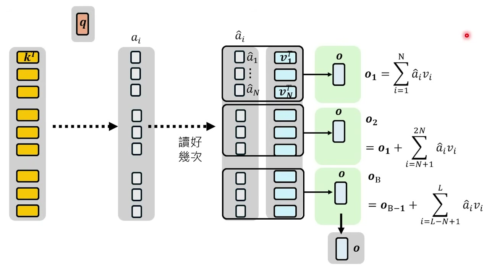

Online Softmax 把求最大值與分母合成一次讀取，但若仍要顯式產生全部 Attention weights，還要第二次讀取分數并逐塊正規化。它改善 I/O，卻尚未完成 FlashAttention。

## 五、FlashAttention 遞推

### Slide 19 — FlashAttention 的靈魂拷問 ([Video](https://www.youtube.com/watch?v=vXb2QYOUzl4&t=1942s))

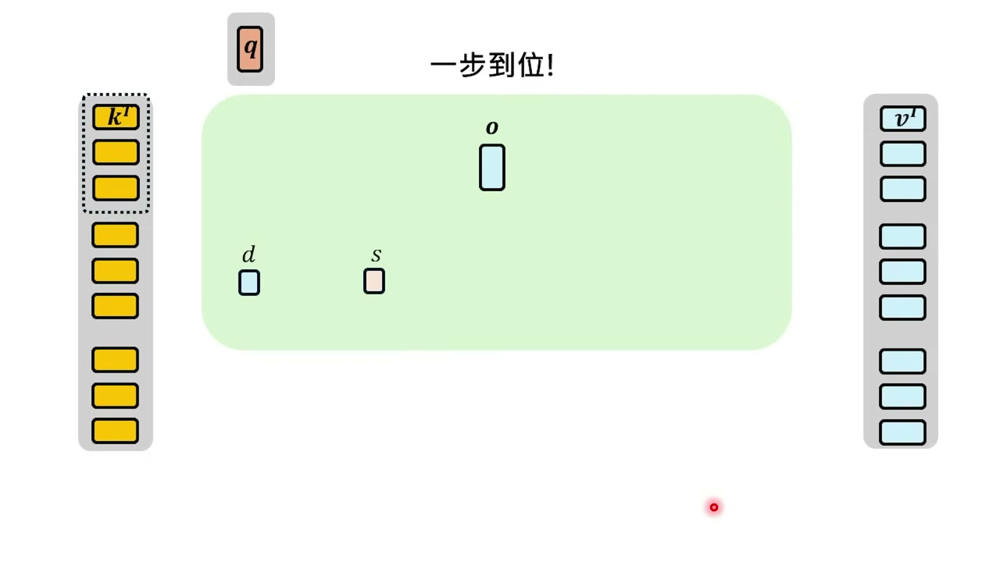

關鍵問題是：是否一定要先物化完整 Attention-weight 矩陣，才能計算對 V 的 weighted sum？FlashAttention 的答案是否定的；它在每一塊內直接累加輸出，跳過大型中間矩陣。

### Slide 20 — Q、K、V 上桌後一步得到輸出 ([Video](https://www.youtube.com/watch?v=vXb2QYOUzl4&t=2058s))

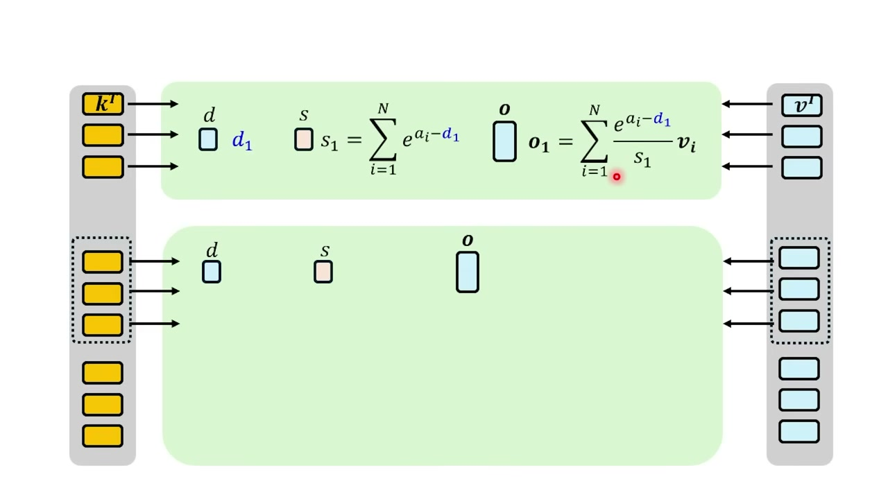

將 Q 與一塊 K 做內積後，立即更新最大值 $d$、分母 $s$，並載入同塊 V 形成局部輸出 $o$。Q、K、V 在 SRAM 上融合運算，完成後只保留小型狀態。

### Slide 21 — 更新下一區塊並修正舊結果 ([Video](https://www.youtube.com/watch?v=vXb2QYOUzl4&t=2246s))

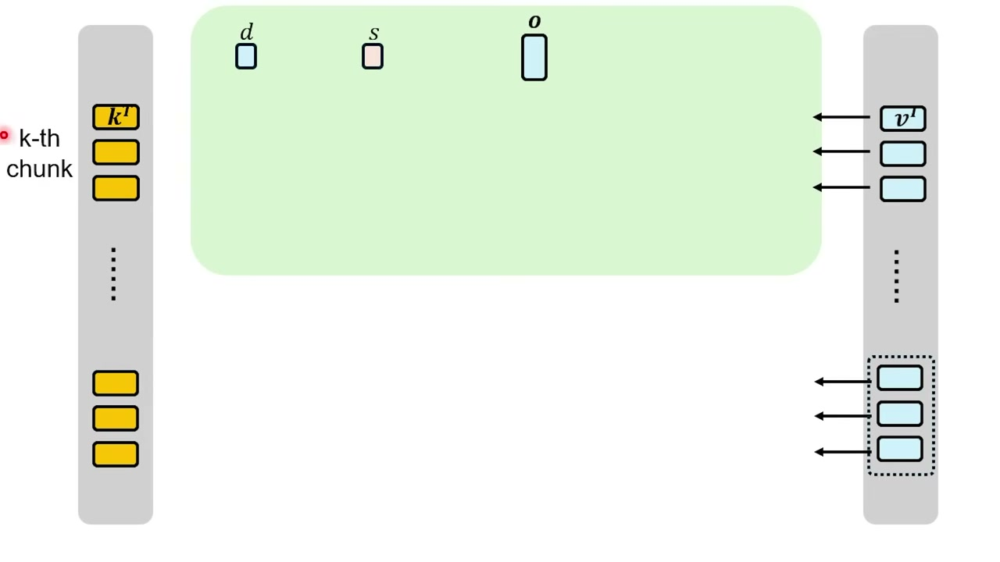

讀入下一塊時，新最大值可能改變尺度；因此不只修正舊分母，也必須按相同比例修正舊輸出，再加入新塊的加權 V。舊結果暫時不精確沒有關係，遞推會把它校正回正確尺度。

### Slide 22 — 分塊 FlashAttention 的完整資料流 ([Video](https://www.youtube.com/watch?v=vXb2QYOUzl4&t=2370s))

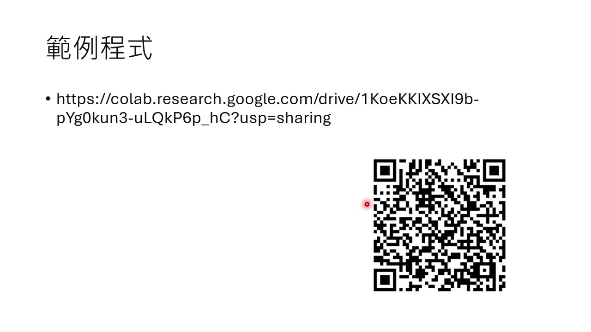

演算法按 K/V block 迭代，對每個 Q block 維護 $d$、$s$、$o$。每次只在 SRAM 中形成一小塊分數，融合 Softmax 與加權和，避免將完整 $N\times N$ 分數／權重矩陣寫入 HBM。

### Slide 23 — 第 k 個 chunk 的三個狀態 ([Video](https://www.youtube.com/watch?v=vXb2QYOUzl4&t=2378s))

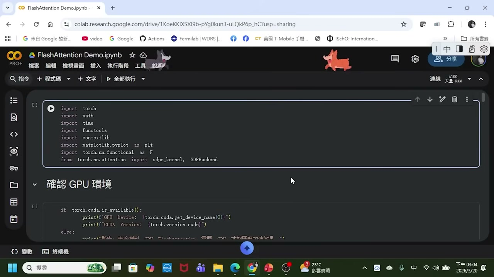

每個 chunk 更新三個狀態：running maximum $d_k$、running normalizer $s_k$、running output $o_k$。遞推的核心是用新舊最大值差的指數因子重新縮放歷史量，最終結果與標準 Attention 完全相同。

## 六、實作與效能

### Slide 24 — Colab 範例程式 ([Video](https://www.youtube.com/watch?v=vXb2QYOUzl4&t=2792s))

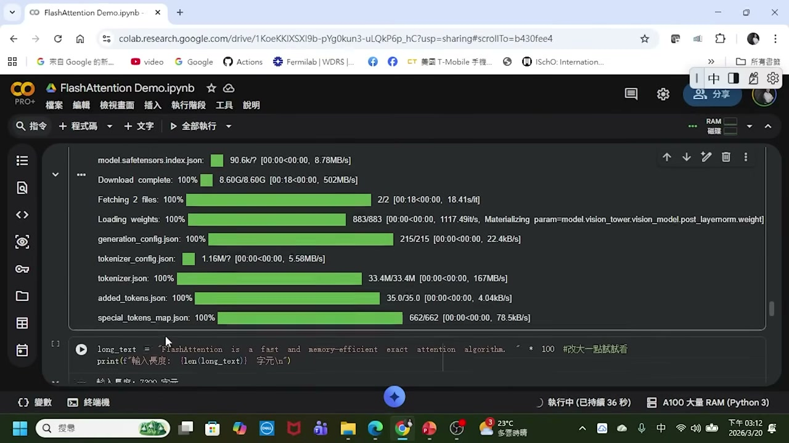

講者提供 Colab 範例，讓學生比較一般 eager Attention 與 FlashAttention。A100 顯示的 80 GB 是大型 HBM 倉庫；靠近運算單元的 SRAM 工作台仍只有十幾 MB 等級。

### Slide 25 — 長序列速度與記憶體比較 ([Video](https://www.youtube.com/watch?v=vXb2QYOUzl4&t=2808s))

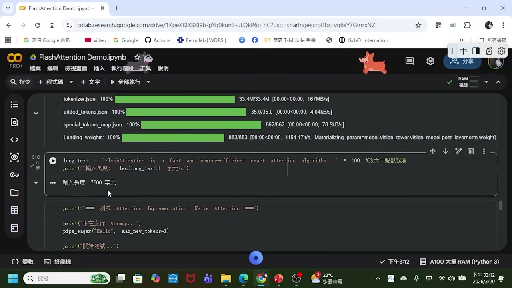

範例使用 Hugging Face pipeline 和長重複字串，分別建立 eager 與 FlashAttention 模型，測量不同序列長度的速度和顯存。序列越長，避免完整 Attention 中間矩陣的效益越明顯。

### Slide 26 — 極長序列與 CUDA OOM ([Video](https://www.youtube.com/watch?v=vXb2QYOUzl4&t=2940s))

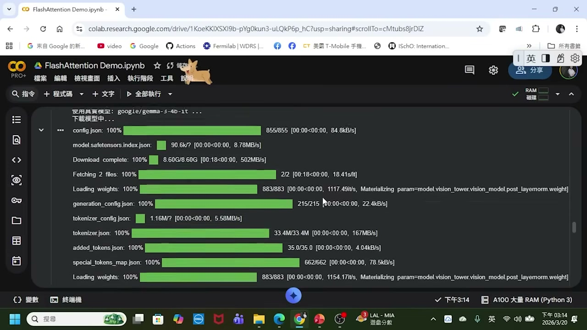

把輸入擴大到約 73 萬 tokens 時仍會 CUDA out of memory；此處爆掉的是容量雖大的 HBM，而不是 SRAM。FlashAttention 降低 Attention 中間量，卻不能消除模型權重與 KV Cache 等所有記憶體需求，後者留待下一講。

## 核心公式與結論

- FlashAttention 是 exact Attention：數學結果不變，改變的是計算順序與記憶體 I/O。
- Online Softmax 同時更新 running maximum 與 normalizer，最大值改變時須重新縮放舊累加量。
- FlashAttention 再把輸出累加器納入遞推，避免物化完整 Attention-weight 矩陣。
- 長序列下，HBM/SRAM 搬運常比浮點運算更昂貴；分塊與 kernel fusion 是主要加速來源。
- FlashAttention 不會消除所有記憶體問題；極長生成仍受模型權重與 KV Cache 限制。

